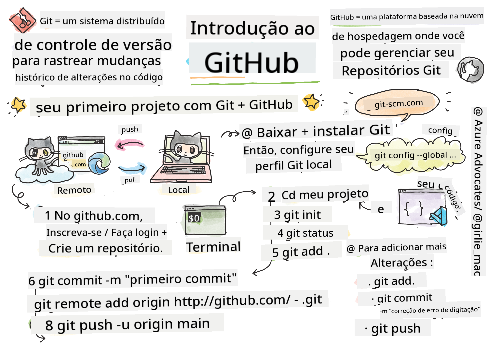
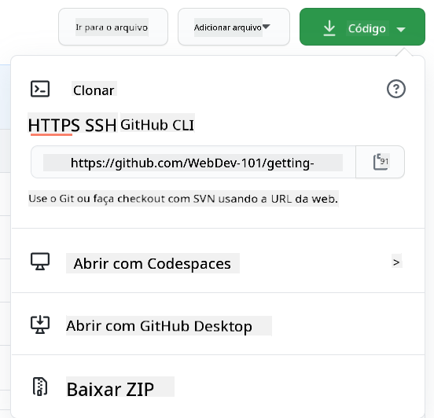

<!--
CO_OP_TRANSLATOR_METADATA:
{
  "original_hash": "ea65b75e488aa33a3cc5cb1c6c3f047a",
  "translation_date": "2025-10-03T13:53:29+00:00",
  "source_file": "1-getting-started-lessons/2-github-basics/README.md",
  "language_code": "br"
}
-->
# Introdução ao GitHub

Esta lição aborda os conceitos básicos do GitHub, uma plataforma para hospedar e gerenciar alterações no seu código.


> Sketchnote por [Tomomi Imura](https://twitter.com/girlie_mac)

## Questionário Pré-Aula
[Questionário pré-aula](https://ff-quizzes.netlify.app)

## Introdução

Nesta lição, abordaremos:

- como rastrear o trabalho que você faz na sua máquina
- como trabalhar em projetos com outras pessoas
- como contribuir para software de código aberto

### Pré-requisitos

Antes de começar, você precisará verificar se o Git está instalado. No terminal, digite: 
`git --version`

Se o Git não estiver instalado, [baixe o Git](https://git-scm.com/downloads). Em seguida, configure seu perfil local do Git no terminal:
* `git config --global user.name "seu-nome"`
* `git config --global user.email "seu-email"`

Para verificar se o Git já está configurado, você pode digitar:
`git config --list`

Você também precisará de uma conta no GitHub, um editor de código (como o Visual Studio Code) e precisará abrir seu terminal (ou prompt de comando).

Acesse [github.com](https://github.com/) e crie uma conta, se ainda não tiver uma, ou faça login e preencha seu perfil.

✅ O GitHub não é o único repositório de código no mundo; existem outros, mas o GitHub é o mais conhecido.

### Preparação

Você precisará de uma pasta com um projeto de código na sua máquina local (laptop ou PC) e de um repositório público no GitHub, que servirá como exemplo de como contribuir para os projetos de outras pessoas.

---

## Gerenciamento de código

Digamos que você tenha uma pasta localmente com algum projeto de código e queira começar a rastrear seu progresso usando o Git - o sistema de controle de versão. Algumas pessoas comparam usar o Git a escrever uma carta de amor para o seu "eu" do futuro. Ao ler suas mensagens de commit dias, semanas ou meses depois, você será capaz de lembrar por que tomou uma decisão ou "reverter" uma alteração - isso, claro, se você escrever boas "mensagens de commit".

### Tarefa: Criar um repositório e fazer commit do código  

> Assista ao vídeo
> 
> [](https://www.youtube.com/watch?v=9R31OUPpxU4)

1. **Criar repositório no GitHub**. No GitHub.com, na aba de repositórios ou na barra de navegação no canto superior direito, encontre o botão **novo repositório**.

   1. Dê um nome ao seu repositório (pasta).
   1. Selecione **criar repositório**.

1. **Navegar até sua pasta de trabalho**. No terminal, vá até a pasta (também conhecida como diretório) que você deseja começar a rastrear. Digite:

   ```bash
   cd [name of your folder]
   ```

1. **Inicializar um repositório Git**. No seu projeto, digite:

   ```bash
   git init
   ```

1. **Verificar status**. Para verificar o status do seu repositório, digite:

   ```bash
   git status
   ```

   A saída pode ser algo assim:

   ```output
   Changes not staged for commit:
   (use "git add <file>..." to update what will be committed)
   (use "git checkout -- <file>..." to discard changes in working directory)

        modified:   file.txt
        modified:   file2.txt
   ```

   Normalmente, o comando `git status` informa coisas como quais arquivos estão prontos para serem _salvos_ no repositório ou têm alterações que você pode querer persistir.

1. **Adicionar todos os arquivos para rastreamento**
   Isso também é chamado de preparar arquivos/adicionar arquivos à área de preparação.

   ```bash
   git add .
   ```

   O comando `git add` com o argumento `.` indica que todos os seus arquivos e alterações serão rastreados.

1. **Adicionar arquivos selecionados para rastreamento**

   ```bash
   git add [file or folder name]
   ```

   Isso nos ajuda a adicionar apenas arquivos selecionados à área de preparação quando não queremos fazer commit de todos os arquivos de uma vez.

1. **Remover todos os arquivos da área de preparação**

   ```bash
   git reset
   ```

   Este comando nos ajuda a remover todos os arquivos da área de preparação de uma vez.

1. **Remover um arquivo específico da área de preparação**

   ```bash
   git reset [file or folder name]
   ```

   Este comando nos ajuda a remover apenas um arquivo específico da área de preparação que não queremos incluir no próximo commit.

1. **Persistir seu trabalho**. Neste ponto, você adicionou os arquivos a uma chamada _área de preparação_. Um lugar onde o Git está rastreando seus arquivos. Para tornar a alteração permanente, você precisa _fazer commit_ dos arquivos. Para isso, crie um _commit_ com o comando `git commit`. Um _commit_ representa um ponto de salvamento no histórico do seu repositório. Digite o seguinte para criar um _commit_:

   ```bash
   git commit -m "first commit"
   ```

   Isso faz o commit de todos os seus arquivos, adicionando a mensagem "primeiro commit". Para mensagens de commit futuras, você vai querer ser mais descritivo na sua descrição para transmitir que tipo de alteração você fez.

1. **Conectar seu repositório Git local ao GitHub**. Um repositório Git é útil na sua máquina, mas em algum momento você vai querer ter um backup dos seus arquivos em algum lugar e também convidar outras pessoas para trabalhar com você no seu repositório. Um ótimo lugar para fazer isso é o GitHub. Lembre-se de que já criamos um repositório no GitHub, então a única coisa que precisamos fazer é conectar nosso repositório Git local ao GitHub. O comando `git remote add` fará exatamente isso. Digite o seguinte comando:

   > Nota: antes de digitar o comando, vá até a página do seu repositório no GitHub para encontrar a URL do repositório. Você usará essa URL no comando abaixo. Substitua ```https://github.com/username/repository_name.git``` pela URL do seu repositório no GitHub.

   ```bash
   git remote add origin https://github.com/username/repository_name.git
   ```

   Isso cria um _remote_, ou conexão, chamado "origin", apontando para o repositório do GitHub que você criou anteriormente.

1. **Enviar arquivos locais para o GitHub**. Até agora, você criou uma _conexão_ entre o repositório local e o repositório do GitHub. Vamos enviar esses arquivos para o GitHub com o seguinte comando `git push`, assim: 
   
   > Nota: o nome do seu branch pode ser diferente do padrão ```main```.

   ```bash
   git push -u origin main
   ```

   Isso envia seus commits no branch "main" para o GitHub. Configurar o branch `upstream`, incluindo `-u` no comando, estabelece um link entre seu branch local e o branch remoto, para que você possa simplesmente usar `git push` ou `git pull` sem especificar o nome do branch no futuro. O Git usará automaticamente o branch upstream e você não precisará especificar o nome do branch explicitamente em comandos futuros.

2. **Para adicionar mais alterações**. Se você quiser continuar fazendo alterações e enviando-as para o GitHub, só precisará usar os três comandos a seguir:

   ```bash
   git add .
   git commit -m "type your commit message here"
   git push
   ```

   > Dica: você também pode querer adotar um arquivo `.gitignore` para evitar que arquivos que você não deseja rastrear apareçam no GitHub - como aquele arquivo de anotações que você armazena na mesma pasta, mas que não tem lugar em um repositório público. Você pode encontrar modelos para arquivos `.gitignore` em [.gitignore templates](https://github.com/github/gitignore).

#### Mensagens de commit

Uma ótima linha de assunto para um commit no Git completa a seguinte frase:
Se aplicado, este commit irá <sua linha de assunto aqui>

Para o assunto, use o imperativo no presente: "alterar" em vez de "alterado" ou "altera". 
Assim como no assunto, no corpo (opcional) também use o imperativo no presente. O corpo deve incluir a motivação para a alteração e contrastar isso com o comportamento anterior. Você está explicando o `porquê`, não o `como`.

✅ Reserve alguns minutos para explorar o GitHub. Você consegue encontrar uma mensagem de commit realmente boa? E uma bem minimalista? Quais informações você acha que são mais importantes e úteis para transmitir em uma mensagem de commit?

### Tarefa: Colaborar

O principal motivo para colocar coisas no GitHub foi possibilitar a colaboração com outros desenvolvedores.

## Trabalhando em projetos com outras pessoas

> Assista ao vídeo
>
> [](https://www.youtube.com/watch?v=bFCM-PC3cu8)

No seu repositório, navegue até `Insights > Community` para ver como seu projeto se compara aos padrões recomendados para a comunidade.

   Aqui estão algumas coisas que podem melhorar seu repositório no GitHub:
   - **Descrição**. Você adicionou uma descrição para o seu projeto?
   - **README**. Você adicionou um README? O GitHub fornece orientações para escrever um [README](https://docs.github.com/articles/about-readmes/?WT.mc_id=academic-77807-sagibbon).
   - **Diretrizes de contribuição**. Seu projeto tem [diretrizes de contribuição](https://docs.github.com/articles/setting-guidelines-for-repository-contributors/?WT.mc_id=academic-77807-sagibbon)?
   - **Código de Conduta**. Um [Código de Conduta](https://docs.github.com/articles/adding-a-code-of-conduct-to-your-project/).
   - **Licença**. Talvez o mais importante, uma [licença](https://docs.github.com/articles/adding-a-license-to-a-repository/)?


Todos esses recursos beneficiarão a integração de novos membros da equipe. E essas são, geralmente, as coisas que novos contribuidores olham antes mesmo de olhar para o seu código, para descobrir se o seu projeto é o lugar certo para eles investirem seu tempo.

✅ Arquivos README, embora levem tempo para serem preparados, são frequentemente negligenciados por mantenedores ocupados. Você consegue encontrar um exemplo de um particularmente descritivo? Nota: existem algumas [ferramentas para ajudar a criar bons READMEs](https://www.makeareadme.com/) que você pode querer experimentar.

### Tarefa: Fazer merge de algum código

Documentos de contribuição ajudam as pessoas a contribuir para o projeto. Eles explicam quais tipos de contribuições você está procurando e como o processo funciona. Os contribuidores precisarão passar por uma série de etapas para poder contribuir para o seu repositório no GitHub:

1. **Fazer fork do seu repositório**. Você provavelmente vai querer que as pessoas _façam fork_ do seu projeto. Fazer fork significa criar uma réplica do seu repositório no perfil do GitHub delas.
1. **Clonar**. A partir daí, elas irão clonar o projeto para suas máquinas locais. 
1. **Criar um branch**. Você vai querer pedir que elas criem um _branch_ para o trabalho delas. 
1. **Focar a alteração em uma área**. Peça aos contribuidores que concentrem suas contribuições em uma coisa de cada vez - assim, as chances de você conseguir _fazer merge_ do trabalho deles são maiores. Imagine que eles escrevam uma correção de bug, adicionem um novo recurso e atualizem vários testes - e se você quiser, ou puder, implementar apenas 2 de 3, ou 1 de 3 alterações?

✅ Imagine uma situação em que branches são particularmente críticos para escrever e entregar um bom código. Quais casos de uso você consegue pensar?

> Nota: seja a mudança que você quer ver no mundo e crie branches para o seu próprio trabalho também. Qualquer commit que você fizer será feito no branch em que você está atualmente "checado". Use `git status` para ver em qual branch você está.

Vamos passar por um fluxo de trabalho de contribuidor. Suponha que o contribuidor já tenha feito _fork_ e _clonado_ o repositório, então ele tem um repositório Git pronto para ser trabalhado em sua máquina local:

1. **Criar um branch**. Use o comando `git branch` para criar um branch que conterá as alterações que ele pretende contribuir:

   ```bash
   git branch [branch-name]
   ```

1. **Mudar para o branch de trabalho**. Mude para o branch especificado e atualize o diretório de trabalho com `git switch`:

   ```bash
   git switch [branch-name]
   ```

1. **Fazer o trabalho**. Neste ponto, você quer adicionar suas alterações. Não se esqueça de informar ao Git sobre isso com os seguintes comandos:

   ```bash
   git add .
   git commit -m "my changes"
   ```

   Certifique-se de dar um bom nome ao seu commit, para o seu bem e para o mantenedor do repositório que você está ajudando.

1. **Combinar seu trabalho com o branch `main`**. Em algum momento, você termina o trabalho e quer combinar seu trabalho com o do branch `main`. O branch `main` pode ter mudado nesse meio tempo, então certifique-se de primeiro atualizá-lo para a versão mais recente com os seguintes comandos:

   ```bash
   git switch main
   git pull
   ```

   Neste ponto, você quer garantir que quaisquer _conflitos_, situações em que o Git não consegue facilmente _combinar_ as alterações, ocorram no seu branch de trabalho. Portanto, execute os seguintes comandos:

   ```bash
   git switch [branch_name]
   git merge main
   ```

   O comando `git merge main` trará todas as alterações do `main` para o seu branch. Esperançosamente, você pode simplesmente continuar. Caso contrário, o VS Code informará onde o Git está _confuso_ e você apenas altera os arquivos afetados para indicar qual conteúdo é o mais preciso.

   Para mudar para um branch diferente, use o comando moderno `git switch`:
   ```bash
   git switch [branch_name]

1. **Enviar seu trabalho para o GitHub**. Enviar seu trabalho para o GitHub significa duas coisas: enviar seu branch para o seu repositório e, em seguida, abrir um PR (Pull Request).

   ```bash
   git push --set-upstream origin [branch-name]
   ```

   O comando acima cria o branch no seu repositório que foi feito fork.
1. **Abra um PR**. Agora você vai querer abrir um PR. Para isso, navegue até o repositório que você fez o fork no GitHub. Você verá uma indicação no GitHub perguntando se deseja criar um novo PR. Clique nela e você será levado a uma interface onde pode alterar o título da mensagem de commit e dar uma descrição mais adequada. Agora, o mantenedor do repositório que você fez o fork verá este PR e, _dedos cruzados_, ele irá apreciar e _mesclar_ seu PR. Parabéns, você agora é um colaborador, yay :)

1. **Limpeza**. É considerado uma boa prática _limpar_ depois de mesclar com sucesso um PR. Você deve limpar tanto sua branch local quanto a branch que você enviou para o GitHub. Primeiro, vamos deletá-la localmente com o seguinte comando:

   ```bash
   git branch -d [branch-name]
   ```
  
   Certifique-se de ir à página do GitHub do repositório que você fez o fork e remover a branch remota que você acabou de enviar.

`Pull request` parece um termo estranho porque, na verdade, você quer enviar suas alterações para o projeto. Mas o mantenedor (dono do projeto) ou a equipe principal precisa considerar suas alterações antes de mesclá-las com a branch "main" do projeto. Então, você está realmente solicitando uma decisão de alteração de um mantenedor.

Um pull request é o lugar para comparar e discutir as diferenças introduzidas em uma branch com revisões, comentários, testes integrados e mais. Um bom pull request segue aproximadamente as mesmas regras de uma mensagem de commit. Você pode adicionar uma referência a um problema no rastreador de problemas, por exemplo, quando seu trabalho resolve um problema. Isso é feito usando um `#` seguido pelo número do problema. Por exemplo, `#97`.

🤞Dedos cruzados para que todos os testes passem e o(s) dono(s) do projeto mesclem suas alterações no projeto🤞

Atualize sua branch local de trabalho atual com todos os novos commits da branch remota correspondente no GitHub:

`git pull`

## Como contribuir para open source

Primeiro, vamos encontrar um repositório (ou **repo**) no GitHub que seja do seu interesse e para o qual você gostaria de contribuir com uma alteração. Você vai querer copiar seu conteúdo para sua máquina.

✅ Uma boa maneira de encontrar repositórios 'amigáveis para iniciantes' é [buscar pela tag 'good-first-issue'](https://github.blog/2020-01-22-browse-good-first-issues-to-start-contributing-to-open-source/).



Existem várias maneiras de copiar código. Uma delas é "clonar" o conteúdo do repositório, usando HTTPS, SSH ou o GitHub CLI (Interface de Linha de Comando).

Abra seu terminal e clone o repositório assim:  
`git clone https://github.com/ProjectURL`

Para trabalhar no projeto, mude para a pasta correta:  
`cd ProjectURL`

Você também pode abrir o projeto inteiro usando [Codespaces](https://github.com/features/codespaces), o editor de código integrado / ambiente de desenvolvimento em nuvem do GitHub, ou [GitHub Desktop](https://desktop.github.com/).

Por fim, você pode baixar o código em uma pasta compactada.

### Algumas coisas interessantes sobre o GitHub

Você pode dar estrela, seguir e/ou "fazer fork" de qualquer repositório público no GitHub. Você pode encontrar seus repositórios com estrela no menu suspenso no canto superior direito. É como adicionar aos favoritos, mas para código.

Os projetos têm um rastreador de problemas, geralmente no GitHub na aba "Issues", a menos que indicado de outra forma, onde as pessoas discutem problemas relacionados ao projeto. E a aba Pull Requests é onde as pessoas discutem e revisam alterações que estão em andamento.

Os projetos também podem ter discussões em fóruns, listas de e-mails ou canais de chat como Slack, Discord ou IRC.

✅ Dê uma olhada no seu novo repositório no GitHub e experimente algumas coisas, como editar configurações, adicionar informações ao seu repositório e criar um projeto (como um quadro Kanban). Há muito o que explorar!

---

## 🚀 Desafio

Trabalhe em parceria com um amigo no código um do outro. Crie um projeto colaborativo, faça fork do código, crie branches e mescle alterações.

## Quiz Pós-Aula  
[Quiz pós-aula](https://ff-quizzes.netlify.app/web/en/)

## Revisão e Autoestudo

Leia mais sobre [como contribuir para software open source](https://opensource.guide/how-to-contribute/#how-to-submit-a-contribution).

[Cheatsheet do Git](https://training.github.com/downloads/github-git-cheat-sheet/).

Pratique, pratique, pratique. O GitHub tem ótimos caminhos de aprendizado disponíveis via [skills.github.com](https://skills.github.com):

- [Primeira Semana no GitHub](https://skills.github.com/#first-week-on-github)

Você também encontrará cursos mais avançados.

## Tarefa

Complete [o curso Primeira Semana no GitHub](https://skills.github.com/#first-week-on-github)

---

**Aviso Legal**:  
Este documento foi traduzido utilizando o serviço de tradução por IA [Co-op Translator](https://github.com/Azure/co-op-translator). Embora nos esforcemos para garantir a precisão, é importante estar ciente de que traduções automatizadas podem conter erros ou imprecisões. O documento original em seu idioma nativo deve ser considerado a fonte oficial. Para informações críticas, recomenda-se a tradução profissional realizada por humanos. Não nos responsabilizamos por quaisquer mal-entendidos ou interpretações equivocadas decorrentes do uso desta tradução.