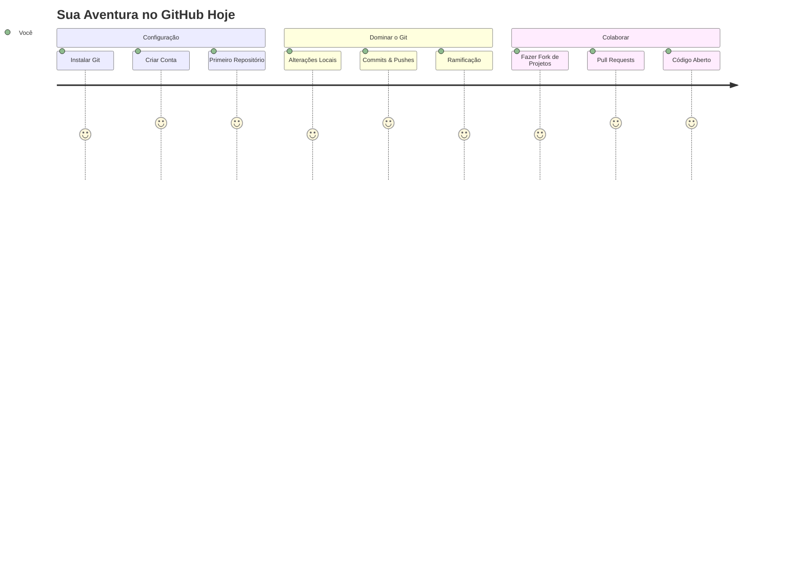
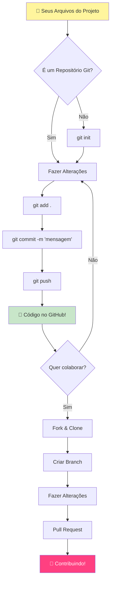
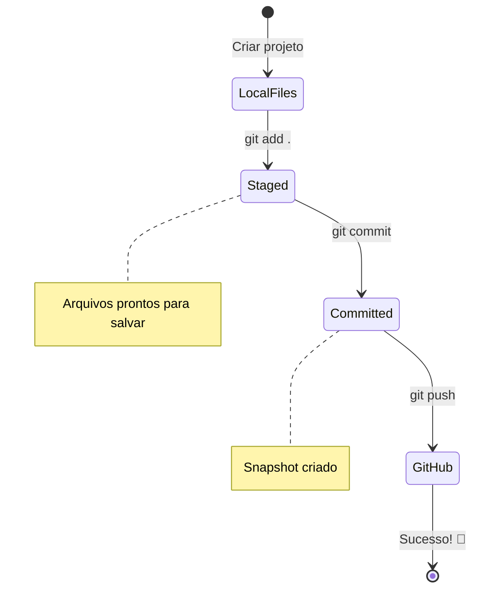
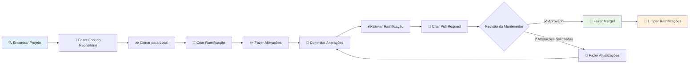
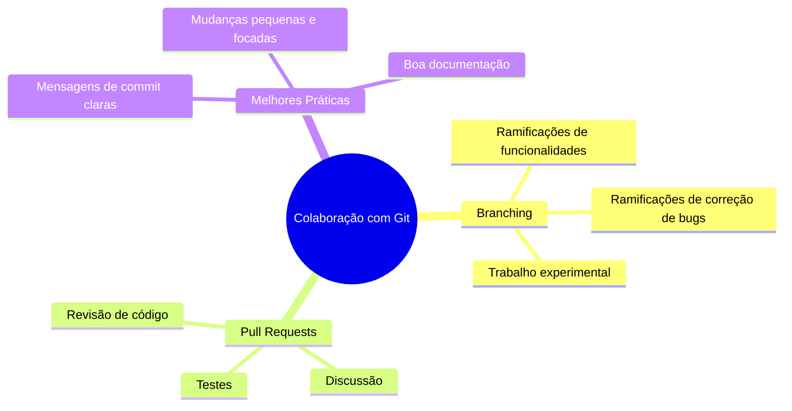
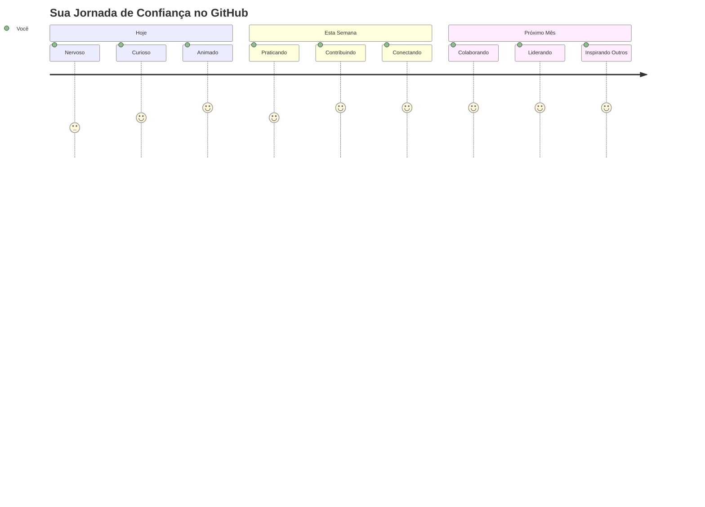

<!--
CO_OP_TRANSLATOR_METADATA:
{
  "original_hash": "5c383cc2cc23bb164b06417d1c107a44",
  "translation_date": "2025-11-25T17:38:48+00:00",
  "source_file": "1-getting-started-lessons/2-github-basics/README.md",
  "language_code": "br"
}
-->
# Introdução ao GitHub

Olá, futuro desenvolvedor! 👋 Pronto para se juntar a milhões de programadores ao redor do mundo? Estou genuinamente animado para apresentar o GitHub a você – pense nele como uma rede social para programadores, mas em vez de compartilhar fotos do seu almoço, compartilhamos código e construímos coisas incríveis juntos!

Aqui está algo que me deixa impressionado: todos os aplicativos no seu celular, todos os sites que você visita e a maioria das ferramentas que você aprenderá a usar foram criados por equipes de desenvolvedores colaborando em plataformas como o GitHub. Aquele aplicativo de música que você adora? Alguém como você contribuiu para ele. Aquele jogo que você não consegue parar de jogar? Sim, provavelmente foi construído com colaboração no GitHub. E agora VOCÊ vai aprender como fazer parte dessa comunidade incrível!

Eu sei que isso pode parecer muito no começo – eu mesmo lembro de olhar para minha primeira página no GitHub e pensar "O que tudo isso significa?". Mas aqui está o segredo: todo desenvolvedor começou exatamente onde você está agora. Até o final desta lição, você terá seu próprio repositório no GitHub (pense nele como sua vitrine pessoal de projetos na nuvem) e saberá como salvar seu trabalho, compartilhá-lo com outros e até contribuir para projetos que milhões de pessoas usam.

Vamos embarcar nessa jornada juntos, passo a passo. Sem pressa, sem pressão – apenas você, eu e algumas ferramentas muito legais que estão prestes a se tornar suas melhores amigas!


> Sketchnote por [Tomomi Imura](https://twitter.com/girlie_mac)


## Quiz Pré-Aula
[Quiz pré-aula](https://ff-quizzes.netlify.app)

## Introdução

Antes de mergulharmos nas partes realmente empolgantes, vamos preparar seu computador para um pouco de mágica do GitHub! Pense nisso como organizar seus materiais de arte antes de criar uma obra-prima – ter as ferramentas certas prontas torna tudo muito mais fácil e divertido.

Vou te guiar por cada etapa de configuração pessoalmente, e prometo que não é tão intimidador quanto parece à primeira vista. Se algo não fizer sentido de imediato, isso é completamente normal! Eu lembro de configurar meu primeiro ambiente de desenvolvimento e sentir como se estivesse tentando decifrar hieróglifos antigos. Todo desenvolvedor já esteve exatamente onde você está agora, se perguntando se está fazendo certo. Spoiler: se você está aqui aprendendo, já está fazendo certo! 🌟

Nesta lição, vamos abordar:

- como rastrear o trabalho que você faz no seu computador
- como trabalhar em projetos com outras pessoas
- como contribuir para software de código aberto

### Pré-requisitos

Vamos preparar seu computador para um pouco de mágica do GitHub! Não se preocupe – essa configuração é algo que você só precisa fazer uma vez, e depois estará pronto para toda a sua jornada de programação.

Certo, vamos começar com a base! Primeiro, precisamos verificar se o Git já está instalado no seu computador. O Git é basicamente como ter um assistente superinteligente que lembra de cada mudança que você faz no seu código – muito melhor do que apertar Ctrl+S freneticamente a cada dois segundos (todos já passamos por isso!).

Vamos ver se o Git já está instalado digitando este comando mágico no terminal:
`git --version`

Se o Git ainda não estiver lá, sem problemas! Basta acessar [download Git](https://git-scm.com/downloads) e baixá-lo. Depois de instalá-lo, precisamos apresentar o Git a você adequadamente:

> 💡 **Configuração Inicial**: Esses comandos dizem ao Git quem você é. Essas informações serão anexadas a cada commit que você fizer, então escolha um nome e e-mail com os quais você se sinta confortável em compartilhar publicamente.

```bash
git config --global user.name "your-name"
git config --global user.email "your-email"
```

Para verificar se o Git já está configurado, você pode digitar:
```bash
git config --list
```

Você também precisará de uma conta no GitHub, um editor de código (como o Visual Studio Code) e abrir seu terminal (ou prompt de comando).

Acesse [github.com](https://github.com/) e crie uma conta, se ainda não tiver uma, ou faça login e preencha seu perfil.

💡 **Dica moderna**: Considere configurar [chaves SSH](https://docs.github.com/en/authentication/connecting-to-github-with-ssh) ou usar [GitHub CLI](https://cli.github.com/) para facilitar a autenticação sem senhas.

✅ O GitHub não é o único repositório de código no mundo; existem outros, mas o GitHub é o mais conhecido.

### Preparação

Você precisará de uma pasta com um projeto de código no seu computador (laptop ou PC) e de um repositório público no GitHub, que servirá como exemplo de como contribuir para os projetos de outras pessoas.

### Mantendo Seu Código Seguro

Vamos falar sobre segurança por um momento – mas não se preocupe, não vamos te sobrecarregar com coisas assustadoras! Pense nessas práticas de segurança como trancar seu carro ou sua casa. São hábitos simples que se tornam naturais e mantêm seu trabalho protegido.

Vamos mostrar as maneiras modernas e seguras de trabalhar com o GitHub desde o início. Assim, você desenvolverá bons hábitos que serão úteis ao longo de sua carreira de programação.

Ao trabalhar com o GitHub, é importante seguir as melhores práticas de segurança:

| Área de Segurança | Melhor Prática | Por Que É Importante |
|-------------------|----------------|-----------------------|
| **Autenticação** | Use chaves SSH ou Tokens de Acesso Pessoal | Senhas são menos seguras e estão sendo substituídas |
| **Autenticação em Dois Fatores** | Ative 2FA na sua conta do GitHub | Adiciona uma camada extra de proteção à conta |
| **Segurança do Repositório** | Nunca faça commit de informações sensíveis | Chaves de API e senhas nunca devem estar em repositórios públicos |
| **Gerenciamento de Dependências** | Ative o Dependabot para atualizações | Mantém suas dependências seguras e atualizadas |

> ⚠️ **Lembrete Crítico de Segurança**: Nunca faça commit de chaves de API, senhas ou outras informações sensíveis em qualquer repositório. Use variáveis de ambiente e arquivos `.gitignore` para proteger dados sensíveis.

**Configuração Moderna de Autenticação:**

```bash
# Gerar chave SSH (algoritmo moderno ed25519)
ssh-keygen -t ed25519 -C "your_email@example.com"

# Configurar o Git para usar SSH
git remote set-url origin git@github.com:username/repository.git
```

> 💡 **Dica Pro**: Chaves SSH eliminam a necessidade de digitar senhas repetidamente e são mais seguras do que métodos tradicionais de autenticação.

---

## Gerenciando Seu Código Como um Profissional

Agora, é aqui que as coisas ficam realmente emocionantes! 🎉 Vamos aprender como rastrear e gerenciar seu código como os profissionais fazem, e honestamente, essa é uma das minhas coisas favoritas de ensinar porque é uma mudança de jogo.

Imagine isso: você está escrevendo uma história incrível e quer acompanhar cada rascunho, cada edição brilhante e cada momento de "espera, isso é genial!" ao longo do caminho. É exatamente isso que o Git faz pelo seu código! É como ter o caderno mais incrível que viaja no tempo e lembra de TUDO – cada tecla pressionada, cada mudança, cada momento de "ops, isso quebrou tudo" que você pode desfazer instantaneamente.

Vou ser honesto – isso pode parecer esmagador no começo. Quando comecei, pensei "Por que não posso simplesmente salvar meus arquivos como de costume?". Mas confie em mim: uma vez que o Git fizer sentido para você (e vai!), você terá um daqueles momentos de lâmpada acesa em que pensa "Como eu CONSEGUIA programar sem isso?". É como descobrir que você pode voar quando estava andando por aí a vida toda!

Digamos que você tenha uma pasta local com algum projeto de código e queira começar a rastrear seu progresso usando o git - o sistema de controle de versão. Algumas pessoas comparam usar git a escrever uma carta de amor para seu futuro eu. Ao ler suas mensagens de commit dias, semanas ou meses depois, você será capaz de lembrar por que tomou uma decisão ou "reverter" uma mudança – isso é, quando você escreve boas "mensagens de commit".


### Tarefa: Crie Seu Primeiro Repositório!

> 🎯 **Sua Missão (e estou tão animado por você!)**: Vamos criar seu primeiro repositório no GitHub juntos! Quando terminarmos aqui, você terá seu próprio cantinho na internet onde seu código vive, e terá feito seu primeiro "commit" (isso é como os desenvolvedores chamam salvar seu trabalho de uma maneira muito inteligente).
>
> Este é um momento realmente especial – você está prestes a se juntar oficialmente à comunidade global de desenvolvedores! Eu ainda lembro da emoção de criar meu primeiro repositório e pensar "Uau, eu realmente estou fazendo isso!"

Vamos percorrer essa aventura juntos, passo a passo. Leve seu tempo em cada parte – não há prêmio por apressar, e prometo que cada etapa fará sentido. Lembre-se, todo superastro da programação que você admira já esteve exatamente onde você está, prestes a criar seu primeiro repositório. Que incrível, né?

> Confira o vídeo
> 
> [](https://www.youtube.com/watch?v=9R31OUPpxU4)

**Vamos Fazer Isso Juntos:**

1. **Crie seu repositório no GitHub**. Acesse GitHub.com e procure aquele botão verde brilhante **New** (ou o sinal **+** no canto superior direito). Clique nele e selecione **New repository**.

   Aqui está o que fazer:
   1. Dê um nome ao seu repositório – escolha algo significativo para você!
   1. Adicione uma descrição, se quiser (isso ajuda os outros a entenderem sobre o que é seu projeto)
   1. Decida se quer que ele seja público (todos podem ver) ou privado (apenas para você)
   1. Recomendo marcar a caixa para adicionar um arquivo README – é como a página inicial do seu projeto
   1. Clique em **Create repository** e comemore – você acabou de criar seu primeiro repositório! 🎉

2. **Navegue até sua pasta de projeto**. Agora vamos abrir seu terminal (não se preocupe, não é tão assustador quanto parece!). Precisamos dizer ao seu computador onde estão os arquivos do seu projeto. Digite este comando:

   ```bash
   cd [name of your folder]
   ```

   **O que estamos fazendo aqui:**
   - Basicamente estamos dizendo "Ei, computador, me leve até minha pasta de projeto"
   - Isso é como abrir uma pasta específica na sua área de trabalho, mas estamos fazendo isso com comandos de texto
   - Substitua `[nome da sua pasta]` pelo nome real da sua pasta de projeto

3. **Transforme sua pasta em um repositório Git**. Aqui é onde a mágica acontece! Digite:

   ```bash
   git init
   ```

   **Aqui está o que acabou de acontecer (coisas bem legais!):**
   - O Git acabou de criar uma pasta oculta `.git` no seu projeto – você não verá, mas ela está lá!
   - Sua pasta regular agora é um "repositório" que pode rastrear cada mudança que você fizer
   - Pense nisso como dar superpoderes à sua pasta para lembrar de tudo

4. **Verifique o que está acontecendo**. Vamos ver o que o Git pensa sobre seu projeto agora:

   ```bash
   git status
   ```

   **Entendendo o que o Git está te dizendo:**
   
   Você pode ver algo que se parece com isso:

   ```output
   Changes not staged for commit:
   (use "git add <file>..." to update what will be committed)
   (use "git restore <file>..." to discard changes in working directory)

        modified:   file.txt
        modified:   file2.txt
   ```

   **Não entre em pânico! Aqui está o que isso significa:**
   - Arquivos em **vermelho** são arquivos que têm mudanças, mas ainda não estão prontos para serem salvos
   - Arquivos em **verde** (quando você os vir) estão prontos para serem salvos
   - O Git está sendo útil ao te dizer exatamente o que você pode fazer a seguir

   > 💡 **Dica Pro**: O comando `git status` é seu melhor amigo! Use-o sempre que estiver confuso sobre o que está acontecendo. É como perguntar ao Git "Ei, qual é a situação agora?"

5. **Prepare seus arquivos para salvar** (isso é chamado de "staging"):

   ```bash
   git add .
   ```

   **O que acabamos de fazer:**
   - Dissemos ao Git "Ei, quero incluir TODOS os meus arquivos no próximo salvamento"
   - O `.` é como dizer "tudo nesta pasta"
   - Agora seus arquivos estão "preparados" e prontos para o próximo passo

   **Quer ser mais seletivo?** Você pode adicionar apenas arquivos específicos:

   ```bash
   git add [file or folder name]
   ```

   **Por que você pode querer fazer isso?**
   - Às vezes você quer salvar mudanças relacionadas juntas
   - Isso ajuda a organizar seu trabalho em partes lógicas
   - Facilita entender o que mudou e quando

   **Mudou de ideia?** Sem problemas! Você pode remover arquivos da preparação assim:

   ```bash
   # Desfazer a preparação de tudo
   git reset
   
   # Desfazer a preparação de apenas um arquivo
   git reset [file name]
   ```

   Não se preocupe – isso não apaga seu trabalho, apenas tira os arquivos da "pilha pronta para salvar".

6. **Salve seu trabalho permanentemente** (fazendo seu primeiro commit!):

   ```bash
   git commit -m "first commit"
   ```

   **🎉 Parabéns! Você acabou de fazer seu primeiro commit!**
   
   **Aqui está o que acabou de acontecer:**
   - O Git tirou um "instantâneo" de todos os arquivos preparados neste exato momento
   - Sua mensagem de commit "first commit" explica sobre o que é este ponto de salvamento
   - O Git deu a este instantâneo um ID único para que você sempre possa encontrá-lo depois
   - Você oficialmente começou a rastrear o histórico do seu projeto!

   > 💡 **Mensagens de commit futuras**: Para seus próximos commits, seja mais descritivo! Em vez de "atualizei coisas", tente "Adicionei formulário de contato à página inicial" ou "Corrigi bug no menu de navegação". Seu futuro eu vai te agradecer!

7. **Conecte seu projeto local ao GitHub**. Agora, seu projeto existe apenas no seu computador. Vamos conectá-lo ao seu repositório no GitHub para que você possa compartilhá-lo com o mundo!

   Primeiro, vá até a página do seu repositório no GitHub e copie a URL. Depois volte aqui e digite:

   ```bash
   git remote add origin https://github.com/username/repository_name.git
   ```
   
   (Substitua essa URL pela URL real do seu repositório!)

   **O que acabamos de fazer:**
   - Criamos uma conexão entre o seu projeto local e o seu repositório no GitHub
   - "Origin" é apenas um apelido para o seu repositório no GitHub – é como adicionar um contato no seu telefone
   - Agora o seu Git local sabe para onde enviar seu código quando você estiver pronto para compartilhá-lo

   💡 **Forma mais fácil**: Se você tiver o GitHub CLI instalado, pode fazer isso com um único comando:
   ```bash
   gh repo create my-repo --public --push --source=.
   ```

8. **Envie seu código para o GitHub** (o grande momento!):

   ```bash
   git push -u origin main
   ```

   **🚀 É isso! Você está enviando seu código para o GitHub!**
   
   **O que está acontecendo:**
   - Seus commits estão viajando do seu computador para o GitHub
   - A flag `-u` configura uma conexão permanente para que futuros envios sejam mais fáceis
   - "main" é o nome do seu branch principal (como a pasta principal)
   - Depois disso, você pode simplesmente digitar `git push` para futuros uploads!

   💡 **Nota rápida**: Se o seu branch tiver outro nome (como "master"), use esse nome. Você pode verificar com `git branch --show-current`.

9. **Seu novo ritmo diário de codificação** (é aqui que fica viciante!):

   A partir de agora, sempre que você fizer alterações no seu projeto, você seguirá esta dança simples de três passos:

   ```bash
   git add .
   git commit -m "describe what you changed"
   git push
   ```

   **Isso se torna o coração da sua codificação:**
   - Faça alterações incríveis no seu código ✨
   - Prepare-as com `git add` ("Ei Git, preste atenção nessas mudanças!")
   - Salve-as com `git commit` e uma mensagem descritiva (o você do futuro vai te agradecer!)
   - Compartilhe com o mundo usando `git push` 🚀
   - Repita – sério, isso se torna tão natural quanto respirar!

   Eu amo esse fluxo de trabalho porque é como ter vários pontos de salvamento em um videogame. Fez uma mudança que você adorou? Faça um commit! Quer tentar algo arriscado? Sem problemas – você sempre pode voltar ao último commit se algo der errado!

   > 💡 **Dica**: Você também pode adotar um arquivo `.gitignore` para evitar que arquivos que você não quer rastrear apareçam no GitHub – como aquele arquivo de anotações que você guarda na mesma pasta, mas que não tem lugar em um repositório público. Você pode encontrar modelos de arquivos `.gitignore` em [.gitignore templates](https://github.com/github/gitignore) ou criar um usando [gitignore.io](https://www.toptal.com/developers/gitignore).

### 🧠 **Primeiro Check-in no Repositório: Como Foi?**

**Tire um momento para celebrar e refletir:**
- Como foi ver seu código aparecer no GitHub pela primeira vez?
- Qual etapa foi a mais confusa e qual foi surpreendentemente fácil?
- Você consegue explicar a diferença entre `git add`, `git commit` e `git push` com suas próprias palavras?


> **Lembre-se**: Mesmo desenvolvedores experientes às vezes esquecem os comandos exatos. Tornar esse fluxo de trabalho algo automático leva prática – você está indo muito bem!

#### Fluxos de trabalho modernos com Git

Considere adotar estas práticas modernas:

- **Commits Convencionais**: Use um formato padronizado para mensagens de commit como `feat:`, `fix:`, `docs:`, etc. Saiba mais em [conventionalcommits.org](https://www.conventionalcommits.org/)
- **Commits atômicos**: Faça com que cada commit represente uma única mudança lógica
- **Commits frequentes**: Faça commits frequentemente com mensagens descritivas em vez de grandes commits esporádicos

#### Mensagens de commit

Uma ótima linha de assunto para um commit no Git completa a seguinte frase:
Se aplicado, este commit irá <sua linha de assunto aqui>

Para o assunto, use o imperativo no presente: "alterar" e não "alterado" nem "altera". 
Assim como no assunto, no corpo (opcional) também use o imperativo no presente. O corpo deve incluir a motivação para a mudança e contrastar isso com o comportamento anterior. Você está explicando o `porquê`, não o `como`.

✅ Tire alguns minutos para explorar o GitHub. Você consegue encontrar uma mensagem de commit realmente boa? E uma bem minimalista? Que informações você acha mais importantes e úteis de serem transmitidas em uma mensagem de commit?

## Trabalhando com Outros (A Parte Divertida!)

Segure o chapéu porque AQUI é onde o GitHub se torna absolutamente mágico! 🪄 Você já dominou a gestão do seu próprio código, mas agora vamos mergulhar na minha parte favorita – colaborar com pessoas incríveis de todo o mundo.

Imagine isso: você acorda amanhã e descobre que alguém em Tóquio melhorou seu código enquanto você dormia. Depois, alguém em Berlim corrige um bug que você estava tentando resolver. À tarde, um desenvolvedor em São Paulo adiciona um recurso que você nem tinha pensado. Isso não é ficção científica – é só mais uma terça-feira no universo do GitHub!

O que me deixa realmente empolgado é que as habilidades de colaboração que você está prestes a aprender? São os MESMOS fluxos de trabalho que equipes no Google, Microsoft e suas startups favoritas usam todos os dias. Você não está apenas aprendendo uma ferramenta legal – você está aprendendo a linguagem secreta que faz o mundo inteiro do software funcionar junto.

Sério, uma vez que você experimenta a emoção de ter alguém aceitando seu primeiro pull request, você entende por que os desenvolvedores são tão apaixonados por código aberto. É como fazer parte do maior e mais criativo projeto em equipe do mundo!

> Assista ao vídeo
>
> [](https://www.youtube.com/watch?v=bFCM-PC3cu8)

O principal motivo para colocar coisas no GitHub era possibilitar a colaboração com outros desenvolvedores.


No seu repositório, navegue até `Insights > Community` para ver como seu projeto se compara aos padrões recomendados da comunidade.

Quer fazer seu repositório parecer profissional e acolhedor? Vá até o seu repositório e clique em `Insights > Community`. Esse recurso incrível mostra como seu projeto se compara ao que a comunidade do GitHub considera "boas práticas de repositório".

> 🎯 **Fazendo Seu Projeto Brilhar**: Um repositório bem organizado com boa documentação é como ter uma vitrine limpa e acolhedora. Ele mostra que você se importa com seu trabalho e faz com que outros queiram contribuir!

**O que torna um repositório incrível:**

| O que Adicionar | Por que é Importante | O que Faz por Você |
|------------------|----------------------|--------------------|
| **Descrição** | A primeira impressão conta! | As pessoas sabem instantaneamente o que seu projeto faz |
| **README** | A página inicial do seu projeto | Como um guia amigável para novos visitantes |
| **Diretrizes de Contribuição** | Mostra que você aceita ajuda | As pessoas sabem exatamente como podem ajudar você |
| **Código de Conduta** | Cria um espaço amigável | Todos se sentem bem-vindos para participar |
| **Licença** | Clareza legal | Outros sabem como podem usar seu código |
| **Política de Segurança** | Mostra que você é responsável | Demonstra práticas profissionais |

> 💡 **Dica Pro**: O GitHub fornece modelos para todos esses arquivos. Ao criar um novo repositório, marque as caixas para gerar esses arquivos automaticamente.

**Recursos Modernos do GitHub para Explorar:**

🤖 **Automação & CI/CD:**
- **GitHub Actions** para testes e implantações automatizadas
- **Dependabot** para atualizações automáticas de dependências

💬 **Comunidade & Gerenciamento de Projetos:**
- **GitHub Discussions** para conversas comunitárias além de issues
- **GitHub Projects** para gerenciamento de projetos no estilo kanban
- **Regras de proteção de branch** para garantir padrões de qualidade de código

Todos esses recursos ajudarão na integração de novos membros da equipe. E essas são geralmente as coisas que novos contribuidores olham antes mesmo de olhar para o seu código, para descobrir se o seu projeto é o lugar certo para eles investirem seu tempo.

✅ Arquivos README, embora levem tempo para serem preparados, são frequentemente negligenciados por mantenedores ocupados. Você consegue encontrar um exemplo de um particularmente descritivo? Nota: existem algumas [ferramentas para ajudar a criar bons READMEs](https://www.makeareadme.com/) que você pode querer experimentar.

### Tarefa: Mesclar algum código

Documentos de contribuição ajudam as pessoas a contribuir com o projeto. Eles explicam quais tipos de contribuições você está procurando e como o processo funciona. Os contribuidores precisarão passar por uma série de etapas para poder contribuir com seu repositório no GitHub:

1. **Fazer um fork do seu repositório**. Você provavelmente vai querer que as pessoas _façam um fork_ do seu projeto. Fazer um fork significa criar uma réplica do seu repositório no perfil do GitHub delas.
1. **Clonar**. A partir daí, elas irão clonar o projeto para a máquina local.
1. **Criar um branch**. Você vai querer pedir que elas criem um _branch_ para o trabalho delas.
1. **Focar a mudança em uma área**. Peça aos contribuidores que concentrem suas contribuições em uma coisa de cada vez – assim, as chances de você _mesclar_ o trabalho deles são maiores. Imagine que eles escrevam uma correção de bug, adicionem um novo recurso e atualizem vários testes – e se você quiser, ou puder, implementar apenas 2 de 3, ou 1 de 3 mudanças?

✅ Imagine uma situação onde branches são particularmente críticos para escrever e entregar um bom código. Quais casos de uso você consegue pensar?

> Nota, seja a mudança que você quer ver no mundo, e crie branches para o seu próprio trabalho também. Quaisquer commits que você fizer serão feitos no branch em que você está atualmente "checado". Use `git status` para ver em qual branch você está.

Vamos passar por um fluxo de trabalho de contribuidor. Suponha que o contribuidor já tenha _feito um fork_ e _clonado_ o repositório, então ele tem um repositório Git pronto para ser trabalhado, na máquina local:

1. **Criar um branch**. Use o comando `git branch` para criar um branch que conterá as mudanças que ele pretende contribuir:

   ```bash
   git branch [branch-name]
   ```

   > 💡 **Abordagem Moderna**: Você também pode criar e alternar para o novo branch em um único comando:
   ```bash
   git switch -c [branch-name]
   ```

1. **Alternar para o branch de trabalho**. Altere para o branch especificado e atualize o diretório de trabalho com `git switch`:

   ```bash
   git switch [branch-name]
   ```

   > 💡 **Nota Moderna**: `git switch` é a substituição moderna para `git checkout` ao mudar de branch. É mais claro e seguro para iniciantes.

1. **Fazer o trabalho**. Neste ponto, você quer adicionar suas mudanças. Não se esqueça de informar ao Git com os seguintes comandos:

   ```bash
   git add .
   git commit -m "my changes"
   ```

   > ⚠️ **Qualidade da Mensagem de Commit**: Certifique-se de dar um bom nome ao seu commit, tanto para você quanto para o mantenedor do repositório que você está ajudando. Seja específico sobre o que você mudou!

1. **Combinar seu trabalho com o branch `main`**. Em algum momento, você termina o trabalho e quer combinar seu trabalho com o do branch `main`. O branch `main` pode ter mudado nesse meio tempo, então certifique-se de atualizá-lo para a versão mais recente com os seguintes comandos:

   ```bash
   git switch main
   git pull
   ```

   Neste ponto, você quer garantir que quaisquer _conflitos_, situações onde o Git não consegue facilmente _combinar_ as mudanças, ocorram no seu branch de trabalho. Portanto, execute os seguintes comandos:

   ```bash
   git switch [branch_name]
   git merge main
   ```

   O comando `git merge main` trará todas as mudanças do `main` para o seu branch. Com sorte, você pode simplesmente continuar. Se não, o VS Code mostrará onde o Git está _confuso_ e você apenas altera os arquivos afetados para dizer qual conteúdo é o mais preciso.

   💡 **Alternativa moderna**: Considere usar `git rebase` para um histórico mais limpo:
   ```bash
   git rebase main
   ```
   Isso reproduz seus commits no topo do branch `main` mais recente, criando um histórico linear.

1. **Envie seu trabalho para o GitHub**. Enviar seu trabalho para o GitHub significa duas coisas. Fazer o push do seu branch para o seu repositório e depois abrir um PR, Pull Request.

   ```bash
   git push --set-upstream origin [branch-name]
   ```

   O comando acima cria o branch no seu repositório forkado.

### 🤝 **Teste de Habilidades de Colaboração: Pronto para Trabalhar com Outros?**

**Vamos ver como você está se sentindo sobre colaboração:**
- A ideia de fork e pull requests faz sentido para você agora?
- Qual é uma coisa sobre trabalhar com branches que você quer praticar mais?
- Quão confortável você se sente em contribuir para o projeto de outra pessoa?


> **Impulsionador de confiança**: Todo desenvolvedor que você admira já ficou nervoso com seu primeiro pull request. A comunidade do GitHub é incrivelmente acolhedora para iniciantes!

1. **Abra um PR**. Em seguida, você quer abrir um PR. Você faz isso navegando até o repositório forkado no GitHub. Você verá uma indicação no GitHub perguntando se deseja criar um novo PR, clique nisso e você será levado a uma interface onde pode alterar o título da mensagem de commit, dar uma descrição mais adequada. Agora o mantenedor do repositório que você forkou verá este PR e _dedos cruzados_ ele apreciará e _mesclará_ seu PR. Agora você é um contribuidor, yay :)

   💡 **Dica Moderna**: Você também pode criar PRs usando o GitHub CLI:
   ```bash
   gh pr create --title "Your PR title" --body "Description of changes"
   ```

   🔧 **Melhores práticas para PRs**:
   - Vincule a issues relacionadas usando palavras-chave como "Fixes #123"
   - Adicione capturas de tela para mudanças na interface
   - Solicite revisores específicos
   - Use PRs de rascunho para trabalhos em andamento
   - Certifique-se de que todos os testes de CI passem antes de solicitar revisão
1. **Limpeza**. É considerado uma boa prática _limpar_ após você ter mesclado com sucesso um PR. Você deve limpar tanto sua branch local quanto a branch que você enviou para o GitHub. Primeiro, vamos deletá-la localmente com o seguinte comando:

   ```bash
   git branch -d [branch-name]
   ```

   Certifique-se de ir à página do GitHub para o repositório bifurcado e remover a branch remota que você acabou de enviar.

`Pull request` parece um termo estranho porque, na verdade, você quer enviar suas alterações para o projeto. Mas o mantenedor (dono do projeto) ou a equipe principal precisa considerar suas alterações antes de mesclá-las com a branch "main" do projeto, então você está realmente solicitando uma decisão de mudança de um mantenedor.

Um pull request é o lugar para comparar e discutir as diferenças introduzidas em uma branch com revisões, comentários, testes integrados e mais. Um bom pull request segue aproximadamente as mesmas regras de uma mensagem de commit. Você pode adicionar uma referência a um problema no rastreador de problemas, quando seu trabalho, por exemplo, resolve um problema. Isso é feito usando um `#` seguido pelo número do problema. Por exemplo, `#97`.

🤞Dedos cruzados para que todos os testes passem e o(s) dono(s) do projeto mesclem suas alterações no projeto🤞

Atualize sua branch local atual com todos os novos commits da branch remota correspondente no GitHub:

`git pull`

## Contribuindo para Open Source (Sua Chance de Fazer a Diferença!)

Está pronto para algo que vai absolutamente explodir sua mente? 🤯 Vamos falar sobre contribuir para projetos de código aberto – e estou arrepiado só de pensar em compartilhar isso com você!

Essa é sua chance de fazer parte de algo verdadeiramente extraordinário. Imagine melhorar as ferramentas que milhões de desenvolvedores usam todos os dias ou corrigir um bug em um aplicativo que seus amigos adoram. Isso não é apenas um sonho – é exatamente o que a contribuição para código aberto significa!

Aqui está o que me dá arrepios toda vez que penso nisso: cada ferramenta que você tem aprendido – seu editor de código, os frameworks que exploraremos, até mesmo o navegador que você está usando – começou com alguém exatamente como você fazendo sua primeira contribuição. Aquele desenvolvedor brilhante que criou sua extensão favorita do VS Code? Ele também foi um iniciante clicando em "create pull request" com as mãos trêmulas, assim como você está prestes a fazer.

E aqui está a parte mais bonita: a comunidade de código aberto é como o maior abraço coletivo da internet. A maioria dos projetos procura ativamente por novos colaboradores e tem problemas marcados como "good first issue" especificamente para pessoas como você! Os mantenedores genuinamente ficam animados quando veem novos colaboradores porque se lembram de seus próprios primeiros passos.

```mermaid
flowchart TD
    A[🔍 Explorar GitHub] --> B[🏷️ Encontrar "boa primeira issue"]
    B --> C[📖 Ler Diretrizes de Contribuição]
    C --> D[🍴 Fazer Fork do Repositório]
    D --> E[💻 Configurar Ambiente Local]
    E --> F[🌿 Criar Branch de Funcionalidade]
    F --> G[✨ Fazer Sua Contribuição]
    G --> H[🧪 Testar Suas Alterações]
    H --> I[📝 Escrever Commit Claro]
    I --> J[📤 Fazer Push & Criar PR]
    J --> K[💬 Interagir com Feedback]
    K --> L[🎉 Mergeado! Você é um Contribuidor!]
    L --> M[🌟 Encontrar Próxima Issue]
    
    style A fill:#e1f5fe
    style L fill:#c8e6c9
    style M fill:#fff59d
```
Você não está apenas aprendendo a programar aqui – está se preparando para se juntar a uma família global de criadores que acordam todos os dias pensando "Como podemos tornar o mundo digital um pouco melhor?" Bem-vindo ao clube! 🌟

Primeiro, vamos encontrar um repositório (ou **repo**) no GitHub que seja do seu interesse e ao qual você gostaria de contribuir com uma alteração. Você vai querer copiar seu conteúdo para sua máquina.

✅ Uma boa maneira de encontrar repositórios 'amigáveis para iniciantes' é [buscar pela tag 'good-first-issue'](https://github.blog/2020-01-22-browse-good-first-issues-to-start-contributing-to-open-source/).


Existem várias maneiras de copiar código. Uma delas é "clonar" o conteúdo do repositório, usando HTTPS, SSH ou o GitHub CLI (Interface de Linha de Comando).

Abra seu terminal e clone o repositório assim:
```bash
# Usando HTTPS
git clone https://github.com/ProjectURL

# Usando SSH (requer configuração de chave SSH)
git clone git@github.com:username/repository.git

# Usando GitHub CLI
gh repo clone username/repository
```

Para trabalhar no projeto, mude para a pasta correta:
`cd ProjectURL`

Você também pode abrir o projeto inteiro usando:
- **[GitHub Codespaces](https://github.com/features/codespaces)** - Ambiente de desenvolvimento na nuvem do GitHub com VS Code no navegador
- **[GitHub Desktop](https://desktop.github.com/)** - Um aplicativo GUI para operações Git  
- **[GitHub.dev](https://github.dev)** - Pressione a tecla `.` em qualquer repositório do GitHub para abrir o VS Code no navegador
- **VS Code** com a extensão GitHub Pull Requests

Por fim, você pode baixar o código em uma pasta compactada.

### Algumas coisas interessantes sobre o GitHub

Você pode dar estrela, assistir e/ou "forkar" qualquer repositório público no GitHub. Você pode encontrar seus repositórios estrelados no menu suspenso no canto superior direito. É como adicionar aos favoritos, mas para código.

Os projetos têm um rastreador de problemas, geralmente no GitHub na aba "Issues", a menos que indicado de outra forma, onde as pessoas discutem problemas relacionados ao projeto. E a aba Pull Requests é onde as pessoas discutem e revisam alterações que estão em andamento.

Os projetos também podem ter discussões em fóruns, listas de e-mails ou canais de chat como Slack, Discord ou IRC.

🔧 **Recursos modernos do GitHub**:
- **GitHub Discussions** - Fórum integrado para conversas da comunidade
- **GitHub Sponsors** - Apoie financeiramente os mantenedores  
- **Aba de segurança** - Relatórios de vulnerabilidade e avisos de segurança
- **Aba de ações** - Veja fluxos de trabalho automatizados e pipelines CI/CD
- **Aba de insights** - Análises sobre colaboradores, commits e saúde do projeto
- **Aba de projetos** - Ferramentas de gerenciamento de projetos integradas do GitHub

✅ Dê uma olhada no seu novo repositório do GitHub e experimente algumas coisas, como editar configurações, adicionar informações ao seu repositório, criar um projeto (como um quadro Kanban) e configurar GitHub Actions para automação. Há muito o que explorar!

---

## 🚀 Desafio 

Certo, é hora de colocar seus novos superpoderes do GitHub à prova! 🚀 Aqui está um desafio que vai fazer tudo se encaixar de forma super satisfatória:

Chame um amigo (ou aquele membro da família que sempre pergunta o que você está fazendo com "essas coisas de computador") e embarque juntos em uma aventura de codificação colaborativa! É aqui que a mágica acontece – crie um projeto, deixe eles forcarem, criem algumas branches e mesclem alterações como os profissionais que vocês estão se tornando.

Não vou mentir – vocês provavelmente vão rir em algum momento (especialmente quando ambos tentarem alterar a mesma linha), talvez coçar a cabeça em confusão, mas definitivamente terão aqueles momentos incríveis de "aha!" que fazem todo o aprendizado valer a pena. Além disso, há algo especial em compartilhar aquela primeira mesclagem bem-sucedida com outra pessoa – é como uma pequena celebração de quão longe vocês chegaram!

Ainda não tem um parceiro de codificação? Sem problemas! A comunidade do GitHub está cheia de pessoas incrivelmente acolhedoras que se lembram de como era ser novo. Procure repositórios com etiquetas "good first issue" – eles estão basicamente dizendo "Ei iniciantes, venham aprender conosco!" Que incrível, né?

## Quiz Pós-Aula
[Quiz pós-aula](https://ff-quizzes.netlify.app/web/en/)

## Revisão & Continue Aprendendo

Ufa! 🎉 Olha só você – acabou de dominar os fundamentos do GitHub como um verdadeiro campeão! Se sua cabeça está um pouco cheia agora, isso é completamente normal e, honestamente, um bom sinal. Você acabou de aprender ferramentas que levaram semanas para eu me sentir confortável quando comecei.

Git e GitHub são incrivelmente poderosos (tipo, muito poderosos), e todo desenvolvedor que conheço – incluindo aqueles que parecem magos agora – teve que praticar e tropeçar um pouco antes de tudo fazer sentido. O fato de você ter concluído esta lição significa que já está no caminho para dominar algumas das ferramentas mais importantes no kit de ferramentas de um desenvolvedor.

Aqui estão alguns recursos absolutamente fantásticos para ajudá-lo a praticar e se tornar ainda mais incrível:

- [Guia de contribuição para software de código aberto](https://opensource.guide/how-to-contribute/#how-to-submit-a-contribution) – Seu roteiro para fazer a diferença
- [Cheatsheet de Git](https://training.github.com/downloads/github-git-cheat-sheet/) – Tenha isso à mão para referência rápida!

E lembre-se: prática leva ao progresso, não à perfeição! Quanto mais você usar Git e GitHub, mais natural isso se tornará. O GitHub criou alguns cursos interativos incríveis que permitem que você pratique em um ambiente seguro:

- [Introdução ao GitHub](https://github.com/skills/introduction-to-github)
- [Comunicando-se usando Markdown](https://github.com/skills/communicate-using-markdown)  
- [GitHub Pages](https://github.com/skills/github-pages)
- [Gerenciando conflitos de mesclagem](https://github.com/skills/resolve-merge-conflicts)

**Sentindo-se aventureiro? Confira essas ferramentas modernas:**
- [Documentação do GitHub CLI](https://cli.github.com/manual/) – Para quando você quiser se sentir como um mago da linha de comando
- [Documentação do GitHub Codespaces](https://docs.github.com/en/codespaces) – Codifique na nuvem!
- [Documentação do GitHub Actions](https://docs.github.com/en/actions) – Automatize tudo
- [Melhores práticas de Git](https://www.atlassian.com/git/tutorials/comparing-workflows) – Eleve seu jogo de fluxo de trabalho 

## Desafio do Agente GitHub Copilot 🚀

Use o modo Agente para completar o seguinte desafio:

**Descrição:** Crie um projeto colaborativo de desenvolvimento web que demonstre o fluxo de trabalho completo do GitHub que você aprendeu nesta lição. Este desafio ajudará você a praticar criação de repositórios, recursos de colaboração e fluxos de trabalho modernos do Git em um cenário real.

**Prompt:** Crie um novo repositório público no GitHub para um projeto simples de "Recursos de Desenvolvimento Web". O repositório deve incluir um arquivo README.md bem estruturado listando ferramentas e recursos úteis de desenvolvimento web, organizados por categorias (HTML, CSS, JavaScript, etc.). Configure o repositório com padrões adequados da comunidade, incluindo uma licença, diretrizes de contribuição e um código de conduta. Crie pelo menos duas branches de recursos: uma para adicionar recursos de CSS e outra para recursos de JavaScript. Faça commits em cada branch com mensagens de commit descritivas, depois crie pull requests para mesclar as alterações de volta para a main. Ative recursos do GitHub como Issues, Discussions e configure um fluxo de trabalho básico do GitHub Actions para verificações automatizadas.

## Tarefa 

Sua missão, caso decida aceitá-la: Complete o curso [Introdução ao GitHub](https://github.com/skills/introduction-to-github) no GitHub Skills. Este curso interativo permitirá que você pratique tudo o que aprendeu em um ambiente seguro e guiado. Além disso, você ganhará um badge legal ao terminar! 🏅

**Sentindo-se pronto para mais desafios?**
- Configure autenticação SSH para sua conta do GitHub (nada de senhas!)
- Experimente usar o GitHub CLI para suas operações diárias com Git
- Crie um repositório com um fluxo de trabalho do GitHub Actions
- Explore o GitHub Codespaces abrindo este mesmo repositório em um editor baseado na nuvem

---

## 🚀 Sua Linha do Tempo de Domínio do GitHub

### ⚡ **O Que Você Pode Fazer nos Próximos 5 Minutos**
- [ ] Dê estrela neste repositório e em outros 3 projetos que te interessam
- [ ] Configure autenticação de dois fatores na sua conta do GitHub
- [ ] Crie um README simples para seu primeiro repositório
- [ ] Siga 5 desenvolvedores cujo trabalho te inspira

### 🎯 **O Que Você Pode Realizar Nesta Hora**
- [ ] Complete o quiz pós-aula e reflita sobre sua jornada no GitHub
- [ ] Configure chaves SSH para autenticação sem senha no GitHub
- [ ] Faça seu primeiro commit significativo com uma ótima mensagem de commit
- [ ] Explore a aba "Explore" do GitHub para descobrir projetos em alta
- [ ] Pratique forkar um repositório e fazer uma pequena alteração

### 📅 **Sua Aventura de Uma Semana no GitHub**
- [ ] Complete os cursos do GitHub Skills (Introdução ao GitHub, Markdown)
- [ ] Faça seu primeiro pull request para um projeto de código aberto
- [ ] Configure um site GitHub Pages para mostrar seu trabalho
- [ ] Participe de Discussões no GitHub sobre projetos que te interessam
- [ ] Crie um repositório com padrões adequados da comunidade (README, Licença, etc.)
- [ ] Experimente o GitHub Codespaces para desenvolvimento baseado na nuvem

### 🌟 **Sua Transformação de Um Mês**
- [ ] Contribua para 3 projetos diferentes de código aberto
- [ ] Mentore alguém novo no GitHub (retribua!)
- [ ] Configure fluxos de trabalho automatizados com GitHub Actions
- [ ] Construa um portfólio mostrando suas contribuições no GitHub
- [ ] Participe do Hacktoberfest ou eventos comunitários similares
- [ ] Torne-se mantenedor de seu próprio projeto para o qual outros contribuam

### 🎓 **Check-in Final de Domínio do GitHub**

**Celebre o quão longe você chegou:**
- Qual é sua coisa favorita sobre usar o GitHub?
- Qual recurso de colaboração te deixa mais animado?
- Quão confiante você se sente em contribuir para código aberto agora?
- Qual é o primeiro projeto para o qual você quer contribuir?


> 🌍 **Bem-vindo à comunidade global de desenvolvedores!** Agora você tem as ferramentas para colaborar com milhões de desenvolvedores ao redor do mundo. Sua primeira contribuição pode parecer pequena, mas lembre-se - todo grande projeto de código aberto começou com alguém fazendo seu primeiro commit. A questão não é se você fará um impacto, mas qual projeto incrível se beneficiará da sua perspectiva única primeiro! 🚀

Lembre-se: todo especialista já foi iniciante. Você consegue! 💪

---

<!-- CO-OP TRANSLATOR DISCLAIMER START -->
**Aviso Legal**:  
Este documento foi traduzido utilizando o serviço de tradução por IA [Co-op Translator](https://github.com/Azure/co-op-translator). Embora nos esforcemos para garantir a precisão, esteja ciente de que traduções automáticas podem conter erros ou imprecisões. O documento original em seu idioma nativo deve ser considerado a fonte oficial. Para informações críticas, recomenda-se a tradução profissional humana. Não nos responsabilizamos por quaisquer mal-entendidos ou interpretações incorretas decorrentes do uso desta tradução.
<!-- CO-OP TRANSLATOR DISCLAIMER END -->