<!--
CO_OP_TRANSLATOR_METADATA:
{
  "original_hash": "7f2c48e04754724123ea100a822765e5",
  "translation_date": "2025-11-04T00:02:18+00:00",
  "source_file": "1-getting-started-lessons/3-accessibility/README.md",
  "language_code": "br"
}
-->
# Criando Páginas Web Acessíveis

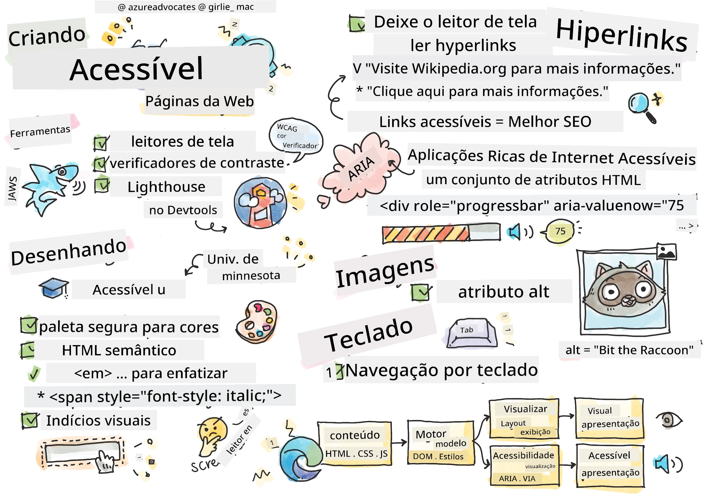
> Sketchnote por [Tomomi Imura](https://twitter.com/girlie_mac)

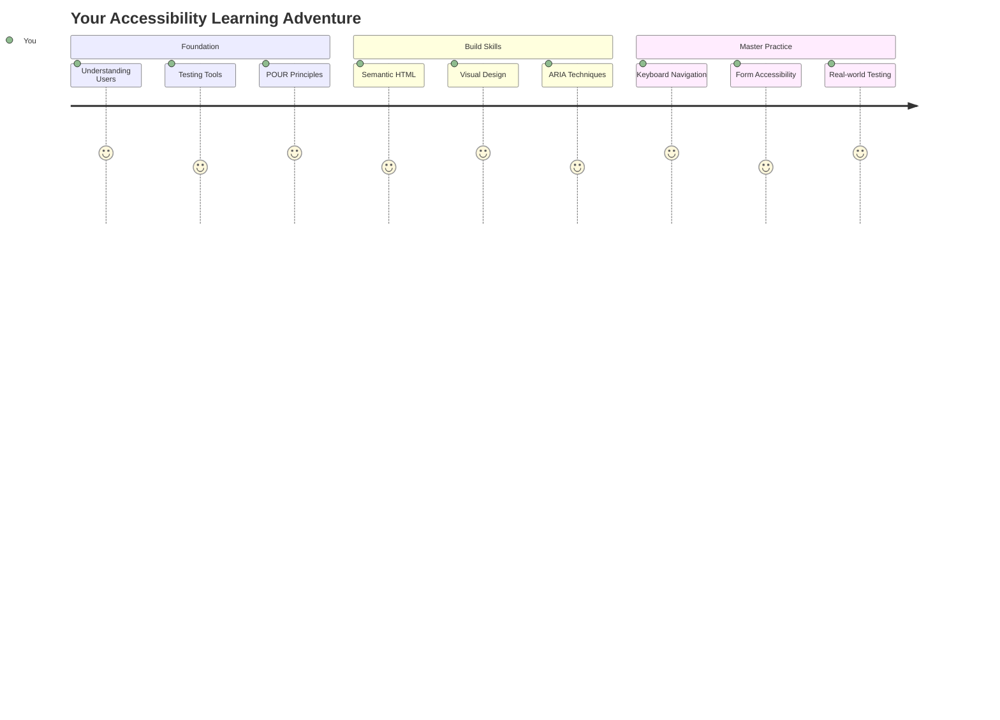

## Quiz Pré-Aula
[Quiz pré-aula](https://ff-quizzes.netlify.app/web/)

> O poder da Web está em sua universalidade. O acesso por todos, independentemente de deficiência, é um aspecto essencial.
>
> \- Sir Timothy Berners-Lee, Diretor do W3C e inventor da World Wide Web

Aqui está algo que pode te surpreender: quando você cria sites acessíveis, não está apenas ajudando pessoas com deficiências—na verdade, está tornando a web melhor para todos!

Já reparou nas rampas nas esquinas das ruas? Elas foram originalmente projetadas para cadeiras de rodas, mas agora ajudam pessoas com carrinhos de bebê, entregadores com carrinhos, viajantes com malas de rodinhas e ciclistas também. É exatamente assim que o design acessível na web funciona—soluções que ajudam um grupo frequentemente acabam beneficiando todos. Bem legal, né?

Nesta lição, vamos explorar como criar sites que realmente funcionem para todos, não importa como naveguem na web. Você descobrirá técnicas práticas que já estão incorporadas nos padrões da web, terá a oportunidade de testar ferramentas e verá como a acessibilidade torna seus sites mais utilizáveis para todos os usuários.

Ao final desta lição, você terá confiança para fazer da acessibilidade uma parte natural do seu fluxo de trabalho de desenvolvimento. Pronto para explorar como escolhas de design cuidadosas podem abrir a web para bilhões de usuários? Vamos começar!

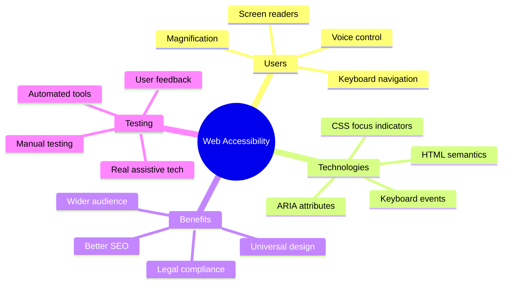

> Você pode acessar esta lição no [Microsoft Learn](https://docs.microsoft.com/learn/modules/web-development-101/accessibility/?WT.mc_id=academic-77807-sagibbon)!

## Entendendo Tecnologias Assistivas

Antes de começarmos a codificar, vamos dedicar um momento para entender como pessoas com diferentes habilidades realmente experimentam a web. Isso não é apenas teoria—compreender esses padrões de navegação no mundo real fará de você um desenvolvedor muito melhor!

As tecnologias assistivas são ferramentas incríveis que ajudam pessoas com deficiências a interagir com sites de maneiras que podem te surpreender. Quando você entende como essas tecnologias funcionam, criar experiências acessíveis na web se torna muito mais intuitivo. É como aprender a ver seu código pelos olhos de outra pessoa.

### Leitores de tela

[Leitores de tela](https://en.wikipedia.org/wiki/Screen_reader) são tecnologias bastante sofisticadas que convertem texto digital em saída de voz ou braille. Embora sejam usados principalmente por pessoas com deficiência visual, também são muito úteis para usuários com dificuldades de aprendizagem, como dislexia.

Eu gosto de pensar em um leitor de tela como um narrador inteligente lendo um livro para você. Ele lê o conteúdo em voz alta em uma ordem lógica, anuncia elementos interativos como "botão" ou "link" e fornece atalhos de teclado para navegar pela página. Mas aqui está o ponto—os leitores de tela só funcionam bem se construirmos sites com estrutura adequada e conteúdo significativo. É aí que você entra como desenvolvedor!

**Leitores de tela populares em diferentes plataformas:**
- **Windows**: [NVDA](https://www.nvaccess.org/about-nvda/) (gratuito e mais popular), [JAWS](https://webaim.org/articles/jaws/), [Narrator](https://support.microsoft.com/windows/complete-guide-to-narrator-e4397a0d-ef4f-b386-d8ae-c172f109bdb1/?WT.mc_id=academic-77807-sagibbon) (embutido)
- **macOS/iOS**: [VoiceOver](https://support.apple.com/guide/voiceover/welcome/10) (embutido e muito capaz)
- **Android**: [TalkBack](https://support.google.com/accessibility/android/answer/6283677) (embutido)
- **Linux**: [Orca](https://wiki.gnome.org/Projects/Orca) (gratuito e de código aberto)

**Como os leitores de tela navegam pelo conteúdo da web:**

Os leitores de tela oferecem vários métodos de navegação que tornam a navegação eficiente para usuários experientes:
- **Leitura sequencial**: Lê o conteúdo de cima para baixo, como seguir um livro
- **Navegação por marcos**: Pula entre seções da página (cabeçalho, navegação, principal, rodapé)
- **Navegação por cabeçalhos**: Pula entre cabeçalhos para entender a estrutura da página
- **Listas de links**: Gera uma lista de todos os links para acesso rápido
- **Controles de formulário**: Navega diretamente entre campos de entrada e botões

> 💡 **Algo que me surpreendeu**: 68% dos usuários de leitores de tela navegam principalmente por cabeçalhos ([Pesquisa WebAIM](https://webaim.org/projects/screenreadersurvey9/#finding)). Isso significa que a estrutura dos seus cabeçalhos é como um mapa para os usuários—quando você acerta, está literalmente ajudando as pessoas a encontrar o caminho pelo seu conteúdo mais rapidamente!

### Construindo seu fluxo de trabalho de testes

Aqui está uma boa notícia—testar acessibilidade de forma eficaz não precisa ser complicado! Você vai querer combinar ferramentas automatizadas (ótimas para identificar problemas óbvios) com alguns testes práticos. Aqui está uma abordagem sistemática que, na minha experiência, detecta a maioria dos problemas sem consumir o dia inteiro:

**Fluxo de trabalho essencial para testes manuais:**

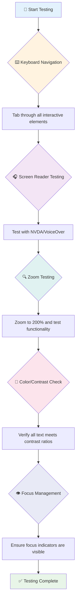

**Lista de verificação passo a passo para testes:**
1. **Navegação por teclado**: Use apenas Tab, Shift+Tab, Enter, Espaço e teclas de seta
2. **Teste com leitor de tela**: Ative NVDA, VoiceOver ou Narrator e navegue com os olhos fechados
3. **Teste de zoom**: Teste em níveis de zoom de 200% e 400%
4. **Verificação de contraste de cores**: Verifique todo o texto e componentes da interface
5. **Teste de indicador de foco**: Certifique-se de que todos os elementos interativos tenham estados de foco visíveis

✅ **Comece com o Lighthouse**: Abra as DevTools do seu navegador, execute uma auditoria de acessibilidade do Lighthouse e use os resultados para orientar as áreas de foco dos testes manuais.

### Ferramentas de zoom e ampliação

Sabe quando você dá um zoom no celular porque o texto está muito pequeno ou força a vista na tela do laptop em plena luz do dia? Muitos usuários dependem de ferramentas de ampliação para tornar o conteúdo legível todos os dias. Isso inclui pessoas com baixa visão, idosos e qualquer pessoa que já tentou ler um site ao ar livre.

As tecnologias modernas de zoom evoluíram além de apenas aumentar as coisas. Entender como essas ferramentas funcionam ajudará você a criar designs responsivos que permanecem funcionais e atraentes em qualquer nível de ampliação.

**Capacidades modernas de zoom em navegadores:**
- **Zoom da página**: Escala todo o conteúdo proporcionalmente (texto, imagens, layout) - este é o método preferido
- **Zoom apenas no texto**: Aumenta o tamanho da fonte enquanto mantém o layout original
- **Pinch-to-zoom**: Suporte a gestos móveis para ampliação temporária
- **Suporte do navegador**: Todos os navegadores modernos suportam zoom de até 500% sem quebrar a funcionalidade

**Software especializado de ampliação:**
- **Windows**: [Magnifier](https://support.microsoft.com/windows/use-magnifier-to-make-things-on-the-screen-easier-to-see-414948ba-8b1c-d3bd-8615-0e5e32204198) (embutido), [ZoomText](https://www.freedomscientific.com/training/zoomtext/getting-started/)
- **macOS/iOS**: [Zoom](https://www.apple.com/accessibility/mac/vision/) (embutido com recursos avançados)

> ⚠️ **Consideração de Design**: O WCAG exige que o conteúdo permaneça funcional quando ampliado em até 200%. Nesse nível, o deslocamento horizontal deve ser mínimo e todos os elementos interativos devem permanecer acessíveis.

✅ **Teste seu design responsivo**: Amplie seu navegador para 200% e 400%. Seu layout se adapta de forma elegante? Você ainda consegue acessar toda a funcionalidade sem rolar excessivamente?

## Ferramentas Modernas de Teste de Acessibilidade

Agora que você entende como as pessoas navegam na web com tecnologias assistivas, vamos explorar as ferramentas que ajudam você a construir e testar sites acessíveis.

Pense assim: ferramentas automatizadas são ótimas para identificar problemas óbvios (como falta de texto alternativo), enquanto os testes práticos ajudam a garantir que seu site seja agradável de usar no mundo real. Juntas, elas te dão confiança de que seus sites funcionam para todos.

### Teste de contraste de cores

Aqui está uma boa notícia: contraste de cores é um dos problemas de acessibilidade mais comuns, mas também um dos mais fáceis de corrigir. Um bom contraste beneficia todos—desde usuários com deficiências visuais até pessoas tentando ler seus celulares na praia.

**Requisitos de contraste do WCAG:**

| Tipo de Texto | WCAG AA (Mínimo) | WCAG AAA (Aprimorado) |
|---------------|------------------|-----------------------|
| **Texto normal** (menos de 18pt) | Razão de contraste 4.5:1 | Razão de contraste 7:1 |
| **Texto grande** (18pt+ ou 14pt+ em negrito) | Razão de contraste 3:1 | Razão de contraste 4.5:1 |
| **Componentes da interface** (botões, bordas de formulário) | Razão de contraste 3:1 | Razão de contraste 3:1 |

**Ferramentas essenciais de teste:**
- [Colour Contrast Analyser](https://www.tpgi.com/color-contrast-checker/) - Aplicativo de desktop com seletor de cores
- [WebAIM Contrast Checker](https://webaim.org/resources/contrastchecker/) - Baseado na web com feedback instantâneo
- [Stark](https://www.getstark.co/) - Plugin para ferramentas de design como Figma, Sketch, Adobe XD
- [Accessible Colors](https://accessible-colors.com/) - Encontre paletas de cores acessíveis

✅ **Crie melhores paletas de cores**: Comece com as cores da sua marca e use verificadores de contraste para criar variações acessíveis. Documente essas variações como os tokens de cores acessíveis do seu sistema de design.

### Auditoria abrangente de acessibilidade

O teste de acessibilidade mais eficaz combina várias abordagens. Nenhuma ferramenta única detecta tudo, então construir uma rotina de testes com métodos variados garante uma cobertura completa.

**Testes baseados em navegador (embutidos nas DevTools):**
- **Chrome/Edge**: Auditoria de acessibilidade do Lighthouse + painel de acessibilidade
- **Firefox**: Inspetor de acessibilidade com visualização detalhada em árvore
- **Safari**: Aba de auditoria no Web Inspector com simulação do VoiceOver

**Extensões profissionais de teste:**
- [axe DevTools](https://www.deque.com/axe/devtools/) - Teste automatizado padrão da indústria
- [WAVE](https://wave.webaim.org/extension/) - Feedback visual com destaque de erros
- [Accessibility Insights](https://accessibilityinsights.io/) - Suite de testes abrangente da Microsoft

**Integração com linha de comando e CI/CD:**
- [axe-core](https://github.com/dequelabs/axe-core) - Biblioteca JavaScript para testes automatizados
- [Pa11y](https://pa11y.org/) - Ferramenta de teste de acessibilidade na linha de comando
- [Lighthouse CI](https://github.com/GoogleChrome/lighthouse-ci) - Pontuação automatizada de acessibilidade

> 🎯 **Meta de Teste**: Mire em uma pontuação de acessibilidade do Lighthouse de 95+ como base. Lembre-se, ferramentas automatizadas detectam apenas cerca de 30-40% dos problemas de acessibilidade—testes manuais ainda são essenciais!

### 🧠 **Verificação de Habilidades de Teste: Pronto para Encontrar Problemas?**

**Vamos ver como você está se sentindo sobre testes de acessibilidade:**
- Qual método de teste parece mais acessível para você agora?
- Você consegue imaginar usar navegação apenas por teclado por um dia inteiro?
- Qual é uma barreira de acessibilidade que você já experimentou online?

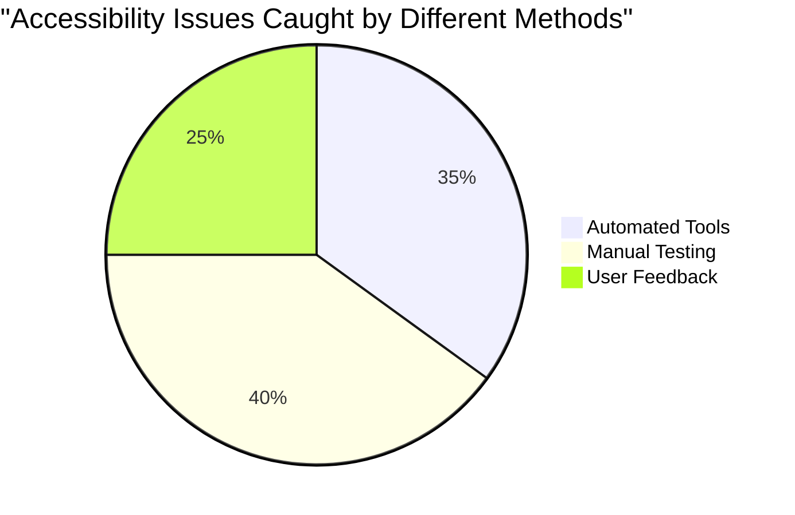

> **Impulso de confiança**: Testadores profissionais de acessibilidade usam exatamente essa combinação de métodos. Você está aprendendo práticas padrão da indústria!

## Construindo Acessibilidade Desde o Início

A chave para o sucesso em acessibilidade é incorporá-la desde o início. Eu sei que é tentador pensar "vou adicionar acessibilidade depois", mas isso é como tentar adicionar uma rampa a uma casa depois que ela já foi construída. É possível? Sim. Fácil? Nem tanto.

Pense na acessibilidade como planejar uma casa—é muito mais fácil incluir acessibilidade para cadeiras de rodas nos planos arquitetônicos iniciais do que adaptar tudo depois.

### Os princípios POUR: Sua base para acessibilidade

As Diretrizes de Acessibilidade de Conteúdo da Web (WCAG) são baseadas em quatro princípios fundamentais que formam o acrônimo POUR. Não se preocupe—esses não são conceitos acadêmicos complicados! Eles são, na verdade, diretrizes práticas para criar conteúdo que funcione para todos.

Depois que você entende o POUR, tomar decisões de acessibilidade se torna muito mais intuitivo. É como ter uma lista mental que orienta suas escolhas de design. Vamos detalhar:

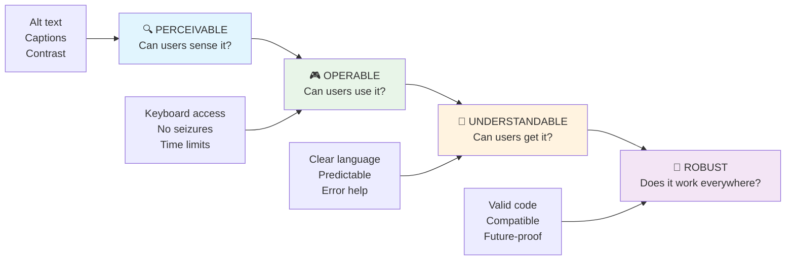

**🔍 Perceptível**: A informação deve ser apresentada de forma que os usuários possam percebê-la com seus sentidos disponíveis

- Forneça alternativas em texto para conteúdo não textual (imagens, vídeos, áudio)
- Garanta contraste de cores suficiente para todo o texto e componentes da interface
- Ofereça legendas e transcrições para conteúdo multimídia
- Projete conteúdo que permaneça funcional quando redimensionado em até 200%
- Use múltiplas características sensoriais (não apenas cor) para transmitir informações

**🎮 Operável**: Todos os componentes da interface devem ser operáveis pelos métodos de entrada disponíveis

- Torne toda a funcionalidade acessível via navegação por teclado
- Dê aos usuários tempo suficiente para ler e interagir com o conteúdo
- Evite conteúdo que cause convulsões ou distúrbios vestibulares
- Ajude os usuários a navegar eficientemente com estrutura clara e marcos
- Certifique-se de que os elementos interativos tenham tamanhos adequados (mínimo de 44px)

**📖 Compreensível**: A informação e a operação da interface devem ser claras e compreensíveis

- Use linguagem clara e simples apropriada para seu público
- Garanta que o conteúdo apareça e opere de forma previsível e consistente
- Forneça instruções claras e mensagens de erro para entrada do usuário
- Ajude os usuários a entender e corrigir erros em formulários
- Organize o conteúdo com ordem lógica de leitura e hierarquia de informações

**💪 Robusto**: O conteúdo deve funcionar de forma confiável em diferentes tecnologias e dispositivos assistivos

- **Use HTML válido e semântico como base**
- **Garanta compatibilidade com tecnologias assistivas atuais e futuras**
- **Siga padrões da web e melhores práticas de marcação**
- **Teste em diferentes navegadores, dispositivos e ferramentas assistivas**
- **Estruture o conteúdo para que ele funcione bem mesmo quando recursos avançados não forem suportados**

### 🎯 **Verificação dos Princípios POUR: Fixando o Conceito**

**Reflexão rápida sobre os fundamentos:**
- Consegue pensar em uma funcionalidade de site que falha em cada princípio POUR?
- Qual princípio parece mais natural para você como desenvolvedor?
- Como esses princípios podem melhorar o design para todos, não apenas para usuários com deficiência?

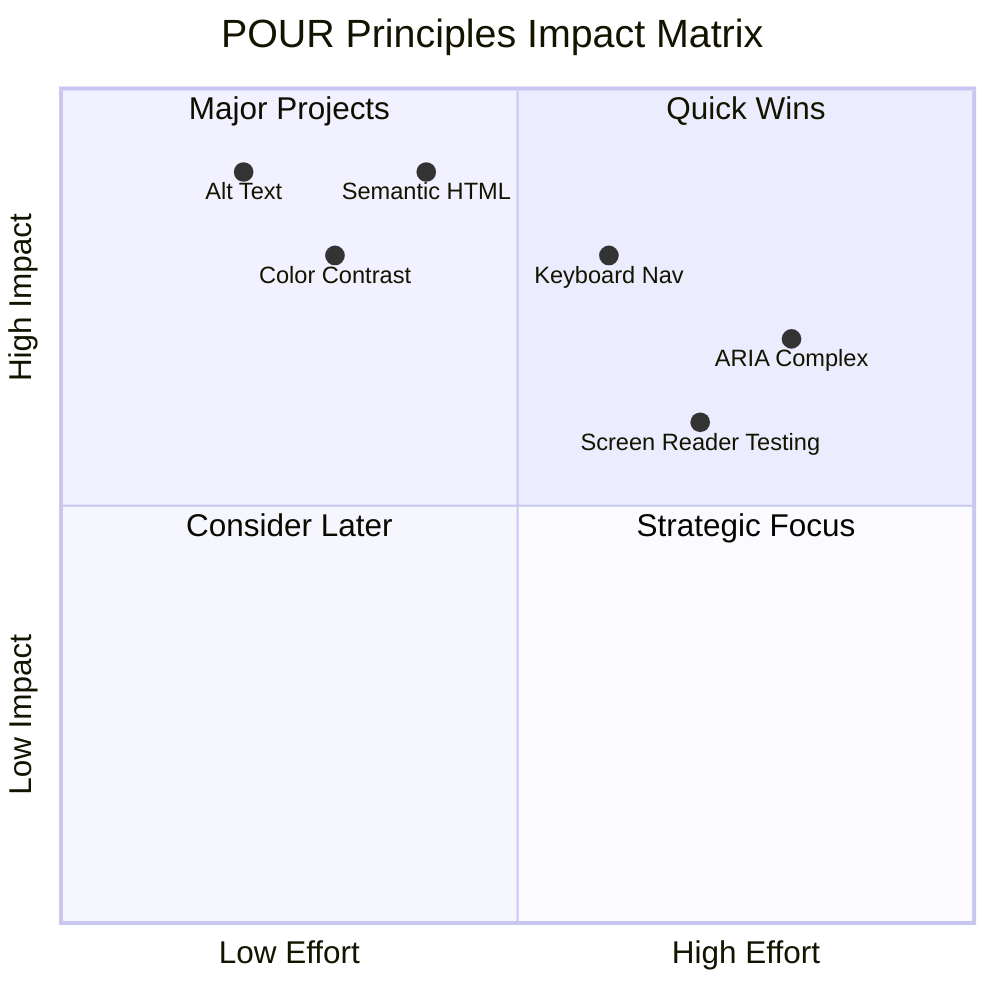

> **Lembre-se**: Comece com melhorias de alto impacto e baixo esforço. HTML semântico e texto alternativo oferecem o maior ganho em acessibilidade com o menor esforço!

## Criando Design Visual Acessível

Um bom design visual e acessibilidade andam de mãos dadas. Quando você projeta com acessibilidade em mente, muitas vezes descobre que essas restrições levam a soluções mais limpas e elegantes que beneficiam todos os usuários.

Vamos explorar como criar designs visualmente atraentes que funcionem para todos, independentemente de suas habilidades visuais ou das condições em que estão visualizando seu conteúdo.

### Estratégias de acessibilidade visual e de cores

A cor é poderosa para comunicação, mas nunca deve ser a única forma de transmitir informações importantes. Projetar além da cor cria experiências mais robustas e inclusivas que funcionam em mais situações.

**Projete para diferenças na visão de cores:**

Aproximadamente 8% dos homens e 0,5% das mulheres têm algum tipo de diferença na visão de cores (frequentemente chamada de "daltonismo"). Os tipos mais comuns são:
- **Deuteranopia**: Dificuldade em distinguir vermelho e verde
- **Protanopia**: Vermelho parece mais escuro
- **Tritanopia**: Dificuldade com azul e amarelo (raro)

**Estratégias inclusivas de cores:**

```css
/* ❌ Bad: Using only color to indicate status */
.error { color: red; }
.success { color: green; }

/* ✅ Good: Color plus icons and context */
.error {
  color: #d32f2f;
  border-left: 4px solid #d32f2f;
}
.error::before {
  content: "⚠️";
  margin-right: 8px;
}

.success {
  color: #2e7d32;
  border-left: 4px solid #2e7d32;
}
.success::before {
  content: "✅";
  margin-right: 8px;
}
```

**Além dos requisitos básicos de contraste:**
- Teste suas escolhas de cores com simuladores de daltonismo
- Use padrões, texturas ou formas junto com codificação por cores
- Certifique-se de que os estados interativos sejam distinguíveis sem cor
- Considere como seu design aparece no modo de alto contraste

✅ **Teste a acessibilidade das suas cores**: Use ferramentas como [Coblis](https://www.color-blindness.com/coblis-color-blindness-simulator/) para ver como seu site aparece para usuários com diferentes tipos de visão de cores.

### Indicadores de foco e design de interação

Os indicadores de foco são o equivalente digital de um cursor—eles mostram aos usuários de teclado onde estão na página. Indicadores de foco bem projetados melhoram a experiência para todos, tornando as interações claras e previsíveis.

**Melhores práticas modernas para indicadores de foco:**

```css
/* Enhanced focus styles that work across browsers */
button:focus-visible {
  outline: 2px solid #0066cc;
  outline-offset: 2px;
  box-shadow: 0 0 0 4px rgba(0, 102, 204, 0.25);
}

/* Remove focus outline for mouse users, preserve for keyboard users */
button:focus:not(:focus-visible) {
  outline: none;
}

/* Focus-within for complex components */
.card:focus-within {
  box-shadow: 0 0 0 3px rgba(74, 144, 164, 0.5);
  border-color: #4A90A4;
}

/* Ensure focus indicators meet contrast requirements */
.custom-focus:focus-visible {
  outline: 3px solid #ffffff;
  outline-offset: 2px;
  box-shadow: 0 0 0 6px #000000;
}
```

**Requisitos para indicadores de foco:**
- **Visibilidade**: Deve ter pelo menos uma proporção de contraste de 3:1 com os elementos ao redor
- **Largura**: Espessura mínima de 2px ao redor de todo o elemento
- **Persistência**: Deve permanecer visível até que o foco se mova para outro lugar
- **Distinção**: Deve ser visualmente diferente de outros estados da interface

> 💡 **Dica de Design**: Ótimos indicadores de foco frequentemente usam uma combinação de contorno, sombra e mudanças de cor para garantir visibilidade em diferentes fundos e contextos.

✅ **Audite os indicadores de foco**: Navegue pelo seu site usando a tecla Tab e observe quais elementos têm indicadores de foco claros. Algum deles é difícil de ver ou está ausente?

### HTML semântico: A base da acessibilidade

HTML semântico é como dar às tecnologias assistivas um sistema de GPS para o seu site. Quando você usa os elementos HTML certos para o propósito pretendido, está basicamente fornecendo leitores de tela, teclados e outras ferramentas com um mapa detalhado para ajudar os usuários a navegar de forma eficaz.

Aqui está uma analogia que realmente fez sentido para mim: HTML semântico é a diferença entre uma biblioteca bem organizada com categorias claras e sinais úteis versus um depósito onde os livros estão espalhados aleatoriamente. Ambos os lugares têm os mesmos livros, mas em qual você preferiria tentar encontrar algo? Exatamente!

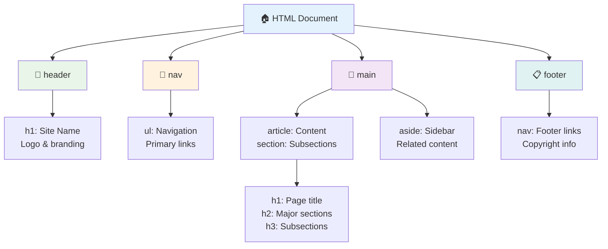

**Blocos de construção de uma estrutura de página acessível:**

```html
<!-- Landmark elements provide page navigation structure -->
<header>
  <h1>Your Site Name</h1>
  <nav aria-label="Main navigation">
    <ul>
      <li><a href="/home">Home</a></li>
      <li><a href="/about">About</a></li>
      <li><a href="/services">Services</a></li>
    </ul>
  </nav>
</header>

<main>
  <article>
    <header>
      <h1>Article Title</h1>
      <p>Published on <time datetime="2024-10-14">October 14, 2024</time></p>
    </header>
    
    <section>
      <h2>First Section</h2>
      <p>Content that relates to this section...</p>
    </section>
    
    <section>
      <h2>Second Section</h2>
      <p>More related content...</p>
    </section>
  </article>
  
  <aside>
    <h2>Related Links</h2>
    <nav aria-label="Related articles">
      <ul>
        <li><a href="/related-1">First related article</a></li>
        <li><a href="/related-2">Second related article</a></li>
      </ul>
    </nav>
  </aside>
</main>

<footer>
  <p>&copy; 2024 Your Site Name. All rights reserved.</p>
  <nav aria-label="Footer links">
    <ul>
      <li><a href="/privacy">Privacy Policy</a></li>
      <li><a href="/contact">Contact Us</a></li>
    </ul>
  </nav>
</footer>
```

**Por que HTML semântico transforma a acessibilidade:**

| Elemento Semântico | Propósito | Benefício para Leitores de Tela |
|--------------------|-----------|---------------------------------|
| `<header>` | Cabeçalho da página ou seção | "Marco de banner" - navegação rápida para o topo |
| `<nav>` | Links de navegação | "Marco de navegação" - lista de seções de navegação |
| `<main>` | Conteúdo principal da página | "Marco principal" - pular diretamente para o conteúdo |
| `<article>` | Conteúdo autônomo | Anuncia os limites do artigo |
| `<section>` | Grupos de conteúdo temático | Fornece estrutura ao conteúdo |
| `<aside>` | Conteúdo relacionado na barra lateral | "Marco complementar" |
| `<footer>` | Rodapé da página ou seção | "Marco de informações de conteúdo" |

**Superpoderes dos leitores de tela com HTML semântico:**
- **Navegação por marcos**: Pular entre as principais seções da página instantaneamente
- **Estrutura de cabeçalhos**: Gerar um índice a partir da estrutura de cabeçalhos
- **Listas de elementos**: Criar listas de todos os links, botões ou controles de formulário
- **Consciência de contexto**: Entender as relações entre seções de conteúdo

> 🎯 **Teste Rápido**: Tente navegar pelo seu site com um leitor de tela usando atalhos de marcos (D para marcos, H para cabeçalhos, K para links no NVDA/JAWS). A navegação faz sentido?

### 🏗️ **Verificação de Domínio de HTML Semântico: Construindo Bases Sólidas**

**Vamos avaliar sua compreensão semântica:**
- Consegue identificar os marcos em uma página apenas olhando o HTML?
- Como explicaria a diferença entre `<section>` e `<div>` para um amigo?
- Qual seria a primeira coisa que verificaria se um usuário de leitor de tela relatasse problemas de navegação?

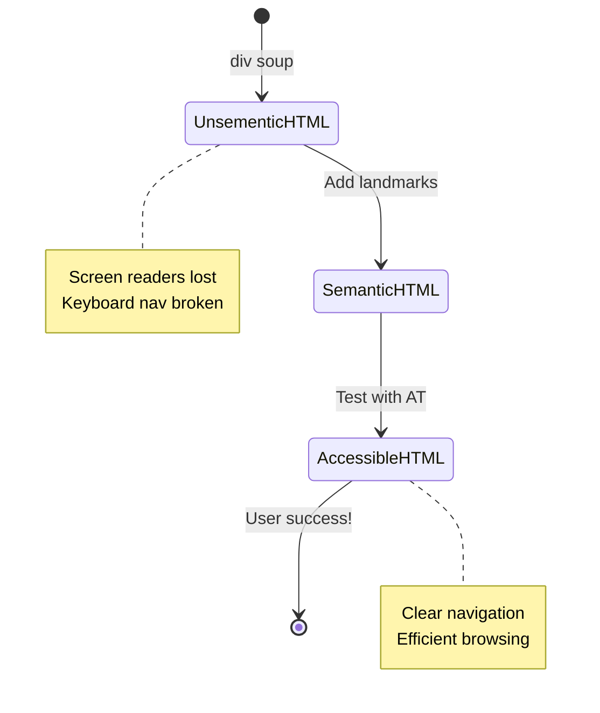

> **Insight profissional**: Um bom HTML semântico resolve cerca de 70% dos problemas de acessibilidade automaticamente. Domine essa base e você estará no caminho certo!

✅ **Audite sua estrutura semântica**: Use o painel de Acessibilidade nas DevTools do seu navegador para visualizar a árvore de acessibilidade e garantir que sua marcação cria uma estrutura lógica.

### Hierarquia de cabeçalhos: Criando um esqueleto lógico de conteúdo

Os cabeçalhos são absolutamente cruciais para conteúdo acessível—são como a espinha dorsal que mantém tudo unido. Usuários de leitores de tela dependem muito dos cabeçalhos para entender e navegar pelo conteúdo. Pense nisso como fornecer um índice para sua página.

**Aqui está a regra de ouro para cabeçalhos:**
Nunca pule níveis. Sempre progrida logicamente de `<h1>` para `<h2>` para `<h3>`, e assim por diante. Lembra de fazer esquemas na escola? É exatamente o mesmo princípio—você não pularia de "I. Ponto Principal" direto para "C. Sub-sub-ponto" sem um "A. Sub-ponto" no meio, certo?

**Exemplo de estrutura perfeita de cabeçalhos:**

```html
<!-- ✅ Excellent: Logical, hierarchical progression -->
<main>
  <h1>Complete Guide to Web Accessibility</h1>
  
  <section>
    <h2>Understanding Screen Readers</h2>
    <p>Introduction to screen reader technology...</p>
    
    <h3>Popular Screen Reader Software</h3>
    <p>NVDA, JAWS, and VoiceOver comparison...</p>
    
    <h3>Testing with Screen Readers</h3>
    <p>Step-by-step testing instructions...</p>
  </section>
  
  <section>
    <h2>Color and Contrast Guidelines</h2>
    <p>Designing with sufficient contrast...</p>
    
    <h3>WCAG Contrast Requirements</h3>
    <p>Understanding the different contrast levels...</p>
    
    <h3>Testing Tools and Techniques</h3>
    <p>Tools for verifying contrast ratios...</p>
  </section>
</main>
```

```html
<!-- ❌ Problematic: Skipping levels, inconsistent structure -->
<h1>Page Title</h1>
<h3>Subsection</h3> <!-- Skipped h2 -->
<h2>This should come before h3</h2>
<h1>Another main heading?</h1> <!-- Multiple h1s -->
```

**Melhores práticas para cabeçalhos:**
- **Um `<h1>` por página**: Normalmente o título principal da página ou o cabeçalho do conteúdo principal
- **Progressão lógica**: Nunca pule níveis (h1 → h2 → h3, não h1 → h3)
- **Conteúdo descritivo**: Torne os cabeçalhos significativos quando lidos fora de contexto
- **Estilização visual com CSS**: Use CSS para aparência, níveis de HTML para estrutura

**Estatísticas de navegação por leitores de tela:**
- 68% dos usuários de leitores de tela navegam por cabeçalhos ([Pesquisa WebAIM](https://webaim.org/projects/screenreadersurvey9/#finding))
- Os usuários esperam encontrar uma estrutura lógica de cabeçalhos
- Os cabeçalhos fornecem a maneira mais rápida de entender a estrutura da página

> 💡 **Dica Profissional**: Use extensões de navegador como "HeadingsMap" para visualizar sua estrutura de cabeçalhos. Deve parecer um índice bem organizado.

✅ **Teste sua estrutura de cabeçalhos**: Use a navegação por cabeçalhos de um leitor de tela (tecla H no NVDA) para pular pelos seus cabeçalhos. A progressão conta a história do seu conteúdo de forma lógica?

### Técnicas avançadas de acessibilidade visual

Além do básico de contraste e cor, existem técnicas sofisticadas que ajudam a criar experiências visuais verdadeiramente inclusivas. Esses métodos garantem que seu conteúdo funcione em diferentes condições de visualização e tecnologias assistivas.

**Estratégias essenciais de comunicação visual:**

- **Feedback multimodal**: Combine pistas visuais, textuais e, às vezes, sonoras
- **Divulgação progressiva**: Apresente informações em partes digestíveis
- **Padrões de interação consistentes**: Use convenções familiares de interface
- **Tipografia responsiva**: Escale o texto adequadamente em diferentes dispositivos
- **Estados de carregamento e erro**: Forneça feedback claro para todas as ações do usuário

**Utilitários CSS para acessibilidade aprimorada:**

```css
/* Screen reader only text - visually hidden but accessible */
.sr-only {
  position: absolute;
  width: 1px;
  height: 1px;
  padding: 0;
  margin: -1px;
  overflow: hidden;
  clip: rect(0, 0, 0, 0);
  white-space: nowrap;
  border: 0;
}

/* Skip link for keyboard navigation */
.skip-link {
  position: absolute;
  top: -40px;
  left: 6px;
  background: #000000;
  color: #ffffff;
  padding: 8px 16px;
  text-decoration: none;
  border-radius: 4px;
  font-weight: bold;
  transition: top 0.3s ease;
  z-index: 1000;
}

.skip-link:focus {
  top: 6px;
}

/* Reduced motion respect */
@media (prefers-reduced-motion: reduce) {
  .skip-link {
    transition: none;
  }
  
  * {
    animation-duration: 0.01ms !important;
    animation-iteration-count: 1 !important;
    transition-duration: 0.01ms !important;
  }
}

/* High contrast mode support */
@media (prefers-contrast: high) {
  .button {
    border: 2px solid;
  }
}
```

> 🎯 **Padrão de Acessibilidade**: O "link de pular" é essencial para usuários de teclado. Deve ser o primeiro elemento focável na sua página e pular diretamente para a área de conteúdo principal.

✅ **Implemente navegação de pular**: Adicione links de pular às suas páginas e teste-os pressionando Tab assim que a página carregar. Eles devem aparecer e permitir que você pule para o conteúdo principal.

## Criando Texto de Link Significativo

Links são basicamente as rodovias da web, mas textos de link mal escritos são como ter placas de estrada que dizem apenas "Lugar" em vez de "Centro de Chicago". Não muito útil, certo?

Aqui está algo que me surpreendeu quando aprendi: leitores de tela podem extrair todos os links de uma página e exibi-los como uma grande lista. Imagine se alguém lhe entregasse um diretório de todos os links da sua página. Cada um faria sentido por si só? Esse é o teste que seu texto de link precisa passar!

### Entendendo padrões de navegação por links

Leitores de tela oferecem recursos poderosos de navegação por links que dependem de textos de link bem escritos:

**Métodos de navegação por links:**
- **Leitura sequencial**: Links são lidos no contexto como parte do fluxo de conteúdo
- **Geração de lista de links**: Todos os links da página compilados em um diretório pesquisável
- **Navegação rápida**: Pular entre links usando atalhos de teclado (K no NVDA)
- **Funcionalidade de busca**: Encontrar links específicos digitando texto parcial

**Por que o contexto importa:**
Quando usuários de leitores de tela geram uma lista de links, eles veem algo como:
- "Baixar relatório"
- "Saiba mais"
- "Clique aqui"
- "Política de privacidade"
- "Clique aqui"

Apenas dois desses links fornecem informações úteis quando lidos fora de contexto!

> 📊 **Impacto no Usuário**: Usuários de leitores de tela escaneiam listas de links para entender rapidamente o conteúdo da página. Textos genéricos forçam-nos a navegar de volta ao contexto de cada link, desacelerando significativamente sua experiência de navegação.

### Erros comuns em textos de link a evitar

Entender o que não funciona ajuda a reconhecer e corrigir problemas de acessibilidade em conteúdo existente.

**❌ Texto de link genérico que não fornece contexto:**

```html
<!-- Meaningless when read from a link list -->
<p>Our sustainability efforts are detailed in our recent report. 
   <a href="/sustainability-2024.pdf">Click here</a> to view it.</p>

<!-- Repeated generic text throughout the page -->
<div class="article-card">
  <h3>Web Accessibility Guide</h3>
  <p>Learn the fundamentals...</p>
  <a href="/accessibility-guide">Read more</a>
</div>
<div class="article-card">
  <h3>Color Contrast Tips</h3>
  <p>Improve your design...</p>
  <a href="/color-contrast">Read more</a>
</div>

<!-- URLs as link text (difficult for screen readers to announce) -->
<p>Visit https://www.w3.org/WAI/WCAG21/quickref/ for WCAG guidelines.</p>

<!-- Vague action words -->
<a href="/contact">Go</a> | <a href="/about">See</a> | <a href="/help">View</a>
```

**Por que esses padrões falham:**
- **"Clique aqui"** não diz nada sobre o destino
- **"Leia mais"** repetido várias vezes cria confusão
- **URLs brutas** são difíceis para leitores de tela pronunciarem claramente
- **Palavras únicas** como "Ir" ou "Ver" carecem de contexto descritivo

### Escrevendo textos de link excelentes

Textos de link descritivos beneficiam todos—usuários com visão podem escanear links rapidamente, e usuários de leitores de tela entendem os destinos imediatamente.

**✅ Exemplos de textos de link claros e descritivos:**

```html
<!-- Descriptive text that explains the destination -->
<p>Our comprehensive <a href="/sustainability-2024.pdf">2024 sustainability report (PDF, 2.1MB)</a> details our environmental initiatives.</p>

<!-- Specific, unique link text for each card -->
<div class="article-card">
  <h3>Web Accessibility Guide</h3>
  <p>Learn the fundamentals of inclusive design...</p>
  <a href="/accessibility-guide">Read our complete web accessibility guide</a>
</div>
<div class="article-card">
  <h3>Color Contrast Tips</h3>
  <p>Improve your design with better color choices...</p>
  <a href="/color-contrast">Explore color contrast best practices</a>
</div>

<!-- Meaningful text instead of raw URLs -->
<p>The <a href="https://www.w3.org/WAI/WCAG21/quickref/">WCAG 2.1 Quick Reference guide</a> provides comprehensive accessibility guidelines.</p>

<!-- Descriptive action links -->
<a href="/contact">Contact our support team</a> | 
<a href="/about">About our company</a> | 
<a href="/help">Get help with your account</a>
```

**Melhores práticas para textos de link:**
- **Seja específico**: "Baixar o relatório financeiro trimestral" vs. "Baixar"
- **Inclua tipo de arquivo e tamanho**: "(PDF, 1.2MB)" para arquivos para download
- **Mencione se links abrem externamente**: "(abre em nova janela)" quando apropriado
- **Use linguagem ativa**: "Entre em contato conosco" vs. "Página de contato"
- **Mantenha conciso**: Almeje de 2 a 8 palavras quando possível

### Padrões avançados de acessibilidade para links

Às vezes, restrições de design visual ou requisitos técnicos precisam de soluções especiais. Aqui estão técnicas sofisticadas para cenários desafiadores comuns:

**Usando ARIA para contexto aprimorado:**

```html
<!-- When button text must be short but needs more context -->
<a href="/report.pdf" 
   aria-label="Download 2024 annual financial report, PDF format, 2.3MB">
  Download Report
</a>

<!-- When the full context comes from surrounding content -->
<h3 id="sustainability-heading">Sustainability Initiative</h3>
<p>Our efforts to reduce environmental impact...</p>
<a href="/sustainability-details" 
   aria-labelledby="sustainability-heading"
   aria-describedby="sustainability-summary">
  Learn more
</a>
<p id="sustainability-summary">Detailed breakdown of our 2024 environmental goals and achievements</p>
```

**Indicando tipos de arquivo e destinos externos:**

```html
<!-- Method 1: Include information in visible link text -->
<a href="/annual-report.pdf">
  Download our 2024 annual report (PDF, 2.3MB)
</a>

<!-- Method 2: Use screen reader-only text for file details -->
<a href="/annual-report.pdf">
  Download our 2024 annual report
  <span class="sr-only">(PDF format, 2.3MB)</span>
</a>

<!-- Method 3: External link indication -->
<a href="https://example.com" 
   target="_blank" 
   aria-describedby="external-link-warning">
  Visit external resource
</a>
<span id="external-link-warning" class="sr-only">
  (opens in new window)
</span>

<!-- Method 4: Using CSS for visual indicators -->
<a href="https://example.com" class="external-link">
  External resource
</a>
```

```css
/* Visual indicator for external links */
.external-link::after {
  content: " ↗";
  font-size: 0.8em;
  color: #666;
}

/* Screen reader announcement for external links */
.external-link::before {
  content: "External link: ";
  position: absolute;
  left: -10000px;
  width: 1px;
  height: 1px;
  overflow: hidden;
}
```

> ⚠️ **Importante**: Ao usar `target="_blank"`, sempre informe os usuários que o link abre em uma nova janela ou aba. Mudanças inesperadas de navegação podem ser desorientadoras.

✅ **Teste o contexto dos seus links**: Use as ferramentas de desenvolvedor do seu navegador para gerar uma lista de todos os links da sua página. Consegue entender o propósito de cada link sem nenhum contexto ao redor?

## ARIA: Supercarregando a Acessibilidade do HTML

[Aplicações Ricas em Internet Acessíveis (ARIA)](https://developer.mozilla.org/docs/Web/Accessibility/ARIA) é como ter um tradutor universal entre suas aplicações web complexas e tecnologias assistivas. Quando o HTML sozinho não consegue expressar tudo o que seus componentes interativos estão fazendo, o ARIA entra para preencher essas lacunas.

Gosto de pensar no ARIA como adicionar anotações úteis ao seu HTML—como direções de palco em um roteiro de peça que ajudam os atores a entender seus papéis e relações.

**Aqui está a regra mais importante sobre ARIA**: Sempre use HTML semântico primeiro, depois adicione ARIA para aprimorá-lo. Pense no ARIA como tempero, não o prato principal. Ele deve esclarecer e melhorar sua estrutura HTML, nunca substituí-la. Acertar essa base primeiro!

### Implementação estratégica de ARIA

ARIA é poderoso, mas com poder vem responsabilidade. ARIA incorreto pode tornar a acessibilidade pior do que nenhuma ARIA. Aqui está quando e como usá-lo de forma eficaz:

**✅ Use ARIA quando:**
- Criar widgets interativos personalizados (acordes, abas, carrosséis)
- Construir conteúdo dinâmico que muda sem recarregar a página
- Fornecer contexto adicional para relações complexas de interface
- Indicar estados de carregamento ou atualizações de conteúdo ao vivo
- Criar interfaces semelhantes a aplicativos com controles personalizados

**❌ Evite ARIA quando:**
- Elementos HTML padrão já fornecem a semântica necessária
- Você não tem certeza de como implementá-lo corretamente
- Ele duplica informações já fornecidas pelo HTML semântico
- Você não testou com tecnologia assistiva real

> 🎯 **Regra de Ouro do ARIA**: "Não altere a semântica a menos que seja absolutamente necessário, garanta sempre a acessibilidade por teclado e teste com tecnologia assistiva real."
**As cinco categorias de ARIA:**

1. **Funções**: O que é este elemento? (`button`, `tab`, `dialog`)
2. **Propriedades**: Quais são suas características? (`aria-required`, `aria-haspopup`)
3. **Estados**: Qual é sua condição atual? (`aria-expanded`, `aria-checked`)
4. **Marcos**: Onde está na estrutura da página? (`banner`, `navigation`, `main`)
5. **Regiões dinâmicas**: Como as mudanças devem ser anunciadas? (`aria-live`, `aria-atomic`)

### Padrões essenciais de ARIA para aplicativos web modernos

Esses padrões resolvem os desafios mais comuns de acessibilidade em aplicativos web interativos:

**Nomeando e descrevendo elementos:**

```html
<!-- aria-label: Provides accessible name when visible text isn't sufficient -->
<button aria-label="Close newsletter subscription dialog">×</button>

<!-- aria-labelledby: References existing text as the accessible name -->
<section aria-labelledby="news-heading">
  <h2 id="news-heading">Latest News</h2>
  <!-- news content -->
</section>

<!-- aria-describedby: Links to additional descriptive text -->
<input type="password" 
       aria-describedby="pwd-requirements pwd-strength"
       required>
<div id="pwd-requirements">
  Password must contain at least 8 characters, including uppercase, lowercase, and numbers.
</div>
<div id="pwd-strength" aria-live="polite">
  <!-- Dynamic password strength indicator -->
</div>
```

**Regiões dinâmicas para conteúdo dinâmico:**

```html
<!-- Polite announcements (don't interrupt current speech) -->
<div aria-live="polite" id="status-updates">
  <!-- Status messages appear here -->
</div>

<!-- Assertive announcements (interrupt and announce immediately) -->
<div aria-live="assertive" id="urgent-alerts">
  <!-- Error messages and critical alerts -->
</div>

<!-- Loading states with live regions -->
<button id="submit-btn" aria-describedby="loading-status">
  Submit Application
</button>
<div id="loading-status" aria-live="polite" aria-atomic="true">
  <!-- "Processing your application..." appears here -->
</div>
```

**Exemplo de widget interativo (acordeão):**

```html
<div class="accordion">
  <h3>
    <button aria-expanded="false" 
            aria-controls="panel-1" 
            id="accordion-trigger-1"
            class="accordion-trigger">
      Accessibility Guidelines
    </button>
  </h3>
  <div id="panel-1" 
       role="region"
       aria-labelledby="accordion-trigger-1" 
       hidden>
    <p>WCAG 2.1 provides comprehensive guidelines...</p>
  </div>
</div>
```

```javascript
// JavaScript to manage accordion state
function toggleAccordion(trigger) {
  const panel = document.getElementById(trigger.getAttribute('aria-controls'));
  const isExpanded = trigger.getAttribute('aria-expanded') === 'true';
  
  // Toggle states
  trigger.setAttribute('aria-expanded', !isExpanded);
  panel.hidden = isExpanded;
  
  // Announce change to screen readers
  const status = document.getElementById('status-updates');
  status.textContent = isExpanded ? 'Section collapsed' : 'Section expanded';
}
```

### Melhores práticas de implementação de ARIA

ARIA é uma ferramenta poderosa, mas requer implementação cuidadosa. Seguir estas diretrizes ajuda a garantir que o uso de ARIA melhore, em vez de prejudicar, a acessibilidade:

**🛡️ Princípios básicos:**

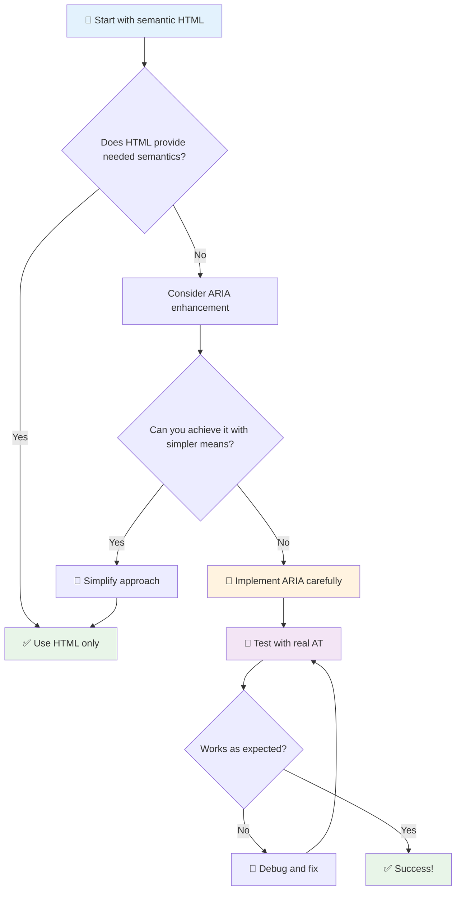

1. **HTML semântico em primeiro lugar**: Sempre prefira `<button>` em vez de `<div role="button">`
2. **Não quebre a semântica**: Nunca substitua o significado existente do HTML (evite `<h1 role="button">`)
3. **Mantenha a acessibilidade por teclado**: Todos os elementos interativos com ARIA devem ser totalmente acessíveis por teclado
4. **Teste com usuários reais**: O suporte ao ARIA varia significativamente entre as tecnologias assistivas
5. **Comece simples**: Implementações complexas de ARIA têm maior probabilidade de erros

**🔍 Fluxo de teste:**

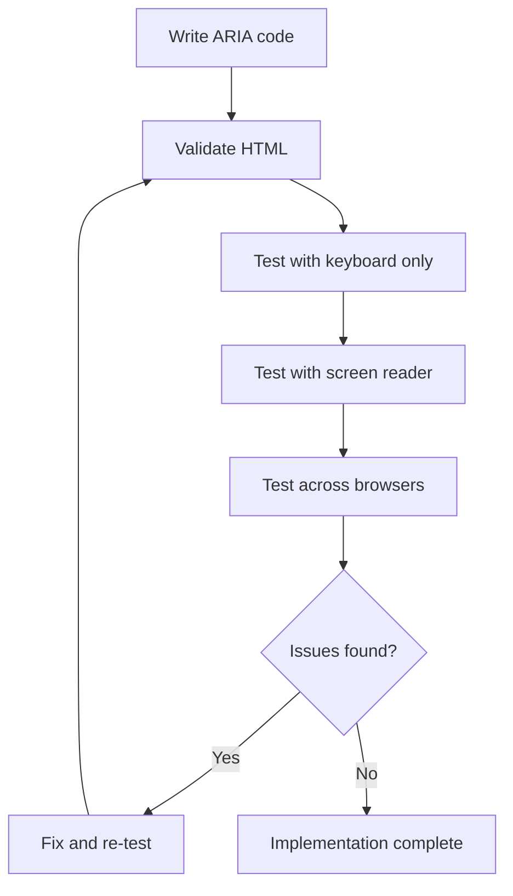

**🚫 Erros comuns de ARIA a evitar:**

- **Informações conflitantes**: Não contradiga a semântica do HTML
- **Excesso de rotulagem**: Informações excessivas de ARIA podem sobrecarregar os usuários
- **ARIA estática**: Esquecer de atualizar os estados de ARIA quando o conteúdo muda
- **Implementações não testadas**: ARIA que funciona na teoria, mas falha na prática
- **Falta de suporte ao teclado**: Funções de ARIA sem interações correspondentes por teclado

> 💡 **Recursos de teste**: Use ferramentas como [accessibility-checker](https://www.npmjs.com/package/accessibility-checker) para validação automatizada de ARIA, mas sempre teste com leitores de tela reais para uma experiência completa.

### 🎭 **Teste de habilidades em ARIA: Pronto para interações complexas?**

**Avalie sua confiança em ARIA:**
- Quando você escolheria ARIA em vez de HTML semântico? (Dica: quase nunca!)
- Você consegue explicar por que `<div role="button">` geralmente é pior do que `<button>`?
- Qual é a coisa mais importante a lembrar sobre testes de ARIA?

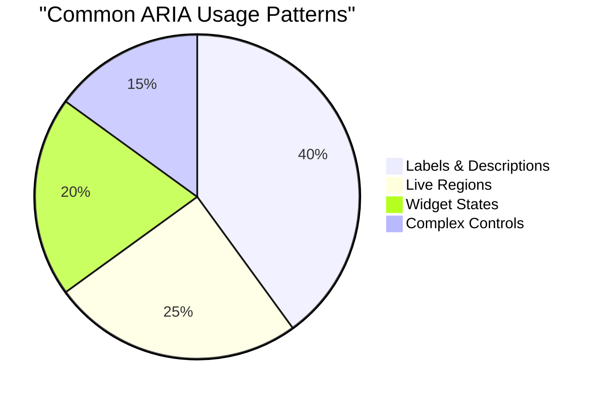

> **Insight chave**: A maior parte do uso de ARIA é para rotular e descrever elementos. Padrões de widgets complexos são muito menos comuns do que você imagina!

✅ **Aprenda com especialistas**: Estude o [Guia de Práticas de Autoria ARIA](https://w3c.github.io/aria-practices/) para padrões testados e implementações de widgets interativos complexos.

## Tornando imagens e mídias acessíveis

Conteúdo visual e de áudio são partes essenciais das experiências web modernas, mas podem criar barreiras se não forem implementados de forma cuidadosa. O objetivo é garantir que a informação e o impacto emocional de sua mídia alcancem todos os usuários. Depois que você pega o jeito, isso se torna algo natural.

Diferentes tipos de mídia precisam de abordagens de acessibilidade diferentes. É como cozinhar—você não trataria um peixe delicado da mesma forma que trataria um bife robusto. Entender essas diferenças ajuda a escolher a solução certa para cada situação.

### Estratégia de acessibilidade para imagens

Cada imagem no seu site tem um propósito. Entender esse propósito ajuda você a escrever textos alternativos melhores e criar experiências mais inclusivas.

**Os quatro tipos de imagens e suas estratégias de texto alternativo:**

**Imagens informativas** - transmitem informações importantes:
```html

```

**Imagens decorativas** - puramente visuais, sem valor informativo:
```html

```

**Imagens funcionais** - servem como botões ou controles:
```html
<button>
  
</button>
```

**Imagens complexas** - gráficos, diagramas, infográficos:
```html

<div id="chart-description">
  <p>Detailed description: Sales data shows a steady increase across all quarters...</p>
</div>
```

### Acessibilidade de vídeos e áudios

**Requisitos para vídeos:**
- **Legendas**: Versão em texto do conteúdo falado e efeitos sonoros
- **Descrições em áudio**: Narração dos elementos visuais para usuários cegos
- **Transcrições**: Versão completa em texto de todo o conteúdo de áudio e vídeo

```html
<video controls>
  <source src="video.mp4" type="video/mp4">
  <track kind="captions" src="captions.vtt" srclang="en" label="English">
  <track kind="descriptions" src="descriptions.vtt" srclang="en" label="Audio descriptions">
</video>
```

**Requisitos para áudios:**
- **Transcrições**: Versão em texto de todo o conteúdo falado
- **Indicadores visuais**: Para conteúdo apenas em áudio, forneça pistas visuais

### Técnicas modernas para imagens

**Usando CSS para imagens decorativas:**
```css
.hero-section {
  background-image: url('decorative-hero.jpg');
  /* Decorative images in CSS don't need alt text */
}
```

**Imagens responsivas com acessibilidade:**
```html
<picture>
  <source media="(min-width: 800px)" srcset="large-chart.png">
  <source media="(min-width: 400px)" srcset="medium-chart.png">
  
</picture>
```

✅ **Teste a acessibilidade das imagens**: Use um leitor de tela para navegar em uma página com imagens. Você está recebendo informações suficientes para entender o conteúdo?

## Navegação por teclado e gerenciamento de foco

Muitos usuários navegam na web apenas com seus teclados. Isso inclui pessoas com deficiências motoras, usuários avançados que acham o teclado mais rápido que o mouse e qualquer pessoa cujo mouse tenha parado de funcionar. Garantir que seu site funcione bem com entrada por teclado é essencial e muitas vezes torna seu site mais eficiente para todos.

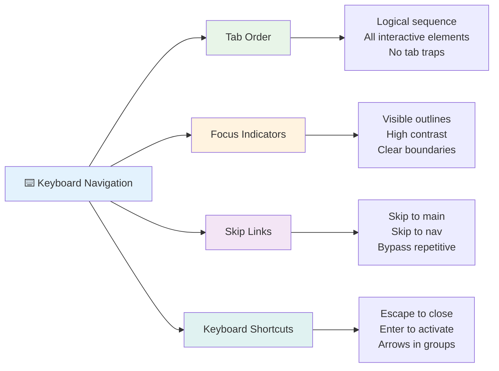

### Padrões essenciais de navegação por teclado

**Interações padrão por teclado:**
- **Tab**: Move o foco para frente entre os elementos interativos
- **Shift + Tab**: Move o foco para trás
- **Enter**: Ativa botões e links
- **Espaço**: Ativa botões, marca caixas de seleção
- **Setas**: Navega dentro de grupos de componentes (botões de rádio, menus)
- **Esc**: Fecha modais, menus suspensos ou cancela operações

### Melhores práticas de gerenciamento de foco

**Indicadores visíveis de foco:**
```css
/* Ensure focus is always visible */
button:focus-visible {
  outline: 2px solid #4A90A4;
  outline-offset: 2px;
}

/* Custom focus styles for different components */
.card:focus-within {
  box-shadow: 0 0 0 3px rgba(74, 144, 164, 0.5);
}
```

**Links de pular para navegação eficiente:**
```html
<a href="#main-content" class="skip-link">Skip to main content</a>
<a href="#navigation" class="skip-link">Skip to navigation</a>

<nav id="navigation">
  <!-- navigation content -->
</nav>
<main id="main-content">
  <!-- main content -->
</main>
```

**Ordem correta de tabulação:**
```html
<!-- Use semantic HTML for natural tab order -->
<form>
  <label for="name">Name:</label>
  <input type="text" id="name" tabindex="0">
  
  <label for="email">Email:</label>
  <input type="email" id="email" tabindex="0">
  
  <button type="submit" tabindex="0">Submit</button>
</form>
```

### Trava de foco em modais

Ao abrir diálogos modais, o foco deve ser mantido dentro do modal:

```javascript
// Modern focus trap implementation
function trapFocus(element) {
  const focusableElements = element.querySelectorAll(
    'button, [href], input, select, textarea, [tabindex]:not([tabindex="-1"])'
  );
  
  const firstElement = focusableElements[0];
  const lastElement = focusableElements[focusableElements.length - 1];

  element.addEventListener('keydown', (e) => {
    if (e.key === 'Tab') {
      if (e.shiftKey && document.activeElement === firstElement) {
        e.preventDefault();
        lastElement.focus();
      } else if (!e.shiftKey && document.activeElement === lastElement) {
        e.preventDefault();
        firstElement.focus();
      }
    }
    
    if (e.key === 'Escape') {
      closeModal();
    }
  });
  
  // Focus first element when modal opens
  firstElement.focus();
}
```

✅ **Teste a navegação por teclado**: Tente navegar no seu site usando apenas a tecla Tab. Você consegue alcançar todos os elementos interativos? A ordem de foco é lógica? Os indicadores de foco são claramente visíveis?

## Acessibilidade em formulários

Formulários são fundamentais para a interação do usuário e exigem atenção especial à acessibilidade.

### Associação de rótulos e controles de formulário

**Cada controle de formulário precisa de um rótulo:**
```html
<!-- Explicit labeling (preferred) -->
<label for="username">Username:</label>
<input type="text" id="username" name="username" required>

<!-- Implicit labeling -->
<label>
  Password:
  <input type="password" name="password" required>
</label>

<!-- Using aria-label when visual label isn't desired -->
<input type="search" aria-label="Search products" placeholder="Search...">
```

### Tratamento de erros e validação

**Mensagens de erro acessíveis:**
```html
<label for="email">Email Address:</label>
<input type="email" id="email" name="email" 
       aria-describedby="email-error" 
       aria-invalid="true" required>
<div id="email-error" role="alert">
  Please enter a valid email address
</div>
```

**Melhores práticas de validação de formulários:**
- Use `aria-invalid` para indicar campos inválidos
- Forneça mensagens de erro claras e específicas
- Use `role="alert"` para anúncios importantes de erro
- Mostre erros tanto imediatamente quanto no envio do formulário

### Conjuntos de campos e agrupamento

**Agrupe controles de formulário relacionados:**
```html
<fieldset>
  <legend>Shipping Address</legend>
  <label for="street">Street Address:</label>
  <input type="text" id="street" name="street">
  
  <label for="city">City:</label>
  <input type="text" id="city" name="city">
</fieldset>

<fieldset>
  <legend>Preferred Contact Method</legend>
  <input type="radio" id="contact-email" name="contact" value="email">
  <label for="contact-email">Email</label>
  
  <input type="radio" id="contact-phone" name="contact" value="phone">
  <label for="contact-phone">Phone</label>
</fieldset>
```

## Sua Jornada de Acessibilidade: Principais Lições

Parabéns! Você acabou de adquirir o conhecimento básico para criar experiências web verdadeiramente inclusivas. Isso é algo muito empolgante! A acessibilidade na web não se trata apenas de cumprir requisitos legais—é sobre reconhecer as diversas formas como as pessoas interagem com o conteúdo digital e projetar para essa incrível complexidade.

Agora você faz parte de uma comunidade crescente de desenvolvedores que entendem que um bom design funciona para todos. Bem-vindo ao clube!

**🎯 Seu kit de ferramentas de acessibilidade agora inclui:**

| Princípio Básico | Implementação | Impacto |
|------------------|---------------|---------|
| **Fundação de HTML Semântico** | Use os elementos HTML adequados para seu propósito | Leitores de tela podem navegar eficientemente, teclados funcionam automaticamente |
| **Design Visual Inclusivo** | Contraste suficiente, uso significativo de cores, indicadores visíveis de foco | Claro para todos em qualquer condição de iluminação |
| **Conteúdo Descritivo** | Texto de link significativo, texto alternativo, cabeçalhos | Usuários entendem o conteúdo sem contexto visual |
| **Acessibilidade por Teclado** | Ordem de tabulação, atalhos de teclado, gerenciamento de foco | Acessibilidade motora e eficiência para usuários avançados |
| **Aprimoramento com ARIA** | Uso estratégico para preencher lacunas semânticas | Aplicativos complexos funcionam com tecnologias assistivas |
| **Testes Abrangentes** | Ferramentas automatizadas + verificação manual + testes com usuários reais | Identifique problemas antes que impactem os usuários |

**🚀 Seus próximos passos:**

1. **Incorpore a acessibilidade ao seu fluxo de trabalho**: Faça dos testes uma parte natural do seu processo de desenvolvimento
2. **Aprenda com usuários reais**: Busque feedback de pessoas que utilizam tecnologias assistivas
3. **Mantenha-se atualizado**: Técnicas de acessibilidade evoluem com novas tecnologias e padrões
4. **Defenda a inclusão**: Compartilhe seu conhecimento e faça da acessibilidade uma prioridade da equipe

> 💡 **Lembre-se**: Restrições de acessibilidade frequentemente levam a soluções inovadoras e elegantes que beneficiam a todos. Rampas, legendas e controles de voz começaram como recursos de acessibilidade e se tornaram melhorias amplamente aceitas.

**O caso de negócio é claro**: Sites acessíveis alcançam mais usuários, têm melhor classificação nos mecanismos de busca, custos de manutenção mais baixos e evitam riscos legais. Mas, honestamente? A verdadeira razão para se importar com acessibilidade vai muito além disso. Sites acessíveis incorporam os melhores valores da web—abertura, inclusão e a ideia de que todos merecem acesso igual à informação.

Agora você está preparado para construir a web inclusiva do futuro. Cada site acessível que você cria torna a internet um lugar mais acolhedor para todos. Isso é realmente incrível quando você pensa sobre isso!

## Recursos Adicionais

Continue sua jornada de aprendizado sobre acessibilidade com esses recursos essenciais:

**📚 Padrões e Diretrizes Oficiais:**
- [Diretrizes WCAG 2.1](https://www.w3.org/WAI/WCAG21/quickref/) - O padrão oficial de acessibilidade com referência rápida
- [Guia de Práticas de Autoria ARIA](https://w3c.github.io/aria-practices/) - Padrões abrangentes para widgets interativos
- [Diretrizes WebAIM](https://webaim.org/) - Orientação prática e acessível para iniciantes

**🛠️ Ferramentas e Recursos de Teste:**
- [axe DevTools](https://www.deque.com/axe/devtools/) - Teste de acessibilidade padrão da indústria
- [Lista de Verificação do Projeto A11y](https://www.a11yproject.com/checklist/) - Verificação de acessibilidade passo a passo
- [Accessibility Insights](https://accessibilityinsights.io/) - Suite de testes abrangente da Microsoft
- [Color Oracle](https://colororacle.org/) - Simulador de daltonismo para testes de design

**🎓 Aprendizado e Comunidade:**
- [Pesquisa de Leitores de Tela WebAIM](https://webaim.org/projects/screenreadersurvey9/) - Preferências e comportamentos de usuários reais
- [Componentes Inclusivos](https://inclusive-components.design/) - Padrões modernos de componentes acessíveis
- [A11y Coffee](https://a11y.coffee/) - Dicas e insights rápidos sobre acessibilidade
- [Iniciativa de Acessibilidade na Web (WAI)](https://www.w3.org/WAI/) - Recursos abrangentes de acessibilidade do W3C

**🎥 Aprendizado Prático:**
- [Guia do Desenvolvedor de Acessibilidade](https://www.accessibility-developer-guide.com/) - Orientação prática de implementação
- [Deque University](https://dequeuniversity.com/) - Cursos profissionais de treinamento em acessibilidade

## Desafio do GitHub Copilot Agent 🚀

Use o modo Agent para completar o seguinte desafio:

**Descrição:** Crie um componente de diálogo modal acessível que demonstre gerenciamento adequado de foco, atributos ARIA e padrões de navegação por teclado.

**Prompt:** Construa um componente completo de diálogo modal com HTML, CSS e JavaScript que inclua: trava de foco adequada, tecla ESC para fechar, clique fora para fechar, atributos ARIA para leitores de tela e indicadores visíveis de foco. O modal deve conter um formulário com rótulos adequados e tratamento de erros. Certifique-se de que o componente atenda aos padrões WCAG 2.1 AA.


## 🚀 Desafio

Pegue este HTML e reescreva-o para torná-lo o mais acessível possível, dadas as estratégias que você aprendeu.

```html
<!DOCTYPE html>
<html lang="en">
  <head>
    <meta charset="UTF-8">
    <meta name="viewport" content="width=device-width, initial-scale=1.0">
    <title>Turtle Ipsum - The World's Premier Turtle Fan Club</title>
    <link href='../assets/style.css' rel='stylesheet' type='text/css'>
  </head>
  <body>
    <header class="site-header">
      <h1 class="site-title">Turtle Ipsum</h1>
      <p class="site-subtitle">The World's Premier Turtle Fan Club</p>
    </header>
    
    <nav class="main-nav" aria-label="Main navigation">
      <h2 class="nav-header">Resources</h2>
      <ul class="nav-list">
        <li><a href="https://www.youtube.com/watch?v=CMNry4PE93Y">"I like turtles" video</a></li>
        <li><a href="https://en.wikipedia.org/wiki/Turtle">Basic turtle information</a></li>
        <li><a href="https://en.wikipedia.org/wiki/Turtles_(chocolate)">Chocolate turtles candy</a></li>
      </ul>
    </nav>
    
    <main class="main-content">
      <article>
        <h1>Welcome to Turtle Ipsum</h1>
        <p class="intro">
          <a href="/about">Learn more about our turtle community</a> and discover fascinating facts about these amazing creatures.
        </p>
        <p class="article-text">
          Turtle ipsum dolor sit amet, consectetur adipiscing elit, sed do eiusmod tempor incididunt ut labore et dolore magna aliqua. Ut enim ad minim veniam, quis nostrud exercitation ullamco laboris nisi ut aliquip ex ea commodo consequat. Duis aute irure dolor in reprehenderit in voluptate velit esse cillum dolore eu fugiat nulla pariatur. Excepteur sint occaecat cupidatat non proident, sunt in culpa qui officia deserunt mollit anim id est laborum.
        </p>
      </article>
    </main>
    
    <footer class="footer">
      <section class="newsletter-signup">
        <h2>Stay Updated</h2>
        <button type="button" onclick="showNewsletterForm()">Sign up for turtle news</button>
      </section>
      
      <nav class="footer-nav" aria-label="Footer navigation">
        <h2>Site Pages</h2>
        <ul>
          <li><a href="../">Home</a></li>
          <li><a href="../semantic">Semantic HTML example</a></li>
        </ul>
      </nav>
      
      <p class="footer-copyright">&copy; 2024 Instrument. All rights reserved.</p>
    </footer>
  </body>
</html>
```

**Melhorias feitas:**
- Adicionada estrutura semântica adequada em HTML
- Corrigida hierarquia de cabeçalhos (um único h1, progressão lógica)
- Substituído texto de link genérico por texto significativo
- Incluídos rótulos ARIA adequados para navegação
- Adicionado atributo lang e metatags apropriadas
- Utilizado elemento button para elementos interativos
- Estruturado conteúdo do rodapé com marcos adequados

## Quiz Pós-Aula
[Quiz pós-aula](https://ff-quizzes.netlify.app/web/en/)

## Revisão e Estudo Individual

Muitos governos têm leis sobre requisitos de acessibilidade. Pesquise sobre as leis de acessibilidade do seu país de origem. O que é coberto e o que não é? Um exemplo é [este site do governo](https://accessibility.blog.gov.uk/).

## Tarefa
 
[Analise um site não acessível](assignment.md)

Créditos: [Turtle Ipsum](https://github.com/Instrument/semantic-html-sample) por Instrument

---

## 🚀 Sua Linha do Tempo de Domínio da Acessibilidade

### ⚡ **O que você pode fazer nos próximos 5 minutos**
- [ ] Instale a extensão axe DevTools no seu navegador
- [ ] Execute uma auditoria de acessibilidade do Lighthouse em seu site favorito
- [ ] Tente navegar em qualquer site usando apenas a tecla Tab
- [ ] Teste o leitor de tela embutido do seu navegador (Narrator/VoiceOver)

### 🎯 **O que você pode realizar nesta hora**
- [ ] Complete o quiz pós-aula e reflita sobre os insights de acessibilidade
- [ ] Pratique escrever textos alternativos significativos para 10 imagens diferentes
- [ ] Audite a estrutura de cabeçalhos de um site usando a extensão HeadingsMap
- [ ] Corrija problemas de acessibilidade encontrados no HTML do desafio
- [ ] Teste o contraste de cores no seu projeto atual com a ferramenta do WebAIM

### 📅 **Sua Jornada de Acessibilidade de Uma Semana**
- [ ] Complete a tarefa analisando um site não acessível
- [ ] Configure seu ambiente de desenvolvimento com ferramentas de teste de acessibilidade
- [ ] Praticar navegação por teclado em 5 sites complexos diferentes  
- [ ] Construir um formulário simples com rótulos adequados, tratamento de erros e ARIA  
- [ ] Participar de uma comunidade de acessibilidade (A11y Slack, fórum WebAIM)  
- [ ] Assistir usuários reais com deficiência navegando em sites (o YouTube tem ótimos exemplos)  

### 🌟 **Sua Transformação de Um Mês**  
- [ ] Integrar testes de acessibilidade ao seu fluxo de trabalho de desenvolvimento  
- [ ] Contribuir para um projeto de código aberto corrigindo problemas de acessibilidade  
- [ ] Realizar testes de usabilidade com alguém que utiliza tecnologia assistiva  
- [ ] Construir uma biblioteca de componentes acessíveis para sua equipe  
- [ ] Defender a acessibilidade no seu local de trabalho ou comunidade  
- [ ] Mentorar alguém novo nos conceitos de acessibilidade  

### 🏆 **Check-in Final do Campeão de Acessibilidade**  

**Celebre sua jornada de acessibilidade:**  
- Qual foi a coisa mais surpreendente que você aprendeu sobre como as pessoas usam a web?  
- Qual princípio de acessibilidade mais combina com seu estilo de desenvolvimento?  
- Como aprender sobre acessibilidade mudou sua perspectiva sobre design?  
- Qual é a primeira melhoria de acessibilidade que você quer implementar em um projeto real?  

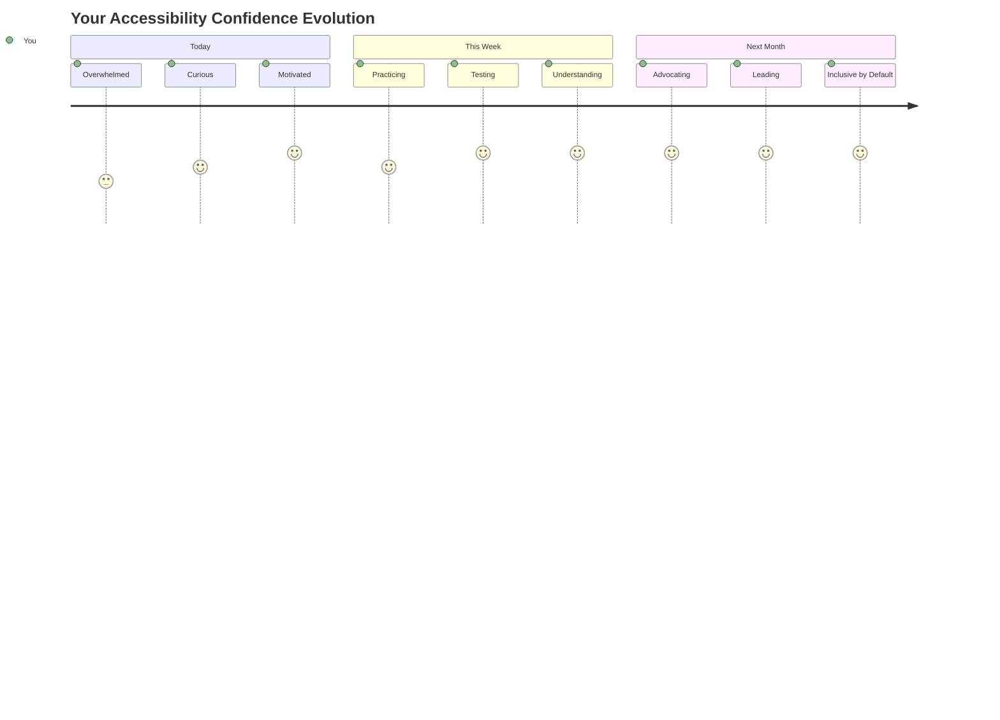
  
> 🌍 **Agora você é um campeão de acessibilidade!** Você entende que ótimas experiências na web funcionam para todos, independentemente de como acessam a internet. Cada recurso acessível que você constrói torna a internet mais inclusiva. A web precisa de desenvolvedores como você, que veem a acessibilidade não como uma limitação, mas como uma oportunidade de criar experiências melhores para todos os usuários. Bem-vindo ao movimento! 🎉  

---

**Aviso Legal**:  
Este documento foi traduzido utilizando o serviço de tradução por IA [Co-op Translator](https://github.com/Azure/co-op-translator). Embora nos esforcemos para garantir a precisão, esteja ciente de que traduções automáticas podem conter erros ou imprecisões. O documento original em seu idioma nativo deve ser considerado a fonte autoritativa. Para informações críticas, recomenda-se a tradução profissional humana. Não nos responsabilizamos por quaisquer mal-entendidos ou interpretações incorretas decorrentes do uso desta tradução.