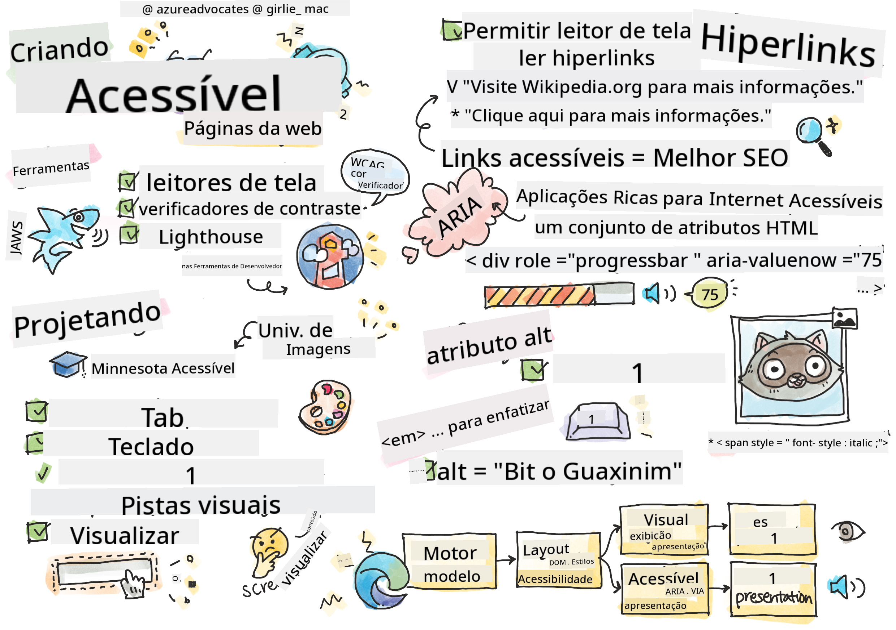

<!--
CO_OP_TRANSLATOR_METADATA:
{
  "original_hash": "f0c88c3e2cefa8952d356f802b1e47ca",
  "translation_date": "2025-08-28T23:59:06+00:00",
  "source_file": "1-getting-started-lessons/3-accessibility/README.md",
  "language_code": "br"
}
-->
# Criando Páginas Web Acessíveis


> Sketchnote por [Tomomi Imura](https://twitter.com/girlie_mac)

## Quiz Pré-Aula
[Quiz pré-aula](https://ff-quizzes.netlify.app/web/)

> O poder da Web está em sua universalidade. O acesso por todos, independentemente de deficiência, é um aspecto essencial.
>
> \- Sir Timothy Berners-Lee, Diretor do W3C e inventor da World Wide Web

Essa citação destaca perfeitamente a importância de criar sites acessíveis. Um aplicativo que não pode ser acessado por todos é, por definição, excludente. Como desenvolvedores web, devemos sempre ter a acessibilidade em mente. Ao focar nisso desde o início, você estará no caminho certo para garantir que todos possam acessar as páginas que você cria. Nesta lição, você aprenderá sobre as ferramentas que podem ajudar a garantir que seus recursos web sejam acessíveis e como construir com acessibilidade em mente.

> Você pode acessar esta lição no [Microsoft Learn](https://docs.microsoft.com/learn/modules/web-development-101/accessibility/?WT.mc_id=academic-77807-sagibbon)!

## Ferramentas para usar

### Leitores de tela

Uma das ferramentas de acessibilidade mais conhecidas são os leitores de tela.

[Leitores de tela](https://en.wikipedia.org/wiki/Screen_reader) são clientes comumente usados por pessoas com deficiência visual. Assim como dedicamos tempo para garantir que um navegador transmita corretamente as informações que desejamos compartilhar, também devemos garantir que um leitor de tela faça o mesmo.

De forma básica, um leitor de tela lê uma página de cima para baixo de forma audível. Se sua página for composta apenas por texto, o leitor transmitirá as informações de maneira semelhante a um navegador. No entanto, páginas web raramente são apenas texto; elas contêm links, gráficos, cores e outros componentes visuais. É necessário cuidado para garantir que essas informações sejam lidas corretamente por um leitor de tela.

Todo desenvolvedor web deve se familiarizar com um leitor de tela. Como destacado acima, é o cliente que seus usuários utilizarão. Da mesma forma que você conhece o funcionamento de um navegador, deve aprender como um leitor de tela opera. Felizmente, leitores de tela estão integrados na maioria dos sistemas operacionais.

Alguns navegadores também possuem ferramentas integradas e extensões que podem ler texto em voz alta ou até mesmo fornecer alguns recursos básicos de navegação, como [essas ferramentas focadas em acessibilidade do navegador Edge](https://support.microsoft.com/help/4000734/microsoft-edge-accessibility-features). Essas ferramentas também são importantes para acessibilidade, mas funcionam de maneira muito diferente dos leitores de tela e não devem ser confundidas com ferramentas de teste de leitores de tela.

✅ Experimente um leitor de tela e um leitor de texto do navegador. No Windows, o [Narrador](https://support.microsoft.com/windows/complete-guide-to-narrator-e4397a0d-ef4f-b386-d8ae-c172f109bdb1/?WT.mc_id=academic-77807-sagibbon) está incluído por padrão, e [JAWS](https://webaim.org/articles/jaws/) e [NVDA](https://www.nvaccess.org/about-nvda/) também podem ser instalados. No macOS e iOS, o [VoiceOver](https://support.apple.com/guide/voiceover/welcome/10) está instalado por padrão.

### Zoom

Outra ferramenta comumente usada por pessoas com deficiência visual é o zoom. O tipo mais básico de zoom é o zoom estático, controlado por `Control + sinal de mais (+)` ou pela redução da resolução da tela. Esse tipo de zoom faz com que toda a página seja redimensionada, então usar [design responsivo](https://developer.mozilla.org/docs/Learn/CSS/CSS_layout/Responsive_Design) é importante para proporcionar uma boa experiência ao usuário em níveis de zoom aumentados.

Outro tipo de zoom depende de softwares especializados para ampliar uma área da tela e mover-se, como usar uma lupa real. No Windows, o [Lupa](https://support.microsoft.com/windows/use-magnifier-to-make-things-on-the-screen-easier-to-see-414948ba-8b1c-d3bd-8615-0e5e32204198) está integrado, e o [ZoomText](https://www.freedomscientific.com/training/zoomtext/getting-started/) é um software de ampliação de terceiros com mais recursos e uma base de usuários maior. Tanto o macOS quanto o iOS possuem um software de ampliação integrado chamado [Zoom](https://www.apple.com/accessibility/mac/vision/).

### Verificadores de contraste

As cores em sites precisam ser cuidadosamente escolhidas para atender às necessidades de usuários daltônicos ou pessoas que têm dificuldade em enxergar cores de baixo contraste.

✅ Teste um site que você gosta de usar para verificar o uso de cores com uma extensão de navegador, como o [verificador de contraste de cores do WCAG](https://microsoftedge.microsoft.com/addons/detail/wcag-color-contrast-check/idahaggnlnekelhgplklhfpchbfdmkjp?hl=en-US&WT.mc_id=academic-77807-sagibbon). O que você aprende?

### Lighthouse

Na área de ferramentas de desenvolvedor do seu navegador, você encontrará a ferramenta Lighthouse. Essa ferramenta é importante para obter uma visão inicial da acessibilidade (bem como outras análises) de um site. Embora seja importante não depender exclusivamente do Lighthouse, uma pontuação de 100% é muito útil como ponto de partida.

✅ Encontre o Lighthouse no painel de ferramentas de desenvolvedor do seu navegador e execute uma análise em qualquer site. O que você descobre?

## Projetando para acessibilidade

A acessibilidade é um tópico relativamente amplo. Para ajudar você, existem inúmeros recursos disponíveis.

- [Accessible U - Universidade de Minnesota](https://accessibility.umn.edu/your-role/web-developers)

Embora não possamos cobrir todos os aspectos de criação de sites acessíveis, abaixo estão alguns dos princípios fundamentais que você deve implementar. Projetar uma página acessível desde o início é **sempre** mais fácil do que voltar a uma página existente para torná-la acessível.

## Bons princípios de exibição

### Paletas de cores seguras

As pessoas enxergam o mundo de maneiras diferentes, e isso inclui as cores. Ao selecionar um esquema de cores para seu site, você deve garantir que ele seja acessível para todos. Uma ótima [ferramenta para gerar paletas de cores é o Color Safe](http://colorsafe.co/).

✅ Identifique um site que seja muito problemático no uso de cores. Por quê?

### Use o HTML correto

Com CSS e JavaScript, é possível fazer qualquer elemento parecer qualquer tipo de controle. `<span>` pode ser usado para criar um `<button>`, e `<b>` pode se tornar um hiperlink. Embora isso possa ser considerado mais fácil de estilizar, não transmite nada para um leitor de tela. Use o HTML apropriado ao criar controles em uma página. Se você quiser um hiperlink, use `<a>`. Usar o HTML correto para o controle correto é chamado de uso de HTML Semântico.

✅ Acesse qualquer site e veja se os designers e desenvolvedores estão usando HTML corretamente. Você consegue encontrar um botão que deveria ser um link? Dica: clique com o botão direito e escolha 'Exibir código-fonte da página' no seu navegador para olhar o código subjacente.

### Crie uma hierarquia de cabeçalhos descritiva

Usuários de leitores de tela [dependem muito de cabeçalhos](https://webaim.org/projects/screenreadersurvey8/#finding) para encontrar informações e navegar por uma página. Escrever conteúdo descritivo para cabeçalhos e usar tags semânticas de cabeçalhos são importantes para criar um site facilmente navegável para usuários de leitores de tela.

### Use boas pistas visuais

O CSS oferece controle total sobre a aparência de qualquer elemento em uma página. Você pode criar caixas de texto sem contorno ou hiperlinks sem sublinhado. Infelizmente, remover essas pistas pode tornar mais difícil para alguém que depende delas reconhecer o tipo de controle.

## A importância do texto de links

Hiperlinks são fundamentais para navegar na web. Como resultado, garantir que um leitor de tela possa ler links corretamente permite que todos os usuários naveguem pelo seu site.

### Leitores de tela e links

Como você esperaria, leitores de tela leem o texto do link da mesma forma que leem qualquer outro texto na página. Com isso em mente, o texto demonstrado abaixo pode parecer perfeitamente aceitável.

> O pequeno pinguim, às vezes conhecido como pinguim-fada, é o menor pinguim do mundo. [Clique aqui](https://en.wikipedia.org/wiki/Little_penguin) para mais informações.

> O pequeno pinguim, às vezes conhecido como pinguim-fada, é o menor pinguim do mundo. Visite https://en.wikipedia.org/wiki/Little_penguin para mais informações.

> **NOTE** Como você está prestes a ler, você **nunca** deve criar links que se pareçam com os exemplos acima.

Lembre-se, leitores de tela são uma interface diferente dos navegadores, com um conjunto diferente de recursos.

### O problema de usar a URL

Leitores de tela leem o texto. Se uma URL aparece no texto, o leitor de tela lerá a URL. De modo geral, a URL não transmite informações significativas e pode soar irritante. Você pode ter experimentado isso se seu telefone já leu audivelmente uma mensagem de texto com uma URL.

### O problema de "clique aqui"

Leitores de tela também têm a capacidade de ler apenas os hiperlinks em uma página, da mesma forma que uma pessoa com visão escaneia uma página em busca de links. Se o texto do link for sempre "clique aqui", tudo o que o usuário ouvirá será "clique aqui, clique aqui, clique aqui, clique aqui, clique aqui, ...". Todos os links agora são indistinguíveis uns dos outros.

### Bom texto de link

Um bom texto de link descreve brevemente o que está do outro lado do link. No exemplo acima sobre pequenos pinguins, o link é para a página da Wikipedia sobre a espécie. A frase *pequenos pinguins* seria um texto de link perfeito, pois deixa claro o que alguém aprenderá ao clicar no link - pequenos pinguins.

> O [pequeno pinguim](https://en.wikipedia.org/wiki/Little_penguin), às vezes conhecido como pinguim-fada, é o menor pinguim do mundo.

✅ Navegue na web por alguns minutos para encontrar páginas que usam estratégias obscuras de links. Compare-as com outros sites que possuem links melhores. O que você aprende?

#### Notas sobre mecanismos de busca

Como um bônus adicional por garantir que seu site seja acessível para todos, você ajudará os mecanismos de busca a navegar pelo seu site também. Mecanismos de busca usam o texto do link para aprender os tópicos das páginas. Então, usar um bom texto de link ajuda a todos!

### ARIA

Imagine a seguinte página:

| Produto      | Descrição          | Pedido       |
| ------------ | ------------------ | ------------ |
| Widget       | [Descrição](../../../../1-getting-started-lessons/3-accessibility/')   | [Pedido](../../../../1-getting-started-lessons/3-accessibility/') |
| Super widget | [Descrição](../../../../1-getting-started-lessons/3-accessibility/')   | [Pedido](../../../../1-getting-started-lessons/3-accessibility/') |

Neste exemplo, duplicar o texto de descrição e pedido faz sentido para alguém usando um navegador. No entanto, alguém usando um leitor de tela ouviria apenas as palavras *descrição* e *pedido* repetidas sem contexto.

Para apoiar esses tipos de cenários, o HTML suporta um conjunto de atributos conhecidos como [Aplicações Ricas de Internet Acessíveis (ARIA)](https://developer.mozilla.org/docs/Web/Accessibility/ARIA). Esses atributos permitem que você forneça informações adicionais para leitores de tela.

> **NOTE**: Como muitos aspectos do HTML, o suporte de navegadores e leitores de tela pode variar. No entanto, a maioria dos clientes principais suporta atributos ARIA.

Você pode usar `aria-label` para descrever o link quando o formato da página não permite. A descrição para widget poderia ser configurada como

``` html
<a href="#" aria-label="Widget description">description</a>
```

✅ Em geral, usar marcação semântica como descrito acima supera o uso de ARIA, mas às vezes não há equivalente semântico para vários widgets HTML. Um bom exemplo é uma Árvore. Não há equivalente HTML para uma árvore, então você identifica o `<div>` genérico para este elemento com um papel e valores ARIA apropriados. A [documentação do MDN sobre ARIA](https://developer.mozilla.org/docs/Web/Accessibility/ARIA) contém mais informações úteis.

```html
<h2 id="tree-label">File Viewer</h2>
<div role="tree" aria-labelledby="tree-label">
  <div role="treeitem" aria-expanded="false" tabindex="0">Uploads</div>
</div>
```

## Imagens

É óbvio que leitores de tela não conseguem ler automaticamente o que está em uma imagem. Garantir que as imagens sejam acessíveis não exige muito trabalho - é para isso que serve o atributo `alt`. Todas as imagens significativas devem ter um `alt` para descrever o que são.  
Imagens que são puramente decorativas devem ter seu atributo `alt` configurado como uma string vazia: `alt=""`. Isso impede que leitores de tela anunciem desnecessariamente a imagem decorativa.

✅ Como você pode imaginar, mecanismos de busca também não conseguem entender o que está em uma imagem. Eles também usam o texto alternativo. Então, mais uma vez, garantir que sua página seja acessível traz bônus adicionais!

## O teclado

Alguns usuários não conseguem usar um mouse ou trackpad, dependendo exclusivamente de interações com o teclado para navegar de um elemento ao próximo. É importante que seu site apresente seu conteúdo em uma ordem lógica para que um usuário de teclado possa acessar cada elemento interativo enquanto avança pelo documento. Se você construir suas páginas web com marcação semântica e usar CSS para estilizar seu layout visual, seu site deve ser navegável por teclado, mas é importante testar esse aspecto manualmente. Saiba mais sobre [estratégias de navegação por teclado](https://webaim.org/techniques/keyboard/).

✅ Acesse qualquer site e tente navegar por ele usando apenas o teclado. O que funciona, o que não funciona? Por quê?

## Resumo

Uma web acessível para alguns não é uma verdadeira 'world-wide web'. A melhor maneira de garantir que os sites que você cria sejam acessíveis é incorporar as melhores práticas de acessibilidade desde o início. Embora envolva etapas extras, incorporar essas habilidades ao seu fluxo de trabalho agora garantirá que todas as páginas que você criar sejam acessíveis.

---

## 🚀 Desafio

Pegue este HTML e reescreva-o para torná-lo o mais acessível possível, dado as estratégias que você aprendeu.

```html
<!DOCTYPE html>
<html>
  <head>
    <title>
      Example
    </title>
    <link href='../assets/style.css' rel='stylesheet' type='text/css'>
  </head>
  <body>
    <div class="site-header">
      <p class="site-title">Turtle Ipsum</p>
      <p class="site-subtitle">The World's Premier Turtle Fan Club</p>
    </div>
    <div class="main-nav">
      <p class="nav-header">Resources</p>
      <div class="nav-list">
        <p class="nav-item nav-item-bull"><a href="https://www.youtube.com/watch?v=CMNry4PE93Y">"I like turtles"</a></p>
        <p class="nav-item nav-item-bull"><a href="https://en.wikipedia.org/wiki/Turtle">Basic Turtle Info</a></p>
        <p class="nav-item nav-item-bull"><a href="https://en.wikipedia.org/wiki/Turtles_(chocolate)">Chocolate Turtles</a></p>
      </div>
    </div>
    <div class="main-content">
      <div>
        <p class="page-title">Welcome to Turtle Ipsum. 
            <a href="">Click here</a> to learn more.
        </p>
        <p class="article-text">
          Turtle ipsum dolor sit amet, consectetur adipiscing elit, sed do eiusmod tempor incididunt ut labore et dolore magna aliqua. Ut enim ad minim veniam, quis nostrud exercitation ullamco laboris nisi ut aliquip ex ea commodo consequat. Duis aute irure dolor in reprehenderit in voluptate velit esse cillum dolore eu fugiat nulla pariatur. Excepteur sint occaecat cupidatat non proident, sunt in culpa qui officia deserunt mollit anim id est laborum
        </p>
      </div>
    </div>
    <div class="footer">
      <div class="footer-section">
        <span class="button">Sign up for turtle news</span>
      </div><div class="footer-section">
        <p class="nav-header footer-title">
          Internal Pages
        </p>
        <div class="nav-list">
          <p class="nav-item nav-item-bull"><a href="../">Index</a></p>
          <p class="nav-item nav-item-bull"><a href="../semantic">Semantic Example</a></p>
        </div>
      </div>
      <p class="footer-copyright">&copy; 2016 Instrument</p>
    </div>
  </body>
</html>
```

## Quiz Pós-Aula
[Quiz pós-aula](https://ff-quizzes.netlify.app/web/en/)

## Revisão & Autoestudo
Muitos governos possuem leis relacionadas a requisitos de acessibilidade. Pesquise sobre as leis de acessibilidade do seu país. O que está coberto e o que não está? Um exemplo é [este site do governo](https://accessibility.blog.gov.uk/).

## Tarefa

[Analise um site não acessível](assignment.md)

Créditos: [Turtle Ipsum](https://github.com/Instrument/semantic-html-sample) por Instrument

---

**Aviso Legal**:  
Este documento foi traduzido utilizando o serviço de tradução por IA [Co-op Translator](https://github.com/Azure/co-op-translator). Embora nos esforcemos para garantir a precisão, esteja ciente de que traduções automatizadas podem conter erros ou imprecisões. O documento original em seu idioma nativo deve ser considerado a fonte autoritativa. Para informações críticas, recomenda-se a tradução profissional realizada por humanos. Não nos responsabilizamos por quaisquer mal-entendidos ou interpretações equivocadas decorrentes do uso desta tradução.