<!--
CO_OP_TRANSLATOR_METADATA:
{
  "original_hash": "71f7d7dafa1c7194d79ddac87f669ff9",
  "translation_date": "2025-11-03T23:58:54+00:00",
  "source_file": "2-js-basics/2-functions-methods/README.md",
  "language_code": "br"
}
-->
# Noções Básicas de JavaScript: Métodos e Funções

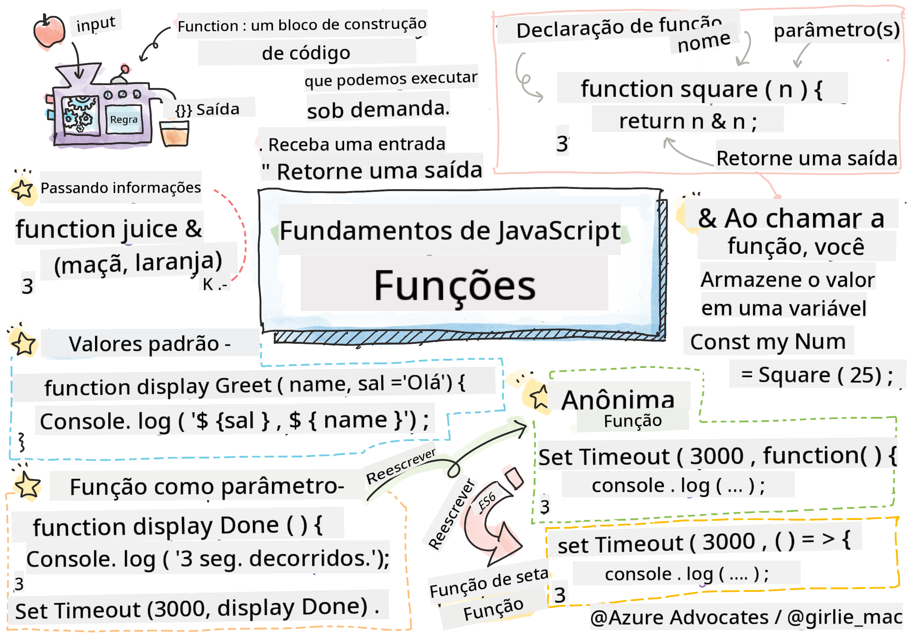
> Sketchnote por [Tomomi Imura](https://twitter.com/girlie_mac)

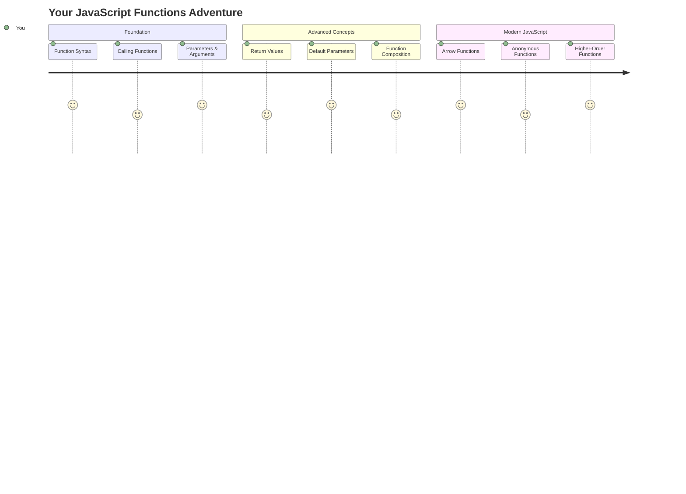

## Quiz Pré-Aula
[Quiz pré-aula](https://ff-quizzes.netlify.app)

Escrever o mesmo código repetidamente é uma das frustrações mais comuns na programação. As funções resolvem esse problema ao permitir que você agrupe o código em blocos reutilizáveis. Pense nas funções como as peças padronizadas que tornaram a linha de montagem de Henry Ford revolucionária – uma vez que você cria um componente confiável, pode usá-lo onde for necessário sem precisar refazer do zero.

As funções permitem que você agrupe partes do código para reutilizá-las ao longo do seu programa. Em vez de copiar e colar a mesma lógica em todos os lugares, você pode criar uma função uma vez e chamá-la sempre que necessário. Essa abordagem mantém seu código organizado e facilita as atualizações.

Nesta lição, você aprenderá como criar suas próprias funções, passar informações para elas e obter resultados úteis de volta. Você descobrirá a diferença entre funções e métodos, aprenderá abordagens modernas de sintaxe e verá como as funções podem trabalhar com outras funções. Vamos construir esses conceitos passo a passo.

[](https://youtube.com/watch?v=XgKsD6Zwvlc "Métodos e Funções")

> 🎥 Clique na imagem acima para assistir a um vídeo sobre métodos e funções.

> Você pode acessar esta lição no [Microsoft Learn](https://docs.microsoft.com/learn/modules/web-development-101-functions/?WT.mc_id=academic-77807-sagibbon)!

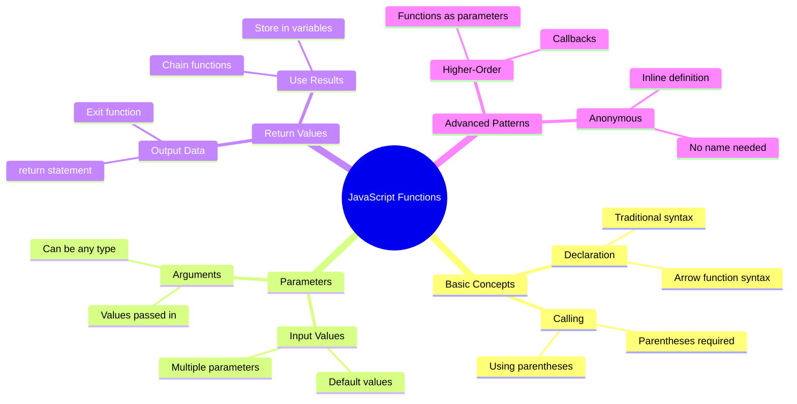

## Funções

Uma função é um bloco de código independente que realiza uma tarefa específica. Ela encapsula a lógica que você pode executar sempre que necessário.

Em vez de escrever o mesmo código várias vezes ao longo do seu programa, você pode agrupá-lo em uma função e chamá-la sempre que precisar. Essa abordagem mantém seu código limpo e facilita as atualizações. Considere o desafio de manutenção se você precisasse alterar uma lógica espalhada por 20 locais diferentes no seu código.

Dar nomes descritivos às suas funções é essencial. Uma função bem nomeada comunica claramente seu propósito – quando você vê `cancelTimer()`, entende imediatamente o que ela faz, assim como um botão claramente rotulado indica exatamente o que acontecerá ao ser clicado.

## Criando e chamando uma função

Vamos examinar como criar uma função. A sintaxe segue um padrão consistente:

```javascript
function nameOfFunction() { // function definition
 // function definition/body
}
```

Vamos detalhar:
- A palavra-chave `function` diz ao JavaScript "Ei, estou criando uma função!"
- `nameOfFunction` é onde você dá um nome descritivo à sua função
- Os parênteses `()` são onde você pode adicionar parâmetros (vamos abordar isso em breve)
- As chaves `{}` contêm o código real que será executado quando você chamar a função

Vamos criar uma função simples de saudação para ver isso em ação:

```javascript
function displayGreeting() {
  console.log('Hello, world!');
}
```

Essa função imprime "Hello, world!" no console. Depois de defini-la, você pode usá-la quantas vezes for necessário.

Para executar (ou "chamar") sua função, escreva o nome dela seguido de parênteses. O JavaScript permite que você defina sua função antes ou depois de chamá-la – o motor do JavaScript cuidará da ordem de execução.

```javascript
// calling our function
displayGreeting();
```

Quando você executa essa linha, ela executa todo o código dentro da sua função `displayGreeting`, exibindo "Hello, world!" no console do navegador. Você pode chamar essa função repetidamente.

### 🧠 **Verificação de Fundamentos de Funções: Construindo Suas Primeiras Funções**

**Vamos ver como você está se saindo com as funções básicas:**
- Você consegue explicar por que usamos chaves `{}` nas definições de funções?
- O que acontece se você escrever `displayGreeting` sem os parênteses?
- Por que você pode querer chamar a mesma função várias vezes?

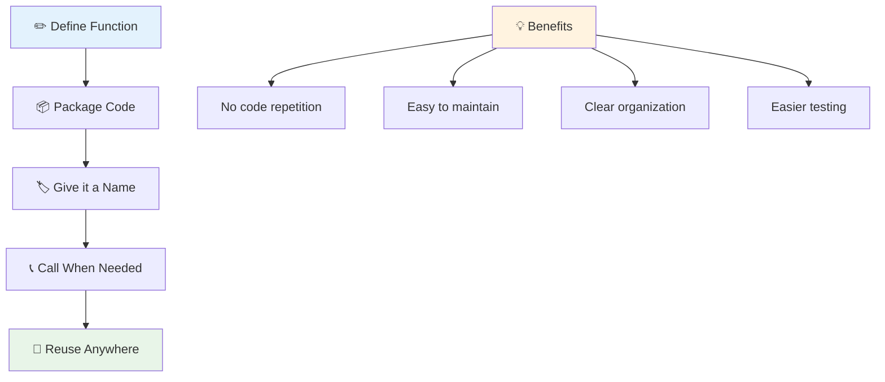

> **Nota:** Você tem usado **métodos** ao longo dessas lições. `console.log()` é um método – essencialmente uma função que pertence ao objeto `console`. A principal diferença é que os métodos estão vinculados a objetos, enquanto as funções são independentes. Muitos desenvolvedores usam esses termos de forma intercambiável em conversas informais.

### Melhores práticas para funções

Aqui estão algumas dicas para ajudá-lo a escrever ótimas funções:

- Dê nomes claros e descritivos às suas funções – seu eu do futuro vai agradecer!
- Use **camelCasing** para nomes com várias palavras (como `calculateTotal` em vez de `calculate_total`)
- Mantenha cada função focada em fazer uma coisa bem feita

## Passando informações para uma função

Nossa função `displayGreeting` é limitada – ela só pode exibir "Hello, world!" para todos. Os parâmetros nos permitem tornar as funções mais flexíveis e úteis.

**Parâmetros** funcionam como espaços reservados onde você pode inserir valores diferentes cada vez que usa a função. Dessa forma, a mesma função pode trabalhar com informações diferentes em cada chamada.

Você lista os parâmetros dentro dos parênteses ao definir sua função, separando múltiplos parâmetros com vírgulas:

```javascript
function name(param, param2, param3) {

}
```

Cada parâmetro funciona como um espaço reservado – quando alguém chama sua função, fornecerá valores reais que serão inseridos nesses espaços.

Vamos atualizar nossa função de saudação para aceitar o nome de alguém:

```javascript
function displayGreeting(name) {
  const message = `Hello, ${name}!`;
  console.log(message);
}
```

Observe como estamos usando crases (`` ` ``) e `${}` para inserir o nome diretamente na nossa mensagem – isso é chamado de template literal, e é uma maneira muito prática de construir strings com variáveis misturadas.

Agora, ao chamar nossa função, podemos passar qualquer nome:

```javascript
displayGreeting('Christopher');
// displays "Hello, Christopher!" when run
```

O JavaScript pega a string `'Christopher'`, atribui ao parâmetro `name` e cria a mensagem personalizada "Hello, Christopher!"

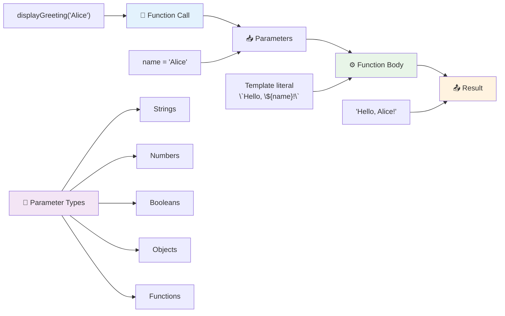

## Valores padrão

E se quisermos tornar alguns parâmetros opcionais? É aí que os valores padrão são úteis!

Digamos que queremos permitir que as pessoas personalizem a palavra de saudação, mas, se não especificarem uma, usaremos "Hello" como padrão. Você pode configurar valores padrão usando o sinal de igual, assim como ao definir uma variável:

```javascript
function displayGreeting(name, salutation='Hello') {
  console.log(`${salutation}, ${name}`);
}
```

Aqui, `name` ainda é obrigatório, mas `salutation` tem um valor de backup `'Hello'` caso ninguém forneça uma saudação diferente.

Agora podemos chamar essa função de duas maneiras diferentes:

```javascript
displayGreeting('Christopher');
// displays "Hello, Christopher"

displayGreeting('Christopher', 'Hi');
// displays "Hi, Christopher"
```

Na primeira chamada, o JavaScript usa o padrão "Hello", já que não especificamos uma saudação. Na segunda chamada, ele usa nosso "Hi" personalizado. Essa flexibilidade torna as funções adaptáveis a diferentes cenários.

### 🎛️ **Verificação de Domínio de Parâmetros: Tornando Funções Flexíveis**

**Teste sua compreensão sobre parâmetros:**
- Qual é a diferença entre um parâmetro e um argumento?
- Por que os valores padrão são úteis na programação do mundo real?
- Você consegue prever o que acontece se passar mais argumentos do que parâmetros?

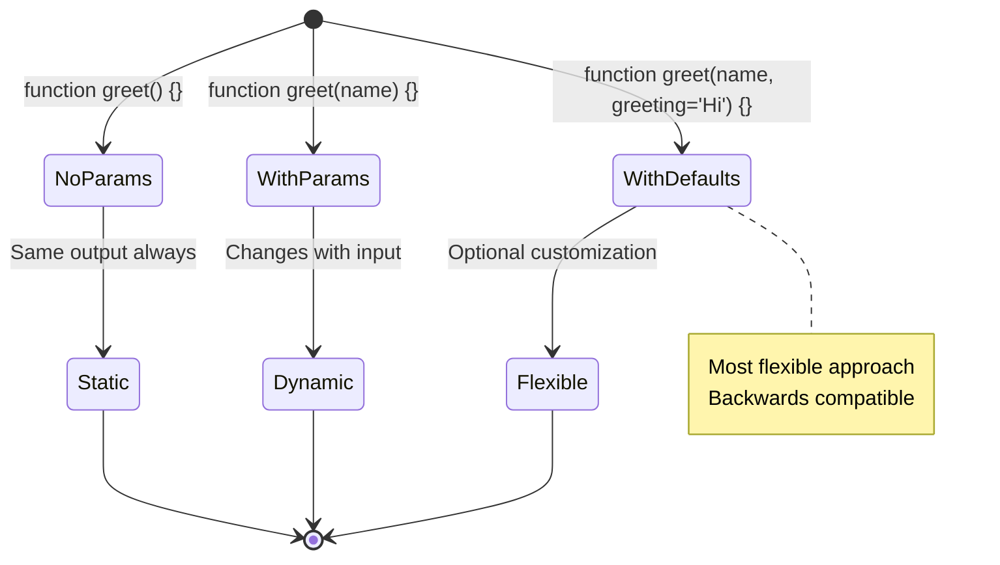

> **Dica profissional**: Parâmetros padrão tornam suas funções mais amigáveis. Os usuários podem começar rapidamente com padrões sensatos, mas ainda personalizar quando necessário!

## Valores de retorno

Nossas funções até agora apenas exibiram mensagens no console, mas e se você quiser que uma função calcule algo e devolva o resultado?

É aí que entram os **valores de retorno**. Em vez de apenas exibir algo, uma função pode devolver um valor que você pode armazenar em uma variável ou usar em outras partes do seu código.

Para enviar um valor de volta, você usa a palavra-chave `return` seguida do que deseja retornar:

```javascript
return myVariable;
```

Aqui está algo importante: quando uma função encontra uma instrução `return`, ela para imediatamente de executar e envia esse valor de volta para quem a chamou.

Vamos modificar nossa função de saudação para retornar a mensagem em vez de exibi-la:

```javascript
function createGreetingMessage(name) {
  const message = `Hello, ${name}`;
  return message;
}
```

Agora, em vez de exibir a saudação, essa função cria a mensagem e a devolve para nós.

Para usar o valor retornado, podemos armazená-lo em uma variável como qualquer outro valor:

```javascript
const greetingMessage = createGreetingMessage('Christopher');
```

Agora `greetingMessage` contém "Hello, Christopher" e podemos usá-lo em qualquer lugar do nosso código – para exibi-lo em uma página da web, incluí-lo em um e-mail ou passá-lo para outra função.

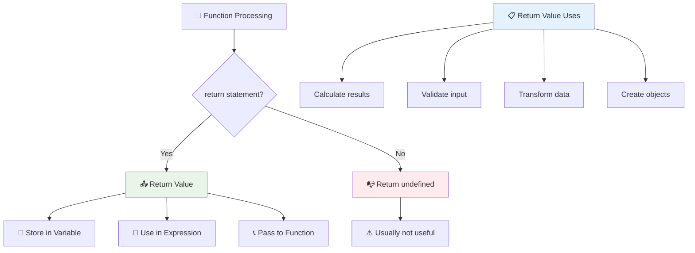

### 🔄 **Verificação de Valores de Retorno: Obtendo Resultados de Volta**

**Avalie sua compreensão sobre valores de retorno:**
- O que acontece com o código após uma instrução `return` em uma função?
- Por que retornar valores geralmente é melhor do que apenas exibir no console?
- Uma função pode retornar diferentes tipos de valores (string, número, booleano)?

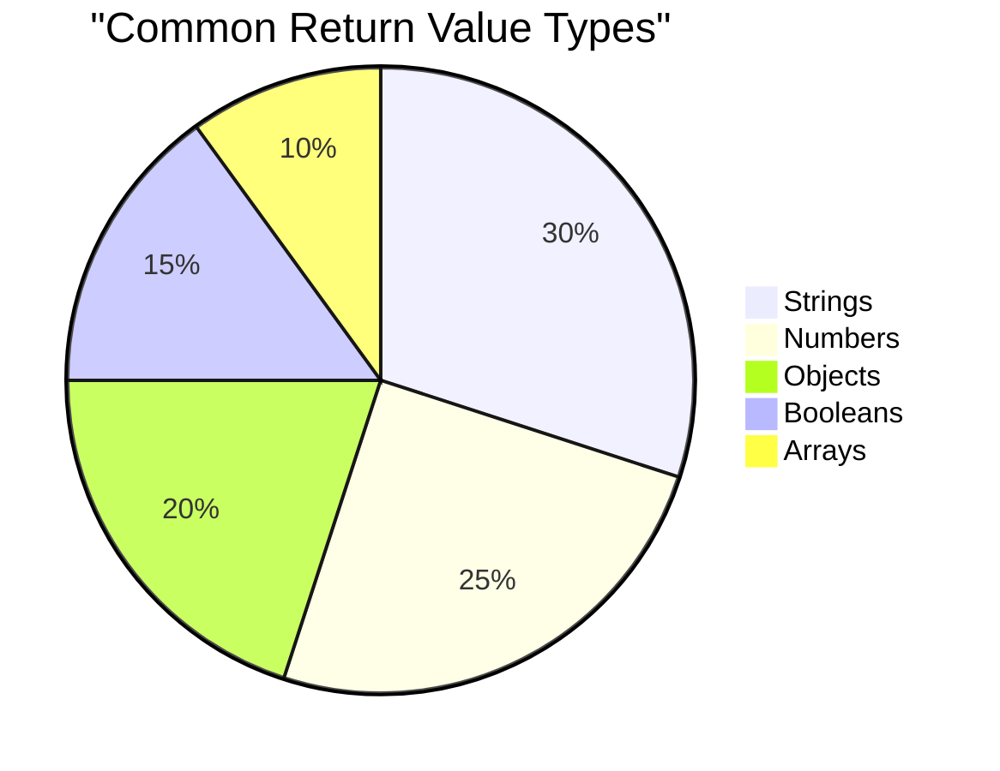

> **Insight chave**: Funções que retornam valores são mais versáteis porque quem chama decide o que fazer com o resultado. Isso torna seu código mais modular e reutilizável!

## Funções como parâmetros para funções

Funções podem ser passadas como parâmetros para outras funções. Embora esse conceito possa parecer complexo inicialmente, é um recurso poderoso que permite padrões de programação flexíveis.

Esse padrão é muito comum quando você quer dizer "quando algo acontecer, faça essa outra coisa". Por exemplo, "quando o temporizador terminar, execute este código" ou "quando o usuário clicar no botão, chame esta função".

Vamos olhar para `setTimeout`, que é uma função embutida que espera um certo tempo e então executa algum código. Precisamos dizer a ela qual código executar – caso perfeito para passar uma função!

Experimente este código – após 3 segundos, você verá uma mensagem:

```javascript
function displayDone() {
  console.log('3 seconds has elapsed');
}
// timer value is in milliseconds
setTimeout(displayDone, 3000);
```

Observe como passamos `displayDone` (sem parênteses) para `setTimeout`. Não estamos chamando a função nós mesmos – estamos entregando-a para `setTimeout` e dizendo "chame isso em 3 segundos."

### Funções anônimas

Às vezes, você precisa de uma função para apenas uma coisa e não quer dar um nome a ela. Pense nisso – se você só vai usar uma função uma vez, por que encher seu código com um nome extra?

O JavaScript permite criar **funções anônimas** – funções sem nomes que você pode definir exatamente onde precisa delas.

Aqui está como podemos reescrever nosso exemplo do temporizador usando uma função anônima:

```javascript
setTimeout(function() {
  console.log('3 seconds has elapsed');
}, 3000);
```

Isso alcança o mesmo resultado, mas a função é definida diretamente dentro da chamada `setTimeout`, eliminando a necessidade de uma declaração de função separada.

### Funções de seta

O JavaScript moderno tem uma maneira ainda mais curta de escrever funções, chamadas **funções de seta**. Elas usam `=>` (que parece uma seta – entendeu?) e são super populares entre os desenvolvedores.

As funções de seta permitem que você pule a palavra-chave `function` e escreva um código mais conciso.

Aqui está nosso exemplo do temporizador usando uma função de seta:

```javascript
setTimeout(() => {
  console.log('3 seconds has elapsed');
}, 3000);
```

Os `()` são onde os parâmetros iriam (vazio neste caso), depois vem a seta `=>`, e finalmente o corpo da função entre chaves. Isso fornece a mesma funcionalidade com uma sintaxe mais concisa.

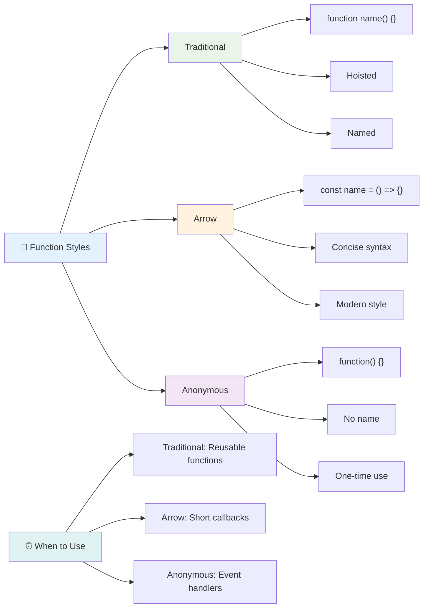

### Quando usar cada estratégia

Quando você deve usar cada abordagem? Uma diretriz prática: se você vai usar a função várias vezes, dê um nome a ela e defina-a separadamente. Se for para um uso específico, considere uma função anônima. Tanto as funções de seta quanto a sintaxe tradicional são escolhas válidas, embora as funções de seta sejam predominantes em bases de código modernas de JavaScript.

### 🎨 **Verificação de Estilos de Funções: Escolhendo a Sintaxe Certa**

**Teste sua compreensão sobre sintaxe:**
- Quando você pode preferir funções de seta em vez da sintaxe tradicional de funções?
- Qual é a principal vantagem das funções anônimas?
- Você consegue pensar em uma situação onde uma função nomeada é melhor que uma anônima?

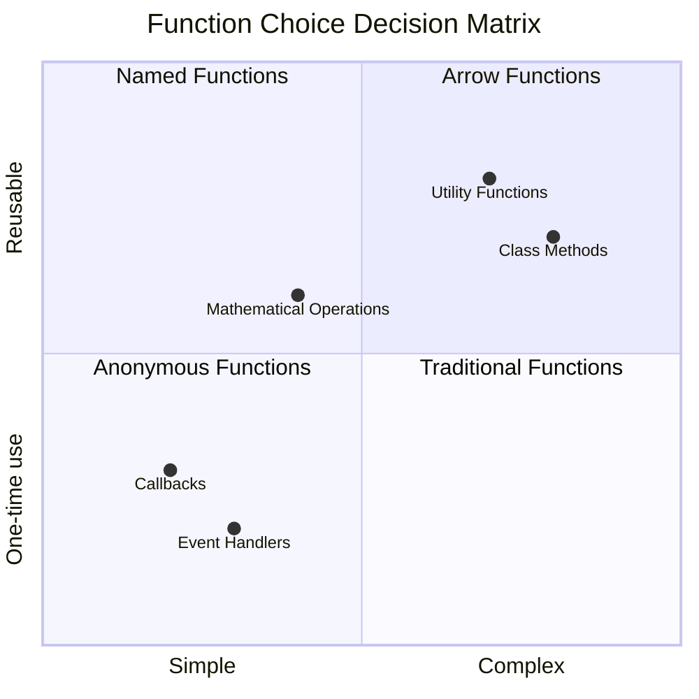

> **Tendência moderna**: Funções de seta estão se tornando a escolha padrão para muitos desenvolvedores devido à sua sintaxe concisa, mas as funções tradicionais ainda têm seu lugar!

---


## 🚀 Desafio

Você consegue articular em uma frase a diferença entre funções e métodos? Tente!

## Desafio do Agente GitHub Copilot 🚀

Use o modo Agente para completar o seguinte desafio:

**Descrição:** Crie uma biblioteca de utilitários matemáticos que demonstre diferentes conceitos de funções abordados nesta lição, incluindo parâmetros, valores padrão, valores de retorno e funções de seta.

**Prompt:** Crie um arquivo JavaScript chamado `mathUtils.js` que contenha as seguintes funções:
1. Uma função `add` que recebe dois parâmetros e retorna sua soma
2. Uma função `multiply` com valores padrão para parâmetros (o segundo parâmetro tem padrão 1)
3. Uma função de seta `square` que recebe um número e retorna seu quadrado
4. Uma função `calculate` que aceita outra função como parâmetro e dois números, aplicando a função a esses números
5. Demonstre a chamada de cada função com casos de teste apropriados

Saiba mais sobre o [modo agente](https://code.visualstudio.com/blogs/2025/02/24/introducing-copilot-agent-mode) aqui.

## Quiz Pós-Aula
[Quiz pós-aula](https://ff-quizzes.netlify.app)

## Revisão e Estudo Individual

Vale a pena [ler um pouco mais sobre funções de seta](https://developer.mozilla.org/docs/Web/JavaScript/Reference/Functions/Arrow_functions), já que elas estão sendo cada vez mais usadas em bases de código. Pratique escrevendo uma função e, em seguida, reescrevendo-a com essa sintaxe.

## Tarefa

[Divirta-se com Funções](assignment.md)

---

## 🧰 **Resumo do Kit de Ferramentas de Funções JavaScript**

```mermaid
graph TD
    A["🎯 JavaScript Functions"] --> B["📋 Function Declaration"]
    A --> C["📥 Parameters"]
    A --> D["📤 Return Values"]
    A --> E["🎨 Modern Syntax"]
    
    B --> B1["function name() {}"]
    B --> B2["Descriptive naming"]
    B --> B3["Reusable code blocks"]
    
    C --> C1["Input data"]
    C --> C2["Default values"]
    C --> C3["Multiple parameters"]
    
    D --> D1["return statement"]
    D --> D2["Exit function"]
    D --> D3["Pass data back"]
    
    E --> E1["Arrow functions: () =>"]
    E --> E2["Anonymous functions"]
    E --> E3["Higher-order functions"]
    
    F["⚡ Key Benefits"] --> F1["Code reusability"]
    F --> F2["Better organization"]
    F --> F3["Easier testing"]
    F --> F4["Modular design"]
    
    style A fill:#e3f2fd
    style B fill:#e8f5e8
    style C fill:#fff3e0
    style D fill:#f3e5f5
    style E fill:#e0f2f1
    style F fill:#fce4ec
```

---

## 🚀 Cronograma de Domínio de Funções JavaScript

### ⚡ **O Que Você Pode Fazer nos Próximos 5 Minutos**
- [ ] Escreva uma função simples que retorne seu número favorito
- [ ] Crie uma função com dois parâmetros que os some juntos
- [ ] Tente converter uma função tradicional para a sintaxe de função de seta
- [ ] Pratique o desafio: explique a diferença entre funções e métodos

### 🎯 **O Que Você Pode Realizar Nesta Hora**
- [ ] Complete o quiz pós-aula e revise quaisquer conceitos confusos
- [ ] Construa a biblioteca de utilitários matemáticos do desafio do GitHub Copilot
- [ ] Crie uma função que utiliza outra função como parâmetro
- [ ] Pratique escrever funções com parâmetros padrão
- [ ] Experimente usar template literals nos valores de retorno de funções

### 📅 **Sua Maestria em Funções ao Longo da Semana**
- [ ] Complete a tarefa "Diversão com Funções" com criatividade
- [ ] Refatore algum código repetitivo que você escreveu em funções reutilizáveis
- [ ] Construa uma pequena calculadora usando apenas funções (sem variáveis globais)
- [ ] Pratique funções de seta com métodos de array como `map()` e `filter()`
- [ ] Crie uma coleção de funções utilitárias para tarefas comuns
- [ ] Estude funções de ordem superior e conceitos de programação funcional

### 🌟 **Sua Transformação ao Longo do Mês**
- [ ] Domine conceitos avançados de funções como closures e escopo
- [ ] Construa um projeto que utilize fortemente composição de funções
- [ ] Contribua para código aberto melhorando a documentação de funções
- [ ] Ensine alguém sobre funções e diferentes estilos de sintaxe
- [ ] Explore paradigmas de programação funcional em JavaScript
- [ ] Crie uma biblioteca pessoal de funções reutilizáveis para projetos futuros

### 🏆 **Check-in Final do Campeão de Funções**

**Celebre sua maestria em funções:**
- Qual é a função mais útil que você criou até agora?
- Como aprender sobre funções mudou sua forma de pensar sobre organização de código?
- Qual sintaxe de função você prefere e por quê?
- Qual problema do mundo real você resolveria escrevendo uma função?

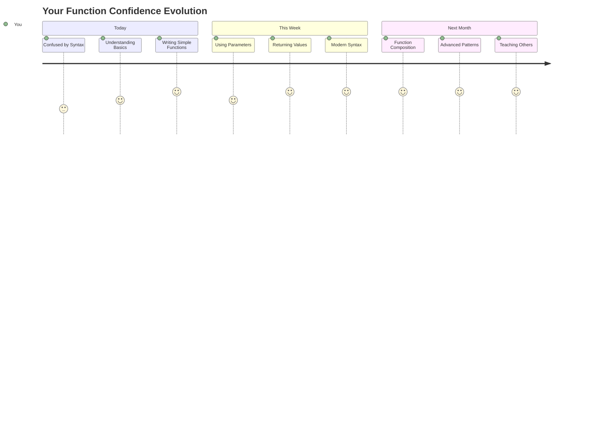

> 🎉 **Você dominou um dos conceitos mais poderosos da programação!** Funções são os blocos de construção de programas maiores. Todo aplicativo que você criar usará funções para organizar, reutilizar e estruturar o código. Agora você entende como empacotar lógica em componentes reutilizáveis, tornando-se um programador mais eficiente e eficaz. Bem-vindo ao mundo da programação modular! 🚀

---

**Aviso Legal**:  
Este documento foi traduzido utilizando o serviço de tradução por IA [Co-op Translator](https://github.com/Azure/co-op-translator). Embora nos esforcemos para garantir a precisão, esteja ciente de que traduções automatizadas podem conter erros ou imprecisões. O documento original em seu idioma nativo deve ser considerado a fonte autoritativa. Para informações críticas, recomenda-se a tradução profissional humana. Não nos responsabilizamos por quaisquer mal-entendidos ou interpretações incorretas decorrentes do uso desta tradução.