<!--
CO_OP_TRANSLATOR_METADATA:
{
  "original_hash": "c688385d15dd3645e924ea0ffee8967f",
  "translation_date": "2025-11-03T23:59:52+00:00",
  "source_file": "2-js-basics/3-making-decisions/README.md",
  "language_code": "br"
}
-->
# Fundamentos de JavaScript: Tomando Decisões

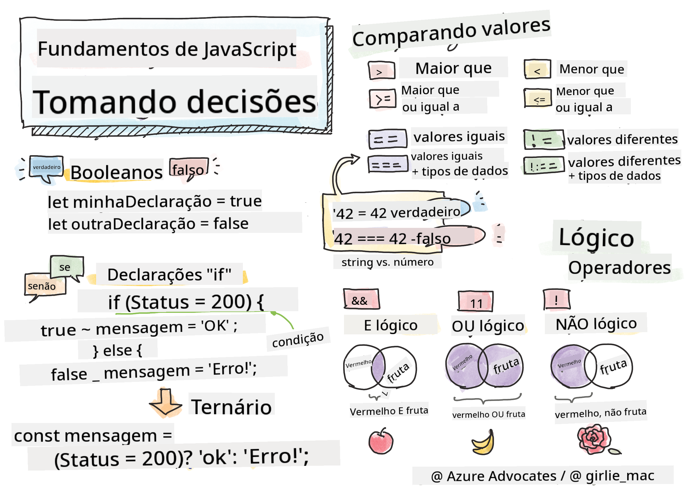

> Sketchnote por [Tomomi Imura](https://twitter.com/girlie_mac)

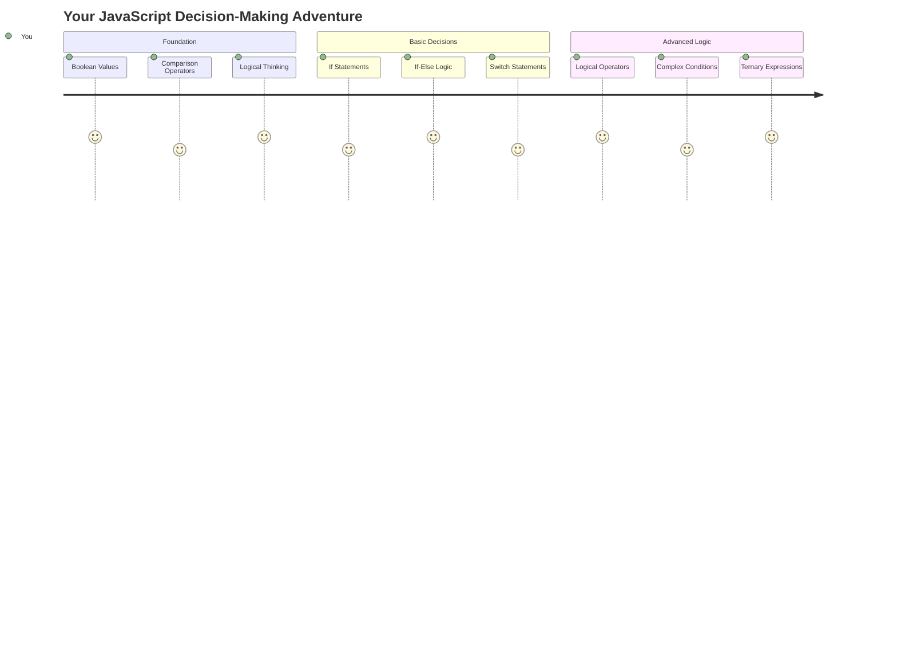

Já se perguntou como os aplicativos tomam decisões inteligentes? Como um sistema de navegação escolhe a rota mais rápida ou como um termostato decide quando ligar o aquecimento? Esse é o conceito fundamental de tomada de decisões na programação.

Assim como a Máquina Analítica de Charles Babbage foi projetada para seguir diferentes sequências de operações com base em condições, os programas modernos em JavaScript precisam fazer escolhas baseadas em circunstâncias variadas. Essa capacidade de ramificar e tomar decisões é o que transforma código estático em aplicativos responsivos e inteligentes.

Nesta lição, você aprenderá como implementar lógica condicional em seus programas. Vamos explorar declarações condicionais, operadores de comparação e expressões lógicas que permitem ao seu código avaliar situações e responder adequadamente.

## Quiz Pré-Aula

[Quiz pré-aula](https://ff-quizzes.netlify.app/web/quiz/11)

A capacidade de tomar decisões e controlar o fluxo de um programa é um aspecto fundamental da programação. Esta seção aborda como controlar o caminho de execução dos seus programas em JavaScript usando valores Booleanos e lógica condicional.

[](https://youtube.com/watch?v=SxTp8j-fMMY "Tomando Decisões")

> 🎥 Clique na imagem acima para assistir a um vídeo sobre tomada de decisões.

> Você pode acessar esta lição no [Microsoft Learn](https://docs.microsoft.com/learn/modules/web-development-101-if-else/?WT.mc_id=academic-77807-sagibbon)!

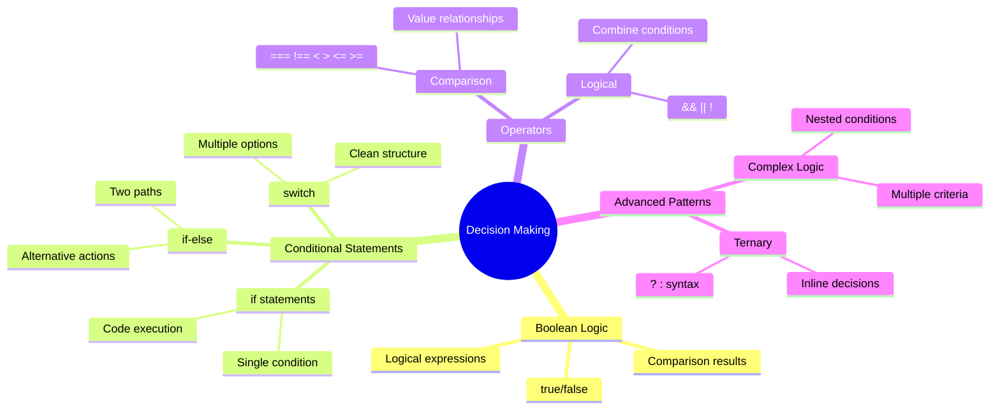

## Uma Breve Revisão sobre Booleanos

Antes de explorar a tomada de decisões, vamos revisitar os valores Booleanos da nossa lição anterior. Nomeados em homenagem ao matemático George Boole, esses valores representam estados binários – `true` ou `false`. Não há ambiguidade, nem meio-termo.

Esses valores binários formam a base de toda lógica computacional. Toda decisão que seu programa toma, em última análise, se reduz a uma avaliação Booleana.

Criar variáveis Booleanas é simples:

```javascript
let myTrueBool = true;
let myFalseBool = false;
```

Isso cria duas variáveis com valores Booleanos explícitos.

✅ Os Booleanos foram nomeados em homenagem ao matemático, filósofo e lógico inglês George Boole (1815–1864).

## Operadores de Comparação e Booleanos

Na prática, você raramente definirá valores Booleanos manualmente. Em vez disso, você os gerará avaliando condições: "Este número é maior que aquele?" ou "Esses valores são iguais?"

Os operadores de comparação permitem essas avaliações. Eles comparam valores e retornam resultados Booleanos com base na relação entre os operandos.

| Símbolo | Descrição                                                                                                                                                   | Exemplo            |
| ------ | ------------------------------------------------------------------------------------------------------------------------------------------------------------- | ------------------ |
| `<`    | **Menor que**: Compara dois valores e retorna o tipo de dado Booleano `true` se o valor do lado esquerdo for menor que o do lado direito                      | `5 < 6 // true`    |
| `<=`   | **Menor ou igual a**: Compara dois valores e retorna o tipo de dado Booleano `true` se o valor do lado esquerdo for menor ou igual ao do lado direito         | `5 <= 6 // true`   |
| `>`    | **Maior que**: Compara dois valores e retorna o tipo de dado Booleano `true` se o valor do lado esquerdo for maior que o do lado direito                      | `5 > 6 // false`   |
| `>=`   | **Maior ou igual a**: Compara dois valores e retorna o tipo de dado Booleano `true` se o valor do lado esquerdo for maior ou igual ao do lado direito         | `5 >= 6 // false`  |
| `===`  | **Igualdade estrita**: Compara dois valores e retorna o tipo de dado Booleano `true` se os valores do lado direito e esquerdo forem iguais E do mesmo tipo    | `5 === 6 // false` |
| `!==`  | **Desigualdade**: Compara dois valores e retorna o valor Booleano oposto ao que um operador de igualdade estrita retornaria                                  | `5 !== 6 // true`  |

✅ Teste seu conhecimento escrevendo algumas comparações no console do navegador. Algum dado retornado te surpreendeu?

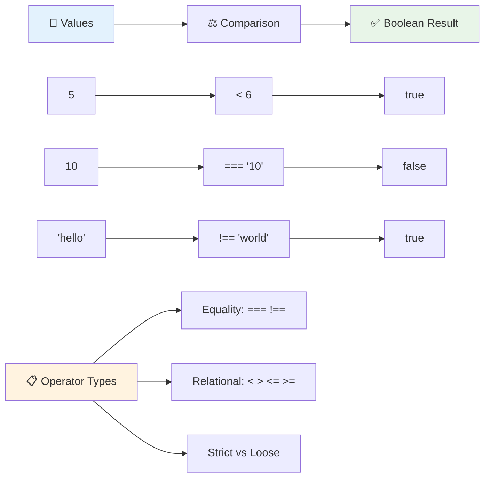

### 🧠 **Domínio de Comparação: Entendendo a Lógica Booleana**

**Teste sua compreensão sobre comparações:**
- Por que você acha que `===` (igualdade estrita) geralmente é preferido em vez de `==` (igualdade frouxa)?
- Você consegue prever o que `5 === '5'` retorna? E `5 == '5'`?
- Qual é a diferença entre `!==` e `!=`?

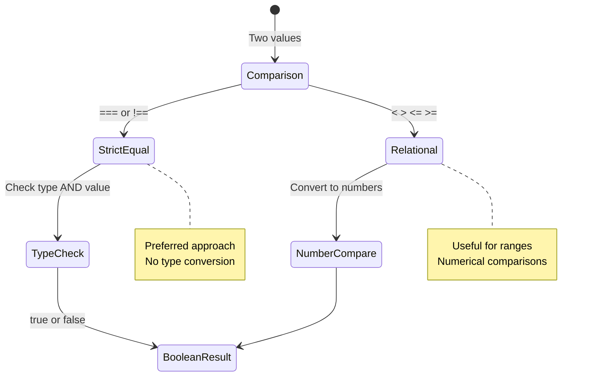

> **Dica profissional**: Sempre use `===` e `!==` para verificações de igualdade, a menos que você precise especificamente de conversão de tipo. Isso evita comportamentos inesperados!

## Declaração If

A declaração `if` é como fazer uma pergunta no seu código. "Se esta condição for verdadeira, então faça isso." Provavelmente é a ferramenta mais importante que você usará para tomar decisões em JavaScript.

Veja como funciona:

```javascript
if (condition) {
  // Condition is true. Code in this block will run.
}
```

A condição vai dentro dos parênteses e, se for `true`, o JavaScript executa o código dentro das chaves. Se for `false`, o JavaScript simplesmente pula todo o bloco.

Você frequentemente usará operadores de comparação para criar essas condições. Vamos ver um exemplo prático:

```javascript
let currentMoney = 1000;
let laptopPrice = 800;

if (currentMoney >= laptopPrice) {
  // Condition is true. Code in this block will run.
  console.log("Getting a new laptop!");
}
```

Como `1000 >= 800` avalia como `true`, o código dentro do bloco é executado, exibindo "Comprando um novo laptop!" no console.

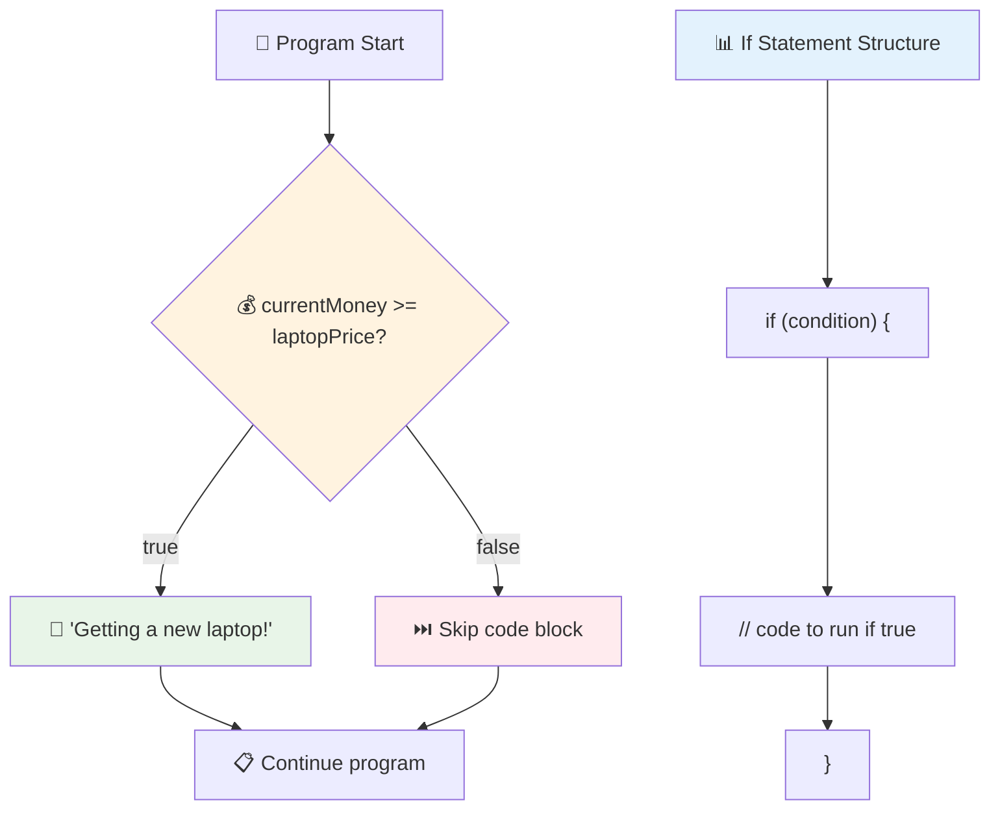

## Declaração If..Else

Mas e se você quiser que seu programa faça algo diferente quando a condição for falsa? É aí que entra o `else` – é como ter um plano de backup.

A declaração `else` oferece uma maneira de dizer "se esta condição não for verdadeira, faça outra coisa."

```javascript
let currentMoney = 500;
let laptopPrice = 800;

if (currentMoney >= laptopPrice) {
  // Condition is true. Code in this block will run.
  console.log("Getting a new laptop!");
} else {
  // Condition is false. Code in this block will run.
  console.log("Can't afford a new laptop, yet!");
}
```

Agora, como `500 >= 800` é `false`, o JavaScript pula o primeiro bloco e executa o bloco `else`. Você verá "Ainda não posso comprar um novo laptop!" no console.

✅ Teste sua compreensão deste código e do código a seguir executando-o no console do navegador. Altere os valores das variáveis currentMoney e laptopPrice para mudar o retorno do `console.log()`.

### 🎯 **Verificação de Lógica If-Else: Caminhos Alternativos**

**Avalie sua compreensão sobre lógica condicional:**
- O que acontece se `currentMoney` for exatamente igual a `laptopPrice`?
- Você consegue pensar em um cenário do mundo real onde a lógica if-else seria útil?
- Como você poderia estender isso para lidar com múltiplas faixas de preço?

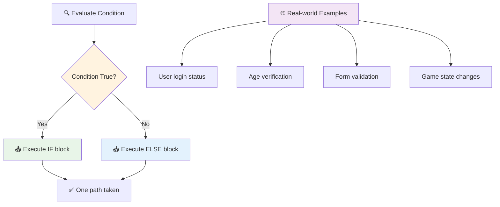

> **Insight importante**: If-else garante que apenas um caminho seja seguido. Isso garante que seu programa sempre tenha uma resposta para qualquer condição!

## Declaração Switch

Às vezes, você precisa comparar um valor com várias opções. Embora você possa encadear várias declarações `if..else`, essa abordagem se torna complicada. A declaração `switch` oferece uma estrutura mais limpa para lidar com múltiplos valores discretos.

O conceito se assemelha aos sistemas de comutação mecânica usados em antigos sistemas de telefonia – um valor de entrada determina qual caminho específico a execução segue.

```javascript
switch (expression) {
  case x:
    // code block
    break;
  case y:
    // code block
    break;
  default:
    // code block
}
```

Aqui está como é estruturado:
- O JavaScript avalia a expressão uma vez
- Ele verifica cada `case` para encontrar uma correspondência
- Quando encontra uma correspondência, executa aquele bloco de código
- O `break` diz ao JavaScript para parar e sair do switch
- Se nenhum caso corresponder, ele executa o bloco `default` (se houver)

```javascript
// Program using switch statement for day of week
let dayNumber = 2;
let dayName;

switch (dayNumber) {
  case 1:
    dayName = "Monday";
    break;
  case 2:
    dayName = "Tuesday";
    break;
  case 3:
    dayName = "Wednesday";
    break;
  default:
    dayName = "Unknown day";
    break;
}
console.log(`Today is ${dayName}`);
```

Neste exemplo, o JavaScript vê que `dayNumber` é `2`, encontra o `case 2` correspondente, define `dayName` como "Terça-feira" e então sai do switch. O resultado? "Hoje é terça-feira" é exibido no console.

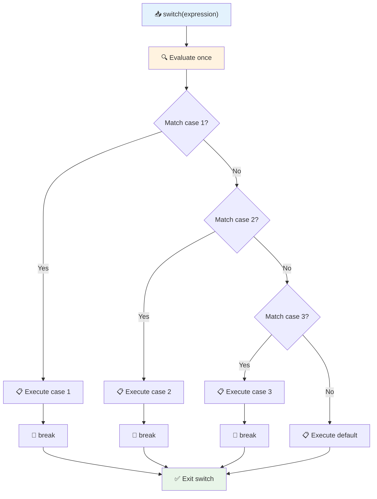

✅ Teste sua compreensão deste código e do código a seguir executando-o no console do navegador. Altere os valores da variável a para mudar o retorno do `console.log()`.

### 🔄 **Domínio do Switch: Múltiplas Opções**

**Teste sua compreensão sobre switch:**
- O que acontece se você esquecer uma declaração `break`?
- Quando você usaria `switch` em vez de múltiplas declarações `if-else`?
- Por que o caso `default` é útil, mesmo que você ache que cobriu todas as possibilidades?

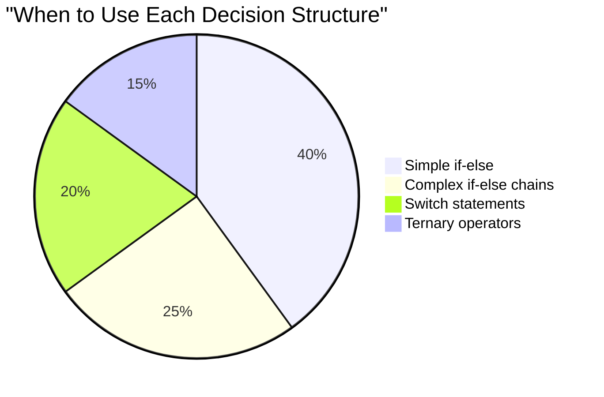

> **Melhor prática**: Use `switch` ao comparar uma variável com múltiplos valores específicos. Use `if-else` para verificações de intervalo ou condições complexas!

## Operadores Lógicos e Booleanos

Decisões complexas frequentemente exigem a avaliação de múltiplas condições simultaneamente. Assim como a álgebra booleana permite que os matemáticos combinem expressões lógicas, a programação fornece operadores lógicos para conectar múltiplas condições Booleanas.

Esses operadores permitem lógica condicional sofisticada ao combinar avaliações simples de verdadeiro/falso.

| Símbolo | Descrição                                                                                     | Exemplo                                                                 |
| ------ | ----------------------------------------------------------------------------------------------- | ----------------------------------------------------------------------- |
| `&&`   | **E lógico**: Compara duas expressões Booleanas. Retorna true **somente** se ambos os lados forem verdadeiros | `(5 > 3) && (5 < 10) // Ambos os lados são verdadeiros. Retorna true` |
| `\|\|` | **OU lógico**: Compara duas expressões Booleanas. Retorna true se pelo menos um dos lados for verdadeiro     | `(5 > 10) \|\| (5 < 10) // Um lado é falso, outro é verdadeiro. Retorna true` |
| `!`    | **NÃO lógico**: Retorna o valor oposto de uma expressão Booleana                             | `!(5 > 10) // 5 não é maior que 10, então "!" torna isso verdadeiro`         |

Esses operadores permitem combinar condições de maneiras úteis:
- E (`&&`) significa que ambas as condições devem ser verdadeiras
- OU (`||`) significa que pelo menos uma condição deve ser verdadeira  
- NÃO (`!`) inverte verdadeiro para falso (e vice-versa)

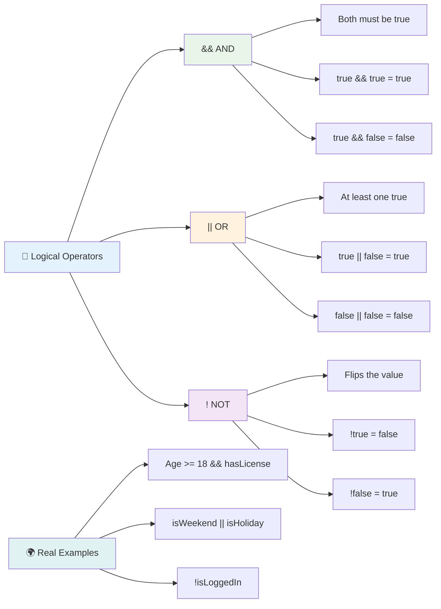

## Condições e Decisões com Operadores Lógicos

Vamos ver esses operadores lógicos em ação com um exemplo mais realista:

```javascript
let currentMoney = 600;
let laptopPrice = 800;
let laptopDiscountPrice = laptopPrice - (laptopPrice * 0.2); // Laptop price at 20 percent off

if (currentMoney >= laptopPrice || currentMoney >= laptopDiscountPrice) {
  // Condition is true. Code in this block will run.
  console.log("Getting a new laptop!");
} else {
  // Condition is false. Code in this block will run.
  console.log("Can't afford a new laptop, yet!");
}
```

Neste exemplo: calculamos um preço com desconto de 20% (640), depois avaliamos se nossos fundos disponíveis cobrem o preço total OU o preço com desconto. Como 600 atende ao limite do preço com desconto de 640, a condição avalia como verdadeira.

### 🧮 **Verificação de Operadores Lógicos: Combinando Condições**

**Teste sua compreensão sobre operadores lógicos:**
- Na expressão `A && B`, o que acontece se A for falso? B ainda será avaliado?
- Você consegue pensar em uma situação onde precisaria usar os três operadores (&&, ||, !) juntos?
- Qual é a diferença entre `!user.isActive` e `user.isActive !== true`?

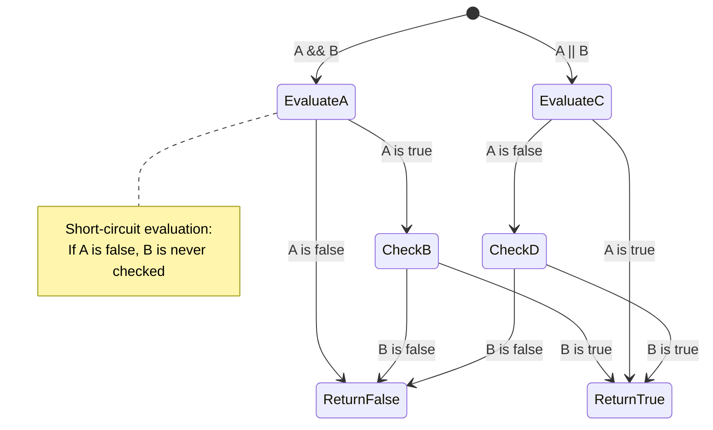

> **Dica de desempenho**: O JavaScript usa "avaliação de curto-circuito" - em `A && B`, se A for falso, B nem é avaliado. Use isso a seu favor!

### Operador de Negação

Às vezes é mais fácil pensar sobre quando algo NÃO é verdadeiro. Por exemplo, em vez de perguntar "O usuário está logado?", você pode querer perguntar "O usuário NÃO está logado?" O operador de exclamação (`!`) inverte a lógica para você.

```javascript
if (!condition) {
  // runs if condition is false
} else {
  // runs if condition is true
}
```

O operador `!` é como dizer "o oposto de..." – se algo é `true`, `!` torna isso `false`, e vice-versa.

### Expressões Ternárias

Para atribuições condicionais simples, o JavaScript fornece o **operador ternário**. Essa sintaxe concisa permite que você escreva uma expressão condicional em uma única linha, útil quando você precisa atribuir um de dois valores com base em uma condição.

```javascript
let variable = condition ? returnThisIfTrue : returnThisIfFalse;
```

Ele funciona como uma pergunta: "Essa condição é verdadeira? Se sim, use este valor. Se não, use aquele valor."

Abaixo está um exemplo mais prático:

```javascript
let firstNumber = 20;
let secondNumber = 10;
let biggestNumber = firstNumber > secondNumber ? firstNumber : secondNumber;
```

✅ Reserve um minuto para ler este código algumas vezes. Você entende como esses operadores estão funcionando?

Aqui está o que essa linha está dizendo: "O `firstNumber` é maior que o `secondNumber`? Se sim, coloque `firstNumber` em `biggestNumber`. Se não, coloque `secondNumber` em `biggestNumber`."

O operador ternário é apenas uma forma mais curta de escrever esta estrutura tradicional de `if..else`:

```javascript
let biggestNumber;
if (firstNumber > secondNumber) {
  biggestNumber = firstNumber;
} else {
  biggestNumber = secondNumber;
}
```

Ambas as abordagens produzem resultados idênticos. O operador ternário oferece concisão, enquanto a estrutura tradicional if-else pode ser mais legível para condições complexas.

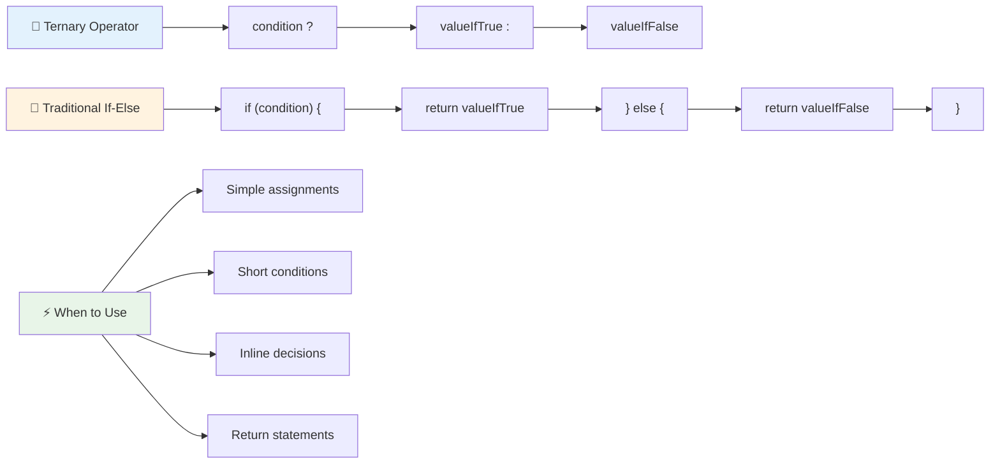

---


## 🚀 Desafio

Crie um programa que seja escrito primeiro com operadores lógicos e, em seguida, reescreva-o usando uma expressão ternária. Qual é a sua sintaxe preferida?

---

## Desafio do Agente GitHub Copilot 🚀

Use o modo Agente para completar o seguinte desafio:

**Descrição:** Crie um calculador de notas abrangente que demonstre múltiplos conceitos de tomada de decisão desta lição, incluindo declarações if-else, switch, operadores lógicos e expressões ternárias.

**Prompt:** Escreva um programa em JavaScript que receba a nota numérica de um aluno (0-100) e determine sua nota em letra usando os seguintes critérios:
- A: 90-100
- B: 80-89  
- C: 70-79
- D: 60-69
- F: Abaixo de 60

Requisitos:
1. Use uma declaração if-else para determinar a nota em letra
2. Use operadores lógicos para verificar se o aluno passou (nota >= 60) E tem honras (nota >= 90)
3. Use uma instrução switch para fornecer feedback específico para cada nota por letra
4. Use um operador ternário para determinar se o aluno está elegível para o próximo curso (nota >= 70)
5. Inclua validação de entrada para garantir que a pontuação esteja entre 0 e 100

Teste seu programa com várias pontuações, incluindo casos extremos como 59, 60, 89, 90 e entradas inválidas.

Saiba mais sobre [modo agente](https://code.visualstudio.com/blogs/2025/02/24/introducing-copilot-agent-mode) aqui.


## Quiz Pós-Aula

[Quiz pós-aula](https://ff-quizzes.netlify.app/web/quiz/12)

## Revisão & Autoestudo

Leia mais sobre os diversos operadores disponíveis para o usuário [no MDN](https://developer.mozilla.org/docs/Web/JavaScript/Reference/Operators).

Explore o incrível [guia de operadores](https://joshwcomeau.com/operator-lookup/) de Josh Comeau!

## Tarefa

[Operadores](assignment.md)

---

## 🧠 **Resumo do Seu Kit de Ferramentas para Tomada de Decisão**

```mermaid
graph TD
    A["🎯 JavaScript Decisions"] --> B["🔍 Boolean Logic"]
    A --> C["📊 Conditional Statements"]
    A --> D["🔗 Logical Operators"]
    A --> E["⚡ Advanced Patterns"]
    
    B --> B1["true/false values"]
    B --> B2["Comparison operators"]
    B --> B3["Truthiness concepts"]
    
    C --> C1["if statements"]
    C --> C2["if-else chains"]
    C --> C3["switch statements"]
    
    D --> D1["&& (AND)"]
    D --> D2["|| (OR)"]
    D --> D3["! (NOT)"]
    
    E --> E1["Ternary operator"]
    E --> E2["Short-circuit evaluation"]
    E --> E3["Complex conditions"]
    
    F["💡 Key Principles"] --> F1["Clear readable conditions"]
    F --> F2["Consistent comparison style"]
    F --> F3["Proper operator precedence"]
    F --> F4["Efficient evaluation order"]
    
    style A fill:#e3f2fd
    style B fill:#e8f5e8
    style C fill:#fff3e0
    style D fill:#f3e5f5
    style E fill:#e0f2f1
    style F fill:#fce4ec
```

---

## 🚀 Sua Linha do Tempo para Dominar a Tomada de Decisões em JavaScript

### ⚡ **O Que Você Pode Fazer nos Próximos 5 Minutos**
- [ ] Pratique operadores de comparação no console do navegador
- [ ] Escreva uma instrução simples if-else que verifica sua idade
- [ ] Experimente o desafio: reescreva um if-else usando um operador ternário
- [ ] Teste o que acontece com diferentes valores "truthy" e "falsy"

### 🎯 **O Que Você Pode Realizar Nesta Hora**
- [ ] Complete o quiz pós-aula e revise quaisquer conceitos confusos
- [ ] Construa o calculador de notas abrangente do desafio do GitHub Copilot
- [ ] Crie uma árvore de decisão simples para um cenário do mundo real (como escolher o que vestir)
- [ ] Pratique combinar múltiplas condições com operadores lógicos
- [ ] Experimente instruções switch para diferentes casos de uso

### 📅 **Sua Maestria em Lógica ao Longo da Semana**
- [ ] Complete a tarefa sobre operadores com exemplos criativos
- [ ] Construa um mini aplicativo de quiz usando várias estruturas condicionais
- [ ] Crie um validador de formulário que verifica múltiplas condições de entrada
- [ ] Pratique os exercícios do [guia de operadores](https://joshwcomeau.com/operator-lookup/) de Josh Comeau
- [ ] Refatore códigos existentes para usar estruturas condicionais mais apropriadas
- [ ] Estude avaliação de curto-circuito e implicações de desempenho

### 🌟 **Sua Transformação ao Longo do Mês**
- [ ] Domine condições complexas aninhadas e mantenha a legibilidade do código
- [ ] Construa um aplicativo com lógica de tomada de decisão sofisticada
- [ ] Contribua para projetos de código aberto melhorando a lógica condicional em projetos existentes
- [ ] Ensine outra pessoa sobre diferentes estruturas condicionais e quando usar cada uma
- [ ] Explore abordagens de programação funcional para lógica condicional
- [ ] Crie um guia de referência pessoal para melhores práticas condicionais

### 🏆 **Check-in Final do Campeão em Tomada de Decisão**

**Comemore sua maestria em pensamento lógico:**
- Qual foi a lógica de decisão mais complexa que você implementou com sucesso?
- Qual estrutura condicional parece mais natural para você e por quê?
- Como aprender sobre operadores lógicos mudou sua abordagem para resolver problemas?
- Qual aplicação do mundo real se beneficiaria de uma lógica de tomada de decisão sofisticada?

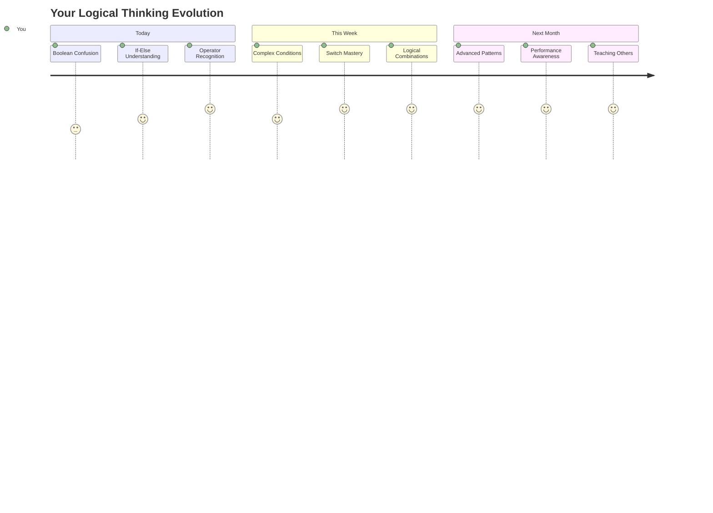

> 🧠 **Você dominou a arte da tomada de decisão digital!** Todo aplicativo interativo depende de lógica condicional para responder inteligentemente às ações do usuário e às condições em mudança. Agora você entende como fazer seus programas pensarem, avaliarem e escolherem respostas apropriadas. Essa base lógica impulsionará todos os aplicativos dinâmicos que você construir! 🎉

---

**Aviso Legal**:  
Este documento foi traduzido utilizando o serviço de tradução por IA [Co-op Translator](https://github.com/Azure/co-op-translator). Embora nos esforcemos para garantir a precisão, esteja ciente de que traduções automáticas podem conter erros ou imprecisões. O documento original em seu idioma nativo deve ser considerado a fonte autoritativa. Para informações críticas, recomenda-se a tradução profissional humana. Não nos responsabilizamos por quaisquer mal-entendidos ou interpretações incorretas decorrentes do uso desta tradução.