<!--
CO_OP_TRANSLATOR_METADATA:
{
  "original_hash": "1710a50a519a6e4a1b40a5638783018d",
  "translation_date": "2025-11-03T23:59:24+00:00",
  "source_file": "2-js-basics/4-arrays-loops/README.md",
  "language_code": "br"
}
-->
# Noções Básicas de JavaScript: Arrays e Loops

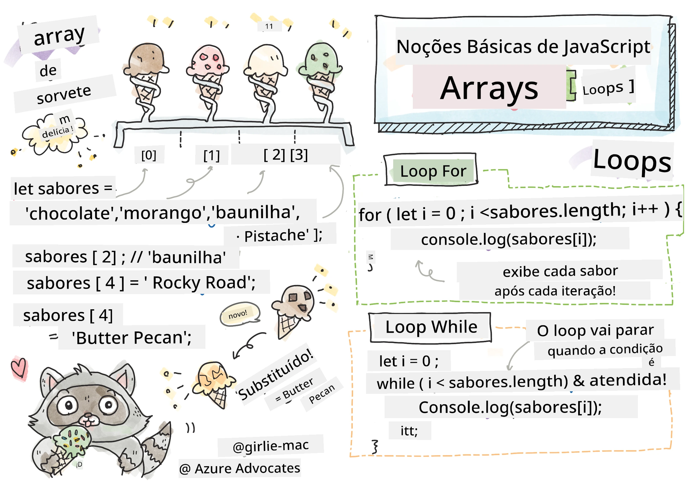
> Sketchnote por [Tomomi Imura](https://twitter.com/girlie_mac)

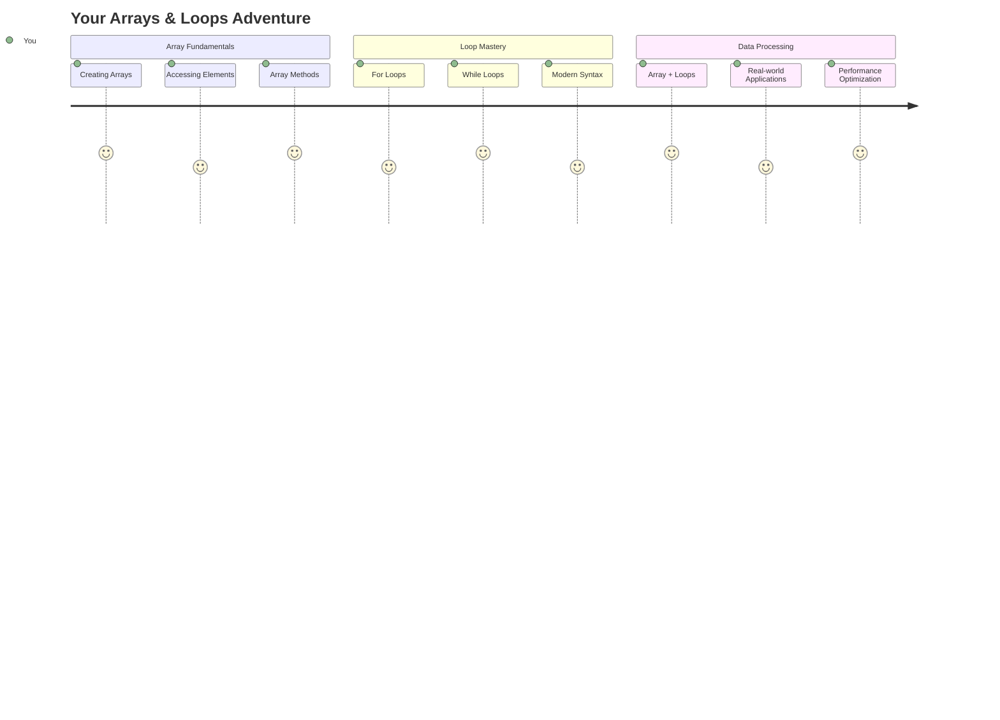

## Quiz Pré-Aula
[Quiz pré-aula](https://ff-quizzes.netlify.app/web/quiz/13)

Já se perguntou como os sites conseguem acompanhar os itens do carrinho de compras ou exibir sua lista de amigos? É aí que entram os arrays e os loops. Arrays são como recipientes digitais que armazenam várias informações, enquanto os loops permitem que você trabalhe com todos esses dados de forma eficiente, sem precisar repetir o código.

Juntos, esses dois conceitos formam a base para lidar com informações nos seus programas. Você aprenderá a sair de um código manual e repetitivo para criar códigos inteligentes e eficientes que podem processar centenas ou até milhares de itens rapidamente.

Ao final desta lição, você entenderá como realizar tarefas complexas de manipulação de dados com apenas algumas linhas de código. Vamos explorar esses conceitos essenciais de programação.

[](https://youtube.com/watch?v=1U4qTyq02Xw "Arrays")

[](https://www.youtube.com/watch?v=Eeh7pxtTZ3k "Loops")

> 🎥 Clique nas imagens acima para assistir aos vídeos sobre arrays e loops.

> Você pode acessar esta lição no [Microsoft Learn](https://docs.microsoft.com/learn/modules/web-development-101-arrays/?WT.mc_id=academic-77807-sagibbon)!

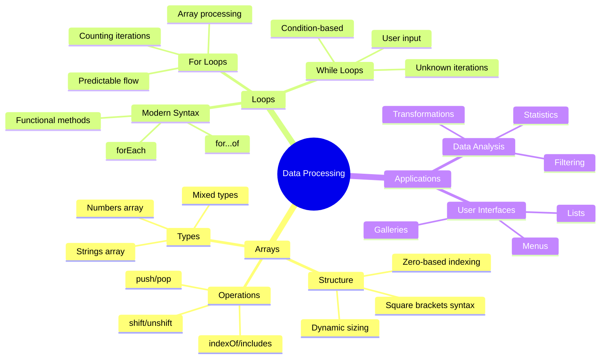

## Arrays

Pense nos arrays como um arquivo digital - em vez de armazenar um documento por gaveta, você pode organizar vários itens relacionados em um único recipiente estruturado. Em termos de programação, os arrays permitem armazenar várias informações em um único pacote organizado.

Seja para criar uma galeria de fotos, gerenciar uma lista de tarefas ou acompanhar as pontuações de um jogo, os arrays fornecem a base para a organização de dados. Vamos ver como eles funcionam.

✅ Arrays estão por toda parte! Consegue pensar em um exemplo da vida real de um array, como um conjunto de painéis solares?

### Criando Arrays

Criar um array é super simples - basta usar colchetes!

```javascript
// Empty array - like an empty shopping cart waiting for items
const myArray = [];
```

**O que está acontecendo aqui?**
Você acabou de criar um recipiente vazio usando esses colchetes `[]`. Pense nisso como uma prateleira de biblioteca vazia - está pronta para armazenar os livros que você quiser organizar ali.

Você também pode preencher seu array com valores iniciais desde o início:

```javascript
// Your ice cream shop's flavor menu
const iceCreamFlavors = ["Chocolate", "Strawberry", "Vanilla", "Pistachio", "Rocky Road"];

// A user's profile info (mixing different types of data)
const userData = ["John", 25, true, "developer"];

// Test scores for your favorite class
const scores = [95, 87, 92, 78, 85];
```

**Coisas legais para notar:**
- Você pode armazenar texto, números ou até valores verdadeiro/falso no mesmo array
- Basta separar cada item com uma vírgula - fácil!
- Arrays são perfeitos para manter informações relacionadas juntas

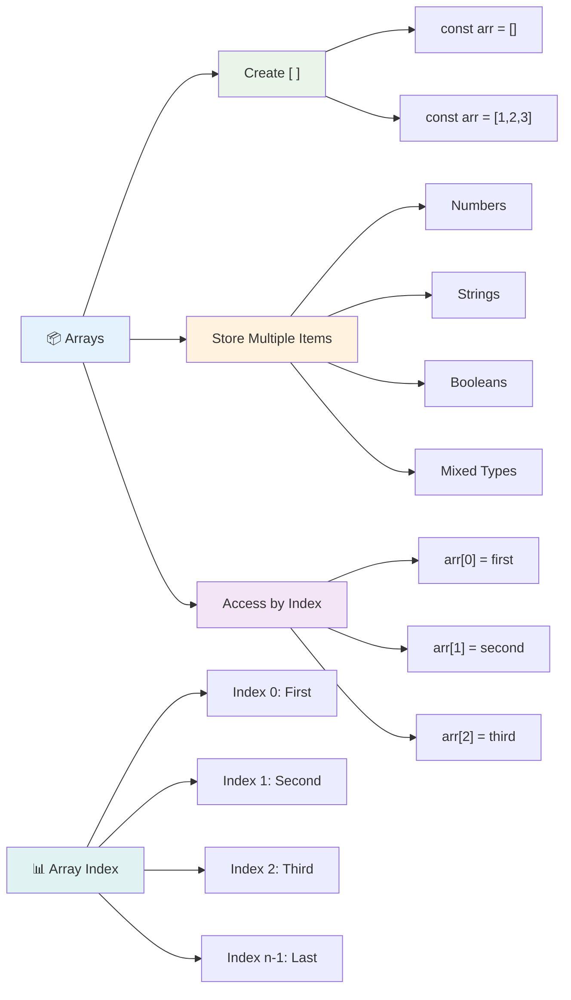

### Indexação de Arrays

Aqui está algo que pode parecer incomum no início: os arrays numeram seus itens começando do 0, não do 1. Essa indexação baseada em zero tem suas raízes em como a memória do computador funciona - é uma convenção de programação desde os primeiros dias de linguagens como C. Cada posição no array recebe um número de endereço chamado **índice**.

| Índice | Valor | Descrição |
|-------|-------|-------------|
| 0 | "Chocolate" | Primeiro elemento |
| 1 | "Morango" | Segundo elemento |
| 2 | "Baunilha" | Terceiro elemento |
| 3 | "Pistache" | Quarto elemento |
| 4 | "Rocky Road" | Quinto elemento |

✅ Surpreende você que os arrays comecem no índice zero? Em algumas linguagens de programação, os índices começam em 1. Há uma história interessante sobre isso, que você pode [ler na Wikipedia](https://en.wikipedia.org/wiki/Zero-based_numbering).

**Acessando Elementos do Array:**

```javascript
const iceCreamFlavors = ["Chocolate", "Strawberry", "Vanilla", "Pistachio", "Rocky Road"];

// Access individual elements using bracket notation
console.log(iceCreamFlavors[0]); // "Chocolate" - first element
console.log(iceCreamFlavors[2]); // "Vanilla" - third element
console.log(iceCreamFlavors[4]); // "Rocky Road" - last element
```

**Entenda o que acontece aqui:**
- **Usa** notação de colchetes com o número do índice para acessar elementos
- **Retorna** o valor armazenado naquela posição específica no array
- **Começa** a contar do 0, tornando o primeiro elemento o índice 0

**Modificando Elementos do Array:**

```javascript
// Change an existing value
iceCreamFlavors[4] = "Butter Pecan";
console.log(iceCreamFlavors[4]); // "Butter Pecan"

// Add a new element at the end
iceCreamFlavors[5] = "Cookie Dough";
console.log(iceCreamFlavors[5]); // "Cookie Dough"
```

**No exemplo acima, nós:**
- **Modificamos** o elemento no índice 4 de "Rocky Road" para "Butter Pecan"
- **Adicionamos** um novo elemento "Cookie Dough" no índice 5
- **Expandimos** automaticamente o tamanho do array ao adicionar além dos limites atuais

### Comprimento do Array e Métodos Comuns

Os arrays vêm com propriedades e métodos embutidos que tornam o trabalho com dados muito mais fácil.

**Encontrando o Comprimento do Array:**

```javascript
const iceCreamFlavors = ["Chocolate", "Strawberry", "Vanilla", "Pistachio", "Rocky Road"];
console.log(iceCreamFlavors.length); // 5

// Length updates automatically as array changes
iceCreamFlavors.push("Mint Chip");
console.log(iceCreamFlavors.length); // 6
```

**Pontos-chave para lembrar:**
- **Retorna** o número total de elementos no array
- **Atualiza** automaticamente quando elementos são adicionados ou removidos
- **Fornece** uma contagem dinâmica útil para loops e validação

**Métodos Essenciais de Arrays:**

```javascript
const fruits = ["apple", "banana", "orange"];

// Add elements
fruits.push("grape");           // Adds to end: ["apple", "banana", "orange", "grape"]
fruits.unshift("strawberry");   // Adds to beginning: ["strawberry", "apple", "banana", "orange", "grape"]

// Remove elements
const lastFruit = fruits.pop();        // Removes and returns "grape"
const firstFruit = fruits.shift();     // Removes and returns "strawberry"

// Find elements
const index = fruits.indexOf("banana"); // Returns 1 (position of "banana")
const hasApple = fruits.includes("apple"); // Returns true
```

**Entendendo esses métodos:**
- **Adiciona** elementos com `push()` (final) e `unshift()` (início)
- **Remove** elementos com `pop()` (final) e `shift()` (início)
- **Localiza** elementos com `indexOf()` e verifica existência com `includes()`
- **Retorna** valores úteis como elementos removidos ou índices de posição

✅ Experimente você mesmo! Use o console do seu navegador para criar e manipular um array de sua própria criação.

### 🧠 **Verificação de Fundamentos de Arrays: Organizando Seus Dados**

**Teste seu entendimento sobre arrays:**
- Por que você acha que os arrays começam a contar do 0 em vez do 1?
- O que acontece se você tentar acessar um índice que não existe (como `arr[100]` em um array de 5 elementos)?
- Consegue pensar em três cenários do mundo real onde os arrays seriam úteis?

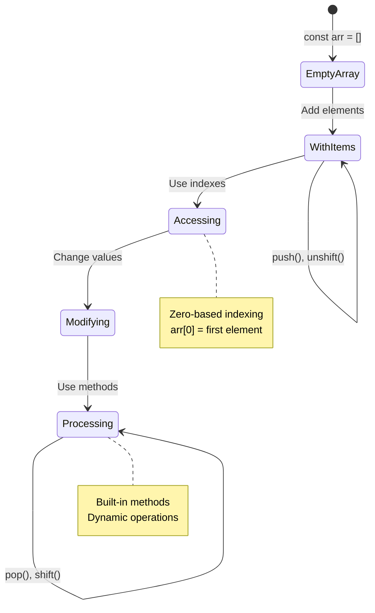

> **Insight do mundo real**: Arrays estão em toda parte na programação! Feeds de redes sociais, carrinhos de compras, galerias de fotos, músicas de playlists - todos são arrays nos bastidores!

## Loops

Pense no famoso castigo dos romances de Charles Dickens, onde os alunos tinham que escrever frases repetidamente em uma lousa. Imagine se você pudesse simplesmente instruir alguém a "escrever esta frase 100 vezes" e ter isso feito automaticamente. É exatamente isso que os loops fazem pelo seu código.

Os loops são como ter um assistente incansável que pode repetir tarefas sem erros. Seja para verificar cada item em um carrinho de compras ou exibir todas as fotos em um álbum, os loops lidam com a repetição de forma eficiente.

O JavaScript oferece vários tipos de loops para você escolher. Vamos examinar cada um e entender quando usá-los.

```mermaid
flowchart TD
    A["🔄 Loop Types"] --> B["For Loop"]
    A --> C["While Loop"]
    A --> D["For...of Loop"]
    A --> E["forEach Method"]
    
    B --> B1["Known iterations"]
    B --> B2["Counter-based"]
    B --> B3["for(init; condition; increment)"]
    
    C --> C1["Unknown iterations"]
    C --> C2["Condition-based"]
    C --> C3["while(condition)"]
    
    D --> D1["Modern ES6+"]
    D --> D2["Array iteration"]
    D --> D3["for(item of array)"]
    
    E --> E1["Functional style"]
    E --> E2["Array method"]
    E --> E3["array.forEach(callback)"]
    
    F["⏰ When to Use"] --> F1["For: Counting, indexes"]
    F --> F2["While: User input, searching"]
    F --> F3["For...of: Simple iteration"]
    F --> F4["forEach: Functional programming"]
    
    style A fill:#e3f2fd
    style B fill:#e8f5e8
    style C fill:#fff3e0
    style D fill:#f3e5f5
    style E fill:#e0f2f1
    style F fill:#fce4ec
```

### For Loop

O `for` loop é como configurar um cronômetro - você sabe exatamente quantas vezes quer que algo aconteça. É super organizado e previsível, o que o torna perfeito quando você está trabalhando com arrays ou precisa contar coisas.

**Estrutura do For Loop:**

| Componente | Propósito | Exemplo |
|-----------|---------|----------|
| **Inicialização** | Define o ponto de partida | `let i = 0` |
| **Condição** | Quando continuar | `i < 10` |
| **Incremento** | Como atualizar | `i++` |

```javascript
// Counting from 0 to 9
for (let i = 0; i < 10; i++) {
  console.log(`Count: ${i}`);
}

// More practical example: processing scores
const testScores = [85, 92, 78, 96, 88];
for (let i = 0; i < testScores.length; i++) {
  console.log(`Student ${i + 1}: ${testScores[i]}%`);
}
```

**Passo a passo, aqui está o que acontece:**
- **Inicializa** a variável de contador `i` como 0 no início
- **Verifica** a condição `i < 10` antes de cada iteração
- **Executa** o bloco de código quando a condição é verdadeira
- **Incrementa** `i` em 1 após cada iteração com `i++`
- **Para** quando a condição se torna falsa (quando `i` atinge 10)

✅ Execute este código no console do navegador. O que acontece quando você faz pequenas alterações no contador, na condição ou na expressão de iteração? Consegue fazer com que ele funcione ao contrário, criando uma contagem regressiva?

### 🗓️ **Verificação de Domínio do For Loop: Repetição Controlada**

**Avalie seu entendimento sobre for loops:**
- Quais são as três partes de um for loop e o que cada uma faz?
- Como você faria para percorrer um array ao contrário?
- O que acontece se você esquecer a parte de incremento (`i++`)?

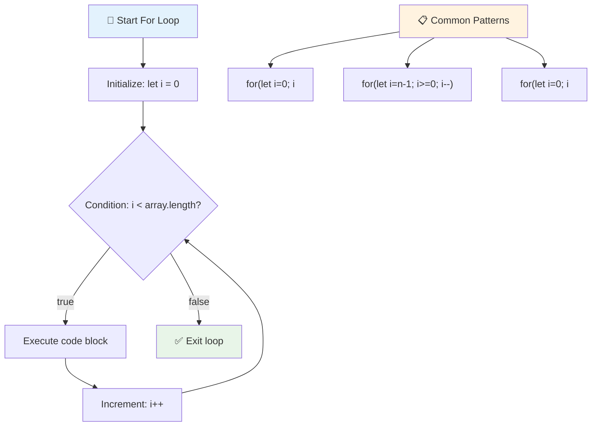

> **Sabedoria sobre loops**: For loops são perfeitos quando você sabe exatamente quantas vezes precisa repetir algo. Eles são a escolha mais comum para processamento de arrays!

### While Loop

O `while` loop é como dizer "continue fazendo isso até..." - você pode não saber exatamente quantas vezes ele será executado, mas sabe quando parar. É perfeito para coisas como pedir uma entrada ao usuário até que ele forneça o que você precisa ou procurar dados até encontrar o que está procurando.

**Características do While Loop:**
- **Continua** executando enquanto a condição for verdadeira
- **Requer** gerenciamento manual de quaisquer variáveis de contador
- **Verifica** a condição antes de cada iteração
- **Risco** de loops infinitos se a condição nunca se tornar falsa

```javascript
// Basic counting example
let i = 0;
while (i < 10) {
  console.log(`While count: ${i}`);
  i++; // Don't forget to increment!
}

// More practical example: processing user input
let userInput = "";
let attempts = 0;
const maxAttempts = 3;

while (userInput !== "quit" && attempts < maxAttempts) {
  userInput = prompt(`Enter 'quit' to exit (attempt ${attempts + 1}):`);
  attempts++;
}

if (attempts >= maxAttempts) {
  console.log("Maximum attempts reached!");
}
```

**Entendendo esses exemplos:**
- **Gerencia** a variável de contador `i` manualmente dentro do corpo do loop
- **Incrementa** o contador para evitar loops infinitos
- **Demonstra** caso de uso prático com entrada do usuário e limite de tentativas
- **Inclui** mecanismos de segurança para evitar execução interminável

### ♾️ **Verificação de Sabedoria do While Loop: Repetição Baseada em Condição**

**Teste sua compreensão sobre while loops:**
- Qual é o principal perigo ao usar while loops?
- Quando você escolheria um while loop em vez de um for loop?
- Como você pode evitar loops infinitos?

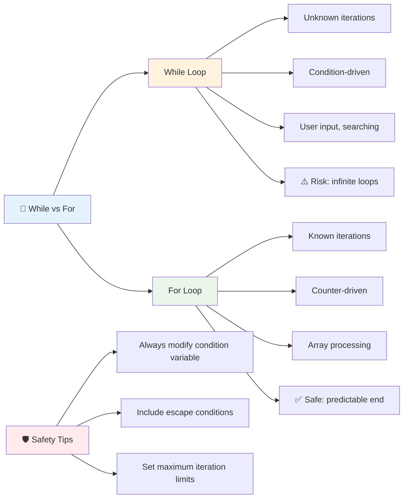

> **Segurança em primeiro lugar**: While loops são poderosos, mas exigem gerenciamento cuidadoso da condição. Sempre garanta que sua condição eventualmente se tornará falsa!

### Alternativas Modernas de Loops

O JavaScript oferece sintaxes modernas de loops que podem tornar seu código mais legível e menos propenso a erros.

**For...of Loop (ES6+):**

```javascript
const colors = ["red", "green", "blue", "yellow"];

// Modern approach - cleaner and safer
for (const color of colors) {
  console.log(`Color: ${color}`);
}

// Compare with traditional for loop
for (let i = 0; i < colors.length; i++) {
  console.log(`Color: ${colors[i]}`);
}
```

**Principais vantagens do for...of:**
- **Elimina** o gerenciamento de índices e possíveis erros de contagem
- **Fornece** acesso direto aos elementos do array
- **Melhora** a legibilidade do código e reduz a complexidade da sintaxe

**Método forEach:**

```javascript
const prices = [9.99, 15.50, 22.75, 8.25];

// Using forEach for functional programming style
prices.forEach((price, index) => {
  console.log(`Item ${index + 1}: $${price.toFixed(2)}`);
});

// forEach with arrow functions for simple operations
prices.forEach(price => console.log(`Price: $${price}`));
```

**O que você precisa saber sobre forEach:**
- **Executa** uma função para cada elemento do array
- **Fornece** tanto o valor do elemento quanto o índice como parâmetros
- **Não pode** ser interrompido antecipadamente (diferente dos loops tradicionais)
- **Retorna** undefined (não cria um novo array)

✅ Por que você escolheria um for loop em vez de um while loop? 17 mil pessoas tiveram a mesma dúvida no StackOverflow, e algumas das opiniões [podem ser interessantes para você](https://stackoverflow.com/questions/39969145/while-loops-vs-for-loops-in-javascript).

### 🎨 **Verificação de Sintaxe Moderna de Loops: Adotando ES6+**

**Avalie sua compreensão sobre JavaScript moderno:**
- Quais são as vantagens do `for...of` em relação aos loops for tradicionais?
- Quando você ainda preferiria loops for tradicionais?
- Qual é a diferença entre `forEach` e `map`?

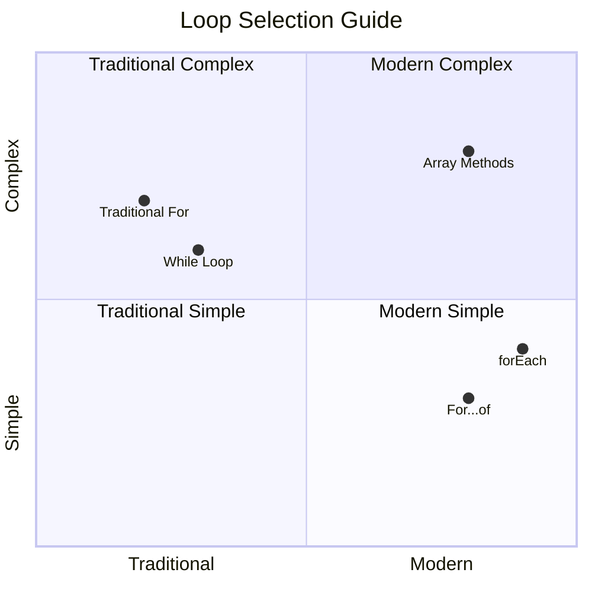

> **Tendência moderna**: A sintaxe ES6+ como `for...of` e `forEach` está se tornando a abordagem preferida para iteração de arrays porque é mais limpa e menos propensa a erros!

## Loops e Arrays

Combinar arrays com loops cria capacidades poderosas de processamento de dados. Essa combinação é fundamental para muitas tarefas de programação, desde exibir listas até calcular estatísticas.

**Processamento Tradicional de Arrays:**

```javascript
const iceCreamFlavors = ["Chocolate", "Strawberry", "Vanilla", "Pistachio", "Rocky Road"];

// Classic for loop approach
for (let i = 0; i < iceCreamFlavors.length; i++) {
  console.log(`Flavor ${i + 1}: ${iceCreamFlavors[i]}`);
}

// Modern for...of approach
for (const flavor of iceCreamFlavors) {
  console.log(`Available flavor: ${flavor}`);
}
```

**Vamos entender cada abordagem:**
- **Usa** a propriedade de comprimento do array para determinar o limite do loop
- **Acessa** elementos por índice em loops for tradicionais
- **Fornece** acesso direto aos elementos em loops for...of
- **Processa** cada elemento do array exatamente uma vez

**Exemplo Prático de Processamento de Dados:**

```javascript
const studentGrades = [85, 92, 78, 96, 88, 73, 89];
let total = 0;
let highestGrade = studentGrades[0];
let lowestGrade = studentGrades[0];

// Process all grades with a single loop
for (let i = 0; i < studentGrades.length; i++) {
  const grade = studentGrades[i];
  total += grade;
  
  if (grade > highestGrade) {
    highestGrade = grade;
  }
  
  if (grade < lowestGrade) {
    lowestGrade = grade;
  }
}

const average = total / studentGrades.length;
console.log(`Average: ${average.toFixed(1)}`);
console.log(`Highest: ${highestGrade}`);
console.log(`Lowest: ${lowestGrade}`);
```

**Aqui está como este código funciona:**
- **Inicializa** variáveis de rastreamento para soma e extremos
- **Processa** cada nota com um único loop eficiente
- **Acumula** o total para cálculo da média
- **Rastreia** os valores mais altos e mais baixos durante a iteração
- **Calcula** estatísticas finais após a conclusão do loop

✅ Experimente percorrer um array criado por você no console do navegador.

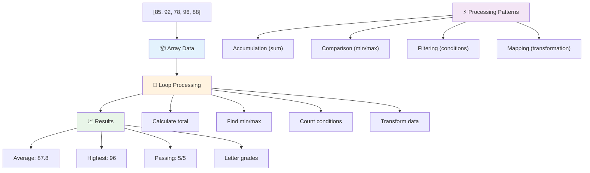

---

## Desafio do Agente GitHub Copilot 🚀

Use o modo Agente para completar o seguinte desafio:

**Descrição:** Construa uma função abrangente de processamento de dados que combine arrays e loops para analisar um conjunto de dados e gerar insights significativos.

**Prompt:** Crie uma função chamada `analyzeGrades` que receba um array de objetos de notas de alunos (cada um contendo propriedades de nome e pontuação) e retorne um objeto com estatísticas incluindo a maior nota, menor nota, nota média, contagem de alunos que passaram (nota >= 70) e um array de nomes de alunos que tiveram notas acima da média. Use pelo menos dois tipos diferentes de loops na sua solução.

Saiba mais sobre o [modo agente](https://code.visualstudio.com/blogs/2025/02/24/introducing-copilot-agent-mode) aqui.

## 🚀 Desafio
O JavaScript oferece vários métodos modernos de array que podem substituir loops tradicionais para tarefas específicas. Explore [forEach](https://developer.mozilla.org/docs/Web/JavaScript/Reference/Global_Objects/Array/forEach), [for-of](https://developer.mozilla.org/docs/Web/JavaScript/Reference/Statements/for...of), [map](https://developer.mozilla.org/docs/Web/JavaScript/Reference/Global_Objects/Array/map), [filter](https://developer.mozilla.org/docs/Web/JavaScript/Reference/Global_Objects/Array/filter) e [reduce](https://developer.mozilla.org/docs/Web/JavaScript/Reference/Global_Objects/Array/reduce).

**Seu desafio:** Refatore o exemplo de notas dos alunos usando pelo menos três métodos de array diferentes. Note como o código se torna mais limpo e legível com a sintaxe moderna do JavaScript.

## Quiz Pós-Aula
[Quiz pós-aula](https://ff-quizzes.netlify.app/web/quiz/14)

## Revisão & Autoestudo

Os arrays no JavaScript possuem muitos métodos associados que são extremamente úteis para manipulação de dados. [Leia sobre esses métodos](https://developer.mozilla.org/docs/Web/JavaScript/Reference/Global_Objects/Array) e experimente alguns deles (como push, pop, slice e splice) em um array criado por você.

## Tarefa

[Iterar um Array](assignment.md)

---

## 📊 **Resumo do Seu Kit de Ferramentas de Arrays e Loops**

```mermaid
graph TD
    A["🎯 Arrays & Loops Mastery"] --> B["📦 Array Fundamentals"]
    A --> C["🔄 Loop Types"]
    A --> D["🔗 Data Processing"]
    A --> E["🎨 Modern Techniques"]
    
    B --> B1["Creation: [ ]"]
    B --> B2["Indexing: arr[0]"]
    B --> B3["Methods: push, pop"]
    B --> B4["Properties: length"]
    
    C --> C1["For: Known iterations"]
    C --> C2["While: Condition-based"]
    C --> C3["For...of: Direct access"]
    C --> C4["forEach: Functional"]
    
    D --> D1["Statistics calculation"]
    D --> D2["Data transformation"]
    D --> D3["Filtering & searching"]
    D --> D4["Real-time processing"]
    
    E --> E1["Arrow functions"]
    E --> E2["Method chaining"]
    E --> E3["Destructuring"]
    E --> E4["Template literals"]
    
    F["💡 Key Benefits"] --> F1["Efficient data handling"]
    F --> F2["Reduced code repetition"]
    F --> F3["Scalable solutions"]
    F --> F4["Cleaner syntax"]
    
    style A fill:#e3f2fd
    style B fill:#e8f5e8
    style C fill:#fff3e0
    style D fill:#f3e5f5
    style E fill:#e0f2f1
    style F fill:#fce4ec
```

---

## 🚀 Cronograma de Domínio de Arrays e Loops

### ⚡ **O Que Você Pode Fazer nos Próximos 5 Minutos**
- [ ] Crie um array com seus filmes favoritos e acesse elementos específicos
- [ ] Escreva um loop for que conte de 1 a 10
- [ ] Experimente o desafio de métodos modernos de array da aula
- [ ] Pratique indexação de arrays no console do navegador

### 🎯 **O Que Você Pode Realizar Nesta Hora**
- [ ] Complete o quiz pós-aula e revise conceitos desafiadores
- [ ] Construa o analisador de notas abrangente do desafio do GitHub Copilot
- [ ] Crie um carrinho de compras simples que adiciona e remove itens
- [ ] Pratique a conversão entre diferentes tipos de loops
- [ ] Experimente métodos de array como `push`, `pop`, `slice` e `splice`

### 📅 **Sua Jornada de Processamento de Dados de Uma Semana**
- [ ] Complete a tarefa "Iterar um Array" com melhorias criativas
- [ ] Construa um aplicativo de lista de tarefas usando arrays e loops
- [ ] Crie uma calculadora de estatísticas simples para dados numéricos
- [ ] Pratique com [métodos de array no MDN](https://developer.mozilla.org/docs/Web/JavaScript/Reference/Global_Objects/Array)
- [ ] Construa uma interface de galeria de fotos ou playlist de música
- [ ] Explore programação funcional com `map`, `filter` e `reduce`

### 🌟 **Sua Transformação de Um Mês**
- [ ] Domine operações avançadas de array e otimização de desempenho
- [ ] Construa um painel completo de visualização de dados
- [ ] Contribua para projetos de código aberto envolvendo processamento de dados
- [ ] Ensine alguém sobre arrays e loops com exemplos práticos
- [ ] Crie uma biblioteca pessoal de funções reutilizáveis para processamento de dados
- [ ] Explore algoritmos e estruturas de dados baseados em arrays

### 🏆 **Check-in Final do Campeão de Processamento de Dados**

**Celebre sua maestria em arrays e loops:**
- Qual foi a operação de array mais útil que você aprendeu para aplicações do mundo real?
- Qual tipo de loop parece mais natural para você e por quê?
- Como entender arrays e loops mudou sua abordagem para organizar dados?
- Qual tarefa complexa de processamento de dados você gostaria de enfrentar a seguir?

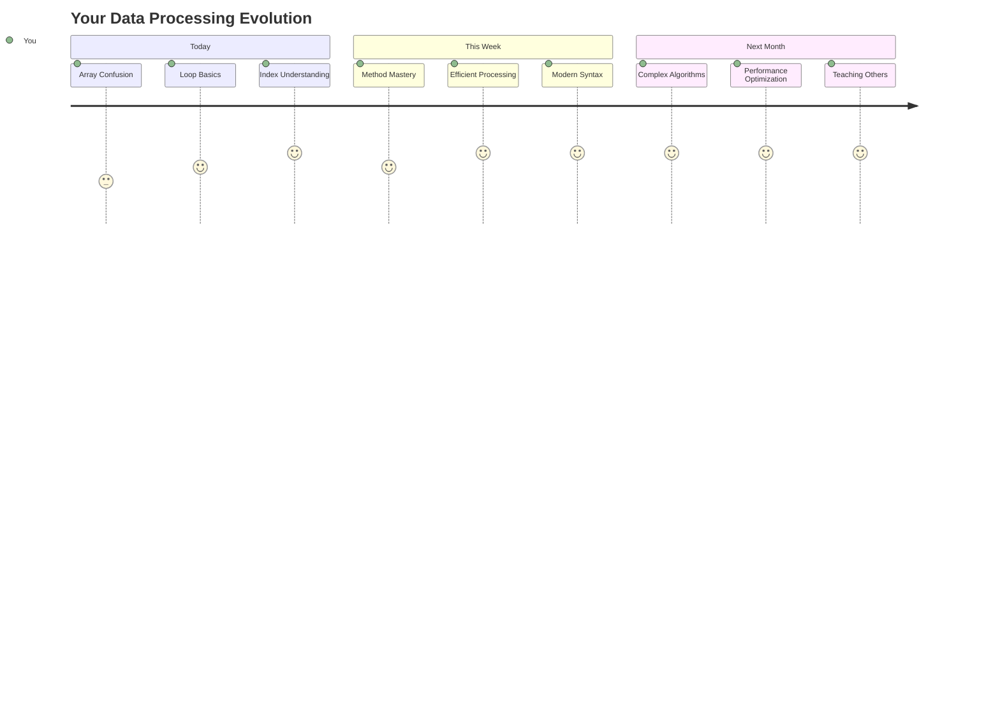

> 📦 **Você desbloqueou o poder da organização e processamento de dados!** Arrays e loops são a base de quase todas as aplicações que você irá construir. De listas simples a análises de dados complexas, agora você tem as ferramentas para lidar com informações de forma eficiente e elegante. Todo site dinâmico, aplicativo móvel e aplicação orientada a dados depende desses conceitos fundamentais. Bem-vindo ao mundo do processamento de dados escalável! 🎉

---

**Aviso Legal**:  
Este documento foi traduzido utilizando o serviço de tradução por IA [Co-op Translator](https://github.com/Azure/co-op-translator). Embora nos esforcemos para garantir a precisão, esteja ciente de que traduções automatizadas podem conter erros ou imprecisões. O documento original em seu idioma nativo deve ser considerado a fonte autoritativa. Para informações críticas, recomenda-se a tradução profissional humana. Não nos responsabilizamos por quaisquer mal-entendidos ou interpretações incorretas decorrentes do uso desta tradução.