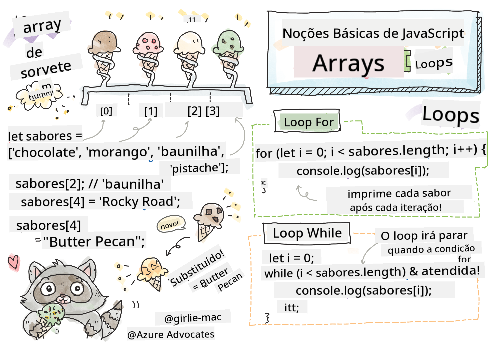

<!--
CO_OP_TRANSLATOR_METADATA:
{
  "original_hash": "3f7f87871312cf6cc12662da7d973182",
  "translation_date": "2025-08-25T21:49:00+00:00",
  "source_file": "2-js-basics/4-arrays-loops/README.md",
  "language_code": "br"
}
-->
# Noções Básicas de JavaScript: Arrays e Loops

  
> Sketchnote por [Tomomi Imura](https://twitter.com/girlie_mac)

## Quiz Pré-Aula  
[Quiz pré-aula](https://ff-quizzes.netlify.app/web/quiz/13)

Esta lição aborda os fundamentos do JavaScript, a linguagem que proporciona interatividade na web. Nesta lição, você aprenderá sobre arrays e loops, que são usados para manipular dados.

[](https://youtube.com/watch?v=1U4qTyq02Xw "Arrays")

[](https://www.youtube.com/watch?v=Eeh7pxtTZ3k "Loops")

> 🎥 Clique nas imagens acima para assistir aos vídeos sobre arrays e loops.

> Você pode acessar esta lição no [Microsoft Learn](https://docs.microsoft.com/learn/modules/web-development-101-arrays/?WT.mc_id=academic-77807-sagibbon)!

## Arrays

Trabalhar com dados é uma tarefa comum em qualquer linguagem, e essa tarefa se torna muito mais fácil quando os dados estão organizados em um formato estrutural, como arrays. Com arrays, os dados são armazenados em uma estrutura semelhante a uma lista. Um grande benefício dos arrays é que você pode armazenar diferentes tipos de dados em um único array.

✅ Arrays estão por toda parte! Consegue pensar em um exemplo da vida real de um array, como um conjunto de painéis solares?

A sintaxe de um array é um par de colchetes.

```javascript
let myArray = [];
```

Este é um array vazio, mas os arrays podem ser declarados já preenchidos com dados. Vários valores em um array são separados por uma vírgula.

```javascript
let iceCreamFlavors = ["Chocolate", "Strawberry", "Vanilla", "Pistachio", "Rocky Road"];
```

Os valores do array recebem um valor único chamado **índice**, um número inteiro atribuído com base na sua posição a partir do início do array. No exemplo acima, o valor de string "Chocolate" tem um índice de 0, e o índice de "Rocky Road" é 4. Use o índice com colchetes para recuperar, alterar ou inserir valores no array.

✅ Você se surpreendeu ao saber que os arrays começam no índice zero? Em algumas linguagens de programação, os índices começam em 1. Há uma história interessante sobre isso, que você pode [ler na Wikipedia](https://en.wikipedia.org/wiki/Zero-based_numbering).

```javascript
let iceCreamFlavors = ["Chocolate", "Strawberry", "Vanilla", "Pistachio", "Rocky Road"];
iceCreamFlavors[2]; //"Vanilla"
```

Você pode usar o índice para alterar um valor, assim:

```javascript
iceCreamFlavors[4] = "Butter Pecan"; //Changed "Rocky Road" to "Butter Pecan"
```

E pode inserir um novo valor em um índice específico assim:

```javascript
iceCreamFlavors[5] = "Cookie Dough"; //Added "Cookie Dough"
```

✅ Uma maneira mais comum de adicionar valores a um array é usando operadores de array, como array.push().

Para descobrir quantos itens há em um array, use a propriedade `length`.

```javascript
let iceCreamFlavors = ["Chocolate", "Strawberry", "Vanilla", "Pistachio", "Rocky Road"];
iceCreamFlavors.length; //5
```

✅ Experimente você mesmo! Use o console do navegador para criar e manipular um array de sua própria criação.

## Loops

Loops nos permitem realizar tarefas repetitivas ou **iterativas**, economizando muito tempo e código. Cada iteração pode variar em suas variáveis, valores e condições. Existem diferentes tipos de loops em JavaScript, e todos têm pequenas diferenças, mas essencialmente fazem a mesma coisa: iterar sobre dados.

### Loop For

O loop `for` requer 3 partes para iterar:  
- `counter` Uma variável que geralmente é inicializada com um número que conta o número de iterações  
- `condition` Expressão que usa operadores de comparação para fazer o loop parar quando for `false`  
- `iteration-expression` Executada no final de cada iteração, geralmente usada para alterar o valor do contador  

```javascript
// Counting up to 10
for (let i = 0; i < 10; i++) {
  console.log(i);
}
```

✅ Execute este código no console do navegador. O que acontece quando você faz pequenas alterações no contador, na condição ou na expressão de iteração? Consegue fazer o loop rodar ao contrário, criando uma contagem regressiva?

### Loop While

Diferente da sintaxe do loop `for`, os loops `while` exigem apenas uma condição que fará o loop parar quando a condição se tornar `false`. As condições nos loops geralmente dependem de outros valores, como contadores, e devem ser gerenciadas durante o loop. Os valores iniciais dos contadores devem ser criados fora do loop, e quaisquer expressões para atender a uma condição, incluindo a alteração do contador, devem ser mantidas dentro do loop.

```javascript
//Counting up to 10
let i = 0;
while (i < 10) {
 console.log(i);
 i++;
}
```

✅ Por que você escolheria um loop for em vez de um loop while? 17 mil pessoas tiveram a mesma dúvida no StackOverflow, e algumas das opiniões [podem ser interessantes para você](https://stackoverflow.com/questions/39969145/while-loops-vs-for-loops-in-javascript).

## Loops e Arrays

Os arrays são frequentemente usados com loops porque a maioria das condições requer o comprimento do array para parar o loop, e o índice também pode ser o valor do contador.

```javascript
let iceCreamFlavors = ["Chocolate", "Strawberry", "Vanilla", "Pistachio", "Rocky Road"];

for (let i = 0; i < iceCreamFlavors.length; i++) {
  console.log(iceCreamFlavors[i]);
} //Ends when all flavors are printed
```

✅ Experimente iterar sobre um array de sua própria criação no console do navegador.

---

## 🚀 Desafio

Existem outras maneiras de iterar sobre arrays além dos loops for e while. Há [forEach](https://developer.mozilla.org/docs/Web/JavaScript/Reference/Global_Objects/Array/forEach), [for-of](https://developer.mozilla.org/docs/Web/JavaScript/Reference/Statements/for...of) e [map](https://developer.mozilla.org/docs/Web/JavaScript/Reference/Global_Objects/Array/map). Reescreva seu loop de array usando uma dessas técnicas.

## Quiz Pós-Aula  
[Quiz pós-aula](https://ff-quizzes.netlify.app/web/quiz/14)

## Revisão e Autoestudo

Os arrays em JavaScript possuem muitos métodos associados a eles, que são extremamente úteis para manipulação de dados. [Leia sobre esses métodos](https://developer.mozilla.org/docs/Web/JavaScript/Reference/Global_Objects/Array) e experimente alguns deles (como push, pop, slice e splice) em um array de sua criação.

## Tarefa

[Iterar um Array](assignment.md)

**Aviso Legal**:  
Este documento foi traduzido utilizando o serviço de tradução por IA [Co-op Translator](https://github.com/Azure/co-op-translator). Embora nos esforcemos para garantir a precisão, esteja ciente de que traduções automatizadas podem conter erros ou imprecisões. O documento original em seu idioma nativo deve ser considerado a fonte autoritativa. Para informações críticas, recomenda-se a tradução profissional realizada por humanos. Não nos responsabilizamos por quaisquer mal-entendidos ou interpretações equivocadas decorrentes do uso desta tradução.