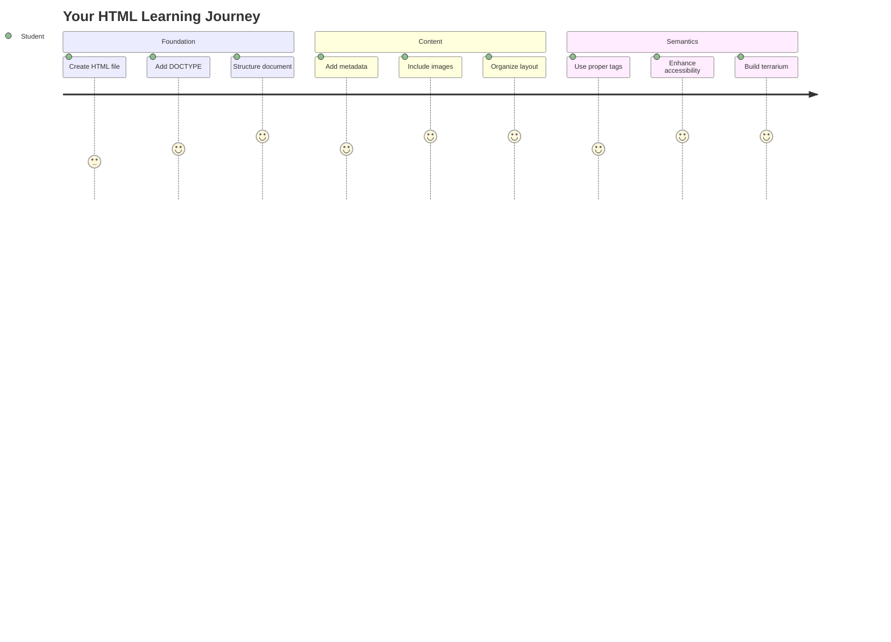
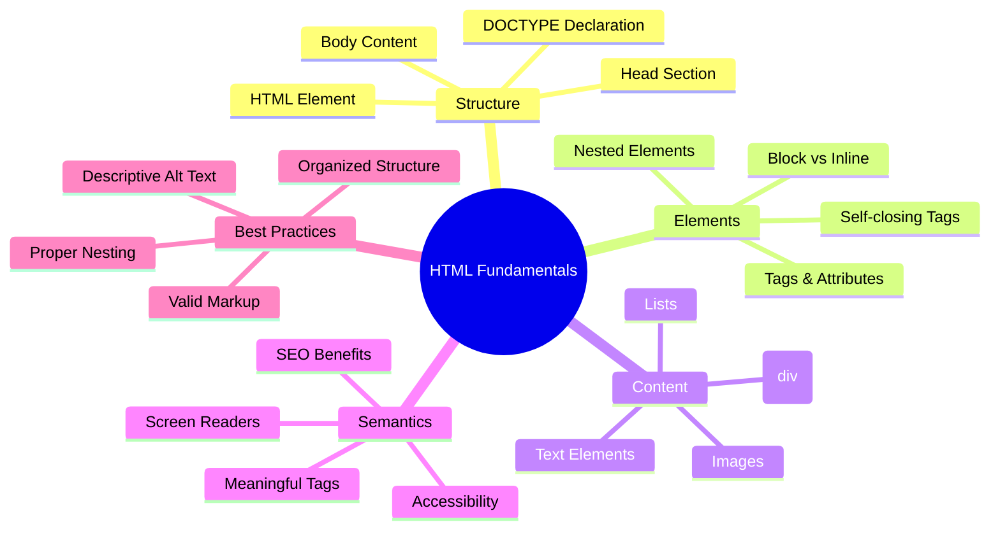
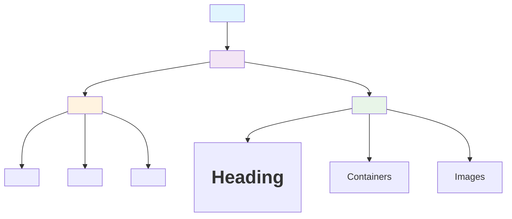
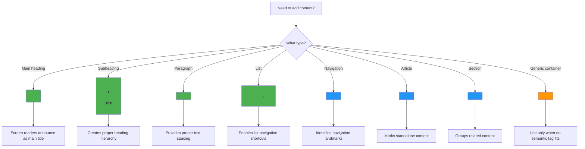
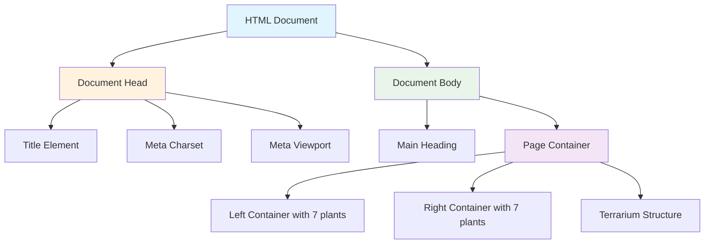
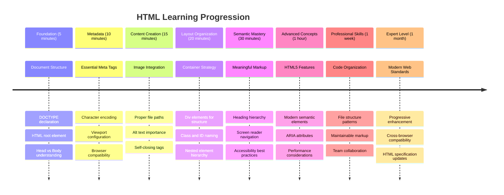

<!--
CO_OP_TRANSLATOR_METADATA:
{
  "original_hash": "3fcfa99c4897e051b558b5eaf1e8cc74",
  "translation_date": "2025-11-04T00:08:08+00:00",
  "source_file": "3-terrarium/1-intro-to-html/README.md",
  "language_code": "br"
}
-->
# Projeto Terrário Parte 1: Introdução ao HTML




> Sketchnote por [Tomomi Imura](https://twitter.com/girlie_mac)

HTML, ou Linguagem de Marcação de Hipertexto, é a base de todos os sites que você já visitou. Pense no HTML como o esqueleto que dá estrutura às páginas da web – ele define onde o conteúdo vai, como está organizado e o que cada parte representa. Enquanto o CSS mais tarde "vestirá" seu HTML com cores e layouts, e o JavaScript dará vida com interatividade, o HTML fornece a estrutura essencial que torna tudo isso possível.

Nesta lição, você criará a estrutura HTML para uma interface de terrário virtual. Este projeto prático ensinará conceitos fundamentais de HTML enquanto você constrói algo visualmente envolvente. Você aprenderá a organizar conteúdo usando elementos semânticos, trabalhar com imagens e criar a base para um aplicativo web interativo.

Ao final desta lição, você terá uma página HTML funcional exibindo imagens de plantas em colunas organizadas, pronta para ser estilizada na próxima lição. Não se preocupe se parecer básico no início – é exatamente assim que o HTML deve ser antes que o CSS adicione o toque visual.



## Quiz Pré-Aula

[Quiz pré-aula](https://ff-quizzes.netlify.app/web/quiz/15)

> 📺 **Assista e Aprenda**: Confira este vídeo explicativo útil
> 
> [](https://www.youtube.com/watch?v=1TvxJKBzhyQ)

## Configurando Seu Projeto

Antes de mergulharmos no código HTML, vamos configurar um espaço de trabalho adequado para seu projeto de terrário. Criar uma estrutura de arquivos organizada desde o início é um hábito crucial que será útil ao longo de sua jornada de desenvolvimento web.

### Tarefa: Crie a Estrutura do Projeto

Você criará uma pasta dedicada para seu projeto de terrário e adicionará seu primeiro arquivo HTML. Aqui estão duas abordagens que você pode usar:

**Opção 1: Usando o Visual Studio Code**
1. Abra o Visual Studio Code
2. Clique em "Arquivo" → "Abrir Pasta" ou use `Ctrl+K, Ctrl+O` (Windows/Linux) ou `Cmd+K, Cmd+O` (Mac)
3. Crie uma nova pasta chamada `terrarium` e selecione-a
4. No painel Explorer, clique no ícone "Novo Arquivo"
5. Nomeie seu arquivo como `index.html`


**Opção 2: Usando Comandos no Terminal**
```bash
mkdir terrarium
cd terrarium
touch index.html
code index.html
```

**O que esses comandos fazem:**
- **Cria** um novo diretório chamado `terrarium` para seu projeto
- **Navega** até o diretório terrarium
- **Cria** um arquivo vazio `index.html`
- **Abre** o arquivo no Visual Studio Code para edição

> 💡 **Dica Pro**: O nome do arquivo `index.html` é especial no desenvolvimento web. Quando alguém visita um site, os navegadores automaticamente procuram por `index.html` como a página padrão para exibir. Isso significa que uma URL como `https://mysite.com/projects/` automaticamente servirá o arquivo `index.html` da pasta `projects` sem precisar especificar o nome do arquivo na URL.

## Entendendo a Estrutura do Documento HTML

Todo documento HTML segue uma estrutura específica que os navegadores precisam entender e exibir corretamente. Pense nessa estrutura como uma carta formal – ela tem elementos obrigatórios em uma ordem específica que ajudam o destinatário (neste caso, o navegador) a processar o conteúdo corretamente.



Vamos começar adicionando a base essencial que todo documento HTML precisa.

### A Declaração DOCTYPE e o Elemento Raiz

As duas primeiras linhas de qualquer arquivo HTML servem como a "introdução" do documento ao navegador:

```html
<!DOCTYPE html>
<html></html>
```

**Entendendo o que esse código faz:**
- **Declara** o tipo de documento como HTML5 usando `<!DOCTYPE html>`
- **Cria** o elemento raiz `<html>` que conterá todo o conteúdo da página
- **Estabelece** padrões modernos da web para renderização adequada no navegador
- **Garante** exibição consistente em diferentes navegadores e dispositivos

> 💡 **Dica do VS Code**: Passe o mouse sobre qualquer tag HTML no VS Code para ver informações úteis dos MDN Web Docs, incluindo exemplos de uso e detalhes de compatibilidade com navegadores.

> 📚 **Saiba Mais**: A declaração DOCTYPE impede que os navegadores entrem no "modo quirks", que era usado para suportar sites muito antigos. O desenvolvimento web moderno usa a simples declaração `<!DOCTYPE html>` para garantir [renderização compatível com padrões](https://developer.mozilla.org/docs/Web/HTML/Quirks_Mode_and_Standards_Mode).

### 🔄 **Checagem Pedagógica**
**Pausa e Reflexão**: Antes de continuar, certifique-se de que você entende:
- ✅ Por que todo documento HTML precisa de uma declaração DOCTYPE
- ✅ O que o elemento raiz `<html>` contém
- ✅ Como essa estrutura ajuda os navegadores a renderizar páginas corretamente

**Teste Rápido**: Você consegue explicar com suas próprias palavras o que significa "renderização compatível com padrões"?

## Adicionando Metadados Essenciais ao Documento

A seção `<head>` de um documento HTML contém informações cruciais que os navegadores e mecanismos de busca precisam, mas que os visitantes não veem diretamente na página. Pense nisso como as informações "nos bastidores" que ajudam sua página a funcionar corretamente e aparecer corretamente em diferentes dispositivos e plataformas.

Esses metadados dizem aos navegadores como exibir sua página, qual codificação de caracteres usar e como lidar com diferentes tamanhos de tela – tudo essencial para criar páginas web profissionais e acessíveis.

### Tarefa: Adicione o Cabeçalho do Documento

Insira esta seção `<head>` entre suas tags de abertura e fechamento `<html>`:

```html
<head>
	<title>Welcome to my Virtual Terrarium</title>
	<meta charset="utf-8" />
	<meta http-equiv="X-UA-Compatible" content="IE=edge" />
	<meta name="viewport" content="width=device-width, initial-scale=1" />
</head>
```

**Desmembrando o que cada elemento faz:**
- **Define** o título da página que aparece nas abas do navegador e nos resultados de busca
- **Especifica** a codificação de caracteres UTF-8 para exibição correta de texto em todo o mundo
- **Garante** compatibilidade com versões modernas do Internet Explorer
- **Configura** design responsivo ajustando o viewport à largura do dispositivo
- **Controla** o nível inicial de zoom para exibir o conteúdo no tamanho natural

> 🤔 **Pense Nisso**: O que aconteceria se você configurasse uma tag meta de viewport assim: `<meta name="viewport" content="width=600">`? Isso forçaria a página a ter sempre 600 pixels de largura, quebrando o design responsivo! Saiba mais sobre [configuração adequada de viewport](https://developer.mozilla.org/docs/Web/HTML/Viewport_meta_tag).

## Construindo o Corpo do Documento

O elemento `<body>` contém todo o conteúdo visível da sua página – tudo o que os usuários verão e com o que interagirão. Enquanto a seção `<head>` forneceu instruções ao navegador, a seção `<body>` contém o conteúdo real: texto, imagens, botões e outros elementos que criam sua interface de usuário.

Vamos adicionar a estrutura do corpo e entender como as tags HTML trabalham juntas para criar conteúdo significativo.

### Entendendo a Estrutura das Tags HTML

O HTML usa tags emparelhadas para definir elementos. A maioria das tags tem uma tag de abertura como `<p>` e uma tag de fechamento como `</p>`, com conteúdo entre elas: `<p>Olá, mundo!</p>`. Isso cria um elemento de parágrafo contendo o texto "Olá, mundo!".

### Tarefa: Adicione o Elemento Body

Atualize seu arquivo HTML para incluir o elemento `<body>`:

```html
<!DOCTYPE html>
<html>
	<head>
		<title>Welcome to my Virtual Terrarium</title>
		<meta charset="utf-8" />
		<meta http-equiv="X-UA-Compatible" content="IE=edge" />
		<meta name="viewport" content="width=device-width, initial-scale=1" />
	</head>
	<body></body>
</html>
```

**Aqui está o que essa estrutura completa fornece:**
- **Estabelece** a estrutura básica do documento HTML5
- **Inclui** metadados essenciais para renderização adequada no navegador
- **Cria** um corpo vazio pronto para seu conteúdo visível
- **Segue** as melhores práticas modernas de desenvolvimento web

Agora você está pronto para adicionar os elementos visíveis do seu terrário. Usaremos elementos `<div>` como contêineres para organizar diferentes seções de conteúdo e elementos `` para exibir as imagens das plantas.

### Trabalhando com Imagens e Contêineres de Layout

Imagens são especiais no HTML porque usam tags "auto-fechadas". Diferente de elementos como `<p></p>` que envolvem conteúdo, a tag `` contém todas as informações necessárias dentro da própria tag usando atributos como `src` para o caminho do arquivo de imagem e `alt` para acessibilidade.

Antes de adicionar imagens ao seu HTML, você precisará organizar seus arquivos de projeto corretamente criando uma pasta de imagens e adicionando os gráficos das plantas.

**Primeiro, configure suas imagens:**
1. Crie uma pasta chamada `images` dentro da pasta do projeto terrarium
2. Baixe as imagens das plantas da [pasta de solução](../../../../3-terrarium/solution/images) (14 imagens de plantas no total)
3. Copie todas as imagens das plantas para sua nova pasta `images`

### Tarefa: Crie o Layout de Exibição das Plantas

Agora adicione as imagens das plantas organizadas em duas colunas entre suas tags `<body></body>`:

```html
<div id="page">
	<div id="left-container" class="container">
		<div class="plant-holder">
			
		</div>
		<div class="plant-holder">
			
		</div>
		<div class="plant-holder">
			
		</div>
		<div class="plant-holder">
			
		</div>
		<div class="plant-holder">
			
		</div>
		<div class="plant-holder">
			
		</div>
		<div class="plant-holder">
			
		</div>
	</div>
	<div id="right-container" class="container">
		<div class="plant-holder">
			
		</div>
		<div class="plant-holder">
			
		</div>
		<div class="plant-holder">
			
		</div>
		<div class="plant-holder">
			
		</div>
		<div class="plant-holder">
			
		</div>
		<div class="plant-holder">
			
		</div>
		<div class="plant-holder">
			
		</div>
	</div>
</div>
```

**Passo a passo, aqui está o que está acontecendo nesse código:**
- **Cria** um contêiner principal da página com `id="page"` para conter todo o conteúdo
- **Estabelece** dois contêineres de coluna: `left-container` e `right-container`
- **Organiza** 7 plantas na coluna esquerda e 7 plantas na coluna direita
- **Envolve** cada imagem de planta em um div `plant-holder` para posicionamento individual
- **Aplica** nomes de classe consistentes para estilização com CSS na próxima lição
- **Atribui** IDs únicos a cada imagem de planta para interação com JavaScript posteriormente
- **Inclui** caminhos de arquivo corretos apontando para a pasta de imagens

> 🤔 **Considere Isso**: Note que todas as imagens atualmente têm o mesmo texto alternativo "plant". Isso não é ideal para acessibilidade. Usuários de leitores de tela ouviriam "plant" repetidamente 14 vezes sem saber qual planta cada imagem mostra. Você consegue pensar em textos alternativos melhores e mais descritivos para cada imagem?

> 📝 **Tipos de Elementos HTML**: Elementos `<div>` são "em nível de bloco" e ocupam toda a largura, enquanto elementos `<span>` são "em linha" e ocupam apenas a largura necessária. O que você acha que aconteceria se você mudasse todas essas tags `<div>` para tags `<span>`?

### 🔄 **Checagem Pedagógica**
**Entendimento da Estrutura**: Reserve um momento para revisar sua estrutura HTML:
- ✅ Você consegue identificar os contêineres principais no seu layout?
- ✅ Você entende por que cada imagem tem um ID único?
- ✅ Como você descreveria o propósito dos divs `plant-holder`?

**Inspeção Visual**: Abra seu arquivo HTML em um navegador. Você deve ver:
- Uma lista básica de imagens de plantas
- Imagens organizadas em duas colunas
- Layout simples e sem estilo

**Lembre-se**: Essa aparência simples é exatamente como o HTML deve ser antes da estilização com CSS!

Com essa marcação adicionada, as plantas aparecerão na tela, embora ainda não pareçam polidas – isso é o que o CSS fará na próxima lição! Por enquanto, você tem uma base sólida de HTML que organiza seu conteúdo corretamente e segue as melhores práticas de acessibilidade.

## Usando HTML Semântico para Acessibilidade

HTML semântico significa escolher elementos HTML com base em seu significado e propósito, não apenas em sua aparência. Quando você usa marcação semântica, está comunicando a estrutura e o significado do seu conteúdo para navegadores, mecanismos de busca e tecnologias assistivas como leitores de tela.



Essa abordagem torna seus sites mais acessíveis para usuários com deficiências e ajuda os mecanismos de busca a entender melhor seu conteúdo. É um princípio fundamental do desenvolvimento web moderno que cria experiências melhores para todos.

### Adicionando um Título Semântico à Página

Vamos adicionar um título adequado à sua página de terrário. Insira esta linha logo após sua tag de abertura `<body>`:

```html
<h1>My Terrarium</h1>
```

**Por que a marcação semântica é importante:**
- **Ajuda** leitores de tela a navegar e entender a estrutura da página
- **Melhora** a otimização para mecanismos de busca (SEO) ao esclarecer a hierarquia do conteúdo
- **Aumenta** a acessibilidade para usuários com deficiências visuais ou diferenças cognitivas
- **Cria** melhores experiências de usuário em todos os dispositivos e plataformas
- **Segue** padrões da web e melhores práticas para desenvolvimento profissional

**Exemplos de escolhas semânticas vs. não semânticas:**

| Propósito | ✅ Escolha Semântica | ❌ Escolha Não Semântica |
|-----------|----------------------|--------------------------|
| Título principal | `<h1>Título</h1>` | `<div class="big-text">Título</div>` |
| Navegação | `<nav><ul><li></li></ul></nav>` | `<div class="menu"><div></div></div>` |
| Botão | `<button>Clique aqui</button>` | `<span onclick="...">Clique aqui</span>` |
| Conteúdo do artigo | `<article><p></p></article>` | `<div class="content"><div></div></div>` |

> 🎥 **Veja em Ação**: Assista [como leitores de tela interagem com páginas web](https://www.youtube.com/watch?v=OUDV1gqs9GA) para entender por que a marcação semântica é crucial para acessibilidade. Note como a estrutura adequada do HTML ajuda os usuários a navegar eficientemente.

## Criando o Contêiner do Terrário

Agora vamos adicionar a estrutura HTML para o próprio terrário – o recipiente de vidro onde as plantas serão colocadas eventualmente. Esta seção demonstra um conceito importante: o HTML fornece estrutura, mas sem estilização CSS, esses elementos ainda não serão visíveis.

A marcação do terrário usa nomes de classe descritivos que tornarão a estilização com CSS intuitiva e fácil de manter na próxima lição.

### Tarefa: Adicione a Estrutura do Terrário

Insira esta marcação acima da última tag `</div>` (antes da tag de fechamento do contêiner da página):

```html
<div id="terrarium">
	<div class="jar-top"></div>
	<div class="jar-walls">
		<div class="jar-glossy-long"></div>
		<div class="jar-glossy-short"></div>
	</div>
	<div class="dirt"></div>
	<div class="jar-bottom"></div>
</div>
```

**Entendendo essa estrutura do terrário:**
- **Cria** um contêiner principal do terrário com um ID único para estilização
- **Define** elementos separados para cada componente visual (topo, paredes, terra, fundo)
- **Inclui** elementos aninhados para efeitos de reflexão em vidro (elementos brilhantes)
- **Utiliza** nomes de classes descritivos que indicam claramente o propósito de cada elemento
- **Prepara** a estrutura para estilização em CSS que criará a aparência de um terrário de vidro

> 🤔 **Percebeu Algo?**: Mesmo que você tenha adicionado essa marcação, nada novo aparece na página! Isso ilustra perfeitamente como o HTML fornece estrutura enquanto o CSS fornece aparência. Esses elementos `<div>` existem, mas ainda não têm estilo visual – isso será abordado na próxima lição!



### 🔄 **Verificação Pedagógica**
**Domínio da Estrutura HTML**: Antes de avançar, certifique-se de que você consegue:
- ✅ Explicar a diferença entre estrutura HTML e aparência visual
- ✅ Identificar elementos HTML semânticos e não semânticos
- ✅ Descrever como uma marcação adequada beneficia a acessibilidade
- ✅ Reconhecer a estrutura completa da árvore do documento

**Testando Sua Compreensão**: Tente abrir seu arquivo HTML em um navegador com o JavaScript desativado e o CSS removido. Isso mostrará a estrutura semântica pura que você criou!

---

## Desafio do Agente GitHub Copilot

Use o modo Agente para completar o seguinte desafio:

**Descrição:** Crie uma estrutura HTML semântica para uma seção de guia de cuidados com plantas que pode ser adicionada ao projeto de terrário.

**Prompt:** Crie uma seção HTML semântica que inclua um título principal "Guia de Cuidados com Plantas", três subseções com os títulos "Rega", "Requisitos de Luz" e "Cuidados com o Solo", cada uma contendo um parágrafo com informações sobre cuidados com plantas. Use tags HTML semânticas apropriadas como `<section>`, `<h2>`, `<h3>` e `<p>` para estruturar o conteúdo corretamente.

Saiba mais sobre o [modo agente](https://code.visualstudio.com/blogs/2025/02/24/introducing-copilot-agent-mode) aqui.

## Desafio de Exploração da História do HTML

**Aprendendo Sobre a Evolução da Web**

O HTML evoluiu significativamente desde que Tim Berners-Lee criou o primeiro navegador web no CERN em 1990. Algumas tags mais antigas, como `<marquee>`, agora estão obsoletas porque não funcionam bem com os padrões modernos de acessibilidade e design responsivo.

**Experimente Isso:**
1. Envolva temporariamente seu título `<h1>` em uma tag `<marquee>`: `<marquee><h1>Meu Terrário</h1></marquee>`
2. Abra sua página em um navegador e observe o efeito de rolagem
3. Considere por que essa tag foi descontinuada (dica: pense na experiência do usuário e na acessibilidade)
4. Remova a tag `<marquee>` e retorne à marcação semântica

**Perguntas para Reflexão:**
- Como um título rolando pode afetar usuários com deficiências visuais ou sensibilidade ao movimento?
- Quais técnicas modernas de CSS poderiam alcançar efeitos visuais semelhantes de forma mais acessível?
- Por que é importante usar padrões web atuais em vez de elementos obsoletos?

Explore mais sobre [elementos HTML obsoletos e descontinuados](https://developer.mozilla.org/docs/Web/HTML/Element#Obsolete_and_deprecated_elements) para entender como os padrões da web evoluem para melhorar a experiência do usuário.

## Quiz Pós-Aula

[Quiz pós-aula](https://ff-quizzes.netlify.app/web/quiz/16)

## Revisão e Autoestudo

**Aprofunde Seu Conhecimento em HTML**

O HTML tem sido a base da web por mais de 30 anos, evoluindo de uma linguagem simples de marcação de documentos para uma plataforma sofisticada para construir aplicações interativas. Compreender essa evolução ajuda você a valorizar os padrões modernos da web e tomar melhores decisões de desenvolvimento.

**Caminhos de Aprendizado Recomendados:**

1. **História e Evolução do HTML**
   - Pesquise a linha do tempo do HTML 1.0 ao HTML5
   - Explore por que certas tags foram descontinuadas (acessibilidade, compatibilidade com dispositivos móveis, manutenção)
   - Investigue recursos emergentes do HTML e propostas futuras

2. **Imersão em HTML Semântico**
   - Estude a lista completa de [elementos semânticos do HTML5](https://developer.mozilla.org/docs/Web/HTML/Element)
   - Pratique identificar quando usar `<article>`, `<section>`, `<aside>` e `<main>`
   - Aprenda sobre atributos ARIA para melhorar a acessibilidade

3. **Desenvolvimento Web Moderno**
   - Explore [como criar sites responsivos](https://docs.microsoft.com/learn/modules/build-simple-website/?WT.mc_id=academic-77807-sagibbon) no Microsoft Learn
   - Entenda como o HTML se integra com CSS e JavaScript
   - Aprenda sobre desempenho web e melhores práticas de SEO

**Perguntas para Reflexão:**
- Quais tags HTML obsoletas você descobriu e por que foram removidas?
- Quais novos recursos HTML estão sendo propostos para versões futuras?
- Como o HTML semântico contribui para acessibilidade e SEO?

### ⚡ **O Que Você Pode Fazer nos Próximos 5 Minutos**
- [ ] Abra o DevTools (F12) e inspecione a estrutura HTML do seu site favorito
- [ ] Crie um arquivo HTML simples com tags básicas: `<h1>`, `<p>` e ``
- [ ] Valide seu HTML usando o Validador HTML do W3C online
- [ ] Tente adicionar um comentário ao seu HTML usando `<!-- comentário -->`

### 🎯 **O Que Você Pode Realizar Nesta Hora**
- [ ] Complete o quiz pós-aula e revise os conceitos de HTML semântico
- [ ] Construa uma página simples sobre você usando uma estrutura HTML adequada
- [ ] Experimente diferentes níveis de cabeçalhos e tags de formatação de texto
- [ ] Adicione imagens e links para praticar integração multimídia
- [ ] Pesquise recursos do HTML5 que você ainda não experimentou

### 📅 **Sua Jornada de HTML Durante a Semana**
- [ ] Complete a tarefa do projeto de terrário com marcação semântica
- [ ] Crie uma página acessível usando rótulos e funções ARIA
- [ ] Pratique a criação de formulários com vários tipos de entrada
- [ ] Explore APIs do HTML5 como localStorage ou geolocalização
- [ ] Estude padrões HTML responsivos e design mobile-first
- [ ] Revise o código HTML de outros desenvolvedores para melhores práticas

### 🌟 **Seu Mês de Fundamentos da Web**
- [ ] Construa um site de portfólio mostrando sua maestria em HTML
- [ ] Aprenda modelagem HTML com um framework como Handlebars
- [ ] Contribua para projetos de código aberto melhorando a documentação HTML
- [ ] Domine conceitos avançados de HTML como elementos personalizados
- [ ] Integre HTML com frameworks CSS e bibliotecas JavaScript
- [ ] Oriente outros que estão aprendendo os fundamentos do HTML

## 🎯 Sua Linha do Tempo de Maestria em HTML



### 🛠️ Resumo do Seu Kit de Ferramentas HTML

Após concluir esta lição, você agora tem:
- **Estrutura do Documento**: Fundamento completo do HTML5 com DOCTYPE adequado
- **Marcação Semântica**: Tags significativas que melhoram acessibilidade e SEO
- **Integração de Imagens**: Organização de arquivos e práticas de texto alternativo
- **Contêineres de Layout**: Uso estratégico de divs com nomes de classes descritivos
- **Consciência de Acessibilidade**: Compreensão da navegação por leitores de tela
- **Padrões Modernos**: Práticas atuais do HTML5 e conhecimento de tags obsoletas
- **Base para Projetos**: Base sólida para estilização em CSS e interatividade com JavaScript

**Próximos Passos**: Sua estrutura HTML está pronta para estilização em CSS! A base semântica que você construiu tornará a próxima lição muito mais fácil de entender.

## Tarefa

[Pratique seu HTML: Construa um mockup de blog](assignment.md)

---

**Aviso Legal**:  
Este documento foi traduzido usando o serviço de tradução por IA [Co-op Translator](https://github.com/Azure/co-op-translator). Embora nos esforcemos para garantir a precisão, esteja ciente de que traduções automatizadas podem conter erros ou imprecisões. O documento original em seu idioma nativo deve ser considerado a fonte autoritativa. Para informações críticas, recomenda-se a tradução profissional feita por humanos. Não nos responsabilizamos por quaisquer mal-entendidos ou interpretações incorretas decorrentes do uso desta tradução.