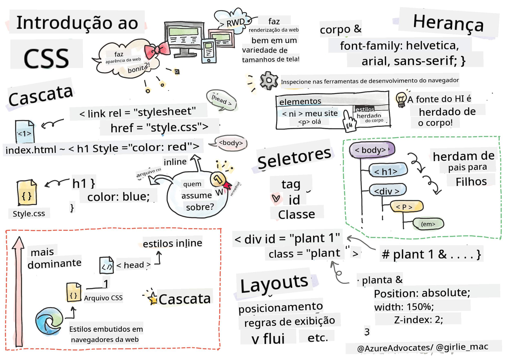
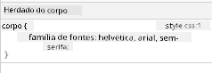

<!--
CO_OP_TRANSLATOR_METADATA:
{
  "original_hash": "acb5ae00cde004304296bb97da8ff4c3",
  "translation_date": "2025-08-28T23:56:00+00:00",
  "source_file": "3-terrarium/2-intro-to-css/README.md",
  "language_code": "br"
}
-->
# Projeto Terrário Parte 2: Introdução ao CSS


> Sketchnote por [Tomomi Imura](https://twitter.com/girlie_mac)

## Quiz Pré-Aula

[Quiz pré-aula](https://ff-quizzes.netlify.app/web/quiz/17)

### Introdução

CSS, ou Cascading Style Sheets, resolve um problema importante no desenvolvimento web: como fazer seu site ter uma aparência agradável. Estilizar seus aplicativos os torna mais utilizáveis e visualmente atraentes; você também pode usar CSS para criar um Design Responsivo (RWD) - permitindo que seus aplicativos fiquem bem em qualquer tamanho de tela. CSS não é apenas sobre aparência; sua especificação inclui animações e transformações que podem habilitar interações sofisticadas para seus aplicativos. O Grupo de Trabalho de CSS ajuda a manter as especificações atuais do CSS; você pode acompanhar o trabalho deles no [site do World Wide Web Consortium](https://www.w3.org/Style/CSS/members).

> Nota: CSS é uma linguagem que evolui, como tudo na web, e nem todos os navegadores suportam as partes mais recentes da especificação. Sempre verifique suas implementações consultando [CanIUse.com](https://caniuse.com).

Nesta lição, vamos adicionar estilos ao nosso terrário online e aprender mais sobre vários conceitos de CSS: a cascata, herança, uso de seletores, posicionamento e como usar CSS para construir layouts. Durante o processo, vamos organizar o layout do terrário e criar o próprio terrário.

### Pré-requisito

Você deve ter o HTML do seu terrário construído e pronto para ser estilizado.

> Confira o vídeo

> 
> [](https://www.youtube.com/watch?v=6yIdOIV9p1I)

### Tarefa

Na pasta do seu terrário, crie um novo arquivo chamado `style.css`. Importe esse arquivo na seção `<head>`:

```html
<link rel="stylesheet" href="./style.css" />
```

---

## A Cascata

Cascading Style Sheets incorporam a ideia de que os estilos 'cascateiam', de forma que a aplicação de um estilo é guiada por sua prioridade. Estilos definidos pelo autor de um site têm prioridade sobre aqueles definidos por um navegador. Estilos definidos 'inline' têm prioridade sobre aqueles definidos em uma folha de estilo externa.

### Tarefa

Adicione o estilo inline "color: red" à sua tag `<h1>`:

```HTML
<h1 style="color: red">My Terrarium</h1>
```

Em seguida, adicione o seguinte código ao seu arquivo `style.css`:

```CSS
h1 {
 color: blue;
}
```

✅ Qual cor aparece no seu aplicativo web? Por quê? Você consegue encontrar uma maneira de sobrescrever estilos? Quando você gostaria de fazer isso, ou por que não?

---

## Herança

Estilos são herdados de um estilo ancestral para um descendente, de forma que elementos aninhados herdam os estilos de seus pais.

### Tarefa

Defina a fonte do corpo para uma fonte específica e verifique a fonte de um elemento aninhado:

```CSS
body {
	font-family: helvetica, arial, sans-serif;
}
```

Abra o console do seu navegador na aba 'Elements' e observe a fonte do H1. Ele herda sua fonte do corpo, conforme indicado pelo navegador:



✅ Você consegue fazer um estilo aninhado herdar uma propriedade diferente?

---

## Seletores CSS

### Tags

Até agora, seu arquivo `style.css` tem apenas algumas tags estilizadas, e o aplicativo parece bem estranho:

```CSS
body {
	font-family: helvetica, arial, sans-serif;
}

h1 {
	color: #3a241d;
	text-align: center;
}
```

Esse método de estilizar uma tag dá controle sobre elementos únicos, mas você precisa controlar os estilos de muitas plantas no seu terrário. Para isso, você precisa aproveitar os seletores CSS.

### Ids

Adicione algum estilo para organizar os contêineres esquerdo e direito. Como há apenas um contêiner esquerdo e um contêiner direito, eles recebem ids no markup. Para estilizá-los, use `#`:

```CSS
#left-container {
	background-color: #eee;
	width: 15%;
	left: 0px;
	top: 0px;
	position: absolute;
	height: 100%;
	padding: 10px;
}

#right-container {
	background-color: #eee;
	width: 15%;
	right: 0px;
	top: 0px;
	position: absolute;
	height: 100%;
	padding: 10px;
}
```

Aqui, você posicionou esses contêineres com posicionamento absoluto nas extremidades esquerda e direita da tela e usou porcentagens para sua largura, permitindo que eles se ajustem a telas pequenas de dispositivos móveis.

✅ Este código está bastante repetitivo, portanto não segue o princípio "DRY" (Don't Repeat Yourself); você consegue encontrar uma maneira melhor de estilizar esses ids, talvez usando um id e uma classe? Você precisaria alterar o markup e refatorar o CSS:

```html
<div id="left-container" class="container"></div>
```

### Classes

No exemplo acima, você estilizou dois elementos únicos na tela. Se quiser que os estilos se apliquem a muitos elementos na tela, você pode usar classes CSS. Faça isso para organizar as plantas nos contêineres esquerdo e direito.

Observe que cada planta no markup HTML tem uma combinação de ids e classes. Os ids aqui são usados pelo JavaScript que você adicionará mais tarde para manipular o posicionamento das plantas no terrário. As classes, no entanto, dão a todas as plantas um estilo específico.

```html
<div class="plant-holder">
	
</div>
```

Adicione o seguinte ao seu arquivo `style.css`:

```CSS
.plant-holder {
	position: relative;
	height: 13%;
	left: -10px;
}

.plant {
	position: absolute;
	max-width: 150%;
	max-height: 150%;
	z-index: 2;
}
```

Notável neste trecho é a mistura de posicionamento relativo e absoluto, que abordaremos na próxima seção. Observe como as alturas são tratadas por porcentagens:

Você definiu a altura do suporte da planta como 13%, um bom número para garantir que todas as plantas sejam exibidas em cada contêiner vertical sem necessidade de rolagem.

Você ajustou o suporte da planta para mover-se para a esquerda, permitindo que as plantas fiquem mais centralizadas dentro de seu contêiner. As imagens têm uma grande quantidade de fundo transparente para torná-las mais arrastáveis, então precisam ser empurradas para a esquerda para se encaixar melhor na tela.

Depois, a própria planta recebeu um max-width de 150%. Isso permite que ela seja redimensionada conforme o navegador é redimensionado. Experimente ajustar o tamanho do seu navegador; as plantas permanecem em seus contêineres, mas se ajustam para caber.

Também é notável o uso de z-index, que controla a altitude relativa de um elemento (para que as plantas fiquem acima do contêiner e pareçam estar dentro do terrário).

✅ Por que você precisa de um seletor CSS para o suporte da planta e outro para a planta?

## Posicionamento CSS

Misturar propriedades de posicionamento (existem posições estática, relativa, fixa, absoluta e sticky) pode ser um pouco complicado, mas quando feito corretamente, oferece bom controle sobre os elementos nas suas páginas.

Elementos posicionados de forma absoluta são posicionados em relação aos seus ancestrais mais próximos que possuem posicionamento, e se não houver nenhum, são posicionados em relação ao corpo do documento.

Elementos posicionados de forma relativa são posicionados com base nas direções do CSS para ajustar seu posicionamento em relação à sua posição inicial.

No nosso exemplo, o `plant-holder` é um elemento posicionado de forma relativa dentro de um contêiner posicionado de forma absoluta. O comportamento resultante é que os contêineres laterais são fixados à esquerda e à direita, e o `plant-holder` é aninhado, ajustando-se dentro dos contêineres laterais, dando espaço para as plantas serem colocadas em uma fileira vertical.

> A própria `plant` também tem posicionamento absoluto, necessário para torná-la arrastável, como você descobrirá na próxima lição.

✅ Experimente alternar os tipos de posicionamento dos contêineres laterais e do `plant-holder`. O que acontece?

## Layouts CSS

Agora você usará o que aprendeu para construir o próprio terrário, tudo usando CSS!

Primeiro, estilize os filhos da div `.terrarium` como um retângulo arredondado usando CSS:

```CSS
.jar-walls {
	height: 80%;
	width: 60%;
	background: #d1e1df;
	border-radius: 1rem;
	position: absolute;
	bottom: 0.5%;
	left: 20%;
	opacity: 0.5;
	z-index: 1;
}

.jar-top {
	width: 50%;
	height: 5%;
	background: #d1e1df;
	position: absolute;
	bottom: 80.5%;
	left: 25%;
	opacity: 0.7;
	z-index: 1;
}

.jar-bottom {
	width: 50%;
	height: 1%;
	background: #d1e1df;
	position: absolute;
	bottom: 0%;
	left: 25%;
	opacity: 0.7;
}

.dirt {
	width: 60%;
	height: 5%;
	background: #3a241d;
	position: absolute;
	border-radius: 0 0 1rem 1rem;
	bottom: 1%;
	left: 20%;
	opacity: 0.7;
	z-index: -1;
}
```

Observe o uso de porcentagens aqui. Se você reduzir o tamanho do navegador, verá como o jarro também se ajusta. Também observe as porcentagens de largura e altura dos elementos do jarro e como cada elemento é posicionado absolutamente no centro, fixado na parte inferior da janela de visualização.

Também estamos usando `rem` para o border-radius, uma medida relativa à fonte. Leia mais sobre esse tipo de medida relativa na [especificação CSS](https://www.w3.org/TR/css-values-3/#font-relative-lengths).

✅ Experimente alterar as cores e a opacidade do jarro em comparação com as da terra. O que acontece? Por quê?

---

## 🚀Desafio

Adicione um brilho de 'bolha' na área inferior esquerda do jarro para fazê-lo parecer mais vítreo. Você estará estilizando `.jar-glossy-long` e `.jar-glossy-short` para parecerem um brilho refletido. Veja como ficaria:


Para completar o quiz pós-aula, passe por este módulo do Learn: [Estilize seu aplicativo HTML com CSS](https://docs.microsoft.com/learn/modules/build-simple-website/4-css-basics/?WT.mc_id=academic-77807-sagibbon)

## Quiz Pós-Aula

[Quiz pós-aula](https://ff-quizzes.netlify.app/web/quiz/18)

## Revisão e Autoestudo

CSS parece enganosamente simples, mas há muitos desafios ao tentar estilizar um aplicativo perfeitamente para todos os navegadores e tamanhos de tela. CSS-Grid e Flexbox são ferramentas desenvolvidas para tornar o trabalho um pouco mais estruturado e confiável. Aprenda sobre essas ferramentas jogando [Flexbox Froggy](https://flexboxfroggy.com/) e [Grid Garden](https://codepip.com/games/grid-garden/).

## Tarefa

[Refatoração de CSS](assignment.md)

---

**Aviso Legal**:  
Este documento foi traduzido utilizando o serviço de tradução por IA [Co-op Translator](https://github.com/Azure/co-op-translator). Embora nos esforcemos para garantir a precisão, esteja ciente de que traduções automatizadas podem conter erros ou imprecisões. O documento original em seu idioma nativo deve ser considerado a fonte autoritativa. Para informações críticas, recomenda-se a tradução profissional realizada por humanos. Não nos responsabilizamos por quaisquer mal-entendidos ou interpretações equivocadas decorrentes do uso desta tradução.