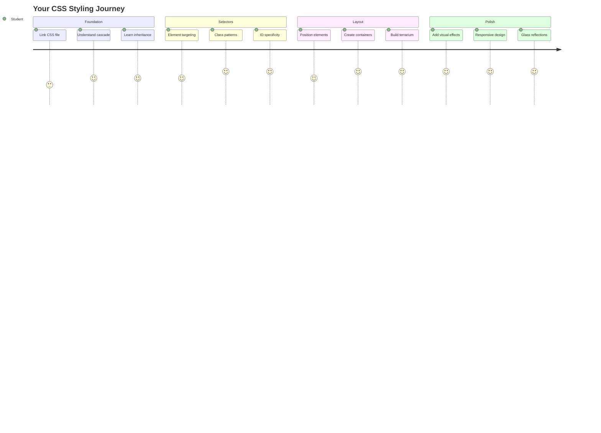
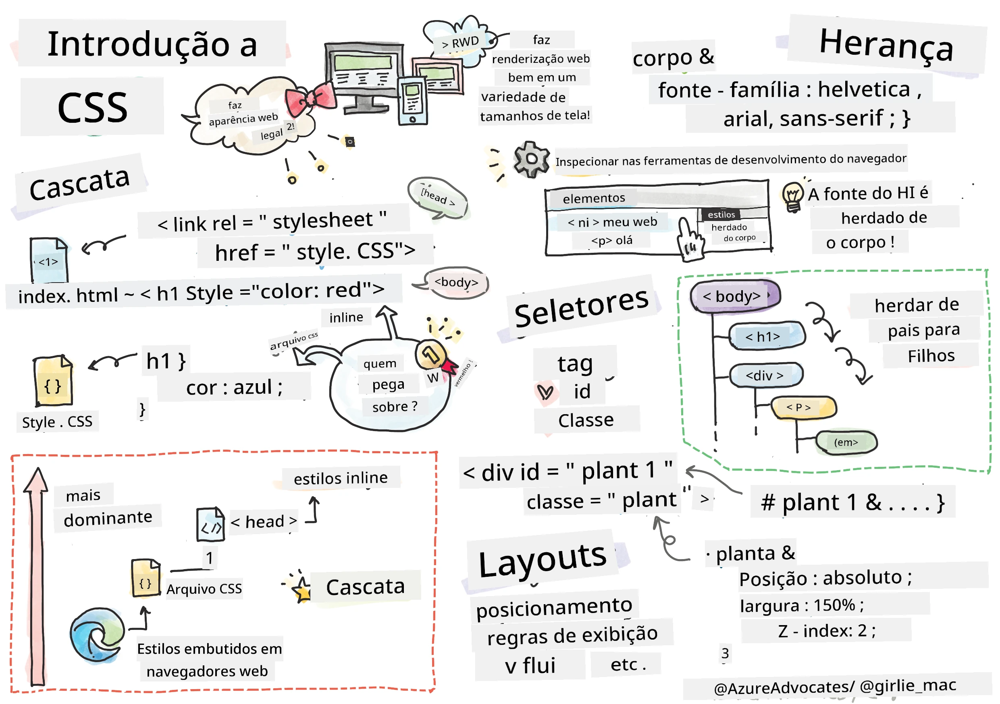
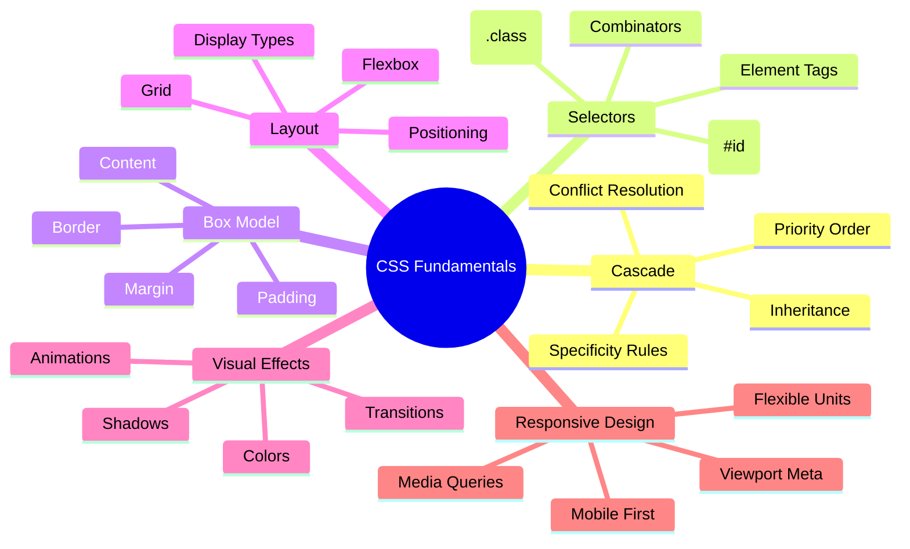
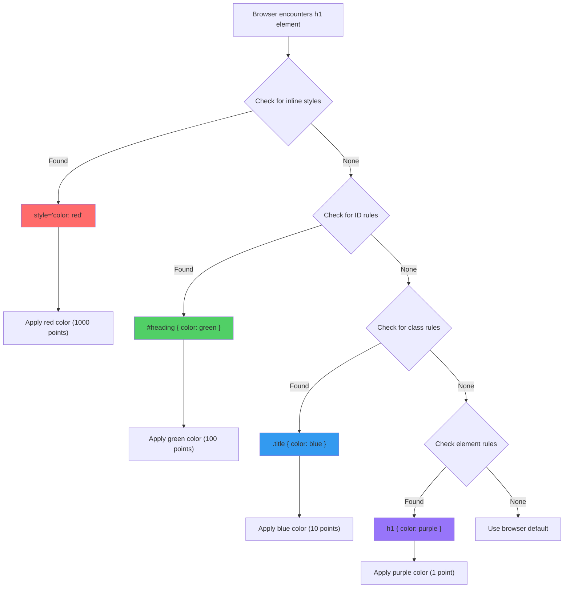
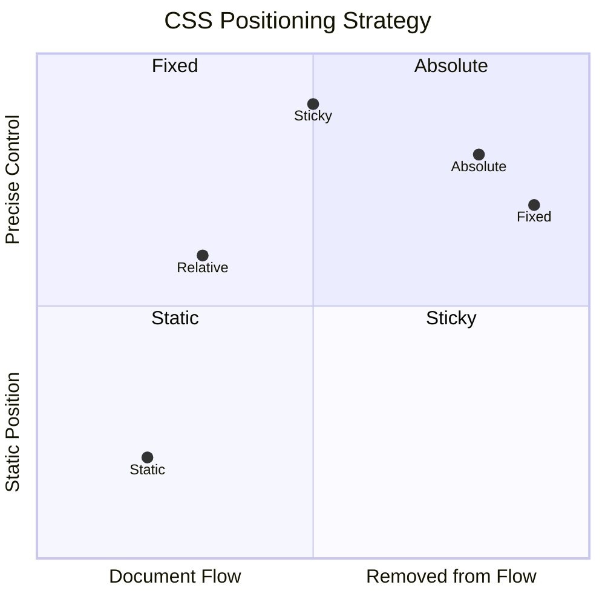
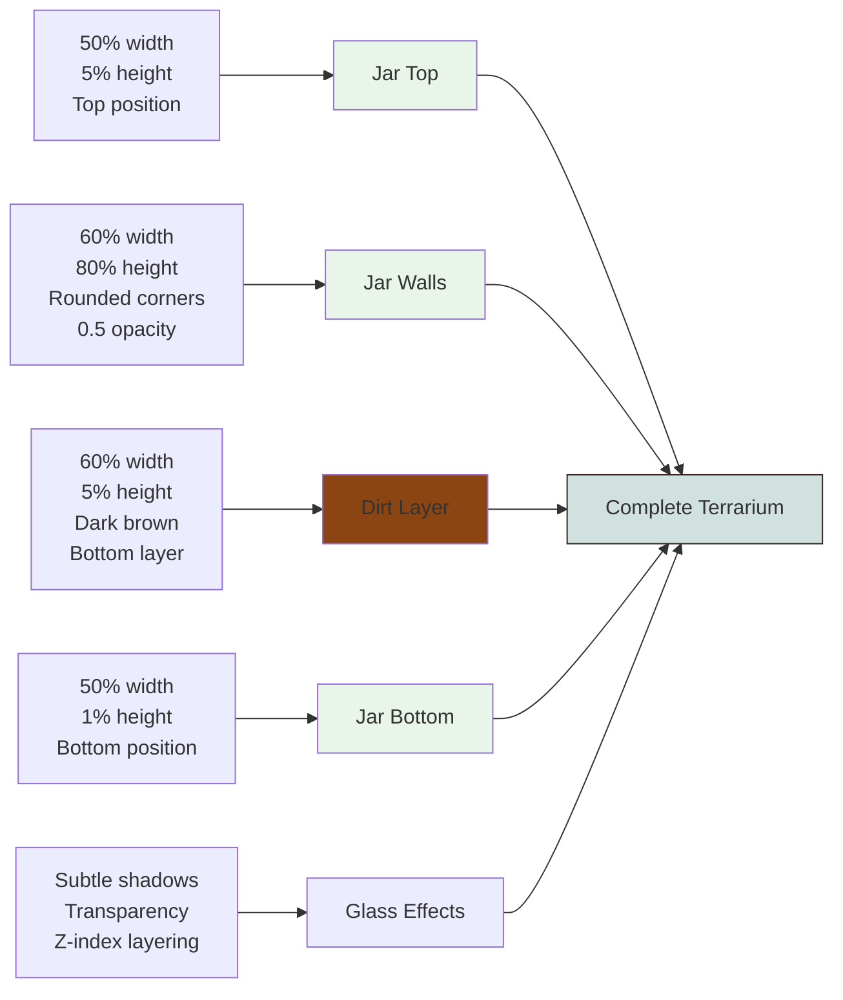
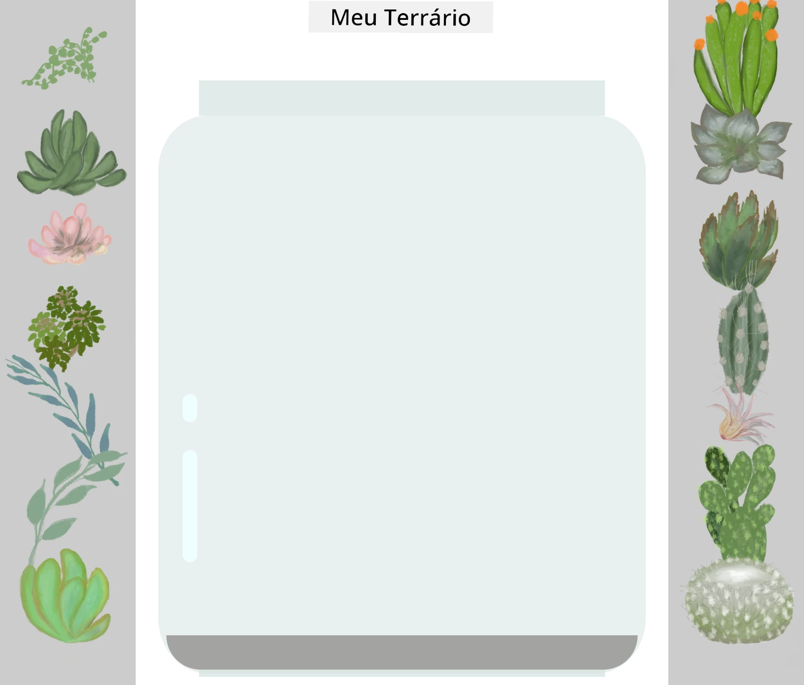
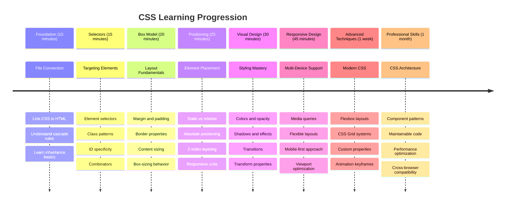

<!--
CO_OP_TRANSLATOR_METADATA:
{
  "original_hash": "e39f3a4e3bcccf94639e3af1248f8a4d",
  "translation_date": "2025-11-04T00:07:33+00:00",
  "source_file": "3-terrarium/2-intro-to-css/README.md",
  "language_code": "br"
}
-->
# Projeto Terrário Parte 2: Introdução ao CSS




> Sketchnote por [Tomomi Imura](https://twitter.com/girlie_mac)

Lembra como seu terrário em HTML parecia bem básico? Com o CSS, transformamos essa estrutura simples em algo visualmente atraente.

Se o HTML é como construir a estrutura de uma casa, o CSS é tudo que a faz parecer um lar - as cores das paredes, a disposição dos móveis, a iluminação e como os cômodos se conectam. Pense em como o Palácio de Versalhes começou como um simples alojamento de caça, mas a atenção cuidadosa à decoração e ao layout o transformou em um dos edifícios mais magníficos do mundo.

Hoje, vamos transformar seu terrário de funcional para refinado. Você aprenderá a posicionar elementos com precisão, criar layouts que se adaptam a diferentes tamanhos de tela e adicionar o apelo visual que torna os sites envolventes.

Ao final desta lição, você verá como o uso estratégico do CSS pode melhorar drasticamente seu projeto. Vamos adicionar estilo ao seu terrário.



## Quiz Pré-Aula

[Quiz pré-aula](https://ff-quizzes.netlify.app/web/quiz/17)

## Começando com CSS

O CSS é frequentemente visto como algo para "deixar as coisas bonitas", mas ele tem um propósito muito mais amplo. O CSS é como ser o diretor de um filme - você controla não apenas como tudo parece, mas como se move, responde à interação e se adapta a diferentes situações.

O CSS moderno é incrivelmente poderoso. Você pode escrever código que ajusta automaticamente layouts para celulares, tablets e computadores. Pode criar animações suaves que guiam a atenção dos usuários para onde é necessário. Os resultados podem ser impressionantes quando tudo funciona em conjunto.

> 💡 **Dica Profissional**: O CSS está sempre evoluindo com novos recursos e capacidades. Sempre verifique [CanIUse.com](https://caniuse.com) para confirmar o suporte dos navegadores aos recursos mais recentes do CSS antes de usá-los em projetos de produção.

**Aqui está o que vamos realizar nesta lição:**
- **Criar** um design visual completo para seu terrário usando técnicas modernas de CSS
- **Explorar** conceitos fundamentais como cascata, herança e seletores CSS
- **Implementar** estratégias de posicionamento e layout responsivo
- **Construir** o contêiner do terrário usando formas e estilos em CSS

### Pré-requisito

Você deve ter concluído a estrutura HTML do seu terrário na lição anterior e tê-la pronta para ser estilizada.

> 📺 **Recurso em Vídeo**: Confira este vídeo tutorial útil
>
> [](https://www.youtube.com/watch?v=6yIdOIV9p1I)

### Configurando Seu Arquivo CSS

Antes de começar a estilizar, precisamos conectar o CSS ao HTML. Essa conexão informa ao navegador onde encontrar as instruções de estilo para o terrário.

Na pasta do seu terrário, crie um novo arquivo chamado `style.css` e, em seguida, vincule-o na seção `<head>` do seu documento HTML:

```html
<link rel="stylesheet" href="./style.css" />
```

**O que este código faz:**
- **Cria** uma conexão entre seus arquivos HTML e CSS
- **Informa** ao navegador para carregar e aplicar os estilos do `style.css`
- **Usa** o atributo `rel="stylesheet"` para especificar que este é um arquivo CSS
- **Referencia** o caminho do arquivo com `href="./style.css"`

## Entendendo a Cascata do CSS

Já se perguntou por que o CSS é chamado de "Folhas de Estilo em Cascata"? Os estilos descem como uma cachoeira e, às vezes, entram em conflito uns com os outros.

Considere como funcionam as estruturas de comando militar - uma ordem geral pode dizer "todas as tropas devem usar verde", mas uma ordem específica para sua unidade pode dizer "usem azul cerimonial para a cerimônia". A instrução mais específica tem precedência. O CSS segue uma lógica semelhante, e entender essa hierarquia torna a depuração muito mais fácil.

### Experimentando a Prioridade da Cascata

Vamos ver a cascata em ação criando um conflito de estilo. Primeiro, adicione um estilo inline à sua tag `<h1>`:

```html
<h1 style="color: red">My Terrarium</h1>
```

**O que este código faz:**
- **Aplica** uma cor vermelha diretamente ao elemento `<h1>` usando estilo inline
- **Usa** o atributo `style` para incorporar CSS diretamente no HTML
- **Cria** a regra de estilo de maior prioridade para este elemento específico

Em seguida, adicione esta regra ao seu arquivo `style.css`:

```css
h1 {
  color: blue;
}
```

**No exemplo acima, nós:**
- **Definimos** uma regra CSS que direciona todos os elementos `<h1>`
- **Definimos** a cor do texto como azul usando uma folha de estilo externa
- **Criamos** uma regra de prioridade mais baixa em comparação com os estilos inline

✅ **Verificação de Conhecimento**: Qual cor aparece no seu aplicativo web? Por que essa cor prevalece? Consegue pensar em cenários onde você gostaria de sobrescrever estilos?



> 💡 **Ordem de Prioridade do CSS (da mais alta para a mais baixa):**
> 1. **Estilos inline** (atributo style)
> 2. **IDs** (#meuId)
> 3. **Classes** (.minhaClasse) e atributos
> 4. **Seletores de elementos** (h1, div, p)
> 5. **Padrões do navegador**

## Herança do CSS em Ação

A herança do CSS funciona como genética - elementos herdam certas propriedades de seus elementos pai. Se você definir a família de fontes no elemento body, todo o texto dentro dele automaticamente usará essa mesma fonte. É semelhante a como o queixo característico da família Habsburgo apareceu ao longo das gerações sem ser especificado para cada indivíduo.

No entanto, nem tudo é herdado. Estilos de texto como fontes e cores são herdados, mas propriedades de layout como margens e bordas não são. Assim como os filhos podem herdar traços físicos, mas não as escolhas de moda dos pais.

### Observando a Herança de Fontes

Vamos ver a herança em ação definindo uma família de fontes no elemento `<body>`:

```css
body {
  font-family: 'Segoe UI', Tahoma, Geneva, Verdana, sans-serif;
}
```

**Desmembrando o que acontece aqui:**
- **Define** a família de fontes para toda a página ao direcionar o elemento `<body>`
- **Usa** uma pilha de fontes com opções de fallback para melhor compatibilidade entre navegadores
- **Aplica** fontes modernas do sistema que ficam ótimas em diferentes sistemas operacionais
- **Garante** que todos os elementos filhos herdem essa fonte, a menos que sejam especificamente sobrescritos

Abra as ferramentas de desenvolvedor do seu navegador (F12), navegue até a aba Elementos e inspecione seu elemento `<h1>`. Você verá que ele herda a família de fontes do body:


✅ **Hora de Experimentar**: Tente definir outras propriedades herdáveis no `<body>` como `color`, `line-height` ou `text-align`. O que acontece com seu título e outros elementos?

> 📝 **Propriedades Herdáveis Incluem**: `color`, `font-family`, `font-size`, `line-height`, `text-align`, `visibility`
>
> **Propriedades Não Herdáveis Incluem**: `margin`, `padding`, `border`, `width`, `height`, `position`

### 🔄 **Checagem Pedagógica**
**Entendimento dos Fundamentos do CSS**: Antes de avançar para seletores, certifique-se de que você pode:
- ✅ Explicar a diferença entre cascata e herança
- ✅ Prever qual estilo prevalecerá em um conflito de especificidade
- ✅ Identificar quais propriedades são herdadas de elementos pai
- ✅ Conectar arquivos CSS ao HTML corretamente

**Teste Rápido**: Se você tiver esses estilos, qual cor será exibida em um `<h1>` dentro de um `<div class="special">`?
```css
div { color: blue; }
.special { color: green; }
h1 { color: red; }
```
*Resposta: Vermelho (o seletor de elemento direciona diretamente o h1)*

## Dominando Seletores CSS

Os seletores CSS são sua maneira de direcionar elementos específicos para estilização. Eles funcionam como dar direções precisas - em vez de dizer "a casa", você pode dizer "a casa azul com a porta vermelha na Rua Maple".

O CSS oferece diferentes maneiras de ser específico, e escolher o seletor certo é como escolher a ferramenta apropriada para a tarefa. Às vezes você precisa estilizar todas as portas do bairro, e às vezes apenas uma porta específica.

### Seletores de Elementos (Tags)

Os seletores de elementos direcionam elementos HTML pelo nome da tag. Eles são perfeitos para definir estilos base que se aplicam amplamente em sua página:

```css
body {
  font-family: 'Segoe UI', Tahoma, Geneva, Verdana, sans-serif;
  margin: 0;
  padding: 0;
}

h1 {
  color: #3a241d;
  text-align: center;
  font-size: 2.5rem;
  margin-bottom: 1rem;
}
```

**Entendendo esses estilos:**
- **Define** tipografia consistente em toda a página com o seletor `body`
- **Remove** margens e preenchimentos padrão do navegador para melhor controle
- **Estiliza** todos os elementos de título com cor, alinhamento e espaçamento
- **Usa** unidades `rem` para tamanhos de fonte escaláveis e acessíveis

Embora os seletores de elementos funcionem bem para estilização geral, você precisará de seletores mais específicos para estilizar componentes individuais, como as plantas no seu terrário.

### Seletores de ID para Elementos Únicos

Os seletores de ID usam o símbolo `#` e direcionam elementos com atributos `id` específicos. Como os IDs devem ser únicos em uma página, eles são perfeitos para estilizar elementos individuais e especiais, como nossos contêineres de plantas à esquerda e à direita.

Vamos criar o estilo para os contêineres laterais do terrário onde as plantas vão ficar:

```css
#left-container {
  background-color: #f5f5f5;
  width: 15%;
  left: 0;
  top: 0;
  position: absolute;
  height: 100vh;
  padding: 1rem;
  box-sizing: border-box;
}

#right-container {
  background-color: #f5f5f5;
  width: 15%;
  right: 0;
  top: 0;
  position: absolute;
  height: 100vh;
  padding: 1rem;
  box-sizing: border-box;
}
```

**O que este código realiza:**
- **Posiciona** os contêineres nas bordas esquerda e direita usando posicionamento `absolute`
- **Usa** unidades `vh` (altura da viewport) para altura responsiva que se adapta ao tamanho da tela
- **Aplica** `box-sizing: border-box` para que o preenchimento seja incluído na largura total
- **Remove** unidades `px` desnecessárias de valores zero para um código mais limpo
- **Define** uma cor de fundo sutil que é mais agradável aos olhos do que o cinza forte

✅ **Desafio de Qualidade de Código**: Note como este CSS viola o princípio DRY (Don't Repeat Yourself). Consegue refatorá-lo usando tanto um ID quanto uma classe?

**Abordagem Melhorada:**
```html
<div id="left-container" class="container"></div>
<div id="right-container" class="container"></div>
```

```css
.container {
  background-color: #f5f5f5;
  width: 15%;
  top: 0;
  position: absolute;
  height: 100vh;
  padding: 1rem;
  box-sizing: border-box;
}

#left-container {
  left: 0;
}

#right-container {
  right: 0;
}
```

### Seletores de Classe para Estilos Reutilizáveis

Os seletores de classe usam o símbolo `.` e são perfeitos quando você quer aplicar os mesmos estilos a vários elementos. Diferente dos IDs, as classes podem ser reutilizadas em todo o HTML, tornando-as ideais para padrões de estilização consistentes.

No nosso terrário, cada planta precisa de um estilo semelhante, mas também de posicionamento individual. Usaremos uma combinação de classes para estilos compartilhados e IDs para posicionamento único.

**Aqui está a estrutura HTML para cada planta:**
```html
<div class="plant-holder">
  
</div>
```

**Elementos-chave explicados:**
- **Usa** `class="plant-holder"` para estilização consistente de contêineres em todas as plantas
- **Aplica** `class="plant"` para estilização e comportamento compartilhados das imagens
- **Inclui** `id="plant1"` único para posicionamento individual e interação com JavaScript
- **Fornece** texto alternativo descritivo para acessibilidade de leitores de tela

Agora adicione esses estilos ao seu arquivo `style.css`:

```css
.plant-holder {
  position: relative;
  height: 13%;
  left: -0.6rem;
}

.plant {
  position: absolute;
  max-width: 150%;
  max-height: 150%;
  z-index: 2;
  transition: transform 0.3s ease;
}

.plant:hover {
  transform: scale(1.05);
}
```

**Desmembrando esses estilos:**
- **Cria** posicionamento relativo para o contêiner da planta para estabelecer um contexto de posicionamento
- **Define** cada contêiner de planta com 13% de altura, garantindo que todas as plantas caibam verticalmente sem rolagem
- **Desloca** os contêineres ligeiramente para a esquerda para centralizar melhor as plantas dentro de seus contêineres
- **Permite** que as plantas escalem de forma responsiva com as propriedades `max-width` e `max-height`
- **Usa** `z-index` para posicionar as plantas acima de outros elementos no terrário
- **Adiciona** um efeito de hover sutil com transições CSS para melhor interação do usuário

✅ **Pensamento Crítico**: Por que precisamos de ambos os seletores `.plant-holder` e `.plant`? O que aconteceria se tentássemos usar apenas um?

> 💡 **Padrão de Design**: O contêiner (`.plant-holder`) controla layout e posicionamento, enquanto o conteúdo (`.plant`) controla aparência e escalabilidade. Essa separação torna o código mais fácil de manter e flexível.

## Entendendo o Posicionamento no CSS

O posicionamento no CSS é como ser o diretor de palco de uma peça - você direciona onde cada ator deve estar e como eles se movem pelo palco. Alguns atores seguem a formação padrão, enquanto outros precisam de posicionamento específico para efeito dramático.

Uma vez que você entende o posicionamento, muitos desafios de layout se tornam gerenciáveis. Precisa de uma barra de navegação que permaneça no topo enquanto os usuários rolam? O posicionamento resolve isso. Quer um tooltip que apareça em um local específico? Isso também é posicionamento.

### Os Cinco Valores de Posicionamento



| Valor de Posicionamento | Comportamento | Caso de Uso |
|-------------------------|---------------|-------------|
| `static` | Fluxo padrão, ignora top/left/right/bottom | Layout normal do documento |
| `relative` | Posicionado em relação à sua posição normal | Ajustes pequenos, criando contexto de posicionamento |
| `absolute` | Posicionado em relação ao ancestral posicionado mais próximo | Posicionamento preciso, sobreposições |
| `fixed` | Posicionado em relação à viewport | Barras de navegação, elementos flutuantes |
| `sticky` | Alterna entre relativo e fixo com base na rolagem | Cabeçalhos que fixam ao rolar |

### Posicionamento no Nosso Terrário

Nosso terrário usa uma combinação estratégica de tipos de posicionamento para criar o layout desejado:

```css
/* Container positioning */
.container {
  position: absolute; /* Removes from normal flow */
  /* ... other styles ... */
}

/* Plant holder positioning */
.plant-holder {
  position: relative; /* Creates positioning context */
  /* ... other styles ... */
}

/* Plant positioning */
.plant {
  position: absolute; /* Allows precise placement within holder */
  /* ... other styles ... */
}
```

**Entendendo a estratégia de posicionamento:**
- **Contêineres absolutos** são removidos do fluxo normal do documento e fixados nas bordas da tela
- **Contêineres relativos** criam um contexto de posicionamento enquanto permanecem no fluxo do documento
- **Plantas absolutas** podem ser posicionadas com precisão dentro de seus contêineres relativos
- **Essa combinação** permite que as plantas se empilhem verticalmente enquanto são posicionáveis individualmente

> 🎯 **Por Que Isso Importa**: Os elementos `plant` precisam de posicionamento absoluto para se tornarem arrastáveis na próxima lição. O posicionamento absoluto os remove do fluxo normal do layout, tornando possíveis as interações de arrastar e soltar.

✅ **Hora de Experimentar**: Tente alterar os valores de posicionamento e observe os resultados:
- O que acontece se você mudar `.container` de `absolute` para `relative`?
- Como a disposição muda se `.plant-holder` usar `absolute` em vez de `relative`?
- O que acontece ao alterar `.plant` para posicionamento `relative`?

### 🔄 **Verificação Pedagógica**
**Domínio de Posicionamento em CSS**: Pausa para verificar sua compreensão:
- ✅ Você consegue explicar por que as plantas precisam de posicionamento absoluto para arrastar e soltar?
- ✅ Você entende como contêineres relativos criam contexto de posicionamento?
- ✅ Por que os contêineres laterais usam posicionamento absoluto?
- ✅ O que aconteceria se você removesse completamente as declarações de posicionamento?

**Conexão com o Mundo Real**: Pense em como o posicionamento em CSS reflete layouts do mundo real:
- **Static**: Livros em uma prateleira (ordem natural)
- **Relative**: Movendo um livro ligeiramente, mas mantendo sua posição
- **Absolute**: Colocando um marcador em uma página específica
- **Fixed**: Um post-it que permanece visível enquanto você vira as páginas

## Construindo o Terrário com CSS

Agora vamos construir um jarro de vidro usando apenas CSS - sem imagens ou softwares gráficos.

Criar vidro realista, sombras e efeitos de profundidade usando posicionamento e transparência demonstra as capacidades visuais do CSS. Essa técnica reflete como arquitetos do movimento Bauhaus usavam formas geométricas simples para criar estruturas complexas e bonitas. Uma vez que você compreenda esses princípios, reconhecerá as técnicas de CSS por trás de muitos designs web.



### Criando os Componentes do Jarro de Vidro

Vamos construir o jarro do terrário peça por peça. Cada parte usa posicionamento absoluto e tamanhos baseados em porcentagem para design responsivo:

```css
.jar-walls {
  height: 80%;
  width: 60%;
  background: #d1e1df;
  border-radius: 1rem;
  position: absolute;
  bottom: 0.5%;
  left: 20%;
  opacity: 0.5;
  z-index: 1;
  box-shadow: inset 0 0 2rem rgba(0, 0, 0, 0.1);
}

.jar-top {
  width: 50%;
  height: 5%;
  background: #d1e1df;
  position: absolute;
  bottom: 80.5%;
  left: 25%;
  opacity: 0.7;
  z-index: 1;
  border-radius: 0.5rem 0.5rem 0 0;
}

.jar-bottom {
  width: 50%;
  height: 1%;
  background: #d1e1df;
  position: absolute;
  bottom: 0;
  left: 25%;
  opacity: 0.7;
  border-radius: 0 0 0.5rem 0.5rem;
}

.dirt {
  width: 60%;
  height: 5%;
  background: #3a241d;
  position: absolute;
  border-radius: 0 0 1rem 1rem;
  bottom: 1%;
  left: 20%;
  opacity: 0.7;
  z-index: -1;
}
```

**Entendendo a construção do terrário:**
- **Usa** dimensões baseadas em porcentagem para escalonamento responsivo em todos os tamanhos de tela
- **Posiciona** elementos de forma absoluta para empilhá-los e alinhá-los com precisão
- **Aplica** diferentes valores de opacidade para criar o efeito de transparência do vidro
- **Implementa** camadas com `z-index` para que as plantas apareçam dentro do jarro
- **Adiciona** sombras sutis e bordas arredondadas refinadas para uma aparência mais realista

### Design Responsivo com Porcentagens

Observe como todas as dimensões usam porcentagens em vez de valores fixos em pixels:

**Por que isso importa:**
- **Garante** que o terrário seja escalonado proporcionalmente em qualquer tamanho de tela
- **Mantém** as relações visuais entre os componentes do jarro
- **Proporciona** uma experiência consistente desde celulares até grandes monitores de desktop
- **Permite** que o design se adapte sem quebrar o layout visual

### Unidades CSS em Ação

Estamos usando unidades `rem` para bordas arredondadas, que escalam em relação ao tamanho da fonte raiz. Isso cria designs mais acessíveis que respeitam as preferências de fonte do usuário. Saiba mais sobre [unidades relativas do CSS](https://www.w3.org/TR/css-values-3/#font-relative-lengths) na especificação oficial.

✅ **Experimentação Visual**: Tente modificar esses valores e observe os efeitos:
- Altere a opacidade do jarro de 0.5 para 0.8 – como isso afeta a aparência do vidro?
- Ajuste a cor da terra de `#3a241d` para `#8B4513` – qual impacto visual isso tem?
- Modifique o `z-index` da terra para 2 – o que acontece com as camadas?

### 🔄 **Verificação Pedagógica**
**Compreensão de Design Visual em CSS**: Confirme sua compreensão do CSS visual:
- ✅ Como dimensões baseadas em porcentagem criam design responsivo?
- ✅ Por que a opacidade cria o efeito de transparência do vidro?
- ✅ Qual é o papel do z-index na organização das camadas?
- ✅ Como os valores de bordas arredondadas criam o formato do jarro?

**Princípio de Design**: Observe como estamos construindo visuais complexos a partir de formas simples:
1. **Retângulos** → **Retângulos arredondados** → **Componentes do jarro**
2. **Cores planas** → **Opacidade** → **Efeito de vidro**
3. **Elementos individuais** → **Composição em camadas** → **Aparência 3D**

---

## Desafio do Agente GitHub Copilot 🚀

Use o modo Agente para completar o seguinte desafio:

**Descrição:** Crie uma animação em CSS que faça as plantas do terrário balançarem suavemente, simulando o efeito de uma brisa natural. Isso ajudará você a praticar animações em CSS, transformações e keyframes enquanto melhora o apelo visual do seu terrário.

**Prompt:** Adicione animações de keyframes em CSS para fazer as plantas no terrário balançarem suavemente de um lado para o outro. Crie uma animação de balanço que gire cada planta ligeiramente (2-3 graus) para a esquerda e para a direita com uma duração de 3-4 segundos, e aplique-a à classe `.plant`. Certifique-se de que a animação seja contínua e tenha uma função de easing para um movimento natural.

Saiba mais sobre [modo agente](https://code.visualstudio.com/blogs/2025/02/24/introducing-copilot-agent-mode) aqui.

## 🚀 Desafio: Adicionando Reflexos no Vidro

Pronto para aprimorar seu terrário com reflexos realistas no vidro? Essa técnica adicionará profundidade e realismo ao design.

Você criará destaques sutis que simulam como a luz reflete nas superfícies de vidro. Essa abordagem é semelhante à usada por pintores renascentistas como Jan van Eyck, que utilizavam luz e reflexos para fazer o vidro pintado parecer tridimensional. Aqui está o que você deve alcançar:



**Seu desafio:**
- **Crie** formas ovais sutis, brancas ou de cor clara, para os reflexos do vidro
- **Posicione**-as estrategicamente no lado esquerdo do jarro
- **Aplique** efeitos apropriados de opacidade e desfoque para reflexos de luz realistas
- **Use** `border-radius` para criar formas orgânicas, semelhantes a bolhas
- **Experimente** com gradientes ou sombras para maior realismo

## Quiz Pós-Aula

[Quiz pós-aula](https://ff-quizzes.netlify.app/web/quiz/18)

## Expanda Seu Conhecimento em CSS

CSS pode parecer complexo inicialmente, mas entender esses conceitos básicos fornece uma base sólida para técnicas mais avançadas.

**Próximas áreas de aprendizado em CSS:**
- **Flexbox** - simplifica o alinhamento e a distribuição de elementos
- **CSS Grid** - oferece ferramentas poderosas para criar layouts complexos
- **Variáveis CSS** - reduz a repetição e melhora a manutenção
- **Design responsivo** - garante que os sites funcionem bem em diferentes tamanhos de tela

### Recursos Interativos de Aprendizado

Pratique esses conceitos com esses jogos envolventes e interativos:
- 🐸 [Flexbox Froggy](https://flexboxfroggy.com/) - Domine o Flexbox com desafios divertidos
- 🌱 [Grid Garden](https://codepip.com/games/grid-garden/) - Aprenda CSS Grid cultivando cenouras virtuais
- 🎯 [CSS Battle](https://cssbattle.dev/) - Teste suas habilidades em CSS com desafios de codificação

### Aprendizado Adicional

Para fundamentos abrangentes de CSS, complete este módulo do Microsoft Learn: [Estilize seu aplicativo HTML com CSS](https://docs.microsoft.com/learn/modules/build-simple-website/4-css-basics/?WT.mc_id=academic-77807-sagibbon)

### ⚡ **O Que Você Pode Fazer nos Próximos 5 Minutos**
- [ ] Abra o DevTools e inspecione estilos CSS em qualquer site usando o painel de Elementos
- [ ] Crie um arquivo CSS simples e vincule-o a uma página HTML
- [ ] Tente alterar cores usando diferentes métodos: hex, RGB e nomes de cores
- [ ] Pratique o modelo de caixa adicionando padding e margin a um div

### 🎯 **O Que Você Pode Realizar Nesta Hora**
- [ ] Complete o quiz pós-aula e revise os fundamentos do CSS
- [ ] Estilize sua página HTML com fontes, cores e espaçamento
- [ ] Crie um layout simples usando flexbox ou grid
- [ ] Experimente transições em CSS para efeitos suaves
- [ ] Pratique design responsivo com media queries

### 📅 **Sua Aventura de CSS por Uma Semana**
- [ ] Complete a tarefa de estilização do terrário com criatividade
- [ ] Domine o CSS Grid criando um layout de galeria de fotos
- [ ] Aprenda animações em CSS para dar vida aos seus designs
- [ ] Explore pré-processadores CSS como Sass ou Less
- [ ] Estude princípios de design e aplique-os ao seu CSS
- [ ] Analise e recrie designs interessantes que você encontrar online

### 🌟 **Sua Maestria em Design ao Longo de Um Mês**
- [ ] Construa um sistema completo de design de site responsivo
- [ ] Aprenda CSS-in-JS ou frameworks utilitários como Tailwind
- [ ] Contribua para projetos de código aberto com melhorias em CSS
- [ ] Domine conceitos avançados de CSS como propriedades personalizadas e contenção
- [ ] Crie bibliotecas de componentes reutilizáveis com CSS modular
- [ ] Oriente outros aprendizes de CSS e compartilhe conhecimento de design

## 🎯 Sua Linha do Tempo de Maestria em CSS



### 🛠️ Resumo do Seu Kit de Ferramentas CSS

Após completar esta aula, você agora tem:
- **Compreensão da Cascata**: Como estilos herdam e se sobrepõem
- **Domínio de Seletores**: Alvo preciso com elementos, classes e IDs
- **Habilidades de Posicionamento**: Colocação estratégica de elementos e organização de camadas
- **Design Visual**: Criando efeitos de vidro, sombras e transparência
- **Técnicas Responsivas**: Layouts baseados em porcentagem que se adaptam a qualquer tela
- **Organização de Código**: Estrutura CSS limpa e fácil de manter
- **Práticas Modernas**: Uso de unidades relativas e padrões de design acessíveis

**Próximos Passos**: Seu terrário agora tem estrutura (HTML) e estilo (CSS). A aula final adicionará interatividade com JavaScript!

## Tarefa

[Refatoração de CSS](assignment.md)

---

**Aviso Legal**:  
Este documento foi traduzido utilizando o serviço de tradução por IA [Co-op Translator](https://github.com/Azure/co-op-translator). Embora nos esforcemos para garantir a precisão, esteja ciente de que traduções automáticas podem conter erros ou imprecisões. O documento original em seu idioma nativo deve ser considerado a fonte autoritativa. Para informações críticas, recomenda-se a tradução profissional humana. Não nos responsabilizamos por quaisquer mal-entendidos ou interpretações incorretas decorrentes do uso desta tradução.