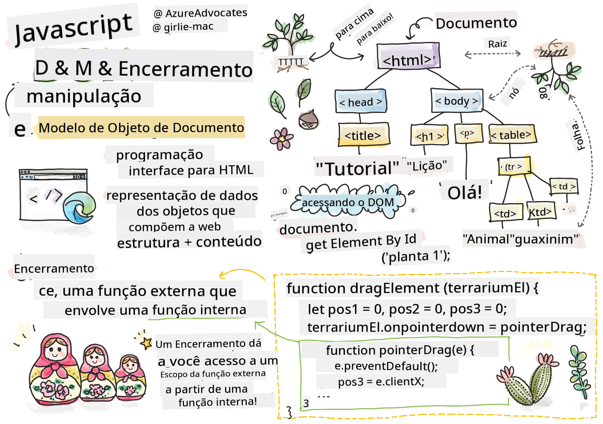
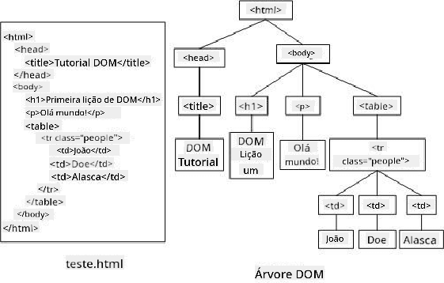

<!--
CO_OP_TRANSLATOR_METADATA:
{
  "original_hash": "30f8903a1f290e3d438dc2c70fe60259",
  "translation_date": "2025-08-25T21:20:16+00:00",
  "source_file": "3-terrarium/3-intro-to-DOM-and-closures/README.md",
  "language_code": "br"
}
-->
# Projeto Terrário Parte 3: Manipulação do DOM e um Closure


> Sketchnote por [Tomomi Imura](https://twitter.com/girlie_mac)

## Quiz Pré-Aula

[Quiz pré-aula](https://ashy-river-0debb7803.1.azurestaticapps.net/quiz/19)

### Introdução

Manipular o DOM, ou "Document Object Model", é um aspecto fundamental do desenvolvimento web. De acordo com [MDN](https://developer.mozilla.org/docs/Web/API/Document_Object_Model/Introduction), "O Document Object Model (DOM) é a representação de dados dos objetos que compõem a estrutura e o conteúdo de um documento na web." Os desafios em torno da manipulação do DOM na web frequentemente motivaram o uso de frameworks JavaScript em vez de JavaScript puro para gerenciar o DOM, mas aqui vamos fazer isso por conta própria!

Além disso, esta lição introduzirá a ideia de um [closure em JavaScript](https://developer.mozilla.org/docs/Web/JavaScript/Closures), que você pode pensar como uma função encapsulada por outra função, permitindo que a função interna tenha acesso ao escopo da função externa.

> Closures em JavaScript são um tópico vasto e complexo. Esta lição aborda a ideia mais básica: no código deste terrário, você encontrará um closure: uma função interna e uma função externa construídas de forma a permitir que a função interna acesse o escopo da função externa. Para muito mais informações sobre como isso funciona, visite a [documentação detalhada](https://developer.mozilla.org/docs/Web/JavaScript/Closures).

Usaremos um closure para manipular o DOM.

Pense no DOM como uma árvore, representando todas as maneiras pelas quais um documento de página web pode ser manipulado. Diversas APIs (Interfaces de Programação de Aplicações) foram criadas para que programadores, usando sua linguagem de programação preferida, possam acessar o DOM e editá-lo, alterá-lo, reorganizá-lo e gerenciá-lo de outras formas.



> Uma representação do DOM e da marcação HTML que o referencia. De [Olfa Nasraoui](https://www.researchgate.net/publication/221417012_Profile-Based_Focused_Crawler_for_Social_Media-Sharing_Websites)

Nesta lição, completaremos nosso projeto interativo de terrário criando o JavaScript que permitirá ao usuário manipular as plantas na página.

### Pré-requisito

Você deve ter o HTML e o CSS do seu terrário prontos. Ao final desta lição, você será capaz de mover as plantas para dentro e fora do terrário arrastando-as.

### Tarefa

Na pasta do seu terrário, crie um novo arquivo chamado `script.js`. Importe esse arquivo na seção `<head>`:

```html
	<script src="./script.js" defer></script>
```

> Nota: use `defer` ao importar um arquivo JavaScript externo no arquivo HTML para permitir que o JavaScript seja executado apenas após o arquivo HTML ter sido totalmente carregado. Você também poderia usar o atributo `async`, que permite que o script seja executado enquanto o arquivo HTML está sendo analisado, mas no nosso caso, é importante que os elementos HTML estejam totalmente disponíveis para arrastar antes de permitir que o script de arrastar seja executado.
---

## Os elementos do DOM

A primeira coisa que você precisa fazer é criar referências aos elementos que deseja manipular no DOM. No nosso caso, são as 14 plantas atualmente esperando nas barras laterais.

### Tarefa

```html
dragElement(document.getElementById('plant1'));
dragElement(document.getElementById('plant2'));
dragElement(document.getElementById('plant3'));
dragElement(document.getElementById('plant4'));
dragElement(document.getElementById('plant5'));
dragElement(document.getElementById('plant6'));
dragElement(document.getElementById('plant7'));
dragElement(document.getElementById('plant8'));
dragElement(document.getElementById('plant9'));
dragElement(document.getElementById('plant10'));
dragElement(document.getElementById('plant11'));
dragElement(document.getElementById('plant12'));
dragElement(document.getElementById('plant13'));
dragElement(document.getElementById('plant14'));
```

O que está acontecendo aqui? Você está referenciando o documento e procurando em seu DOM um elemento com um Id específico. Lembre-se de que na primeira lição sobre HTML você deu Ids individuais a cada imagem de planta (`id="plant1"`)? Agora você fará uso desse esforço. Após identificar cada elemento, você passa esse item para uma função chamada `dragElement` que você construirá em breve. Assim, o elemento no HTML agora está habilitado para arrastar, ou estará em breve.

✅ Por que referenciamos elementos pelo Id? Por que não pela classe CSS? Você pode consultar a lição anterior sobre CSS para responder a essa pergunta.

---

## O Closure

Agora você está pronto para criar o closure `dragElement`, que é uma função externa que encapsula uma função interna ou funções (no nosso caso, teremos três).

Closures são úteis quando uma ou mais funções precisam acessar o escopo de uma função externa. Aqui está um exemplo:

```javascript
function displayCandy(){
	let candy = ['jellybeans'];
	function addCandy(candyType) {
		candy.push(candyType)
	}
	addCandy('gumdrops');
}
displayCandy();
console.log(candy)
```

Neste exemplo, a função `displayCandy` envolve uma função que adiciona um novo tipo de doce a um array que já existe na função. Se você executar este código, o array `candy` será indefinido, pois é uma variável local (local ao closure).

✅ Como você pode tornar o array `candy` acessível? Tente movê-lo para fora do closure. Dessa forma, o array se torna global, em vez de permanecer disponível apenas no escopo local do closure.

### Tarefa

Sob as declarações de elementos em `script.js`, crie uma função:

```javascript
function dragElement(terrariumElement) {
	//set 4 positions for positioning on the screen
	let pos1 = 0,
		pos2 = 0,
		pos3 = 0,
		pos4 = 0;
	terrariumElement.onpointerdown = pointerDrag;
}
```

`dragElement` obtém seu objeto `terrariumElement` das declarações no topo do script. Em seguida, você define algumas posições locais como `0` para o objeto passado para a função. Estas são as variáveis locais que serão manipuladas para cada elemento enquanto você adiciona funcionalidade de arrastar e soltar dentro do closure para cada elemento. O terrário será preenchido por esses elementos arrastados, então o aplicativo precisa acompanhar onde eles são colocados.

Além disso, o `terrariumElement` que é passado para esta função é atribuído a um evento `pointerdown`, que faz parte das [APIs da web](https://developer.mozilla.org/docs/Web/API) projetadas para ajudar na gestão do DOM. `onpointerdown` é disparado quando um botão é pressionado ou, no nosso caso, um elemento arrastável é tocado. Este manipulador de eventos funciona tanto em [navegadores web quanto móveis](https://caniuse.com/?search=onpointerdown), com algumas exceções.

✅ O [manipulador de eventos `onclick`](https://developer.mozilla.org/docs/Web/API/GlobalEventHandlers/onclick) tem muito mais suporte entre navegadores; por que você não o usaria aqui? Pense no tipo exato de interação de tela que você está tentando criar.

---

## A função Pointerdrag

O `terrariumElement` está pronto para ser arrastado; quando o evento `onpointerdown` é disparado, a função `pointerDrag` é invocada. Adicione essa função logo abaixo desta linha: `terrariumElement.onpointerdown = pointerDrag;`:

### Tarefa 

```javascript
function pointerDrag(e) {
	e.preventDefault();
	console.log(e);
	pos3 = e.clientX;
	pos4 = e.clientY;
}
```

Várias coisas acontecem. Primeiro, você impede que os eventos padrão que normalmente ocorrem no pointerdown aconteçam usando `e.preventDefault();`. Dessa forma, você tem mais controle sobre o comportamento da interface.

> Volte a esta linha quando tiver construído completamente o arquivo de script e tente sem `e.preventDefault()` - o que acontece?

Em segundo lugar, abra `index.html` em uma janela do navegador e inspecione a interface. Quando você clica em uma planta, pode ver como o evento 'e' é capturado. Explore o evento para ver quanta informação é coletada por um único evento de pointerdown!  

Em seguida, observe como as variáveis locais `pos3` e `pos4` são definidas como e.clientX. Você pode encontrar os valores de `e` no painel de inspeção. Esses valores capturam as coordenadas x e y da planta no momento em que você clica ou toca nela. Você precisará de controle detalhado sobre o comportamento das plantas enquanto as clica e arrasta, então você acompanha suas coordenadas.

✅ Está ficando mais claro por que todo este aplicativo é construído com um grande closure? Se não fosse, como você manteria o escopo para cada uma das 14 plantas arrastáveis?

Complete a função inicial adicionando mais duas manipulações de eventos de ponteiro sob `pos4 = e.clientY`:

```html
document.onpointermove = elementDrag;
document.onpointerup = stopElementDrag;
```
Agora você está indicando que deseja que a planta seja arrastada junto com o ponteiro enquanto você a move, e que o gesto de arrastar pare quando você deselecionar a planta. `onpointermove` e `onpointerup` fazem parte da mesma API que `onpointerdown`. A interface lançará erros agora, pois você ainda não definiu as funções `elementDrag` e `stopElementDrag`, então construa essas funções a seguir.

## As funções elementDrag e stopElementDrag

Você completará seu closure adicionando mais duas funções internas que lidarão com o que acontece quando você arrasta uma planta e para de arrastá-la. O comportamento desejado é que você possa arrastar qualquer planta a qualquer momento e colocá-la em qualquer lugar na tela. Esta interface é bastante flexível (não há uma zona de soltura, por exemplo) para permitir que você projete seu terrário exatamente como quiser, adicionando, removendo e reposicionando plantas.

### Tarefa

Adicione a função `elementDrag` logo após a chave de fechamento de `pointerDrag`:

```javascript
function elementDrag(e) {
	pos1 = pos3 - e.clientX;
	pos2 = pos4 - e.clientY;
	pos3 = e.clientX;
	pos4 = e.clientY;
	console.log(pos1, pos2, pos3, pos4);
	terrariumElement.style.top = terrariumElement.offsetTop - pos2 + 'px';
	terrariumElement.style.left = terrariumElement.offsetLeft - pos1 + 'px';
}
```
Nesta função, você faz muitas edições das posições iniciais 1-4 que definiu como variáveis locais na função externa. O que está acontecendo aqui?

Enquanto você arrasta, você redefine `pos1` tornando-o igual a `pos3` (que você definiu anteriormente como `e.clientX`) menos o valor atual de `e.clientX`. Você faz uma operação semelhante em `pos2`. Em seguida, você redefine `pos3` e `pos4` para as novas coordenadas X e Y do elemento. Você pode observar essas mudanças no console enquanto arrasta. Então, você manipula o estilo CSS da planta para definir sua nova posição com base nas novas posições de `pos1` e `pos2`, calculando as coordenadas X e Y da planta com base na comparação de seu deslocamento com essas novas posições.

> `offsetTop` e `offsetLeft` são propriedades CSS que definem a posição de um elemento com base na posição de seu pai; seu pai pode ser qualquer elemento que não esteja posicionado como `static`. 

Toda essa recalculação de posicionamento permite que você ajuste o comportamento do terrário e suas plantas.

### Tarefa 

A tarefa final para completar a interface é adicionar a função `stopElementDrag` após a chave de fechamento de `elementDrag`:

```javascript
function stopElementDrag() {
	document.onpointerup = null;
	document.onpointermove = null;
}
```

Esta pequena função redefine os eventos `onpointerup` e `onpointermove` para que você possa reiniciar o progresso da planta começando a arrastá-la novamente ou começar a arrastar uma nova planta.

✅ O que acontece se você não definir esses eventos como null?

Agora você completou seu projeto!

🥇Parabéns! Você terminou seu lindo terrário. 

---

## 🚀Desafio

Adicione um novo manipulador de eventos ao seu closure para fazer algo mais com as plantas; por exemplo, clique duas vezes em uma planta para trazê-la para frente. Seja criativo!

## Quiz Pós-Aula

[Quiz pós-aula](https://ashy-river-0debb7803.1.azurestaticapps.net/quiz/20)

## Revisão e Autoestudo

Embora arrastar elementos pela tela pareça trivial, existem muitas maneiras de fazer isso e muitos desafios, dependendo do efeito que você busca. Na verdade, existe uma [API de arrastar e soltar](https://developer.mozilla.org/docs/Web/API/HTML_Drag_and_Drop_API) que você pode experimentar. Não a usamos neste módulo porque o efeito que queríamos era um pouco diferente, mas experimente esta API em seu próprio projeto e veja o que você pode alcançar.

Encontre mais informações sobre eventos de ponteiro na [documentação W3C](https://www.w3.org/TR/pointerevents1/) e na [documentação MDN](https://developer.mozilla.org/docs/Web/API/Pointer_events).

Sempre verifique as capacidades dos navegadores usando [CanIUse.com](https://caniuse.com/).

## Tarefa

[Trabalhe um pouco mais com o DOM](assignment.md)

**Aviso Legal**:  
Este documento foi traduzido utilizando o serviço de tradução por IA [Co-op Translator](https://github.com/Azure/co-op-translator). Embora nos esforcemos para garantir a precisão, esteja ciente de que traduções automatizadas podem conter erros ou imprecisões. O documento original em seu idioma nativo deve ser considerado a fonte autoritativa. Para informações críticas, recomenda-se a tradução profissional realizada por humanos. Não nos responsabilizamos por quaisquer mal-entendidos ou interpretações equivocadas decorrentes do uso desta tradução.