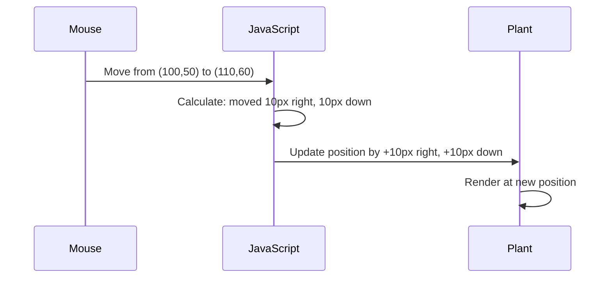

<!--
CO_OP_TRANSLATOR_METADATA:
{
  "original_hash": "bc93f6285423033ebf5b8abeb5282888",
  "translation_date": "2025-10-22T23:07:05+00:00",
  "source_file": "3-terrarium/3-intro-to-DOM-and-closures/README.md",
  "language_code": "br"
}
-->
# Projeto Terrário Parte 3: Manipulação do DOM e Closures em JavaScript


> Sketchnote por [Tomomi Imura](https://twitter.com/girlie_mac)

Bem-vindo a um dos aspectos mais envolventes do desenvolvimento web - tornar as coisas interativas! O Modelo de Objeto de Documento (DOM) é como uma ponte entre seu HTML e JavaScript, e hoje vamos usá-lo para dar vida ao seu terrário. Quando Tim Berners-Lee criou o primeiro navegador web, ele imaginou uma web onde os documentos poderiam ser dinâmicos e interativos - o DOM torna essa visão possível.

Também exploraremos closures em JavaScript, que podem parecer intimidantes no início. Pense nos closures como "bolsos de memória" onde suas funções podem lembrar informações importantes. É como se cada planta no seu terrário tivesse seu próprio registro de dados para acompanhar sua posição. Ao final desta lição, você entenderá como eles são naturais e úteis.

Aqui está o que vamos construir: um terrário onde os usuários podem arrastar e soltar plantas em qualquer lugar que quiserem. Você aprenderá as técnicas de manipulação do DOM que alimentam tudo, desde uploads de arquivos com arrastar e soltar até jogos interativos. Vamos dar vida ao seu terrário.

## Quiz Pré-Aula

[Quiz pré-aula](https://ff-quizzes.netlify.app/web/quiz/19)

## Entendendo o DOM: Sua Porta de Entrada para Páginas Web Interativas

O Modelo de Objeto de Documento (DOM) é como o JavaScript se comunica com seus elementos HTML. Quando seu navegador carrega uma página HTML, ele cria uma representação estruturada dessa página na memória - isso é o DOM. Pense nele como uma árvore genealógica onde cada elemento HTML é um membro da família que o JavaScript pode acessar, modificar ou reorganizar.

A manipulação do DOM transforma páginas estáticas em sites interativos. Toda vez que você vê um botão mudar de cor ao passar o mouse, conteúdo sendo atualizado sem recarregar a página ou elementos que você pode arrastar, isso é manipulação do DOM em ação.


> Uma representação do DOM e da marcação HTML que o referencia. De [Olfa Nasraoui](https://www.researchgate.net/publication/221417012_Profile-Based_Focused_Crawler_for_Social_Media-Sharing_Websites)

**O que torna o DOM poderoso:**
- **Fornece** uma maneira estruturada de acessar qualquer elemento na sua página
- **Permite** atualizações dinâmicas de conteúdo sem recarregar a página
- **Responde** em tempo real às interações do usuário, como cliques e arrastos
- **Cria** a base para aplicativos web interativos modernos

## Closures em JavaScript: Criando Código Organizado e Poderoso

Um [closure em JavaScript](https://developer.mozilla.org/docs/Web/JavaScript/Closures) é como dar a uma função seu próprio espaço privado com memória persistente. Considere como os tentilhões de Darwin nas Ilhas Galápagos desenvolveram bicos especializados com base em seu ambiente específico - closures funcionam de forma semelhante, criando funções especializadas que "lembram" seu contexto específico mesmo após sua função pai ter terminado.

No nosso terrário, os closures ajudam cada planta a lembrar sua própria posição de forma independente. Esse padrão aparece em todo o desenvolvimento profissional de JavaScript, tornando-o um conceito valioso para entender.

> 💡 **Entendendo Closures**: Closures são um tópico significativo em JavaScript, e muitos desenvolvedores os utilizam por anos antes de compreender totalmente todos os aspectos teóricos. Hoje, estamos focando na aplicação prática - você verá os closures surgirem naturalmente enquanto construímos nossos recursos interativos. A compreensão se desenvolverá à medida que você perceber como eles resolvem problemas reais.


> Uma representação do DOM e da marcação HTML que o referencia. De [Olfa Nasraoui](https://www.researchgate.net/publication/221417012_Profile-Based_Focused_Crawler_for_Social_Media-Sharing_Websites)

Nesta lição, completaremos nosso projeto de terrário interativo criando o JavaScript que permitirá ao usuário manipular as plantas na página.

## Antes de Começar: Preparando-se para o Sucesso

Você precisará dos arquivos HTML e CSS das lições anteriores do terrário - estamos prestes a tornar esse design estático interativo. Se você está começando agora, completar essas lições primeiro fornecerá um contexto importante.

Aqui está o que vamos construir:
- **Arrastar e soltar suave** para todas as plantas do terrário
- **Rastreamento de coordenadas** para que as plantas lembrem suas posições
- **Uma interface interativa completa** usando JavaScript puro
- **Código limpo e organizado** usando padrões de closure

## Configurando Seu Arquivo JavaScript

Vamos criar o arquivo JavaScript que tornará seu terrário interativo.

**Passo 1: Crie seu arquivo de script**

Na sua pasta do terrário, crie um novo arquivo chamado `script.js`.

**Passo 2: Vincule o JavaScript ao seu HTML**

Adicione esta tag de script à seção `<head>` do seu arquivo `index.html`:

```html
<script src="./script.js" defer></script>
```

**Por que o atributo `defer` é importante:**
- **Garante** que seu JavaScript espere até que todo o HTML seja carregado
- **Previne** erros onde o JavaScript procura por elementos que ainda não estão prontos
- **Garante** que todos os elementos das plantas estejam disponíveis para interação
- **Proporciona** melhor desempenho do que colocar scripts no final da página

> ⚠️ **Nota Importante**: O atributo `defer` evita problemas comuns de tempo. Sem ele, o JavaScript pode tentar acessar elementos HTML antes de serem carregados, causando erros.

---

## Conectando JavaScript aos Seus Elementos HTML

Antes de podermos tornar os elementos arrastáveis, o JavaScript precisa localizá-los no DOM. Pense nisso como um sistema de catalogação de biblioteca - uma vez que você tem o número do catálogo, pode encontrar exatamente o livro que precisa e acessar todo o seu conteúdo.

Usaremos o método `document.getElementById()` para fazer essas conexões. É como ter um sistema de arquivamento preciso - você fornece um ID e ele localiza exatamente o elemento que você precisa no seu HTML.

### Habilitando Funcionalidade de Arrastar para Todas as Plantas

Adicione este código ao seu arquivo `script.js`:

```javascript
// Enable drag functionality for all 14 plants
dragElement(document.getElementById('plant1'));
dragElement(document.getElementById('plant2'));
dragElement(document.getElementById('plant3'));
dragElement(document.getElementById('plant4'));
dragElement(document.getElementById('plant5'));
dragElement(document.getElementById('plant6'));
dragElement(document.getElementById('plant7'));
dragElement(document.getElementById('plant8'));
dragElement(document.getElementById('plant9'));
dragElement(document.getElementById('plant10'));
dragElement(document.getElementById('plant11'));
dragElement(document.getElementById('plant12'));
dragElement(document.getElementById('plant13'));
dragElement(document.getElementById('plant14'));
```

**O que este código realiza:**
- **Localiza** cada elemento de planta no DOM usando seu ID único
- **Recupera** uma referência JavaScript para cada elemento HTML
- **Passa** cada elemento para uma função `dragElement` (que criaremos a seguir)
- **Prepara** cada planta para interação de arrastar e soltar
- **Conecta** sua estrutura HTML à funcionalidade JavaScript

> 🎯 **Por que Usar IDs em vez de Classes?** IDs fornecem identificadores únicos para elementos específicos, enquanto classes CSS são projetadas para estilizar grupos de elementos. Quando o JavaScript precisa manipular elementos individuais, IDs oferecem a precisão e o desempenho necessários.

> 💡 **Dica Pro**: Note como estamos chamando `dragElement()` para cada planta individualmente. Essa abordagem garante que cada planta tenha seu próprio comportamento de arrastar independente, essencial para uma interação suave do usuário.

---

## Construindo o Closure da Função Drag Element

Agora vamos criar o coração da nossa funcionalidade de arrastar: um closure que gerencia o comportamento de arrastar para cada planta. Este closure conterá várias funções internas que trabalham juntas para rastrear movimentos do mouse e atualizar as posições dos elementos.

Closures são perfeitos para esta tarefa porque nos permitem criar variáveis "privadas" que persistem entre chamadas de função, dando a cada planta seu próprio sistema de rastreamento de coordenadas independente.

### Entendendo Closures com um Exemplo Simples

Deixe-me demonstrar closures com um exemplo simples que ilustra o conceito:

```javascript
function createCounter() {
    let count = 0; // This is like a private variable
    
    function increment() {
        count++; // The inner function remembers the outer variable
        return count;
    }
    
    return increment; // We're giving back the inner function
}

const myCounter = createCounter();
console.log(myCounter()); // 1
console.log(myCounter()); // 2
```

**O que está acontecendo neste padrão de closure:**
- **Cria** uma variável privada `count` que só existe dentro deste closure
- **A função interna** pode acessar e modificar essa variável externa (o mecanismo de closure)
- **Quando retornamos** a função interna, ela mantém sua conexão com esses dados privados
- **Mesmo depois** que `createCounter()` termina a execução, `count` persiste e lembra seu valor

### Por que Closures São Perfeitos para Funcionalidade de Arrastar

Para nosso terrário, cada planta precisa lembrar suas coordenadas de posição atuais. Closures fornecem a solução perfeita:

**Benefícios principais para nosso projeto:**
- **Mantém** variáveis de posição privadas para cada planta de forma independente
- **Preserva** dados de coordenadas entre eventos de arrastar
- **Previne** conflitos de variáveis entre diferentes elementos arrastáveis
- **Cria** uma estrutura de código limpa e organizada

> 🎯 **Objetivo de Aprendizado**: Você não precisa dominar todos os aspectos dos closures agora. Concentre-se em ver como eles nos ajudam a organizar o código e manter o estado para nossa funcionalidade de arrastar.

### Criando a Função dragElement

Agora vamos construir a função principal que lidará com toda a lógica de arrastar. Adicione esta função abaixo das declarações dos elementos das plantas:

```javascript
function dragElement(terrariumElement) {
    // Initialize position tracking variables
    let pos1 = 0,  // Previous mouse X position
        pos2 = 0,  // Previous mouse Y position  
        pos3 = 0,  // Current mouse X position
        pos4 = 0;  // Current mouse Y position
    
    // Set up the initial drag event listener
    terrariumElement.onpointerdown = pointerDrag;
}
```

**Entendendo o sistema de rastreamento de posição:**
- **`pos1` e `pos2`**: Armazenam a diferença entre as posições antigas e novas do mouse
- **`pos3` e `pos4`**: Rastreiam as coordenadas atuais do mouse
- **`terrariumElement`**: O elemento específico da planta que estamos tornando arrastável
- **`onpointerdown`**: O evento que é acionado quando o usuário começa a arrastar

**Como o padrão de closure funciona:**
- **Cria** variáveis de posição privadas para cada elemento de planta
- **Mantém** essas variáveis ao longo do ciclo de vida do arrasto
- **Garante** que cada planta rastreie suas próprias coordenadas de forma independente
- **Fornece** uma interface limpa através da função `dragElement`

### Por que Usar Eventos de Ponteiro?

Você pode se perguntar por que usamos `onpointerdown` em vez do mais familiar `onclick`. Aqui está o raciocínio:

| Tipo de Evento | Melhor Para | O Problema |
|----------------|-------------|------------|
| `onclick` | Cliques simples em botões | Não consegue lidar com arrastar (apenas cliques e soltar) |
| `onpointerdown` | Mouse e toque | Mais novo, mas bem suportado atualmente |
| `onmousedown` | Apenas mouse de desktop | Deixa usuários móveis de fora |

**Por que eventos de ponteiro são perfeitos para o que estamos construindo:**
- **Funciona muito bem** seja alguém usando um mouse, dedo ou até mesmo uma caneta
- **Sente-se igual** em um laptop, tablet ou celular
- **Lida** com o movimento real de arrastar (não apenas clique e pronto)
- **Cria** uma experiência suave que os usuários esperam de aplicativos web modernos

> 💡 **Preparando para o Futuro**: Eventos de ponteiro são a maneira moderna de lidar com interações do usuário. Em vez de escrever código separado para mouse e toque, você obtém ambos de graça. Bem legal, né?

---

## A Função pointerDrag: Capturando o Início de um Arrasto

Quando um usuário pressiona uma planta (seja com um clique do mouse ou toque do dedo), a função `pointerDrag` entra em ação. Esta função captura as coordenadas iniciais e configura o sistema de arrasto.

Adicione esta função dentro do closure `dragElement`, logo após a linha `terrariumElement.onpointerdown = pointerDrag;`:

```javascript
function pointerDrag(e) {
    // Prevent default browser behavior (like text selection)
    e.preventDefault();
    
    // Capture the initial mouse/touch position
    pos3 = e.clientX;  // X coordinate where drag started
    pos4 = e.clientY;  // Y coordinate where drag started
    
    // Set up event listeners for the dragging process
    document.onpointermove = elementDrag;
    document.onpointerup = stopElementDrag;
}
```

**Passo a passo, o que está acontecendo:**
- **Previne** comportamentos padrão do navegador que poderiam interferir no arrasto
- **Registra** as coordenadas exatas onde o usuário iniciou o gesto de arrasto
- **Estabelece** ouvintes de eventos para o movimento contínuo de arrasto
- **Prepara** o sistema para rastrear o movimento do mouse/dedo em todo o documento

### Entendendo a Prevenção de Eventos

A linha `e.preventDefault()` é crucial para um arrasto suave:

**Sem prevenção, os navegadores podem:**
- **Selecionar** texto ao arrastar pela página
- **Acionar** menus de contexto ao clicar com o botão direito durante o arrasto
- **Interferir** no comportamento de arrasto personalizado
- **Criar** artefatos visuais durante a operação de arrasto

> 🔍 **Experimente**: Após completar esta lição, tente remover `e.preventDefault()` e veja como isso afeta a experiência de arrasto. Você rapidamente entenderá por que esta linha é essencial!

### Sistema de Rastreamento de Coordenadas

As propriedades `e.clientX` e `e.clientY` nos fornecem coordenadas precisas do mouse/toque:

| Propriedade | O Que Mede | Caso de Uso |
|-------------|------------|-------------|
| `clientX` | Posição horizontal relativa à janela de visualização | Rastreamento de movimento esquerda-direita |
| `clientY` | Posição vertical relativa à janela de visualização | Rastreamento de movimento cima-baixo |

**Entendendo essas coordenadas:**
- **Fornece** informações de posicionamento com precisão de pixel
- **Atualiza** em tempo real conforme o usuário move o ponteiro
- **Permanece** consistente em diferentes tamanhos de tela e níveis de zoom
- **Permite** interações de arrasto suaves e responsivas

### Configurando Ouvintes de Eventos em Nível de Documento

Note como anexamos os eventos de movimento e parada ao `document` inteiro, não apenas ao elemento da planta:

```javascript
document.onpointermove = elementDrag;
document.onpointerup = stopElementDrag;
```

**Por que anexar ao documento:**
- **Continua** rastreando mesmo quando o mouse sai do elemento da planta
- **Previne** interrupções no arrasto se o usuário se mover rapidamente
- **Proporciona** arrasto suave em toda a tela
- **Lida** com casos extremos onde o cursor sai da janela do navegador

> ⚡ **Nota de Desempenho**: Limparemos esses ouvintes em nível de documento quando o arrasto parar para evitar vazamentos de memória e problemas de desempenho.

## Completando o Sistema de Arrasto: Movimento e Limpeza

Agora adicionaremos as duas funções restantes que lidam com o movimento real de arrasto e a limpeza quando o arrasto para. Essas funções trabalham juntas para criar um movimento suave e responsivo das plantas pelo seu terrário.

### A Função elementDrag: Rastreamento de Movimento

Adicione a função `elementDrag` logo após a chave de fechamento de `pointerDrag`:

```javascript
function elementDrag(e) {
    // Calculate the distance moved since the last event
    pos1 = pos3 - e.clientX;  // Horizontal distance moved
    pos2 = pos4 - e.clientY;  // Vertical distance moved
    
    // Update the current position tracking
    pos3 = e.clientX;  // New current X position
    pos4 = e.clientY;  // New current Y position
    
    // Apply the movement to the element's position
    terrariumElement.style.top = (terrariumElement.offsetTop - pos2) + 'px';
    terrariumElement.style.left = (terrariumElement.offsetLeft - pos1) + 'px';
}
```

**Entendendo a matemática das coordenadas:**
- **`pos1` e `pos2`**: Calculam o quão longe o mouse se moveu desde a última atualização
- **`pos3` e `pos4`**: Armazenam a posição atual do mouse para o próximo cálculo  
- **`offsetTop` e `offsetLeft`**: Obtêm a posição atual do elemento na página  
- **Lógica de subtração**: Move o elemento na mesma quantidade que o mouse se moveu  

**Aqui está o detalhamento do cálculo de movimento:**  
1. **Mede** a diferença entre as posições antiga e nova do mouse  
2. **Calcula** o quanto mover o elemento com base no movimento do mouse  
3. **Atualiza** as propriedades de posição CSS do elemento em tempo real  
4. **Armazena** a nova posição como base para o próximo cálculo de movimento  

### Representação Visual da Matemática  


  
### A Função stopElementDrag: Finalizando  

Adicione a função de limpeza após a chave de fechamento de `elementDrag`:  

```javascript
function stopElementDrag() {
    // Remove the document-level event listeners
    document.onpointerup = null;
    document.onpointermove = null;
}
```
  
**Por que a limpeza é essencial:**  
- **Previne** vazamentos de memória causados por listeners de eventos que permanecem ativos  
- **Interrompe** o comportamento de arrastar quando o usuário solta a planta  
- **Permite** que outros elementos sejam arrastados independentemente  
- **Reseta** o sistema para a próxima operação de arrastar  

**O que acontece sem a limpeza:**  
- Listeners de eventos continuam ativos mesmo após o término do arraste  
- O desempenho é prejudicado à medida que listeners não utilizados se acumulam  
- Comportamentos inesperados ao interagir com outros elementos  
- Recursos do navegador são desperdiçados com o processamento de eventos desnecessários  

### Entendendo as Propriedades de Posição CSS  

Nosso sistema de arraste manipula duas propriedades CSS principais:  

| Propriedade | O que controla | Como usamos |
|-------------|----------------|-------------|
| `top`       | Distância da borda superior | Posicionamento vertical durante o arraste |
| `left`      | Distância da borda esquerda | Posicionamento horizontal durante o arraste |

**Principais insights sobre as propriedades offset:**  
- **`offsetTop`**: Distância atual da borda superior do elemento pai posicionado  
- **`offsetLeft`**: Distância atual da borda esquerda do elemento pai posicionado  
- **Contexto de posicionamento**: Esses valores são relativos ao ancestral posicionado mais próximo  
- **Atualizações em tempo real**: Mudanças ocorrem imediatamente ao modificar as propriedades CSS  

> 🎯 **Filosofia de Design**: Este sistema de arraste é intencionalmente flexível – não há "zonas de soltura" ou restrições. Os usuários podem posicionar as plantas em qualquer lugar, dando total controle criativo sobre o design do terrário.  

## Juntando Tudo: Seu Sistema Completo de Arrastar e Soltar  

Parabéns! Você acabou de construir um sistema sofisticado de arrastar e soltar usando JavaScript puro. Sua função completa `dragElement` agora contém um poderoso closure que gerencia:  

**O que seu closure realiza:**  
- **Mantém** variáveis de posição privadas para cada planta de forma independente  
- **Gerencia** todo o ciclo de vida do arraste do início ao fim  
- **Proporciona** movimento suave e responsivo em toda a tela  
- **Limpa** recursos adequadamente para evitar vazamentos de memória  
- **Cria** uma interface intuitiva e criativa para o design do terrário  

### Testando Seu Terrário Interativo  

Agora teste seu terrário interativo! Abra seu arquivo `index.html` em um navegador e experimente a funcionalidade:  

1. **Clique e segure** qualquer planta para começar a arrastar  
2. **Mova o mouse ou dedo** e veja a planta seguir suavemente  
3. **Solte** para posicionar a planta em seu novo local  
4. **Experimente** diferentes arranjos para explorar a interface  

🥇 **Conquista**: Você criou um aplicativo web totalmente interativo usando conceitos fundamentais que desenvolvedores profissionais utilizam diariamente. Essa funcionalidade de arrastar e soltar utiliza os mesmos princípios por trás de uploads de arquivos, quadros kanban e muitas outras interfaces interativas.  

  

---

## Desafio do GitHub Copilot Agent 🚀  

Use o modo Agent para completar o seguinte desafio:  

**Descrição:** Melhore o projeto do terrário adicionando uma funcionalidade de reset que retorna todas as plantas às suas posições originais com animações suaves.  

**Prompt:** Crie um botão de reset que, ao ser clicado, anima todas as plantas de volta às suas posições originais na barra lateral usando transições CSS. A função deve armazenar as posições originais ao carregar a página e fazer a transição suave das plantas para essas posições em 1 segundo quando o botão de reset for pressionado.  

Saiba mais sobre [modo agent](https://code.visualstudio.com/blogs/2025/02/24/introducing-copilot-agent-mode) aqui.  

## 🚀 Desafio Adicional: Expanda Suas Habilidades  

Pronto para levar seu terrário ao próximo nível? Experimente implementar essas melhorias:  

**Extensões Criativas:**  
- **Clique duplo** em uma planta para trazê-la para frente (manipulação de z-index)  
- **Adicione feedback visual** como um leve brilho ao passar o mouse sobre as plantas  
- **Implemente limites** para evitar que as plantas sejam arrastadas para fora do terrário  
- **Crie uma função de salvar** que lembra as posições das plantas usando localStorage  
- **Adicione efeitos sonoros** ao pegar e posicionar plantas  

> 💡 **Oportunidade de Aprendizado**: Cada um desses desafios ensinará novos aspectos de manipulação do DOM, tratamento de eventos e design de experiência do usuário.  

## Quiz Pós-Aula  

[Quiz pós-aula](https://ff-quizzes.netlify.app/web/quiz/20)  

## Revisão & Autoestudo: Aprofundando Seu Entendimento  

Você dominou os fundamentos de manipulação do DOM e closures, mas sempre há mais para explorar! Aqui estão alguns caminhos para expandir seu conhecimento e habilidades.  

### Abordagens Alternativas de Arrastar e Soltar  

Usamos eventos de ponteiro para máxima flexibilidade, mas o desenvolvimento web oferece várias abordagens:  

| Abordagem | Melhor Para | Valor de Aprendizado |
|-----------|-------------|----------------------|
| [API HTML Drag and Drop](https://developer.mozilla.org/docs/Web/API/HTML_Drag_and_Drop_API) | Uploads de arquivos, zonas formais de arraste | Compreender capacidades nativas do navegador |
| [Eventos de Toque](https://developer.mozilla.org/docs/Web/API/Touch_events) | Interações específicas para dispositivos móveis | Padrões de desenvolvimento mobile-first |
| Propriedades CSS `transform` | Animações suaves | Técnicas de otimização de desempenho |

### Tópicos Avançados de Manipulação do DOM  

**Próximos passos na sua jornada de aprendizado:**  
- **Delegação de eventos**: Gerenciar eventos de forma eficiente para múltiplos elementos  
- **Intersection Observer**: Detectar quando elementos entram/saem da área visível  
- **Mutation Observer**: Monitorar mudanças na estrutura do DOM  
- **Componentes Web**: Criar elementos de interface reutilizáveis e encapsulados  
- **Conceitos de Virtual DOM**: Entender como frameworks otimizam atualizações no DOM  

### Recursos Essenciais para Continuar Aprendendo  

**Documentação Técnica:**  
- [Guia de Eventos de Ponteiro do MDN](https://developer.mozilla.org/docs/Web/API/Pointer_events) - Referência abrangente sobre eventos de ponteiro  
- [Especificação de Eventos de Ponteiro W3C](https://www.w3.org/TR/pointerevents1/) - Documentação oficial de padrões  
- [Exploração Profunda de Closures em JavaScript](https://developer.mozilla.org/docs/Web/JavaScript/Closures) - Padrões avançados de closures  

**Compatibilidade com Navegadores:**  
- [CanIUse.com](https://caniuse.com/) - Verifique suporte de recursos em diferentes navegadores  
- [Dados de Compatibilidade do MDN](https://github.com/mdn/browser-compat-data) - Informações detalhadas de compatibilidade  

**Oportunidades de Prática:**  
- **Construa** um jogo de quebra-cabeça usando mecânicas semelhantes de arraste  
- **Crie** um quadro kanban com gerenciamento de tarefas por arrastar e soltar  
- **Desenhe** uma galeria de imagens com arranjos de fotos arrastáveis  
- **Experimente** gestos de toque para interfaces móveis  

> 🎯 **Estratégia de Aprendizado**: A melhor forma de solidificar esses conceitos é através da prática. Experimente criar variações de interfaces arrastáveis – cada projeto ensinará algo novo sobre interação do usuário e manipulação do DOM.  

## Tarefa  

[Trabalhe um pouco mais com o DOM](assignment.md)  

---

**Aviso Legal**:  
Este documento foi traduzido utilizando o serviço de tradução por IA [Co-op Translator](https://github.com/Azure/co-op-translator). Embora nos esforcemos para garantir a precisão, esteja ciente de que traduções automatizadas podem conter erros ou imprecisões. O documento original em seu idioma nativo deve ser considerado a fonte autoritativa. Para informações críticas, recomenda-se a tradução profissional feita por humanos. Não nos responsabilizamos por quaisquer mal-entendidos ou interpretações incorretas decorrentes do uso desta tradução.