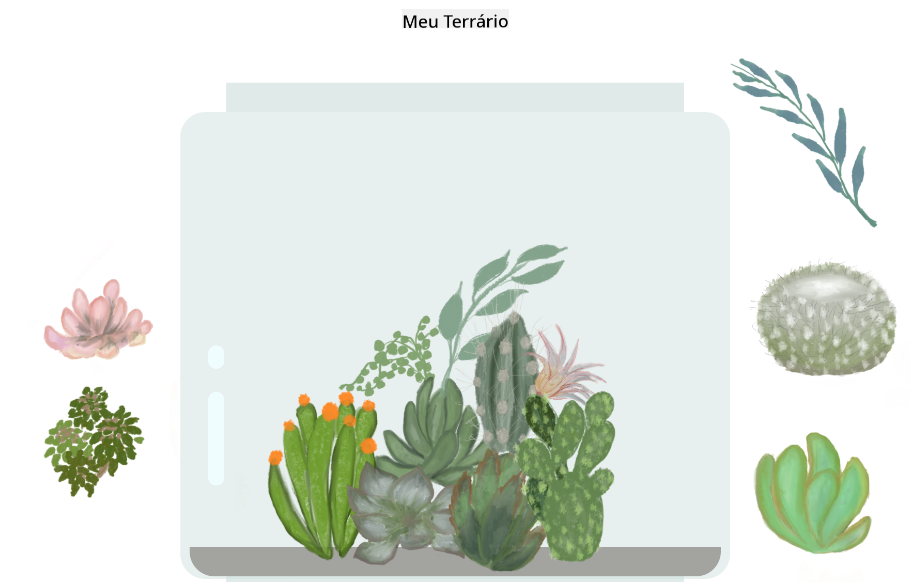

<!--
CO_OP_TRANSLATOR_METADATA:
{
  "original_hash": "7965cd2bc5dc92ad888dc4c6ab2ab70a",
  "translation_date": "2025-08-25T21:05:04+00:00",
  "source_file": "3-terrarium/README.md",
  "language_code": "br"
}
-->
# Meu Terrário: Um projeto para aprender sobre HTML, CSS e manipulação do DOM com JavaScript 🌵🌱

Uma pequena meditação de código com arrastar e soltar. Com um pouco de HTML, JS e CSS, você será capaz de construir uma interface web, estilizar e até adicionar várias interações de sua escolha.

# Lições

1. [Introdução ao HTML](./1-intro-to-html/README.md)
2. [Introdução ao CSS](./2-intro-to-css/README.md)
3. [Introdução ao DOM e Closures em JS](./3-intro-to-DOM-and-closures/README.md)

## Créditos

Escrito com ♥️ por [Jen Looper](https://www.twitter.com/jenlooper)

O terrário criado via CSS foi inspirado no vidro de Jakub Mandra no [codepen](https://codepen.io/Rotarepmi/pen/rjpNZY).

As ilustrações foram desenhadas à mão por [Jen Looper](http://jenlooper.com) com a ajuda do Procreate.

## Publique seu Terrário

Você pode publicar seu terrário na web usando o Azure Static Web Apps.

1. Faça um fork deste repositório

2. Pressione este botão

3. Siga o assistente para criar seu aplicativo. Certifique-se de definir a raiz do aplicativo como `/solution` ou a raiz do seu código. Não há API neste aplicativo, então não se preocupe em adicioná-la. Uma pasta do GitHub será criada no repositório que você fez o fork, ajudando os serviços de build do Azure Static Web Apps a construir e publicar seu aplicativo em uma nova URL.

**Aviso Legal**:  
Este documento foi traduzido utilizando o serviço de tradução por IA [Co-op Translator](https://github.com/Azure/co-op-translator). Embora nos esforcemos para garantir a precisão, esteja ciente de que traduções automatizadas podem conter erros ou imprecisões. O documento original em seu idioma nativo deve ser considerado a fonte autoritativa. Para informações críticas, recomenda-se a tradução profissional realizada por humanos. Não nos responsabilizamos por quaisquer mal-entendidos ou interpretações equivocadas decorrentes do uso desta tradução.