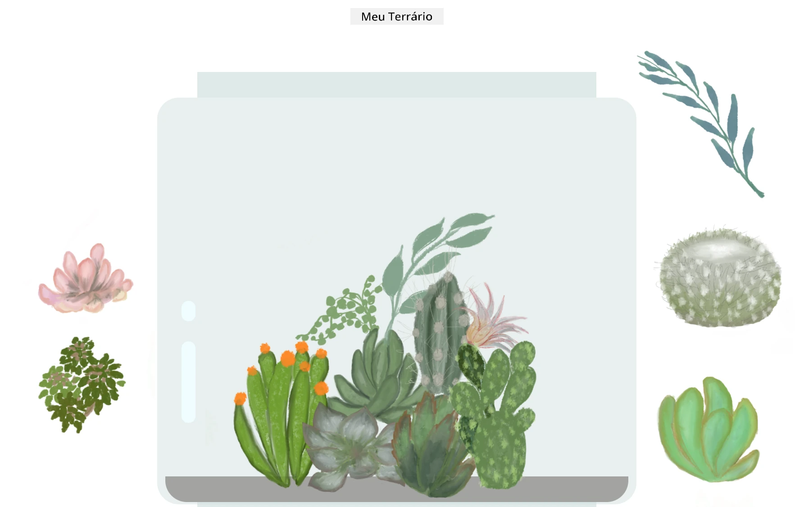

<!--
CO_OP_TRANSLATOR_METADATA:
{
  "original_hash": "6329fbe8bd936068debd78cca6f09c0a",
  "translation_date": "2025-08-25T21:31:24+00:00",
  "source_file": "3-terrarium/solution/README.md",
  "language_code": "br"
}
-->
# Meu Terrário: Um projeto para aprender sobre HTML, CSS e manipulação do DOM usando JavaScript 🌵🌱

Uma pequena meditação de código com arrastar e soltar. Com um pouco de HTML, JS e CSS, você pode criar uma interface web, estilizar e adicionar interatividade.

## Créditos

Escrito com ♥️ por [Jen Looper](https://www.twitter.com/jenlooper)

O terrário criado via CSS foi inspirado no vidro de jarra do [codepen](https://codepen.io/Rotarepmi/pen/rjpNZY) de Jakub Mandra.

A arte foi desenhada à mão por [Jen Looper](http://jenlooper.com) usando Procreate.

## Publique seu Terrário

Você pode publicar seu terrário na web usando Azure Static Web Apps.

1. Faça um fork deste repositório

2. Pressione este botão

3. Siga o assistente para criar seu aplicativo. Certifique-se de definir o diretório raiz do aplicativo como `/solution` ou o diretório raiz do seu código. Não há API neste aplicativo, então não se preocupe em adicionar isso. Uma pasta .github será criada no repositório que você fez fork, ajudando o serviço de build do Azure Static Web Apps a construir e publicar seu aplicativo em um novo URL.

**Aviso Legal**:  
Este documento foi traduzido utilizando o serviço de tradução por IA [Co-op Translator](https://github.com/Azure/co-op-translator). Embora nos esforcemos para garantir a precisão, esteja ciente de que traduções automatizadas podem conter erros ou imprecisões. O documento original em seu idioma nativo deve ser considerado a fonte autoritativa. Para informações críticas, recomenda-se a tradução profissional realizada por humanos. Não nos responsabilizamos por quaisquer mal-entendidos ou interpretações equivocadas decorrentes do uso desta tradução.