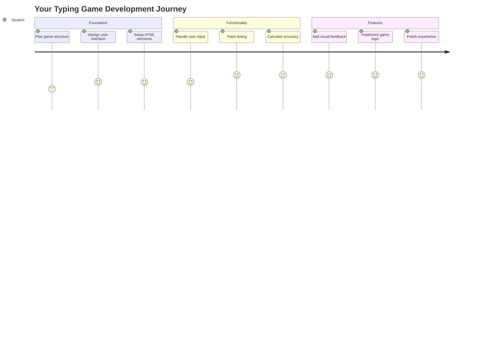
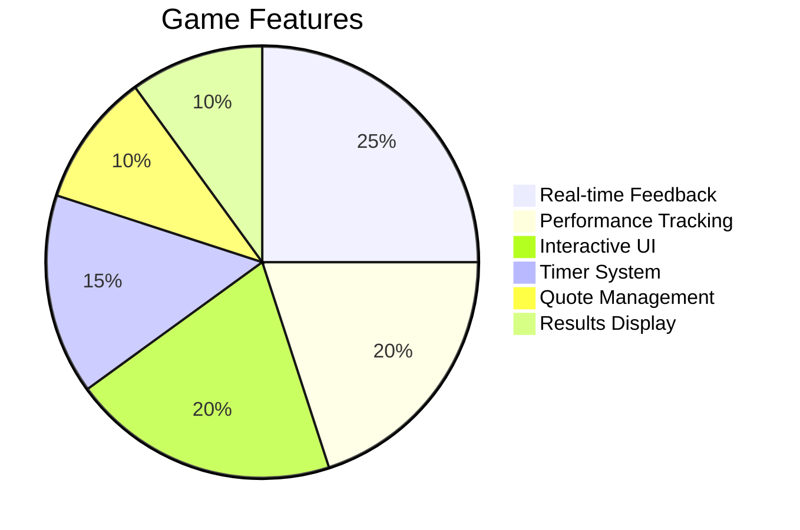
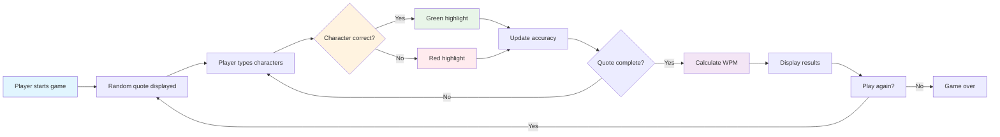
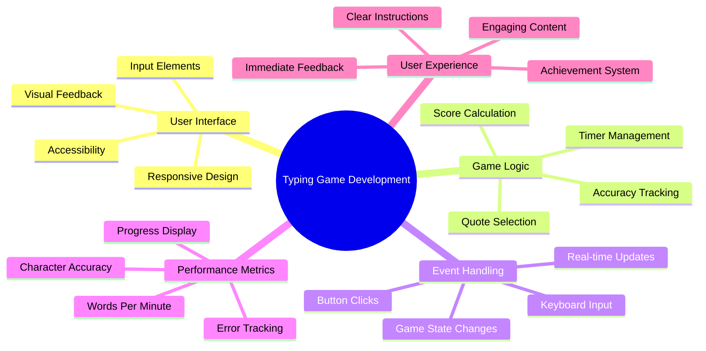
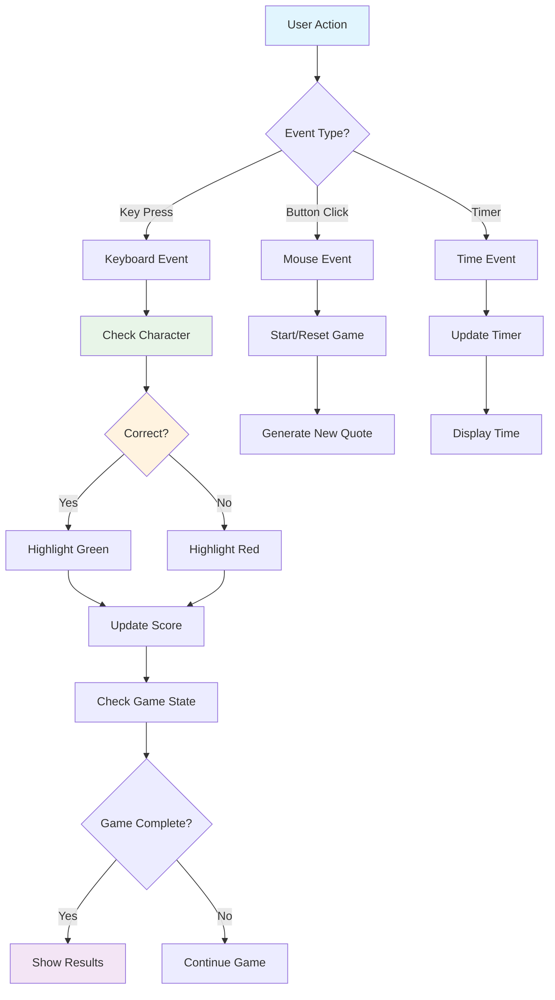
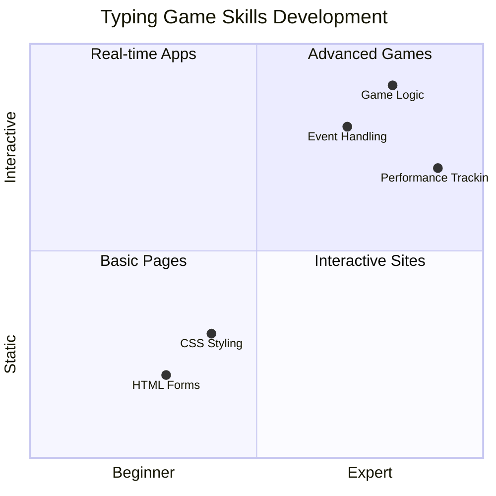
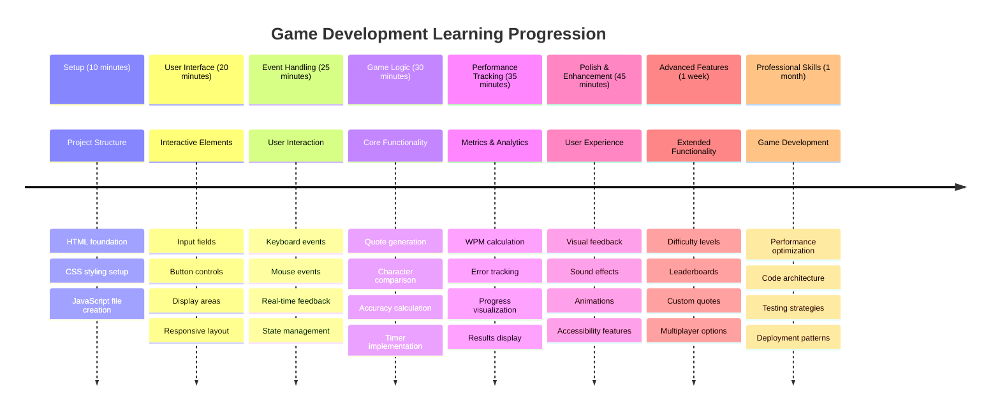

<!--
CO_OP_TRANSLATOR_METADATA:
{
  "original_hash": "efa2ab875b8bb5a7883816506da6b6d2",
  "translation_date": "2025-11-04T00:11:59+00:00",
  "source_file": "4-typing-game/README.md",
  "language_code": "br"
}
-->
# Programação Orientada a Eventos - Crie um Jogo de Digitação

## Introdução

Aqui está algo que todo desenvolvedor sabe, mas raramente comenta: digitar rápido é um superpoder! 🚀 Pense nisso - quanto mais rápido você consegue transferir suas ideias do cérebro para o editor de código, mais sua criatividade pode fluir. É como ter uma conexão direta entre seus pensamentos e a tela.

Quer saber uma das melhores maneiras de aprimorar essa habilidade? Isso mesmo - vamos criar um jogo!

> Vamos criar juntos um jogo de digitação incrível!

Pronto para colocar em prática todas aquelas habilidades de JavaScript, HTML e CSS que você vem aprendendo? Vamos construir um jogo de digitação que vai te desafiar com frases aleatórias do lendário detetive [Sherlock Holmes](https://en.wikipedia.org/wiki/Sherlock_Holmes). O jogo vai medir a rapidez e precisão com que você digita - e acredite, é mais viciante do que parece!

## O Que Você Precisa Saber

Antes de começarmos, certifique-se de estar confortável com esses conceitos (não se preocupe se precisar de uma rápida revisão - todos já passamos por isso!):

- Criar controles de entrada de texto e botões
- CSS e definição de estilos usando classes  
- Noções básicas de JavaScript
  - Criar um array
  - Gerar um número aleatório
  - Obter o horário atual

Se algum desses conceitos parecer um pouco enferrujado, está tudo bem! Às vezes, a melhor maneira de solidificar seu conhecimento é mergulhar em um projeto e descobrir as coisas enquanto avança.

### 🔄 **Check-in Pedagógico**
**Avaliação de Fundamentos**: Antes de começar o desenvolvimento, certifique-se de entender:
- ✅ Como funcionam os formulários HTML e elementos de entrada
- ✅ Classes CSS e estilos dinâmicos
- ✅ Listeners e manipuladores de eventos em JavaScript
- ✅ Manipulação de arrays e seleção aleatória
- ✅ Medição de tempo e cálculos

**Autoavaliação Rápida**: Você consegue explicar como esses conceitos funcionam juntos em um jogo interativo?
- **Eventos** são acionados quando os usuários interagem com os elementos
- **Manipuladores** processam esses eventos e atualizam o estado do jogo
- **CSS** fornece feedback visual para as ações do usuário
- **Cronometragem** permite medir desempenho e progressão no jogo

## Vamos Construir Isso!

[Criando um jogo de digitação usando programação orientada a eventos](./typing-game/README.md)

### ⚡ **O Que Você Pode Fazer Nos Próximos 5 Minutos**
- [ ] Abra o console do navegador e tente ouvir eventos de teclado com `addEventListener`
- [ ] Crie uma página HTML simples com um campo de entrada e teste a detecção de digitação
- [ ] Pratique manipulação de strings comparando o texto digitado com o texto alvo
- [ ] Experimente `setTimeout` para entender funções de temporização

### 🎯 **O Que Você Pode Realizar Nesta Hora**
- [ ] Complete o quiz pós-aula e entenda programação orientada a eventos
- [ ] Construa uma versão básica do jogo de digitação com validação de palavras
- [ ] Adicione feedback visual para digitação correta e incorreta
- [ ] Implemente um sistema de pontuação simples baseado em velocidade e precisão
- [ ] Estilize seu jogo com CSS para torná-lo visualmente atraente

### 📅 **Seu Desenvolvimento de Jogo Durante a Semana**
- [ ] Complete o jogo de digitação com todos os recursos e polimento
- [ ] Adicione níveis de dificuldade com palavras de complexidade variada
- [ ] Implemente rastreamento de estatísticas do usuário (WPM, precisão ao longo do tempo)
- [ ] Crie efeitos sonoros e animações para melhorar a experiência do usuário
- [ ] Torne seu jogo responsivo para dispositivos móveis com toque
- [ ] Compartilhe seu jogo online e receba feedback dos usuários

### 🌟 **Seu Desenvolvimento Interativo Durante o Mês**
- [ ] Crie vários jogos explorando diferentes padrões de interação
- [ ] Aprenda sobre loops de jogo, gerenciamento de estado e otimização de desempenho
- [ ] Contribua para projetos de desenvolvimento de jogos de código aberto
- [ ] Domine conceitos avançados de temporização e animações suaves
- [ ] Crie um portfólio mostrando várias aplicações interativas
- [ ] Mentore outras pessoas interessadas em desenvolvimento de jogos e interação com o usuário

## 🎯 Sua Linha do Tempo de Domínio do Jogo de Digitação

### 🛠️ Resumo do Kit de Ferramentas de Desenvolvimento de Jogos

Após concluir este projeto, você terá dominado:
- **Programação Orientada a Eventos**: Interfaces de usuário responsivas que reagem à entrada
- **Feedback em Tempo Real**: Atualizações visuais e de desempenho instantâneas
- **Medição de Desempenho**: Sistemas precisos de cronometragem e pontuação
- **Gerenciamento de Estado do Jogo**: Controle do fluxo de aplicação e experiência do usuário
- **Design Interativo**: Criação de experiências envolventes e viciantes
- **APIs Modernas da Web**: Utilização de recursos do navegador para interações ricas
- **Padrões de Acessibilidade**: Design inclusivo para todos os usuários

**Aplicações no Mundo Real**: Essas habilidades se aplicam diretamente a:
- **Aplicações Web**: Qualquer interface interativa ou painel de controle
- **Software Educacional**: Plataformas de aprendizado e ferramentas de avaliação de habilidades
- **Ferramentas de Produtividade**: Editores de texto, IDEs e softwares de colaboração
- **Indústria de Jogos**: Jogos de navegador e entretenimento interativo
- **Desenvolvimento Mobile**: Interfaces baseadas em toque e manipulação de gestos

**Próximo Nível**: Você está pronto para explorar frameworks avançados de jogos, sistemas multiplayer em tempo real ou aplicações interativas complexas!

## Créditos

Escrito com ♥️ por [Christopher Harrison](http://www.twitter.com/geektrainer)

---

**Aviso Legal**:  
Este documento foi traduzido usando o serviço de tradução por IA [Co-op Translator](https://github.com/Azure/co-op-translator). Embora nos esforcemos para garantir a precisão, esteja ciente de que traduções automatizadas podem conter erros ou imprecisões. O documento original em seu idioma nativo deve ser considerado a fonte autoritativa. Para informações críticas, recomenda-se a tradução profissional feita por humanos. Não nos responsabilizamos por quaisquer mal-entendidos ou interpretações incorretas decorrentes do uso desta tradução.