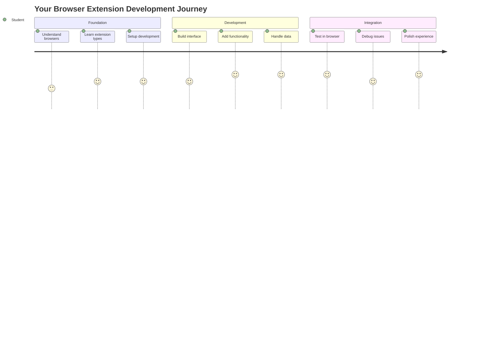
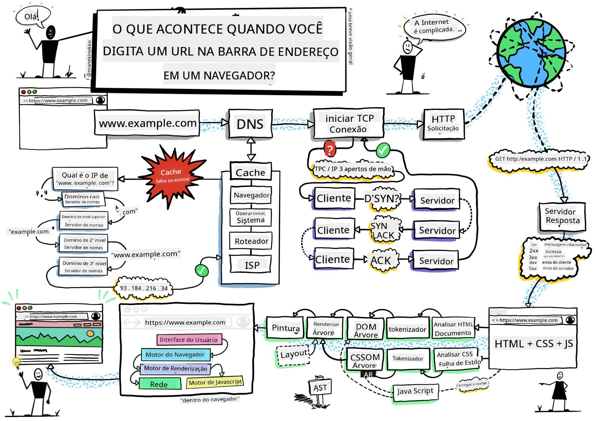
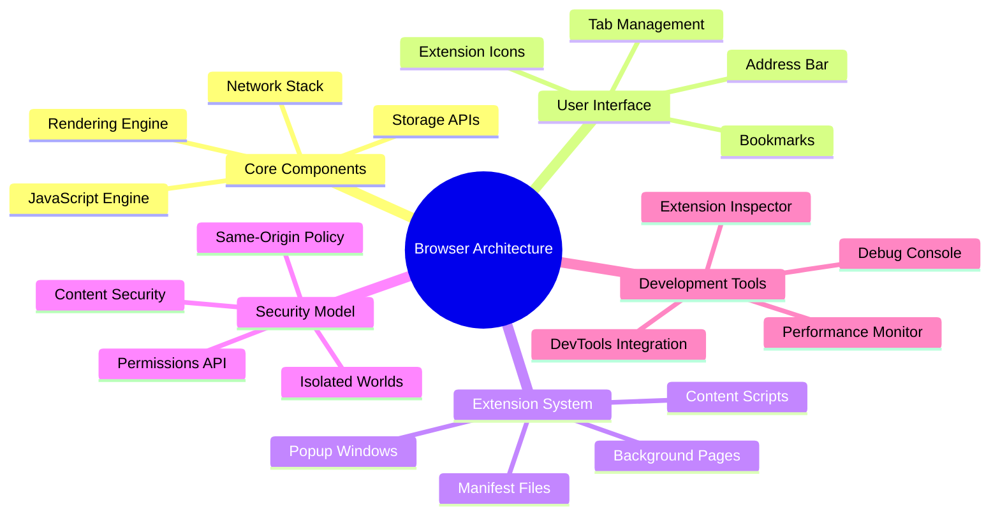
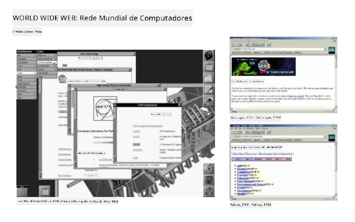
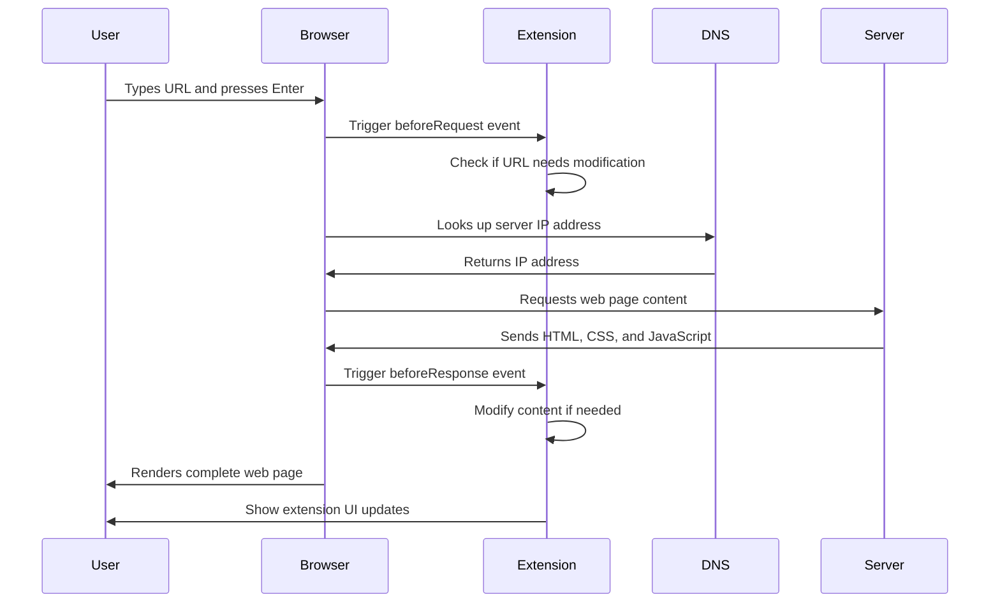
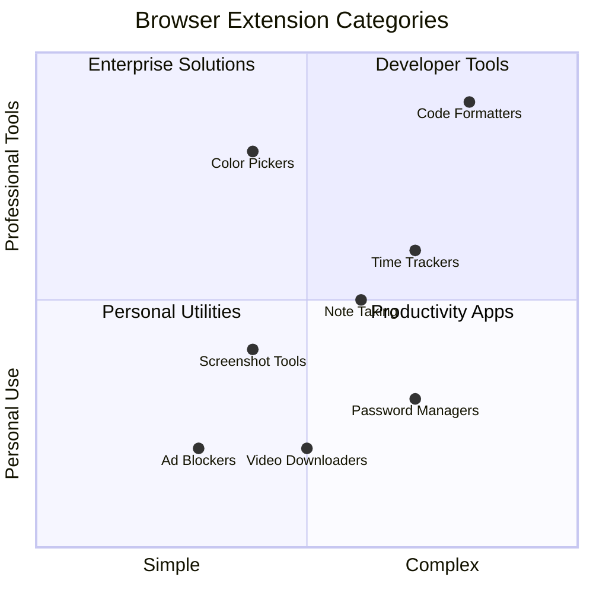
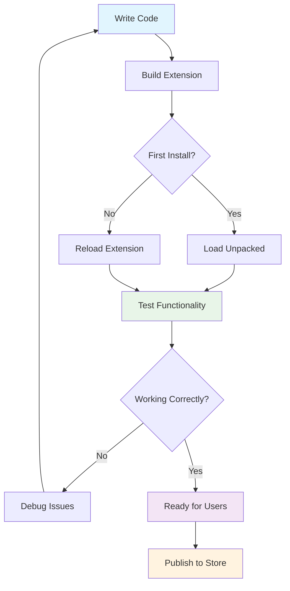
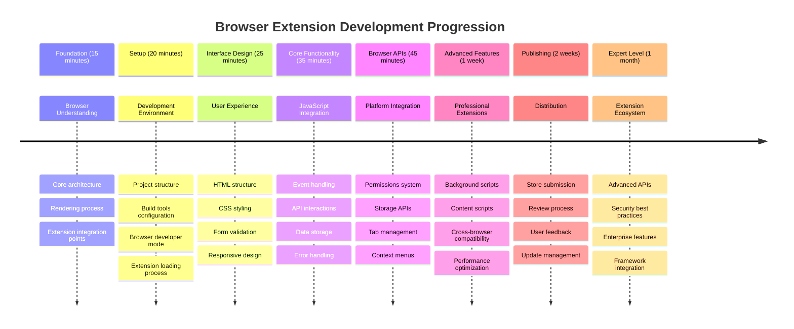

<!--
CO_OP_TRANSLATOR_METADATA:
{
  "original_hash": "00aa85715e1efd4930c17a23e3012e69",
  "translation_date": "2025-11-04T00:17:19+00:00",
  "source_file": "5-browser-extension/1-about-browsers/README.md",
  "language_code": "br"
}
-->
# Projeto de Extensão de Navegador Parte 1: Tudo sobre Navegadores




> Esboço por [Wassim Chegham](https://dev.to/wassimchegham/ever-wondered-what-happens-when-you-type-in-a-url-in-an-address-bar-in-a-browser-3dob)

## Quiz Pré-Aula

[Quiz pré-aula](https://ff-quizzes.netlify.app/web/quiz/23)

### Introdução

Extensões de navegador são miniaplicativos que melhoram sua experiência de navegação na web. Assim como a visão original de Tim Berners-Lee de uma web interativa, as extensões ampliam as capacidades do navegador além da simples visualização de documentos. De gerenciadores de senhas que mantêm suas contas seguras a seletores de cores que ajudam designers a capturar tons perfeitos, as extensões resolvem desafios cotidianos de navegação.

Antes de construirmos sua primeira extensão, vamos entender como os navegadores funcionam. Assim como Alexander Graham Bell precisou entender a transmissão de som antes de inventar o telefone, conhecer os fundamentos dos navegadores ajudará você a criar extensões que se integrem perfeitamente aos sistemas existentes.

Ao final desta lição, você entenderá a arquitetura dos navegadores e terá começado a construir sua primeira extensão.



## Entendendo os Navegadores Web

Um navegador web é essencialmente um intérprete sofisticado de documentos. Quando você digita "google.com" na barra de endereços, o navegador realiza uma série complexa de operações - solicitando conteúdo de servidores ao redor do mundo, depois analisando e renderizando esse código nas páginas interativas que você vê.

Esse processo reflete como o primeiro navegador web, WorldWideWeb, foi projetado por Tim Berners-Lee em 1990 para tornar documentos com hiperlinks acessíveis a todos.

✅ **Um pouco de história**: O primeiro navegador foi chamado 'WorldWideWeb' e foi criado por Sir Timothy Berners-Lee em 1990.


> Alguns navegadores antigos, via [Karen McGrane](https://www.slideshare.net/KMcGrane/week-4-ixd-history-personal-computing)

### Como os Navegadores Processam Conteúdo Web

O processo entre digitar um URL e ver uma página envolve várias etapas coordenadas que acontecem em segundos:



**Aqui está o que esse processo realiza:**
- **Traduz** o URL legível para humanos em um endereço IP do servidor por meio de uma consulta DNS
- **Estabelece** uma conexão segura com o servidor web usando os protocolos HTTP ou HTTPS
- **Solicita** o conteúdo específico da página web ao servidor
- **Recebe** marcação HTML, estilização CSS e código JavaScript do servidor
- **Renderiza** todo o conteúdo na página web interativa que você vê

### Recursos Principais dos Navegadores

Os navegadores modernos oferecem inúmeros recursos que os desenvolvedores de extensões podem aproveitar:

| Recurso | Propósito | Oportunidades para Extensões |
|---------|-----------|-----------------------------|
| **Motor de Renderização** | Exibe HTML, CSS e JavaScript | Modificação de conteúdo, injeção de estilos |
| **Motor JavaScript** | Executa código JavaScript | Scripts personalizados, interações com APIs |
| **Armazenamento Local** | Salva dados localmente | Preferências do usuário, dados em cache |
| **Pilha de Rede** | Gerencia solicitações web | Monitoramento de solicitações, análise de dados |
| **Modelo de Segurança** | Protege os usuários contra conteúdo malicioso | Filtragem de conteúdo, melhorias de segurança |

**Entender esses recursos ajuda você a:**
- **Identificar** onde sua extensão pode agregar mais valor
- **Escolher** as APIs de navegador certas para a funcionalidade da sua extensão
- **Projetar** extensões que funcionem eficientemente com os sistemas do navegador
- **Garantir** que sua extensão siga as melhores práticas de segurança do navegador

### Considerações para Desenvolvimento Multinavegador

Diferentes navegadores implementam padrões com pequenas variações, semelhante a como diferentes linguagens de programação podem lidar com o mesmo algoritmo de maneira diferente. Chrome, Firefox e Safari têm características únicas que os desenvolvedores devem considerar durante o desenvolvimento de extensões.

> 💡 **Dica Pro**: Use [caniuse.com](https://www.caniuse.com) para verificar quais tecnologias web são suportadas em diferentes navegadores. Isso é inestimável ao planejar os recursos da sua extensão!

**Considerações principais para o desenvolvimento de extensões:**
- **Teste** sua extensão nos navegadores Chrome, Firefox e Edge
- **Adapte-se** às diferentes APIs de extensão e formatos de manifesto dos navegadores
- **Lide** com características de desempenho e limitações variadas
- **Forneça** alternativas para recursos específicos de navegadores que podem não estar disponíveis

✅ **Insight Analítico**: Você pode determinar quais navegadores seus usuários preferem instalando pacotes de análise em seus projetos de desenvolvimento web. Esses dados ajudam você a priorizar quais navegadores devem ser suportados primeiro.

## Entendendo Extensões de Navegador

Extensões de navegador resolvem desafios comuns de navegação na web ao adicionar funcionalidades diretamente à interface do navegador. Em vez de exigir aplicativos separados ou fluxos de trabalho complexos, as extensões fornecem acesso imediato a ferramentas e recursos.

Esse conceito reflete como os primeiros pioneiros da computação, como Douglas Engelbart, imaginaram aumentar as capacidades humanas com tecnologia - as extensões ampliam a funcionalidade básica do navegador.



**Categorias populares de extensões e seus benefícios:**
- **Ferramentas de Produtividade**: Gerenciadores de tarefas, aplicativos de anotações e rastreadores de tempo que ajudam você a se organizar
- **Melhorias de Segurança**: Gerenciadores de senhas, bloqueadores de anúncios e ferramentas de privacidade que protegem seus dados
- **Ferramentas para Desenvolvedores**: Formatadores de código, seletores de cores e utilitários de depuração que facilitam o desenvolvimento
- **Aprimoramento de Conteúdo**: Modos de leitura, baixadores de vídeos e ferramentas de captura de tela que melhoram sua experiência na web

✅ **Pergunta de Reflexão**: Quais são suas extensões de navegador favoritas? Quais tarefas específicas elas realizam e como melhoram sua experiência de navegação?

### 🔄 **Verificação Pedagógica**
**Entendimento da Arquitetura de Navegadores**: Antes de avançar para o desenvolvimento de extensões, certifique-se de que você pode:
- ✅ Explicar como os navegadores processam solicitações web e renderizam conteúdo
- ✅ Identificar os principais componentes da arquitetura de navegadores
- ✅ Entender como as extensões se integram à funcionalidade do navegador
- ✅ Reconhecer o modelo de segurança que protege os usuários

**Autoavaliação Rápida**: Você consegue traçar o caminho desde digitar um URL até visualizar uma página web?
1. **Consulta DNS** converte o URL em endereço IP
2. **Solicitação HTTP** busca conteúdo do servidor
3. **Análise** processa HTML, CSS e JavaScript
4. **Renderização** exibe a página final
5. **Extensões** podem modificar o conteúdo em várias etapas

## Instalando e Gerenciando Extensões

Entender o processo de instalação de extensões ajuda você a antecipar a experiência do usuário ao instalar sua extensão. O processo de instalação é padronizado nos navegadores modernos, com pequenas variações no design da interface.


> **Importante**: Certifique-se de ativar o modo desenvolvedor e permitir extensões de outras lojas ao testar suas próprias extensões.

### Processo de Instalação de Extensões em Desenvolvimento

Ao desenvolver e testar suas próprias extensões, siga este fluxo de trabalho:



```bash
# Step 1: Build your extension
npm run build
```

**O que este comando realiza:**
- **Compila** seu código-fonte em arquivos prontos para o navegador
- **Agrupa** módulos JavaScript em pacotes otimizados
- **Gera** os arquivos finais da extensão na pasta `/dist`
- **Prepara** sua extensão para instalação e testes

**Etapa 2: Navegue até Extensões do Navegador**
1. **Abra** a página de gerenciamento de extensões do seu navegador
2. **Clique** no botão "Configurações e mais" (ícone `...`) no canto superior direito
3. **Selecione** "Extensões" no menu suspenso

**Etapa 3: Carregue Sua Extensão**
- **Para novas instalações**: Escolha `load unpacked` e selecione sua pasta `/dist`
- **Para atualizações**: Clique em `reload` ao lado da extensão já instalada
- **Para testes**: Ative o "Modo Desenvolvedor" para acessar recursos adicionais de depuração

### Instalação de Extensões em Produção

> ✅ **Nota**: Estas instruções de desenvolvimento são especificamente para extensões que você mesmo constrói. Para instalar extensões publicadas, visite as lojas oficiais de extensões de navegador, como a [Microsoft Edge Add-ons store](https://microsoftedge.microsoft.com/addons/Microsoft-Edge-Extensions-Home).

**Entendendo a diferença:**
- **Instalações de desenvolvimento** permitem testar extensões não publicadas durante o desenvolvimento
- **Instalações pela loja** fornecem extensões publicadas e verificadas com atualizações automáticas
- **Sideloading** permite a instalação de extensões fora das lojas oficiais (requer modo desenvolvedor)

## Construindo Sua Extensão de Pegada de Carbono

Vamos criar uma extensão de navegador que exibe a pegada de carbono do uso de energia da sua região. Este projeto demonstra conceitos essenciais de desenvolvimento de extensões enquanto cria uma ferramenta prática para conscientização ambiental.

Essa abordagem segue o princípio de "aprender fazendo", que tem se mostrado eficaz desde as teorias educacionais de John Dewey - combinando habilidades técnicas com aplicações significativas no mundo real.

### Requisitos do Projeto

Antes de começar o desenvolvimento, vamos reunir os recursos e dependências necessários:

**Acesso à API Necessário:**
- **[Chave da API CO2 Signal](https://www.co2signal.com/)**: Insira seu endereço de e-mail para receber sua chave de API gratuita
- **[Código da região](http://api.electricitymap.org/v3/zones)**: Encontre o código da sua região usando o [Electricity Map](https://www.electricitymap.org/map) (por exemplo, Boston usa 'US-NEISO')

**Ferramentas de Desenvolvimento:**
- **[Node.js e NPM](https://www.npmjs.com)**: Ferramenta de gerenciamento de pacotes para instalar dependências do projeto
- **[Código inicial](../../../../5-browser-extension/start)**: Baixe a pasta `start` para começar o desenvolvimento

✅ **Saiba Mais**: Aprimore suas habilidades de gerenciamento de pacotes com este [módulo abrangente do Learn](https://docs.microsoft.com/learn/modules/create-nodejs-project-dependencies/?WT.mc_id=academic-77807-sagibbon)

### Entendendo a Estrutura do Projeto

Entender a estrutura do projeto ajuda a organizar o trabalho de desenvolvimento de forma eficiente. Assim como a Biblioteca de Alexandria foi organizada para facilitar a recuperação de conhecimento, um código bem estruturado torna o desenvolvimento mais eficiente:

```
project-root/
├── dist/                    # Built extension files
│   ├── manifest.json        # Extension configuration
│   ├── index.html           # User interface markup
│   ├── background.js        # Background script functionality
│   └── main.js              # Compiled JavaScript bundle
├── src/                     # Source development files
│   └── index.js             # Your main JavaScript code
├── package.json             # Project dependencies and scripts
└── webpack.config.js        # Build configuration
```

**Dividindo o que cada arquivo realiza:**
- **`manifest.json`**: **Define** metadados da extensão, permissões e pontos de entrada
- **`index.html`**: **Cria** a interface do usuário que aparece quando os usuários clicam na sua extensão
- **`background.js`**: **Gerencia** tarefas em segundo plano e ouvintes de eventos do navegador
- **`main.js`**: **Contém** o JavaScript final agrupado após o processo de build
- **`src/index.js`**: **Abriga** seu código principal de desenvolvimento que é compilado em `main.js`

> 💡 **Dica de Organização**: Armazene sua chave de API e código da região em uma nota segura para fácil referência durante o desenvolvimento. Você precisará desses valores para testar a funcionalidade da sua extensão.

✅ **Nota de Segurança**: Nunca comprometa chaves de API ou credenciais sensíveis no seu repositório de código. Mostraremos como lidar com isso de forma segura nas próximas etapas.

## Criando a Interface da Extensão

Agora vamos construir os componentes da interface do usuário. A extensão usa uma abordagem de duas telas: uma tela de configuração para a configuração inicial e uma tela de resultados para exibição de dados.

Isso segue o princípio de divulgação progressiva usado no design de interfaces desde os primeiros dias da computação - revelando informações e opções em uma sequência lógica para evitar sobrecarregar os usuários.

### Visão Geral das Telas da Extensão

**Tela de Configuração** - Configuração inicial do usuário:


**Tela de Resultados** - Exibição de dados de pegada de carbono:


### Construindo o Formulário de Configuração

O formulário de configuração coleta dados de configuração do usuário durante o uso inicial. Uma vez configuradas, essas informações permanecem armazenadas no navegador para sessões futuras.

No arquivo `/dist/index.html`, adicione esta estrutura de formulário:

```html
<form class="form-data" autocomplete="on">
    <div>
        <h2>New? Add your Information</h2>
    </div>
    <div>
        <label for="region">Region Name</label>
        <input type="text" id="region" required class="region-name" />
    </div>
    <div>
        <label for="api">Your API Key from tmrow</label>
        <input type="text" id="api" required class="api-key" />
    </div>
    <button class="search-btn">Submit</button>
</form>
```

**Aqui está o que este formulário realiza:**
- **Cria** uma estrutura de formulário semântica com associações adequadas entre rótulos e campos de entrada
- **Habilita** a funcionalidade de preenchimento automático do navegador para melhorar a experiência do usuário
- **Exige** que ambos os campos sejam preenchidos antes do envio usando o atributo `required`
- **Organiza** os campos com nomes de classe descritivos para facilitar a estilização e o direcionamento no JavaScript
- **Fornece** instruções claras para os usuários que estão configurando a extensão pela primeira vez

### Construindo a Exibição de Resultados

Em seguida, crie a área de resultados que mostrará os dados de pegada de carbono. Adicione este HTML abaixo do formulário:

```html
<div class="result">
    <div class="loading">loading...</div>
    <div class="errors"></div>
    <div class="data"></div>
    <div class="result-container">
        <p><strong>Region: </strong><span class="my-region"></span></p>
        <p><strong>Carbon Usage: </strong><span class="carbon-usage"></span></p>
        <p><strong>Fossil Fuel Percentage: </strong><span class="fossil-fuel"></span></p>
    </div>
    <button class="clear-btn">Change region</button>
</div>
```

**Dividindo o que esta estrutura fornece:**
- **`loading`**: **Exibe** uma mensagem de carregamento enquanto os dados da API estão sendo buscados
- **`errors`**: **Mostra** mensagens de erro se as chamadas à API falharem ou os dados forem inválidos
- **`data`**: **Armazena** dados brutos para depuração durante o desenvolvimento
- **`result-container`**: **Apresenta** informações formatadas sobre a pegada de carbono aos usuários
- **`clear-btn`**: **Permite** que os usuários alterem sua região e reconfigurem a extensão

### Configurando o Processo de Build

Agora vamos instalar as dependências do projeto e testar o processo de build:

```bash
npm install
```

**O que este processo de instalação realiza:**
- **Baixa** o Webpack e outras dependências de desenvolvimento especificadas em `package.json`
- **Configura** a cadeia de ferramentas de build para compilar JavaScript moderno
- **Prepara** o ambiente de desenvolvimento para construção e teste de extensões
- **Habilita** agrupamento de código, otimização e recursos de compatibilidade entre navegadores

> 💡 **Insight sobre o Processo de Build**: O Webpack agrupa seu código-fonte de `/src/index.js` em `/dist/main.js`. Este processo otimiza seu código para produção e garante compatibilidade com navegadores.

### Testando Seu Progresso

Neste ponto, você pode testar sua extensão:
1. **Execute** o comando de build para compilar seu código  
2. **Carregue** a extensão no seu navegador usando o modo desenvolvedor  
3. **Verifique** se o formulário é exibido corretamente e tem uma aparência profissional  
4. **Cheque** se todos os elementos do formulário estão devidamente alinhados e funcionais  

**O que você realizou:**  
- **Construiu** a estrutura HTML básica para sua extensão  
- **Criou** as interfaces de configuração e resultados com marcação semântica adequada  
- **Configurou** um fluxo de desenvolvimento moderno usando ferramentas padrão da indústria  
- **Preparou** a base para adicionar funcionalidades interativas em JavaScript  

### 🔄 **Verificação Pedagógica**  
**Progresso no Desenvolvimento de Extensões**: Verifique sua compreensão antes de continuar:  
- ✅ Você consegue explicar o propósito de cada arquivo na estrutura do projeto?  
- ✅ Você entende como o processo de build transforma seu código-fonte?  
- ✅ Por que separamos configuração e resultados em diferentes seções de interface?  
- ✅ Como a estrutura do formulário suporta tanto usabilidade quanto acessibilidade?  

**Compreensão do Fluxo de Desenvolvimento**: Agora você deve ser capaz de:  
1. **Modificar** HTML e CSS para a interface da sua extensão  
2. **Executar** o comando de build para compilar suas alterações  
3. **Recarregar** a extensão no navegador para testar atualizações  
4. **Depurar** problemas usando as ferramentas de desenvolvedor do navegador  

Você concluiu a primeira fase do desenvolvimento de extensões para navegador. Assim como os irmãos Wright precisaram entender aerodinâmica antes de alcançar o voo, compreender esses conceitos fundamentais prepara você para criar recursos interativos mais complexos na próxima lição.  

## Desafio do Agente GitHub Copilot 🚀  

Use o modo Agente para completar o seguinte desafio:  

**Descrição:** Melhore a extensão do navegador adicionando validação de formulário e recursos de feedback ao usuário para aprimorar a experiência ao inserir chaves de API e códigos de região.  

**Prompt:** Crie funções de validação em JavaScript que verifiquem se o campo de chave de API contém pelo menos 20 caracteres e se o código de região segue o formato correto (como 'US-NEISO'). Adicione feedback visual alterando as cores das bordas dos campos de entrada para verde em entradas válidas e vermelho em entradas inválidas. Também adicione um recurso de alternância para mostrar/ocultar a chave de API por motivos de segurança.  

Saiba mais sobre [modo agente](https://code.visualstudio.com/blogs/2025/02/24/introducing-copilot-agent-mode) aqui.  

## 🚀 Desafio  

Dê uma olhada em uma loja de extensões de navegador e instale uma no seu navegador. Você pode examinar seus arquivos de maneiras interessantes. O que você descobre?  

## Quiz Pós-Aula  

[Quiz pós-aula](https://ff-quizzes.netlify.app/web/quiz/24)  

## Revisão e Autoestudo  

Nesta lição, você aprendeu um pouco sobre a história do navegador web; aproveite esta oportunidade para aprender sobre como os inventores da World Wide Web imaginaram seu uso lendo mais sobre sua história. Alguns sites úteis incluem:  

[The History of Web Browsers](https://www.mozilla.org/firefox/browsers/browser-history/)  

[History of the Web](https://webfoundation.org/about/vision/history-of-the-web/)  

[An interview with Tim Berners-Lee](https://www.theguardian.com/technology/2019/mar/12/tim-berners-lee-on-30-years-of-the-web-if-we-dream-a-little-we-can-get-the-web-we-want)  

### ⚡ **O Que Você Pode Fazer nos Próximos 5 Minutos**  
- [ ] Abra a página de extensões do Chrome/Edge (chrome://extensions) e explore o que você tem instalado  
- [ ] Olhe a aba Rede nas DevTools do seu navegador enquanto carrega uma página da web  
- [ ] Tente visualizar o código-fonte da página (Ctrl+U) para ver a estrutura HTML  
- [ ] Inspecione qualquer elemento de uma página da web e modifique seu CSS nas DevTools  

### 🎯 **O Que Você Pode Realizar Nesta Hora**  
- [ ] Complete o quiz pós-aula e entenda os fundamentos dos navegadores  
- [ ] Crie um arquivo manifest.json básico para uma extensão de navegador  
- [ ] Construa uma extensão simples de "Hello World" que exibe um popup  
- [ ] Teste o carregamento da sua extensão no modo desenvolvedor  
- [ ] Explore a documentação de extensões de navegador para o navegador alvo  

### 📅 **Sua Jornada de Extensão de Uma Semana**  
- [ ] Conclua uma extensão funcional de navegador com utilidade real  
- [ ] Aprenda sobre scripts de conteúdo, scripts de fundo e interações de popup  
- [ ] Domine APIs de navegador como armazenamento, abas e mensagens  
- [ ] Projete interfaces amigáveis para sua extensão  
- [ ] Teste sua extensão em diferentes sites e cenários  
- [ ] Publique sua extensão na loja de extensões do navegador  

### 🌟 **Seu Desenvolvimento de Navegador ao Longo do Mês**  
- [ ] Construa várias extensões resolvendo diferentes problemas de usuários  
- [ ] Aprenda APIs avançadas de navegador e práticas recomendadas de segurança  
- [ ] Contribua para projetos de extensões de navegador de código aberto  
- [ ] Domine compatibilidade entre navegadores e aprimoramento progressivo  
- [ ] Crie ferramentas e templates de desenvolvimento de extensões para outros  
- [ ] Torne-se um especialista em extensões de navegador que ajuda outros desenvolvedores  

## 🎯 Sua Linha do Tempo de Domínio de Extensões de Navegador  


  
### 🛠️ Resumo do Kit de Ferramentas de Desenvolvimento de Extensões  

Após concluir esta lição, você agora tem:  
- **Conhecimento da Arquitetura de Navegadores**: Compreensão de motores de renderização, modelos de segurança e integração de extensões  
- **Ambiente de Desenvolvimento**: Ferramentas modernas com Webpack, NPM e capacidades de depuração  
- **Fundação de UI/UX**: Estrutura HTML semântica com padrões de divulgação progressiva  
- **Consciência de Segurança**: Compreensão de permissões de navegador e práticas de desenvolvimento seguro  
- **Conceitos de Compatibilidade Entre Navegadores**: Conhecimento de considerações de compatibilidade e abordagens de teste  
- **Integração de API**: Base para trabalhar com fontes de dados externas  
- **Fluxo de Trabalho Profissional**: Procedimentos de desenvolvimento e teste padrão da indústria  

**Aplicações no Mundo Real**: Essas habilidades se aplicam diretamente a:  
- **Desenvolvimento Web**: Aplicações de página única e aplicativos web progressivos  
- **Aplicações Desktop**: Software desktop baseado em Electron e web  
- **Desenvolvimento Mobile**: Aplicativos híbridos e soluções móveis baseadas na web  
- **Ferramentas Empresariais**: Aplicações de produtividade internas e automação de fluxo de trabalho  
- **Código Aberto**: Contribuir para projetos de extensões de navegador e padrões web  

**Próximo Nível**: Você está pronto para adicionar funcionalidades interativas, trabalhar com APIs de navegador e criar extensões que resolvam problemas reais dos usuários!  

## Tarefa  

[Redefina o estilo da sua extensão](assignment.md)  

---

**Aviso Legal**:  
Este documento foi traduzido utilizando o serviço de tradução por IA [Co-op Translator](https://github.com/Azure/co-op-translator). Embora nos esforcemos para garantir a precisão, esteja ciente de que traduções automatizadas podem conter erros ou imprecisões. O documento original em seu idioma nativo deve ser considerado a fonte autoritativa. Para informações críticas, recomenda-se a tradução profissional feita por humanos. Não nos responsabilizamos por quaisquer mal-entendidos ou interpretações incorretas decorrentes do uso desta tradução.