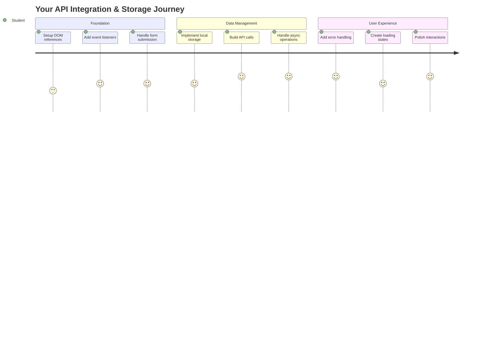
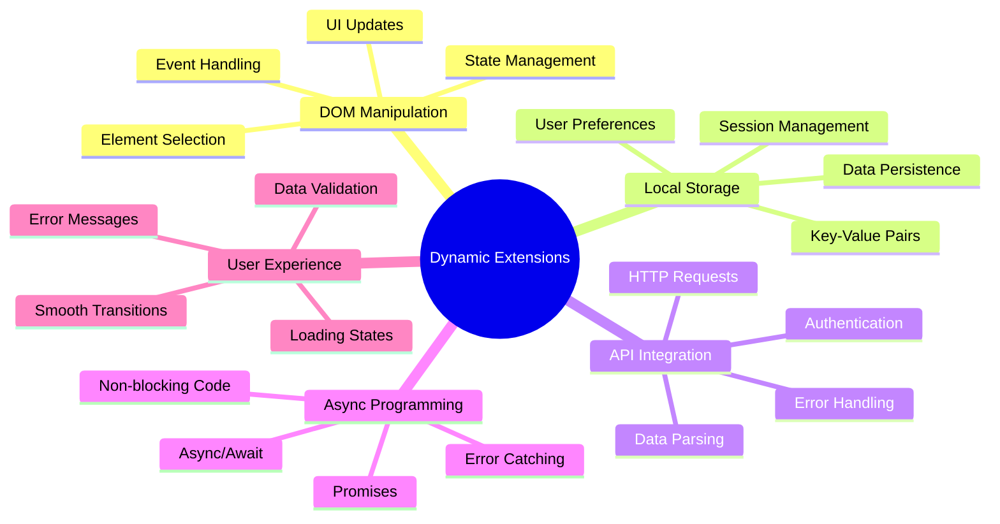
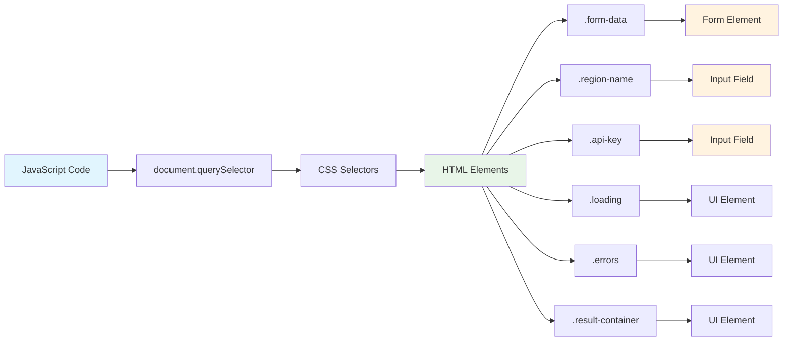
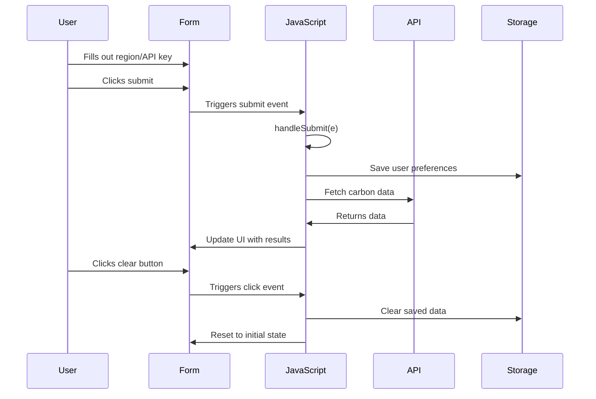
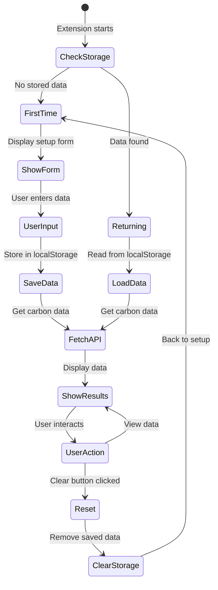
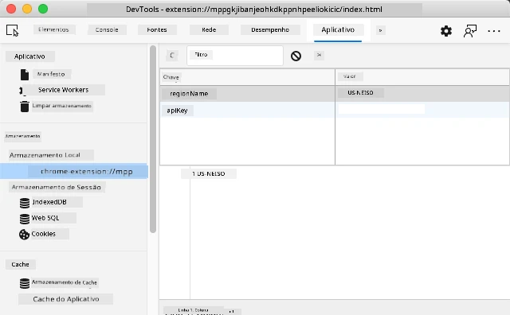
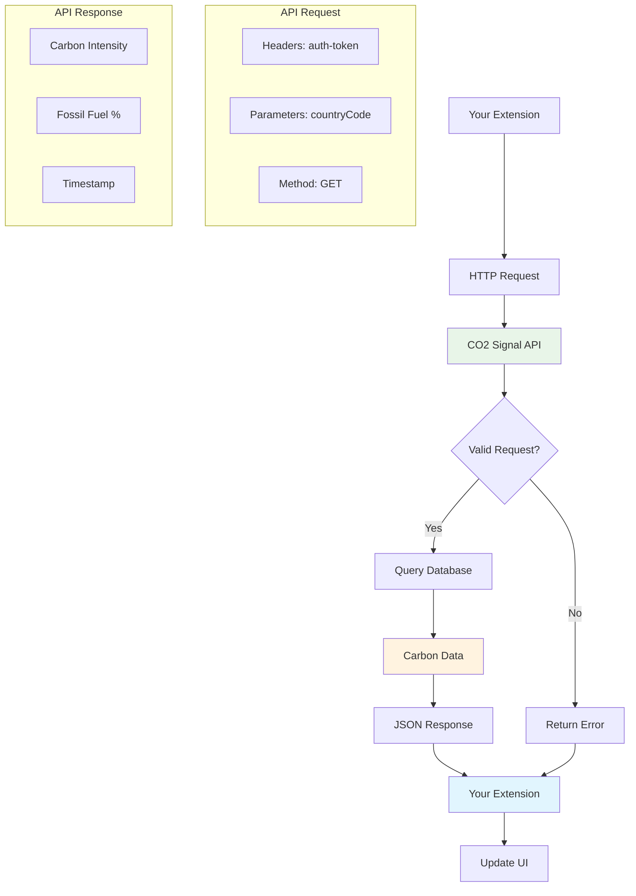
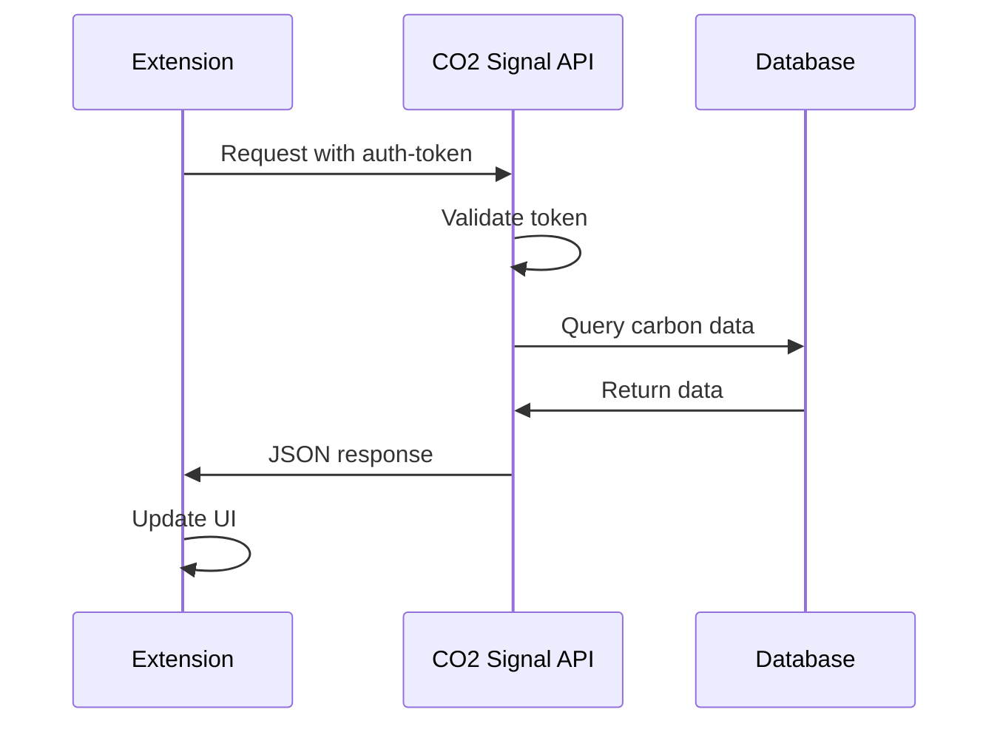
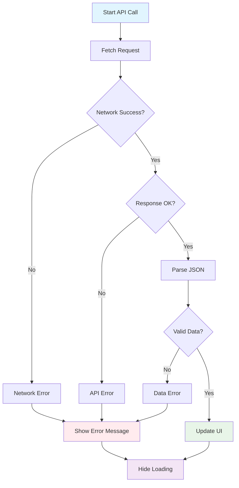
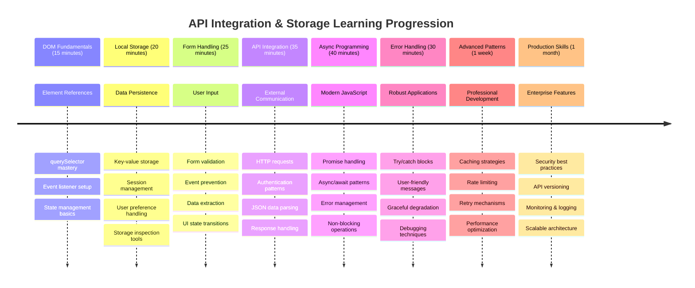

<!--
CO_OP_TRANSLATOR_METADATA:
{
  "original_hash": "2b6203a48c48d8234e0948353b47d84e",
  "translation_date": "2025-11-04T00:16:46+00:00",
  "source_file": "5-browser-extension/2-forms-browsers-local-storage/README.md",
  "language_code": "br"
}
-->
# Projeto de Extensão de Navegador Parte 2: Chamar uma API, usar Armazenamento Local



## Quiz Pré-Aula

[Quiz pré-aula](https://ff-quizzes.netlify.app/web/quiz/25)

## Introdução

Lembra daquela extensão de navegador que você começou a construir? No momento, você tem um formulário bonito, mas ele é essencialmente estático. Hoje vamos dar vida a ele conectando-o a dados reais e dando-lhe memória.

Pense nos computadores de controle da missão Apollo - eles não exibiam apenas informações fixas. Eles se comunicavam constantemente com a espaçonave, atualizavam dados de telemetria e lembravam parâmetros críticos da missão. Esse é o tipo de comportamento dinâmico que estamos construindo hoje. Sua extensão vai acessar a internet, buscar dados ambientais reais e lembrar suas configurações para a próxima vez.

A integração com APIs pode parecer complexa, mas é basicamente ensinar seu código a se comunicar com outros serviços. Seja buscando dados meteorológicos, feeds de redes sociais ou informações sobre pegada de carbono, como faremos hoje, tudo se resume a estabelecer essas conexões digitais. Também exploraremos como os navegadores podem armazenar informações - semelhante a como bibliotecas usavam catálogos de fichas para lembrar onde os livros pertencem.

Ao final desta aula, você terá uma extensão de navegador que busca dados reais, armazena preferências do usuário e oferece uma experiência suave. Vamos começar!



✅ Siga os segmentos numerados nos arquivos apropriados para saber onde colocar seu código

## Configurar os elementos para manipular na extensão

Antes que seu JavaScript possa manipular a interface, ele precisa de referências a elementos HTML específicos. Pense nisso como um telescópio que precisa ser apontado para estrelas específicas - antes de Galileu estudar as luas de Júpiter, ele teve que localizar e focar em Júpiter.

No seu arquivo `index.js`, vamos criar variáveis `const` que capturam referências a cada elemento importante do formulário. Isso é semelhante a como os cientistas rotulam seus equipamentos - em vez de procurar por todo o laboratório cada vez, eles podem acessar diretamente o que precisam.



```javascript
// form fields
const form = document.querySelector('.form-data');
const region = document.querySelector('.region-name');
const apiKey = document.querySelector('.api-key');

// results
const errors = document.querySelector('.errors');
const loading = document.querySelector('.loading');
const results = document.querySelector('.result-container');
const usage = document.querySelector('.carbon-usage');
const fossilfuel = document.querySelector('.fossil-fuel');
const myregion = document.querySelector('.my-region');
const clearBtn = document.querySelector('.clear-btn');
```

**O que este código faz:**
- **Captura** elementos do formulário usando `document.querySelector()` com seletores de classe CSS
- **Cria** referências para os campos de entrada do nome da região e chave da API
- **Estabelece** conexões com elementos de exibição de resultados para dados de uso de carbono
- **Configura** acesso a elementos da interface como indicadores de carregamento e mensagens de erro
- **Armazena** cada referência de elemento em uma variável `const` para fácil reutilização ao longo do código

## Adicionar ouvintes de eventos

Agora vamos fazer sua extensão responder às ações do usuário. Ouvintes de eventos são a forma como seu código monitora interações do usuário. Pense neles como os operadores nas antigas centrais telefônicas - eles ouviam chamadas recebidas e conectavam os circuitos certos quando alguém queria fazer uma conexão.



```javascript
form.addEventListener('submit', (e) => handleSubmit(e));
clearBtn.addEventListener('click', (e) => reset(e));
init();
```

**Entendendo esses conceitos:**
- **Anexa** um ouvinte de envio ao formulário que é acionado quando os usuários pressionam Enter ou clicam em enviar
- **Conecta** um ouvinte de clique ao botão de limpar para redefinir o formulário
- **Passa** o objeto de evento `(e)` para funções manipuladoras para controle adicional
- **Chama** a função `init()` imediatamente para configurar o estado inicial da sua extensão

✅ Observe a sintaxe abreviada de função arrow usada aqui. Essa abordagem moderna do JavaScript é mais limpa do que expressões de função tradicionais, mas ambas funcionam igualmente bem!

### 🔄 **Verificação Pedagógica**
**Entendimento de Manipulação de Eventos**: Antes de passar para a inicialização, certifique-se de que você pode:
- ✅ Explicar como `addEventListener` conecta ações do usuário a funções JavaScript
- ✅ Entender por que passamos o objeto de evento `(e)` para funções manipuladoras
- ✅ Reconhecer a diferença entre eventos `submit` e `click`
- ✅ Descrever quando a função `init()` é executada e por que

**Teste Rápido**: O que aconteceria se você esquecesse `e.preventDefault()` em um envio de formulário?
*Resposta: A página seria recarregada, perdendo todo o estado do JavaScript e interrompendo a experiência do usuário*

## Construir as funções de inicialização e redefinição

Vamos criar a lógica de inicialização para sua extensão. A função `init()` é como o sistema de navegação de um navio verificando seus instrumentos - ela determina o estado atual e ajusta a interface de acordo. Ela verifica se alguém já usou sua extensão antes e carrega suas configurações anteriores.

A função `reset()` oferece aos usuários um novo começo - semelhante a como os cientistas reiniciam seus instrumentos entre experimentos para garantir dados limpos.

```javascript
function init() {
	// Check if user has previously saved API credentials
	const storedApiKey = localStorage.getItem('apiKey');
	const storedRegion = localStorage.getItem('regionName');

	// Set extension icon to generic green (placeholder for future lesson)
	// TODO: Implement icon update in next lesson

	if (storedApiKey === null || storedRegion === null) {
		// First-time user: show the setup form
		form.style.display = 'block';
		results.style.display = 'none';
		loading.style.display = 'none';
		clearBtn.style.display = 'none';
		errors.textContent = '';
	} else {
		// Returning user: load their saved data automatically
		displayCarbonUsage(storedApiKey, storedRegion);
		results.style.display = 'none';
		form.style.display = 'none';
		clearBtn.style.display = 'block';
	}
}

function reset(e) {
	e.preventDefault();
	// Clear stored region to allow user to choose a new location
	localStorage.removeItem('regionName');
	// Restart the initialization process
	init();
}
```

**Desmembrando o que acontece aqui:**
- **Recupera** a chave da API e a região armazenadas no armazenamento local do navegador
- **Verifica** se este é um usuário de primeira vez (sem credenciais armazenadas) ou um usuário recorrente
- **Exibe** o formulário de configuração para novos usuários e oculta outros elementos da interface
- **Carrega** automaticamente os dados salvos para usuários recorrentes e exibe a opção de redefinição
- **Gerencia** o estado da interface do usuário com base nos dados disponíveis

**Conceitos-chave sobre Armazenamento Local:**
- **Persiste** dados entre sessões do navegador (diferente do armazenamento de sessão)
- **Armazena** dados como pares chave-valor usando `getItem()` e `setItem()`
- **Retorna** `null` quando não existem dados para uma chave específica
- **Fornece** uma maneira simples de lembrar preferências e configurações do usuário

> 💡 **Entendendo o Armazenamento do Navegador**: [LocalStorage](https://developer.mozilla.org/docs/Web/API/Window/localStorage) é como dar à sua extensão uma memória persistente. Considere como a antiga Biblioteca de Alexandria armazenava pergaminhos - as informações permaneciam disponíveis mesmo quando os estudiosos saíam e voltavam.
>
> **Características principais:**
> - **Persiste** dados mesmo após fechar o navegador
> - **Sobrevive** a reinicializações do computador e falhas do navegador
> - **Oferece** espaço de armazenamento substancial para preferências do usuário
> - **Proporciona** acesso instantâneo sem atrasos de rede

> **Nota Importante**: Sua extensão de navegador tem seu próprio armazenamento local isolado, separado das páginas da web regulares. Isso proporciona segurança e evita conflitos com outros sites.

Você pode visualizar seus dados armazenados abrindo as Ferramentas de Desenvolvedor do navegador (F12), navegando até a aba **Application** e expandindo a seção **Local Storage**.





> ⚠️ **Consideração de Segurança**: Em aplicativos de produção, armazenar chaves de API no LocalStorage apresenta riscos de segurança, já que o JavaScript pode acessar esses dados. Para fins de aprendizado, essa abordagem funciona bem, mas aplicativos reais devem usar armazenamento seguro no servidor para credenciais sensíveis.

## Lidar com o envio do formulário

Agora vamos lidar com o que acontece quando alguém envia seu formulário. Por padrão, os navegadores recarregam a página quando os formulários são enviados, mas vamos interceptar esse comportamento para criar uma experiência mais suave.

Essa abordagem reflete como o controle da missão lida com as comunicações da espaçonave - em vez de reiniciar todo o sistema para cada transmissão, eles mantêm a operação contínua enquanto processam novas informações.

Crie uma função que capture o evento de envio do formulário e extraia as entradas do usuário:

```javascript
function handleSubmit(e) {
	e.preventDefault();
	setUpUser(apiKey.value, region.value);
}
```

**No código acima, nós:**
- **Evitamos** o comportamento padrão de envio do formulário que atualizaria a página
- **Extraímos** os valores de entrada do usuário dos campos de chave da API e região
- **Passamos** os dados do formulário para a função `setUpUser()` para processamento
- **Mantemos** o comportamento de aplicação de página única evitando recarregamentos

✅ Lembre-se de que os campos do formulário HTML incluem o atributo `required`, então o navegador valida automaticamente que os usuários forneçam tanto a chave da API quanto a região antes que esta função seja executada.

## Configurar preferências do usuário

A função `setUpUser` é responsável por salvar as credenciais do usuário e iniciar a primeira chamada à API. Isso cria uma transição suave da configuração para a exibição dos resultados.

```javascript
function setUpUser(apiKey, regionName) {
	// Save user credentials for future sessions
	localStorage.setItem('apiKey', apiKey);
	localStorage.setItem('regionName', regionName);
	
	// Update UI to show loading state
	loading.style.display = 'block';
	errors.textContent = '';
	clearBtn.style.display = 'block';
	
	// Fetch carbon usage data with user's credentials
	displayCarbonUsage(apiKey, regionName);
}
```

**Passo a passo, aqui está o que acontece:**
- **Salva** a chave da API e o nome da região no armazenamento local para uso futuro
- **Exibe** um indicador de carregamento para informar aos usuários que os dados estão sendo buscados
- **Limpa** quaisquer mensagens de erro anteriores da exibição
- **Revela** o botão de limpar para que os usuários possam redefinir suas configurações mais tarde
- **Inicia** a chamada à API para buscar dados reais de uso de carbono

Esta função cria uma experiência de usuário perfeita ao gerenciar tanto a persistência de dados quanto as atualizações da interface do usuário em uma ação coordenada.

## Exibir dados de uso de carbono

Agora vamos conectar sua extensão a fontes de dados externas por meio de APIs. Isso transforma sua extensão de uma ferramenta independente em algo que pode acessar informações em tempo real de toda a internet.

**Entendendo APIs**

[APIs](https://www.webopedia.com/TERM/A/API.html) são como diferentes aplicativos se comunicam entre si. Pense nelas como o sistema de telégrafo que conectava cidades distantes no século XIX - os operadores enviavam solicitações para estações distantes e recebiam respostas com as informações solicitadas. Toda vez que você verifica redes sociais, faz uma pergunta a um assistente de voz ou usa um aplicativo de entrega, as APIs estão facilitando essas trocas de dados.



**Conceitos-chave sobre APIs REST:**
- **REST** significa 'Transferência de Estado Representacional'
- **Utiliza** métodos HTTP padrão (GET, POST, PUT, DELETE) para interagir com dados
- **Retorna** dados em formatos previsíveis, geralmente JSON
- **Fornece** endpoints consistentes baseados em URL para diferentes tipos de solicitações

✅ A [API CO2 Signal](https://www.co2signal.com/) que usaremos fornece dados em tempo real sobre a intensidade de carbono das redes elétricas em todo o mundo. Isso ajuda os usuários a entender o impacto ambiental do uso de eletricidade!

> 💡 **Entendendo JavaScript Assíncrono**: A palavra-chave [`async`](https://developer.mozilla.org/docs/Web/JavaScript/Reference/Statements/async_function) permite que seu código lide com várias operações simultaneamente. Quando você solicita dados de um servidor, não quer que toda sua extensão congele - isso seria como o controle de tráfego aéreo parando todas as operações enquanto espera por uma resposta de um avião.
>
> **Principais benefícios:**
> - **Mantém** a responsividade da extensão enquanto os dados são carregados
> - **Permite** que outros códigos continuem sendo executados durante solicitações de rede
> - **Melhora** a legibilidade do código em comparação com padrões tradicionais de callback
> - **Habilita** tratamento de erros de rede de forma elegante

Aqui está um vídeo rápido sobre `async`:

[](https://youtube.com/watch?v=YwmlRkrxvkk "Async e Await para gerenciar promessas")

> 🎥 Clique na imagem acima para um vídeo sobre async/await.

### 🔄 **Verificação Pedagógica**
**Entendimento de Programação Assíncrona**: Antes de mergulhar na função da API, verifique se você entende:
- ✅ Por que usamos `async/await` em vez de bloquear toda a extensão
- ✅ Como blocos `try/catch` lidam com erros de rede de forma elegante
- ✅ A diferença entre operações síncronas e assíncronas
- ✅ Por que chamadas de API podem falhar e como lidar com essas falhas

**Conexão com o Mundo Real**: Considere esses exemplos assíncronos do dia a dia:
- **Pedindo comida**: Você não espera na cozinha - recebe um recibo e continua outras atividades
- **Enviando e-mails**: Seu aplicativo de e-mail não congela enquanto envia - você pode compor mais e-mails
- **Carregando páginas da web**: Imagens carregam progressivamente enquanto você já pode ler o texto

**Fluxo de Autenticação da API**:


Crie a função para buscar e exibir dados de uso de carbono:

```javascript
// Modern fetch API approach (no external dependencies needed)
async function displayCarbonUsage(apiKey, region) {
	try {
		// Fetch carbon intensity data from CO2 Signal API
		const response = await fetch('https://api.co2signal.com/v1/latest', {
			method: 'GET',
			headers: {
				'auth-token': apiKey,
				'Content-Type': 'application/json'
			},
			// Add query parameters for the specific region
			...new URLSearchParams({ countryCode: region }) && {
				url: `https://api.co2signal.com/v1/latest?countryCode=${region}`
			}
		});

		// Check if the API request was successful
		if (!response.ok) {
			throw new Error(`API request failed: ${response.status}`);
		}

		const data = await response.json();
		const carbonData = data.data;

		// Calculate rounded carbon intensity value
		const carbonIntensity = Math.round(carbonData.carbonIntensity);

		// Update the user interface with fetched data
		loading.style.display = 'none';
		form.style.display = 'none';
		myregion.textContent = region.toUpperCase();
		usage.textContent = `${carbonIntensity} grams (grams CO₂ emitted per kilowatt hour)`;
		fossilfuel.textContent = `${carbonData.fossilFuelPercentage.toFixed(2)}% (percentage of fossil fuels used to generate electricity)`;
		results.style.display = 'block';

		// TODO: calculateColor(carbonIntensity) - implement in next lesson

	} catch (error) {
		console.error('Error fetching carbon data:', error);
		
		// Show user-friendly error message
		loading.style.display = 'none';
		results.style.display = 'none';
		errors.textContent = 'Sorry, we couldn\'t fetch data for that region. Please check your API key and region code.';
	}
}
```

**Desmembrando o que acontece aqui:**
- **Utiliza** a moderna API `fetch()` em vez de bibliotecas externas como Axios para um código mais limpo e sem dependências
- **Implementa** verificação de erros adequada com `response.ok` para capturar falhas na API cedo
- **Lida** com operações assíncronas usando `async/await` para um fluxo de código mais legível
- **Autentica** com a API CO2 Signal usando o cabeçalho `auth-token`
- **Analisa** dados de resposta JSON e extrai informações de intensidade de carbono
- **Atualiza** vários elementos da interface com dados ambientais formatados
- **Fornece** mensagens de erro amigáveis ao usuário quando as chamadas à API falham

**Conceitos modernos de JavaScript demonstrados:**
- **Literais de template** com a sintaxe `${}` para formatação de strings limpa
- **Tratamento de erros** com blocos try/catch para aplicativos robustos
- **Padrão async/await** para lidar com solicitações de rede de forma elegante
- **Desestruturação de objetos** para extrair dados específicos de respostas da API
- **Encadeamento de métodos** para múltiplas manipulações do DOM

✅ Esta função demonstra vários conceitos importantes de desenvolvimento web - comunicação com servidores externos, tratamento de autenticação, processamento de dados, atualização de interfaces e gerenciamento de erros de forma elegante. Estas são habilidades fundamentais que desenvolvedores profissionais utilizam regularmente.



### 🔄 **Verificação Pedagógica**
**Entendimento Completo do Sistema**: Verifique sua compreensão de todo o fluxo:
- ✅ Como referências do DOM permitem que o JavaScript controle a interface
- ✅ Por que o armazenamento local cria persistência entre sessões do navegador
- ✅ Como async/await realiza chamadas de API sem congelar a extensão
- ✅ O que acontece quando chamadas de API falham e como os erros são tratados
- ✅ Por que a experiência do usuário inclui estados de carregamento e mensagens de erro

🎉 **O que você alcançou:** Você criou uma extensão de navegador que:
- **Conecta-se** à internet e recupera dados ambientais reais
- **Persiste** configurações do usuário entre sessões
- **Lida** com erros de forma elegante em vez de travar
- **Proporciona** uma experiência de usuário suave e profissional

Teste seu trabalho executando `npm run build` e atualizando sua extensão no navegador. Agora você tem um rastreador funcional de pegada de carbono. A próxima aula adicionará funcionalidade dinâmica de ícones para completar a extensão.

---

## Desafio do Agente GitHub Copilot 🚀

Use o modo Agente para completar o seguinte desafio:
**Descrição:** Melhore a extensão do navegador adicionando melhorias no tratamento de erros e recursos de experiência do usuário. Este desafio ajudará você a praticar o trabalho com APIs, armazenamento local e manipulação do DOM usando padrões modernos de JavaScript.

**Tarefa:** Crie uma versão aprimorada da função displayCarbonUsage que inclua: 1) Um mecanismo de repetição para chamadas de API falhas com backoff exponencial, 2) Validação de entrada para o código da região antes de fazer a chamada de API, 3) Uma animação de carregamento com indicadores de progresso, 4) Cache das respostas da API no localStorage com timestamps de expiração (cache por 30 minutos), e 5) Um recurso para exibir dados históricos de chamadas anteriores da API. Além disso, adicione comentários JSDoc no estilo TypeScript para documentar todos os parâmetros da função e tipos de retorno.

Saiba mais sobre [modo agente](https://code.visualstudio.com/blogs/2025/02/24/introducing-copilot-agent-mode) aqui.

## 🚀 Desafio

Expanda seu entendimento sobre APIs explorando a riqueza de APIs baseadas em navegador disponíveis para desenvolvimento web. Escolha uma dessas APIs de navegador e construa uma pequena demonstração:

- [Geolocation API](https://developer.mozilla.org/docs/Web/API/Geolocation_API) - Obtenha a localização atual do usuário
- [Notification API](https://developer.mozilla.org/docs/Web/API/Notifications_API) - Envie notificações na área de trabalho
- [HTML Drag and Drop API](https://developer.mozilla.org/docs/Web/API/HTML_Drag_and_Drop_API) - Crie interfaces interativas de arrastar e soltar
- [Web Storage API](https://developer.mozilla.org/docs/Web/API/Web_Storage_API) - Técnicas avançadas de armazenamento local
- [Fetch API](https://developer.mozilla.org/docs/Web/API/Fetch_API) - Alternativa moderna ao XMLHttpRequest

**Perguntas de pesquisa para considerar:**
- Quais problemas do mundo real essa API resolve?
- Como a API lida com erros e casos extremos?
- Quais considerações de segurança existem ao usar essa API?
- Qual é o nível de suporte dessa API em diferentes navegadores?

Após sua pesquisa, identifique quais características tornam uma API amigável para desenvolvedores e confiável.

## Quiz Pós-Aula

[Quiz pós-aula](https://ff-quizzes.netlify.app/web/quiz/26)

## Revisão & Autoestudo

Você aprendeu sobre LocalStorage e APIs nesta aula, ambos muito úteis para o desenvolvedor web profissional. Você consegue pensar em como essas duas coisas funcionam juntas? Pense em como você arquitetaria um site que armazenaria itens para serem usados por uma API.

### ⚡ **O que você pode fazer nos próximos 5 minutos**
- [ ] Abra a aba Application no DevTools e explore o localStorage em qualquer site
- [ ] Crie um formulário HTML simples e teste a validação de formulário no navegador
- [ ] Experimente armazenar e recuperar dados usando localStorage no console do navegador
- [ ] Inspecione os dados do formulário sendo enviados usando a aba Network

### 🎯 **O que você pode realizar nesta hora**
- [ ] Complete o quiz pós-aula e entenda os conceitos de manipulação de formulários
- [ ] Construa um formulário de extensão de navegador que salva preferências do usuário
- [ ] Implemente validação de formulário no lado do cliente com mensagens de erro úteis
- [ ] Pratique usando a API chrome.storage para persistência de dados em extensões
- [ ] Crie uma interface de usuário que responde às configurações salvas do usuário

### 📅 **Construção de Extensão ao Longo da Semana**
- [ ] Complete uma extensão de navegador com funcionalidade de formulário
- [ ] Domine diferentes opções de armazenamento: local, sync e session storage
- [ ] Implemente recursos avançados de formulário como autocompletar e validação
- [ ] Adicione funcionalidade de importação/exportação para dados do usuário
- [ ] Teste sua extensão minuciosamente em diferentes navegadores
- [ ] Aperfeiçoe a experiência do usuário e o tratamento de erros da extensão

### 🌟 **Domínio de APIs Web ao Longo do Mês**
- [ ] Construa aplicações complexas usando várias APIs de armazenamento do navegador
- [ ] Aprenda sobre padrões de desenvolvimento offline-first
- [ ] Contribua para projetos de código aberto envolvendo persistência de dados
- [ ] Domine o desenvolvimento focado em privacidade e conformidade com GDPR
- [ ] Crie bibliotecas reutilizáveis para manipulação de formulários e gerenciamento de dados
- [ ] Compartilhe conhecimento sobre APIs web e desenvolvimento de extensões

## 🎯 Cronograma de Domínio do Desenvolvimento de Extensões



### 🛠️ Resumo do Kit de Ferramentas de Desenvolvimento Full-Stack

Após completar esta aula, você agora tem:
- **Domínio do DOM**: Manipulação e direcionamento preciso de elementos
- **Expertise em Armazenamento**: Gerenciamento de dados persistentes com localStorage
- **Integração de APIs**: Busca de dados em tempo real e autenticação
- **Programação Assíncrona**: Operações não bloqueantes com JavaScript moderno
- **Tratamento de Erros**: Aplicações robustas que lidam graciosamente com falhas
- **Experiência do Usuário**: Estados de carregamento, validação e interações suaves
- **Padrões Modernos**: fetch API, async/await e recursos do ES6+

**Habilidades Profissionais Adquiridas**: Você implementou padrões usados em:
- **Aplicações Web**: Apps de página única com fontes de dados externas
- **Desenvolvimento Mobile**: Apps baseados em API com capacidades offline
- **Software de Desktop**: Apps Electron com armazenamento persistente
- **Sistemas Empresariais**: Autenticação, cache e tratamento de erros
- **Frameworks Modernos**: Padrões de gerenciamento de dados em React/Vue/Angular

**Próximo Nível**: Você está pronto para explorar tópicos avançados como estratégias de cache, conexões WebSocket em tempo real ou gerenciamento de estado complexo!

## Tarefa

[Adote uma API](assignment.md)

---

**Aviso Legal**:  
Este documento foi traduzido utilizando o serviço de tradução por IA [Co-op Translator](https://github.com/Azure/co-op-translator). Embora nos esforcemos para garantir a precisão, esteja ciente de que traduções automáticas podem conter erros ou imprecisões. O documento original em seu idioma nativo deve ser considerado a fonte autoritativa. Para informações críticas, recomenda-se a tradução profissional humana. Não nos responsabilizamos por quaisquer mal-entendidos ou interpretações incorretas decorrentes do uso desta tradução.