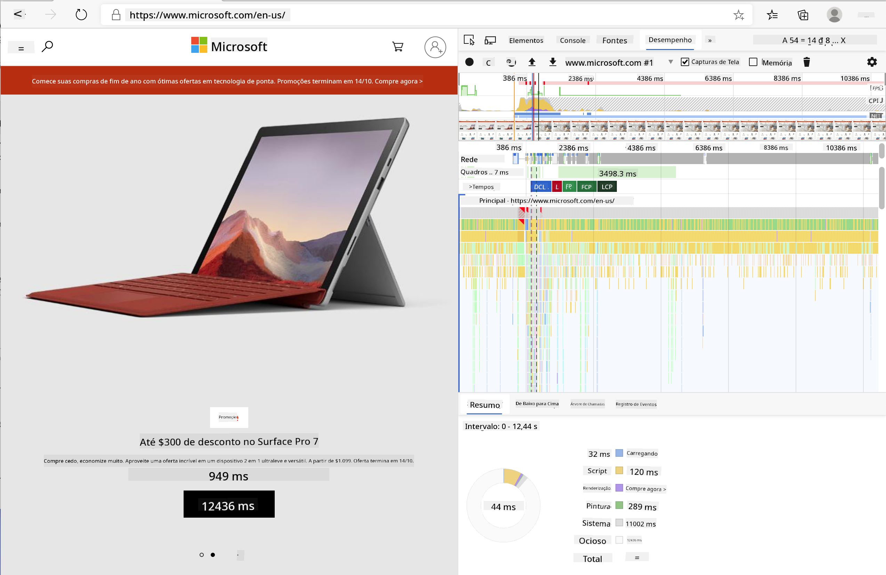
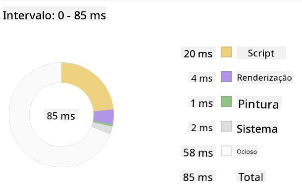
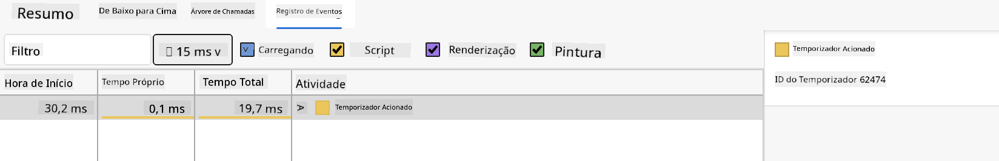

<!--
CO_OP_TRANSLATOR_METADATA:
{
  "original_hash": "b91cbf14240ee59411b96448b994ace1",
  "translation_date": "2025-10-03T12:22:26+00:00",
  "source_file": "5-browser-extension/3-background-tasks-and-performance/README.md",
  "language_code": "br"
}
-->
# Projeto de Extensão de Navegador Parte 3: Aprenda sobre Tarefas em Segundo Plano e Desempenho

## Quiz Pré-Aula

[Quiz pré-aula](https://ff-quizzes.netlify.app/web/quiz/27)

### Introdução

Nas duas últimas lições deste módulo, você aprendeu como criar um formulário e uma área de exibição para dados obtidos de uma API. É uma maneira bastante padrão de criar uma presença na web. Você até aprendeu como lidar com a obtenção de dados de forma assíncrona. Sua extensão de navegador está quase completa.

Resta gerenciar algumas tarefas em segundo plano, incluindo atualizar a cor do ícone da extensão. Este é um ótimo momento para falar sobre como o navegador gerencia esse tipo de tarefa. Vamos pensar nessas tarefas do navegador no contexto do desempenho dos seus ativos web enquanto você os desenvolve.

## Noções Básicas de Desempenho na Web

> "O desempenho de um site se resume a duas coisas: quão rápido a página carrega e quão rápido o código nela é executado." -- [Zack Grossbart](https://www.smashingmagazine.com/2012/06/javascript-profiling-chrome-developer-tools/)

O tema de como tornar seus sites incrivelmente rápidos em todos os tipos de dispositivos, para todos os tipos de usuários, em todas as situações, é, sem surpresa, vasto. Aqui estão alguns pontos a serem lembrados enquanto você desenvolve um projeto web padrão ou uma extensão de navegador.

A primeira coisa que você precisa fazer para garantir que seu site esteja funcionando de forma eficiente é coletar dados sobre seu desempenho. O primeiro lugar para fazer isso é nas ferramentas de desenvolvedor do seu navegador. No Edge, você pode selecionar o botão "Configurações e mais" (o ícone de três pontos no canto superior direito do navegador), navegar até Mais Ferramentas > Ferramentas de Desenvolvedor e abrir a aba de Desempenho. Você também pode usar os atalhos de teclado `Ctrl` + `Shift` + `I` no Windows ou `Option` + `Command` + `I` no Mac para abrir as ferramentas de desenvolvedor.

A aba de Desempenho contém uma ferramenta de Perfil. Abra um site (experimente, por exemplo, [https://www.microsoft.com](https://www.microsoft.com/?WT.mc_id=academic-77807-sagibbon)) e clique no botão 'Gravar', depois atualize o site. Pare a gravação a qualquer momento, e você poderá ver as rotinas geradas para 'script', 'renderizar' e 'pintar' o site:



✅ Visite a [Documentação da Microsoft](https://docs.microsoft.com/microsoft-edge/devtools-guide/performance/?WT.mc_id=academic-77807-sagibbon) sobre o painel de Desempenho no Edge.

> Dica: para obter uma leitura precisa do tempo de inicialização do seu site, limpe o cache do navegador.

Selecione elementos da linha do tempo do perfil para ampliar os eventos que ocorrem enquanto sua página carrega.

Obtenha um instantâneo do desempenho da sua página selecionando uma parte da linha do tempo do perfil e olhando para o painel de resumo:



Verifique o painel de Log de Eventos para ver se algum evento levou mais de 15 ms:



✅ Conheça seu profiler! Abra as ferramentas de desenvolvedor neste site e veja se há algum gargalo. Qual é o ativo que carrega mais lentamente? E o mais rápido?

## Verificações de Perfil

Em geral, há algumas "áreas problemáticas" que todo desenvolvedor web deve observar ao construir um site para evitar surpresas desagradáveis na hora de implantar em produção.

**Tamanhos de ativos**: A web ficou mais 'pesada' e, portanto, mais lenta nos últimos anos. Parte desse peso tem a ver com o uso de imagens.

✅ Explore o [Internet Archive](https://httparchive.org/reports/page-weight) para uma visão histórica do peso das páginas e mais.

Uma boa prática é garantir que suas imagens sejam otimizadas e entregues no tamanho e resolução certos para seus usuários.

**Percursos no DOM**: O navegador precisa construir seu Modelo de Objeto de Documento (DOM) com base no código que você escreve, então é do interesse de um bom desempenho da página manter suas tags mínimas, usando e estilizando apenas o que a página precisa. Nesse sentido, CSS excessivo associado a uma página pode ser otimizado; estilos que precisam ser usados apenas em uma página não precisam ser incluídos na folha de estilo principal, por exemplo.

**JavaScript**: Todo desenvolvedor de JavaScript deve observar scripts que bloqueiam a renderização e que precisam ser carregados antes que o restante do DOM possa ser percorrido e pintado no navegador. Considere usar `defer` com seus scripts inline (como é feito no módulo Terrarium).

✅ Experimente alguns sites em um [site de teste de velocidade](https://www.webpagetest.org/) para aprender mais sobre as verificações comuns feitas para determinar o desempenho do site.

Agora que você tem uma ideia de como o navegador renderiza os ativos que você envia para ele, vamos olhar para as últimas coisas que você precisa fazer para completar sua extensão:

### Criar uma função para calcular a cor

Trabalhando em `/src/index.js`, adicione uma função chamada `calculateColor()` após a série de variáveis `const` que você configurou para acessar o DOM:

```JavaScript
function calculateColor(value) {
	let co2Scale = [0, 150, 600, 750, 800];
	let colors = ['#2AA364', '#F5EB4D', '#9E4229', '#381D02', '#381D02'];

	let closestNum = co2Scale.sort((a, b) => {
		return Math.abs(a - value) - Math.abs(b - value);
	})[0];
	console.log(value + ' is closest to ' + closestNum);
	let num = (element) => element > closestNum;
	let scaleIndex = co2Scale.findIndex(num);

	let closestColor = colors[scaleIndex];
	console.log(scaleIndex, closestColor);

	chrome.runtime.sendMessage({ action: 'updateIcon', value: { color: closestColor } });
}
```

O que está acontecendo aqui? Você passa um valor (a intensidade de carbono) da chamada de API que você completou na última lição e, em seguida, calcula quão próximo seu valor está do índice apresentado no array de cores. Depois, você envia esse valor de cor mais próximo para o runtime do Chrome.

O chrome.runtime tem [uma API](https://developer.chrome.com/extensions/runtime) que lida com todos os tipos de tarefas em segundo plano, e sua extensão está aproveitando isso:

> "Use a API chrome.runtime para recuperar a página de segundo plano, retornar detalhes sobre o manifesto e ouvir e responder a eventos no ciclo de vida do aplicativo ou extensão. Você também pode usar essa API para converter o caminho relativo de URLs em URLs totalmente qualificados."

✅ Se você está desenvolvendo esta extensão de navegador para o Edge, pode se surpreender ao saber que está usando uma API do Chrome. As versões mais recentes do navegador Edge funcionam no mecanismo de navegador Chromium, então você pode aproveitar essas ferramentas.

> Nota: se você quiser fazer o perfil de uma extensão de navegador, abra as ferramentas de desenvolvedor dentro da própria extensão, pois ela é uma instância separada do navegador.

### Definir uma cor padrão para o ícone

Agora, na função `init()`, defina o ícone para ser um verde genérico inicialmente, chamando novamente a ação `updateIcon` do Chrome:

```JavaScript
chrome.runtime.sendMessage({
	action: 'updateIcon',
		value: {
			color: 'green',
		},
});
```

### Chamar a função, executar a chamada

Em seguida, chame a função que você acabou de criar adicionando-a à promessa retornada pela API C02Signal:

```JavaScript
//let CO2...
calculateColor(CO2);
```

E, finalmente, em `/dist/background.js`, adicione o listener para essas chamadas de ação em segundo plano:

```JavaScript
chrome.runtime.onMessage.addListener(function (msg, sender, sendResponse) {
	if (msg.action === 'updateIcon') {
		chrome.action.setIcon({ imageData: drawIcon(msg.value) });
	}
});
//borrowed from energy lollipop extension, nice feature!
function drawIcon(value) {
	let canvas = new OffscreenCanvas(200, 200);
	let context = canvas.getContext('2d');

	context.beginPath();
	context.fillStyle = value.color;
	context.arc(100, 100, 50, 0, 2 * Math.PI);
	context.fill();

	return context.getImageData(50, 50, 100, 100);
}
```

Neste código, você está adicionando um listener para quaisquer mensagens que chegam ao gerenciador de tarefas em segundo plano. Se for chamado 'updateIcon', o próximo código será executado para desenhar um ícone da cor apropriada usando a API Canvas.

✅ Você aprenderá mais sobre a API Canvas nas [lições do Jogo Espacial](../../6-space-game/2-drawing-to-canvas/README.md).

Agora, reconstrua sua extensão (`npm run build`), atualize e inicie sua extensão, e observe a mudança de cor. É um bom momento para fazer uma tarefa ou lavar a louça? Agora você sabe!

Parabéns, você construiu uma extensão de navegador útil e aprendeu mais sobre como o navegador funciona e como fazer o perfil de seu desempenho.

---

## 🚀 Desafio

Investigue alguns sites de código aberto que existem há muito tempo e, com base no histórico do GitHub deles, veja se você consegue determinar como eles foram otimizados ao longo dos anos para desempenho, se é que foram. Qual é o ponto problemático mais comum?

## Quiz Pós-Aula

[Quiz pós-aula](https://ff-quizzes.netlify.app/web/quiz/28)

## Revisão e Autoestudo

Considere se inscrever em um [newsletter de desempenho](https://perf.email/)

Investigue algumas das maneiras como os navegadores avaliam o desempenho da web, olhando as abas de desempenho em suas ferramentas web. Você encontra alguma diferença significativa?

## Tarefa

[Analise um site para desempenho](assignment.md)

---

**Aviso Legal**:  
Este documento foi traduzido utilizando o serviço de tradução por IA [Co-op Translator](https://github.com/Azure/co-op-translator). Embora nos esforcemos para garantir a precisão, esteja ciente de que traduções automáticas podem conter erros ou imprecisões. O documento original em seu idioma nativo deve ser considerado a fonte autoritativa. Para informações críticas, recomenda-se a tradução profissional realizada por humanos. Não nos responsabilizamos por quaisquer mal-entendidos ou interpretações equivocadas decorrentes do uso desta tradução.