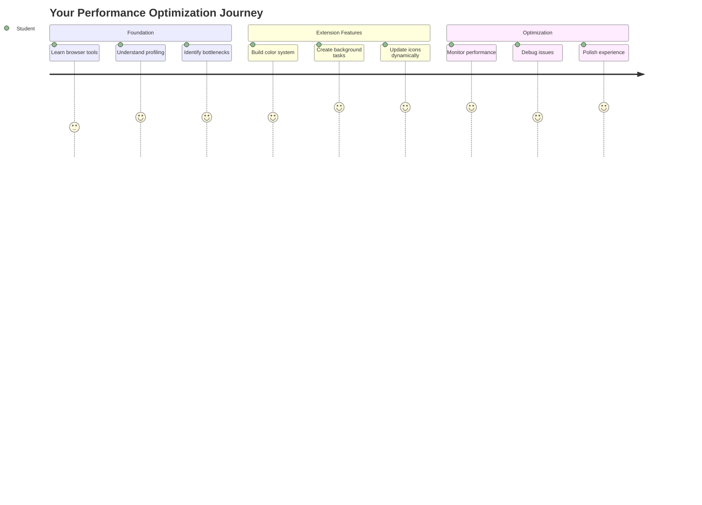
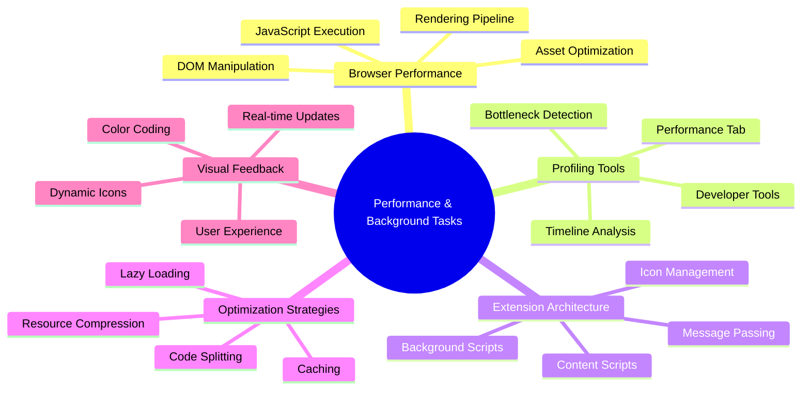
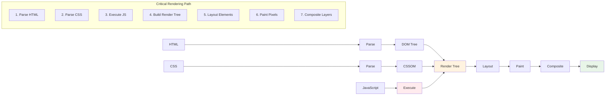
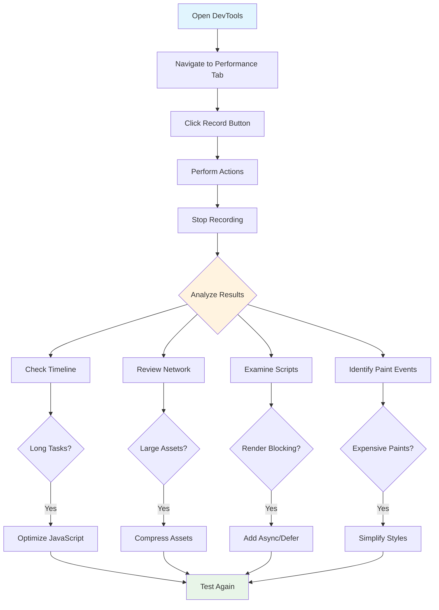
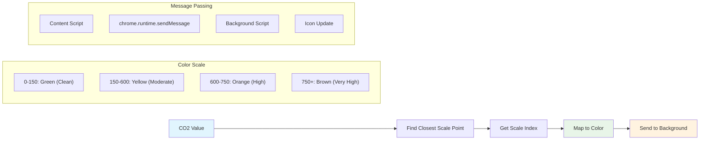
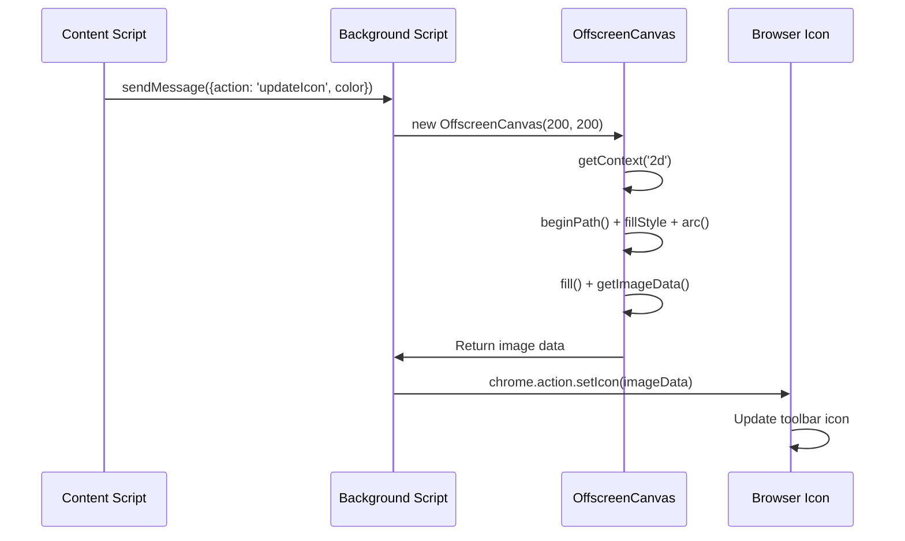
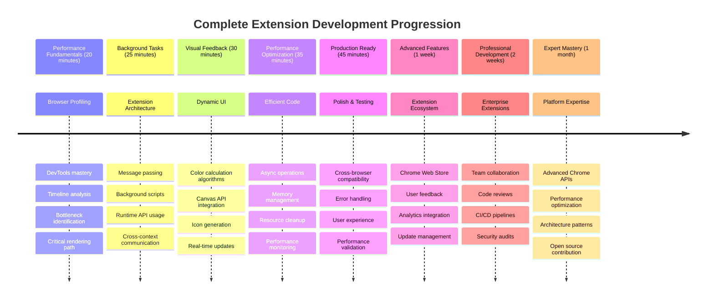

<!--
CO_OP_TRANSLATOR_METADATA:
{
  "original_hash": "b275fed2c6fc90d2b9b6661a3225faa2",
  "translation_date": "2025-11-04T00:16:11+00:00",
  "source_file": "5-browser-extension/3-background-tasks-and-performance/README.md",
  "language_code": "br"
}
-->
# Projeto de Extensão de Navegador Parte 3: Aprenda sobre Tarefas em Segundo Plano e Desempenho



Já se perguntou o que faz algumas extensões de navegador parecerem rápidas e responsivas enquanto outras parecem lentas? O segredo está no que acontece nos bastidores. Enquanto os usuários clicam na interface da sua extensão, há um mundo de processos em segundo plano gerenciando silenciosamente a busca de dados, atualizações de ícones e recursos do sistema.

Esta é nossa última lição na série de extensões de navegador, e vamos fazer seu rastreador de pegada de carbono funcionar sem problemas. Você adicionará atualizações dinâmicas de ícones e aprenderá a identificar problemas de desempenho antes que eles se tornem problemas reais. É como ajustar um carro de corrida - pequenas otimizações podem fazer uma enorme diferença no funcionamento de tudo.

Quando terminarmos, você terá uma extensão polida e entenderá os princípios de desempenho que diferenciam bons aplicativos web de ótimos. Vamos mergulhar no mundo da otimização de navegadores.

## Quiz Pré-Aula

[Quiz pré-aula](https://ff-quizzes.netlify.app/web/quiz/27)

### Introdução

Nas lições anteriores, você criou um formulário, conectou-o a uma API e lidou com a busca assíncrona de dados. Sua extensão está tomando forma muito bem.

Agora precisamos adicionar os toques finais - como fazer o ícone da extensão mudar de cor com base nos dados de carbono. Isso me lembra como a NASA teve que otimizar cada sistema na espaçonave Apollo. Eles não podiam desperdiçar ciclos ou memória porque vidas dependiam do desempenho. Embora nossa extensão de navegador não seja tão crítica, os mesmos princípios se aplicam - código eficiente cria melhores experiências para os usuários.



## Noções Básicas de Desempenho na Web

Quando seu código funciona de forma eficiente, as pessoas podem realmente *sentir* a diferença. Você conhece aquele momento em que uma página carrega instantaneamente ou uma animação flui suavemente? Isso é o bom desempenho em ação.

Desempenho não é apenas sobre velocidade - é sobre criar experiências na web que pareçam naturais em vez de desajeitadas e frustrantes. Nos primórdios da computação, Grace Hopper mantinha um nanosegundo (um pedaço de fio de cerca de 30 cm) em sua mesa para mostrar o quão longe a luz viaja em um bilionésimo de segundo. Era sua maneira de explicar por que cada microssegundo importa na computação. Vamos explorar as ferramentas de detetive que ajudam você a descobrir o que está desacelerando as coisas.

> "O desempenho de um site é sobre duas coisas: quão rápido a página carrega e quão rápido o código nela é executado." -- [Zack Grossbart](https://www.smashingmagazine.com/2012/06/javascript-profiling-chrome-developer-tools/)

O tema de como tornar seus sites incrivelmente rápidos em todos os tipos de dispositivos, para todos os tipos de usuários, em todas as situações, é, sem surpresa, vasto. Aqui estão alguns pontos a serem lembrados enquanto você constrói um projeto web padrão ou uma extensão de navegador.

O primeiro passo para otimizar seu site é entender o que realmente está acontecendo nos bastidores. Felizmente, seu navegador vem com ferramentas poderosas de detetive embutidas.



Para abrir as Ferramentas de Desenvolvedor no Edge, clique nos três pontos no canto superior direito, depois vá para Mais Ferramentas > Ferramentas de Desenvolvedor. Ou use o atalho de teclado: `Ctrl` + `Shift` + `I` no Windows ou `Option` + `Command` + `I` no Mac. Uma vez lá, clique na aba de Desempenho - é aqui que você fará sua investigação.

**Aqui está seu kit de ferramentas de detetive de desempenho:**
- **Abra** as Ferramentas de Desenvolvedor (você usará isso constantemente como desenvolvedor!)
- **Vá** para a aba de Desempenho - pense nela como o rastreador de fitness do seu aplicativo web
- **Clique** no botão Gravar e observe sua página em ação
- **Estude** os resultados para identificar o que está desacelerando as coisas

Vamos experimentar isso. Abra um site (Microsoft.com funciona bem para isso) e clique no botão 'Gravar'. Agora atualize a página e observe o profiler capturar tudo o que acontece. Quando você parar a gravação, verá um detalhamento de como o navegador 'escreve scripts', 'renderiza' e 'pinta' o site. Isso me lembra como o controle da missão monitora cada sistema durante o lançamento de um foguete - você obtém dados em tempo real sobre exatamente o que está acontecendo e quando.


✅ A [Documentação da Microsoft](https://docs.microsoft.com/microsoft-edge/devtools-guide/performance/?WT.mc_id=academic-77807-sagibbon) tem muitos mais detalhes se você quiser se aprofundar.

> Dica profissional: Limpe o cache do navegador antes de testar para ver como seu site se comporta para visitantes de primeira vez - geralmente é bem diferente de visitas repetidas!

Selecione elementos da linha do tempo do perfil para ampliar os eventos que acontecem enquanto sua página carrega.

Obtenha um instantâneo do desempenho da sua página selecionando uma parte da linha do tempo do perfil e olhando para o painel de resumo:


Verifique o painel de Log de Eventos para ver se algum evento levou mais de 15 ms:


✅ Familiarize-se com seu profiler! Abra as ferramentas de desenvolvedor neste site e veja se há algum gargalo. Qual é o ativo que carrega mais lentamente? O mais rápido?



## O que Procurar ao Fazer o Perfil

Executar o profiler é apenas o começo - a verdadeira habilidade está em saber o que aqueles gráficos coloridos realmente estão dizendo. Não se preocupe, você vai pegar o jeito de interpretá-los. Desenvolvedores experientes aprenderam a identificar os sinais de alerta antes que se tornem problemas completos.

Vamos falar sobre os suspeitos de sempre - os vilões de desempenho que tendem a se infiltrar nos projetos web. Assim como Marie Curie teve que monitorar cuidadosamente os níveis de radiação em seu laboratório, precisamos observar certos padrões que indicam problemas surgindo. Detectá-los cedo vai economizar muito tempo e frustração para você (e seus usuários).

**Tamanhos de ativos**: Os sites têm ficado "mais pesados" ao longo dos anos, e muito desse peso extra vem de imagens. É como se estivéssemos enchendo mais e mais nossas malas digitais.

✅ Confira o [Internet Archive](https://httparchive.org/reports/page-weight) para ver como os tamanhos de página cresceram ao longo do tempo - é bem revelador.

**Aqui está como manter seus ativos otimizados:**
- **Comprime** essas imagens! Formatos modernos como WebP podem reduzir drasticamente os tamanhos de arquivo
- **Serve** o tamanho certo da imagem para cada dispositivo - não há necessidade de enviar imagens enormes de desktop para celulares
- **Minifica** seu CSS e JavaScript - cada byte conta
- **Usa** carregamento preguiçoso para que as imagens só sejam baixadas quando os usuários realmente rolarem até elas

**Percursos no DOM**: O navegador precisa construir seu Modelo de Objeto de Documento com base no código que você escreve, então é do interesse de um bom desempenho de página manter suas tags mínimas, usando e estilizando apenas o que a página precisa. Nesse ponto, o excesso de CSS associado a uma página poderia ser otimizado; estilos que precisam ser usados apenas em uma página não precisam ser incluídos na folha de estilo principal, por exemplo.

**Estratégias principais para otimização do DOM:**
- **Minimiza** o número de elementos HTML e níveis de aninhamento
- **Remove** regras de CSS não utilizadas e consolida folhas de estilo de forma eficiente
- **Organiza** o CSS para carregar apenas o necessário para cada página
- **Estrutura** o HTML semanticamente para melhor análise pelo navegador

**JavaScript**: Todo desenvolvedor de JavaScript deve ficar atento a scripts que bloqueiam a renderização e que precisam ser carregados antes que o restante do DOM possa ser percorrido e pintado no navegador. Considere usar `defer` com seus scripts inline (como feito no módulo Terrarium).

**Técnicas modernas de otimização de JavaScript:**
- **Usa** o atributo `defer` para carregar scripts após a análise do DOM
- **Implementa** divisão de código para carregar apenas o JavaScript necessário
- **Aplica** carregamento preguiçoso para funcionalidades não críticas
- **Minimiza** o uso de bibliotecas e frameworks pesados sempre que possível

✅ Experimente alguns sites em um [site de teste de velocidade](https://www.webpagetest.org/) para aprender mais sobre as verificações comuns feitas para determinar o desempenho do site.

### 🔄 **Verificação Pedagógica**
**Compreensão de Desempenho**: Antes de construir recursos de extensão, certifique-se de que você pode:
- ✅ Explicar o caminho crítico de renderização do HTML para os pixels
- ✅ Identificar gargalos comuns de desempenho em aplicativos web
- ✅ Usar ferramentas de desenvolvedor do navegador para fazer o perfil do desempenho da página
- ✅ Entender como o tamanho dos ativos e a complexidade do DOM afetam a velocidade

**Teste Rápido**: O que acontece quando você tem JavaScript que bloqueia a renderização?
*Resposta: O navegador precisa baixar e executar o script antes de continuar analisando o HTML e renderizando a página*

**Impacto Real no Desempenho**:
- **Atraso de 100ms**: Os usuários percebem a lentidão
- **Atraso de 1 segundo**: Os usuários começam a perder o foco
- **Atraso de 3+ segundos**: 40% dos usuários abandonam a página
- **Redes móveis**: O desempenho importa ainda mais

Agora que você tem uma ideia de como o navegador renderiza os ativos que você envia para ele, vamos ver as últimas coisas que você precisa fazer para completar sua extensão:

### Crie uma função para calcular a cor

Agora vamos criar uma função que transforma dados numéricos em cores significativas. Pense nisso como um sistema de semáforo - verde para energia limpa, vermelho para alta intensidade de carbono.

Essa função pegará os dados de CO2 da nossa API e determinará qual cor melhor representa o impacto ambiental. É semelhante a como os cientistas usam codificação por cores em mapas de calor para visualizar padrões complexos de dados - desde temperaturas oceânicas até formação de estrelas. Vamos adicionar isso a `/src/index.js`, logo após aquelas variáveis `const` que configuramos anteriormente:



```javascript
function calculateColor(value) {
	// Define CO2 intensity scale (grams per kWh)
	const co2Scale = [0, 150, 600, 750, 800];
	// Corresponding colors from green (clean) to dark brown (high carbon)
	const colors = ['#2AA364', '#F5EB4D', '#9E4229', '#381D02', '#381D02'];

	// Find the closest scale value to our input
	const closestNum = co2Scale.sort((a, b) => {
		return Math.abs(a - value) - Math.abs(b - value);
	})[0];
	
	console.log(`${value} is closest to ${closestNum}`);
	
	// Find the index for color mapping
	const num = (element) => element > closestNum;
	const scaleIndex = co2Scale.findIndex(num);

	const closestColor = colors[scaleIndex];
	console.log(scaleIndex, closestColor);

	// Send color update message to background script
	chrome.runtime.sendMessage({ action: 'updateIcon', value: { color: closestColor } });
}
```

**Vamos detalhar essa função inteligente:**
- **Configura** dois arrays - um para níveis de CO2, outro para cores (verde = limpo, marrom = sujo!)
- **Encontra** a correspondência mais próxima ao nosso valor real de CO2 usando uma ordenação de array interessante
- **Pega** a cor correspondente usando o método findIndex()
- **Envia** uma mensagem para o script de segundo plano do Chrome com nossa cor escolhida
- **Usa** literais de template (aqueles acentos graves) para uma formatação de string mais limpa
- **Mantém** tudo organizado com declarações const

A [API chrome.runtime](https://developer.chrome.com/extensions/runtime) é como o sistema nervoso da sua extensão - ela lida com toda a comunicação e tarefas nos bastidores:

> "Use a API chrome.runtime para recuperar a página de segundo plano, retornar detalhes sobre o manifesto e ouvir e responder a eventos no ciclo de vida do aplicativo ou extensão. Você também pode usar essa API para converter o caminho relativo de URLs em URLs totalmente qualificadas."

**Por que a API Chrome Runtime é tão útil:**
- **Permite** que diferentes partes da sua extensão se comuniquem
- **Lida** com trabalho em segundo plano sem congelar a interface do usuário
- **Gerencia** os eventos do ciclo de vida da sua extensão
- **Facilita** a passagem de mensagens entre scripts

✅ Se você está desenvolvendo esta extensão de navegador para o Edge, pode se surpreender ao saber que está usando uma API do Chrome. As versões mais recentes do navegador Edge funcionam no mecanismo de navegador Chromium, então você pode aproveitar essas ferramentas.

```mermaid
architecture-beta
    group browser(logos:chrome)[Browser]
    
    service popup(logos:html5)[Popup UI] in browser
    service content(logos:javascript)[Content Script] in browser
    service background(database)[Background Script] in browser
    service api(logos:api)[External API] in browser
    
    popup:R -- L:content
    content:R -- L:background
    background:T -- B:api
    content:T -- B:api
    
    junction junctionCenter in browser
    popup:R -- L:junctionCenter
    junctionCenter:R -- L:background
```



> **Dica profissional**: Se você quiser fazer o perfil de uma extensão de navegador, abra as ferramentas de desenvolvedor dentro da própria extensão, já que ela é uma instância separada do navegador. Isso dá acesso a métricas de desempenho específicas da extensão.

### Defina uma cor padrão para o ícone

Antes de começarmos a buscar dados reais, vamos dar à nossa extensão um ponto de partida. Ninguém gosta de olhar para um ícone vazio ou com aparência quebrada. Vamos começar com uma cor verde para que os usuários saibam que a extensão está funcionando desde o momento em que a instalam.

Na sua função `init()`, vamos configurar esse ícone verde padrão:

```javascript
chrome.runtime.sendMessage({
	action: 'updateIcon',
	value: {
		color: 'green',
	},
});
```

**O que essa inicialização realiza:**
- **Define** uma cor verde neutra como estado padrão
- **Fornece** feedback visual imediato quando a extensão é carregada
- **Estabelece** o padrão de comunicação com o script de segundo plano
- **Garante** que os usuários vejam uma extensão funcional antes que os dados sejam carregados

### Chame a função, execute a chamada

Agora vamos conectar tudo para que, quando novos dados de CO2 chegarem, seu ícone seja atualizado automaticamente com a cor certa. É como conectar o circuito final em um dispositivo eletrônico - de repente, todos os componentes individuais funcionam como um sistema.

Adicione esta linha logo após obter os dados de CO2 da API:

```javascript
// After retrieving CO2 data from the API
// let CO2 = data.data[0].intensity.actual;
calculateColor(CO2);
```

**Essa integração realiza:**
- **Conecta** o fluxo de dados da API com o sistema de indicador visual
- **Dispara** atualizações de ícones automaticamente quando novos dados chegam
- **Garante** feedback visual em tempo real com base na intensidade atual de carbono
- **Mantém** a separação de responsabilidades entre busca de dados e lógica de exibição

E, finalmente, em `/dist/background.js`, adicione o ouvinte para essas chamadas de ação em segundo plano:

```javascript
// Listen for messages from the content script
chrome.runtime.onMessage.addListener(function (msg, sender, sendResponse) {
	if (msg.action === 'updateIcon') {
		chrome.action.setIcon({ imageData: drawIcon(msg.value) });
	}
});

// Draw dynamic icon using Canvas API
// Borrowed from energy lollipop extension - nice feature!
function drawIcon(value) {
	// Create an offscreen canvas for better performance
	const canvas = new OffscreenCanvas(200, 200);
	const context = canvas.getContext('2d');

	// Draw a colored circle representing carbon intensity
	context.beginPath();
	context.fillStyle = value.color;
	context.arc(100, 100, 50, 0, 2 * Math.PI);
	context.fill();

	// Return the image data for the browser icon
	return context.getImageData(50, 50, 100, 100);
}
```

**O que este script de segundo plano faz:**
- **Escuta** mensagens do seu script principal (como uma recepcionista atendendo chamadas)
- **Processa** essas solicitações 'updateIcon' para alterar o ícone da barra de ferramentas
- **Cria** novos ícones dinamicamente usando a API Canvas
- **Desenha** um simples círculo colorido que mostra a intensidade atual de carbono
- **Atualiza** sua barra de ferramentas do navegador com o ícone novo
- **Usa** OffscreenCanvas para um desempenho suave (sem bloqueio de interface)

✅ Você aprenderá mais sobre a API Canvas nas [lições do jogo espacial](../../6-space-game/2-drawing-to-canvas/README.md).



### 🔄 **Verificação Pedagógica**
**Compreensão Completa da Extensão**: Verifique sua maestria de todo o sistema:
- ✅ Como funciona a passagem de mensagens entre diferentes scripts de extensão?
- ✅ Por que usamos OffscreenCanvas em vez de Canvas regular para desempenho?
- ✅ Qual é o papel da API Chrome Runtime na arquitetura de extensões?
- ✅ Como o algoritmo de cálculo de cores mapeia dados para feedback visual?

**Considerações de Desempenho**: Sua extensão agora demonstra:
- **Mensagens eficientes**: Comunicação limpa entre contextos de script
- **Renderização otimizada**: OffscreenCanvas evita bloqueio da interface
- **Atualizações em tempo real**: Ícones dinâmicos mudam com base em dados ao vivo
- **Gerenciamento de memória**: Limpeza adequada e manipulação de recursos

**Hora de testar sua extensão:**
- **Compile** tudo com `npm run build`
- **Recarregue** sua extensão no navegador (não esqueça este passo)
- **Abra** sua extensão e veja o ícone mudar de cor
- **Verifique** como ela responde aos dados reais de carbono de todo o mundo

Agora você saberá, com apenas um olhar, se é um bom momento para lavar roupas ou se deve esperar por uma energia mais limpa. Você acabou de construir algo realmente útil e aprendeu sobre desempenho de navegadores no processo.

## Desafio do GitHub Copilot Agent 🚀

Use o modo Agent para completar o seguinte desafio:

**Descrição:** Melhore as capacidades de monitoramento de desempenho da extensão do navegador adicionando um recurso que rastreia e exibe os tempos de carregamento de diferentes componentes da extensão.

**Prompt:** Crie um sistema de monitoramento de desempenho para a extensão do navegador que meça e registre o tempo necessário para buscar dados de CO2 da API, calcular cores e atualizar o ícone. Adicione uma função chamada `performanceTracker` que utilize a API Performance para medir essas operações e exiba os resultados no console do navegador com carimbos de data/hora e métricas de duração.

Saiba mais sobre o [modo Agent](https://code.visualstudio.com/blogs/2025/02/24/introducing-copilot-agent-mode) aqui.

## 🚀 Desafio

Aqui está uma missão de detetive interessante: escolha alguns sites de código aberto que existem há anos (pense em Wikipedia, GitHub ou Stack Overflow) e investigue o histórico de commits deles. Você consegue identificar onde fizeram melhorias de desempenho? Quais problemas continuaram surgindo?

**Sua abordagem investigativa:**
- **Pesquise** mensagens de commit por palavras como "otimizar", "desempenho" ou "mais rápido"
- **Procure** por padrões - eles continuam corrigindo os mesmos tipos de problemas?
- **Identifique** os culpados comuns que tornam os sites mais lentos
- **Compartilhe** o que você descobrir - outros desenvolvedores aprendem com exemplos reais

## Quiz Pós-Aula

[Quiz pós-aula](https://ff-quizzes.netlify.app/web/quiz/28)

## Revisão e Autoestudo

Considere se inscrever em um [newsletter de desempenho](https://perf.email/)

Investigue algumas das maneiras como os navegadores avaliam o desempenho da web explorando as abas de desempenho nas ferramentas de desenvolvedor. Você encontra alguma diferença significativa?

### ⚡ **O que você pode fazer nos próximos 5 minutos**
- [ ] Abra o Gerenciador de Tarefas do navegador (Shift+Esc no Chrome) para ver o uso de recursos da extensão
- [ ] Use a aba de Desempenho do DevTools para gravar e analisar o desempenho de páginas web
- [ ] Verifique a página de Extensões do navegador para ver quais extensões impactam o tempo de inicialização
- [ ] Experimente desativar extensões temporariamente para ver diferenças de desempenho

### 🎯 **O que você pode realizar nesta hora**
- [ ] Complete o quiz pós-aula e entenda os conceitos de desempenho
- [ ] Implemente um script de fundo para sua extensão de navegador
- [ ] Aprenda a usar browser.alarms para tarefas de fundo eficientes
- [ ] Pratique a passagem de mensagens entre scripts de conteúdo e scripts de fundo
- [ ] Meça e otimize o uso de recursos da sua extensão

### 📅 **Sua jornada de desempenho de uma semana**
- [ ] Complete uma extensão de navegador de alto desempenho com funcionalidade de fundo
- [ ] Domine service workers e arquitetura moderna de extensões
- [ ] Implemente estratégias eficientes de sincronização e cache de dados
- [ ] Aprenda técnicas avançadas de depuração para desempenho de extensões
- [ ] Otimize sua extensão tanto para funcionalidade quanto para eficiência de recursos
- [ ] Crie testes abrangentes para cenários de desempenho de extensões

### 🌟 **Sua maestria em otimização de um mês**
- [ ] Construa extensões de navegador de nível empresarial com desempenho otimizado
- [ ] Aprenda sobre Web Workers, Service Workers e desempenho moderno na web
- [ ] Contribua para projetos de código aberto focados em otimização de desempenho
- [ ] Domine os internos do navegador e técnicas avançadas de depuração
- [ ] Crie ferramentas de monitoramento de desempenho e guias de melhores práticas
- [ ] Torne-se um especialista em desempenho que ajuda a otimizar aplicativos web

## 🎯 Sua linha do tempo de maestria em desenvolvimento de extensões de navegador



### 🛠️ Seu kit completo de ferramentas para desenvolvimento de extensões

Após completar esta trilogia, você agora domina:
- **Arquitetura de Navegadores**: Entendimento profundo de como extensões se integram aos sistemas do navegador
- **Perfil de Desempenho**: Capacidade de identificar e corrigir gargalos usando ferramentas de desenvolvedor
- **Programação Assíncrona**: Padrões modernos de JavaScript para operações responsivas e não bloqueantes
- **Integração de API**: Busca de dados externos com autenticação e tratamento de erros
- **Design Visual**: Atualizações dinâmicas de interface e geração de gráficos baseados em Canvas
- **Passagem de Mensagens**: Comunicação entre scripts na arquitetura de extensões
- **Experiência do Usuário**: Estados de carregamento, tratamento de erros e interações intuitivas
- **Habilidades de Produção**: Testes, depuração e otimização para implantação no mundo real

**Aplicações no Mundo Real**: Suas habilidades de desenvolvimento de extensões se aplicam diretamente a:
- **Aplicativos Web Progressivos**: Arquitetura e padrões de desempenho semelhantes
- **Aplicativos Desktop Electron**: Aplicativos multiplataforma usando tecnologias web
- **Aplicativos Móveis Híbridos**: Desenvolvimento Cordova/PhoneGap usando APIs web
- **Aplicativos Web Empresariais**: Ferramentas complexas de painel e produtividade
- **Extensões do Chrome DevTools**: Ferramentas avançadas de desenvolvedor e depuração
- **Integração de API Web**: Qualquer aplicação que se comunica com serviços externos

**Impacto Profissional**: Agora você pode:
- **Construir** extensões de navegador prontas para produção, do conceito à implantação
- **Otimizar** o desempenho de aplicativos web usando ferramentas de perfil padrão da indústria
- **Arquitetar** sistemas escaláveis com separação adequada de responsabilidades
- **Depurar** operações assíncronas complexas e comunicação entre contextos
- **Contribuir** para projetos de extensão de código aberto e padrões de navegadores

**Próximas Oportunidades**:
- **Desenvolvedor da Chrome Web Store**: Publique extensões para milhões de usuários
- **Engenheiro de Desempenho Web**: Especialize-se em otimização e experiência do usuário
- **Desenvolvedor de Plataforma de Navegadores**: Contribua para o desenvolvimento de motores de navegadores
- **Criador de Frameworks de Extensões**: Construa ferramentas que ajudem outros desenvolvedores
- **Relações com Desenvolvedores**: Compartilhe conhecimento através de ensino e criação de conteúdo

🌟 **Conquista Desbloqueada**: Você construiu uma extensão de navegador completa e funcional que demonstra práticas de desenvolvimento profissionais e padrões modernos da web!

## Tarefa

[Analise um site para desempenho](assignment.md)

---

**Aviso Legal**:  
Este documento foi traduzido utilizando o serviço de tradução por IA [Co-op Translator](https://github.com/Azure/co-op-translator). Embora nos esforcemos para garantir a precisão, esteja ciente de que traduções automáticas podem conter erros ou imprecisões. O documento original em seu idioma nativo deve ser considerado a fonte autoritativa. Para informações críticas, recomenda-se a tradução profissional humana. Não nos responsabilizamos por quaisquer mal-entendidos ou interpretações incorretas decorrentes do uso desta tradução.