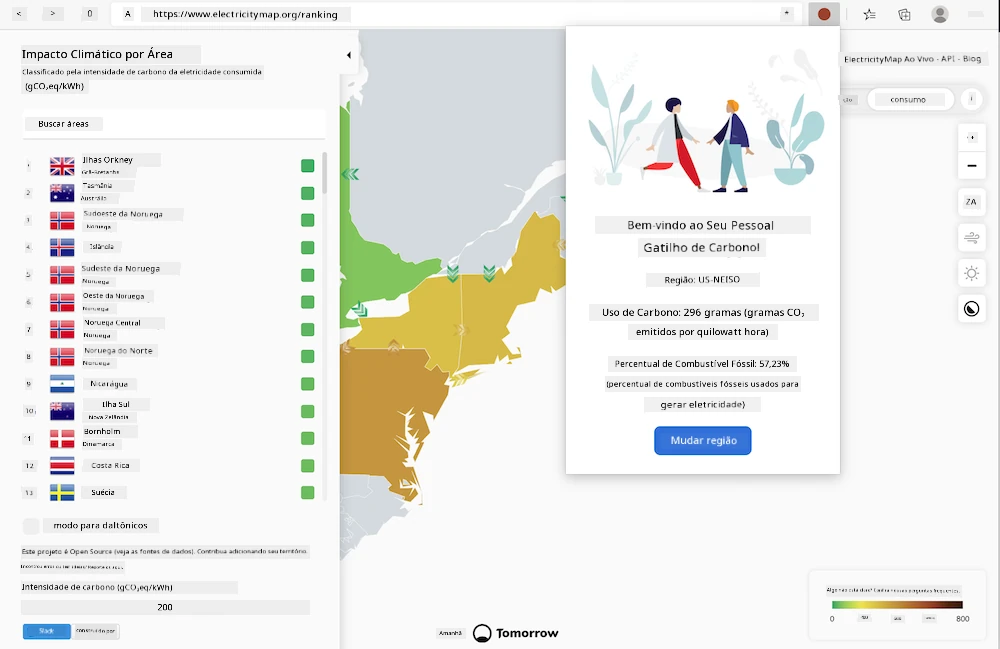
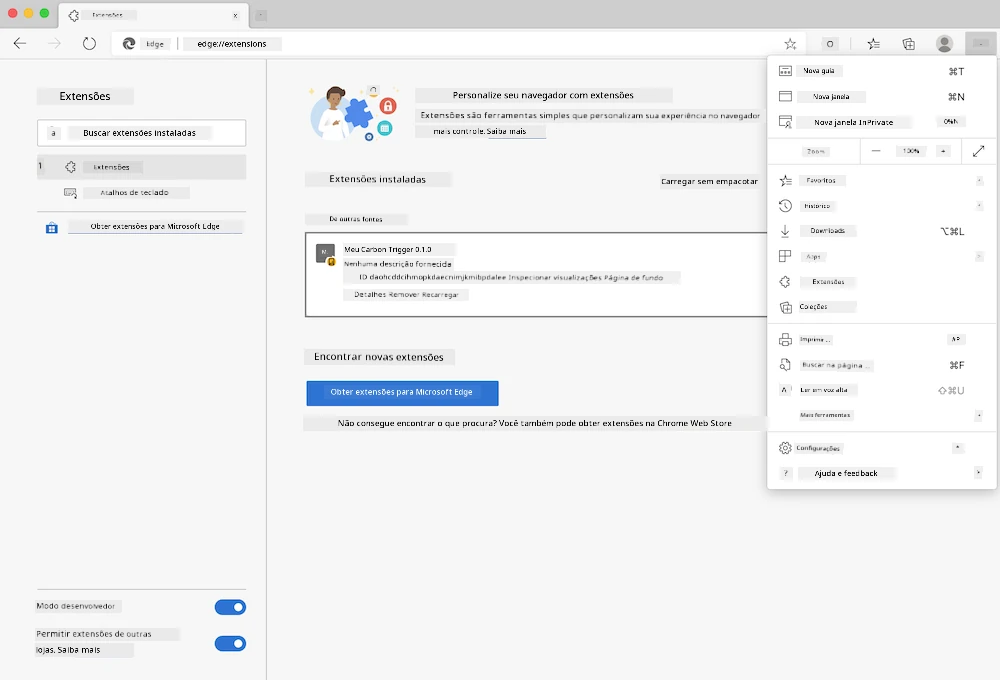

<!--
CO_OP_TRANSLATOR_METADATA:
{
  "original_hash": "9361268ca430b2579375009e1eceb5e5",
  "translation_date": "2025-08-25T23:58:21+00:00",
  "source_file": "5-browser-extension/solution/translation/README.fr.md",
  "language_code": "br"
}
-->
# Extensão de Navegador Carbon Trigger: Código Completo

Usando a API CO2 Signal da tmrow para monitorar o consumo de eletricidade, crie uma extensão de navegador para que você possa receber um lembrete diretamente no navegador sobre o consumo de eletricidade da sua região. O uso dessa extensão personalizada ajudará você a tomar decisões sobre suas atividades com base nessas informações.



## Primeiros Passos

Você precisará ter o [npm](https://npmjs.com) instalado. Baixe uma cópia deste código para uma pasta no seu computador.

Instale todos os pacotes necessários:

```
npm install
```

Compile a extensão usando o webpack:

```
npm run build
```

Para instalar no Edge, use o menu de 'três pontos' no canto superior direito do navegador para acessar o painel de Extensões. A partir daí, selecione 'Carregar extensão descompactada' para adicionar uma nova extensão. Na janela que aparecer, abra a pasta 'dist' e a extensão será carregada. Para utilizá-la, você precisará de uma chave de API para a API CO2 Signal ([obtenha uma aqui por e-mail](https://www.co2signal.com/) - insira seu e-mail no campo desta página) e do [código da sua região](http://api.electricitymap.org/v3/zones) correspondente ao [Mapa de Eletricidade](https://www.electricitymap.org/map) (em Boston, por exemplo, eu uso 'US-NEISO').



Depois que a chave de API e a região forem inseridas na interface da extensão, o ponto colorido na barra de extensão do navegador deve mudar para refletir o consumo de energia da sua região e fornecer um indicador sobre quais atividades de alto consumo energético seriam apropriadas realizar. O conceito por trás desse sistema de 'pontos' foi inspirado pela [extensão Energy Lollipop](https://energylollipop.com/) para emissões na Califórnia.

**Aviso Legal**:  
Este documento foi traduzido utilizando o serviço de tradução por IA [Co-op Translator](https://github.com/Azure/co-op-translator). Embora nos esforcemos para garantir a precisão, esteja ciente de que traduções automatizadas podem conter erros ou imprecisões. O documento original em seu idioma nativo deve ser considerado a fonte autoritativa. Para informações críticas, recomenda-se a tradução profissional realizada por humanos. Não nos responsabilizamos por quaisquer mal-entendidos ou interpretações equivocadas decorrentes do uso desta tradução.