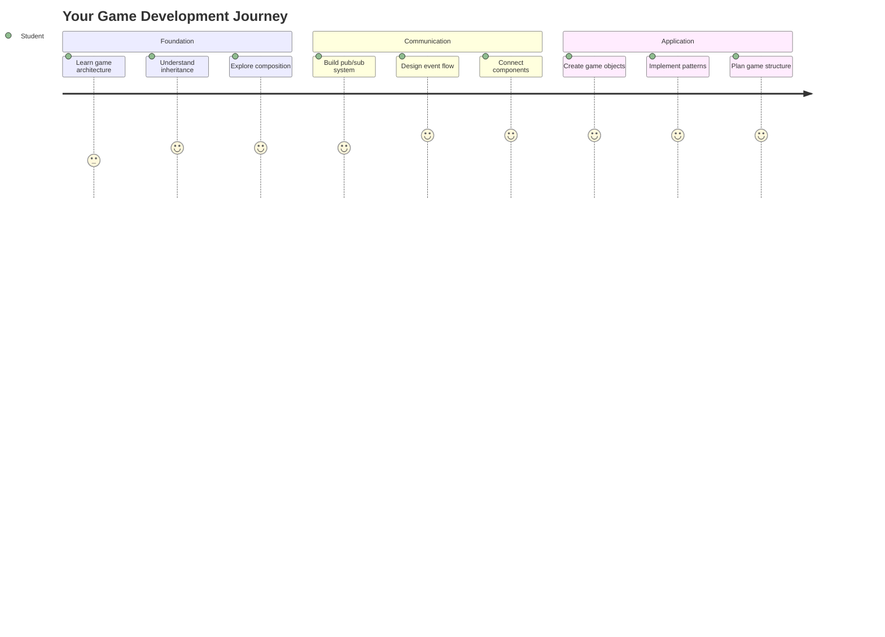
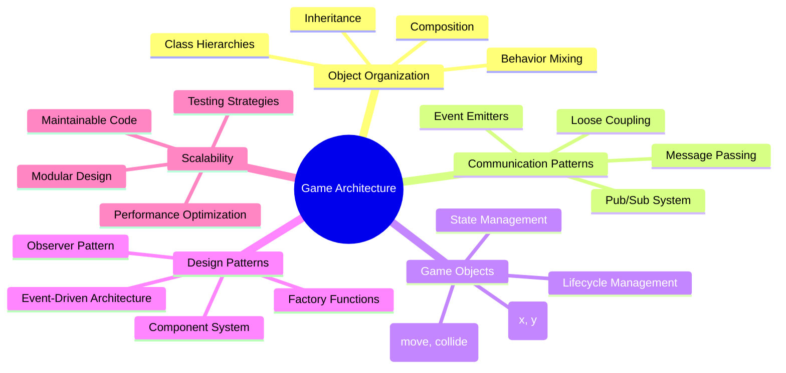
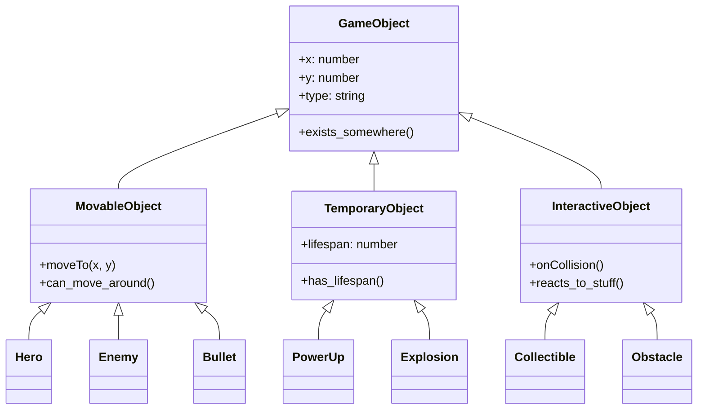
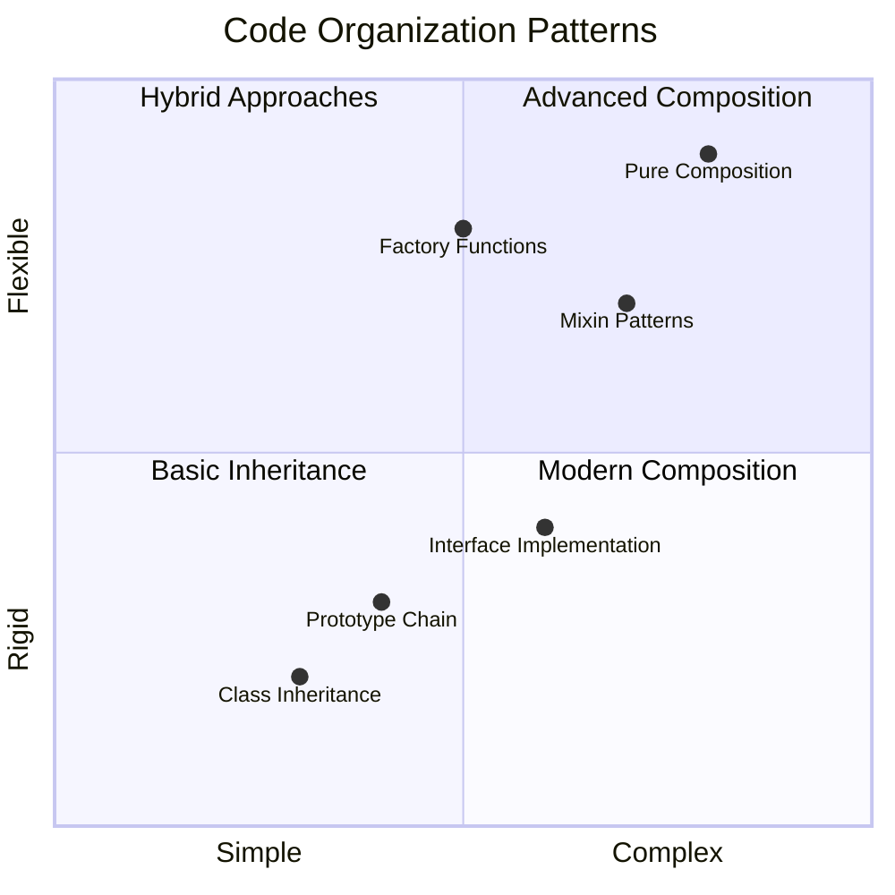
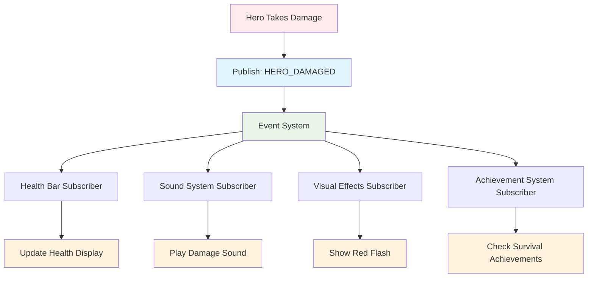
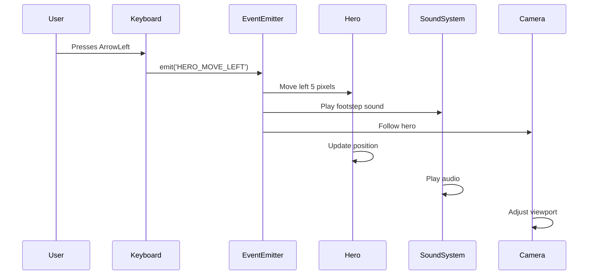
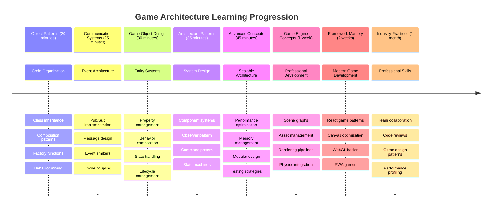

<!--
CO_OP_TRANSLATOR_METADATA:
{
  "original_hash": "a6332a7bb4d0be3bfd24199c83993777",
  "translation_date": "2025-11-04T00:15:15+00:00",
  "source_file": "6-space-game/1-introduction/README.md",
  "language_code": "br"
}
-->
# Construindo um Jogo Espacial Parte 1: Introdução




Assim como o controle de missão da NASA coordena múltiplos sistemas durante um lançamento espacial, vamos construir um jogo espacial que demonstra como diferentes partes de um programa podem trabalhar juntas de forma harmoniosa. Enquanto criamos algo que você realmente pode jogar, você aprenderá conceitos essenciais de programação que se aplicam a qualquer projeto de software.

Exploraremos duas abordagens fundamentais para organizar código: herança e composição. Esses não são apenas conceitos acadêmicos – são os mesmos padrões que impulsionam tudo, desde videogames até sistemas bancários. Também implementaremos um sistema de comunicação chamado pub/sub, que funciona como as redes de comunicação usadas em espaçonaves, permitindo que diferentes componentes compartilhem informações sem criar dependências.

Ao final desta série, você entenderá como construir aplicações que podem escalar e evoluir – seja desenvolvendo jogos, aplicações web ou qualquer outro sistema de software.



## Quiz Pré-Aula

[Quiz pré-aula](https://ff-quizzes.netlify.app/web/quiz/29)

## Herança e Composição no Desenvolvimento de Jogos

À medida que os projetos se tornam mais complexos, a organização do código se torna crucial. O que começa como um script simples pode se tornar difícil de manter sem uma estrutura adequada – assim como as missões Apollo exigiam uma coordenação cuidadosa entre milhares de componentes.

Exploraremos duas abordagens fundamentais para organizar código: herança e composição. Cada uma tem vantagens distintas, e entender ambas ajuda a escolher a abordagem certa para diferentes situações. Demonstraremos esses conceitos através do nosso jogo espacial, onde heróis, inimigos, power-ups e outros objetos devem interagir de forma eficiente.

✅ Um dos livros de programação mais famosos já escritos trata de [padrões de design](https://en.wikipedia.org/wiki/Design_Patterns).

Em qualquer jogo, você tem `objetos do jogo` – os elementos interativos que povoam o mundo do jogo. Heróis, inimigos, power-ups e efeitos visuais são todos objetos do jogo. Cada um existe em coordenadas específicas da tela usando valores `x` e `y`, semelhante a plotar pontos em um plano cartesiano.

Apesar de suas diferenças visuais, esses objetos frequentemente compartilham comportamentos fundamentais:

- **Eles existem em algum lugar** – Cada objeto tem coordenadas x e y para que o jogo saiba onde desenhá-lo.
- **Muitos podem se mover** – Heróis correm, inimigos perseguem, balas atravessam a tela.
- **Eles têm um tempo de vida** – Alguns permanecem para sempre, outros (como explosões) aparecem brevemente e desaparecem.
- **Eles reagem a coisas** – Quando há colisões, power-ups são coletados, barras de saúde são atualizadas.

✅ Pense em um jogo como Pac-Man. Você consegue identificar os quatro tipos de objetos listados acima nesse jogo?



### Expressando Comportamentos Através do Código

Agora que você entende os comportamentos comuns que os objetos do jogo compartilham, vamos explorar como implementar esses comportamentos em JavaScript. Você pode expressar o comportamento dos objetos através de métodos anexados a classes ou objetos individuais, e há várias abordagens para escolher.

**A Abordagem Baseada em Classes**

Classes e herança fornecem uma abordagem estruturada para organizar objetos do jogo. Assim como o sistema de classificação taxonômica desenvolvido por Carl Linnaeus, você começa com uma classe base contendo propriedades comuns e, em seguida, cria classes especializadas que herdam esses fundamentos enquanto adicionam capacidades específicas.

✅ Herança é um conceito importante para entender. Saiba mais no [artigo da MDN sobre herança](https://developer.mozilla.org/docs/Web/JavaScript/Inheritance_and_the_prototype_chain).

Aqui está como você pode implementar objetos do jogo usando classes e herança:

```javascript
// Step 1: Create the base GameObject class
class GameObject {
  constructor(x, y, type) {
    this.x = x;
    this.y = y;
    this.type = type;
  }
}
```

**Vamos dividir isso passo a passo:**
- Estamos criando um modelo básico que todo objeto do jogo pode usar.
- O construtor salva onde o objeto está (`x`, `y`) e que tipo de coisa ele é.
- Isso se torna a base sobre a qual todos os seus objetos do jogo serão construídos.

```javascript
// Step 2: Add movement capability through inheritance
class Movable extends GameObject {
  constructor(x, y, type) {
    super(x, y, type); // Call parent constructor
  }

  // Add the ability to move to a new position
  moveTo(x, y) {
    this.x = x;
    this.y = y;
  }
}
```

**No exemplo acima, nós:**
- **Estendemos** a classe GameObject para adicionar funcionalidade de movimento.
- **Chamamos** o construtor pai usando `super()` para inicializar propriedades herdadas.
- **Adicionamos** um método `moveTo()` que atualiza a posição do objeto.

```javascript
// Step 3: Create specific game object types
class Hero extends Movable {
  constructor(x, y) {
    super(x, y, 'Hero'); // Set type automatically
  }
}

class Tree extends GameObject {
  constructor(x, y) {
    super(x, y, 'Tree'); // Trees don't need movement
  }
}

// Step 4: Use your game objects
const hero = new Hero(0, 0);
hero.moveTo(5, 5); // Hero can move!

const tree = new Tree(10, 15);
// tree.moveTo() would cause an error - trees can't move
```

**Entendendo esses conceitos:**
- **Criamos** tipos de objetos especializados que herdam comportamentos apropriados.
- **Demonstramos** como a herança permite a inclusão seletiva de recursos.
- **Mostramos** que heróis podem se mover enquanto árvores permanecem estacionárias.
- **Ilustramos** como a hierarquia de classes impede ações inadequadas.

✅ Reserve alguns minutos para imaginar um herói do Pac-Man (Inky, Pinky ou Blinky, por exemplo) e como ele seria escrito em JavaScript.

**A Abordagem de Composição**

A composição segue uma filosofia de design modular, semelhante à forma como engenheiros projetam espaçonaves com componentes intercambiáveis. Em vez de herdar de uma classe pai, você combina comportamentos específicos para criar objetos com exatamente a funcionalidade que eles precisam. Essa abordagem oferece flexibilidade sem as restrições hierárquicas rígidas.

```javascript
// Step 1: Create base behavior objects
const gameObject = {
  x: 0,
  y: 0,
  type: ''
};

const movable = {
  moveTo(x, y) {
    this.x = x;
    this.y = y;
  }
};
```

**O que este código faz:**
- **Define** um objeto base `gameObject` com propriedades de posição e tipo.
- **Cria** um objeto de comportamento separado `movable` com funcionalidade de movimento.
- **Separa** preocupações mantendo dados de posição e lógica de movimento independentes.

```javascript
// Step 2: Compose objects by combining behaviors
const movableObject = { ...gameObject, ...movable };

// Step 3: Create factory functions for different object types
function createHero(x, y) {
  return {
    ...movableObject,
    x,
    y,
    type: 'Hero'
  };
}

function createStatic(x, y, type) {
  return {
    ...gameObject,
    x,
    y,
    type
  };
}
```

**No exemplo acima, nós:**
- **Combinamos** propriedades de objeto base com comportamento de movimento usando a sintaxe de espalhamento.
- **Criamos** funções fábrica que retornam objetos personalizados.
- **Habilitamos** a criação flexível de objetos sem hierarquias rígidas de classes.
- **Permitimos** que os objetos tenham exatamente os comportamentos que precisam.

```javascript
// Step 4: Create and use your composed objects
const hero = createHero(10, 10);
hero.moveTo(5, 5); // Works perfectly!

const tree = createStatic(0, 0, 'Tree');
// tree.moveTo() is undefined - no movement behavior was composed
```

**Pontos-chave para lembrar:**
- **Compõe** objetos misturando comportamentos em vez de herdá-los.
- **Oferece** mais flexibilidade do que hierarquias rígidas de herança.
- **Permite** que os objetos tenham exatamente os recursos que precisam.
- **Usa** a sintaxe moderna de espalhamento do JavaScript para uma combinação limpa de objetos.
```

**Which Pattern Should You Choose?**

**Which Pattern Should You Choose?**



> 💡 **Dica Profissional**: Ambos os padrões têm seu lugar no desenvolvimento moderno em JavaScript. Classes funcionam bem para hierarquias claramente definidas, enquanto a composição brilha quando você precisa de máxima flexibilidade.
> 
**Quando usar cada abordagem:**
- **Escolha** herança quando você tiver relações claras de "é-um" (um Herói *é-um* objeto Movable).
- **Selecione** composição quando você precisar de relações "tem-um" (um Herói *tem* habilidades de movimento).
- **Considere** as preferências da sua equipe e os requisitos do projeto.
- **Lembre-se** de que você pode misturar ambas as abordagens na mesma aplicação.

### 🔄 **Verificação Pedagógica**
**Entendimento da Organização de Objetos**: Antes de avançar para os padrões de comunicação, certifique-se de que você pode:
- ✅ Explicar a diferença entre herança e composição.
- ✅ Identificar quando usar classes versus funções fábrica.
- ✅ Entender como a palavra-chave `super()` funciona na herança.
- ✅ Reconhecer os benefícios de cada abordagem para o desenvolvimento de jogos.

**Autoavaliação Rápida**: Como você criaria um Inimigo Voador que pode se mover e voar?
- **Abordagem de herança**: `class FlyingEnemy extends Movable`
- **Abordagem de composição**: `{ ...movable, ...flyable, ...gameObject }`

**Conexão com o Mundo Real**: Esses padrões aparecem em todos os lugares:
- **Componentes React**: Props (composição) vs herança de classes.
- **Motores de Jogos**: Sistemas de entidade-componente usam composição.
- **Aplicativos Móveis**: Frameworks de UI frequentemente usam hierarquias de herança.

## Padrões de Comunicação: O Sistema Pub/Sub

À medida que as aplicações se tornam complexas, gerenciar a comunicação entre componentes se torna desafiador. O padrão de publicação-assinatura (pub/sub) resolve esse problema usando princípios semelhantes à transmissão de rádio – um transmissor pode alcançar vários receptores sem saber quem está ouvindo.

Considere o que acontece quando um herói sofre dano: a barra de saúde é atualizada, efeitos sonoros são reproduzidos, feedback visual aparece. Em vez de acoplar diretamente o objeto herói a esses sistemas, o pub/sub permite que o herói transmita uma mensagem de "dano sofrido". Qualquer sistema que precise responder pode se inscrever nesse tipo de mensagem e reagir de acordo.

✅ **Pub/Sub** significa 'publicação-assinatura'.



### Entendendo a Arquitetura Pub/Sub

O padrão pub/sub mantém diferentes partes da sua aplicação fracamente acopladas, o que significa que elas podem trabalhar juntas sem serem diretamente dependentes umas das outras. Essa separação torna seu código mais fácil de manter, testar e adaptar a mudanças.

**Os principais elementos do pub/sub:**
- **Mensagens** – Rótulos de texto simples como `'PLAYER_SCORED'` que descrevem o que aconteceu (mais qualquer informação extra).
- **Publicadores** – Os objetos que gritam "Algo aconteceu!" para quem estiver ouvindo.
- **Assinantes** – Os objetos que dizem "Eu me importo com esse evento" e reagem quando ele acontece.
- **Sistema de Eventos** – O intermediário que garante que as mensagens cheguem aos ouvintes certos.

### Construindo um Sistema de Eventos

Vamos criar um sistema de eventos simples, mas poderoso, que demonstra esses conceitos:

```javascript
// Step 1: Create the EventEmitter class
class EventEmitter {
  constructor() {
    this.listeners = {}; // Store all event listeners
  }
  
  // Register a listener for a specific message type
  on(message, listener) {
    if (!this.listeners[message]) {
      this.listeners[message] = [];
    }
    this.listeners[message].push(listener);
  }
  
  // Send a message to all registered listeners
  emit(message, payload = null) {
    if (this.listeners[message]) {
      this.listeners[message].forEach(listener => {
        listener(message, payload);
      });
    }
  }
}
```

**Dividindo o que acontece aqui:**
- **Cria** um sistema central de gerenciamento de eventos usando uma classe simples.
- **Armazena** ouvintes em um objeto organizado por tipo de mensagem.
- **Registra** novos ouvintes usando o método `on()`.
- **Transmite** mensagens para todos os ouvintes interessados usando `emit()`.
- **Suporta** cargas de dados opcionais para passar informações relevantes.

### Juntando Tudo: Um Exemplo Prático

Certo, vamos ver isso em ação! Construiremos um sistema de movimento simples que mostra como o pub/sub pode ser limpo e flexível:

```javascript
// Step 1: Define your message types
const Messages = {
  HERO_MOVE_LEFT: 'HERO_MOVE_LEFT',
  HERO_MOVE_RIGHT: 'HERO_MOVE_RIGHT',
  ENEMY_SPOTTED: 'ENEMY_SPOTTED'
};

// Step 2: Create your event system and game objects
const eventEmitter = new EventEmitter();
const hero = createHero(0, 0);
```

**O que este código faz:**
- **Define** um objeto de constantes para evitar erros de digitação nos nomes das mensagens.
- **Cria** uma instância de emissor de eventos para lidar com toda a comunicação.
- **Inicializa** um objeto herói na posição inicial.

```javascript
// Step 3: Set up event listeners (subscribers)
eventEmitter.on(Messages.HERO_MOVE_LEFT, () => {
  hero.moveTo(hero.x - 5, hero.y);
  console.log(`Hero moved to position: ${hero.x}, ${hero.y}`);
});

eventEmitter.on(Messages.HERO_MOVE_RIGHT, () => {
  hero.moveTo(hero.x + 5, hero.y);
  console.log(`Hero moved to position: ${hero.x}, ${hero.y}`);
});
```

**No exemplo acima, nós:**
- **Registramos** ouvintes de eventos que respondem a mensagens de movimento.
- **Atualizamos** a posição do herói com base na direção do movimento.
- **Adicionamos** logs no console para acompanhar as mudanças de posição do herói.
- **Separamos** a lógica de movimento do manuseio de entrada.

```javascript
// Step 4: Connect keyboard input to events (publishers)
window.addEventListener('keydown', (event) => {
  switch(event.key) {
    case 'ArrowLeft':
      eventEmitter.emit(Messages.HERO_MOVE_LEFT);
      break;
    case 'ArrowRight':
      eventEmitter.emit(Messages.HERO_MOVE_RIGHT);
      break;
  }
});
```

**Entendendo esses conceitos:**
- **Conecta** a entrada do teclado aos eventos do jogo sem acoplamento rígido.
- **Permite** que o sistema de entrada se comunique com objetos do jogo indiretamente.
- **Permite** que vários sistemas respondam aos mesmos eventos de teclado.
- **Facilita** a alteração de configurações de teclas ou a adição de novos métodos de entrada.



> 💡 **Dica Profissional**: A beleza desse padrão é a flexibilidade! Você pode facilmente adicionar efeitos sonoros, tremores de tela ou efeitos de partículas simplesmente adicionando mais ouvintes de eventos – sem necessidade de modificar o código existente de teclado ou movimento.
> 
**Por que você vai adorar essa abordagem:**
- Adicionar novos recursos se torna super fácil – basta ouvir os eventos que você se importa.
- Múltiplas coisas podem reagir ao mesmo evento sem interferir umas nas outras.
- Testar fica muito mais simples porque cada peça funciona de forma independente.
- Quando algo quebra, você sabe exatamente onde procurar.

### Por que o Pub/Sub Escala Eficientemente

O padrão pub/sub mantém a simplicidade à medida que as aplicações crescem em complexidade. Seja gerenciando dezenas de inimigos, atualizações dinâmicas de UI ou sistemas de som, o padrão lida com o aumento de escala sem mudanças arquitetônicas. Novos recursos se integram ao sistema de eventos existente sem afetar a funcionalidade estabelecida.

> ⚠️ **Erro Comum**: Não crie muitos tipos específicos de mensagens logo no início. Comece com categorias amplas e refine-as conforme as necessidades do seu jogo se tornem mais claras.
> 
**Melhores práticas a seguir:**
- **Agrupe** mensagens relacionadas em categorias lógicas.
- **Use** nomes descritivos que indiquem claramente o que aconteceu.
- **Mantenha** as cargas de mensagens simples e focadas.
- **Documente** seus tipos de mensagens para colaboração em equipe.

### 🔄 **Verificação Pedagógica**
**Entendimento da Arquitetura Orientada a Eventos**: Verifique sua compreensão do sistema completo:
- ✅ Como o padrão pub/sub evita o acoplamento rígido entre componentes?
- ✅ Por que é mais fácil adicionar novos recursos com uma arquitetura orientada a eventos?
- ✅ Qual é o papel do EventEmitter no fluxo de comunicação?
- ✅ Como as constantes de mensagens evitam erros e melhoram a manutenção?

**Desafio de Design**: Como você lidaria com esses cenários de jogo usando pub/sub?
1. **Inimigo morre**: Atualizar pontuação, reproduzir som, gerar power-up, remover da tela.
2. **Nível completo**: Parar música, mostrar interface, salvar progresso, carregar próximo nível.
3. **Power-up coletado**: Melhorar habilidades, atualizar interface, reproduzir efeito, iniciar cronômetro.

**Conexão Profissional**: Este padrão aparece em:
- **Frameworks Frontend**: Sistemas de eventos do React/Vue.
- **Serviços Backend**: Comunicação entre microsserviços.
- **Motores de Jogos**: Sistema de eventos do Unity.
- **Desenvolvimento Móvel**: Sistemas de notificação do iOS/Android.

---

## Desafio do Agente do GitHub Copilot 🚀

Use o modo Agent para completar o seguinte desafio:

**Descrição:** Crie um sistema simples de objetos de jogo usando tanto herança quanto o padrão pub/sub. Você implementará um jogo básico onde diferentes objetos podem se comunicar através de eventos sem saber diretamente uns dos outros.

**Prompt:** Crie um sistema de jogo em JavaScript com os seguintes requisitos: 1) Crie uma classe base GameObject com coordenadas x, y e uma propriedade de tipo. 2) Crie uma classe Hero que estenda GameObject e possa se mover. 3) Crie uma classe Enemy que estenda GameObject e possa perseguir o herói. 4) Implemente uma classe EventEmitter para o padrão pub/sub. 5) Configure ouvintes de eventos para que, quando o herói se mover, inimigos próximos recebam um evento 'HERO_MOVED' e atualizem sua posição para se mover em direção ao herói. Inclua declarações console.log para mostrar a comunicação entre os objetos.

Saiba mais sobre o [modo agent](https://code.visualstudio.com/blogs/2025/02/24/introducing-copilot-agent-mode) aqui.

## 🚀 Desafio
Considere como o padrão pub-sub pode melhorar a arquitetura de jogos. Identifique quais componentes devem emitir eventos e como o sistema deve responder. Crie um conceito de jogo e mapeie os padrões de comunicação entre seus componentes.

## Quiz Pós-Aula

[Quiz pós-aula](https://ff-quizzes.netlify.app/web/quiz/30)

## Revisão e Autoestudo

Saiba mais sobre Pub/Sub [lendo sobre o assunto](https://docs.microsoft.com/azure/architecture/patterns/publisher-subscriber/?WT.mc_id=academic-77807-sagibbon).

### ⚡ **O que você pode fazer nos próximos 5 minutos**
- [ ] Abra qualquer jogo HTML5 online e inspecione seu código usando DevTools
- [ ] Crie um elemento HTML5 Canvas simples e desenhe uma forma básica
- [ ] Experimente usar `setInterval` para criar um loop de animação simples
- [ ] Explore a documentação da API Canvas e experimente um método de desenho

### 🎯 **O que você pode realizar nesta hora**
- [ ] Complete o quiz pós-aula e entenda os conceitos de desenvolvimento de jogos
- [ ] Configure a estrutura do seu projeto de jogo com arquivos HTML, CSS e JavaScript
- [ ] Crie um loop básico de jogo que atualiza e renderiza continuamente
- [ ] Desenhe seus primeiros sprites de jogo no canvas
- [ ] Implemente o carregamento básico de recursos para imagens e sons

### 📅 **Criação de jogo ao longo da semana**
- [ ] Complete o jogo espacial com todos os recursos planejados
- [ ] Adicione gráficos polidos, efeitos sonoros e animações suaves
- [ ] Implemente estados de jogo (tela inicial, jogabilidade, fim de jogo)
- [ ] Crie um sistema de pontuação e rastreamento de progresso do jogador
- [ ] Torne seu jogo responsivo e acessível em diferentes dispositivos
- [ ] Compartilhe seu jogo online e receba feedback dos jogadores

### 🌟 **Desenvolvimento de jogos ao longo do mês**
- [ ] Crie vários jogos explorando diferentes gêneros e mecânicas
- [ ] Aprenda um framework de desenvolvimento de jogos como Phaser ou Three.js
- [ ] Contribua para projetos de desenvolvimento de jogos open source
- [ ] Domine padrões avançados de programação de jogos e otimização
- [ ] Crie um portfólio mostrando suas habilidades em desenvolvimento de jogos
- [ ] Oriente outras pessoas interessadas em desenvolvimento de jogos e mídia interativa

## 🎯 Sua Linha do Tempo de Maestria em Desenvolvimento de Jogos



### 🛠️ Resumo do Kit de Ferramentas de Arquitetura de Jogos

Após concluir esta lição, você agora tem:
- **Domínio de Padrões de Design**: Compreensão dos trade-offs entre herança e composição
- **Arquitetura Orientada a Eventos**: Implementação de pub/sub para comunicação escalável
- **Design Orientado a Objetos**: Hierarquias de classes e composição de comportamentos
- **JavaScript Moderno**: Funções de fábrica, sintaxe spread e padrões ES6+
- **Arquitetura Escalável**: Princípios de design modular e acoplamento fraco
- **Fundamentos de Desenvolvimento de Jogos**: Sistemas de entidades e padrões de componentes
- **Padrões Profissionais**: Abordagens padrão da indústria para organização de código

**Aplicações no Mundo Real**: Esses padrões se aplicam diretamente a:
- **Frameworks Frontend**: Arquitetura de componentes e gerenciamento de estado em React/Vue
- **Serviços Backend**: Comunicação de microsserviços e sistemas orientados a eventos
- **Desenvolvimento Mobile**: Arquitetura de aplicativos iOS/Android e sistemas de notificação
- **Engines de Jogos**: Desenvolvimento de jogos baseados na web, Unity e Unreal
- **Software Empresarial**: Design de sistemas distribuídos e sourcing de eventos
- **Design de APIs**: Serviços RESTful e comunicação em tempo real

**Habilidades Profissionais Adquiridas**: Agora você pode:
- **Projetar** arquiteturas de software escaláveis usando padrões comprovados
- **Implementar** sistemas orientados a eventos que lidam com interações complexas
- **Escolher** estratégias apropriadas de organização de código para diferentes cenários
- **Depurar** e manter sistemas com baixo acoplamento de forma eficaz
- **Comunicar** decisões técnicas usando terminologia padrão da indústria

**Próximo Nível**: Você está pronto para implementar esses padrões em um jogo real, explorar tópicos avançados de desenvolvimento de jogos ou aplicar esses conceitos de arquitetura a aplicativos web!

🌟 **Conquista Desbloqueada**: Você dominou os padrões fundamentais de arquitetura de software que impulsionam tudo, desde jogos simples até sistemas empresariais complexos!

## Tarefa

[Crie um protótipo de jogo](assignment.md)

---

**Aviso Legal**:  
Este documento foi traduzido utilizando o serviço de tradução por IA [Co-op Translator](https://github.com/Azure/co-op-translator). Embora nos esforcemos para garantir a precisão, esteja ciente de que traduções automatizadas podem conter erros ou imprecisões. O documento original em seu idioma nativo deve ser considerado a fonte autoritativa. Para informações críticas, recomenda-se a tradução profissional humana. Não nos responsabilizamos por quaisquer mal-entendidos ou interpretações incorretas decorrentes do uso desta tradução.