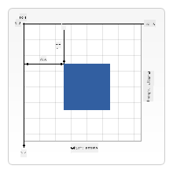

<!--
CO_OP_TRANSLATOR_METADATA:
{
  "original_hash": "84053695dca714e16ed064366503ebd5",
  "translation_date": "2025-10-22T23:14:20+00:00",
  "source_file": "6-space-game/2-drawing-to-canvas/README.md",
  "language_code": "br"
}
-->
# Construa um Jogo Espacial Parte 2: Desenhe o Herói e os Monstros no Canvas

A API Canvas é uma das ferramentas mais poderosas do desenvolvimento web para criar gráficos dinâmicos e interativos diretamente no seu navegador. Nesta lição, vamos transformar aquele elemento HTML `<canvas>` vazio em um mundo de jogo cheio de heróis e monstros. Pense no canvas como sua prancheta digital onde o código se torna visual.

Estamos construindo com base no que você aprendeu na lição anterior, e agora vamos mergulhar nos aspectos visuais. Você aprenderá como carregar e exibir sprites de jogo, posicionar elementos com precisão e criar a base visual para seu jogo espacial. Isso faz a ponte entre páginas web estáticas e experiências dinâmicas e interativas.

Ao final desta lição, você terá uma cena de jogo completa com sua nave heroica posicionada corretamente e formações inimigas prontas para a batalha. Você entenderá como jogos modernos renderizam gráficos em navegadores e adquirirá habilidades para criar suas próprias experiências visuais interativas. Vamos explorar os gráficos do canvas e dar vida ao seu jogo espacial!

## Quiz Pré-Aula

[Quiz pré-aula](https://ff-quizzes.netlify.app/web/quiz/31)

## O Canvas

Então, o que exatamente é esse elemento `<canvas>`? É a solução do HTML5 para criar gráficos dinâmicos e animações em navegadores web. Diferente de imagens ou vídeos regulares que são estáticos, o canvas oferece controle em nível de pixel sobre tudo o que aparece na tela. Isso o torna perfeito para jogos, visualizações de dados e arte interativa. Pense nele como uma superfície de desenho programável onde o JavaScript se torna seu pincel.

Por padrão, um elemento canvas parece um retângulo transparente e vazio na sua página. Mas é aí que está o potencial! Seu verdadeiro poder surge quando você usa JavaScript para desenhar formas, carregar imagens, criar animações e fazer as coisas responderem às interações do usuário. É semelhante ao trabalho dos pioneiros dos gráficos de computador no Bell Labs nos anos 1960, que precisavam programar cada pixel para criar as primeiras animações digitais.

✅ Leia [mais sobre a API Canvas](https://developer.mozilla.org/docs/Web/API/Canvas_API) no MDN.

Aqui está como ele é normalmente declarado, como parte do corpo da página:

```html
<canvas id="myCanvas" width="200" height="100"></canvas>
```

**O que este código faz:**
- **Define** o atributo `id` para que você possa referenciar este elemento canvas específico no JavaScript
- **Define** a `largura` em pixels para controlar o tamanho horizontal do canvas
- **Estabelece** a `altura` em pixels para determinar as dimensões verticais do canvas

## Desenhando Geometria Simples

Agora que você sabe o que é o elemento canvas, vamos explorar como desenhar nele! O canvas usa um sistema de coordenadas que pode parecer familiar das aulas de matemática, mas há uma diferença importante específica para gráficos de computador.

O canvas usa coordenadas cartesianas com um eixo x (horizontal) e um eixo y (vertical) para posicionar tudo o que você desenha. Mas aqui está a diferença principal: ao contrário do sistema de coordenadas da aula de matemática, o ponto de origem `(0,0)` começa no canto superior esquerdo, com os valores de x aumentando conforme você se move para a direita e os valores de y aumentando conforme você se move para baixo. Essa abordagem remonta aos primeiros monitores de computador, onde feixes de elétrons escaneavam de cima para baixo, tornando o canto superior esquerdo o ponto de partida natural.


> Imagem de [MDN](https://developer.mozilla.org/docs/Web/API/Canvas_API/Tutorial/Drawing_shapes)

Para desenhar no elemento canvas, você seguirá o mesmo processo de três etapas que forma a base de todos os gráficos do canvas. Depois de fazer isso algumas vezes, torna-se algo natural:

1. **Obtenha uma referência** ao seu elemento Canvas no DOM (assim como qualquer outro elemento HTML)
2. **Obtenha o contexto de renderização 2D** – isso fornece todos os métodos de desenho
3. **Comece a desenhar!** Use os métodos integrados do contexto para criar seus gráficos

Aqui está como isso se parece no código:

```javascript
// Step 1: Get the canvas element
const canvas = document.getElementById("myCanvas");

// Step 2: Get the 2D rendering context
const ctx = canvas.getContext("2d");

// Step 3: Set fill color and draw a rectangle
ctx.fillStyle = 'red';
ctx.fillRect(0, 0, 200, 200); // x, y, width, height
```

**Vamos detalhar isso passo a passo:**
- Nós **pegamos** nosso elemento canvas usando seu ID e o armazenamos em uma variável
- Nós **obtemos** o contexto de renderização 2D – esta é nossa caixa de ferramentas cheia de métodos de desenho
- Nós **informamos** ao canvas que queremos preencher as coisas com vermelho usando a propriedade `fillStyle`
- Nós **desenhamos** um retângulo começando no canto superior esquerdo (0,0) com 200 pixels de largura e altura

✅ A API Canvas foca principalmente em formas 2D, mas você também pode desenhar elementos 3D em um site; para isso, você pode usar a [API WebGL](https://developer.mozilla.org/docs/Web/API/WebGL_API).

Você pode desenhar vários tipos de coisas com a API Canvas, como:

- **Formas geométricas**, já mostramos como desenhar um retângulo, mas há muito mais que você pode desenhar.
- **Texto**, você pode desenhar texto com qualquer fonte e cor que desejar.
- **Imagens**, você pode desenhar uma imagem baseada em um arquivo de imagem como .jpg ou .png, por exemplo.

✅ Experimente! Você sabe como desenhar um retângulo, consegue desenhar um círculo na página? Dê uma olhada em alguns desenhos interessantes no Canvas no CodePen. Aqui está um [exemplo particularmente impressionante](https://codepen.io/dissimulate/pen/KrAwx).

## Carregar e Desenhar um Asset de Imagem

Desenhar formas básicas é útil para começar, mas a maioria dos jogos precisa de imagens reais! Sprites, fundos e texturas são o que dão apelo visual aos jogos. Carregar e exibir imagens no canvas funciona de forma diferente de desenhar formas geométricas, mas é simples uma vez que você entende o processo.

Precisamos criar um objeto `Image`, carregar nosso arquivo de imagem (isso acontece de forma assíncrona, ou seja, "em segundo plano") e, em seguida, desenhá-lo no canvas quando estiver pronto. Essa abordagem garante que suas imagens sejam exibidas corretamente sem bloquear sua aplicação enquanto elas carregam.

### Carregamento Básico de Imagem

```javascript
const img = new Image();
img.src = 'path/to/my/image.png';
img.onload = () => {
  // Image loaded and ready to be used
  console.log('Image loaded successfully!');
};
```

**O que está acontecendo neste código:**
- Nós **criamos** um novo objeto Image para armazenar nosso sprite ou textura
- Nós **informamos** qual arquivo de imagem carregar definindo o caminho da fonte
- Nós **ouvimos** o evento de carregamento para saber exatamente quando a imagem está pronta para uso

### Uma Maneira Melhor de Carregar Imagens

Aqui está uma maneira mais robusta de lidar com o carregamento de imagens que os desenvolvedores profissionais costumam usar. Vamos encapsular o carregamento de imagens em uma função baseada em Promises – essa abordagem, popularizada quando as Promises do JavaScript se tornaram padrão no ES6, torna seu código mais organizado e lida com erros de forma elegante:

```javascript
function loadAsset(path) {
  return new Promise((resolve, reject) => {
    const img = new Image();
    img.src = path;
    img.onload = () => {
      resolve(img);
    };
    img.onerror = () => {
      reject(new Error(`Failed to load image: ${path}`));
    };
  });
}

// Modern usage with async/await
async function initializeGame() {
  try {
    const heroImg = await loadAsset('hero.png');
    const monsterImg = await loadAsset('monster.png');
    // Images are now ready to use
  } catch (error) {
    console.error('Failed to load game assets:', error);
  }
}
```

**O que fizemos aqui:**
- **Encapsulamos** toda a lógica de carregamento de imagens em uma Promise para que possamos lidar melhor com ela
- **Adicionamos** tratamento de erros que realmente nos informa quando algo dá errado
- **Usamos** a sintaxe moderna de async/await porque é muito mais fácil de ler
- **Incluímos** blocos try/catch para lidar graciosamente com qualquer problema de carregamento

Depois que suas imagens forem carregadas, desenhá-las no canvas é realmente bem simples:

```javascript
async function renderGameScreen() {
  try {
    // Load game assets
    const heroImg = await loadAsset('hero.png');
    const monsterImg = await loadAsset('monster.png');

    // Get canvas and context
    const canvas = document.getElementById("myCanvas");
    const ctx = canvas.getContext("2d");

    // Draw images to specific positions
    ctx.drawImage(heroImg, canvas.width / 2, canvas.height / 2);
    ctx.drawImage(monsterImg, 0, 0);
  } catch (error) {
    console.error('Failed to render game screen:', error);
  }
}
```

**Vamos detalhar isso passo a passo:**
- Nós **carregamos** as imagens do herói e dos monstros em segundo plano usando await
- Nós **pegamos** nosso elemento canvas e obtemos o contexto de renderização 2D necessário
- Nós **posicionamos** a imagem do herói bem no centro usando alguns cálculos rápidos de coordenadas
- Nós **colocamos** a imagem do monstro no canto superior esquerdo para começar nossa formação inimiga
- Nós **capturamos** quaisquer erros que possam ocorrer durante o carregamento ou renderização

## Agora é Hora de Começar a Construir Seu Jogo

Agora vamos juntar tudo para criar a base visual do seu jogo espacial. Você tem uma compreensão sólida dos fundamentos do canvas e das técnicas de carregamento de imagens, então esta seção prática irá guiá-lo na construção de uma tela de jogo completa com sprites posicionados corretamente.

### O que Construir

Você criará uma página web com um elemento Canvas. Ela deve renderizar uma tela preta de `1024*768`. Nós fornecemos duas imagens para você:

- Nave do herói

   

- Formação de 5x5 monstros

   

### Passos Recomendados para Iniciar o Desenvolvimento

Localize os arquivos iniciais que foram criados para você na subpasta `your-work`. A estrutura do seu projeto deve conter:

```bash
your-work/
├── assets/
│   ├── enemyShip.png
│   └── player.png
├── index.html
├── app.js
└── package.json
```

**O que você tem para trabalhar:**
- **Sprites do jogo** estão na pasta `assets/` para manter tudo organizado
- **Seu arquivo HTML principal** configura o elemento canvas e prepara tudo
- **Um arquivo JavaScript** onde você escreverá toda a mágica de renderização do jogo
- **Um package.json** que configura um servidor de desenvolvimento para que você possa testar localmente

Abra esta pasta no Visual Studio Code para começar o desenvolvimento. Você precisará de um ambiente de desenvolvimento local com Visual Studio Code, NPM e Node.js instalados. Se você ainda não configurou o `npm` no seu computador, [aqui está como instalá-lo](https://www.npmjs.com/get-npm).

Inicie seu servidor de desenvolvimento navegando até a pasta `your-work`:

```bash
cd your-work
npm start
```

**Este comando faz algumas coisas bem legais:**
- **Inicia** um servidor local em `http://localhost:5000` para que você possa testar seu jogo
- **Serve** todos os seus arquivos corretamente para que seu navegador possa carregá-los
- **Observa** as alterações nos seus arquivos para que você possa desenvolver sem problemas
- **Fornece** um ambiente de desenvolvimento profissional para testar tudo

> 💡 **Nota**: Seu navegador mostrará uma página em branco inicialmente – isso é esperado! À medida que você adicionar código, atualize seu navegador para ver suas alterações. Essa abordagem de desenvolvimento iterativo é semelhante à forma como a NASA construiu o computador de orientação Apollo – testando cada componente antes de integrá-lo ao sistema maior.

### Adicione Código

Adicione o código necessário em `your-work/app.js` para completar as seguintes tarefas:

1. **Desenhe um canvas com fundo preto**
   > 💡 **Como fazer**: Encontre o TODO em `/app.js` e adicione apenas duas linhas. Defina `ctx.fillStyle` como preto e, em seguida, use `ctx.fillRect()` começando em (0,0) com as dimensões do seu canvas. Fácil!

2. **Carregue as texturas do jogo**
   > 💡 **Como fazer**: Use `await loadAsset()` para carregar suas imagens de jogador e inimigo. Armazene-as em variáveis para que você possa usá-las mais tarde. Lembre-se – elas não aparecerão até que você realmente as desenhe!

3. **Desenhe a nave do herói na posição central inferior**
   > 💡 **Como fazer**: Use `ctx.drawImage()` para posicionar seu herói. Para a coordenada x, tente `canvas.width / 2 - 45` para centralizá-lo, e para a coordenada y use `canvas.height - canvas.height / 4` para colocá-lo na área inferior.

4. **Desenhe uma formação de 5×5 de naves inimigas**
   > 💡 **Como fazer**: Encontre a função `createEnemies` e configure um loop aninhado. Você precisará fazer alguns cálculos para espaçamento e posicionamento, mas não se preocupe – eu vou mostrar exatamente como!

Primeiro, estabeleça constantes para o layout adequado da formação inimiga:

```javascript
const ENEMY_TOTAL = 5;
const ENEMY_SPACING = 98;
const FORMATION_WIDTH = ENEMY_TOTAL * ENEMY_SPACING;
const START_X = (canvas.width - FORMATION_WIDTH) / 2;
const STOP_X = START_X + FORMATION_WIDTH;
```

**Vamos detalhar o que essas constantes fazem:**
- Nós **definimos** 5 inimigos por linha e coluna (uma grade 5×5)
- Nós **definimos** quanto espaço colocar entre os inimigos para que não fiquem apertados
- Nós **calculamos** quão larga será toda a formação
- Nós **determinamos** onde começar e parar para que a formação pareça centralizada

Em seguida, crie loops aninhados para desenhar a formação de inimigos:

```javascript
for (let x = START_X; x < STOP_X; x += ENEMY_SPACING) {
  for (let y = 0; y < 50 * 5; y += 50) {
    ctx.drawImage(enemyImg, x, y);
  }
}
```

**O que este loop aninhado faz:**
- O loop externo **move** da esquerda para a direita através da formação
- O loop interno **vai** de cima para baixo para criar linhas organizadas
- Nós **desenhamos** cada sprite inimigo nas coordenadas x,y exatas que calculamos
- Tudo permanece **uniformemente espaçado** para que pareça profissional e organizado

## Resultado

O resultado final deve ser assim:


## Solução

Por favor, tente resolver sozinho primeiro, mas se você ficar preso, dê uma olhada em uma [solução](../../../../6-space-game/2-drawing-to-canvas/solution/app.js)

---

## Desafio do GitHub Copilot Agent 🚀

Use o modo Agent para completar o seguinte desafio:

**Descrição:** Melhore o canvas do seu jogo espacial adicionando efeitos visuais e elementos interativos usando as técnicas da API Canvas que você aprendeu.

**Prompt:** Crie um novo arquivo chamado `enhanced-canvas.html` com um canvas que exiba estrelas animadas no fundo, uma barra de saúde pulsante para a nave do herói e naves inimigas que se movem lentamente para baixo. Inclua código JavaScript que desenhe estrelas cintilantes usando posições e opacidades aleatórias, implemente uma barra de saúde que muda de cor com base no nível de saúde (verde > amarelo > vermelho) e anime as naves inimigas para se moverem pela tela em velocidades diferentes.

Saiba mais sobre o [modo agent](https://code.visualstudio.com/blogs/2025/02/24/introducing-copilot-agent-mode) aqui.

## 🚀 Desafio

Você aprendeu sobre como desenhar com a API Canvas focada em 2D; dê uma olhada na [API WebGL](https://developer.mozilla.org/docs/Web/API/WebGL_API) e tente desenhar um objeto 3D.

## Quiz Pós-Aula

[Quiz pós-aula](https://ff-quizzes.netlify.app/web/quiz/32)

## Revisão e Autoestudo

Saiba mais sobre a API Canvas [lendo sobre ela](https://developer.mozilla.org/docs/Web/API/Canvas_API).

## Tarefa

[Brinque com a API Canvas](assignment.md)

---

**Aviso Legal**:  
Este documento foi traduzido usando o serviço de tradução por IA [Co-op Translator](https://github.com/Azure/co-op-translator). Embora nos esforcemos para garantir a precisão, esteja ciente de que traduções automatizadas podem conter erros ou imprecisões. O documento original em seu idioma nativo deve ser considerado a fonte autoritativa. Para informações críticas, recomenda-se a tradução profissional humana. Não nos responsabilizamos por quaisquer mal-entendidos ou interpretações incorretas decorrentes do uso desta tradução.