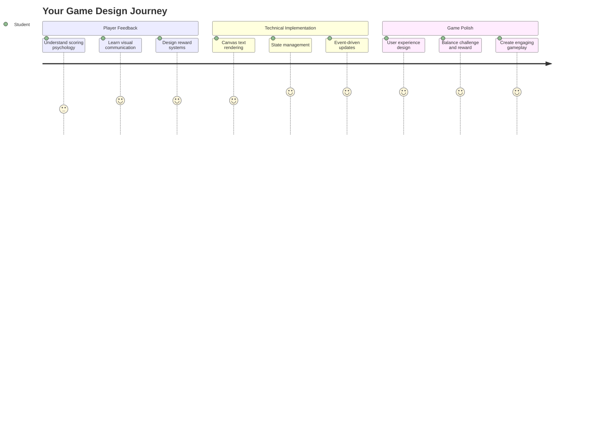
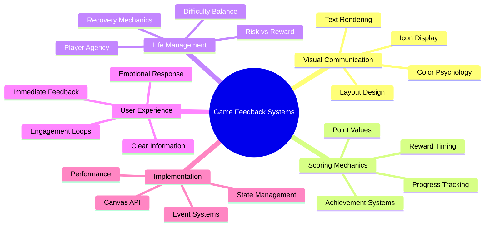
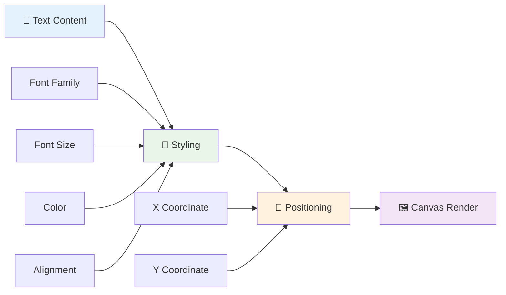
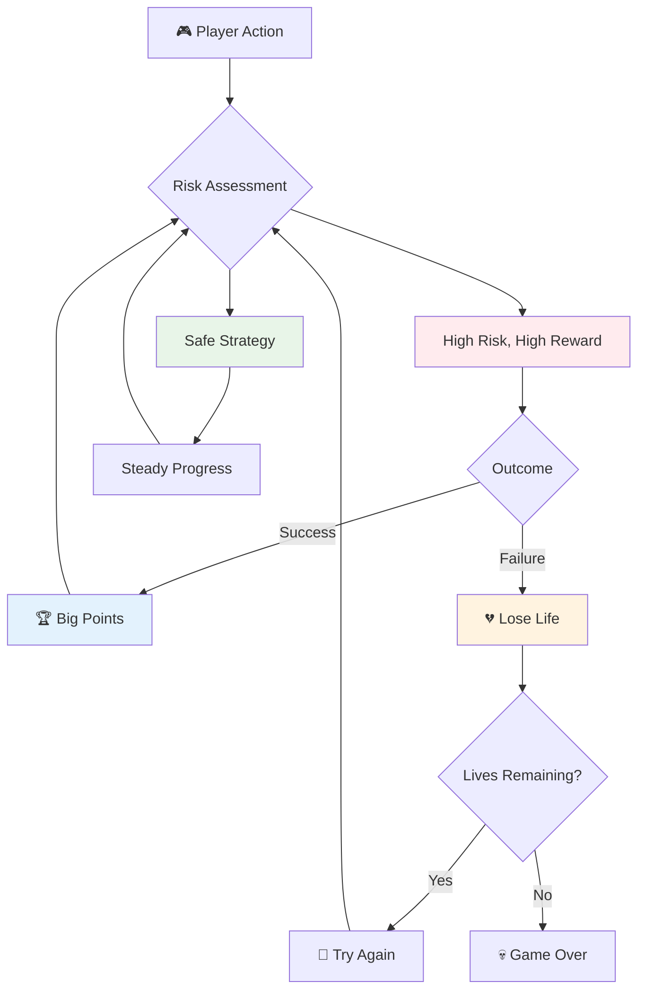
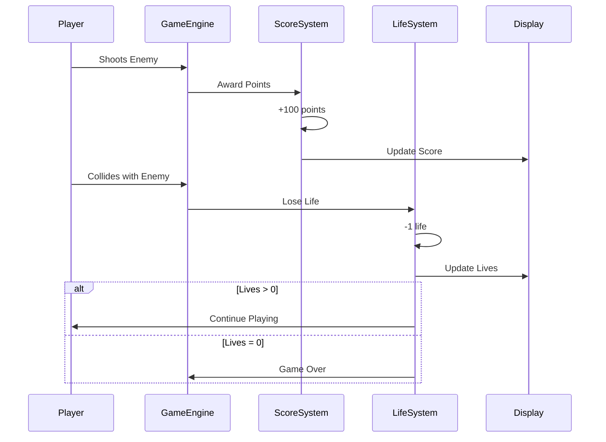
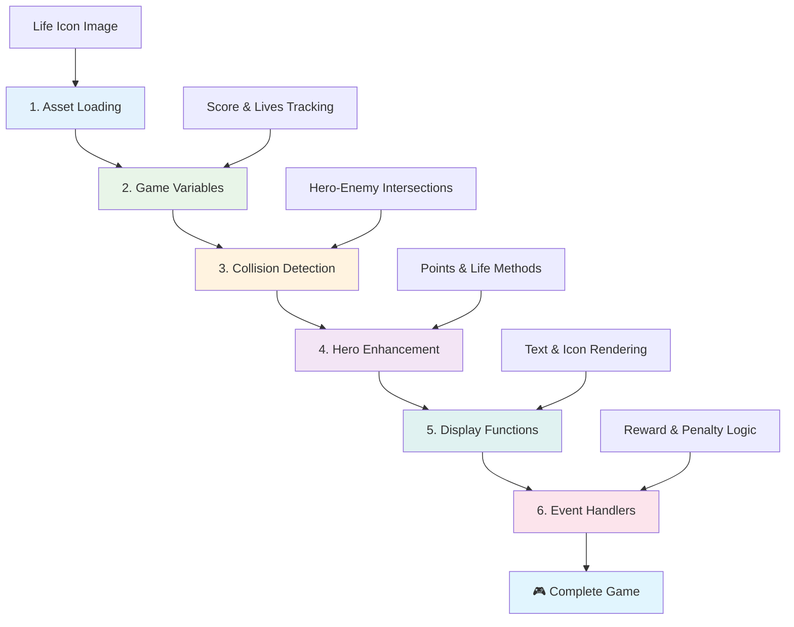
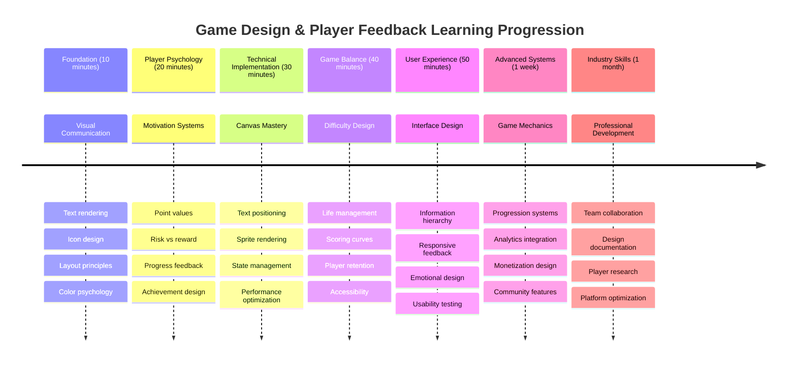

<!--
CO_OP_TRANSLATOR_METADATA:
{
  "original_hash": "2ed9145a16cf576faa2a973dff84d099",
  "translation_date": "2025-11-04T00:15:49+00:00",
  "source_file": "6-space-game/5-keeping-score/README.md",
  "language_code": "br"
}
-->
# Construa um Jogo Espacial Parte 5: Pontuação e Vidas



## Quiz Pré-Aula

[Quiz pré-aula](https://ff-quizzes.netlify.app/web/quiz/37)

Pronto para fazer seu jogo espacial parecer um jogo de verdade? Vamos adicionar pontuação e gerenciar vidas - as mecânicas principais que transformaram jogos de arcade como Space Invaders de simples demonstrações em entretenimento viciante. É aqui que seu jogo se torna realmente jogável.



## Exibindo Texto na Tela - A Voz do Seu Jogo

Para mostrar sua pontuação, precisamos aprender como renderizar texto no canvas. O método `fillText()` é sua principal ferramenta para isso - é a mesma técnica usada em jogos de arcade clássicos para exibir pontuações e informações de status.



Você tem controle total sobre a aparência do texto:

```javascript
ctx.font = "30px Arial";
ctx.fillStyle = "red";
ctx.textAlign = "right";
ctx.fillText("show this on the screen", 0, 0);
```

✅ Explore mais sobre [adicionar texto ao canvas](https://developer.mozilla.org/docs/Web/API/Canvas_API/Tutorial/Drawing_text) - você pode se surpreender com o quão criativo pode ser com fontes e estilos!

## Vidas - Mais do que Apenas um Número

No design de jogos, uma "vida" representa a margem de erro do jogador. Esse conceito remonta às máquinas de pinball, onde você tinha várias bolas para jogar. Em jogos de vídeo antigos como Asteroids, vidas davam aos jogadores permissão para correr riscos e aprender com os erros.



A representação visual é muito importante - exibir ícones de naves em vez de apenas "Vidas: 3" cria um reconhecimento visual imediato, semelhante ao modo como os gabinetes de arcade antigos usavam ícones para se comunicar além das barreiras linguísticas.

## Construindo o Sistema de Recompensas do Seu Jogo

Agora vamos implementar os sistemas de feedback principais que mantêm os jogadores engajados:



- **Sistema de pontuação**: Cada nave inimiga destruída concede 100 pontos (números redondos são mais fáceis para os jogadores calcularem mentalmente). A pontuação será exibida no canto inferior esquerdo.
- **Contador de vidas**: Seu herói começa com três vidas - um padrão estabelecido pelos jogos de arcade antigos para equilibrar desafio e jogabilidade. Cada colisão com um inimigo custa uma vida. Vamos exibir as vidas restantes no canto inferior direito usando ícones de nave .

## Vamos Começar!

Primeiro, configure seu ambiente de trabalho. Navegue até os arquivos na subpasta `your-work`. Você deve ver os seguintes arquivos:

```bash
-| assets
  -| enemyShip.png
  -| player.png
  -| laserRed.png
-| index.html
-| app.js
-| package.json
```

Para testar seu jogo, inicie o servidor de desenvolvimento a partir da pasta `your_work`:

```bash
cd your-work
npm start
```

Isso executa um servidor local em `http://localhost:5000`. Abra este endereço no seu navegador para ver seu jogo. Teste os controles com as teclas de seta e tente atirar nos inimigos para verificar se tudo está funcionando.



### Hora de Codificar!

1. **Pegue os recursos visuais necessários**. Copie o recurso `life.png` da pasta `solution/assets/` para sua pasta `your-work`. Depois, adicione o lifeImg à sua função window.onload:

    ```javascript
    lifeImg = await loadTexture("assets/life.png");
    ```

1. Não se esqueça de adicionar o `lifeImg` à sua lista de recursos:

    ```javascript
    let heroImg,
    ...
    lifeImg,
    ...
    eventEmitter = new EventEmitter();
    ```
  
2. **Configure as variáveis do jogo**. Adicione algum código para rastrear sua pontuação total (começando em 0) e vidas restantes (começando em 3). Vamos exibir essas informações na tela para que os jogadores sempre saibam sua situação.

3. **Implemente a detecção de colisão**. Estenda sua função `updateGameObjects()` para detectar quando os inimigos colidem com seu herói:

    ```javascript
    enemies.forEach(enemy => {
        const heroRect = hero.rectFromGameObject();
        if (intersectRect(heroRect, enemy.rectFromGameObject())) {
          eventEmitter.emit(Messages.COLLISION_ENEMY_HERO, { enemy });
        }
      })
    ```

4. **Adicione rastreamento de vidas e pontos ao seu Herói**. 
   1. **Inicialize os contadores**. Sob `this.cooldown = 0` na sua classe `Hero`, configure vidas e pontos:

        ```javascript
        this.life = 3;
        this.points = 0;
        ```

   1. **Mostre esses valores ao jogador**. Crie funções para desenhar esses valores na tela:

        ```javascript
        function drawLife() {
          // TODO, 35, 27
          const START_POS = canvas.width - 180;
          for(let i=0; i < hero.life; i++ ) {
            ctx.drawImage(
              lifeImg, 
              START_POS + (45 * (i+1) ), 
              canvas.height - 37);
          }
        }
        
        function drawPoints() {
          ctx.font = "30px Arial";
          ctx.fillStyle = "red";
          ctx.textAlign = "left";
          drawText("Points: " + hero.points, 10, canvas.height-20);
        }
        
        function drawText(message, x, y) {
          ctx.fillText(message, x, y);
        }

        ```

   1. **Conecte tudo ao loop do jogo**. Adicione essas funções à sua função window.onload logo após `updateGameObjects()`:

        ```javascript
        drawPoints();
        drawLife();
        ```

### 🔄 **Verificação Pedagógica**
**Entendimento de Design de Jogos**: Antes de implementar consequências, certifique-se de entender:
- ✅ Como o feedback visual comunica o estado do jogo aos jogadores
- ✅ Por que a colocação consistente de elementos da interface melhora a usabilidade
- ✅ A psicologia por trás dos valores de pontos e gerenciamento de vidas
- ✅ Como a renderização de texto no canvas difere do texto em HTML

**Teste Rápido**: Por que os jogos de arcade geralmente usam números redondos para valores de pontos?
*Resposta: Números redondos são mais fáceis para os jogadores calcularem mentalmente e criam recompensas psicológicas satisfatórias*

**Princípios de Experiência do Usuário**: Você está aplicando agora:
- **Hierarquia Visual**: Informações importantes posicionadas de forma proeminente
- **Feedback Imediato**: Atualizações em tempo real para ações do jogador
- **Carga Cognitiva**: Apresentação de informações simples e claras
- **Design Emocional**: Ícones e cores que criam conexão com o jogador

1. **Implemente consequências e recompensas no jogo**. Agora vamos adicionar os sistemas de feedback que tornam as ações do jogador significativas:

   1. **Colisões custam vidas**. Toda vez que seu herói colidir com um inimigo, você deve perder uma vida.
   
      Adicione este método à sua classe `Hero`:

        ```javascript
        decrementLife() {
          this.life--;
          if (this.life === 0) {
            this.dead = true;
          }
        }
        ```

   2. **Atirar em inimigos concede pontos**. Cada acerto bem-sucedido concede 100 pontos, proporcionando feedback positivo imediato para tiros precisos.

      Estenda sua classe Hero com este método de incremento:
    
        ```javascript
          incrementPoints() {
            this.points += 100;
          }
        ```

        Agora conecte essas funções aos eventos de colisão:

        ```javascript
        eventEmitter.on(Messages.COLLISION_ENEMY_LASER, (_, { first, second }) => {
           first.dead = true;
           second.dead = true;
           hero.incrementPoints();
        })

        eventEmitter.on(Messages.COLLISION_ENEMY_HERO, (_, { enemy }) => {
           enemy.dead = true;
           hero.decrementLife();
        });
        ```

✅ Curioso sobre outros jogos construídos com JavaScript e Canvas? Explore um pouco - você pode se surpreender com o que é possível!

Depois de implementar esses recursos, teste seu jogo para ver o sistema completo de feedback em ação. Você deve ver ícones de vida no canto inferior direito, sua pontuação no canto inferior esquerdo, e observar como colisões reduzem vidas enquanto tiros bem-sucedidos aumentam sua pontuação.

Seu jogo agora tem as mecânicas essenciais que tornaram os jogos de arcade antigos tão envolventes - objetivos claros, feedback imediato e consequências significativas para as ações do jogador.

### 🔄 **Verificação Pedagógica**
**Sistema Completo de Design de Jogos**: Verifique sua compreensão dos sistemas de feedback do jogador:
- ✅ Como as mecânicas de pontuação criam motivação e engajamento do jogador?
- ✅ Por que a consistência visual é importante para o design da interface do usuário?
- ✅ Como o sistema de vidas equilibra desafio com retenção do jogador?
- ✅ Qual é o papel do feedback imediato na criação de uma jogabilidade satisfatória?

**Integração de Sistemas**: Seu sistema de feedback demonstra:
- **Design de Experiência do Usuário**: Comunicação visual clara e hierarquia de informações
- **Arquitetura Orientada a Eventos**: Atualizações responsivas às ações do jogador
- **Gerenciamento de Estado**: Rastreamento e exibição de dados dinâmicos do jogo
- **Domínio do Canvas**: Renderização de texto e posicionamento de sprites
- **Psicologia de Jogos**: Compreensão da motivação e engajamento do jogador

**Padrões Profissionais**: Você implementou:
- **Arquitetura MVC**: Separação de lógica do jogo, dados e apresentação
- **Padrão Observer**: Atualizações orientadas a eventos para mudanças de estado do jogo
- **Design de Componentes**: Funções reutilizáveis para renderização e lógica
- **Otimização de Desempenho**: Renderização eficiente em loops de jogo

### ⚡ **O que Você Pode Fazer nos Próximos 5 Minutos**
- [ ] Experimente diferentes tamanhos e cores de fonte para a exibição da pontuação
- [ ] Tente alterar os valores de pontos e veja como isso afeta a sensação do jogo
- [ ] Adicione declarações console.log para rastrear quando pontos e vidas mudam
- [ ] Teste casos extremos como ficar sem vidas ou alcançar pontuações altas

### 🎯 **O que Você Pode Realizar Nesta Hora**
- [ ] Complete o quiz pós-aula e entenda a psicologia do design de jogos
- [ ] Adicione efeitos sonoros para pontuação e perda de vidas
- [ ] Implemente um sistema de pontuação alta usando localStorage
- [ ] Crie valores de pontos diferentes para diferentes tipos de inimigos
- [ ] Adicione efeitos visuais como tremor de tela ao perder uma vida

### 📅 **Sua Jornada de Design de Jogos de Uma Semana**
- [ ] Complete o jogo espacial completo com sistemas de feedback refinados
- [ ] Implemente mecânicas avançadas de pontuação como multiplicadores de combo
- [ ] Adicione conquistas e conteúdo desbloqueável
- [ ] Crie sistemas de progressão de dificuldade e balanceamento
- [ ] Projete interfaces de usuário para menus e telas de fim de jogo
- [ ] Estude outros jogos para entender os mecanismos de engajamento

### 🌟 **Sua Maestria em Desenvolvimento de Jogos em Um Mês**
- [ ] Construa jogos completos com sistemas de progressão sofisticados
- [ ] Aprenda análise de jogos e medição de comportamento do jogador
- [ ] Contribua para projetos de desenvolvimento de jogos de código aberto
- [ ] Domine padrões avançados de design de jogos e monetização
- [ ] Crie conteúdo educacional sobre design de jogos e experiência do usuário
- [ ] Construa um portfólio mostrando habilidades de design e desenvolvimento de jogos

## 🎯 Cronograma de Maestria em Design de Jogos



### 🛠️ Resumo do Kit de Ferramentas de Design de Jogos

Após concluir esta lição, você agora domina:
- **Psicologia do Jogador**: Compreensão de motivação, risco/recompensa e ciclos de engajamento
- **Comunicação Visual**: Design de interface eficaz usando texto, ícones e layout
- **Sistemas de Feedback**: Resposta em tempo real às ações do jogador e eventos do jogo
- **Gerenciamento de Estado**: Rastreamento e exibição eficiente de dados dinâmicos do jogo
- **Renderização de Texto no Canvas**: Exibição profissional de texto com estilo e posicionamento
- **Integração de Eventos**: Conexão de ações do usuário a consequências significativas no jogo
- **Balanceamento de Jogos**: Design de curvas de dificuldade e sistemas de progressão do jogador

**Aplicações no Mundo Real**: Suas habilidades de design de jogos se aplicam diretamente a:
- **Design de Interface do Usuário**: Criar interfaces envolventes e intuitivas
- **Desenvolvimento de Produtos**: Compreensão de motivação do usuário e ciclos de feedback
- **Tecnologia Educacional**: Sistemas de gamificação e engajamento de aprendizado
- **Visualização de Dados**: Tornar informações complexas acessíveis e envolventes
- **Desenvolvimento de Aplicativos Móveis**: Mecânicas de retenção e design de experiência do usuário
- **Tecnologia de Marketing**: Compreensão do comportamento do usuário e otimização de conversão

**Habilidades Profissionais Adquiridas**: Agora você pode:
- **Projetar** experiências de usuário que motivam e engajam os usuários
- **Implementar** sistemas de feedback que guiam o comportamento do usuário de forma eficaz
- **Balancear** desafio e acessibilidade em sistemas interativos
- **Criar** comunicação visual que funcione para diferentes grupos de usuários
- **Analisar** o comportamento do usuário e iterar melhorias de design

**Conceitos de Desenvolvimento de Jogos Dominados**:
- **Motivação do Jogador**: Compreensão do que impulsiona engajamento e retenção
- **Design Visual**: Criação de interfaces claras, atraentes e funcionais
- **Integração de Sistemas**: Conexão de múltiplos sistemas de jogo para uma experiência coesa
- **Otimização de Desempenho**: Renderização eficiente e gerenciamento de estado
- **Acessibilidade**: Design para diferentes níveis de habilidade e necessidades dos jogadores

**Próximo Nível**: Você está pronto para explorar padrões avançados de design de jogos, implementar sistemas de análise ou estudar estratégias de monetização e retenção de jogadores!

🌟 **Conquista Desbloqueada**: Você construiu um sistema completo de feedback do jogador com princípios profissionais de design de jogos!

---

## Desafio do Agente GitHub Copilot 🚀

Use o modo Agente para completar o seguinte desafio:

**Descrição:** Melhore o sistema de pontuação do jogo espacial implementando um recurso de pontuação alta com armazenamento persistente e mecânicas de pontuação bônus.

**Prompt:** Crie um sistema de pontuação alta que salve a melhor pontuação do jogador no localStorage. Adicione pontos bônus para mortes consecutivas de inimigos (sistema de combo) e implemente valores de pontos diferentes para diferentes tipos de inimigos. Inclua um indicador visual quando o jogador alcançar uma nova pontuação alta e exiba a pontuação alta atual na tela do jogo.


## 🚀 Desafio

Agora você tem um jogo funcional com pontuação e vidas. Considere quais recursos adicionais podem melhorar a experiência do jogador.

## Quiz Pós-Aula

[Quiz pós-aula](https://ff-quizzes.netlify.app/web/quiz/38)

## Revisão & Autoestudo

Quer explorar mais? Pesquise diferentes abordagens para sistemas de pontuação e vidas em jogos. Existem motores de jogos fascinantes por aí, como o [PlayFab](https://playfab.com), que lidam com pontuação, rankings e progressão do jogador. Como integrar algo assim poderia levar seu jogo para o próximo nível?

## Tarefa

[Construa um Jogo de Pontuação](assignment.md)

---

**Aviso Legal**:  
Este documento foi traduzido utilizando o serviço de tradução por IA [Co-op Translator](https://github.com/Azure/co-op-translator). Embora nos esforcemos para garantir a precisão, esteja ciente de que traduções automáticas podem conter erros ou imprecisões. O documento original em seu idioma nativo deve ser considerado a fonte autoritativa. Para informações críticas, recomenda-se a tradução profissional humana. Não nos responsabilizamos por quaisquer mal-entendidos ou interpretações incorretas decorrentes do uso desta tradução.