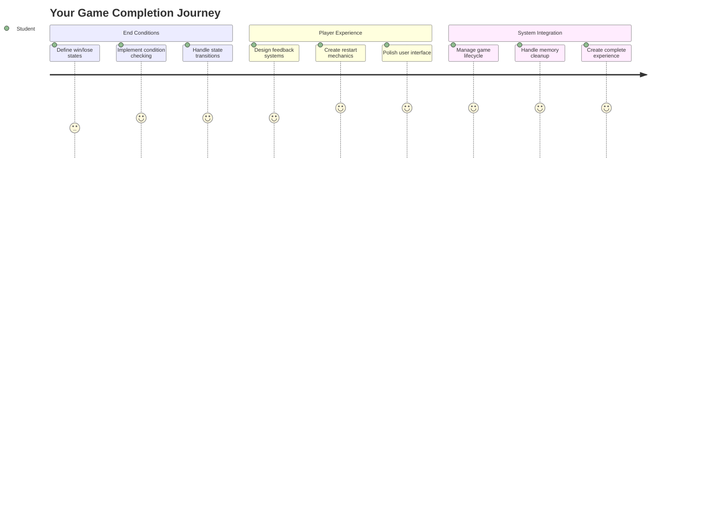
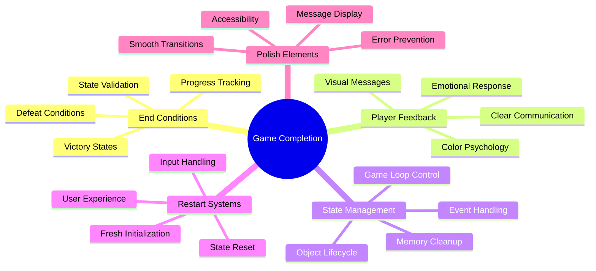
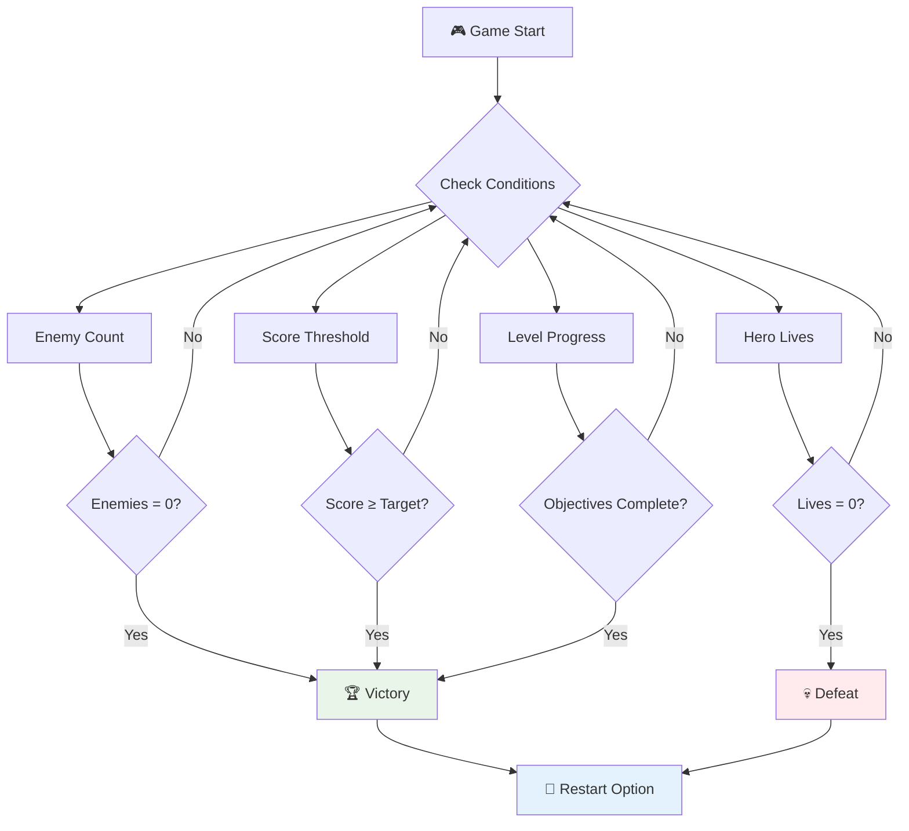
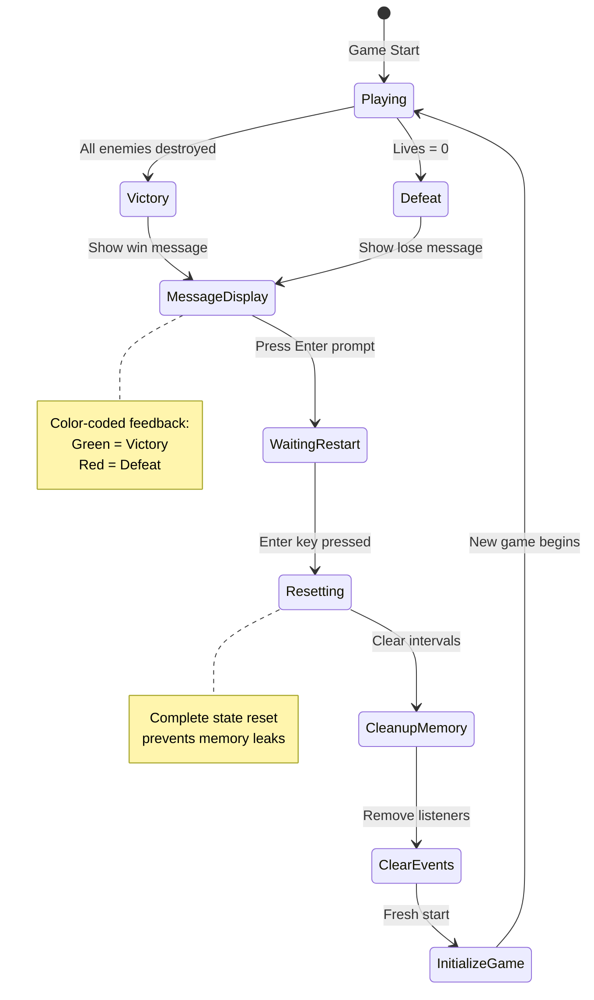
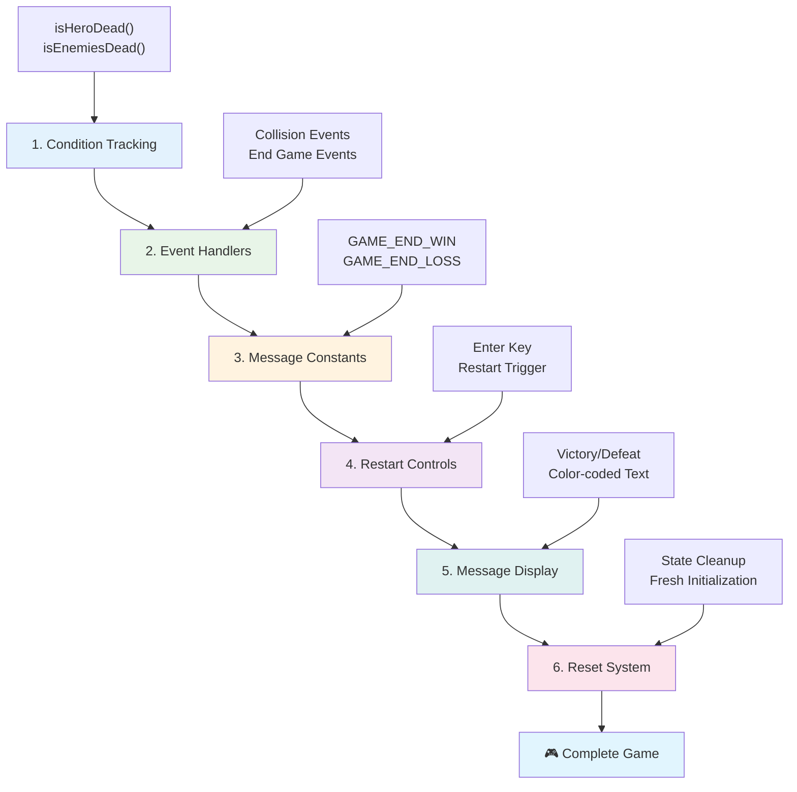
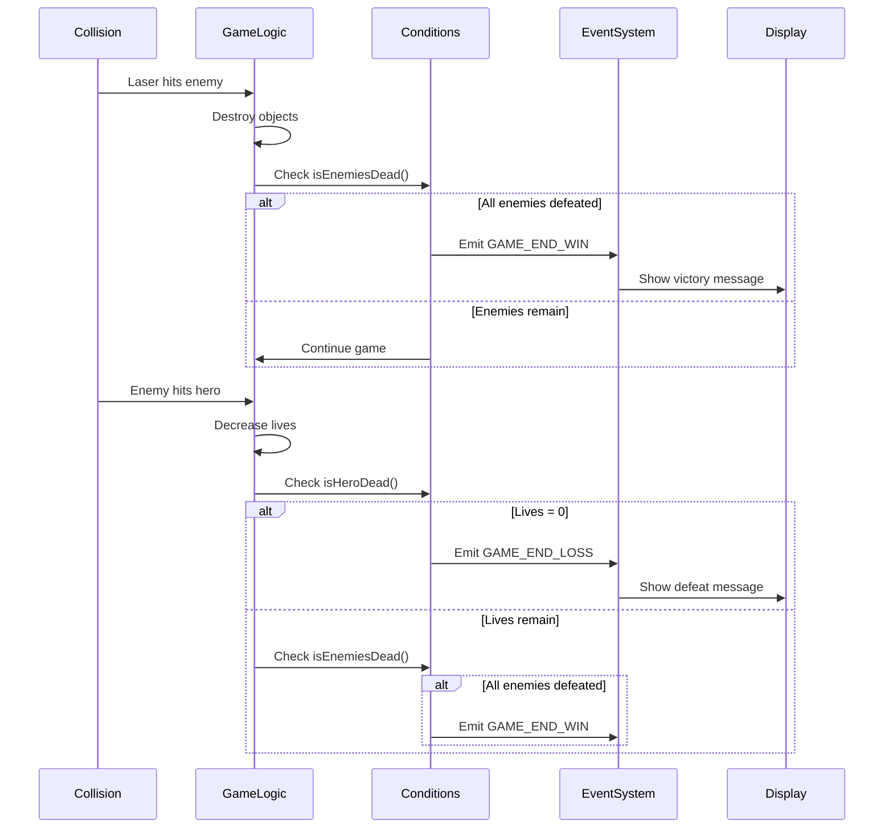
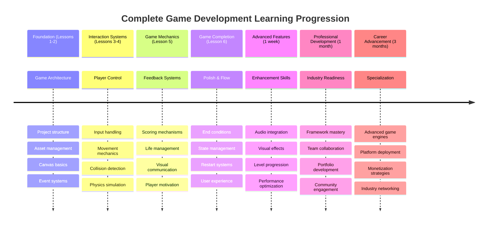

<!--
CO_OP_TRANSLATOR_METADATA:
{
  "original_hash": "a4b78043f4d64bf3ee24e0689b8b391d",
  "translation_date": "2025-11-04T00:14:09+00:00",
  "source_file": "6-space-game/6-end-condition/README.md",
  "language_code": "br"
}
-->
# Construa um Jogo Espacial Parte 6: Fim e Reinício



Todo grande jogo precisa de condições claras de término e um mecanismo de reinício suave. Você construiu um impressionante jogo espacial com movimento, combate e pontuação - agora é hora de adicionar as peças finais que o tornam completo.

Seu jogo atualmente funciona indefinidamente, como as sondas Voyager que a NASA lançou em 1977 - ainda viajando pelo espaço décadas depois. Embora isso seja ótimo para exploração espacial, jogos precisam de pontos finais definidos para criar experiências satisfatórias.

Hoje, vamos implementar condições adequadas de vitória/derrota e um sistema de reinício. Ao final desta lição, você terá um jogo polido que os jogadores podem completar e jogar novamente, assim como os clássicos jogos de arcade que definiram o meio.



## Quiz Pré-Aula

[Quiz pré-aula](https://ff-quizzes.netlify.app/web/quiz/39)

## Entendendo as Condições de Término do Jogo

Quando seu jogo deve terminar? Essa pergunta fundamental moldou o design de jogos desde a era dos primeiros arcades. Pac-Man termina quando você é pego pelos fantasmas ou limpa todos os pontos, enquanto Space Invaders termina quando os alienígenas alcançam o fundo ou você os destrói todos.

Como criador do jogo, você define as condições de vitória e derrota. Para nosso jogo espacial, aqui estão abordagens comprovadas que criam uma jogabilidade envolvente:



- **`N` Naves inimigas foram destruídas**: É bastante comum, se você dividir um jogo em diferentes níveis, que seja necessário destruir `N` naves inimigas para completar um nível.
- **Sua nave foi destruída**: Existem jogos em que você perde se sua nave for destruída. Outra abordagem comum é ter o conceito de vidas. Cada vez que sua nave é destruída, uma vida é deduzida. Quando todas as vidas forem perdidas, você perde o jogo.
- **Você coletou `N` pontos**: Outra condição comum de término é coletar pontos. Como você ganha pontos depende de você, mas é bastante comum atribuir pontos a várias atividades, como destruir uma nave inimiga ou coletar itens que caem quando são destruídos.
- **Completar um nível**: Isso pode envolver várias condições, como `X` naves inimigas destruídas, `Y` pontos coletados ou talvez um item específico tenha sido coletado.

## Implementando Funcionalidade de Reinício do Jogo

Bons jogos incentivam a rejogabilidade por meio de mecanismos de reinício suaves. Quando os jogadores completam um jogo (ou enfrentam a derrota), eles frequentemente querem tentar novamente imediatamente - seja para superar sua pontuação ou melhorar seu desempenho.



Tetris exemplifica isso perfeitamente: quando seus blocos alcançam o topo, você pode começar um novo jogo instantaneamente sem navegar por menus complexos. Vamos construir um sistema de reinício semelhante que redefine o estado do jogo de forma limpa e coloca os jogadores de volta em ação rapidamente.

✅ **Reflexão**: Pense nos jogos que você já jogou. Em quais condições eles terminam e como você é incentivado a reiniciar? O que torna uma experiência de reinício suave ou frustrante?

## O Que Você Vai Construir

Você implementará os recursos finais que transformarão seu projeto em uma experiência de jogo completa. Esses elementos distinguem jogos polidos de protótipos básicos.

**Aqui está o que vamos adicionar hoje:**

1. **Condição de vitória**: Destrua todos os inimigos e receba uma celebração adequada (você merece!)
2. **Condição de derrota**: Fique sem vidas e enfrente a tela de derrota
3. **Mecanismo de reinício**: Aperte Enter para voltar ao jogo - porque uma partida nunca é suficiente
4. **Gerenciamento de estado**: Tudo limpo a cada vez - sem inimigos sobrando ou falhas estranhas do último jogo

## Começando

Vamos preparar seu ambiente de desenvolvimento. Você deve ter todos os arquivos do jogo espacial das lições anteriores prontos.

**Seu projeto deve se parecer com isso:**

```bash
-| assets
  -| enemyShip.png
  -| player.png
  -| laserRed.png
  -| life.png
-| index.html
-| app.js
-| package.json
```

**Inicie seu servidor de desenvolvimento:**

```bash
cd your-work
npm start
```

**Este comando:**
- Executa um servidor local em `http://localhost:5000`
- Serve seus arquivos corretamente
- Atualiza automaticamente quando você faz alterações

Abra `http://localhost:5000` no seu navegador e verifique se seu jogo está funcionando. Você deve ser capaz de se mover, atirar e interagir com os inimigos. Uma vez confirmado, podemos prosseguir com a implementação.

> 💡 **Dica Pro**: Para evitar avisos no Visual Studio Code, declare `gameLoopId` no topo do seu arquivo como `let gameLoopId;` em vez de declará-lo dentro da função `window.onload`. Isso segue as melhores práticas modernas de declaração de variáveis em JavaScript.



## Etapas de Implementação

### Etapa 1: Criar Funções de Rastreamento de Condições de Término

Precisamos de funções para monitorar quando o jogo deve terminar. Como sensores na Estação Espacial Internacional que monitoram constantemente sistemas críticos, essas funções verificarão continuamente o estado do jogo.

```javascript
function isHeroDead() {
  return hero.life <= 0;
}

function isEnemiesDead() {
  const enemies = gameObjects.filter((go) => go.type === "Enemy" && !go.dead);
  return enemies.length === 0;
}
```

**Aqui está o que está acontecendo nos bastidores:**
- **Verifica** se nosso herói está sem vidas (ai!)
- **Conta** quantos inimigos ainda estão vivos e ativos
- **Retorna** `true` quando o campo de batalha está limpo de inimigos
- **Usa** lógica simples de verdadeiro/falso para manter as coisas diretas
- **Filtra** todos os objetos do jogo para encontrar os sobreviventes

### Etapa 2: Atualizar Manipuladores de Eventos para Condições de Término

Agora vamos conectar essas verificações de condição ao sistema de eventos do jogo. Toda vez que ocorre uma colisão, o jogo avaliará se isso desencadeia uma condição de término. Isso cria um feedback imediato para eventos críticos do jogo.



```javascript
eventEmitter.on(Messages.COLLISION_ENEMY_LASER, (_, { first, second }) => {
    first.dead = true;
    second.dead = true;
    hero.incrementPoints();

    if (isEnemiesDead()) {
      eventEmitter.emit(Messages.GAME_END_WIN);
    }
});

eventEmitter.on(Messages.COLLISION_ENEMY_HERO, (_, { enemy }) => {
    enemy.dead = true;
    hero.decrementLife();
    if (isHeroDead())  {
      eventEmitter.emit(Messages.GAME_END_LOSS);
      return; // loss before victory
    }
    if (isEnemiesDead()) {
      eventEmitter.emit(Messages.GAME_END_WIN);
    }
});

eventEmitter.on(Messages.GAME_END_WIN, () => {
    endGame(true);
});
  
eventEmitter.on(Messages.GAME_END_LOSS, () => {
  endGame(false);
});
```

**O que está acontecendo aqui:**
- **Laser atinge inimigo**: Ambos desaparecem, você ganha pontos e verificamos se você venceu
- **Inimigo atinge você**: Você perde uma vida e verificamos se você ainda está vivo
- **Ordenação inteligente**: Verificamos a derrota primeiro (ninguém quer ganhar e perder ao mesmo tempo!)
- **Reações instantâneas**: Assim que algo importante acontece, o jogo sabe disso

### Etapa 3: Adicionar Novas Constantes de Mensagem

Você precisará adicionar novos tipos de mensagem ao seu objeto constante `Messages`. Essas constantes ajudam a manter a consistência e evitar erros de digitação no sistema de eventos.

```javascript
GAME_END_LOSS: "GAME_END_LOSS",
GAME_END_WIN: "GAME_END_WIN",
```

**No exemplo acima, nós:**
- **Adicionamos** constantes para eventos de término de jogo para manter a consistência
- **Usamos** nomes descritivos que indicam claramente o propósito do evento
- **Seguimos** a convenção de nomenclatura existente para tipos de mensagem

### Etapa 4: Implementar Controles de Reinício

Agora você adicionará controles de teclado que permitem aos jogadores reiniciar o jogo. A tecla Enter é uma escolha natural, pois é comumente associada à confirmação de ações e início de novos jogos.

**Adicione a detecção da tecla Enter ao seu listener de eventos de keydown existente:**

```javascript
else if(evt.key === "Enter") {
   eventEmitter.emit(Messages.KEY_EVENT_ENTER);
}
```

**Adicione a nova constante de mensagem:**

```javascript
KEY_EVENT_ENTER: "KEY_EVENT_ENTER",
```

**O que você precisa saber:**
- **Estende** seu sistema de manipulação de eventos de teclado existente
- **Usa** a tecla Enter como gatilho de reinício para uma experiência intuitiva
- **Emite** um evento personalizado que outras partes do jogo podem ouvir
- **Mantém** o mesmo padrão que seus outros controles de teclado

### Etapa 5: Criar o Sistema de Exibição de Mensagens

Seu jogo precisa comunicar os resultados claramente aos jogadores. Vamos criar um sistema de mensagens que exibe estados de vitória e derrota usando texto colorido, semelhante às interfaces de terminal dos primeiros computadores, onde verde indicava sucesso e vermelho sinalizava erros.

**Crie a função `displayMessage()`:**

```javascript
function displayMessage(message, color = "red") {
  ctx.font = "30px Arial";
  ctx.fillStyle = color;
  ctx.textAlign = "center";
  ctx.fillText(message, canvas.width / 2, canvas.height / 2);
}
```

**Passo a passo, aqui está o que está acontecendo:**
- **Define** o tamanho e a família da fonte para texto claro e legível
- **Aplica** um parâmetro de cor com "vermelho" como padrão para avisos
- **Centraliza** o texto horizontal e verticalmente no canvas
- **Usa** parâmetros padrão modernos do JavaScript para opções de cor flexíveis
- **Aproveita** o contexto 2D do canvas para renderização direta de texto

**Crie a função `endGame()`:**

```javascript
function endGame(win) {
  clearInterval(gameLoopId);

  // Set a delay to ensure any pending renders complete
  setTimeout(() => {
    ctx.clearRect(0, 0, canvas.width, canvas.height);
    ctx.fillStyle = "black";
    ctx.fillRect(0, 0, canvas.width, canvas.height);
    if (win) {
      displayMessage(
        "Victory!!! Pew Pew... - Press [Enter] to start a new game Captain Pew Pew",
        "green"
      );
    } else {
      displayMessage(
        "You died !!! Press [Enter] to start a new game Captain Pew Pew"
      );
    }
  }, 200)  
}
```

**O que essa função faz:**
- **Congela** tudo no lugar - sem mais naves ou lasers se movendo
- **Faz** uma pequena pausa (200ms) para permitir que o último quadro seja desenhado
- **Limpa** a tela e a pinta de preto para um efeito dramático
- **Exibe** mensagens diferentes para vencedores e perdedores
- **Codifica por cores** as notícias - verde para boas, vermelho para... bem, não tão boas
- **Informa** aos jogadores exatamente como voltar ao jogo

### 🔄 **Checagem Pedagógica**
**Gerenciamento de Estado do Jogo**: Antes de implementar a funcionalidade de reinício, certifique-se de entender:
- ✅ Como as condições de término criam objetivos claros de jogabilidade
- ✅ Por que o feedback visual é essencial para a compreensão do jogador
- ✅ A importância de uma limpeza adequada para evitar vazamentos de memória
- ✅ Como a arquitetura orientada a eventos permite transições de estado limpas

**Teste Rápido**: O que aconteceria se você não limpasse os listeners de eventos durante o reinício?
*Resposta: Vazamentos de memória e handlers de eventos duplicados causando comportamento imprevisível*

**Princípios de Design de Jogos**: Você está implementando:
- **Objetivos Claros**: Os jogadores sabem exatamente o que define sucesso e fracasso
- **Feedback Imediato**: Mudanças no estado do jogo são comunicadas instantaneamente
- **Controle do Usuário**: Os jogadores podem reiniciar quando estiverem prontos
- **Confiabilidade do Sistema**: A limpeza adequada evita bugs e problemas de desempenho

### Etapa 6: Implementar Funcionalidade de Reinício do Jogo

O sistema de reinício precisa limpar completamente o estado atual do jogo e inicializar uma nova sessão de jogo. Isso garante que os jogadores tenham um início limpo sem dados remanescentes do jogo anterior.

**Crie a função `resetGame()`:**

```javascript
function resetGame() {
  if (gameLoopId) {
    clearInterval(gameLoopId);
    eventEmitter.clear();
    initGame();
    gameLoopId = setInterval(() => {
      ctx.clearRect(0, 0, canvas.width, canvas.height);
      ctx.fillStyle = "black";
      ctx.fillRect(0, 0, canvas.width, canvas.height);
      drawPoints();
      drawLife();
      updateGameObjects();
      drawGameObjects(ctx);
    }, 100);
  }
}
```

**Vamos entender cada parte:**
- **Verifica** se um loop de jogo está atualmente em execução antes de reiniciar
- **Limpa** o loop de jogo existente para parar toda atividade atual do jogo
- **Remove** todos os listeners de eventos para evitar vazamentos de memória
- **Reinicializa** o estado do jogo com objetos e variáveis novas
- **Inicia** um novo loop de jogo com todas as funções essenciais do jogo
- **Mantém** o mesmo intervalo de 100ms para desempenho consistente do jogo

**Adicione o handler de evento da tecla Enter à sua função `initGame()`:**

```javascript
eventEmitter.on(Messages.KEY_EVENT_ENTER, () => {
  resetGame();
});
```

**Adicione o método `clear()` à sua classe EventEmitter:**

```javascript
clear() {
  this.listeners = {};
}
```

**Pontos-chave para lembrar:**
- **Conecta** o pressionamento da tecla Enter à funcionalidade de reinício do jogo
- **Registra** esse listener de evento durante a inicialização do jogo
- **Fornece** uma maneira limpa de remover todos os listeners de eventos ao reiniciar
- **Previne** vazamentos de memória limpando os handlers de eventos entre os jogos
- **Reseta** o objeto de listeners para um estado vazio para uma inicialização nova

## Parabéns! 🎉

👽 💥 🚀 Você construiu com sucesso um jogo completo do zero. Como os programadores que criaram os primeiros videogames nos anos 1970, você transformou linhas de código em uma experiência interativa com mecânicas de jogo e feedback ao usuário adequados. 🚀 💥 👽

**Você alcançou:**
- **Implementou** condições completas de vitória e derrota com feedback ao usuário
- **Criou** um sistema de reinício suave para jogabilidade contínua
- **Projetou** comunicação visual clara para estados do jogo
- **Gerenciou** transições complexas de estado do jogo e limpeza
- **Montou** todos os componentes em um jogo coeso e jogável

### 🔄 **Checagem Pedagógica**
**Sistema Completo de Desenvolvimento de Jogos**: Celebre sua maestria no ciclo completo de desenvolvimento de jogos:
- ✅ Como as condições de término criam experiências satisfatórias para os jogadores?
- ✅ Por que o gerenciamento adequado de estado é crítico para a estabilidade do jogo?
- ✅ Como o feedback visual melhora a compreensão do jogador?
- ✅ Qual é o papel do sistema de reinício na retenção de jogadores?

**Domínio do Sistema**: Seu jogo completo demonstra:
- **Desenvolvimento de Jogos Full-Stack**: De gráficos a entrada e gerenciamento de estado
- **Arquitetura Profissional**: Sistemas orientados a eventos com limpeza adequada
- **Design de Experiência do Usuário**: Feedback claro e controles intuitivos
- **Otimização de Desempenho**: Renderização eficiente e gerenciamento de memória
- **Polimento e Completude**: Todos os detalhes que fazem um jogo parecer finalizado

**Habilidades Prontas para o Mercado**: Você implementou:
- **Arquitetura de Loop de Jogo**: Sistemas em tempo real com desempenho consistente
- **Programação Orientada a Eventos**: Sistemas desacoplados que escalam efetivamente
- **Gerenciamento de Estado**: Manipulação de dados complexos e gerenciamento de ciclo de vida
- **Design de Interface do Usuário**: Comunicação clara e controles responsivos
- **Testes e Depuração**: Desenvolvimento iterativo e resolução de problemas

### ⚡ **O Que Você Pode Fazer nos Próximos 5 Minutos**
- [ ] Jogue seu jogo completo e teste todas as condições de vitória e derrota
- [ ] Experimente diferentes parâmetros de condições de término
- [ ] Tente adicionar declarações console.log para rastrear mudanças no estado do jogo
- [ ] Compartilhe seu jogo com amigos e colete feedback

### 🎯 **O Que Você Pode Alcançar Nesta Hora**
- [ ] Complete o quiz pós-aula e reflita sobre sua jornada de desenvolvimento de jogos
- [ ] Adicione efeitos sonoros para os estados de vitória e derrota
- [ ] Implemente condições adicionais de término, como limites de tempo ou objetivos bônus
- [ ] Crie diferentes níveis de dificuldade com quantidades variadas de inimigos
- [ ] Aperfeiçoe a apresentação visual com fontes e cores melhores

### 📅 **Sua Maestria em Desenvolvimento de Jogos ao Longo da Semana**
- [ ] Complete o jogo espacial aprimorado com múltiplos níveis e progressão
- [ ] Adicione recursos avançados como power-ups, diferentes tipos de inimigos e armas especiais
- [ ] Crie um sistema de pontuação máxima com armazenamento persistente
- [ ] Projete interfaces de usuário para menus, configurações e opções de jogo
- [ ] Otimize o desempenho para diferentes dispositivos e navegadores
- [ ] Publique seu jogo online e compartilhe com a comunidade
### 🌟 **Sua Carreira de Desenvolvimento de Jogos em Um Mês**
- [ ] Crie vários jogos completos explorando diferentes gêneros e mecânicas
- [ ] Aprenda frameworks avançados de desenvolvimento de jogos como Phaser ou Three.js
- [ ] Contribua para projetos de desenvolvimento de jogos de código aberto
- [ ] Estude princípios de design de jogos e psicologia do jogador
- [ ] Crie um portfólio mostrando suas habilidades em desenvolvimento de jogos
- [ ] Conecte-se com a comunidade de desenvolvimento de jogos e continue aprendendo

## 🎯 Cronograma Completo de Domínio do Desenvolvimento de Jogos



### 🛠️ Resumo Completo do Seu Kit de Ferramentas de Desenvolvimento de Jogos

Após concluir toda esta série de jogos espaciais, você terá dominado:
- **Arquitetura de Jogos**: Sistemas baseados em eventos, loops de jogo e gerenciamento de estados
- **Programação Gráfica**: API Canvas, renderização de sprites e efeitos visuais
- **Sistemas de Entrada**: Controle de teclado, detecção de colisão e controles responsivos
- **Design de Jogos**: Feedback do jogador, sistemas de progressão e mecânicas de engajamento
- **Otimização de Desempenho**: Renderização eficiente, gerenciamento de memória e controle de taxa de quadros
- **Experiência do Usuário**: Comunicação clara, controles intuitivos e detalhes de acabamento
- **Padrões Profissionais**: Código limpo, técnicas de depuração e organização de projetos

**Aplicações no Mundo Real**: Suas habilidades em desenvolvimento de jogos se aplicam diretamente a:
- **Aplicativos Web Interativos**: Interfaces dinâmicas e sistemas em tempo real
- **Visualização de Dados**: Gráficos animados e interativos
- **Tecnologia Educacional**: Gamificação e experiências de aprendizado envolventes
- **Desenvolvimento Mobile**: Interações baseadas em toque e otimização de desempenho
- **Software de Simulação**: Motores de física e modelagem em tempo real
- **Indústrias Criativas**: Arte interativa, entretenimento e experiências digitais

**Habilidades Profissionais Adquiridas**: Agora você pode:
- **Arquitetar** sistemas interativos complexos do zero
- **Depurar** aplicativos em tempo real usando abordagens sistemáticas
- **Otimizar** o desempenho para experiências suaves do usuário
- **Projetar** interfaces de usuário envolventes e padrões de interação
- **Colaborar** efetivamente em projetos técnicos com organização de código adequada

**Conceitos de Desenvolvimento de Jogos Dominados**:
- **Sistemas em Tempo Real**: Loops de jogo, gerenciamento de taxa de quadros e desempenho
- **Arquitetura Baseada em Eventos**: Sistemas desacoplados e passagem de mensagens
- **Gerenciamento de Estados**: Manipulação de dados complexos e gerenciamento de ciclo de vida
- **Programação de Interface de Usuário**: Gráficos em Canvas e design responsivo
- **Teoria de Design de Jogos**: Psicologia do jogador e mecânicas de engajamento

**Próximo Nível**: Você está pronto para explorar frameworks avançados de jogos, gráficos 3D, sistemas multiplayer ou fazer a transição para funções profissionais de desenvolvimento de jogos!

🌟 **Conquista Desbloqueada**: Você completou uma jornada completa de desenvolvimento de jogos e criou uma experiência interativa de qualidade profissional do zero!

**Bem-vindo à comunidade de desenvolvimento de jogos!** 🎮✨

## Desafio do Agente GitHub Copilot 🚀

Use o modo Agente para completar o seguinte desafio:

**Descrição:** Melhore o jogo espacial implementando um sistema de progressão de níveis com dificuldade crescente e recursos bônus.

**Prompt:** Crie um sistema de jogo espacial com múltiplos níveis onde cada nível tenha mais naves inimigas com velocidade e saúde aumentadas. Adicione um multiplicador de pontuação que aumenta a cada nível e implemente power-ups (como disparo rápido ou escudo) que aparecem aleatoriamente quando inimigos são destruídos. Inclua um bônus de conclusão de nível e exiba o nível atual na tela junto com a pontuação e vidas existentes.

Saiba mais sobre [modo agente](https://code.visualstudio.com/blogs/2025/02/24/introducing-copilot-agent-mode) aqui.

## 🚀 Desafio de Melhoria Opcional

**Adicione Áudio ao Seu Jogo**: Melhore a experiência de jogo implementando efeitos sonoros! Considere adicionar áudio para:

- **Disparos de laser** quando o jogador atira
- **Destruição de inimigos** quando as naves são atingidas
- **Dano ao herói** quando o jogador sofre ataques
- **Música de vitória** quando o jogo é vencido
- **Som de derrota** quando o jogo é perdido

**Exemplo de implementação de áudio:**

```javascript
// Create audio objects
const laserSound = new Audio('assets/laser.wav');
const explosionSound = new Audio('assets/explosion.wav');

// Play sounds during game events
function playLaserSound() {
  laserSound.currentTime = 0; // Reset to beginning
  laserSound.play();
}
```

**O que você precisa saber:**
- **Cria** objetos de áudio para diferentes efeitos sonoros
- **Reseta** o `currentTime` para permitir efeitos sonoros rápidos
- **Lida** com políticas de autoplay do navegador ao ativar sons por interações do usuário
- **Gerencia** volume e tempo de áudio para uma melhor experiência de jogo

> 💡 **Recurso de Aprendizado**: Explore este [sandbox de áudio](https://www.w3schools.com/jsref/tryit.asp?filename=tryjsref_audio_play) para aprender mais sobre como implementar áudio em jogos JavaScript.

## Quiz Pós-Aula

[Quiz pós-aula](https://ff-quizzes.netlify.app/web/quiz/40)

## Revisão & Autoestudo

Sua tarefa é criar um novo jogo de amostra, então explore alguns jogos interessantes por aí para ver que tipo de jogo você pode construir.

## Tarefa

[Crie um Jogo de Amostra](assignment.md)

---

**Aviso Legal**:  
Este documento foi traduzido utilizando o serviço de tradução por IA [Co-op Translator](https://github.com/Azure/co-op-translator). Embora nos esforcemos para garantir a precisão, esteja ciente de que traduções automáticas podem conter erros ou imprecisões. O documento original em seu idioma nativo deve ser considerado a fonte autoritativa. Para informações críticas, recomenda-se a tradução profissional humana. Não nos responsabilizamos por quaisquer mal-entendidos ou interpretações incorretas decorrentes do uso desta tradução.