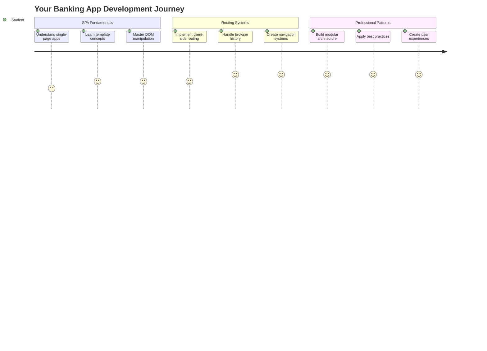
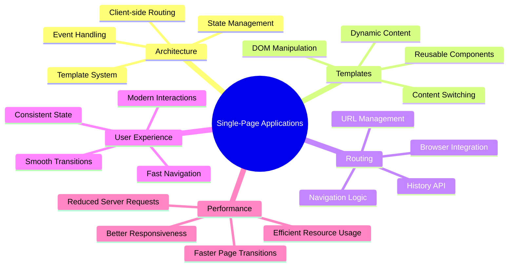
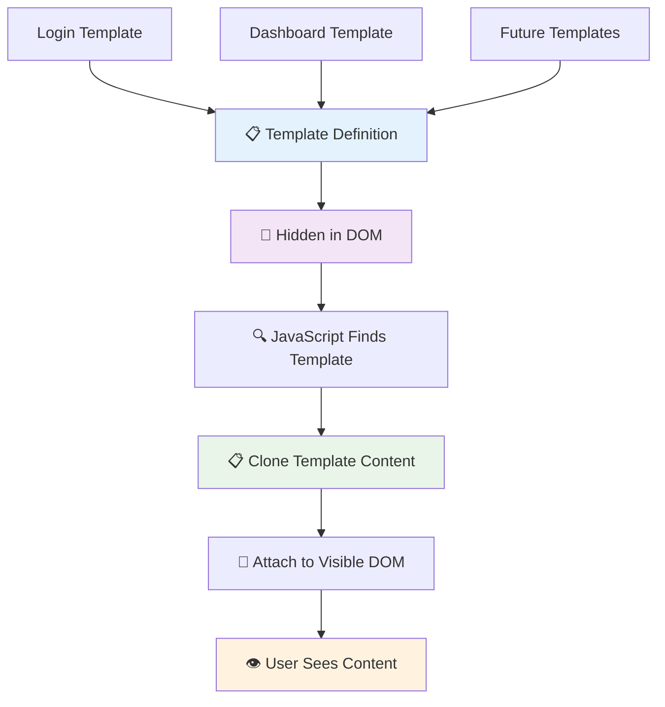
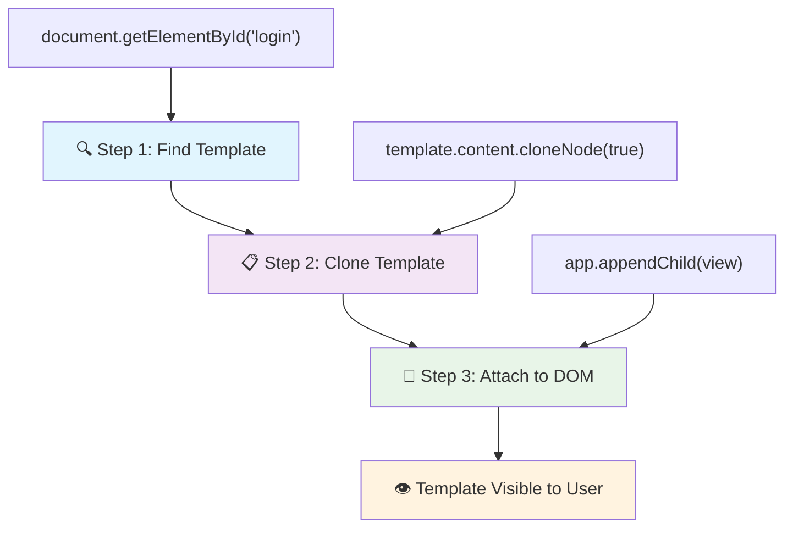
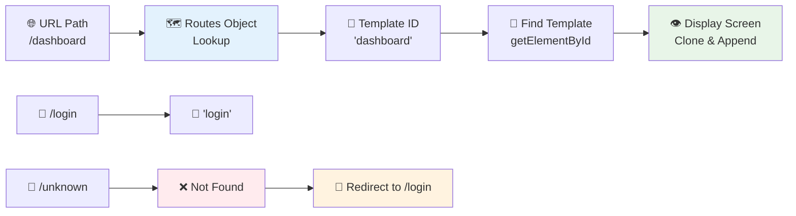
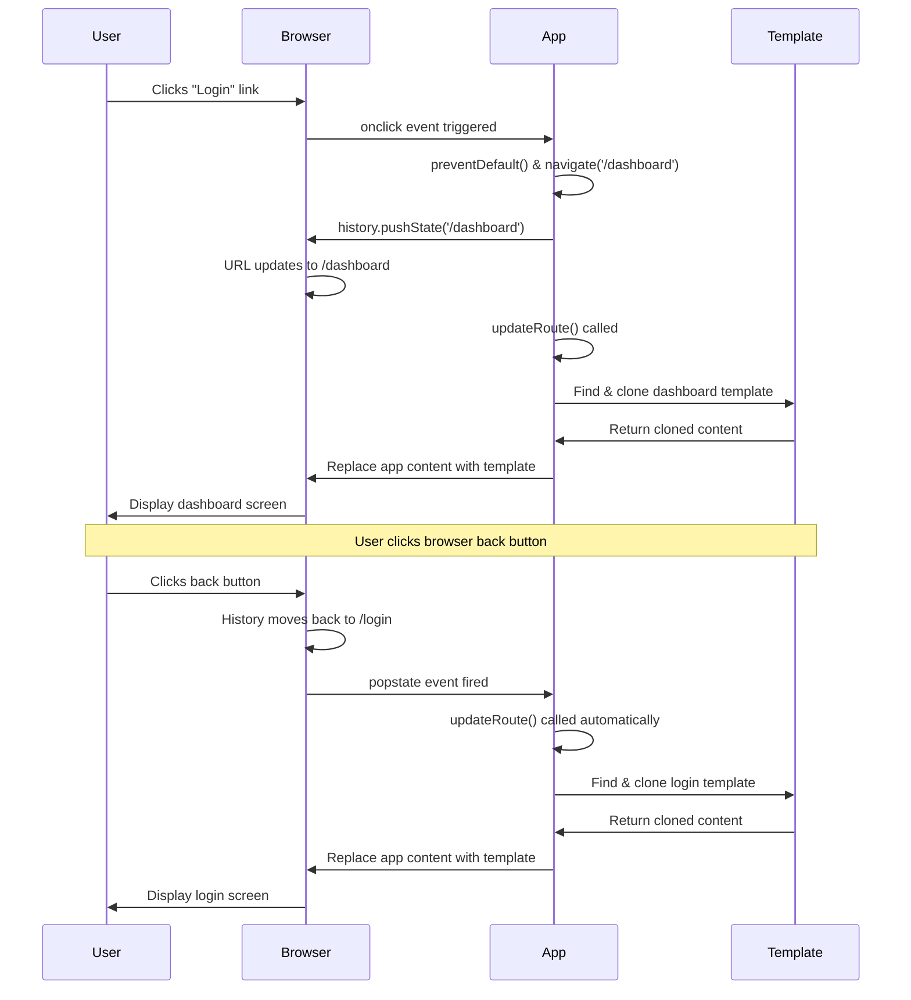
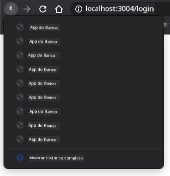
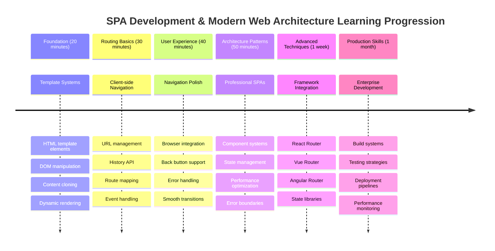

<!--
CO_OP_TRANSLATOR_METADATA:
{
  "original_hash": "351678bece18f07d9daa987a881fb062",
  "translation_date": "2025-11-04T00:10:18+00:00",
  "source_file": "7-bank-project/1-template-route/README.md",
  "language_code": "br"
}
-->
# Construindo um App Bancário Parte 1: Templates HTML e Rotas em um Aplicativo Web



Quando o computador de orientação da Apollo 11 navegou até a Lua em 1969, ele precisou alternar entre diferentes programas sem reiniciar todo o sistema. Aplicativos web modernos funcionam de forma semelhante – eles mudam o que você vê sem recarregar tudo do zero. Isso cria a experiência fluida e responsiva que os usuários esperam hoje.

Diferentemente dos sites tradicionais que recarregam páginas inteiras a cada interação, os aplicativos web modernos atualizam apenas as partes que precisam ser alteradas. Essa abordagem, muito parecida com a forma como o controle da missão alterna entre diferentes telas enquanto mantém a comunicação constante, cria a experiência fluida que estamos acostumados.

Aqui está o que torna a diferença tão dramática:

| Aplicativos Tradicionais de Múltiplas Páginas | Aplicativos Modernos de Página Única |
|-----------------------------------------------|-------------------------------------|
| **Navegação** | Recarregamento completo da página para cada tela | Troca instantânea de conteúdo |
| **Desempenho** | Mais lento devido ao download completo de HTML | Mais rápido com atualizações parciais |
| **Experiência do Usuário** | Trocas bruscas de página | Transições suaves, estilo aplicativo |
| **Compartilhamento de Dados** | Difícil entre páginas | Gerenciamento de estado facilitado |
| **Desenvolvimento** | Vários arquivos HTML para manter | Um único HTML com templates dinâmicos |

**Entendendo a evolução:**
- **Aplicativos tradicionais** exigem solicitações ao servidor para cada ação de navegação
- **SPAs modernos** carregam uma vez e atualizam o conteúdo dinamicamente usando JavaScript
- **Expectativas dos usuários** agora favorecem interações instantâneas e contínuas
- **Benefícios de desempenho** incluem menor uso de banda e respostas mais rápidas

Nesta lição, vamos construir um aplicativo bancário com várias telas que fluem perfeitamente entre si. Assim como os cientistas usam instrumentos modulares que podem ser reconfigurados para diferentes experimentos, usaremos templates HTML como componentes reutilizáveis que podem ser exibidos conforme necessário.

Você trabalhará com templates HTML (modelos reutilizáveis para diferentes telas), roteamento em JavaScript (o sistema que alterna entre telas) e a API de histórico do navegador (que mantém o botão de voltar funcionando como esperado). Estas são as mesmas técnicas fundamentais usadas por frameworks como React, Vue e Angular.

Ao final, você terá um aplicativo bancário funcional que demonstra os princípios profissionais de um aplicativo de página única.



## Quiz Pré-Aula

[Quiz pré-aula](https://ff-quizzes.netlify.app/web/quiz/41)

### O que Você Vai Precisar

Precisaremos de um servidor web local para testar nosso aplicativo bancário – não se preocupe, é mais fácil do que parece! Se você ainda não tiver um configurado, basta instalar [Node.js](https://nodejs.org) e executar `npx lite-server` na pasta do seu projeto. Este comando prático inicia um servidor local e abre automaticamente seu aplicativo no navegador.

### Preparação

No seu computador, crie uma pasta chamada `bank` com um arquivo chamado `index.html` dentro dela. Vamos começar com este [boilerplate HTML](https://en.wikipedia.org/wiki/Boilerplate_code):

```html
<!DOCTYPE html>
<html lang="en">
  <head>
    <meta charset="UTF-8">
    <meta name="viewport" content="width=device-width, initial-scale=1.0">
    <title>Bank App</title>
  </head>
  <body>
    <!-- This is where you'll work -->
  </body>
</html>
```

**O que este boilerplate fornece:**
- **Estabelece** a estrutura do documento HTML5 com a declaração DOCTYPE adequada
- **Configura** a codificação de caracteres como UTF-8 para suporte a texto internacional
- **Habilita** design responsivo com a tag meta viewport para compatibilidade móvel
- **Define** um título descritivo que aparece na aba do navegador
- **Cria** uma seção limpa no corpo onde construiremos nosso aplicativo

> 📁 **Prévia da Estrutura do Projeto**
> 
> **Ao final desta lição, seu projeto conterá:**
> ```
> bank/
> ├── index.html      <!-- Main HTML with templates -->
> ├── app.js          <!-- Routing and navigation logic -->
> └── style.css       <!-- (Optional for future lessons) -->
> ```
> 
> **Responsabilidades dos arquivos:**
> - **index.html**: Contém todos os templates e fornece a estrutura do aplicativo
> - **app.js**: Gerencia roteamento, navegação e templates
> - **Templates**: Definem a interface para login, painel e outras telas

---

## Templates HTML

Templates resolvem um problema fundamental no desenvolvimento web. Quando Gutenberg inventou a impressão com tipos móveis na década de 1440, ele percebeu que, em vez de esculpir páginas inteiras, poderia criar blocos de letras reutilizáveis e organizá-los conforme necessário. Templates HTML funcionam com o mesmo princípio – em vez de criar arquivos HTML separados para cada tela, você define estruturas reutilizáveis que podem ser exibidas quando necessário.



Pense nos templates como projetos para diferentes partes do seu aplicativo. Assim como um arquiteto cria um projeto e o utiliza várias vezes em vez de redesenhar salas idênticas, criamos templates uma vez e os instanciamos conforme necessário. O navegador mantém esses templates ocultos até que o JavaScript os ative.

Se você quiser criar várias telas para uma página web, uma solução seria criar um arquivo HTML para cada tela que deseja exibir. No entanto, essa solução traz algumas inconveniências:

- Você precisa recarregar todo o HTML ao alternar de tela, o que pode ser lento.
- É difícil compartilhar dados entre as diferentes telas.

Outra abordagem é ter apenas um arquivo HTML e definir múltiplos [templates HTML](https://developer.mozilla.org/docs/Web/HTML/Element/template) usando o elemento `<template>`. Um template é um bloco HTML reutilizável que não é exibido pelo navegador e precisa ser instanciado em tempo de execução usando JavaScript.

### Vamos Construir

Vamos criar um aplicativo bancário com duas telas principais: uma página de login e um painel. Primeiro, vamos adicionar um elemento de espaço reservado ao corpo do HTML – é aqui que todas as nossas diferentes telas aparecerão:

```html
<div id="app">Loading...</div>
```

**Entendendo este espaço reservado:**
- **Cria** um contêiner com o ID "app" onde todas as telas serão exibidas
- **Mostra** uma mensagem de carregamento até que o JavaScript inicialize a primeira tela
- **Fornece** um único ponto de montagem para nosso conteúdo dinâmico
- **Permite** fácil direcionamento a partir do JavaScript usando `document.getElementById()`

> 💡 **Dica Pro**: Como o conteúdo deste elemento será substituído, podemos colocar uma mensagem ou indicador de carregamento que será exibido enquanto o aplicativo está carregando.

Em seguida, vamos adicionar abaixo o template HTML para a página de login. Por enquanto, colocaremos apenas um título e uma seção contendo um link que usaremos para realizar a navegação.

```html
<template id="login">
  <h1>Bank App</h1>
  <section>
    <a href="/dashboard">Login</a>
  </section>
</template>
```

**Desmembrando este template de login:**
- **Define** um template com o identificador único "login" para direcionamento no JavaScript
- **Inclui** um cabeçalho principal que estabelece a marca do aplicativo
- **Contém** um elemento `<section>` semântico para agrupar conteúdo relacionado
- **Fornece** um link de navegação que levará os usuários ao painel

Depois, adicionaremos outro template HTML para a página do painel. Esta página conterá diferentes seções:

- Um cabeçalho com um título e um link de logout
- O saldo atual da conta bancária
- Uma lista de transações, exibida em uma tabela

```html
<template id="dashboard">
  <header>
    <h1>Bank App</h1>
    <a href="/login">Logout</a>
  </header>
  <section>
    Balance: 100$
  </section>
  <section>
    <h2>Transactions</h2>
    <table>
      <thead>
        <tr>
          <th>Date</th>
          <th>Object</th>
          <th>Amount</th>
        </tr>
      </thead>
      <tbody></tbody>
    </table>
  </section>
</template>
```

**Vamos entender cada parte deste painel:**
- **Estrutura** a página com um elemento `<header>` semântico contendo navegação
- **Exibe** o título do aplicativo de forma consistente entre as telas para branding
- **Fornece** um link de logout que leva de volta à tela de login
- **Mostra** o saldo atual da conta em uma seção dedicada
- **Organiza** os dados de transações usando uma tabela HTML estruturada corretamente
- **Define** cabeçalhos de tabela para as colunas Data, Objeto e Valor
- **Deixa** o corpo da tabela vazio para injeção de conteúdo dinâmico posteriormente

> 💡 **Dica Pro**: Ao criar templates HTML, se você quiser ver como ficará, pode comentar as linhas `<template>` e `</template>` usando `<!-- -->`.

### 🔄 **Verificação Pedagógica**
**Entendimento do Sistema de Templates**: Antes de implementar o JavaScript, certifique-se de entender:
- ✅ Como os templates diferem dos elementos HTML regulares
- ✅ Por que os templates permanecem ocultos até serem ativados pelo JavaScript
- ✅ A importância da estrutura semântica do HTML nos templates
- ✅ Como os templates permitem componentes de interface reutilizáveis

**Teste Rápido**: O que acontece se você remover as tags `<template>` ao redor do seu HTML?
*Resposta: O conteúdo se torna visível imediatamente e perde sua funcionalidade de template*

**Benefícios da Arquitetura**: Templates fornecem:
- **Reutilização**: Uma definição, múltiplas instâncias
- **Desempenho**: Sem análise redundante de HTML
- **Manutenção**: Estrutura de interface centralizada
- **Flexibilidade**: Alternância dinâmica de conteúdo

✅ Por que você acha que usamos atributos `id` nos templates? Poderíamos usar algo como classes?

## Dando Vida aos Templates com JavaScript

Agora precisamos tornar nossos templates funcionais. Assim como uma impressora 3D transforma um projeto digital em um objeto físico, o JavaScript pega nossos templates ocultos e cria elementos visíveis e interativos que os usuários podem ver e usar.

O processo segue três etapas consistentes que formam a base do desenvolvimento web moderno. Uma vez que você entenda esse padrão, reconhecerá em muitos frameworks e bibliotecas.

Se você testar seu arquivo HTML atual em um navegador, verá que ele fica preso exibindo `Loading...`. Isso ocorre porque precisamos adicionar algum código JavaScript para instanciar e exibir os templates HTML.

Instanciar um template geralmente é feito em 3 etapas:

1. Recuperar o elemento template no DOM, por exemplo, usando [`document.getElementById`](https://developer.mozilla.org/docs/Web/API/Document/getElementById).
2. Clonar o elemento template, usando [`cloneNode`](https://developer.mozilla.org/docs/Web/API/Node/cloneNode).
3. Anexá-lo ao DOM sob um elemento visível, por exemplo, usando [`appendChild`](https://developer.mozilla.org/docs/Web/API/Node/appendChild).



**Desmembrando visualmente o processo:**
- **Etapa 1** localiza o template oculto na estrutura do DOM
- **Etapa 2** cria uma cópia funcional que pode ser modificada com segurança
- **Etapa 3** insere a cópia na área visível da página
- **Resultado** é uma tela funcional que os usuários podem interagir

✅ Por que precisamos clonar o template antes de anexá-lo ao DOM? O que você acha que aconteceria se pulássemos esta etapa?

### Tarefa

Crie um novo arquivo chamado `app.js` na pasta do seu projeto e importe esse arquivo na seção `<head>` do seu HTML:

```html
<script src="app.js" defer></script>
```

**Entendendo esta importação de script:**
- **Conecta** o arquivo JavaScript ao documento HTML
- **Usa** o atributo `defer` para garantir que o script seja executado após a análise do HTML
- **Permite** acesso a todos os elementos do DOM, já que estão totalmente carregados antes da execução do script
- **Segue** as melhores práticas modernas para carregamento de scripts e desempenho

Agora, no `app.js`, vamos criar uma nova função `updateRoute`:

```js
function updateRoute(templateId) {
  const template = document.getElementById(templateId);
  const view = template.content.cloneNode(true);
  const app = document.getElementById('app');
  app.innerHTML = '';
  app.appendChild(view);
}
```

**Passo a passo, aqui está o que está acontecendo:**
- **Localiza** o elemento template usando seu ID único
- **Cria** uma cópia profunda do conteúdo do template usando `cloneNode(true)`
- **Encontra** o contêiner do aplicativo onde o conteúdo será exibido
- **Limpa** qualquer conteúdo existente do contêiner do aplicativo
- **Insere** o conteúdo do template clonado no DOM visível

Agora chame esta função com um dos templates e veja o resultado.

```js
updateRoute('login');
```

**O que esta chamada de função realiza:**
- **Ativa** o template de login passando seu ID como parâmetro
- **Demonstra** como alternar programaticamente entre diferentes telas do aplicativo
- **Exibe** a tela de login no lugar da mensagem "Loading..."

✅ Qual é o propósito deste código `app.innerHTML = '';`? O que acontece sem ele?

## Criando Rotas

Roteamento é essencialmente conectar URLs ao conteúdo correto. Considere como os operadores de telefonia antigos usavam centrais telefônicas para conectar chamadas – eles recebiam uma solicitação e a direcionavam ao destino correto. O roteamento web funciona de forma semelhante, recebendo uma solicitação de URL e determinando qual conteúdo exibir.



Tradicionalmente, servidores web lidavam com isso servindo diferentes arquivos HTML para diferentes URLs. Como estamos construindo um aplicativo de página única, precisamos lidar com esse roteamento nós mesmos, usando JavaScript. Essa abordagem nos dá mais controle sobre a experiência do usuário e o desempenho.


**Entendendo o fluxo de roteamento:**
- **Mudanças na URL** acionam uma busca na configuração de rotas
- **Rotas válidas** mapeiam para IDs de templates específicos para renderização
- **Rotas inválidas** acionam comportamento de fallback para evitar estados quebrados
- **Renderização de templates** segue o processo de três etapas que aprendemos anteriormente

Ao falar sobre um aplicativo web, chamamos de *Roteamento* a intenção de mapear **URLs** para telas específicas que devem ser exibidas. Em um site com múltiplos arquivos HTML, isso é feito automaticamente, já que os caminhos dos arquivos são refletidos na URL. Por exemplo, com esses arquivos na sua pasta de projeto:

```
mywebsite/index.html
mywebsite/login.html
mywebsite/admin/index.html
```

Se você criar um servidor web com `mywebsite` como raiz, o mapeamento de URL será:

```
https://site.com            --> mywebsite/index.html
https://site.com/login.html --> mywebsite/login.html
https://site.com/admin/     --> mywebsite/admin/index.html
```

No entanto, para nosso aplicativo web, estamos usando um único arquivo HTML contendo todas as telas, então esse comportamento padrão não nos ajudará. Precisamos criar este mapa manualmente e atualizar o template exibido usando JavaScript.

### Tarefa

Usaremos um objeto simples para implementar um [mapa](https://en.wikipedia.org/wiki/Associative_array) entre caminhos de URL e nossos templates. Adicione este objeto no topo do seu arquivo `app.js`.

```js
const routes = {
  '/login': { templateId: 'login' },
  '/dashboard': { templateId: 'dashboard' },
};
```

**Entendendo esta configuração de rotas:**
- **Define** um mapeamento entre caminhos de URL e identificadores de templates
- **Usa** sintaxe de objeto onde as chaves são caminhos de URL e os valores contêm informações de templates
- **Permite** busca fácil de qual template exibir para qualquer URL dado
- **Fornece** uma estrutura escalável para adicionar novas rotas no futuro
Agora vamos modificar um pouco a função `updateRoute`. Em vez de passar diretamente o `templateId` como argumento, queremos obtê-lo primeiro analisando a URL atual e, em seguida, usar nosso mapa para obter o valor correspondente do ID do template. Podemos usar [`window.location.pathname`](https://developer.mozilla.org/docs/Web/API/Location/pathname) para obter apenas a seção de caminho da URL.

```js
function updateRoute() {
  const path = window.location.pathname;
  const route = routes[path];

  const template = document.getElementById(route.templateId);
  const view = template.content.cloneNode(true);
  const app = document.getElementById('app');
  app.innerHTML = '';
  app.appendChild(view);
}
```

**Desmembrando o que acontece aqui:**
- **Extrai** o caminho atual da URL do navegador usando `window.location.pathname`
- **Busca** a configuração de rota correspondente no nosso objeto de rotas
- **Recupera** o ID do template da configuração da rota
- **Segue** o mesmo processo de renderização de template de antes
- **Cria** um sistema dinâmico que responde às mudanças de URL

Aqui mapeamos as rotas que declaramos para o template correspondente. Você pode testar que funciona corretamente alterando a URL manualmente no seu navegador.

✅ O que acontece se você inserir um caminho desconhecido na URL? Como poderíamos resolver isso?

## Adicionando Navegação

Com o roteamento estabelecido, os usuários precisam de uma maneira de navegar pelo aplicativo. Sites tradicionais recarregam páginas inteiras ao clicar em links, mas queremos atualizar tanto a URL quanto o conteúdo sem recarregar a página. Isso cria uma experiência mais fluida, semelhante à forma como aplicativos de desktop alternam entre diferentes visualizações.

Precisamos coordenar duas coisas: atualizar a URL do navegador para que os usuários possam salvar páginas nos favoritos e compartilhar links, e exibir o conteúdo apropriado. Quando implementado corretamente, isso cria a navegação perfeita que os usuários esperam de aplicativos modernos.



### 🔄 **Verificação Pedagógica**
**Arquitetura de Aplicação de Página Única**: Verifique sua compreensão do sistema completo:
- ✅ Como o roteamento no lado do cliente difere do roteamento tradicional no lado do servidor?
- ✅ Por que a API de Histórico é essencial para a navegação adequada em SPAs?
- ✅ Como os templates permitem conteúdo dinâmico sem recarregar a página?
- ✅ Qual é o papel do tratamento de eventos na interceptação da navegação?

**Integração do Sistema**: Sua SPA demonstra:
- **Gerenciamento de Templates**: Componentes de interface reutilizáveis com conteúdo dinâmico
- **Roteamento no Lado do Cliente**: Gerenciamento de URL sem solicitações ao servidor
- **Arquitetura Orientada a Eventos**: Navegação responsiva e interações do usuário
- **Integração com o Navegador**: Suporte adequado para botões de histórico e avançar/voltar
- **Otimização de Desempenho**: Transições rápidas e redução de carga no servidor

**Padrões Profissionais**: Você implementou:
- **Separação Modelo-Visualização**: Templates separados da lógica da aplicação
- **Gerenciamento de Estado**: Estado da URL sincronizado com o conteúdo exibido
- **Aprimoramento Progressivo**: JavaScript aprimora a funcionalidade básica do HTML
- **Experiência do Usuário**: Navegação fluida, semelhante a aplicativos, sem recarregar a página

> � **Insight de Arquitetura**: Componentes do Sistema de Navegação
>
> **O que você está construindo:**
> - **🔄 Gerenciamento de URL**: Atualiza a barra de endereço do navegador sem recarregar a página
> - **📋 Sistema de Templates**: Troca de conteúdo dinamicamente com base na rota atual  
> - **📚 Integração com Histórico**: Mantém a funcionalidade dos botões avançar/voltar do navegador
> - **🛡️ Tratamento de Erros**: Soluções elegantes para rotas inválidas ou ausentes
>
> **Como os componentes funcionam juntos:**
> - **Escuta** eventos de navegação (cliques, mudanças no histórico)
> - **Atualiza** a URL usando a API de Histórico
> - **Renderiza** o template apropriado para a nova rota
> - **Mantém** uma experiência de usuário perfeita ao longo do uso

O próximo passo para nosso aplicativo é adicionar a possibilidade de navegar entre páginas sem precisar alterar a URL manualmente. Isso implica duas coisas:

  1. Atualizar a URL atual
  2. Atualizar o template exibido com base na nova URL

Já cuidamos da segunda parte com a função `updateRoute`, então precisamos descobrir como atualizar a URL atual.

Teremos que usar JavaScript e, mais especificamente, o [`history.pushState`](https://developer.mozilla.org/docs/Web/API/History/pushState), que permite atualizar a URL e criar uma nova entrada no histórico de navegação, sem recarregar o HTML.

> ⚠️ **Nota Importante**: Embora o elemento âncora HTML [`<a href>`](https://developer.mozilla.org/docs/Web/HTML/Element/a) possa ser usado sozinho para criar hiperlinks para diferentes URLs, ele fará o navegador recarregar o HTML por padrão. É necessário evitar esse comportamento ao lidar com roteamento personalizado em JavaScript, usando a função preventDefault() no evento de clique.

### Tarefa

Vamos criar uma nova função que podemos usar para navegar em nosso aplicativo:

```js
function navigate(path) {
  window.history.pushState({}, path, path);
  updateRoute();
}
```

**Entendendo esta função de navegação:**
- **Atualiza** a URL do navegador para o novo caminho usando `history.pushState`
- **Adiciona** uma nova entrada na pilha de histórico do navegador para suporte adequado aos botões avançar/voltar
- **Dispara** a função `updateRoute()` para exibir o template correspondente
- **Mantém** a experiência de aplicação de página única sem recarregar a página

Este método primeiro atualiza a URL atual com base no caminho fornecido e, em seguida, atualiza o template. A propriedade `window.location.origin` retorna a raiz da URL, permitindo reconstruir uma URL completa a partir de um caminho fornecido.

Agora que temos essa função, podemos resolver o problema que temos quando um caminho não corresponde a nenhuma rota definida. Vamos modificar a função `updateRoute` adicionando um fallback para uma das rotas existentes caso não consigamos encontrar uma correspondência.

```js
function updateRoute() {
  const path = window.location.pathname;
  const route = routes[path];

  if (!route) {
    return navigate('/login');
  }

  const template = document.getElementById(route.templateId);
  const view = template.content.cloneNode(true);
  const app = document.getElementById('app');
  app.innerHTML = '';
  app.appendChild(view);
}
```

**Pontos-chave para lembrar:**
- **Verifica** se existe uma rota para o caminho atual
- **Redireciona** para a página de login quando uma rota inválida é acessada
- **Fornece** um mecanismo de fallback que evita navegação quebrada
- **Garante** que os usuários sempre vejam uma tela válida, mesmo com URLs incorretas

Se uma rota não puder ser encontrada, agora redirecionaremos para a página de `login`.

Agora vamos criar uma função para obter a URL quando um link é clicado e evitar o comportamento padrão de links do navegador:

```js
function onLinkClick(event) {
  event.preventDefault();
  navigate(event.target.href);
}
```

**Desmembrando este manipulador de clique:**
- **Evita** o comportamento padrão de links do navegador usando `preventDefault()`
- **Extrai** a URL de destino do elemento de link clicado
- **Chama** nossa função de navegação personalizada em vez de recarregar a página
- **Mantém** a experiência fluida de aplicação de página única

```html
<a href="/dashboard" onclick="onLinkClick(event)">Login</a>
...
<a href="/login" onclick="onLinkClick(event)">Logout</a>
```

**O que essa vinculação onclick realiza:**
- **Conecta** cada link ao nosso sistema de navegação personalizado
- **Passa** o evento de clique para nossa função `onLinkClick` para processamento
- **Permite** navegação fluida sem recarregar a página
- **Mantém** a estrutura de URL adequada para que os usuários possam salvar nos favoritos ou compartilhar

O atributo [`onclick`](https://developer.mozilla.org/docs/Web/API/GlobalEventHandlers/onclick) vincula o evento de `click` ao código JavaScript, aqui a chamada para a função `navigate()`.

Experimente clicar nesses links, agora você deve conseguir navegar entre as diferentes telas do seu aplicativo.

✅ O método `history.pushState` faz parte do padrão HTML5 e é implementado em [todos os navegadores modernos](https://caniuse.com/?search=pushState). Se você estiver criando um aplicativo web para navegadores mais antigos, há um truque que você pode usar no lugar dessa API: usando um [hash (`#`)](https://en.wikipedia.org/wiki/URI_fragment) antes do caminho, você pode implementar um roteamento que funciona com navegação de âncora regular e não recarrega a página, já que seu propósito era criar links internos dentro de uma página.

## Fazendo os Botões Avançar e Voltar Funcionarem

Os botões avançar e voltar são fundamentais para a navegação na web, assim como os controladores de missão da NASA podem revisar estados anteriores do sistema durante missões espaciais. Os usuários esperam que esses botões funcionem, e quando não funcionam, isso quebra a experiência esperada de navegação.

Nossa aplicação de página única precisa de configuração adicional para suportar isso. O navegador mantém uma pilha de histórico (que temos adicionado com `history.pushState`), mas quando os usuários navegam por esse histórico, nosso aplicativo precisa responder atualizando o conteúdo exibido de acordo.


**Pontos principais de interação:**
- **Ações do usuário** disparam navegação por cliques ou botões do navegador
- **Aplicativo intercepta** cliques em links para evitar recarregamento de página
- **API de Histórico** gerencia mudanças de URL e pilha de histórico do navegador
- **Templates** fornecem a estrutura de conteúdo para cada tela
- **Listeners de eventos** garantem que o aplicativo responda a todos os tipos de navegação

Usar o `history.pushState` cria novas entradas no histórico de navegação do navegador. Você pode verificar isso segurando o *botão voltar* do seu navegador, ele deve exibir algo assim:



Se você tentar clicar no botão voltar algumas vezes, verá que a URL atual muda e o histórico é atualizado, mas o mesmo template continua sendo exibido.

Isso acontece porque a aplicação não sabe que precisamos chamar `updateRoute()` toda vez que o histórico muda. Se você olhar a documentação de [`history.pushState`](https://developer.mozilla.org/docs/Web/API/History/pushState), verá que, se o estado mudar - ou seja, se nos movermos para uma URL diferente - o evento [`popstate`](https://developer.mozilla.org/docs/Web/API/Window/popstate_event) é disparado. Vamos usar isso para corrigir o problema.

### Tarefa

Para garantir que o template exibido seja atualizado quando o histórico do navegador mudar, vamos anexar uma nova função que chama `updateRoute()`. Faremos isso no final do arquivo `app.js`:

```js
window.onpopstate = () => updateRoute();
updateRoute();
```

**Entendendo esta integração com o histórico:**
- **Escuta** eventos `popstate` que ocorrem quando os usuários navegam com os botões do navegador
- **Usa** uma função arrow para uma sintaxe concisa de manipulador de eventos
- **Chama** `updateRoute()` automaticamente sempre que o estado do histórico muda
- **Inicializa** o aplicativo chamando `updateRoute()` quando a página é carregada pela primeira vez
- **Garante** que o template correto seja exibido, independentemente de como os usuários navegam

> 💡 **Dica Pro**: Usamos uma [função arrow](https://developer.mozilla.org/docs/Web/JavaScript/Reference/Functions/Arrow_functions) aqui para declarar nosso manipulador de eventos `popstate` de forma concisa, mas uma função regular funcionaria da mesma forma.

Aqui está um vídeo de revisão sobre funções arrow:

[](https://youtube.com/watch?v=OP6eEbOj2sc "Funções Arrow")

> 🎥 Clique na imagem acima para assistir a um vídeo sobre funções arrow.

Agora tente usar os botões avançar e voltar do seu navegador e verifique se a rota exibida é atualizada corretamente desta vez.

### ⚡ **O que você pode fazer nos próximos 5 minutos**
- [ ] Teste a navegação do seu aplicativo bancário usando os botões avançar/voltar do navegador
- [ ] Experimente digitar manualmente diferentes URLs na barra de endereço para testar o roteamento
- [ ] Abra as DevTools do navegador e inspecione como os templates são clonados no DOM
- [ ] Experimente adicionar declarações console.log para rastrear o fluxo de roteamento

### 🎯 **O que você pode realizar nesta hora**
- [ ] Complete o questionário pós-aula e entenda os conceitos de arquitetura SPA
- [ ] Adicione estilos CSS para deixar os templates do seu aplicativo bancário mais profissionais
- [ ] Implemente o desafio da página de erro 404 com tratamento de erros adequado
- [ ] Crie o desafio da página de créditos com funcionalidade adicional de roteamento
- [ ] Adicione estados de carregamento e transições entre trocas de templates

### 📅 **Sua Jornada de Desenvolvimento de SPA ao Longo da Semana**
- [ ] Complete o aplicativo bancário completo com formulários, gerenciamento de dados e persistência
- [ ] Adicione recursos avançados de roteamento, como parâmetros de rota e rotas aninhadas
- [ ] Implemente guardas de navegação e roteamento baseado em autenticação
- [ ] Crie componentes de template reutilizáveis e uma biblioteca de componentes
- [ ] Adicione animações e transições para uma experiência de usuário mais suave
- [ ] Implante sua SPA em uma plataforma de hospedagem e configure o roteamento corretamente

### 🌟 **Sua Maestria em Arquitetura Frontend ao Longo do Mês**
- [ ] Construa SPAs complexas usando frameworks modernos como React, Vue ou Angular
- [ ] Aprenda padrões avançados de gerenciamento de estado e bibliotecas
- [ ] Domine ferramentas de build e fluxos de trabalho de desenvolvimento para SPAs
- [ ] Implemente recursos de Progressive Web App e funcionalidade offline
- [ ] Estude técnicas de otimização de desempenho para SPAs em larga escala
- [ ] Contribua para projetos de SPA de código aberto e compartilhe seu conhecimento

## 🎯 Sua Linha do Tempo de Maestria em Aplicações de Página Única



### 🛠️ Resumo do Kit de Ferramentas de Desenvolvimento de SPA

Após concluir esta lição, você agora domina:
- **Arquitetura de Templates**: Componentes HTML reutilizáveis com renderização de conteúdo dinâmico
- **Roteamento no Lado do Cliente**: Gerenciamento de URL e navegação sem recarregar a página
- **Integração com o Navegador**: Uso da API de Histórico e suporte aos botões avançar/voltar
- **Sistemas Orientados a Eventos**: Manipulação de navegação e gerenciamento de interações do usuário
- **Manipulação do DOM**: Clonagem de templates, troca de conteúdo e gerenciamento de elementos
- **Tratamento de Erros**: Soluções elegantes para rotas inválidas e conteúdo ausente
- **Padrões de Desempenho**: Estratégias eficientes de carregamento e renderização de conteúdo

**Aplicações no Mundo Real**: Suas habilidades de desenvolvimento de SPA se aplicam diretamente a:
- **Aplicativos Web Modernos**: Desenvolvimento com React, Vue, Angular e outros frameworks
- **Aplicativos Web Progressivos**: Aplicativos com funcionalidade offline e experiência semelhante a apps
- **Painéis Corporativos**: Aplicativos empresariais complexos com múltiplas visualizações
- **Plataformas de E-commerce**: Catálogos de produtos, carrinhos de compras e fluxos de checkout
- **Gerenciamento de Conteúdo**: Interfaces dinâmicas de criação e edição de conteúdo
- **Desenvolvimento Mobile**: Aplicativos híbridos usando tecnologias web

**Habilidades Profissionais Adquiridas**: Você agora pode:
- **Arquitetar** aplicações de página única com separação adequada de responsabilidades
- **Implementar** sistemas de roteamento no lado do cliente que acompanhem a complexidade da aplicação
- **Depurar** fluxos de navegação complexos usando ferramentas de desenvolvedor do navegador
- **Otimizar** o desempenho da aplicação por meio de gerenciamento eficiente de templates
- **Projetar** experiências de usuário que sejam nativas e responsivas

**Conceitos de Desenvolvimento Frontend Dominados**:
- **Arquitetura de Componentes**: Padrões de UI reutilizáveis e sistemas de templates
- **Sincronização de Estado**: Gerenciamento de estado de URL e histórico do navegador
- **Programação Orientada a Eventos**: Manipulação de interações do usuário e navegação
- **Otimização de Desempenho**: Manipulação eficiente do DOM e carregamento de conteúdo
- **Design de Experiência do Usuário**: Transições suaves e navegação intuitiva

**Próximo Nível**: Você está pronto para explorar frameworks modernos de frontend, gerenciamento avançado de estado ou construir aplicações empresariais complexas!

🌟 **Conquista Desbloqueada**: Você construiu uma base profissional para aplicações de página única com padrões modernos de arquitetura web!

---

## Desafio do GitHub Copilot Agent 🚀

Use o modo Agent para completar o seguinte desafio:

**Descrição:** Melhore o aplicativo bancário implementando tratamento de erros e um template de página 404 para rotas inválidas, aprimorando a experiência do usuário ao navegar para páginas inexistentes.

**Prompt:** Crie um novo template HTML com o id "not-found" que exiba uma página de erro 404 amigável com estilo. Em seguida, modifique a lógica de roteamento em JavaScript para mostrar este template quando os usuários navegarem para URLs inválidas, e adicione um botão "Ir para a Página Inicial" que redirecione para a página de login.

Saiba mais sobre o [modo agent](https://code.visualstudio.com/blogs/2025/02/24/introducing-copilot-agent-mode) aqui.

## 🚀 Desafio

Adicione um novo template e rota para uma terceira página que exiba os créditos deste aplicativo.

**Objetivos do desafio:**
- **Criar** um novo template HTML com uma estrutura de conteúdo apropriada
- **Adicionar** a nova rota ao objeto de configuração de rotas
- **Incluir** links de navegação para e a partir da página de créditos
- **Testar** se toda a navegação funciona corretamente com o histórico do navegador

## Quiz Pós-Aula

[Quiz pós-aula](https://ff-quizzes.netlify.app/web/quiz/42)

## Revisão & Autoestudo

O roteamento é uma das partes surpreendentemente complicadas do desenvolvimento web, especialmente à medida que a web evolui de comportamentos de atualização de página para atualizações em Aplicações de Página Única. Leia um pouco sobre [como o serviço Azure Static Web App](https://docs.microsoft.com/azure/static-web-apps/routes/?WT.mc_id=academic-77807-sagibbon) lida com roteamento. Você consegue explicar por que algumas das decisões descritas nesse documento são necessárias?

**Recursos adicionais de aprendizado:**
- **Explore** como frameworks populares como React Router e Vue Router implementam roteamento no lado do cliente
- **Pesquise** as diferenças entre roteamento baseado em hash e roteamento com API de histórico
- **Aprenda** sobre renderização no lado do servidor (SSR) e como ela afeta as estratégias de roteamento
- **Investigue** como Aplicações Web Progressivas (PWAs) lidam com roteamento e navegação

## Tarefa

[Melhore o roteamento](assignment.md)

---

**Aviso Legal**:  
Este documento foi traduzido usando o serviço de tradução por IA [Co-op Translator](https://github.com/Azure/co-op-translator). Embora nos esforcemos para garantir a precisão, esteja ciente de que traduções automatizadas podem conter erros ou imprecisões. O documento original em seu idioma nativo deve ser considerado a fonte autoritativa. Para informações críticas, recomenda-se a tradução profissional feita por humanos. Não nos responsabilizamos por quaisquer mal-entendidos ou interpretações incorretas decorrentes do uso desta tradução.