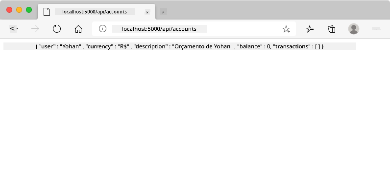
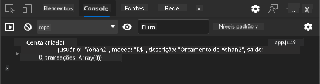
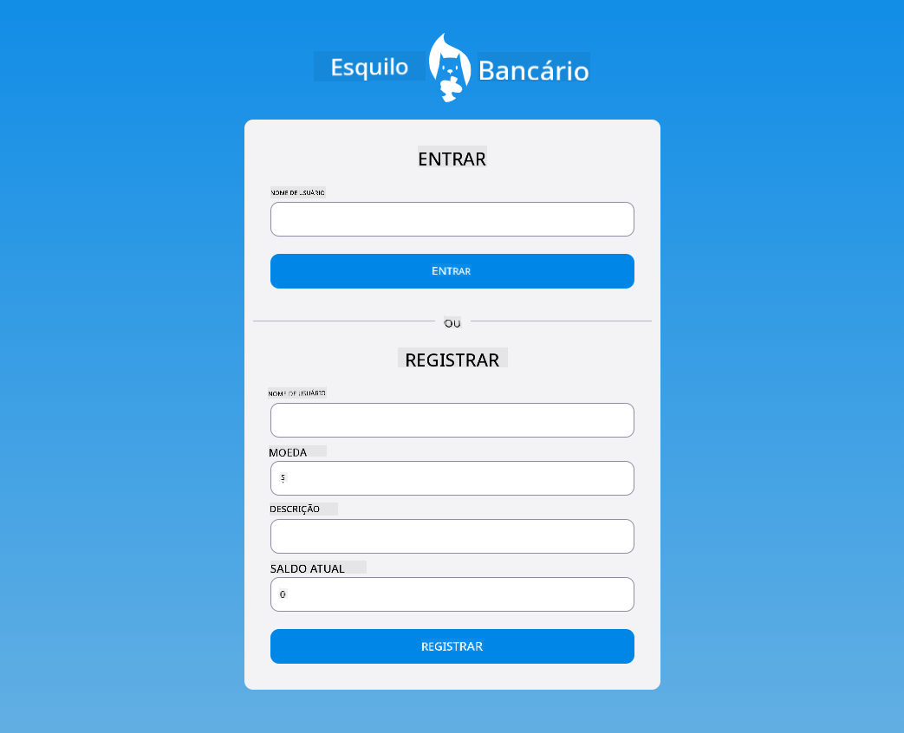

<!--
CO_OP_TRANSLATOR_METADATA:
{
  "original_hash": "b667b7d601e2ee19acb5aa9d102dc9f3",
  "translation_date": "2025-08-26T00:14:20+00:00",
  "source_file": "7-bank-project/2-forms/README.md",
  "language_code": "br"
}
-->
# Construindo um App Bancário Parte 2: Criando um Formulário de Login e Registro

## Quiz Pré-Aula

[Quiz pré-aula](https://ashy-river-0debb7803.1.azurestaticapps.net/quiz/43)

### Introdução

Em quase todos os aplicativos web modernos, você pode criar uma conta para ter seu próprio espaço privado. Como múltiplos usuários podem acessar um aplicativo web ao mesmo tempo, é necessário um mecanismo para armazenar os dados pessoais de cada usuário separadamente e selecionar quais informações exibir. Não abordaremos como gerenciar [identidade de usuário de forma segura](https://en.wikipedia.org/wiki/Authentication), pois é um tópico extenso por si só, mas garantiremos que cada usuário possa criar uma (ou mais) conta bancária em nosso aplicativo.

Nesta parte, usaremos formulários HTML para adicionar login e registro ao nosso aplicativo web. Veremos como enviar os dados para uma API de servidor programaticamente e, por fim, como definir regras básicas de validação para os dados inseridos pelo usuário.

### Pré-requisitos

Você precisa ter concluído a etapa de [templates HTML e roteamento](../1-template-route/README.md) do aplicativo web para esta lição. Também é necessário instalar o [Node.js](https://nodejs.org) e [executar a API do servidor](../api/README.md) localmente para que você possa enviar dados e criar contas.

**Atenção**
Você terá dois terminais rodando ao mesmo tempo, conforme listado abaixo:
1. Para o aplicativo bancário principal que construímos na lição de [templates HTML e roteamento](../1-template-route/README.md)
2. Para a [API do servidor do App Bancário](../api/README.md) que acabamos de configurar acima.

Você precisa que os dois servidores estejam funcionando para seguir o restante da lição. Eles escutam em portas diferentes (porta `3000` e porta `5000`), então tudo deve funcionar perfeitamente.

Você pode testar se o servidor está funcionando corretamente executando este comando em um terminal:

```sh
curl http://localhost:5000/api
# -> should return "Bank API v1.0.0" as a result
```

---

## Formulário e controles

O elemento `<form>` encapsula uma seção de um documento HTML onde o usuário pode inserir e enviar dados com controles interativos. Existem vários tipos de controles de interface de usuário (UI) que podem ser usados dentro de um formulário, sendo os mais comuns os elementos `<input>` e `<button>`.

Há muitos [tipos](https://developer.mozilla.org/docs/Web/HTML/Element/input) diferentes de `<input>`. Por exemplo, para criar um campo onde o usuário pode inserir seu nome de usuário, você pode usar:

```html
<input id="username" name="username" type="text">
```

O atributo `name` será usado como o nome da propriedade quando os dados do formulário forem enviados. O atributo `id` é usado para associar um `<label>` ao controle do formulário.

> Confira a lista completa de [tipos de `<input>`](https://developer.mozilla.org/docs/Web/HTML/Element/input) e [outros controles de formulário](https://developer.mozilla.org/docs/Learn/Forms/Other_form_controls) para ter uma ideia de todos os elementos nativos de UI que você pode usar ao construir sua interface.

✅ Note que `<input>` é um [elemento vazio](https://developer.mozilla.org/docs/Glossary/Empty_element) no qual você *não* deve adicionar uma tag de fechamento correspondente. No entanto, você pode usar a notação de auto-fechamento `<input/>`, mas isso não é obrigatório.

O elemento `<button>` dentro de um formulário é um pouco especial. Se você não especificar seu atributo `type`, ele automaticamente enviará os dados do formulário ao servidor quando pressionado. Aqui estão os valores possíveis para o atributo `type`:

- `submit`: O padrão dentro de um `<form>`, o botão aciona a ação de envio do formulário.
- `reset`: O botão redefine todos os controles do formulário para seus valores iniciais.
- `button`: Não atribui um comportamento padrão ao botão quando pressionado. Você pode então atribuir ações personalizadas a ele usando JavaScript.

### Tarefa

Vamos começar adicionando um formulário ao template de `login`. Precisaremos de um campo para *nome de usuário* e um botão de *Login*.

```html
<template id="login">
  <h1>Bank App</h1>
  <section>
    <h2>Login</h2>
    <form id="loginForm">
      <label for="username">Username</label>
      <input id="username" name="user" type="text">
      <button>Login</button>
    </form>
  </section>
</template>
```

Se você observar mais de perto, perceberá que também adicionamos um elemento `<label>` aqui. Elementos `<label>` são usados para adicionar um nome aos controles de UI, como nosso campo de nome de usuário. Labels são importantes para a legibilidade dos formulários, mas também trazem benefícios adicionais:

- Ao associar um label a um controle de formulário, ele ajuda usuários que utilizam tecnologias assistivas (como leitores de tela) a entender quais dados são esperados.
- Você pode clicar no label para colocar o foco diretamente no controle associado, facilitando o acesso em dispositivos com tela sensível ao toque.

> [Acessibilidade](https://developer.mozilla.org/docs/Learn/Accessibility/What_is_accessibility) na web é um tópico muito importante que muitas vezes é negligenciado. Graças aos [elementos semânticos HTML](https://developer.mozilla.org/docs/Learn/Accessibility/HTML), não é difícil criar conteúdo acessível se você os usar corretamente. Você pode [ler mais sobre acessibilidade](https://developer.mozilla.org/docs/Web/Accessibility) para evitar erros comuns e se tornar um desenvolvedor responsável.

Agora vamos adicionar um segundo formulário para o registro, logo abaixo do anterior:

```html
<hr/>
<h2>Register</h2>
<form id="registerForm">
  <label for="user">Username</label>
  <input id="user" name="user" type="text">
  <label for="currency">Currency</label>
  <input id="currency" name="currency" type="text" value="$">
  <label for="description">Description</label>
  <input id="description" name="description" type="text">
  <label for="balance">Current balance</label>
  <input id="balance" name="balance" type="number" value="0">
  <button>Register</button>
</form>
```

Usando o atributo `value`, podemos definir um valor padrão para um determinado campo de entrada. Note também que o campo de entrada para `balance` tem o tipo `number`. Ele parece diferente dos outros campos? Experimente interagir com ele.

✅ Você consegue navegar e interagir com os formulários usando apenas o teclado? Como você faria isso?

## Enviando dados para o servidor

Agora que temos uma interface funcional, o próximo passo é enviar os dados para o servidor. Vamos fazer um teste rápido usando nosso código atual: o que acontece se você clicar no botão *Login* ou *Register*?

Você notou a mudança na seção de URL do navegador?


A ação padrão de um `<form>` é enviar os dados do formulário para o URL atual do servidor usando o [método GET](https://www.w3.org/Protocols/rfc2616/rfc2616-sec9.html#sec9.3), anexando os dados do formulário diretamente ao URL. No entanto, esse método tem algumas limitações:

- Os dados enviados são muito limitados em tamanho (cerca de 2000 caracteres)
- Os dados são visíveis diretamente no URL (não é ideal para senhas)
- Não funciona com upload de arquivos

Por isso, você pode alterá-lo para usar o [método POST](https://www.w3.org/Protocols/rfc2616/rfc2616-sec9.html#sec9.5), que envia os dados do formulário para o servidor no corpo da requisição HTTP, sem as limitações anteriores.

> Embora o POST seja o método mais comumente usado para enviar dados, [em alguns cenários específicos](https://www.w3.org/2001/tag/doc/whenToUseGet.html) é preferível usar o método GET, como ao implementar um campo de busca.

### Tarefa

Adicione as propriedades `action` e `method` ao formulário de registro:

```html
<form id="registerForm" action="//localhost:5000/api/accounts" method="POST">
```

Agora tente registrar uma nova conta com seu nome. Após clicar no botão *Register*, você deve ver algo assim:



Se tudo correr bem, o servidor deve responder à sua requisição com uma resposta [JSON](https://www.json.org/json-en.html) contendo os dados da conta que foi criada.

✅ Tente registrar novamente com o mesmo nome. O que acontece?

## Enviando dados sem recarregar a página

Como você provavelmente percebeu, há um pequeno problema com a abordagem que acabamos de usar: ao enviar o formulário, saímos do nosso aplicativo e o navegador redireciona para o URL do servidor. Estamos tentando evitar todos os recarregamentos de página com nosso aplicativo web, já que estamos criando um [Aplicativo de Página Única (SPA)](https://en.wikipedia.org/wiki/Single-page_application).

Para enviar os dados do formulário ao servidor sem forçar um recarregamento da página, precisamos usar código JavaScript. Em vez de colocar um URL na propriedade `action` de um elemento `<form>`, você pode usar qualquer código JavaScript precedido pela string `javascript:` para realizar uma ação personalizada. Usar isso também significa que você terá que implementar algumas tarefas que anteriormente eram feitas automaticamente pelo navegador:

- Recuperar os dados do formulário
- Converter e codificar os dados do formulário em um formato adequado
- Criar a requisição HTTP e enviá-la ao servidor

### Tarefa

Substitua o `action` do formulário de registro por:

```html
<form id="registerForm" action="javascript:register()">
```

Abra o arquivo `app.js` e adicione uma nova função chamada `register`:

```js
function register() {
  const registerForm = document.getElementById('registerForm');
  const formData = new FormData(registerForm);
  const data = Object.fromEntries(formData);
  const jsonData = JSON.stringify(data);
}
```

Aqui, recuperamos o elemento do formulário usando `getElementById()` e usamos o helper [`FormData`](https://developer.mozilla.org/docs/Web/API/FormData) para extrair os valores dos controles do formulário como um conjunto de pares chave/valor. Em seguida, convertemos os dados em um objeto regular usando [`Object.fromEntries()`](https://developer.mozilla.org/docs/Web/JavaScript/Reference/Global_Objects/Object/fromEntries) e, finalmente, serializamos os dados para [JSON](https://www.json.org/json-en.html), um formato comumente usado para troca de dados na web.

Os dados agora estão prontos para serem enviados ao servidor. Crie uma nova função chamada `createAccount`:

```js
async function createAccount(account) {
  try {
    const response = await fetch('//localhost:5000/api/accounts', {
      method: 'POST',
      headers: { 'Content-Type': 'application/json' },
      body: account
    });
    return await response.json();
  } catch (error) {
    return { error: error.message || 'Unknown error' };
  }
}
```

O que essa função está fazendo? Primeiro, observe a palavra-chave `async` aqui. Isso significa que a função contém código que será executado [**assincronamente**](https://developer.mozilla.org/docs/Web/JavaScript/Reference/Statements/async_function). Quando usada junto com a palavra-chave `await`, ela permite esperar que o código assíncrono seja executado - como esperar pela resposta do servidor aqui - antes de continuar.

Aqui está um vídeo rápido sobre o uso de `async/await`:

[](https://youtube.com/watch?v=YwmlRkrxvkk "Async e Await para gerenciar promessas")

> 🎥 Clique na imagem acima para assistir a um vídeo sobre async/await.

Usamos a API `fetch()` para enviar dados JSON ao servidor. Este método recebe 2 parâmetros:

- O URL do servidor, então colocamos `//localhost:5000/api/accounts` aqui.
- As configurações da requisição. É aqui que definimos o método como `POST` e fornecemos o `body` para a requisição. Como estamos enviando dados JSON ao servidor, também precisamos definir o cabeçalho `Content-Type` como `application/json` para que o servidor saiba como interpretar o conteúdo.

Como o servidor responderá à requisição com JSON, podemos usar `await response.json()` para analisar o conteúdo JSON e retornar o objeto resultante. Note que este método é assíncrono, então usamos a palavra-chave `await` aqui antes de retornar para garantir que quaisquer erros durante a análise também sejam capturados.

Agora adicione algum código à função `register` para chamar `createAccount()`:

```js
const result = await createAccount(jsonData);
```

Como usamos a palavra-chave `await` aqui, precisamos adicionar a palavra-chave `async` antes da função register:

```js
async function register() {
```

Por fim, vamos adicionar alguns logs para verificar o resultado. A função final deve se parecer com esta:

```js
async function register() {
  const registerForm = document.getElementById('registerForm');
  const formData = new FormData(registerForm);
  const jsonData = JSON.stringify(Object.fromEntries(formData));
  const result = await createAccount(jsonData);

  if (result.error) {
    return console.log('An error occurred:', result.error);
  }

  console.log('Account created!', result);
}
```

Foi um pouco longo, mas chegamos lá! Se você abrir as [ferramentas de desenvolvedor do navegador](https://developer.mozilla.org/docs/Learn/Common_questions/What_are_browser_developer_tools) e tentar registrar uma nova conta, não verá nenhuma mudança na página da web, mas uma mensagem aparecerá no console confirmando que tudo está funcionando.



✅ Você acha que os dados são enviados ao servidor de forma segura? E se alguém conseguir interceptar a requisição? Você pode ler sobre [HTTPS](https://en.wikipedia.org/wiki/HTTPS) para saber mais sobre comunicação segura de dados.

## Validação de dados

Se você tentar registrar uma nova conta sem definir um nome de usuário primeiro, verá que o servidor retorna um erro com o código de status [400 (Bad Request)](https://developer.mozilla.org/docs/Web/HTTP/Status/400#:~:text=The%20HyperText%20Transfer%20Protocol%20(HTTP,%2C%20or%20deceptive%20request%20routing).).

Antes de enviar dados a um servidor, é uma boa prática [validar os dados do formulário](https://developer.mozilla.org/docs/Learn/Forms/Form_validation) previamente, sempre que possível, para garantir que você está enviando uma requisição válida. Os controles de formulário HTML5 fornecem validação integrada usando vários atributos:

- `required`: o campo precisa ser preenchido, caso contrário o formulário não pode ser enviado.
- `minlength` e `maxlength`: definem o número mínimo e máximo de caracteres em campos de texto.
- `min` e `max`: definem o valor mínimo e máximo de um campo numérico.
- `type`: define o tipo de dado esperado, como `number`, `email`, `file` ou [outros tipos integrados](https://developer.mozilla.org/docs/Web/HTML/Element/input). Este atributo também pode alterar a renderização visual do controle de formulário.
- `pattern`: permite definir um padrão de [expressão regular](https://developer.mozilla.org/docs/Web/JavaScript/Guide/Regular_Expressions) para testar se os dados inseridos são válidos ou não.
Dica: você pode personalizar a aparência dos seus controles de formulário dependendo se eles são válidos ou não, utilizando as pseudo-classes CSS `:valid` e `:invalid`.
### Tarefa

Existem 2 campos obrigatórios para criar uma nova conta válida: o nome de usuário e a moeda. Os outros campos são opcionais. Atualize o HTML do formulário, utilizando tanto o atributo `required` quanto o texto no rótulo do campo para que:

```html
<label for="user">Username (required)</label>
<input id="user" name="user" type="text" required>
...
<label for="currency">Currency (required)</label>
<input id="currency" name="currency" type="text" value="$" required>
```

Embora esta implementação específica do servidor não imponha limites específicos no comprimento máximo dos campos, é sempre uma boa prática definir limites razoáveis para qualquer entrada de texto do usuário.

Adicione um atributo `maxlength` aos campos de texto:

```html
<input id="user" name="user" type="text" maxlength="20" required>
...
<input id="currency" name="currency" type="text" value="$" maxlength="5" required>
...
<input id="description" name="description" type="text" maxlength="100">
```

Agora, se você pressionar o botão *Registrar* e algum campo não atender a uma regra de validação que definimos, você verá algo como isto:


A validação como esta, realizada *antes* de enviar qualquer dado para o servidor, é chamada de validação **do lado do cliente**. Mas observe que nem sempre é possível realizar todas as verificações sem enviar os dados. Por exemplo, não podemos verificar aqui se já existe uma conta com o mesmo nome de usuário sem enviar uma solicitação ao servidor. Validações adicionais realizadas no servidor são chamadas de validação **do lado do servidor**.

Normalmente, ambas precisam ser implementadas, e enquanto a validação do lado do cliente melhora a experiência do usuário ao fornecer feedback instantâneo, a validação do lado do servidor é crucial para garantir que os dados do usuário que você manipula sejam consistentes e seguros.

---

## 🚀 Desafio

Exiba uma mensagem de erro no HTML se o usuário já existir.

Aqui está um exemplo de como a página de login final pode ficar após um pouco de estilização:



## Questionário Pós-Aula

[Questionário pós-aula](https://ashy-river-0debb7803.1.azurestaticapps.net/quiz/44)

## Revisão e Autoestudo

Os desenvolvedores têm sido muito criativos em seus esforços para criar formulários, especialmente no que diz respeito às estratégias de validação. Aprenda sobre diferentes fluxos de formulários explorando o [CodePen](https://codepen.com); você consegue encontrar alguns formulários interessantes e inspiradores?

## Tarefa

[Estilize seu aplicativo bancário](assignment.md)

**Aviso Legal**:  
Este documento foi traduzido utilizando o serviço de tradução por IA [Co-op Translator](https://github.com/Azure/co-op-translator). Embora nos esforcemos para garantir a precisão, esteja ciente de que traduções automatizadas podem conter erros ou imprecisões. O documento original em seu idioma nativo deve ser considerado a fonte autoritativa. Para informações críticas, recomenda-se a tradução profissional realizada por humanos. Não nos responsabilizamos por quaisquer mal-entendidos ou interpretações equivocadas decorrentes do uso desta tradução.