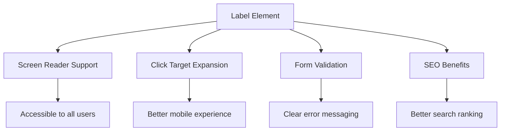
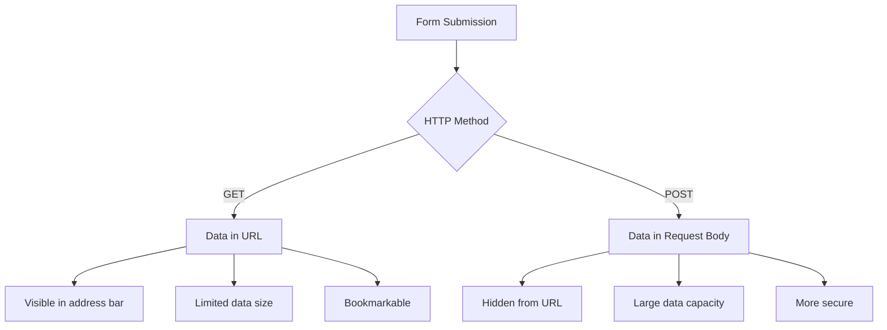
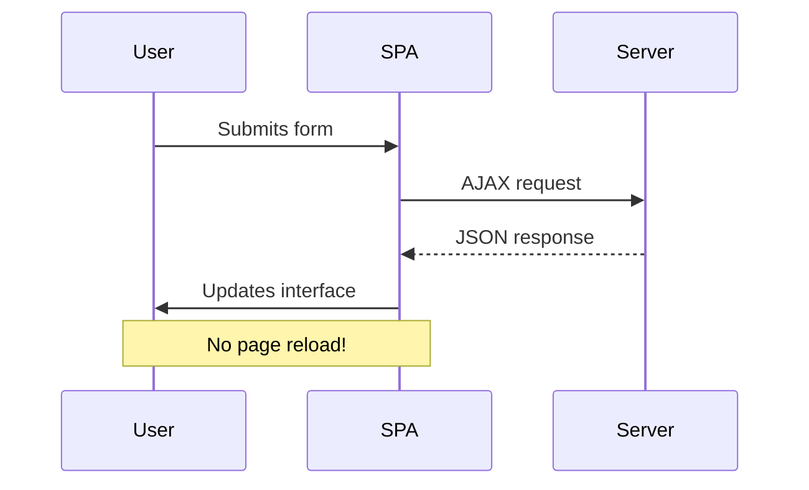
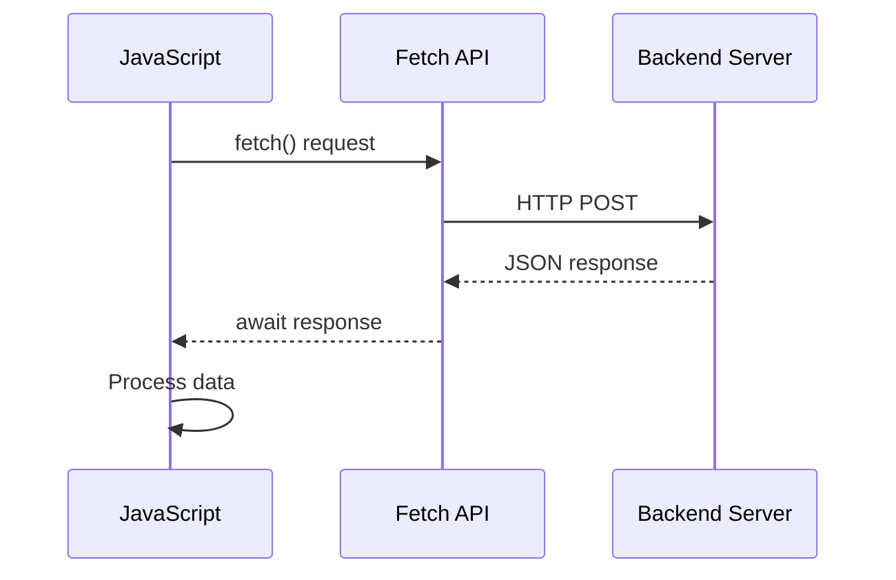
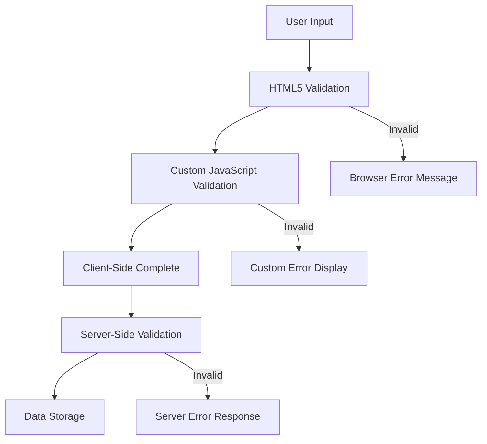
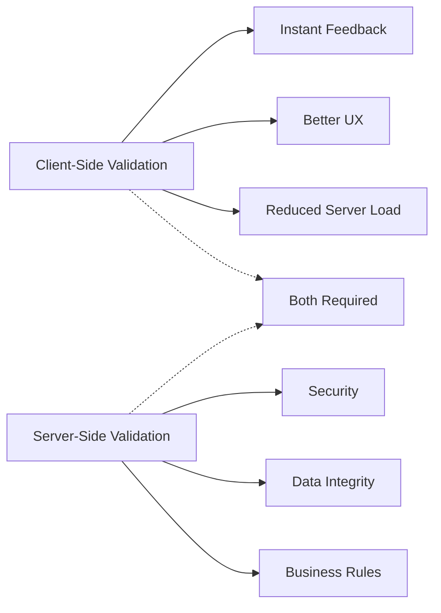

<!--
CO_OP_TRANSLATOR_METADATA:
{
  "original_hash": "b24f28fc46dd473aa9080f174182adde",
  "translation_date": "2025-10-22T23:11:54+00:00",
  "source_file": "7-bank-project/2-forms/README.md",
  "language_code": "br"
}
-->
# Criando um App Bancário Parte 2: Construindo um Formulário de Login e Registro

## Questionário Pré-Aula

[Questionário pré-aula](https://ff-quizzes.netlify.app/web/quiz/43)

Já preencheu um formulário online e teve seu e-mail rejeitado por estar no formato errado? Ou perdeu todas as informações ao clicar em enviar? Todos nós já passamos por essas experiências frustrantes.

Os formulários são a ponte entre os usuários e a funcionalidade do seu aplicativo. Assim como os protocolos cuidadosos que os controladores de tráfego aéreo usam para guiar aviões com segurança aos seus destinos, formulários bem projetados fornecem feedback claro e evitam erros custosos. Formulários mal feitos, por outro lado, podem afastar os usuários mais rápido do que uma falha de comunicação em um aeroporto movimentado.

Nesta lição, transformaremos seu aplicativo bancário estático em uma aplicação interativa. Você aprenderá a criar formulários que validam entradas de usuários, se comunicam com servidores e fornecem feedback útil. Pense nisso como construir a interface de controle que permite aos usuários navegar pelos recursos do seu aplicativo.

Ao final, você terá um sistema completo de login e registro com validação que guia os usuários para o sucesso, em vez de frustração.

## Pré-requisitos

Antes de começarmos a construir os formulários, vamos garantir que você tenha tudo configurado corretamente. Esta lição continua de onde paramos na anterior, então, se você pulou alguma parte, talvez queira voltar e garantir que os fundamentos estejam funcionando primeiro.

### Configuração Necessária

| Componente | Status | Descrição |
|------------|--------|-----------|
| [Templates HTML](../1-template-route/README.md) | ✅ Necessário | Estrutura básica do aplicativo bancário |
| [Node.js](https://nodejs.org) | ✅ Necessário | Ambiente de execução JavaScript para o servidor |
| [Servidor API Bancária](../api/README.md) | ✅ Necessário | Serviço de backend para armazenamento de dados |

> 💡 **Dica de Desenvolvimento**: Você estará executando dois servidores separados simultaneamente – um para o aplicativo bancário front-end e outro para a API de backend. Essa configuração reflete o desenvolvimento do mundo real, onde os serviços de front-end e backend operam de forma independente.

### Configuração do Servidor

**Seu ambiente de desenvolvimento incluirá:**
- **Servidor Frontend**: Serve seu aplicativo bancário (normalmente na porta `3000`)
- **Servidor API Backend**: Lida com armazenamento e recuperação de dados (porta `5000`)
- **Ambos os servidores** podem ser executados simultaneamente sem conflitos

**Testando sua conexão com a API:**
```bash
curl http://localhost:5000/api
# Expected response: "Bank API v1.0.0"
```

**Se você vir a resposta da versão da API, está pronto para prosseguir!**

---

## Entendendo Formulários e Controles HTML

Os formulários HTML são como os usuários se comunicam com seu aplicativo web. Pense neles como o sistema de telégrafo que conectava lugares distantes no século XIX – eles são o protocolo de comunicação entre a intenção do usuário e a resposta do aplicativo. Quando projetados com cuidado, eles capturam erros, orientam a formatação de entrada e fornecem sugestões úteis.

Os formulários modernos são significativamente mais sofisticados do que entradas de texto básicas. O HTML5 introduziu tipos de entrada especializados que lidam automaticamente com validação de e-mail, formatação de números e seleção de datas. Essas melhorias beneficiam tanto a acessibilidade quanto as experiências de usuários móveis.

### Elementos Essenciais de um Formulário

**Blocos de construção que todo formulário precisa:**

```html
<!-- Basic form structure -->
<form id="userForm" method="POST">
  <label for="username">Username</label>
  <input id="username" name="username" type="text" required>
  
  <button type="submit">Submit</button>
</form>
```

**O que este código faz:**
- **Cria** um contêiner de formulário com um identificador único
- **Especifica** o método HTTP para envio de dados
- **Associa** rótulos às entradas para acessibilidade
- **Define** um botão de envio para processar o formulário

### Tipos de Entrada Modernos e Atributos

| Tipo de Entrada | Propósito | Exemplo de Uso |
|-----------------|-----------|----------------|
| `text` | Entrada de texto geral | `<input type="text" name="username">` |
| `email` | Validação de e-mail | `<input type="email" name="email">` |
| `password` | Entrada de texto oculta | `<input type="password" name="password">` |
| `number` | Entrada numérica | `<input type="number" name="balance" min="0">` |
| `tel` | Números de telefone | `<input type="tel" name="phone">` |

> 💡 **Vantagem do HTML5 Moderno**: Usar tipos de entrada específicos fornece validação automática, teclados móveis apropriados e melhor suporte à acessibilidade sem necessidade de JavaScript adicional!

### Tipos de Botões e Comportamento

```html
<!-- Different button behaviors -->
<button type="submit">Save Data</button>     <!-- Submits the form -->
<button type="reset">Clear Form</button>    <!-- Resets all fields -->
<button type="button">Custom Action</button> <!-- No default behavior -->
```

**O que cada tipo de botão faz:**
- **Botões de envio**: Disparam o envio do formulário e enviam os dados para o endpoint especificado
- **Botões de reset**: Restauram todos os campos do formulário para seu estado inicial
- **Botões regulares**: Não possuem comportamento padrão, exigindo JavaScript personalizado para funcionalidade

> ⚠️ **Nota Importante**: O elemento `<input>` é auto-fechado e não requer uma tag de fechamento. A prática moderna é escrever `<input>` sem a barra.

### Construindo Seu Formulário de Login

Agora vamos criar um formulário de login prático que demonstra práticas modernas de formulários HTML. Começaremos com uma estrutura básica e gradualmente a aprimoraremos com recursos de acessibilidade e validação.

```html
<template id="login">
  <h1>Bank App</h1>
  <section>
    <h2>Login</h2>
    <form id="loginForm" novalidate>
      <div class="form-group">
        <label for="username">Username</label>
        <input id="username" name="user" type="text" required 
               autocomplete="username" placeholder="Enter your username">
      </div>
      <button type="submit">Login</button>
    </form>
  </section>
</template>
```

**Desmembrando o que acontece aqui:**
- **Estrutura** o formulário com elementos semânticos do HTML5
- **Agrupa** elementos relacionados usando contêineres `div` com classes significativas
- **Associa** rótulos às entradas usando os atributos `for` e `id`
- **Inclui** atributos modernos como `autocomplete` e `placeholder` para melhor experiência do usuário
- **Adiciona** `novalidate` para lidar com validação usando JavaScript em vez dos padrões do navegador

### O Poder dos Rótulos Apropriados

**Por que os rótulos são importantes para o desenvolvimento web moderno:**



**O que os rótulos apropriados realizam:**
- **Permitem** que leitores de tela anunciem claramente os campos do formulário
- **Expandem** a área clicável (clicar no rótulo foca na entrada)
- **Melhoram** a usabilidade móvel com alvos de toque maiores
- **Apoiam** a validação do formulário com mensagens de erro significativas
- **Aprimoram** o SEO ao fornecer significado semântico aos elementos do formulário

> 🎯 **Objetivo de Acessibilidade**: Cada entrada de formulário deve ter um rótulo associado. Essa prática simples torna seus formulários utilizáveis por todos, incluindo usuários com deficiência, e melhora a experiência para todos os usuários.

### Criando o Formulário de Registro

O formulário de registro requer informações mais detalhadas para criar uma conta de usuário completa. Vamos construí-lo com recursos modernos do HTML5 e acessibilidade aprimorada.

```html
<hr/>
<h2>Register</h2>
<form id="registerForm" novalidate>
  <div class="form-group">
    <label for="user">Username</label>
    <input id="user" name="user" type="text" required 
           autocomplete="username" placeholder="Choose a username">
  </div>
  
  <div class="form-group">
    <label for="currency">Currency</label>
    <input id="currency" name="currency" type="text" value="$" 
           required maxlength="3" placeholder="USD, EUR, etc.">
  </div>
  
  <div class="form-group">
    <label for="description">Account Description</label>
    <input id="description" name="description" type="text" 
           maxlength="100" placeholder="Personal savings, checking, etc.">
  </div>
  
  <div class="form-group">
    <label for="balance">Starting Balance</label>
    <input id="balance" name="balance" type="number" value="0" 
           min="0" step="0.01" placeholder="0.00">
  </div>
  
  <button type="submit">Create Account</button>
</form>
```

**No código acima, nós:**
- **Organizamos** cada campo em divs de contêiner para melhor estilo e layout
- **Adicionamos** atributos `autocomplete` apropriados para suporte ao preenchimento automático do navegador
- **Incluímos** texto de placeholder útil para orientar a entrada do usuário
- **Definimos** padrões sensatos usando o atributo `value`
- **Aplicamos** atributos de validação como `required`, `maxlength` e `min`
- **Usamos** `type="number"` para o campo de saldo com suporte a decimais

### Explorando Tipos de Entrada e Comportamento

**Os tipos de entrada modernos oferecem funcionalidade aprimorada:**

| Recurso | Benefício | Exemplo |
|---------|-----------|---------|
| `type="number"` | Teclado numérico em dispositivos móveis | Entrada de saldo mais fácil |
| `step="0.01"` | Controle de precisão decimal | Permite centavos em valores monetários |
| `autocomplete` | Preenchimento automático do navegador | Completação mais rápida do formulário |
| `placeholder` | Dicas contextuais | Orienta as expectativas do usuário |

> 🎯 **Desafio de Acessibilidade**: Tente navegar pelos formulários usando apenas o teclado! Use `Tab` para mover entre os campos, `Espaço` para marcar caixas e `Enter` para enviar. Essa experiência ajuda a entender como os usuários de leitores de tela interagem com seus formulários.

## Entendendo Métodos de Envio de Formulários

Quando alguém preenche seu formulário e clica em enviar, esses dados precisam ir para algum lugar – geralmente para um servidor que pode armazená-los. Existem algumas maneiras diferentes de fazer isso, e saber qual usar pode evitar dores de cabeça no futuro.

Vamos dar uma olhada no que realmente acontece quando alguém clica no botão de envio.

### Comportamento Padrão do Formulário

Primeiro, vamos observar o que acontece com o envio básico de formulários:

**Teste seus formulários atuais:**
1. Clique no botão *Registrar* no seu formulário
2. Observe as mudanças na barra de endereço do seu navegador
3. Note como a página recarrega e os dados aparecem na URL


### Comparação de Métodos HTTP



**Entendendo as diferenças:**

| Método | Caso de Uso | Localização dos Dados | Nível de Segurança | Limite de Tamanho |
|--------|-------------|-----------------------|--------------------|-------------------|
| `GET` | Consultas de busca, filtros | Parâmetros de URL | Baixo (visível) | ~2000 caracteres |
| `POST` | Contas de usuário, dados sensíveis | Corpo da requisição | Maior (oculto) | Sem limite prático |

**Entendendo as diferenças fundamentais:**
- **GET**: Adiciona os dados do formulário à URL como parâmetros de consulta (apropriado para operações de busca)
- **POST**: Inclui os dados no corpo da requisição (essencial para informações sensíveis)
- **Limitações do GET**: Restrições de tamanho, dados visíveis, histórico persistente do navegador
- **Vantagens do POST**: Grande capacidade de dados, proteção de privacidade, suporte a upload de arquivos

> 💡 **Melhor Prática**: Use `GET` para formulários de busca e filtros (recuperação de dados), use `POST` para registro de usuários, login e criação de dados.

### Configurando o Envio de Formulários

Vamos configurar seu formulário de registro para se comunicar corretamente com a API de backend usando o método POST:

```html
<form id="registerForm" action="//localhost:5000/api/accounts" 
      method="POST" novalidate>
```

**O que essa configuração faz:**
- **Direciona** o envio do formulário para o endpoint da API
- **Usa** o método POST para transmissão segura de dados
- **Inclui** `novalidate` para lidar com validação usando JavaScript

### Testando o Envio de Formulários

**Siga estes passos para testar seu formulário:**
1. **Preencha** o formulário de registro com suas informações
2. **Clique** no botão "Criar Conta"
3. **Observe** a resposta do servidor no seu navegador


**O que você deve ver:**
- **O navegador redireciona** para a URL do endpoint da API
- **Resposta em JSON** contendo os dados da conta recém-criada
- **Confirmação do servidor** de que a conta foi criada com sucesso

> 🧪 **Hora de Experimentar**: Tente se registrar novamente com o mesmo nome de usuário. Qual resposta você recebe? Isso ajuda a entender como o servidor lida com dados duplicados e condições de erro.

### Entendendo Respostas JSON

**Quando o servidor processa seu formulário com sucesso:**
```json
{
  "user": "john_doe",
  "currency": "$",
  "description": "Personal savings",
  "balance": 100,
  "id": "unique_account_id"
}
```

**Essa resposta confirma:**
- **Cria** uma nova conta com os dados especificados
- **Atribui** um identificador único para referência futura
- **Retorna** todas as informações da conta para verificação
- **Indica** armazenamento bem-sucedido no banco de dados

## Manipulação Moderna de Formulários com JavaScript

Envios tradicionais de formulários causam recarregamentos completos da página, semelhante a como as primeiras missões espaciais exigiam reinicializações completas do sistema para correções de curso. Essa abordagem interrompe a experiência do usuário e perde o estado da aplicação.

A manipulação de formulários com JavaScript funciona como os sistemas de orientação contínua usados por espaçonaves modernas – fazendo ajustes em tempo real sem perder o contexto de navegação. Podemos interceptar envios de formulários, fornecer feedback imediato, lidar com erros de forma elegante e atualizar a interface com base nas respostas do servidor enquanto mantemos a posição do usuário no aplicativo.

### Por que Evitar Recarregamentos de Página?



**Benefícios da manipulação de formulários com JavaScript:**
- **Mantém** o estado da aplicação e o contexto do usuário
- **Fornece** feedback instantâneo e indicadores de carregamento
- **Habilita** tratamento dinâmico de erros e validação
- **Cria** experiências de usuário suaves, semelhantes a aplicativos
- **Permite** lógica condicional baseada em respostas do servidor

### Transição de Formulários Tradicionais para Modernos

**Desafios da abordagem tradicional:**
- **Redireciona** os usuários para fora do seu aplicativo
- **Perde** o estado e o contexto atual da aplicação
- **Exige** recarregamentos completos da página para operações simples
- **Oferece** controle limitado sobre o feedback do usuário

**Vantagens da abordagem moderna com JavaScript:**
- **Mantém** os usuários dentro do seu aplicativo
- **Preserva** todo o estado e os dados da aplicação
- **Habilita** validação e feedback em tempo real
- **Suporta** aprimoramento progressivo e acessibilidade

### Implementando a Manipulação de Formulários com JavaScript

Vamos substituir o envio tradicional de formulários por um tratamento moderno de eventos com JavaScript:

```html
<!-- Remove the action attribute and add event handling -->
<form id="registerForm" method="POST" novalidate>
```

**Adicione a lógica de registro ao seu arquivo `app.js`:**

```javascript
// Modern event-driven form handling
function register() {
  const registerForm = document.getElementById('registerForm');
  const formData = new FormData(registerForm);
  const data = Object.fromEntries(formData);
  const jsonData = JSON.stringify(data);
  
  console.log('Form data prepared:', data);
}

// Attach event listener when the page loads
document.addEventListener('DOMContentLoaded', () => {
  const registerForm = document.getElementById('registerForm');
  registerForm.addEventListener('submit', (event) => {
    event.preventDefault(); // Prevent default form submission
    register();
  });
});
```

**Desmembrando o que acontece aqui:**
- **Previne** o envio padrão do formulário usando `event.preventDefault()`
- **Recupera** o elemento do formulário usando seleção moderna do DOM
- **Extrai** os dados do formulário usando a poderosa API `FormData`
- **Converte** FormData em um objeto simples com `Object.fromEntries()`
- **Serializa** os dados para o formato JSON para comunicação com o servidor
- **Registra** os dados processados para depuração e verificação

### Entendendo a API FormData

**A API FormData fornece manipulação poderosa de formulários:**

```javascript
// Example of what FormData captures
const formData = new FormData(registerForm);

// FormData automatically captures:
// {
//   "user": "john_doe",
//   "currency": "$", 
//   "description": "Personal account",
//   "balance": "100"
// }
```

**Vantagens da API FormData:**
- **Coleta abrangente**: Captura todos os elementos do formulário, incluindo texto, arquivos e entradas complexas
- **Consciência de tipo**: Lida automaticamente com diferentes tipos de entrada sem codificação personalizada
- **Eficiência**: Elimina a coleta manual de campos com uma única chamada de API
- **Adaptabilidade**: Mantém a funcionalidade conforme a estrutura do formulário evolui

### Criando a Função de Comunicação com o Servidor

Agora vamos construir uma função robusta para se comunicar com seu servidor API usando padrões modernos de JavaScript:

```javascript
async function createAccount(account) {
  try {
    const response = await fetch('//localhost:5000/api/accounts', {
      method: 'POST',
      headers: { 
        'Content-Type': 'application/json',
        'Accept': 'application/json'
      },
      body: account
    });
    
    // Check if the response was successful
    if (!response.ok) {
      throw new Error(`HTTP error! status: ${response.status}`);
    }
    
    return await response.json();
  } catch (error) {
    console.error('Account creation failed:', error);
    return { error: error.message || 'Network error occurred' };
  }
}
```

**Entendendo o JavaScript assíncrono:**



**O que essa implementação moderna realiza:**
- **Usa** `async/await` para código assíncrono legível
- **Inclui** tratamento de erros adequado com blocos try/catch
- **Verifica** o status da resposta antes de processar os dados
- **Define** cabeçalhos apropriados para comunicação JSON
- **Fornece** mensagens detalhadas de erro para depuração
- **Retorna** estrutura de dados consistente para casos de sucesso e erro

### O Poder da Fetch API Moderna

**Vantagens da Fetch API em relação aos métodos mais antigos:**

| Recurso | Benefício | Implementação |
|---------|-----------|---------------|
| Baseada em Promises | Código assíncrono limpo | `await fetch()` |
| Personalização de requisição | Controle total do HTTP | Headers, métodos, corpo |
| Manipulação de resposta | Parsing de dados flexível | `.json()`, `.text()`, `.blob()` |
| Tratamento de erros | Captura abrangente de erros | Blocos Try/catch |

> 🎥 **Saiba Mais**: [Tutorial de Async/Await](https://youtube.com/watch?v=YwmlRkrxvkk) - Entendendo padrões assíncronos de JavaScript para desenvolvimento web moderno.

**Conceitos-chave para comunicação com o servidor:**
- **Funções assíncronas** permitem pausar a execução para aguardar respostas do servidor
- **Palavra-chave await** faz o código assíncrono parecer síncrono
- **Fetch API** oferece requisições HTTP modernas baseadas em promises
- **Tratamento de erros** garante que seu aplicativo responda de forma adequada a problemas de rede

### Finalizando a Função de Registro

Vamos reunir tudo com uma função de registro completa e pronta para produção:

```javascript
async function register() {
  const registerForm = document.getElementById('registerForm');
  const submitButton = registerForm.querySelector('button[type="submit"]');
  
  try {
    // Show loading state
    submitButton.disabled = true;
    submitButton.textContent = 'Creating Account...';
    
    // Process form data
    const formData = new FormData(registerForm);
    const jsonData = JSON.stringify(Object.fromEntries(formData));
    
    // Send to server
    const result = await createAccount(jsonData);
    
    if (result.error) {
      console.error('Registration failed:', result.error);
      alert(`Registration failed: ${result.error}`);
      return;
    }
    
    console.log('Account created successfully!', result);
    alert(`Welcome, ${result.user}! Your account has been created.`);
    
    // Reset form after successful registration
    registerForm.reset();
    
  } catch (error) {
    console.error('Unexpected error:', error);
    alert('An unexpected error occurred. Please try again.');
  } finally {
    // Restore button state
    submitButton.disabled = false;
    submitButton.textContent = 'Create Account';
  }
}
```

**Esta implementação aprimorada inclui:**
- **Fornece** feedback visual durante o envio do formulário
- **Desativa** o botão de envio para evitar envios duplicados
- **Lida** com erros esperados e inesperados de forma eficaz
- **Exibe** mensagens amigáveis de sucesso e erro
- **Reseta** o formulário após um registro bem-sucedido
- **Restaura** o estado da interface, independentemente do resultado

### Testando Sua Implementação

**Abra as ferramentas de desenvolvedor do navegador e teste o registro:**

1. **Abra** o console do navegador (F12 → Aba Console)
2. **Preencha** o formulário de registro
3. **Clique** em "Criar Conta"
4. **Observe** as mensagens do console e o feedback ao usuário


**O que você deve ver:**
- **Estado de carregamento** aparece no botão de envio
- **Logs no console** mostram informações detalhadas sobre o processo
- **Mensagem de sucesso** aparece quando a criação da conta é bem-sucedida
- **Formulário é resetado** automaticamente após o envio bem-sucedido

> 🔒 **Consideração de Segurança**: Atualmente, os dados são transmitidos via HTTP, o que não é seguro para produção. Em aplicações reais, sempre use HTTPS para criptografar a transmissão de dados. Saiba mais sobre [segurança HTTPS](https://en.wikipedia.org/wiki/HTTPS) e por que é essencial para proteger os dados dos usuários.

## Validação Abrangente de Formulários

A validação de formulários evita a experiência frustrante de descobrir erros apenas após o envio. Assim como os múltiplos sistemas redundantes na Estação Espacial Internacional, uma validação eficaz emprega várias camadas de verificações de segurança.

A abordagem ideal combina validação no nível do navegador para feedback imediato, validação em JavaScript para uma experiência aprimorada do usuário e validação no servidor para segurança e integridade dos dados. Essa redundância garante tanto a satisfação do usuário quanto a proteção do sistema.

### Entendendo as Camadas de Validação



**Estratégia de validação em múltiplas camadas:**
- **Validação HTML5**: Verificações imediatas baseadas no navegador
- **Validação em JavaScript**: Lógica personalizada e experiência do usuário
- **Validação no servidor**: Verificações finais de segurança e integridade dos dados
- **Aprimoramento progressivo**: Funciona mesmo se o JavaScript estiver desativado

### Atributos de Validação HTML5

**Ferramentas modernas de validação à sua disposição:**

| Atributo | Propósito | Exemplo de Uso | Comportamento do Navegador |
|----------|-----------|----------------|----------------------------|
| `required` | Campos obrigatórios | `<input required>` | Impede envio vazio |
| `minlength`/`maxlength` | Limites de comprimento de texto | `<input maxlength="20">` | Impõe limites de caracteres |
| `min`/`max` | Intervalos numéricos | `<input min="0" max="1000">` | Valida limites numéricos |
| `pattern` | Regras de regex personalizadas | `<input pattern="[A-Za-z]+">` | Combina formatos específicos |
| `type` | Validação de tipo de dado | `<input type="email">` | Validação específica de formato |

### Estilização de Validação com CSS

**Crie feedback visual para estados de validação:**

```css
/* Valid input styling */
input:valid {
  border-color: #28a745;
  background-color: #f8fff9;
}

/* Invalid input styling */
input:invalid {
  border-color: #dc3545;
  background-color: #fff5f5;
}

/* Focus states for better accessibility */
input:focus:valid {
  box-shadow: 0 0 0 0.2rem rgba(40, 167, 69, 0.25);
}

input:focus:invalid {
  box-shadow: 0 0 0 0.2rem rgba(220, 53, 69, 0.25);
}
```

**O que esses indicadores visuais realizam:**
- **Bordas verdes**: Indicam validação bem-sucedida, como luzes verdes no controle da missão
- **Bordas vermelhas**: Sinalizam erros de validação que precisam de atenção
- **Destaques de foco**: Fornecem contexto visual claro para a localização atual de entrada
- **Estilo consistente**: Estabelece padrões de interface previsíveis que os usuários podem aprender

> 💡 **Dica Profissional**: Use as pseudo-classes CSS `:valid` e `:invalid` para fornecer feedback visual imediato enquanto os usuários digitam, criando uma interface responsiva e útil.

### Implementando Validação Abrangente

Vamos aprimorar seu formulário de registro com validação robusta que oferece excelente experiência ao usuário e qualidade de dados:

```html
<form id="registerForm" method="POST" novalidate>
  <div class="form-group">
    <label for="user">Username <span class="required">*</span></label>
    <input id="user" name="user" type="text" required 
           minlength="3" maxlength="20" 
           pattern="[a-zA-Z0-9_]+" 
           autocomplete="username"
           title="Username must be 3-20 characters, letters, numbers, and underscores only">
    <small class="form-text">Choose a unique username (3-20 characters)</small>
  </div>
  
  <div class="form-group">
    <label for="currency">Currency <span class="required">*</span></label>
    <input id="currency" name="currency" type="text" required 
           value="$" maxlength="3" 
           pattern="[A-Z$€£¥₹]+" 
           title="Enter a valid currency symbol or code">
    <small class="form-text">Currency symbol (e.g., $, €, £)</small>
  </div>
  
  <div class="form-group">
    <label for="description">Account Description</label>
    <input id="description" name="description" type="text" 
           maxlength="100" 
           placeholder="Personal savings, checking, etc.">
    <small class="form-text">Optional description (up to 100 characters)</small>
  </div>
  
  <div class="form-group">
    <label for="balance">Starting Balance</label>
    <input id="balance" name="balance" type="number" 
           value="0" min="0" step="0.01" 
           title="Enter a positive number for your starting balance">
    <small class="form-text">Initial account balance (minimum $0.00)</small>
  </div>
  
  <button type="submit">Create Account</button>
</form>
```

**Entendendo a validação aprimorada:**
- **Combina** indicadores de campos obrigatórios com descrições úteis
- **Inclui** atributos `pattern` para validação de formato
- **Fornece** atributos `title` para acessibilidade e dicas
- **Adiciona** texto auxiliar para orientar a entrada do usuário
- **Utiliza** estrutura HTML semântica para melhor acessibilidade

### Regras Avançadas de Validação

**O que cada regra de validação realiza:**

| Campo | Regras de Validação | Benefício para o Usuário |
|-------|---------------------|--------------------------|
| Nome de usuário | `required`, `minlength="3"`, `maxlength="20"`, `pattern="[a-zA-Z0-9_]+"` | Garante identificadores válidos e únicos |
| Moeda | `required`, `maxlength="3"`, `pattern="[A-Z$€£¥₹]+"` | Aceita símbolos de moeda comuns |
| Saldo | `min="0"`, `step="0.01"`, `type="number"` | Impede saldos negativos |
| Descrição | `maxlength="100"` | Limites de comprimento razoáveis |

### Testando o Comportamento de Validação

**Experimente esses cenários de validação:**
1. **Envie** o formulário com campos obrigatórios vazios
2. **Insira** um nome de usuário com menos de 3 caracteres
3. **Tente** caracteres especiais no campo de nome de usuário
4. **Digite** um valor de saldo negativo


**O que você observará:**
- **O navegador exibe** mensagens nativas de validação
- **Mudanças de estilo** baseadas nos estados `:valid` e `:invalid`
- **Envio do formulário** é impedido até que todas as validações sejam aprovadas
- **O foco se move automaticamente** para o primeiro campo inválido

### Validação no Cliente vs Validação no Servidor



**Por que você precisa de ambas as camadas:**
- **Validação no cliente**: Fornece feedback imediato e melhora a experiência do usuário
- **Validação no servidor**: Garante segurança e lida com regras de negócios complexas
- **Abordagem combinada**: Cria aplicativos robustos, amigáveis e seguros
- **Aprimoramento progressivo**: Funciona mesmo quando o JavaScript está desativado

> 🛡️ **Lembrete de Segurança**: Nunca confie apenas na validação do lado do cliente! Usuários mal-intencionados podem ignorar verificações no cliente, então a validação no servidor é essencial para segurança e integridade dos dados.

---

---

## Desafio do Agente GitHub Copilot 🚀

Use o modo Agente para completar o seguinte desafio:

**Descrição:** Aprimore o formulário de registro com validação abrangente no cliente e feedback ao usuário. Este desafio ajudará você a praticar validação de formulários, tratamento de erros e melhoria da experiência do usuário com feedback interativo.

**Prompt:** Crie um sistema completo de validação de formulário para o registro que inclua: 1) Feedback de validação em tempo real para cada campo enquanto o usuário digita, 2) Mensagens de validação personalizadas que aparecem abaixo de cada campo de entrada, 3) Um campo de confirmação de senha com validação de correspondência, 4) Indicadores visuais (como marcas verdes para campos válidos e avisos vermelhos para inválidos), 5) Um botão de envio que só se torna habilitado quando todas as validações forem aprovadas. Use atributos de validação HTML5, CSS para estilizar os estados de validação e JavaScript para o comportamento interativo.

Saiba mais sobre o [modo agente](https://code.visualstudio.com/blogs/2025/02/24/introducing-copilot-agent-mode) aqui.

## 🚀 Desafio

Exiba uma mensagem de erro no HTML se o usuário já existir.

Aqui está um exemplo de como a página de login final pode parecer após um pouco de estilização:


## Quiz Pós-Aula

[Quiz pós-aula](https://ff-quizzes.netlify.app/web/quiz/44)

## Revisão & Autoestudo

Os desenvolvedores têm sido muito criativos em seus esforços de construção de formulários, especialmente em relação às estratégias de validação. Aprenda sobre diferentes fluxos de formulários explorando o [CodePen](https://codepen.com); você consegue encontrar alguns formulários interessantes e inspiradores?

## Tarefa

[Estilize seu aplicativo bancário](assignment.md)

---

**Aviso Legal**:  
Este documento foi traduzido usando o serviço de tradução por IA [Co-op Translator](https://github.com/Azure/co-op-translator). Embora nos esforcemos para garantir a precisão, esteja ciente de que traduções automatizadas podem conter erros ou imprecisões. O documento original em seu idioma nativo deve ser considerado a fonte autoritativa. Para informações críticas, recomenda-se a tradução profissional feita por humanos. Não nos responsabilizamos por quaisquer mal-entendidos ou interpretações incorretas decorrentes do uso desta tradução.