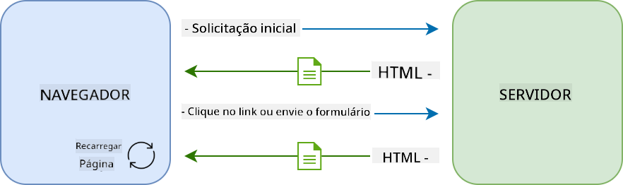
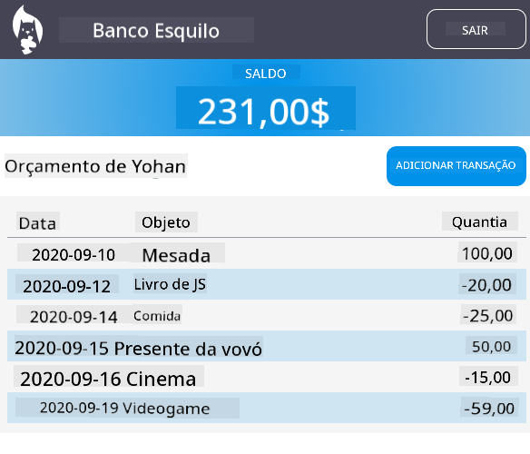

<!--
CO_OP_TRANSLATOR_METADATA:
{
  "original_hash": "f587e913e3f7c0b1c549a05dd74ee8e5",
  "translation_date": "2025-08-26T00:25:32+00:00",
  "source_file": "7-bank-project/3-data/README.md",
  "language_code": "br"
}
-->
# Construir um App Bancário Parte 3: Métodos de Obtenção e Uso de Dados

## Quiz Pré-Aula

[Quiz pré-aula](https://ashy-river-0debb7803.1.azurestaticapps.net/quiz/45)

### Introdução

No núcleo de toda aplicação web está o *dado*. Os dados podem assumir muitas formas, mas seu principal propósito é sempre exibir informações para o usuário. Com os aplicativos web se tornando cada vez mais interativos e complexos, a forma como o usuário acessa e interage com as informações agora é uma parte essencial do desenvolvimento web.

Nesta lição, veremos como obter dados de um servidor de forma assíncrona e usar esses dados para exibir informações em uma página web sem recarregar o HTML.

### Pré-requisitos

Você precisa ter construído a [Formulário de Login e Registro](../2-forms/README.md) da aplicação web para esta lição. Também é necessário instalar o [Node.js](https://nodejs.org) e [executar a API do servidor](../api/README.md) localmente para obter os dados da conta.

Você pode testar se o servidor está funcionando corretamente executando este comando em um terminal:

```sh
curl http://localhost:5000/api
# -> should return "Bank API v1.0.0" as a result
```

---

## AJAX e obtenção de dados

Sites tradicionais atualizam o conteúdo exibido quando o usuário seleciona um link ou envia dados usando um formulário, recarregando a página HTML inteira. Toda vez que novos dados precisam ser carregados, o servidor web retorna uma nova página HTML que precisa ser processada pelo navegador, interrompendo a ação atual do usuário e limitando as interações durante o recarregamento. Esse fluxo de trabalho também é chamado de *Aplicação Multi-Página* ou *MPA*.



Quando as aplicações web começaram a se tornar mais complexas e interativas, surgiu uma nova técnica chamada [AJAX (JavaScript e XML Assíncronos)](https://en.wikipedia.org/wiki/Ajax_(programming)). Essa técnica permite que os aplicativos web enviem e recuperem dados de um servidor de forma assíncrona usando JavaScript, sem precisar recarregar a página HTML, resultando em atualizações mais rápidas e interações mais suaves para o usuário. Quando novos dados são recebidos do servidor, a página HTML atual também pode ser atualizada com JavaScript usando a API [DOM](https://developer.mozilla.org/docs/Web/API/Document_Object_Model). Com o tempo, essa abordagem evoluiu para o que agora é chamado de [*Aplicação de Página Única* ou *SPA*](https://en.wikipedia.org/wiki/Single-page_application).


Quando o AJAX foi introduzido pela primeira vez, a única API disponível para obter dados de forma assíncrona era [`XMLHttpRequest`](https://developer.mozilla.org/docs/Web/API/XMLHttpRequest/Using_XMLHttpRequest). Mas os navegadores modernos agora também implementam a mais conveniente e poderosa [`Fetch` API](https://developer.mozilla.org/docs/Web/API/Fetch_API), que usa promessas e é mais adequada para manipular dados JSON.

> Embora todos os navegadores modernos suportem a `Fetch API`, se você quiser que sua aplicação web funcione em navegadores antigos ou legados, é sempre uma boa ideia verificar a [tabela de compatibilidade no caniuse.com](https://caniuse.com/fetch) primeiro.

### Tarefa

Na [lição anterior](../2-forms/README.md) implementamos o formulário de registro para criar uma conta. Agora vamos adicionar código para fazer login usando uma conta existente e obter seus dados. Abra o arquivo `app.js` e adicione uma nova função `login`:

```js
async function login() {
  const loginForm = document.getElementById('loginForm')
  const user = loginForm.user.value;
}
```

Aqui começamos recuperando o elemento do formulário com `getElementById()`, e então obtemos o nome de usuário do campo de entrada com `loginForm.user.value`. Cada controle de formulário pode ser acessado pelo seu nome (definido no HTML usando o atributo `name`) como uma propriedade do formulário.

De forma semelhante ao que fizemos para o registro, criaremos outra função para realizar uma solicitação ao servidor, mas desta vez para obter os dados da conta:

```js
async function getAccount(user) {
  try {
    const response = await fetch('//localhost:5000/api/accounts/' + encodeURIComponent(user));
    return await response.json();
  } catch (error) {
    return { error: error.message || 'Unknown error' };
  }
}
```

Usamos a API `fetch` para solicitar os dados de forma assíncrona ao servidor, mas desta vez não precisamos de nenhum parâmetro extra além da URL a ser chamada, já que estamos apenas consultando dados. Por padrão, `fetch` cria uma solicitação HTTP [`GET`](https://developer.mozilla.org/docs/Web/HTTP/Methods/GET), que é o que buscamos aqui.

✅ `encodeURIComponent()` é uma função que escapa caracteres especiais para URLs. Que problemas poderíamos ter se não chamarmos essa função e usarmos diretamente o valor de `user` na URL?

Agora vamos atualizar nossa função `login` para usar `getAccount`:

```js
async function login() {
  const loginForm = document.getElementById('loginForm')
  const user = loginForm.user.value;
  const data = await getAccount(user);

  if (data.error) {
    return console.log('loginError', data.error);
  }

  account = data;
  navigate('/dashboard');
}
```

Primeiro, como `getAccount` é uma função assíncrona, precisamos combiná-la com a palavra-chave `await` para esperar pelo resultado do servidor. Como em qualquer solicitação ao servidor, também temos que lidar com casos de erro. Por enquanto, adicionaremos apenas uma mensagem de log para exibir o erro e voltaremos a isso mais tarde.

Depois, precisamos armazenar os dados em algum lugar para que possamos usá-los posteriormente para exibir as informações do painel. Como a variável `account` ainda não existe, criaremos uma variável global para ela no topo do nosso arquivo:

```js
let account = null;
```

Depois que os dados do usuário forem salvos em uma variável, podemos navegar da página de *login* para o *dashboard* usando a função `navigate()` que já temos.

Por fim, precisamos chamar nossa função `login` quando o formulário de login for enviado, modificando o HTML:

```html
<form id="loginForm" action="javascript:login()">
```

Teste se tudo está funcionando corretamente registrando uma nova conta e tentando fazer login usando a mesma conta.

Antes de avançar para a próxima parte, também podemos completar a função `register` adicionando isto no final da função:

```js
account = result;
navigate('/dashboard');
```

✅ Você sabia que, por padrão, você só pode chamar APIs de servidor do *mesmo domínio e porta* que a página web que está visualizando? Este é um mecanismo de segurança imposto pelos navegadores. Mas espere, nossa aplicação web está rodando em `localhost:3000` enquanto a API do servidor está rodando em `localhost:5000`, por que funciona? Usando uma técnica chamada [Cross-Origin Resource Sharing (CORS)](https://developer.mozilla.org/docs/Web/HTTP/CORS), é possível realizar solicitações HTTP entre origens diferentes se o servidor adicionar cabeçalhos especiais à resposta, permitindo exceções para domínios específicos.

> Saiba mais sobre APIs fazendo esta [lição](https://docs.microsoft.com/learn/modules/use-apis-discover-museum-art/?WT.mc_id=academic-77807-sagibbon)

## Atualizar HTML para exibir dados

Agora que temos os dados do usuário, precisamos atualizar o HTML existente para exibi-los. Já sabemos como recuperar um elemento do DOM usando, por exemplo, `document.getElementById()`. Depois de ter um elemento base, aqui estão algumas APIs que você pode usar para modificá-lo ou adicionar elementos filhos a ele:

- Usando a propriedade [`textContent`](https://developer.mozilla.org/docs/Web/API/Node/textContent), você pode alterar o texto de um elemento. Note que alterar este valor remove todos os filhos do elemento (se houver) e os substitui pelo texto fornecido. Assim, também é um método eficiente para remover todos os filhos de um elemento atribuindo uma string vazia `''` a ele.

- Usando [`document.createElement()`](https://developer.mozilla.org/docs/Web/API/Document/createElement) junto com o método [`append()`](https://developer.mozilla.org/docs/Web/API/ParentNode/append), você pode criar e anexar um ou mais novos elementos filhos.

✅ Usando a propriedade [`innerHTML`](https://developer.mozilla.org/docs/Web/API/Element/innerHTML) de um elemento, também é possível alterar seu conteúdo HTML, mas isso deve ser evitado, pois é vulnerável a ataques de [cross-site scripting (XSS)](https://developer.mozilla.org/docs/Glossary/Cross-site_scripting).

### Tarefa

Antes de avançar para a tela do *dashboard*, há mais uma coisa que devemos fazer na página de *login*. Atualmente, se você tentar fazer login com um nome de usuário que não existe, uma mensagem é exibida no console, mas para um usuário comum nada muda e você não sabe o que está acontecendo.

Vamos adicionar um elemento de espaço reservado no formulário de login onde podemos exibir uma mensagem de erro, se necessário. Um bom lugar seria logo antes do botão de login `<button>`:

```html
...
<div id="loginError"></div>
<button>Login</button>
...
```

Este elemento `<div>` está vazio, o que significa que nada será exibido na tela até adicionarmos algum conteúdo a ele. Também damos a ele um `id` para que possamos recuperá-lo facilmente com JavaScript.

Volte ao arquivo `app.js` e crie uma nova função auxiliar `updateElement`:

```js
function updateElement(id, text) {
  const element = document.getElementById(id);
  element.textContent = text;
}
```

Esta função é bastante simples: dado um *id* de elemento e um *texto*, ela atualizará o conteúdo de texto do elemento DOM com o `id` correspondente. Vamos usar este método no lugar da mensagem de erro anterior na função `login`:

```js
if (data.error) {
  return updateElement('loginError', data.error);
}
```

Agora, se você tentar fazer login com uma conta inválida, verá algo assim:


Agora temos um texto de erro que aparece visualmente, mas se você tentar com um leitor de tela, perceberá que nada é anunciado. Para que o texto adicionado dinamicamente a uma página seja anunciado por leitores de tela, ele precisará usar algo chamado [Região Viva](https://developer.mozilla.org/docs/Web/Accessibility/ARIA/ARIA_Live_Regions). Aqui vamos usar um tipo específico de região viva chamado alerta:

```html
<div id="loginError" role="alert"></div>
```

Implemente o mesmo comportamento para os erros da função `register` (não se esqueça de atualizar o HTML).

## Exibir informações no dashboard

Usando as mesmas técnicas que acabamos de ver, também cuidaremos de exibir as informações da conta na página do dashboard.

Este é o que um objeto de conta recebido do servidor parece:

```json
{
  "user": "test",
  "currency": "$",
  "description": "Test account",
  "balance": 75,
  "transactions": [
    { "id": "1", "date": "2020-10-01", "object": "Pocket money", "amount": 50 },
    { "id": "2", "date": "2020-10-03", "object": "Book", "amount": -10 },
    { "id": "3", "date": "2020-10-04", "object": "Sandwich", "amount": -5 }
  ],
}
```

> Nota: para facilitar sua vida, você pode usar a conta `test` pré-existente que já está populada com dados.

### Tarefa

Vamos começar substituindo a seção "Balance" no HTML para adicionar elementos de espaço reservado:

```html
<section>
  Balance: <span id="balance"></span><span id="currency"></span>
</section>
```

Também adicionaremos uma nova seção logo abaixo para exibir a descrição da conta:

```html
<h2 id="description"></h2>
```

✅ Como a descrição da conta funciona como um título para o conteúdo abaixo dela, ela é marcada semanticamente como um cabeçalho. Saiba mais sobre como [estrutura de cabeçalhos](https://www.nomensa.com/blog/2017/how-structure-headings-web-accessibility) é importante para acessibilidade e analise criticamente a página para determinar o que mais poderia ser um cabeçalho.

Em seguida, criaremos uma nova função em `app.js` para preencher o espaço reservado:

```js
function updateDashboard() {
  if (!account) {
    return navigate('/login');
  }

  updateElement('description', account.description);
  updateElement('balance', account.balance.toFixed(2));
  updateElement('currency', account.currency);
}
```

Primeiro, verificamos se temos os dados da conta necessários antes de prosseguir. Em seguida, usamos a função `updateElement()` que criamos anteriormente para atualizar o HTML.

> Para tornar a exibição do saldo mais bonita, usamos o método [`toFixed(2)`](https://developer.mozilla.org/docs/Web/JavaScript/Reference/Global_Objects/Number/toFixed) para forçar a exibição do valor com 2 dígitos após o ponto decimal.

Agora precisamos chamar nossa função `updateDashboard()` toda vez que a página do dashboard for carregada. Se você já terminou a [lição 1](../1-template-route/assignment.md), isso deve ser simples, caso contrário, você pode usar a seguinte implementação.

Adicione este código ao final da função `updateRoute()`:

```js
if (typeof route.init === 'function') {
  route.init();
}
```

E atualize a definição de rotas com:

```js
const routes = {
  '/login': { templateId: 'login' },
  '/dashboard': { templateId: 'dashboard', init: updateDashboard }
};
```

Com esta alteração, toda vez que a página do dashboard for exibida, a função `updateDashboard()` será chamada. Após um login, você deve então conseguir ver o saldo da conta, a moeda e a descrição.

## Criar linhas de tabela dinamicamente com templates HTML

Na [primeira lição](../1-template-route/README.md), usamos templates HTML junto com o método [`appendChild()`](https://developer.mozilla.org/docs/Web/API/Node/appendChild) para implementar a navegação em nosso aplicativo. Os templates também podem ser menores e usados para preencher partes repetitivas de uma página dinamicamente.

Usaremos uma abordagem semelhante para exibir a lista de transações na tabela HTML.

### Tarefa

Adicione um novo template no `<body>` do HTML:

```html
<template id="transaction">
  <tr>
    <td></td>
    <td></td>
    <td></td>
  </tr>
</template>
```

Este template representa uma única linha de tabela, com as 3 colunas que queremos preencher: *data*, *objeto* e *quantia* de uma transação.

Em seguida, adicione esta propriedade `id` ao elemento `<tbody>` da tabela dentro do template do dashboard para facilitar a localização usando JavaScript:

```html
<tbody id="transactions"></tbody>
```

Nosso HTML está pronto, vamos mudar para o código JavaScript e criar uma nova função `createTransactionRow`:

```js
function createTransactionRow(transaction) {
  const template = document.getElementById('transaction');
  const transactionRow = template.content.cloneNode(true);
  const tr = transactionRow.querySelector('tr');
  tr.children[0].textContent = transaction.date;
  tr.children[1].textContent = transaction.object;
  tr.children[2].textContent = transaction.amount.toFixed(2);
  return transactionRow;
}
```

Esta função faz exatamente o que seu nome sugere: usando o template que criamos anteriormente, ela cria uma nova linha de tabela e preenche seu conteúdo usando os dados da transação. Usaremos isso em nossa função `updateDashboard()` para preencher a tabela:

```js
const transactionsRows = document.createDocumentFragment();
for (const transaction of account.transactions) {
  const transactionRow = createTransactionRow(transaction);
  transactionsRows.appendChild(transactionRow);
}
updateElement('transactions', transactionsRows);
```

Aqui usamos o método [`document.createDocumentFragment()`](https://developer.mozilla.org/docs/Web/API/Document/createDocumentFragment), que cria um novo fragmento DOM no qual podemos trabalhar antes de finalmente anexá-lo à nossa tabela HTML.

Ainda há mais uma coisa que precisamos fazer antes que este código funcione, já que nossa função `updateElement()` atualmente suporta apenas conteúdo de texto. Vamos alterar um pouco seu código:

```js
function updateElement(id, textOrNode) {
  const element = document.getElementById(id);
  element.textContent = ''; // Removes all children
  element.append(textOrNode);
}
```

Usamos o método [`append()`](https://developer.mozilla.org/docs/Web/API/ParentNode/append), pois ele permite anexar tanto texto quanto [Nodes DOM](https://developer.mozilla.org/docs/Web/API/Node) a um elemento pai, o que é perfeito para todos os nossos casos de uso.
Se você tentar usar a conta `test` para fazer login, agora deverá ver uma lista de transações no painel 🎉.

---

## 🚀 Desafio

Trabalhem juntos para fazer a página do painel parecer um aplicativo bancário de verdade. Se você já estilizou seu aplicativo, tente usar [media queries](https://developer.mozilla.org/docs/Web/CSS/Media_Queries) para criar um [design responsivo](https://developer.mozilla.org/docs/Web/Progressive_web_apps/Responsive/responsive_design_building_blocks) que funcione bem tanto em dispositivos desktop quanto móveis.

Aqui está um exemplo de uma página de painel estilizada:



## Quiz Pós-Aula

[Quiz pós-aula](https://ashy-river-0debb7803.1.azurestaticapps.net/quiz/46)

## Tarefa

[Refatore e comente seu código](assignment.md)

**Aviso Legal**:  
Este documento foi traduzido utilizando o serviço de tradução por IA [Co-op Translator](https://github.com/Azure/co-op-translator). Embora nos esforcemos para garantir a precisão, esteja ciente de que traduções automatizadas podem conter erros ou imprecisões. O documento original em seu idioma nativo deve ser considerado a fonte autoritativa. Para informações críticas, recomenda-se a tradução profissional realizada por humanos. Não nos responsabilizamos por quaisquer mal-entendidos ou interpretações equivocadas decorrentes do uso desta tradução.