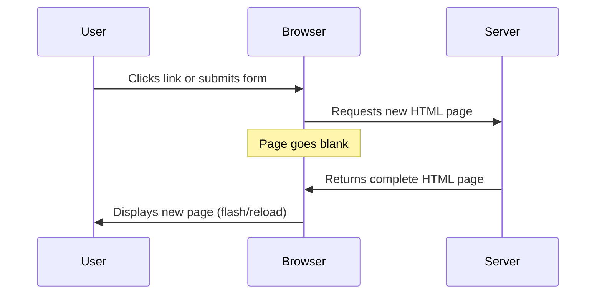
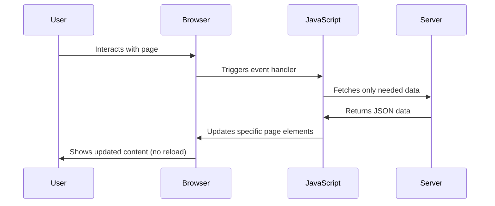
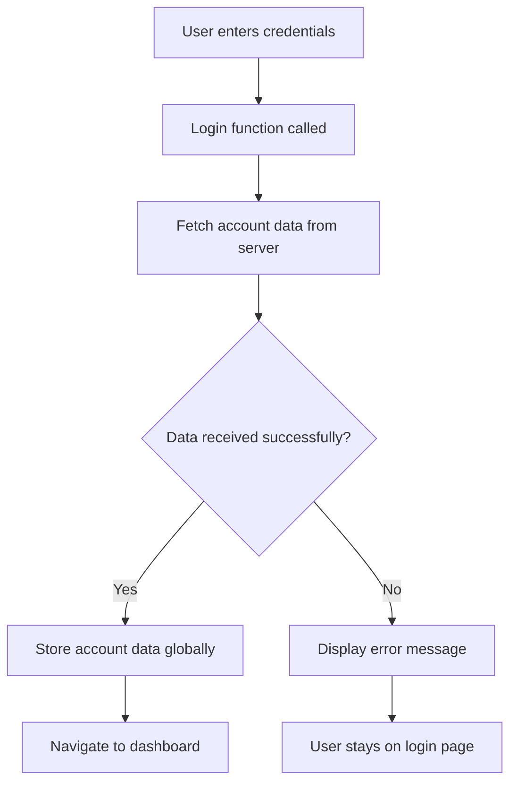
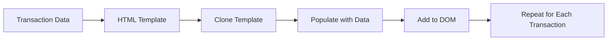

<!--
CO_OP_TRANSLATOR_METADATA:
{
  "original_hash": "2c1164912414820c8efd699b43f64954",
  "translation_date": "2025-10-22T23:10:07+00:00",
  "source_file": "7-bank-project/3-data/README.md",
  "language_code": "br"
}
-->
# Construindo um App Bancário Parte 3: Métodos de Busca e Uso de Dados

Pense no computador da Enterprise em Star Trek - quando o Capitão Picard pede o status da nave, as informações aparecem instantaneamente sem que toda a interface seja interrompida e reconstruída. Esse fluxo contínuo de informações é exatamente o que estamos construindo aqui com a busca dinâmica de dados.

Atualmente, seu app bancário é como um jornal impresso - informativo, mas estático. Vamos transformá-lo em algo mais parecido com o controle de missão da NASA, onde os dados fluem continuamente e são atualizados em tempo real sem interromper o fluxo de trabalho do usuário.

Você aprenderá como se comunicar com servidores de forma assíncrona, lidar com dados que chegam em momentos diferentes e transformar informações brutas em algo significativo para seus usuários. Essa é a diferença entre um demo e um software pronto para produção.

## Quiz Pré-Aula

[Quiz pré-aula](https://ff-quizzes.netlify.app/web/quiz/45)

### Pré-requisitos

Antes de mergulhar na busca de dados, certifique-se de ter os seguintes componentes prontos:

- **Aula Anterior**: Complete o [Formulário de Login e Registro](../2-forms/README.md) - vamos construir com base nesse fundamento
- **Servidor Local**: Instale o [Node.js](https://nodejs.org) e [execute a API do servidor](../api/README.md) para fornecer dados da conta
- **Conexão com a API**: Teste sua conexão com o servidor com este comando:

```bash
curl http://localhost:5000/api
# Expected response: "Bank API v1.0.0"
```

Este teste rápido garante que todos os componentes estão se comunicando corretamente:
- Verifica se o Node.js está funcionando corretamente no seu sistema
- Confirma que o servidor da API está ativo e respondendo
- Valida que seu app pode alcançar o servidor (como verificar o contato de rádio antes de uma missão)

---

## Entendendo a Busca de Dados em Aplicativos Web Modernos

A forma como os aplicativos web lidam com dados evoluiu dramaticamente nas últimas duas décadas. Entender essa evolução ajudará você a apreciar por que técnicas modernas como AJAX e a API Fetch são tão poderosas e por que se tornaram ferramentas essenciais para desenvolvedores web.

Vamos explorar como os sites tradicionais funcionavam em comparação com os aplicativos dinâmicos e responsivos que construímos hoje.

### Aplicativos Tradicionais de Múltiplas Páginas (MPA)

Nos primórdios da web, cada clique era como mudar de canal em uma televisão antiga - a tela ficava em branco e depois sintonizava lentamente o novo conteúdo. Essa era a realidade dos primeiros aplicativos web, onde cada interação significava reconstruir completamente a página inteira do zero.




**Por que essa abordagem parecia desajeitada:**
- Cada clique significava reconstruir a página inteira do zero
- Os usuários eram interrompidos no meio do pensamento por aqueles flashes irritantes de página
- Sua conexão com a internet trabalhava dobrado baixando o mesmo cabeçalho e rodapé repetidamente
- Os aplicativos pareciam mais como navegar por um arquivo do que usar um software

### Aplicativos Modernos de Página Única (SPA)

O AJAX (JavaScript e XML Assíncrono) mudou completamente esse paradigma. Como o design modular da Estação Espacial Internacional, onde os astronautas podem substituir componentes individuais sem reconstruir toda a estrutura, o AJAX nos permite atualizar partes específicas de uma página da web sem recarregar tudo. Apesar do nome mencionar XML, hoje usamos principalmente JSON, mas o princípio central permanece: atualizar apenas o que precisa mudar.




**Por que os SPAs são muito melhores:**
- Apenas as partes que realmente mudaram são atualizadas (inteligente, não é?)
- Sem mais interrupções bruscas - seus usuários permanecem no fluxo
- Menos dados trafegando pela rede significa carregamento mais rápido
- Tudo parece ágil e responsivo, como os aplicativos no seu celular

### A Evolução para a API Fetch Moderna

Os navegadores modernos fornecem a [API `Fetch`](https://developer.mozilla.org/docs/Web/API/Fetch_API), que substitui o antigo [`XMLHttpRequest`](https://developer.mozilla.org/docs/Web/API/XMLHttpRequest/Using_XMLHttpRequest). Como a diferença entre operar um telégrafo e usar e-mail, a API Fetch usa promessas para um código assíncrono mais limpo e lida naturalmente com JSON.

| Recurso | XMLHttpRequest | API Fetch |
|---------|----------------|-----------|
| **Sintaxe** | Baseada em callbacks complexos | Baseada em promessas limpas |
| **Manipulação de JSON** | Requer análise manual | Método embutido `.json()` |
| **Tratamento de Erros** | Informações limitadas sobre erros | Detalhes abrangentes sobre erros |
| **Suporte Moderno** | Compatibilidade com versões antigas | Promessas ES6+ e async/await |

> 💡 **Compatibilidade com Navegadores**: Boas notícias - a API Fetch funciona em todos os navegadores modernos! Se você estiver curioso sobre versões específicas, [caniuse.com](https://caniuse.com/fetch) tem a história completa de compatibilidade.
> 
**O resumo:**
- Funciona muito bem no Chrome, Firefox, Safari e Edge (basicamente em todos os lugares onde seus usuários estão)
- Apenas o Internet Explorer precisa de ajuda extra (e, honestamente, já é hora de deixar o IE para trás)
- Prepara você perfeitamente para os padrões elegantes de async/await que usaremos mais tarde

### Implementando Login de Usuário e Recuperação de Dados

Agora vamos implementar o sistema de login que transforma seu app bancário de uma exibição estática em um aplicativo funcional. Como os protocolos de autenticação usados em instalações militares seguras, vamos verificar as credenciais do usuário e, em seguida, fornecer acesso aos seus dados específicos.

Vamos construir isso de forma incremental, começando com a autenticação básica e depois adicionando as capacidades de busca de dados.

#### Passo 1: Criar a Base da Função de Login

Abra seu arquivo `app.js` e adicione uma nova função `login`. Ela será responsável pelo processo de autenticação do usuário:

```javascript
async function login() {
  const loginForm = document.getElementById('loginForm');
  const user = loginForm.user.value;
}
```

**Vamos detalhar isso:**
- Essa palavra-chave `async`? Está dizendo ao JavaScript "ei, essa função pode precisar esperar por algumas coisas"
- Estamos pegando nosso formulário da página (nada sofisticado, apenas encontrando pelo seu ID)
- Depois, estamos extraindo o que o usuário digitou como nome de usuário
- Aqui vai uma dica legal: você pode acessar qualquer entrada de formulário pelo atributo `name` - sem necessidade de chamadas extras de getElementById!

> 💡 **Padrão de Acesso ao Formulário**: Cada controle de formulário pode ser acessado pelo seu nome (definido no HTML usando o atributo `name`) como uma propriedade do elemento do formulário. Isso fornece uma maneira limpa e legível de obter dados do formulário.

#### Passo 2: Criar a Função de Busca de Dados da Conta

Em seguida, criaremos uma função dedicada para recuperar os dados da conta do servidor. Isso segue o mesmo padrão da função de registro, mas foca na recuperação de dados:

```javascript
async function getAccount(user) {
  try {
    const response = await fetch('//localhost:5000/api/accounts/' + encodeURIComponent(user));
    return await response.json();
  } catch (error) {
    return { error: error.message || 'Unknown error' };
  }
}
```

**O que esse código realiza:**
- **Usa** a moderna API `fetch` para solicitar dados de forma assíncrona
- **Constrói** uma URL de solicitação GET com o parâmetro de nome de usuário
- **Aplica** `encodeURIComponent()` para lidar com caracteres especiais em URLs de forma segura
- **Converte** a resposta para o formato JSON para fácil manipulação de dados
- **Lida** com erros de forma elegante, retornando um objeto de erro em vez de travar

> ⚠️ **Nota de Segurança**: A função `encodeURIComponent()` lida com caracteres especiais em URLs. Como os sistemas de codificação usados em comunicações navais, ela garante que sua mensagem chegue exatamente como pretendido, evitando que caracteres como "#" ou "&" sejam interpretados incorretamente.
> 
**Por que isso importa:**
- Evita que caracteres especiais quebrem URLs
- Protege contra ataques de manipulação de URL
- Garante que seu servidor receba os dados pretendidos
- Segue práticas seguras de codificação

#### Entendendo as Solicitações HTTP GET

Aqui está algo que pode surpreendê-lo: quando você usa `fetch` sem opções extras, ele automaticamente cria uma solicitação [`GET`](https://developer.mozilla.org/docs/Web/HTTP/Methods/GET). Isso é perfeito para o que estamos fazendo - pedindo ao servidor "ei, posso ver os dados da conta deste usuário?"

Pense nas solicitações GET como pedir educadamente para pegar um livro emprestado na biblioteca - você está solicitando ver algo que já existe. Solicitações POST (que usamos para registro) são mais como enviar um novo livro para ser adicionado à coleção.

| Solicitação GET | Solicitação POST |
|-----------------|------------------|
| **Propósito** | Recuperar dados existentes | Enviar novos dados ao servidor |
| **Parâmetros** | No caminho/consulta da URL | No corpo da solicitação |
| **Cache** | Pode ser armazenado em cache pelos navegadores | Normalmente não armazenado em cache |
| **Segurança** | Visível na URL/logs | Oculto no corpo da solicitação |

#### Passo 3: Juntando Tudo

Agora vem a parte satisfatória - vamos conectar sua função de busca de conta ao processo de login. É aqui que tudo se encaixa:

```javascript
async function login() {
  const loginForm = document.getElementById('loginForm');
  const user = loginForm.user.value;
  const data = await getAccount(user);

  if (data.error) {
    return console.log('loginError', data.error);
  }

  account = data;
  navigate('/dashboard');
}
```

Esta função segue uma sequência clara:
- Extrai o nome de usuário da entrada do formulário
- Solicita os dados da conta do usuário ao servidor
- Lida com quaisquer erros que ocorram durante o processo
- Armazena os dados da conta e navega para o painel de controle em caso de sucesso

> 🎯 **Padrão Async/Await**: Como `getAccount` é uma função assíncrona, usamos a palavra-chave `await` para pausar a execução até que o servidor responda. Isso evita que o código continue com dados indefinidos.

#### Passo 4: Criando um Local para Seus Dados

Seu app precisa de um lugar para armazenar as informações da conta assim que forem carregadas. Pense nisso como a memória de curto prazo do seu app - um lugar para manter os dados do usuário atual à mão. Adicione esta linha no topo do seu arquivo `app.js`:

```javascript
// This holds the current user's account data
let account = null;
```

**Por que precisamos disso:**
- Mantém os dados da conta acessíveis de qualquer lugar no seu app
- Começar com `null` significa "ninguém está logado ainda"
- É atualizado quando alguém faz login ou registro com sucesso
- Atua como uma única fonte de verdade - sem confusão sobre quem está logado

#### Passo 5: Conecte Seu Formulário

Agora vamos conectar sua nova função de login ao formulário HTML. Atualize a tag do formulário assim:

```html
<form id="loginForm" action="javascript:login()">
  <!-- Your existing form inputs -->
</form>
```

**O que essa pequena mudança faz:**
- Impede que o formulário execute seu comportamento padrão de "recarregar toda a página"
- Chama sua função personalizada em JavaScript
- Mantém tudo suave e com aparência de aplicativo de página única
- Dá a você controle total sobre o que acontece quando os usuários clicam em "Login"

#### Passo 6: Melhore Sua Função de Registro

Para consistência, atualize sua função `register` para também armazenar os dados da conta e navegar para o painel de controle:

```javascript
// Add these lines at the end of your register function
account = result;
navigate('/dashboard');
```

**Essa melhoria oferece:**
- **Transição suave** do registro para o painel de controle
- **Experiência consistente** para o usuário entre os fluxos de login e registro
- **Acesso imediato** aos dados da conta após o registro bem-sucedido

#### Testando Sua Implementação



**Hora de testar:**
1. Crie uma nova conta para garantir que tudo está funcionando
2. Tente fazer login com essas mesmas credenciais
3. Dê uma olhada no console do seu navegador (F12) se algo parecer errado
4. Certifique-se de que você chega ao painel de controle após um login bem-sucedido

Se algo não estiver funcionando, não entre em pânico! A maioria dos problemas são correções simples, como erros de digitação ou esquecer de iniciar o servidor da API.

#### Uma Palavra Rápida Sobre Magia de Origem Cruzada

Você pode estar se perguntando: "Como meu app web está conversando com este servidor de API quando eles estão rodando em portas diferentes?" Ótima pergunta! Isso toca em algo que todo desenvolvedor web encontra eventualmente.

> 🔒 **Segurança de Origem Cruzada**: Os navegadores aplicam uma "política de mesma origem" para evitar comunicação não autorizada entre diferentes domínios. Como o sistema de controle de acesso no Pentágono, eles verificam se a comunicação é autorizada antes de permitir a transferência de dados.
> 
**Na nossa configuração:**
- Seu app web roda em `localhost:3000` (servidor de desenvolvimento)
- Seu servidor de API roda em `localhost:5000` (servidor backend)
- O servidor de API inclui cabeçalhos [CORS](https://developer.mozilla.org/docs/Web/HTTP/CORS) que autorizam explicitamente a comunicação do seu app web

Essa configuração reflete o desenvolvimento do mundo real, onde aplicativos frontend e backend geralmente rodam em servidores separados.

> 📚 **Saiba Mais**: Aprofunde-se em APIs e busca de dados com este módulo abrangente do [Microsoft Learn sobre APIs](https://docs.microsoft.com/learn/modules/use-apis-discover-museum-art/?WT.mc_id=academic-77807-sagibbon).

## Dando Vida aos Seus Dados no HTML

Agora vamos tornar os dados buscados visíveis para os usuários por meio da manipulação do DOM. Como o processo de revelar fotografias em um laboratório, estamos transformando dados invisíveis em algo que os usuários podem ver e interagir.

A manipulação do DOM é a técnica que transforma páginas web estáticas em aplicativos dinâmicos que atualizam seu conteúdo com base nas interações do usuário e nas respostas do servidor.

### Escolhendo a Ferramenta Certa para o Trabalho

Quando se trata de atualizar seu HTML com JavaScript, você tem várias opções. Pense nelas como diferentes ferramentas em uma caixa de ferramentas - cada uma perfeita para trabalhos específicos:

| Método | Para que é ótimo | Quando usar | Nível de segurança |
|--------|------------------|-------------|--------------------|
| `textContent` | Exibir dados do usuário com segurança | Sempre que estiver mostrando texto | ✅ Muito seguro |
| `createElement()` + `append()` | Construir layouts complexos | Criar novas seções/listas | ✅ Muito seguro |
| `innerHTML` | Definir conteúdo HTML | ⚠️ Tente evitar este | ❌ Arriscado |

#### A Maneira Segura de Mostrar Texto: textContent

A propriedade [`textContent`](https://developer.mozilla.org/docs/Web/API/Node/textContent) é sua melhor amiga ao exibir dados do usuário. É como ter um segurança para sua página web - nada prejudicial passa:

```javascript
// The safe, reliable way to update text
const balanceElement = document.getElementById('balance');
balanceElement.textContent = account.balance;
```

**Benefícios do textContent:**
- Trata tudo como texto simples (impede execução de scripts)
- Limpa automaticamente o conteúdo existente
- Eficiente para atualizações simples de texto
- Oferece segurança integrada contra conteúdo malicioso

#### Criando Elementos HTML Dinâmicos
Para conteúdos mais complexos, combine [`document.createElement()`](https://developer.mozilla.org/docs/Web/API/Document/createElement) com o método [`append()`](https://developer.mozilla.org/docs/Web/API/ParentNode/append):

```javascript
// Safe way to create new elements
const transactionItem = document.createElement('div');
transactionItem.className = 'transaction-item';
transactionItem.textContent = `${transaction.date}: ${transaction.description}`;
container.append(transactionItem);
```

**Entendendo essa abordagem:**
- **Cria** novos elementos DOM programaticamente
- **Mantém** controle total sobre atributos e conteúdo dos elementos
- **Permite** estruturas complexas e aninhadas de elementos
- **Preserva** a segurança ao separar estrutura de conteúdo

> ⚠️ **Consideração de Segurança**: Embora [`innerHTML`](https://developer.mozilla.org/docs/Web/API/Element/innerHTML) apareça em muitos tutoriais, ele pode executar scripts embutidos. Assim como os protocolos de segurança no CERN que impedem a execução de códigos não autorizados, usar `textContent` e `createElement` oferece alternativas mais seguras.
> 
**Riscos do innerHTML:**
- Executa qualquer tag `<script>` nos dados do usuário
- Vulnerável a ataques de injeção de código
- Cria potenciais vulnerabilidades de segurança
- As alternativas mais seguras que estamos utilizando oferecem funcionalidade equivalente

### Tornando os Erros Mais Compreensíveis para os Usuários

Atualmente, os erros de login aparecem apenas no console do navegador, o que é invisível para os usuários. Assim como a diferença entre os diagnósticos internos de um piloto e o sistema de informações para os passageiros, precisamos comunicar informações importantes pelo canal apropriado.

Implementar mensagens de erro visíveis fornece aos usuários um feedback imediato sobre o que deu errado e como proceder.

#### Passo 1: Adicione um Local para Mensagens de Erro

Primeiro, vamos criar um espaço para as mensagens de erro no seu HTML. Adicione isso logo antes do botão de login para que os usuários o vejam naturalmente:

```html
<!-- This is where error messages will appear -->
<div id="loginError" role="alert"></div>
<button>Login</button>
```

**O que está acontecendo aqui:**
- Estamos criando um contêiner vazio que permanece invisível até ser necessário
- Ele está posicionado onde os usuários naturalmente olham após clicar em "Login"
- O atributo `role="alert"` é um toque especial para leitores de tela - ele informa à tecnologia assistiva que "isso é importante!"
- O `id` único dá ao nosso JavaScript um alvo fácil

#### Passo 2: Crie uma Função Auxiliar Prática

Vamos criar uma pequena função utilitária que pode atualizar o texto de qualquer elemento. Essa é uma daquelas funções "escreva uma vez, use em todo lugar" que economizará seu tempo:

```javascript
function updateElement(id, text) {
  const element = document.getElementById(id);
  element.textContent = text;
}
```

**Benefícios da função:**
- Interface simples que requer apenas um ID de elemento e conteúdo de texto
- Localiza e atualiza elementos DOM com segurança
- Padrão reutilizável que reduz duplicação de código
- Mantém comportamento consistente de atualização em toda a aplicação

#### Passo 3: Mostre Erros Onde os Usuários Podem Vê-los

Agora vamos substituir aquela mensagem oculta no console por algo que os usuários possam realmente ver. Atualize sua função de login:

```javascript
// Instead of just logging to console, show the user what's wrong
if (data.error) {
  return updateElement('loginError', data.error);
}
```

**Essa pequena mudança faz uma grande diferença:**
- Mensagens de erro aparecem exatamente onde os usuários estão olhando
- Não há mais falhas silenciosas misteriosas
- Os usuários recebem feedback imediato e acionável
- Seu aplicativo começa a parecer profissional e cuidadoso

Agora, ao testar com uma conta inválida, você verá uma mensagem de erro útil diretamente na página!


#### Passo 4: Sendo Inclusivo com Acessibilidade

Aqui está algo interessante sobre o `role="alert"` que adicionamos anteriormente - não é apenas decoração! Esse pequeno atributo cria o que é chamado de [Região Viva](https://developer.mozilla.org/docs/Web/Accessibility/ARIA/ARIA_Live_Regions) que anuncia imediatamente mudanças para leitores de tela:

```html
<div id="loginError" role="alert"></div>
```

**Por que isso importa:**
- Usuários de leitores de tela ouvem a mensagem de erro assim que ela aparece
- Todos recebem a mesma informação importante, independentemente de como navegam
- É uma maneira simples de fazer seu aplicativo funcionar para mais pessoas
- Mostra que você se preocupa em criar experiências inclusivas

Pequenos detalhes como esse separam bons desenvolvedores de ótimos!

#### Passo 5: Aplique o Mesmo Padrão ao Registro

Para consistência, implemente o mesmo tratamento de erros no seu formulário de registro:

1. **Adicione** um elemento de exibição de erro ao seu HTML de registro:
```html
<div id="registerError" role="alert"></div>
```

2. **Atualize** sua função de registro para usar o mesmo padrão de exibição de erros:
```javascript
if (data.error) {
  return updateElement('registerError', data.error);
}
```

**Benefícios de um tratamento de erros consistente:**
- **Proporciona** uma experiência uniforme ao usuário em todos os formulários
- **Reduz** a carga cognitiva ao usar padrões familiares
- **Simplifica** a manutenção com código reutilizável
- **Garante** que os padrões de acessibilidade sejam atendidos em todo o aplicativo

## Criando Seu Painel Dinâmico

Agora vamos transformar seu painel estático em uma interface dinâmica que exibe dados reais da conta. Como a diferença entre um cronograma de voos impresso e os painéis de partidas ao vivo nos aeroportos, estamos passando de informações estáticas para exibições responsivas em tempo real.

Usando as técnicas de manipulação do DOM que você aprendeu, criaremos um painel que atualiza automaticamente com informações atuais da conta.

### Conhecendo Seus Dados

Antes de começar a construir, vamos dar uma olhada no tipo de dados que seu servidor envia de volta. Quando alguém faz login com sucesso, aqui está o tesouro de informações com o qual você pode trabalhar:

```json
{
  "user": "test",
  "currency": "$",
  "description": "Test account",
  "balance": 75,
  "transactions": [
    { "id": "1", "date": "2020-10-01", "object": "Pocket money", "amount": 50 },
    { "id": "2", "date": "2020-10-03", "object": "Book", "amount": -10 },
    { "id": "3", "date": "2020-10-04", "object": "Sandwich", "amount": -5 }
  ]
}
```

**Essa estrutura de dados fornece:**
- **`user`**: Perfeito para personalizar a experiência ("Bem-vinda de volta, Sarah!")
- **`currency`**: Garante que exibimos valores monetários corretamente
- **`description`**: Um nome amigável para a conta
- **`balance`**: O saldo atual, que é essencial
- **`transactions`**: O histórico completo de transações com todos os detalhes

Tudo o que você precisa para construir um painel bancário com aparência profissional!

> 💡 **Dica Pro**: Quer ver seu painel em ação imediatamente? Use o nome de usuário `test` ao fazer login - ele vem pré-carregado com dados de exemplo para que você possa ver tudo funcionando sem precisar criar transações primeiro.
> 
**Por que a conta de teste é útil:**
- Vem com dados de exemplo realistas já carregados
- Perfeito para ver como as transações são exibidas
- Ótimo para testar os recursos do seu painel
- Economiza o trabalho de criar dados fictícios manualmente

### Criando os Elementos de Exibição do Painel

Vamos construir sua interface do painel passo a passo, começando com as informações resumidas da conta e depois avançando para recursos mais complexos, como listas de transações.

#### Passo 1: Atualize a Estrutura do HTML

Primeiro, substitua a seção estática "Saldo" por elementos de espaço reservado dinâmicos que seu JavaScript pode preencher:

```html
<section>
  Balance: <span id="balance"></span><span id="currency"></span>
</section>
```

Em seguida, adicione uma seção para a descrição da conta. Como isso funciona como um título para o conteúdo do painel, use HTML semântico:

```html
<h2 id="description"></h2>
```

**Entendendo a estrutura do HTML:**
- **Usa** elementos `<span>` separados para saldo e moeda para controle individual
- **Aplica** IDs únicos a cada elemento para direcionamento do JavaScript
- **Segue** o HTML semântico usando `<h2>` para a descrição da conta
- **Cria** uma hierarquia lógica para leitores de tela e SEO

> ✅ **Insight de Acessibilidade**: A descrição da conta funciona como um título para o conteúdo do painel, então está marcada semanticamente como um cabeçalho. Saiba mais sobre como a [estrutura de cabeçalhos](https://www.nomensa.com/blog/2017/how-structure-headings-web-accessibility) impacta a acessibilidade. Você consegue identificar outros elementos na sua página que poderiam se beneficiar de tags de cabeçalho?

#### Passo 2: Crie a Função de Atualização do Painel

Agora crie uma função que preenche seu painel com dados reais da conta:

```javascript
function updateDashboard() {
  if (!account) {
    return navigate('/login');
  }

  updateElement('description', account.description);
  updateElement('balance', account.balance.toFixed(2));
  updateElement('currency', account.currency);
}
```

**Passo a passo, aqui está o que essa função faz:**
- **Valida** se os dados da conta existem antes de prosseguir
- **Redireciona** usuários não autenticados de volta para a página de login
- **Atualiza** a descrição da conta usando a função reutilizável `updateElement`
- **Formata** o saldo para sempre mostrar duas casas decimais
- **Exibe** o símbolo de moeda apropriado

> 💰 **Formatação de Dinheiro**: O método [`toFixed(2)`](https://developer.mozilla.org/docs/Web/JavaScript/Reference/Global_Objects/Number/toFixed) é uma mão na roda! Ele garante que seu saldo sempre pareça dinheiro de verdade - "75,00" em vez de apenas "75". Seus usuários vão apreciar ver a formatação familiar de moeda.

#### Passo 3: Garantindo que Seu Painel Seja Atualizado

Para garantir que seu painel seja atualizado com os dados atuais toda vez que alguém o acessar, precisamos integrá-lo ao seu sistema de navegação. Se você completou a [lição 1](../1-template-route/assignment.md), isso deve parecer familiar. Caso contrário, não se preocupe - aqui está o que você precisa:

Adicione isso ao final da sua função `updateRoute()`:

```javascript
if (typeof route.init === 'function') {
  route.init();
}
```

Em seguida, atualize suas rotas para incluir a inicialização do painel:

```javascript
const routes = {
  '/login': { templateId: 'login' },
  '/dashboard': { templateId: 'dashboard', init: updateDashboard }
};
```

**O que essa configuração inteligente faz:**
- Verifica se uma rota tem código de inicialização especial
- Executa esse código automaticamente quando a rota é carregada
- Garante que seu painel sempre mostre dados frescos e atuais
- Mantém sua lógica de roteamento limpa e organizada

#### Testando Seu Painel

Depois de implementar essas mudanças, teste seu painel:

1. **Faça login** com uma conta de teste
2. **Verifique** se você foi redirecionado para o painel
3. **Confirme** que a descrição da conta, saldo e moeda são exibidos corretamente
4. **Tente sair e entrar novamente** para garantir que os dados sejam atualizados corretamente

Seu painel agora deve exibir informações dinâmicas da conta que são atualizadas com base nos dados do usuário logado!

## Construindo Listas Inteligentes de Transações com Templates

Em vez de criar manualmente o HTML para cada transação, usaremos templates para gerar automaticamente uma formatação consistente. Assim como os componentes padronizados usados na fabricação de espaçonaves, os templates garantem que cada linha de transação siga a mesma estrutura e aparência.

Essa técnica escala eficientemente de algumas transações para milhares, mantendo desempenho e apresentação consistentes.



### Passo 1: Crie o Template de Transação

Primeiro, adicione um template reutilizável para linhas de transação no `<body>` do seu HTML:

```html
<template id="transaction">
  <tr>
    <td></td>
    <td></td>
    <td></td>
  </tr>
</template>
```

**Entendendo os templates HTML:**
- **Define** a estrutura para uma única linha de tabela
- **Permanece** invisível até ser clonado e preenchido com JavaScript
- **Inclui** três células para data, descrição e valor
- **Fornece** um padrão reutilizável para formatação consistente

### Passo 2: Prepare Sua Tabela para Conteúdo Dinâmico

Em seguida, adicione um `id` ao corpo da tabela para que o JavaScript possa facilmente direcioná-lo:

```html
<tbody id="transactions"></tbody>
```

**O que isso realiza:**
- **Cria** um alvo claro para inserir linhas de transação
- **Separa** a estrutura da tabela do conteúdo dinâmico
- **Permite** limpar e repopular os dados da transação com facilidade

### Passo 3: Construa a Função de Fábrica de Linhas de Transação

Agora crie uma função que transforma dados de transação em elementos HTML:

```javascript
function createTransactionRow(transaction) {
  const template = document.getElementById('transaction');
  const transactionRow = template.content.cloneNode(true);
  const tr = transactionRow.querySelector('tr');
  tr.children[0].textContent = transaction.date;
  tr.children[1].textContent = transaction.object;
  tr.children[2].textContent = transaction.amount.toFixed(2);
  return transactionRow;
}
```

**Desmembrando essa função de fábrica:**
- **Recupera** o elemento template pelo seu ID
- **Clona** o conteúdo do template para manipulação segura
- **Seleciona** a linha da tabela dentro do conteúdo clonado
- **Preenche** cada célula com dados da transação
- **Formata** o valor para mostrar casas decimais adequadas
- **Retorna** a linha completa pronta para inserção

### Passo 4: Gere Múltiplas Linhas de Transação de Forma Eficiente

Adicione este código à sua função `updateDashboard()` para exibir todas as transações:

```javascript
const transactionsRows = document.createDocumentFragment();
for (const transaction of account.transactions) {
  const transactionRow = createTransactionRow(transaction);
  transactionsRows.appendChild(transactionRow);
}
updateElement('transactions', transactionsRows);
```

**Entendendo essa abordagem eficiente:**
- **Cria** um fragmento de documento para agrupar operações no DOM
- **Itera** por todas as transações nos dados da conta
- **Gera** uma linha para cada transação usando a função de fábrica
- **Coleta** todas as linhas no fragmento antes de adicionar ao DOM
- **Realiza** uma única atualização no DOM em vez de múltiplas inserções individuais

> ⚡ **Otimização de Desempenho**: [`document.createDocumentFragment()`](https://developer.mozilla.org/docs/Web/API/Document/createDocumentFragment) funciona como o processo de montagem na Boeing - os componentes são preparados fora da linha principal e depois instalados como uma unidade completa. Essa abordagem de agrupamento minimiza os reflows do DOM ao realizar uma única inserção em vez de múltiplas operações individuais.

### Passo 5: Melhore a Função de Atualização para Conteúdo Misto

Sua função `updateElement()` atualmente só lida com conteúdo de texto. Atualize-a para funcionar tanto com strings de texto quanto com nós DOM:

```javascript
function updateElement(id, textOrNode) {
  const element = document.getElementById(id);
  element.textContent = ''; // Removes all children
  element.append(textOrNode);
}
```

**Principais melhorias nesta atualização:**
- **Limpa** o conteúdo existente antes de adicionar novo conteúdo
- **Aceita** strings de texto ou nós DOM como parâmetros
- **Usa** o método [`append()`](https://developer.mozilla.org/docs/Web/API/ParentNode/append) para flexibilidade
- **Mantém** compatibilidade com o uso baseado em texto existente

### Testando Seu Painel

Hora da verdade! Vamos ver seu painel dinâmico em ação:

1. Faça login usando a conta `test` (ela tem dados de exemplo prontos para uso)
2. Navegue até seu painel
3. Verifique se as linhas de transação aparecem com formatação adequada
4. Certifique-se de que datas, descrições e valores estão corretos

Se tudo estiver funcionando, você deve ver uma lista de transações totalmente funcional no seu painel! 🎉

**O que você conquistou:**
- Construiu um painel que escala com qualquer quantidade de dados
- Criou templates reutilizáveis para formatação consistente
- Implementou técnicas eficientes de manipulação do DOM
- Desenvolveu funcionalidades comparáveis a aplicativos bancários de produção

Você transformou com sucesso uma página web estática em um aplicativo web dinâmico.

---

## Desafio do Agente GitHub Copilot 🚀

Use o modo Agente para completar o seguinte desafio:

**Descrição:** Melhore o aplicativo bancário implementando um recurso de busca e filtro de transações que permita aos usuários encontrar transações específicas por intervalo de datas, valor ou descrição.
**Prompt:** Crie uma funcionalidade de busca para o aplicativo bancário que inclua: 1) Um formulário de busca com campos de entrada para intervalo de datas (de/até), valor mínimo/máximo e palavras-chave da descrição da transação, 2) Uma função `filterTransactions()` que filtre o array account.transactions com base nos critérios de busca, 3) Atualize a função `updateDashboard()` para mostrar os resultados filtrados, e 4) Adicione um botão "Limpar Filtros" para redefinir a visualização. Use métodos modernos de array do JavaScript, como `filter()`, e trate casos extremos para critérios de busca vazios.

Saiba mais sobre [modo agente](https://code.visualstudio.com/blogs/2025/02/24/introducing-copilot-agent-mode) aqui.

## 🚀 Desafio

Pronto para levar seu aplicativo bancário para o próximo nível? Vamos fazer com que ele pareça algo que você realmente gostaria de usar. Aqui estão algumas ideias para inspirar sua criatividade:

**Deixe bonito**: Adicione estilos CSS para transformar seu painel funcional em algo visualmente atraente. Pense em linhas limpas, bom espaçamento e talvez até algumas animações sutis.

**Deixe responsivo**: Experimente usar [media queries](https://developer.mozilla.org/docs/Web/CSS/Media_Queries) para criar um [design responsivo](https://developer.mozilla.org/docs/Web/Progressive_web_apps/Responsive/responsive_design_building_blocks) que funcione bem em celulares, tablets e desktops. Seus usuários vão agradecer!

**Adicione um toque especial**: Considere usar cores para categorizar transações (verde para receitas, vermelho para despesas), adicionar ícones ou criar efeitos de hover que tornem a interface mais interativa.

Aqui está um exemplo de como um painel polido pode parecer:


Não sinta que precisa seguir exatamente este modelo - use-o como inspiração e crie algo único!

## Quiz Pós-Aula

[Quiz pós-aula](https://ff-quizzes.netlify.app/web/quiz/46)

## Tarefa

[Refatore e comente seu código](assignment.md)

---

**Aviso Legal**:  
Este documento foi traduzido utilizando o serviço de tradução por IA [Co-op Translator](https://github.com/Azure/co-op-translator). Embora nos esforcemos para garantir a precisão, esteja ciente de que traduções automatizadas podem conter erros ou imprecisões. O documento original em seu idioma nativo deve ser considerado a fonte autoritativa. Para informações críticas, recomenda-se a tradução profissional humana. Não nos responsabilizamos por quaisquer mal-entendidos ou interpretações incorretas decorrentes do uso desta tradução.