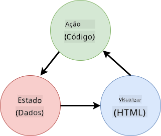

<!--
CO_OP_TRANSLATOR_METADATA:
{
  "original_hash": "32bd800759c3e943c38ad9ae6e1f51e0",
  "translation_date": "2025-10-22T23:09:15+00:00",
  "source_file": "7-bank-project/4-state-management/README.md",
  "language_code": "br"
}
-->
# Construindo um App Bancário Parte 4: Conceitos de Gerenciamento de Estado

## Quiz Pré-Aula

[Quiz pré-aula](https://ff-quizzes.netlify.app/web/quiz/47)

## Introdução

Gerenciamento de estado é como o sistema de navegação da espaçonave Voyager – quando tudo está funcionando bem, você mal percebe que ele existe. Mas quando algo dá errado, ele faz a diferença entre alcançar o espaço interestelar e ficar perdido no vazio cósmico. No desenvolvimento web, estado representa tudo o que sua aplicação precisa lembrar: status de login do usuário, dados de formulários, histórico de navegação e estados temporários da interface.

À medida que seu app bancário evoluiu de um simples formulário de login para uma aplicação mais sofisticada, você provavelmente encontrou alguns desafios comuns. Atualize a página e os usuários são desconectados inesperadamente. Feche o navegador e todo o progresso desaparece. Depure um problema e você está procurando em várias funções que modificam os mesmos dados de maneiras diferentes.

Esses não são sinais de má programação – são os desafios naturais que ocorrem quando as aplicações atingem um certo nível de complexidade. Todo desenvolvedor enfrenta esses desafios à medida que seus apps passam de "prova de conceito" para "pronto para produção".

Nesta lição, implementaremos um sistema centralizado de gerenciamento de estado que transformará seu app bancário em uma aplicação confiável e profissional. Você aprenderá a gerenciar fluxos de dados de forma previsível, a manter sessões de usuários adequadamente e a criar uma experiência de usuário fluida que as aplicações web modernas exigem.

## Pré-requisitos

Antes de mergulhar nos conceitos de gerenciamento de estado, você precisará ter seu ambiente de desenvolvimento configurado corretamente e a base do seu app bancário em funcionamento. Esta lição se baseia diretamente nos conceitos e no código das partes anteriores desta série.

Certifique-se de ter os seguintes componentes prontos antes de prosseguir:

**Configuração Necessária:**
- Concluir a [lição de busca de dados](../3-data/README.md) - seu app deve carregar e exibir dados da conta com sucesso
- Instalar [Node.js](https://nodejs.org) no seu sistema para executar a API backend
- Iniciar a [API do servidor](../api/README.md) localmente para lidar com operações de dados da conta

**Testando Seu Ambiente:**

Verifique se o servidor da API está funcionando corretamente executando este comando em um terminal:

```sh
curl http://localhost:5000/api
# -> should return "Bank API v1.0.0" as a result
```

**O que este comando faz:**
- **Envia** uma solicitação GET para o servidor local da API
- **Testa** a conexão e verifica se o servidor está respondendo
- **Retorna** as informações da versão da API se tudo estiver funcionando corretamente

---

## Diagnosticando os Problemas Atuais de Estado

Como Sherlock Holmes examinando uma cena de crime, precisamos entender exatamente o que está acontecendo na nossa implementação atual antes de resolver o mistério das sessões de usuário desaparecidas.

Vamos realizar um experimento simples que revela os desafios subjacentes ao gerenciamento de estado:

**🧪 Experimente Este Teste Diagnóstico:**
1. Faça login no seu app bancário e navegue até o painel
2. Atualize a página do navegador
3. Observe o que acontece com seu status de login

Se você for redirecionado de volta para a tela de login, você descobriu o clássico problema de persistência de estado. Esse comportamento ocorre porque nossa implementação atual armazena os dados do usuário em variáveis JavaScript que são redefinidas a cada recarregamento da página.

**Problemas da Implementação Atual:**

A simples variável `account` da nossa [lição anterior](../3-data/README.md) cria três problemas significativos que afetam tanto a experiência do usuário quanto a manutenção do código:

| Problema | Causa Técnica | Impacto no Usuário |
|----------|---------------|--------------------|
| **Perda de Sessão** | Atualização da página limpa variáveis JavaScript | Usuários precisam se autenticar frequentemente |
| **Atualizações Espalhadas** | Múltiplas funções modificam o estado diretamente | Depuração se torna cada vez mais difícil |
| **Limpeza Incompleta** | Logout não limpa todas as referências de estado | Potenciais preocupações de segurança e privacidade |

**O Desafio Arquitetural:**

Como o design compartimentado do Titanic, que parecia robusto até que múltiplos compartimentos inundaram simultaneamente, corrigir esses problemas individualmente não resolverá o problema arquitetural subjacente. Precisamos de uma solução abrangente de gerenciamento de estado.

> 💡 **O que estamos realmente tentando alcançar aqui?**

[Gerenciamento de estado](https://en.wikipedia.org/wiki/State_management) trata de resolver dois enigmas fundamentais:

1. **Onde estão meus dados?**: Acompanhar quais informações temos e de onde elas vêm
2. **Todos estão na mesma página?**: Garantir que o que os usuários veem corresponde ao que está realmente acontecendo

**Nosso Plano de Ação:**

Em vez de correr atrás de problemas, vamos criar um sistema de **gerenciamento de estado centralizado**. Pense nisso como ter uma pessoa muito organizada responsável por todas as coisas importantes:



**Entendendo este fluxo de dados:**
- **Centraliza** todo o estado da aplicação em um único local
- **Roteia** todas as mudanças de estado por meio de funções controladas
- **Garante** que a interface do usuário permaneça sincronizada com o estado atual
- **Fornece** um padrão claro e previsível para gerenciamento de dados

> 💡 **Insight Profissional**: Esta lição foca em conceitos fundamentais. Para aplicações complexas, bibliotecas como [Redux](https://redux.js.org) oferecem recursos mais avançados de gerenciamento de estado. Compreender esses princípios básicos ajudará você a dominar qualquer biblioteca de gerenciamento de estado.

> ⚠️ **Tópico Avançado**: Não abordaremos atualizações automáticas da interface do usuário acionadas por mudanças de estado, pois isso envolve conceitos de [Programação Reativa](https://en.wikipedia.org/wiki/Reactive_programming). Considere isso como um excelente próximo passo para sua jornada de aprendizado!

### Tarefa: Centralizar a Estrutura de Estado

Vamos começar transformando nosso gerenciamento de estado espalhado em um sistema centralizado. Este primeiro passo estabelece a base para todas as melhorias que virão.

**Passo 1: Criar um Objeto de Estado Central**

Substitua a declaração simples de `account`:

```js
let account = null;
```

Por um objeto de estado estruturado:

```js
let state = {
  account: null
};
```

**Por que essa mudança é importante:**
- **Centraliza** todos os dados da aplicação em um único local
- **Prepara** a estrutura para adicionar mais propriedades de estado posteriormente
- **Cria** uma separação clara entre estado e outras variáveis
- **Estabelece** um padrão que escala conforme seu app cresce

**Passo 2: Atualizar Padrões de Acesso ao Estado**

Atualize suas funções para usar a nova estrutura de estado:

**Nas funções `register()` e `login()`**, substitua:
```js
account = ...
```

Por:
```js
state.account = ...
```

**Na função `updateDashboard()`**, adicione esta linha no início:
```js
const account = state.account;
```

**O que essas atualizações realizam:**
- **Mantém** a funcionalidade existente enquanto melhora a estrutura
- **Prepara** seu código para um gerenciamento de estado mais sofisticado
- **Cria** padrões consistentes para acessar dados de estado
- **Estabelece** a base para atualizações centralizadas de estado

> 💡 **Nota**: Essa refatoração não resolve imediatamente nossos problemas, mas cria a base essencial para as melhorias poderosas que virão a seguir!

## Implementando Atualizações Controladas de Estado

Com nosso estado centralizado, o próximo passo envolve estabelecer mecanismos controlados para modificações de dados. Essa abordagem garante mudanças de estado previsíveis e facilita a depuração.

O princípio central é semelhante ao controle de tráfego aéreo: em vez de permitir que múltiplas funções modifiquem o estado independentemente, canalizaremos todas as mudanças por meio de uma única função controlada. Esse padrão fornece supervisão clara de quando e como os dados mudam.

**Gerenciamento de Estado Imutável:**

Trataremos nosso objeto `state` como [*imutável*](https://en.wikipedia.org/wiki/Immutable_object), o que significa que nunca o modificaremos diretamente. Em vez disso, cada mudança cria um novo objeto de estado com os dados atualizados.

Embora essa abordagem possa inicialmente parecer ineficiente em comparação com modificações diretas, ela oferece vantagens significativas para depuração, testes e manutenção da previsibilidade da aplicação.

**Benefícios do gerenciamento de estado imutável:**

| Benefício | Descrição | Impacto |
|----------|-----------|---------|
| **Previsibilidade** | Mudanças só acontecem por meio de funções controladas | Mais fácil de depurar e testar |
| **Rastreamento de Histórico** | Cada mudança de estado cria um novo objeto | Habilita funcionalidade de desfazer/refazer |
| **Prevenção de Efeitos Colaterais** | Sem modificações acidentais | Evita bugs misteriosos |
| **Otimização de Desempenho** | Fácil detectar quando o estado realmente mudou | Permite atualizações eficientes da interface do usuário |

**Imutabilidade em JavaScript com `Object.freeze()`:**

O JavaScript fornece [`Object.freeze()`](https://developer.mozilla.org/docs/Web/JavaScript/Reference/Global_Objects/Object/freeze) para evitar modificações em objetos:

```js
const immutableState = Object.freeze({ account: userData });
// Any attempt to modify immutableState will throw an error
```

**Entendendo o que acontece aqui:**
- **Impede** atribuições ou exclusões diretas de propriedades
- **Lança** exceções se tentativas de modificação forem feitas
- **Garante** que mudanças de estado devem passar por funções controladas
- **Cria** um contrato claro para como o estado pode ser atualizado

> 💡 **Exploração Profunda**: Aprenda sobre a diferença entre objetos *imutáveis superficiais* e *imutáveis profundos* na [documentação do MDN](https://developer.mozilla.org/docs/Web/JavaScript/Reference/Global_Objects/Object/freeze#What_is_shallow_freeze). Compreender essa distinção é crucial para estruturas de estado complexas.

### Tarefa

Vamos criar uma nova função `updateState()`:

```js
function updateState(property, newData) {
  state = Object.freeze({
    ...state,
    [property]: newData
  });
}
```

Nesta função, estamos criando um novo objeto de estado e copiando os dados do estado anterior usando o [*operador spread (`...`)*](https://developer.mozilla.org/docs/Web/JavaScript/Reference/Operators/Spread_syntax#Spread_in_object_literals). Em seguida, substituímos uma propriedade específica do objeto de estado pelos novos dados usando a [notação de colchetes](https://developer.mozilla.org/docs/Web/JavaScript/Guide/Working_with_Objects#Objects_and_properties) `[property]` para atribuição. Por fim, bloqueamos o objeto para evitar modificações usando `Object.freeze()`. Por enquanto, temos apenas a propriedade `account` armazenada no estado, mas com essa abordagem você pode adicionar quantas propriedades forem necessárias ao estado.

Também atualizaremos a inicialização do `state` para garantir que o estado inicial também esteja congelado:

```js
let state = Object.freeze({
  account: null
});
```

Depois disso, atualize a função `register` substituindo a atribuição `state.account = result;` por:

```js
updateState('account', result);
```

Faça o mesmo com a função `login`, substituindo `state.account = data;` por:

```js
updateState('account', data);
```

Agora aproveitaremos para corrigir o problema de os dados da conta não serem limpos quando o usuário clica em *Logout*.

Crie uma nova função `logout()`:

```js
function logout() {
  updateState('account', null);
  navigate('/login');
}
```

Na função `updateDashboard()`, substitua o redirecionamento `return navigate('/login');` por `return logout();`;

Tente registrar uma nova conta, sair e entrar novamente para verificar se tudo ainda funciona corretamente.

> Dica: você pode observar todas as mudanças de estado adicionando `console.log(state)` no final de `updateState()` e abrindo o console nas ferramentas de desenvolvimento do navegador.

## Implementando Persistência de Dados

O problema de perda de sessão que identificamos anteriormente requer uma solução de persistência que mantenha o estado do usuário entre sessões do navegador. Isso transforma nossa aplicação de uma experiência temporária em uma ferramenta confiável e profissional.

Considere como relógios atômicos mantêm o tempo preciso mesmo durante quedas de energia, armazenando o estado crítico em memória não volátil. Da mesma forma, aplicações web precisam de mecanismos de armazenamento persistente para preservar dados essenciais do usuário entre sessões do navegador e atualizações de página.

**Perguntas Estratégicas para Persistência de Dados:**

Antes de implementar a persistência, considere esses fatores críticos:

| Pergunta | Contexto do App Bancário | Impacto da Decisão |
|----------|--------------------------|--------------------|
| **Os dados são sensíveis?** | Saldo da conta, histórico de transações | Escolher métodos de armazenamento seguros |
| **Por quanto tempo devem persistir?** | Estado de login vs. preferências temporárias da interface | Selecionar duração apropriada de armazenamento |
| **O servidor precisa deles?** | Tokens de autenticação vs. configurações da interface | Determinar requisitos de compartilhamento |

**Opções de Armazenamento no Navegador:**

Navegadores modernos oferecem vários mecanismos de armazenamento, cada um projetado para diferentes casos de uso:

**APIs de Armazenamento Primárias:**

1. **[`localStorage`](https://developer.mozilla.org/docs/Web/API/Window/localStorage)**: Armazenamento [Key/Value](https://en.wikipedia.org/wiki/Key%E2%80%93value_database) persistente  
   - **Persiste** dados entre sessões do navegador indefinidamente  
   - **Sobrevive** a reinicializações do navegador e do computador
   - **Escopo** limitado ao domínio específico do site
   - **Perfeito** para preferências do usuário e estados de login

2. **[`sessionStorage`](https://developer.mozilla.org/docs/Web/API/Window/sessionStorage)**: Armazenamento temporário de sessão
   - **Funciona** de forma idêntica ao localStorage durante sessões ativas
   - **Limpa** automaticamente quando a aba do navegador é fechada
   - **Ideal** para dados temporários que não devem persistir

3. **[Cookies HTTP](https://developer.mozilla.org/docs/Web/HTTP/Cookies)**: Armazenamento compartilhado com o servidor
   - **Enviado automaticamente** com cada solicitação ao servidor
   - **Perfeito** para [tokens de autenticação](https://en.wikipedia.org/wiki/Authentication)
   - **Limitado** em tamanho e pode impactar o desempenho

**Requisito de Serialização de Dados:**

Tanto `localStorage` quanto `sessionStorage` armazenam apenas [strings](https://developer.mozilla.org/docs/Web/JavaScript/Reference/Global_Objects/String):

```js
// Convert objects to JSON strings for storage
const accountData = { user: 'john', balance: 150 };
localStorage.setItem('account', JSON.stringify(accountData));

// Parse JSON strings back to objects when retrieving
const savedAccount = JSON.parse(localStorage.getItem('account'));
```

**Entendendo a serialização:**
- **Converte** objetos JavaScript em strings JSON usando [`JSON.stringify()`](https://developer.mozilla.org/docs/Web/JavaScript/Reference/Global_Objects/JSON/stringify)
- **Reconstrói** objetos a partir de JSON usando [`JSON.parse()`](https://developer.mozilla.org/docs/Web/JavaScript/Reference/Global_Objects/JSON/parse)
- **Lida** automaticamente com objetos e arrays complexos e aninhados
- **Falha** em funções, valores indefinidos e referências circulares
> 💡 **Opção Avançada**: Para aplicativos offline complexos com grandes volumes de dados, considere a [`API IndexedDB`](https://developer.mozilla.org/docs/Web/API/IndexedDB_API). Ela oferece um banco de dados completo no lado do cliente, mas exige uma implementação mais complexa.

### Tarefa: Implementar Persistência com localStorage

Vamos implementar armazenamento persistente para que os usuários permaneçam logados até que decidam sair explicitamente. Usaremos `localStorage` para armazenar os dados da conta entre sessões do navegador.

**Passo 1: Definir Configuração de Armazenamento**

```js
const storageKey = 'savedAccount';
```

**O que essa constante oferece:**
- **Cria** um identificador consistente para nossos dados armazenados
- **Previne** erros de digitação nas referências de chave de armazenamento
- **Facilita** a alteração da chave de armazenamento, se necessário
- **Segue** as melhores práticas para código sustentável

**Passo 2: Adicionar Persistência Automática**

Adicione esta linha ao final da função `updateState()`:

```js
localStorage.setItem(storageKey, JSON.stringify(state.account));
```

**Explicação do que acontece aqui:**
- **Converte** o objeto da conta em uma string JSON para armazenamento
- **Salva** os dados usando nossa chave de armazenamento consistente
- **Executa** automaticamente sempre que ocorrem mudanças de estado
- **Garante** que os dados armazenados estejam sempre sincronizados com o estado atual

> 💡 **Benefício Arquitetural**: Como centralizamos todas as atualizações de estado na função `updateState()`, adicionar persistência exigiu apenas uma linha de código. Isso demonstra o poder de boas decisões arquiteturais!

**Passo 3: Restaurar Estado ao Carregar o Aplicativo**

Crie uma função de inicialização para restaurar os dados salvos:

```js
function init() {
  const savedAccount = localStorage.getItem(storageKey);
  if (savedAccount) {
    updateState('account', JSON.parse(savedAccount));
  }

  // Our previous initialization code
  window.onpopstate = () => updateRoute();
  updateRoute();
}

init();
```

**Entendendo o processo de inicialização:**
- **Recupera** quaisquer dados de conta previamente salvos no localStorage
- **Converte** a string JSON de volta em um objeto JavaScript
- **Atualiza** o estado usando nossa função de atualização controlada
- **Restaura** automaticamente a sessão do usuário ao carregar a página
- **Executa** antes das atualizações de rota para garantir que o estado esteja disponível

**Passo 4: Otimizar Rota Padrão**

Atualize a rota padrão para aproveitar a persistência:

No `updateRoute()`, substitua:
```js
// Replace: return navigate('/login');
return navigate('/dashboard');
```

**Por que essa mudança faz sentido:**
- **Aproveita** efetivamente nosso novo sistema de persistência
- **Permite** que o painel gerencie as verificações de autenticação
- **Redireciona** automaticamente para o login se não houver sessão salva
- **Cria** uma experiência de usuário mais fluida

**Testando Sua Implementação:**

1. Faça login no seu aplicativo bancário
2. Atualize a página do navegador
3. Verifique se você permanece logado e no painel
4. Feche e reabra o navegador
5. Volte ao seu aplicativo e confirme que você ainda está logado

🎉 **Conquista Desbloqueada**: Você implementou com sucesso o gerenciamento de estado persistente! Seu aplicativo agora se comporta como um aplicativo web profissional.

## Equilibrando Persistência com Atualização de Dados

Nosso sistema de persistência mantém sessões de usuário com sucesso, mas introduz um novo desafio: a desatualização dos dados. Quando múltiplos usuários ou aplicativos modificam os mesmos dados no servidor, as informações armazenadas localmente podem ficar desatualizadas.

Essa situação é semelhante aos navegadores vikings que dependiam tanto de mapas estelares armazenados quanto de observações celestes atuais. Os mapas forneciam consistência, mas os navegadores precisavam de observações frescas para lidar com condições em mudança. Da mesma forma, nosso aplicativo precisa tanto do estado persistente do usuário quanto de dados atualizados do servidor.

**🧪 Descobrindo o Problema de Atualização de Dados:**

1. Faça login no painel usando a conta `test`
2. Execute este comando em um terminal para simular uma transação de outra fonte:

```sh
curl --request POST \
     --header "Content-Type: application/json" \
     --data "{ \"date\": \"2020-07-24\", \"object\": \"Bought book\", \"amount\": -20 }" \
     http://localhost:5000/api/accounts/test/transactions
```

3. Atualize a página do painel no navegador
4. Observe se você vê a nova transação

**O que este teste demonstra:**
- **Mostra** como o localStorage pode ficar "desatualizado"
- **Simula** cenários reais onde mudanças de dados ocorrem fora do seu aplicativo
- **Revela** o conflito entre persistência e atualização de dados

**O Desafio da Desatualização de Dados:**

| Problema | Causa | Impacto no Usuário |
|----------|-------|--------------------|
| **Dados Desatualizados** | localStorage nunca expira automaticamente | Usuários veem informações desatualizadas |
| **Mudanças no Servidor** | Outros aplicativos/usuários modificam os mesmos dados | Visões inconsistentes entre plataformas |
| **Cache vs. Realidade** | Cache local não corresponde ao estado do servidor | Experiência ruim e confusão para o usuário |

**Estratégia de Solução:**

Implementaremos um padrão de "atualização ao carregar" que equilibra os benefícios da persistência com a necessidade de dados atualizados. Essa abordagem mantém a experiência do usuário fluida enquanto garante a precisão dos dados.

### Tarefa: Implementar Sistema de Atualização de Dados

Vamos criar um sistema que busca automaticamente dados atualizados do servidor enquanto mantém os benefícios do gerenciamento de estado persistente.

**Passo 1: Criar Atualizador de Dados da Conta**

```js
async function updateAccountData() {
  const account = state.account;
  if (!account) {
    return logout();
  }

  const data = await getAccount(account.user);
  if (data.error) {
    return logout();
  }

  updateState('account', data);
}
```

**Entendendo a lógica dessa função:**
- **Verifica** se um usuário está atualmente logado (state.account existe)
- **Redireciona** para logout se nenhuma sessão válida for encontrada
- **Busca** dados atualizados da conta no servidor usando a função existente `getAccount()`
- **Lida** com erros do servidor de forma elegante, encerrando sessões inválidas
- **Atualiza** o estado com dados frescos usando nosso sistema de atualização controlada
- **Dispara** persistência automática no localStorage através da função `updateState()`

**Passo 2: Criar Manipulador de Atualização do Painel**

```js
async function refresh() {
  await updateAccountData();
  updateDashboard();
}
```

**O que essa função de atualização realiza:**
- **Coordena** o processo de atualização de dados e interface do usuário
- **Aguarda** os dados frescos serem carregados antes de atualizar a exibição
- **Garante** que o painel mostre as informações mais atuais
- **Mantém** uma separação clara entre gerenciamento de dados e atualizações de interface

**Passo 3: Integrar ao Sistema de Rotas**

Atualize sua configuração de rotas para acionar a atualização automaticamente:

```js
const routes = {
  '/login': { templateId: 'login' },
  '/dashboard': { templateId: 'dashboard', init: refresh }
};
```

**Como essa integração funciona:**
- **Executa** a função de atualização toda vez que a rota do painel é carregada
- **Garante** que dados frescos sejam sempre exibidos quando os usuários navegam para o painel
- **Mantém** a estrutura de rotas existente enquanto adiciona atualização de dados
- **Fornece** um padrão consistente para inicialização específica de rotas

**Testando Seu Sistema de Atualização de Dados:**

1. Faça login no seu aplicativo bancário
2. Execute o comando curl mencionado anteriormente para criar uma nova transação
3. Atualize a página do painel ou navegue para fora e volte
4. Verifique se a nova transação aparece imediatamente

🎉 **Equilíbrio Perfeito Alcançado**: Seu aplicativo agora combina a experiência fluida de estado persistente com a precisão de dados frescos do servidor!

## Desafio do Agente GitHub Copilot 🚀

Use o modo Agente para completar o seguinte desafio:

**Descrição:** Implemente um sistema abrangente de gerenciamento de estado com funcionalidade de desfazer/refazer para o aplicativo bancário. Este desafio ajudará você a praticar conceitos avançados de gerenciamento de estado, incluindo rastreamento de histórico de estado, atualizações imutáveis e sincronização da interface do usuário.

**Prompt:** Crie um sistema de gerenciamento de estado aprimorado que inclua: 1) Um array de histórico de estado que rastreia todos os estados anteriores, 2) Funções de desfazer e refazer que podem reverter para estados anteriores, 3) Botões de interface para operações de desfazer/refazer no painel, 4) Um limite máximo de histórico de 10 estados para evitar problemas de memória, e 5) Limpeza adequada do histórico quando o usuário fizer logout. Certifique-se de que a funcionalidade de desfazer/refazer funcione com alterações no saldo da conta e persista entre atualizações do navegador.

Saiba mais sobre o [modo agente](https://code.visualstudio.com/blogs/2025/02/24/introducing-copilot-agent-mode) aqui.

## 🚀 Desafio: Otimização de Armazenamento

Sua implementação agora gerencia sessões de usuário, atualização de dados e gerenciamento de estado de forma eficaz. No entanto, considere se nossa abordagem atual equilibra de forma ideal a eficiência de armazenamento com a funcionalidade.

Como mestres de xadrez que distinguem entre peças essenciais e peões descartáveis, o gerenciamento eficaz de estado exige identificar quais dados devem persistir versus quais devem sempre ser atualizados do servidor.

**Análise de Otimização:**

Avalie sua implementação atual de localStorage e considere estas questões estratégicas:
- Qual é a informação mínima necessária para manter a autenticação do usuário?
- Quais dados mudam com frequência suficiente para que o cache local ofereça pouco benefício?
- Como a otimização de armazenamento pode melhorar o desempenho sem prejudicar a experiência do usuário?

**Estratégia de Implementação:**
- **Identifique** os dados essenciais que devem persistir (provavelmente apenas a identificação do usuário)
- **Modifique** sua implementação de localStorage para armazenar apenas dados críticos da sessão
- **Garanta** que dados frescos sejam sempre carregados do servidor nas visitas ao painel
- **Teste** se sua abordagem otimizada mantém a mesma experiência do usuário

**Consideração Avançada:**
- **Compare** os trade-offs entre armazenar dados completos da conta versus apenas tokens de autenticação
- **Documente** suas decisões e raciocínio para futuros membros da equipe

Este desafio ajudará você a pensar como um desenvolvedor profissional que considera tanto a experiência do usuário quanto a eficiência do aplicativo. Reserve um tempo para experimentar diferentes abordagens!

## Quiz Pós-Aula

[Quiz pós-aula](https://ff-quizzes.netlify.app/web/quiz/48)

## Tarefa

[Implementar diálogo "Adicionar transação"](assignment.md)

Aqui está um exemplo de resultado após completar a tarefa:


---

**Aviso Legal**:  
Este documento foi traduzido utilizando o serviço de tradução por IA [Co-op Translator](https://github.com/Azure/co-op-translator). Embora nos esforcemos para garantir a precisão, esteja ciente de que traduções automáticas podem conter erros ou imprecisões. O documento original em seu idioma nativo deve ser considerado a fonte autoritativa. Para informações críticas, recomenda-se a tradução profissional humana. Não nos responsabilizamos por quaisquer mal-entendidos ou interpretações incorretas decorrentes do uso desta tradução.