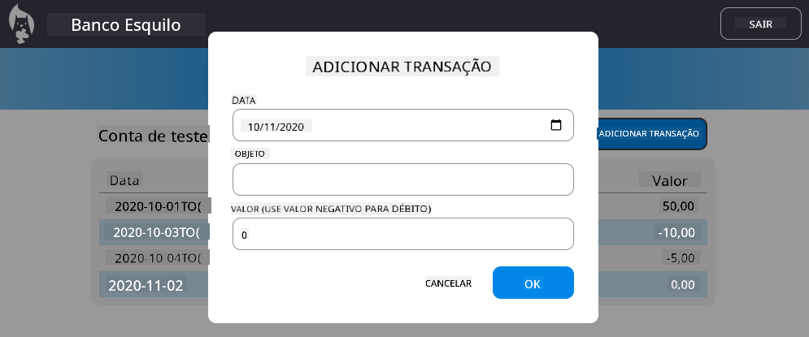

<!--
CO_OP_TRANSLATOR_METADATA:
{
  "original_hash": "50a7783473b39a2e0f133e271a102231",
  "translation_date": "2025-10-22T23:09:52+00:00",
  "source_file": "7-bank-project/4-state-management/assignment.md",
  "language_code": "br"
}
-->
# Implementar o Diálogo "Adicionar Transação"

## Visão Geral

Seu aplicativo bancário agora possui uma gestão de estado sólida e persistência de dados, mas está faltando um recurso essencial que aplicativos bancários reais precisam: a capacidade dos usuários adicionarem suas próprias transações. Nesta tarefa, você implementará um diálogo completo de "Adicionar Transação" que se integra perfeitamente ao seu sistema de gestão de estado existente.

Esta tarefa reúne tudo o que você aprendeu nas quatro lições sobre bancos: criação de templates em HTML, manipulação de formulários, integração com API e gestão de estado.

## Objetivos de Aprendizado

Ao concluir esta tarefa, você será capaz de:
- **Criar** uma interface de diálogo amigável para entrada de dados
- **Implementar** um design de formulário acessível com suporte para teclado e leitores de tela
- **Integrar** novos recursos ao seu sistema de gestão de estado existente
- **Praticar** comunicação com API e tratamento de erros
- **Aplicar** padrões modernos de desenvolvimento web em um recurso do mundo real

## Instruções

### Etapa 1: Botão Adicionar Transação

**Crie** um botão "Adicionar Transação" na página do painel que os usuários possam encontrar e acessar facilmente.

**Requisitos:**
- **Coloque** o botão em um local lógico no painel
- **Use** um texto claro e orientado para ação no botão
- **Estilize** o botão para combinar com o design da sua interface existente
- **Garanta** que o botão seja acessível via teclado

### Etapa 2: Implementação do Diálogo

Escolha uma das duas abordagens para implementar seu diálogo:

**Opção A: Página Separada**
- **Crie** um novo template HTML para o formulário de transação
- **Adicione** uma nova rota ao seu sistema de roteamento
- **Implemente** a navegação para e a partir da página do formulário

**Opção B: Diálogo Modal (Recomendado)**
- **Use** JavaScript para mostrar/ocultar o diálogo sem sair do painel
- **Implemente** utilizando a propriedade [`hidden`](https://developer.mozilla.org/docs/Web/HTML/Global_attributes/hidden) ou classes CSS
- **Crie** uma experiência de usuário suave com gerenciamento adequado de foco

### Etapa 3: Implementação de Acessibilidade

**Garanta** que seu diálogo atenda aos [padrões de acessibilidade para diálogos modais](https://developer.paciellogroup.com/blog/2018/06/the-current-state-of-modal-dialog-accessibility/):

**Navegação por Teclado:**
- **Suporte** à tecla Escape para fechar o diálogo
- **Prenda** o foco dentro do diálogo quando aberto
- **Retorne** o foco ao botão de ativação quando fechado

**Suporte para Leitores de Tela:**
- **Adicione** rótulos e funções ARIA apropriados
- **Anuncie** a abertura/fechamento do diálogo para leitores de tela
- **Forneça** rótulos claros para os campos do formulário e mensagens de erro

### Etapa 4: Criação do Formulário

**Projete** um formulário HTML que colete os dados da transação:

**Campos Obrigatórios:**
- **Data**: Quando a transação ocorreu
- **Descrição**: Para que foi a transação
- **Valor**: Valor da transação (positivo para receita, negativo para despesas)

**Recursos do Formulário:**
- **Valide** a entrada do usuário antes do envio
- **Forneça** mensagens de erro claras para dados inválidos
- **Inclua** texto de placeholder e rótulos úteis
- **Estilize** de forma consistente com seu design existente

### Etapa 5: Integração com API

**Conecte** seu formulário à API do backend:

**Passos de Implementação:**
- **Revise** as [especificações da API do servidor](../api/README.md) para o endpoint correto e formato de dados
- **Crie** dados JSON a partir das entradas do formulário
- **Envie** os dados para a API com tratamento de erros adequado
- **Exiba** mensagens de sucesso/falha para o usuário
- **Trate** erros de rede de forma elegante

### Etapa 6: Integração com Gestão de Estado

**Atualize** seu painel com a nova transação:

**Requisitos de Integração:**
- **Atualize** os dados da conta após a adição bem-sucedida da transação
- **Atualize** a exibição do painel sem exigir recarregamento da página
- **Garanta** que a nova transação apareça imediatamente
- **Mantenha** a consistência do estado durante todo o processo

## Especificações Técnicas

**Detalhes do Endpoint da API:**
Consulte a [documentação da API do servidor](../api/README.md) para:
- Formato JSON necessário para os dados da transação
- Método HTTP e URL do endpoint
- Formato esperado de resposta
- Tratamento de respostas de erro

**Resultado Esperado:**
Após concluir esta tarefa, seu aplicativo bancário deve ter um recurso de "Adicionar Transação" totalmente funcional que pareça e se comporte de forma profissional:

## Testando Sua Implementação

**Testes Funcionais:**
1. **Verifique** se o botão "Adicionar Transação" está claramente visível e acessível
2. **Teste** se o diálogo abre e fecha corretamente
3. **Confirme** se a validação do formulário funciona para todos os campos obrigatórios
4. **Cheque** se as transações bem-sucedidas aparecem imediatamente no painel
5. **Garanta** que o tratamento de erros funcione para dados inválidos e problemas de rede

**Testes de Acessibilidade:**
1. **Navegue** por todo o fluxo usando apenas o teclado
2. **Teste** com um leitor de tela para garantir anúncios adequados
3. **Verifique** se o gerenciamento de foco funciona corretamente
4. **Cheque** se todos os elementos do formulário possuem rótulos apropriados

## Rubrica de Avaliação

| Critério | Exemplar | Adequado | Necessita Melhorias |
| -------- | --------- | -------- | ------------------- |
| **Funcionalidade** | O recurso de adicionar transação funciona perfeitamente com excelente experiência do usuário e segue todas as melhores práticas das lições | O recurso de adicionar transação funciona corretamente, mas pode não seguir algumas melhores práticas ou ter pequenos problemas de usabilidade | O recurso de adicionar transação funciona parcialmente ou tem problemas significativos de usabilidade |
| **Qualidade do Código** | Código bem organizado, segue padrões estabelecidos, inclui tratamento de erros adequado e se integra perfeitamente à gestão de estado existente | Código funciona, mas pode ter alguns problemas de organização ou padrões inconsistentes com o código existente | Código tem problemas estruturais significativos ou não se integra bem aos padrões existentes |
| **Acessibilidade** | Suporte completo à navegação por teclado, compatibilidade com leitores de tela e segue as diretrizes WCAG com excelente gerenciamento de foco | Recursos básicos de acessibilidade implementados, mas pode faltar suporte à navegação por teclado ou recursos para leitores de tela | Considerações de acessibilidade limitadas ou inexistentes |
| **Experiência do Usuário** | Interface intuitiva e polida com feedback claro, interações suaves e aparência profissional | Boa experiência do usuário com pequenas áreas para melhoria no feedback ou design visual | Experiência do usuário ruim com interface confusa ou falta de feedback ao usuário |

## Desafios Adicionais (Opcional)

Depois de concluir os requisitos básicos, considere estas melhorias:

**Recursos Avançados:**
- **Adicione** categorias de transação (alimentação, transporte, entretenimento, etc.)
- **Implemente** validação de entrada com feedback em tempo real
- **Crie** atalhos de teclado para usuários avançados
- **Adicione** funcionalidades de edição e exclusão de transações

**Integração Avançada:**
- **Implemente** funcionalidade de desfazer para transações adicionadas recentemente
- **Adicione** importação de transações em massa a partir de arquivos CSV
- **Crie** recursos de busca e filtragem de transações
- **Implemente** funcionalidade de exportação de dados

Esses recursos opcionais ajudarão você a praticar conceitos mais avançados de desenvolvimento web e criar um aplicativo bancário mais completo!

---

**Aviso Legal**:  
Este documento foi traduzido utilizando o serviço de tradução por IA [Co-op Translator](https://github.com/Azure/co-op-translator). Embora nos esforcemos para garantir a precisão, esteja ciente de que traduções automáticas podem conter erros ou imprecisões. O documento original em seu idioma nativo deve ser considerado a fonte autoritativa. Para informações críticas, recomenda-se a tradução profissional humana. Não nos responsabilizamos por quaisquer mal-entendidos ou interpretações incorretas decorrentes do uso desta tradução.