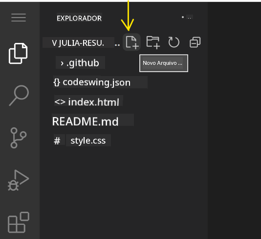
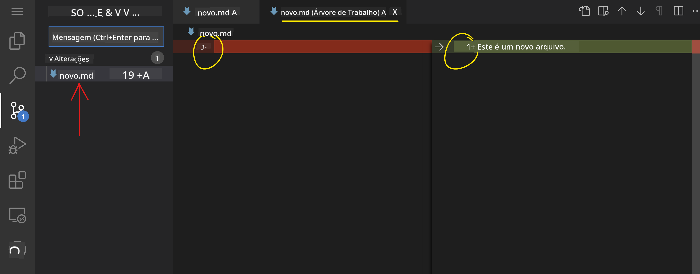
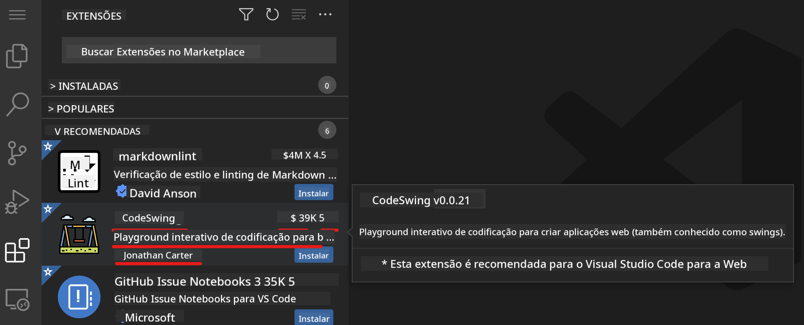
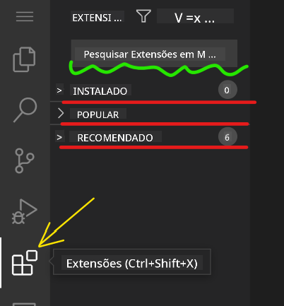

<!--
CO_OP_TRANSLATOR_METADATA:
{
  "original_hash": "1ba61d96a11309a2a6ea507496dcf7e5",
  "translation_date": "2025-08-28T23:57:03+00:00",
  "source_file": "8-code-editor/1-using-a-code-editor/README.md",
  "language_code": "br"
}
-->
# Usando um editor de código

Esta lição aborda os conceitos básicos de como usar o [VSCode.dev](https://vscode.dev), um editor de código baseado na web, para que você possa fazer alterações no seu código e contribuir com um projeto sem precisar instalar nada no seu computador.

## Objetivos de aprendizado

Nesta lição, você aprenderá a:

- Usar um editor de código em um projeto de programação
- Acompanhar alterações com controle de versão
- Personalizar o editor para desenvolvimento

### Pré-requisitos

Antes de começar, você precisará criar uma conta no [GitHub](https://github.com). Acesse [GitHub](https://github.com/) e crie uma conta, caso ainda não tenha uma.

### Introdução

Um editor de código é uma ferramenta essencial para escrever programas e colaborar em projetos de programação existentes. Assim que você entender os conceitos básicos de um editor e como aproveitar seus recursos, poderá aplicá-los ao escrever código.

## Começando com o VSCode.dev

O [VSCode.dev](https://vscode.dev) é um editor de código na web. Você não precisa instalar nada para usá-lo, é como abrir qualquer outro site. Para começar, abra o seguinte link: [https://vscode.dev](https://vscode.dev). Se você não estiver conectado ao [GitHub](https://github.com/), siga as instruções para fazer login ou criar uma nova conta e, em seguida, faça login.

Depois de carregar, ele deve se parecer com esta imagem:


Existem três seções principais, da esquerda para a direita:

1. A _barra de atividades_, que inclui alguns ícones, como a lupa 🔎, a engrenagem ⚙️ e outros.
2. A barra de atividades expandida, que por padrão exibe o _Explorador_, chamada de _barra lateral_.
3. E, finalmente, a área de código à direita.

Clique em cada um dos ícones para exibir um menu diferente. Quando terminar, clique no _Explorador_ para voltar ao ponto de partida.

Quando você começar a criar ou modificar código existente, isso acontecerá na maior área à direita. Você também usará essa área para visualizar o código existente, o que será feito a seguir.

## Abrir um repositório do GitHub

A primeira coisa que você precisará fazer é abrir um repositório do GitHub. Existem várias maneiras de abrir um repositório. Nesta seção, você verá duas formas diferentes de abrir um repositório para começar a trabalhar nas alterações.

### 1. Com o editor

Use o próprio editor para abrir um repositório remoto. Se você acessar [VSCode.dev](https://vscode.dev), verá um botão _"Open Remote Repository"_:


Você também pode usar a paleta de comandos. A paleta de comandos é uma caixa de entrada onde você pode digitar qualquer palavra que faça parte de um comando ou ação para encontrar o comando correto a ser executado. Use o menu no canto superior esquerdo, selecione _View_ e, em seguida, escolha _Command Palette_, ou use o atalho de teclado: Ctrl-Shift-P (no MacOS seria Command-Shift-P).


Quando o menu abrir, digite _open remote repository_ e selecione a primeira opção. Vários repositórios dos quais você faz parte ou que abriu recentemente aparecerão. Você também pode usar uma URL completa do GitHub para selecionar um. Use a seguinte URL e cole na caixa:

```
https://github.com/microsoft/Web-Dev-For-Beginners
```

✅ Se for bem-sucedido, você verá todos os arquivos deste repositório carregados no editor de texto.

### 2. Usando a URL

Você também pode usar uma URL diretamente para carregar um repositório. Por exemplo, a URL completa para o repositório atual é [https://github.com/microsoft/Web-Dev-For-Beginners](https://github.com/microsoft/Web-Dev-For-Beginners), mas você pode substituir o domínio do GitHub por `VSCode.dev/github` e carregar o repositório diretamente. A URL resultante seria [https://vscode.dev/github/microsoft/Web-Dev-For-Beginners](https://vscode.dev/github/microsoft/Web-Dev-For-Beginners).

## Editar arquivos

Depois de abrir o repositório no navegador/vscode.dev, o próximo passo será fazer atualizações ou alterações no projeto.

### 1. Criar um novo arquivo

Você pode criar um arquivo dentro de uma pasta existente ou na pasta/diretório raiz. Para criar um novo arquivo, abra o local/diretório onde deseja salvar o arquivo e selecione o ícone _'New file ...'_ na barra de atividades _(à esquerda)_, dê um nome ao arquivo e pressione Enter.



### 2. Editar e salvar um arquivo no repositório

Usar o vscode.dev é útil sempre que você quiser fazer atualizações rápidas no seu projeto sem precisar carregar nenhum software localmente.  
Para atualizar seu código, clique no ícone 'Explorer', também localizado na barra de atividades, para visualizar os arquivos e pastas no repositório.  
Selecione um arquivo para abri-lo na área de código, faça suas alterações e salve.


Depois de terminar de atualizar seu projeto, selecione o ícone _`source control`_, que contém todas as novas alterações feitas no repositório.

Para visualizar as alterações feitas no projeto, selecione o(s) arquivo(s) na pasta `Changes` na barra de atividades expandida. Isso abrirá um 'Working Tree' para você visualizar as alterações feitas no arquivo. Vermelho indica uma exclusão no projeto, enquanto verde indica uma adição.



Se estiver satisfeito com as alterações feitas, passe o mouse sobre a pasta `Changes` e clique no botão `+` para preparar as alterações. Preparar significa simplesmente preparar suas alterações para enviá-las ao GitHub.

Se, no entanto, você não estiver confortável com algumas alterações e quiser descartá-las, passe o mouse sobre a pasta `Changes` e selecione o ícone de `desfazer`.

Depois, digite uma `mensagem de commit` _(uma descrição das alterações feitas no projeto)_, clique no ícone de `check` para confirmar e enviar suas alterações.

Quando terminar de trabalhar no projeto, selecione o `ícone de menu hambúrguer` no canto superior esquerdo para retornar ao repositório no github.com.


## Usando extensões

Instalar extensões no VSCode permite adicionar novos recursos e opções de personalização ao ambiente de desenvolvimento no editor, melhorando seu fluxo de trabalho. Essas extensões também ajudam a adicionar suporte para várias linguagens de programação e geralmente são genéricas ou específicas para uma linguagem.

Para navegar pela lista de todas as extensões disponíveis, clique no ícone _`Extensions`_ na barra de atividades e comece a digitar o nome da extensão no campo de texto rotulado como _'Search Extensions in Marketplace'_.  
Você verá uma lista de extensões, cada uma contendo **o nome da extensão, o nome do publicador, uma descrição de uma frase, o número de downloads** e **uma classificação por estrelas**.



Você também pode visualizar todas as extensões previamente instaladas expandindo a pasta _`Installed`_, extensões populares usadas pela maioria dos desenvolvedores na pasta _`Popular`_ e extensões recomendadas para você, seja por usuários no mesmo workspace ou com base nos arquivos abertos recentemente, na pasta _`Recommended`_.



### 1. Instalar extensões

Para instalar uma extensão, digite o nome da extensão no campo de busca e clique nela para visualizar informações adicionais na área de código assim que ela aparecer na barra de atividades expandida.

Você pode clicar no _botão azul de instalar_ na barra de atividades expandida para instalar ou usar o botão de instalação que aparece na área de código ao selecionar a extensão para carregar informações adicionais.


### 2. Personalizar extensões

Depois de instalar a extensão, talvez seja necessário modificar seu comportamento e personalizá-la de acordo com suas preferências. Para fazer isso, selecione o ícone Extensions e, desta vez, sua extensão aparecerá na pasta _Installed_. Clique no _**ícone de engrenagem**_ e navegue até _Extensions Setting_.


### 3. Gerenciar extensões

Depois de instalar e usar sua extensão, o vscode.dev oferece opções para gerenciá-la com base em diferentes necessidades. Por exemplo, você pode:

- **Desativar:** _(Você pode desativar temporariamente uma extensão quando não precisar mais dela, mas não quiser desinstalá-la completamente)_

    Selecione a extensão instalada na barra de atividades expandida > clique no ícone de engrenagem > selecione 'Disable' ou 'Disable (Workspace)' **OU** abra a extensão na área de código e clique no botão azul Disable.

- **Desinstalar:** Selecione a extensão instalada na barra de atividades expandida > clique no ícone de engrenagem > selecione 'Uninstall' **OU** abra a extensão na área de código e clique no botão azul Uninstall.

---

## Tarefa

[Crie um site de currículo usando vscode.dev](https://github.com/microsoft/Web-Dev-For-Beginners/blob/main/8-code-editor/1-using-a-code-editor/assignment.md)

## Revisão e Autoestudo

Leia mais sobre o [VSCode.dev](https://code.visualstudio.com/docs/editor/vscode-web?WT.mc_id=academic-0000-alfredodeza) e alguns de seus outros recursos.

---

**Aviso Legal**:  
Este documento foi traduzido utilizando o serviço de tradução por IA [Co-op Translator](https://github.com/Azure/co-op-translator). Embora nos esforcemos para garantir a precisão, esteja ciente de que traduções automatizadas podem conter erros ou imprecisões. O documento original em seu idioma nativo deve ser considerado a fonte autoritativa. Para informações críticas, recomenda-se a tradução profissional realizada por humanos. Não nos responsabilizamos por quaisquer mal-entendidos ou interpretações equivocadas decorrentes do uso desta tradução.