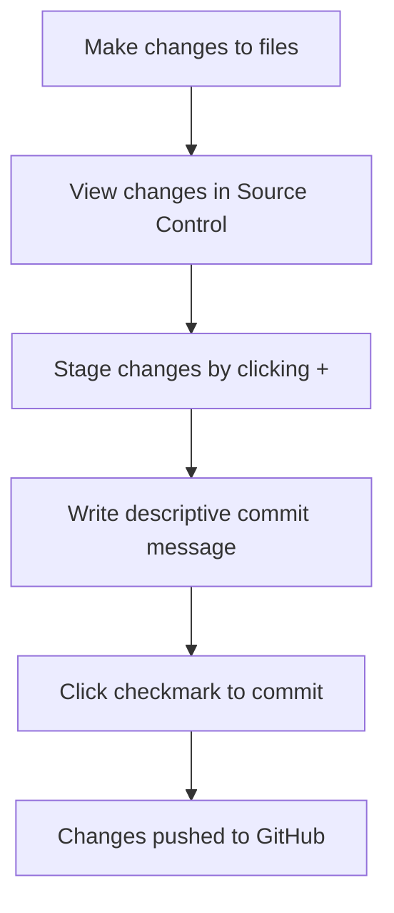

<!--
CO_OP_TRANSLATOR_METADATA:
{
  "original_hash": "cfd4a15974168ca426d50c67682ab9d4",
  "translation_date": "2025-10-22T23:00:38+00:00",
  "source_file": "8-code-editor/1-using-a-code-editor/README.md",
  "language_code": "br"
}
-->
# Usando um Editor de Código: Dominando o VSCode.dev

Lembra no *Matrix* quando Neo precisava se conectar a um enorme terminal de computador para acessar o mundo digital? As ferramentas de desenvolvimento web de hoje contam uma história oposta – capacidades incrivelmente poderosas acessíveis de qualquer lugar. O VSCode.dev é um editor de código baseado em navegador que traz ferramentas de desenvolvimento profissionais para qualquer dispositivo com conexão à internet.

Assim como a prensa de Gutenberg tornou os livros acessíveis a todos, e não apenas aos escribas em mosteiros, o VSCode.dev democratiza a programação. Você pode trabalhar em projetos de um computador na biblioteca, em um laboratório escolar ou em qualquer lugar com acesso ao navegador. Sem instalações, sem limitações de "preciso da minha configuração específica".

Ao final desta lição, você entenderá como navegar no VSCode.dev, abrir repositórios do GitHub diretamente no navegador e usar o Git para controle de versão – habilidades que os desenvolvedores profissionais utilizam diariamente.

## O que você vai aprender

Depois de passarmos por isso juntos, você será capaz de:

- Navegar no VSCode.dev como se fosse sua segunda casa – encontrando tudo o que precisa sem se perder
- Abrir qualquer repositório do GitHub no navegador e começar a editar imediatamente (essa parte é mágica!)
- Usar o Git para rastrear suas alterações e salvar seu progresso como um profissional
- Turbinar seu editor com extensões que tornam a programação mais rápida e divertida
- Criar e organizar arquivos de projeto com confiança

## O que você vai precisar

Os requisitos são simples:

- Uma conta gratuita no [GitHub](https://github.com) (vamos te guiar na criação, se necessário)
- Familiaridade básica com navegadores web
- A lição de Noções Básicas do GitHub fornece um bom contexto, embora não seja essencial

> 💡 **Novo no GitHub?** Criar uma conta é gratuito e leva apenas alguns minutos. Assim como um cartão de biblioteca dá acesso a livros em todo o mundo, uma conta no GitHub abre portas para repositórios de código na internet.

## Por que os editores de código baseados na web são importantes

Antes da internet, cientistas de diferentes universidades não podiam compartilhar pesquisas facilmente. Então veio a ARPANET nos anos 1960, conectando computadores à distância. Os editores de código baseados na web seguem o mesmo princípio – tornando ferramentas poderosas acessíveis, independentemente da sua localização física ou dispositivo.

Um editor de código serve como seu espaço de trabalho de desenvolvimento, onde você escreve, edita e organiza arquivos de código. Diferentemente de editores de texto simples, os editores de código profissionais oferecem realce de sintaxe, detecção de erros e recursos de gerenciamento de projetos.

O VSCode.dev traz essas capacidades para o navegador:

**Vantagens da edição baseada na web:**

| Recurso | Descrição | Benefício Prático |
|---------|-------------|----------|
| **Independência de Plataforma** | Funciona em qualquer dispositivo com navegador | Trabalhe em diferentes computadores sem problemas |
| **Sem Necessidade de Instalação** | Acesso por meio de uma URL | Evite restrições de instalação de software |
| **Atualizações Automáticas** | Sempre executa a versão mais recente | Acesse novos recursos sem atualizações manuais |
| **Integração com Repositórios** | Conexão direta com o GitHub | Edite código sem gerenciar arquivos localmente |

**Implicações práticas:**
- Continuidade de trabalho em diferentes ambientes
- Interface consistente, independentemente do sistema operacional
- Capacidades imediatas de colaboração
- Redução da necessidade de armazenamento local

## Explorando o VSCode.dev

Assim como o laboratório de Marie Curie continha equipamentos sofisticados em um espaço relativamente simples, o VSCode.dev reúne ferramentas de desenvolvimento profissional em uma interface de navegador. Este aplicativo web oferece a mesma funcionalidade central dos editores de código para desktop.

Comece acessando [vscode.dev](https://vscode.dev) no seu navegador. A interface é carregada sem downloads ou instalações no sistema – uma aplicação direta dos princípios da computação em nuvem.

### Conectando sua conta do GitHub

Assim como o telefone de Alexander Graham Bell conectava locais distantes, vincular sua conta do GitHub conecta o VSCode.dev aos seus repositórios de código. Quando solicitado a fazer login no GitHub, é recomendável aceitar essa conexão.

**A integração com o GitHub oferece:**
- Acesso direto aos seus repositórios dentro do editor
- Configurações e extensões sincronizadas entre dispositivos
- Fluxo de trabalho simplificado para salvar no GitHub
- Ambiente de desenvolvimento personalizado

### Conhecendo seu novo espaço de trabalho

Depois que tudo estiver carregado, você verá um espaço de trabalho limpo e bonito, projetado para manter o foco no que realmente importa – seu código!

**Aqui está um tour pelo ambiente:**
- **Barra de Atividades** (a faixa à esquerda): Sua navegação principal com Explorer 📁, Pesquisa 🔍, Controle de Versão 🌿, Extensões 🧩 e Configurações ⚙️
- **Barra Lateral** (o painel ao lado): Mostra informações relevantes com base no que você selecionou
- **Área do Editor** (o grande espaço no meio): É aqui que a mágica acontece – sua principal área de codificação

**Reserve um momento para explorar:**
- Clique nos ícones da Barra de Atividades e veja o que cada um faz
- Note como a barra lateral se atualiza para mostrar informações diferentes – bem legal, né?
- A visualização do Explorer (📁) provavelmente será onde você passará a maior parte do tempo, então fique confortável com ela

## Abrindo Repositórios do GitHub

Antes da internet, os pesquisadores precisavam viajar fisicamente para bibliotecas para acessar documentos. Os repositórios do GitHub funcionam de forma semelhante – são coleções de código armazenadas remotamente. O VSCode.dev elimina a etapa tradicional de baixar repositórios para sua máquina local antes de editá-los.

Essa capacidade permite acesso imediato a qualquer repositório público para visualização, edição ou contribuição. Aqui estão dois métodos para abrir repositórios:

### Método 1: O jeito de apontar e clicar

Este é perfeito quando você está começando no VSCode.dev e quer abrir um repositório específico. É simples e amigável para iniciantes:

**Como fazer:**

1. Acesse [vscode.dev](https://vscode.dev) se ainda não estiver lá
2. Procure o botão "Open Remote Repository" na tela de boas-vindas e clique nele

   

3. Cole qualquer URL de repositório do GitHub (experimente este: `https://github.com/microsoft/Web-Dev-For-Beginners`)
4. Pressione Enter e veja a mágica acontecer!

**Dica profissional - Atalho do Command Palette:**

Quer se sentir como um mago da programação? Experimente este atalho de teclado: Ctrl+Shift+P (ou Cmd+Shift+P no Mac) para abrir o Command Palette:

**O Command Palette é como ter um mecanismo de busca para tudo o que você pode fazer:**
- Digite "open remote" e ele encontrará o abridor de repositório para você
- Ele lembra os repositórios que você abriu recentemente (super útil!)
- Depois que você se acostumar, vai se sentir programando na velocidade da luz
- É basicamente a versão do VSCode.dev de "Hey Siri, mas para programação"

### Método 2: Técnica de modificação de URL

Assim como HTTP e HTTPS usam diferentes protocolos enquanto mantêm a mesma estrutura de domínio, o VSCode.dev usa um padrão de URL que espelha o sistema de endereçamento do GitHub. Qualquer URL de repositório do GitHub pode ser modificado para abrir diretamente no VSCode.dev.

**Padrão de transformação de URL:**

| Tipo de Repositório | URL do GitHub | URL do VSCode.dev |
|----------------|---------------------|----------------|
| **Repositório Público** | `github.com/microsoft/Web-Dev-For-Beginners` | `vscode.dev/github/microsoft/Web-Dev-For-Beginners` |
| **Projeto Pessoal** | `github.com/seu-usuario/meu-projeto` | `vscode.dev/github/seu-usuario/meu-projeto` |
| **Qualquer Repositório Acessível** | `github.com/usuario-deles/repo-incrivel` | `vscode.dev/github/usuario-deles/repo-incrivel` |

**Implementação:**
- Substitua `github.com` por `vscode.dev/github`
- Mantenha todos os outros componentes do URL inalterados
- Funciona com qualquer repositório publicamente acessível
- Fornece acesso imediato para edição

> 💡 **Dica que muda a vida**: Adicione aos favoritos as versões do VSCode.dev dos seus repositórios favoritos. Eu tenho favoritos como "Editar Meu Portfólio" e "Corrigir Documentação" que me levam direto ao modo de edição!

**Qual método você deve usar?**
- **O jeito da interface**: Ótimo quando você está explorando ou não consegue lembrar os nomes exatos dos repositórios
- **O truque do URL**: Perfeito para acesso rápido quando você sabe exatamente onde quer ir

## Trabalhando com Arquivos e Projetos

Agora que você abriu um repositório, vamos começar a construir! O VSCode.dev oferece tudo o que você precisa para criar, editar e organizar seus arquivos de código. Pense nisso como sua oficina digital – cada ferramenta está exatamente onde você precisa.

Vamos mergulhar nas tarefas do dia a dia que compõem a maior parte do seu fluxo de trabalho de programação.

### Criando Novos Arquivos

Assim como organizar projetos em um escritório de arquitetura, a criação de arquivos no VSCode.dev segue uma abordagem estruturada. O sistema suporta todos os tipos de arquivos padrão para desenvolvimento web.

**Processo de criação de arquivos:**

1. Navegue até a pasta de destino na barra lateral do Explorer
2. Passe o mouse sobre o nome da pasta para revelar o ícone "New File" (📄+)
3. Insira o nome do arquivo, incluindo a extensão apropriada (`style.css`, `script.js`, `index.html`)
4. Pressione Enter para criar o arquivo

**Convenções de nomenclatura:**
- Use nomes descritivos que indiquem o propósito do arquivo
- Inclua extensões de arquivo para realce de sintaxe adequado
- Siga padrões de nomenclatura consistentes em todos os projetos
- Use letras minúsculas e hífens em vez de espaços

### Editando e Salvando Arquivos

É aqui que a verdadeira diversão começa! O editor do VSCode.dev está repleto de recursos úteis que tornam a programação mais fluida e intuitiva. É como ter um assistente de escrita muito inteligente, mas para código.

**Seu fluxo de trabalho de edição:**

1. Clique em qualquer arquivo no Explorer para abri-lo na área principal
2. Comece a digitar e veja o VSCode.dev te ajudar com cores, sugestões e detecção de erros
3. Salve seu trabalho com Ctrl+S (Windows/Linux) ou Cmd+S (Mac) – embora ele também salve automaticamente!

**As coisas legais que acontecem enquanto você programa:**
- Seu código é lindamente colorido para facilitar a leitura
- O VSCode.dev sugere completions enquanto você digita (como autocorreção, mas muito mais inteligente)
- Ele detecta erros e problemas antes mesmo de você salvar
- Você pode ter vários arquivos abertos em abas, como em um navegador
- Tudo é salvo automaticamente em segundo plano

> ⚠️ **Dica rápida**: Embora o auto-save seja útil, apertar Ctrl+S ou Cmd+S ainda é um bom hábito. Isso salva tudo imediatamente e ativa alguns recursos extras úteis, como verificação de erros.

### Controle de Versão com Git

Assim como arqueólogos criam registros detalhados das camadas de escavação, o Git rastreia alterações no seu código ao longo do tempo. Este sistema preserva o histórico do projeto e permite reverter para versões anteriores quando necessário. O VSCode.dev inclui funcionalidade integrada do Git.

**Interface de Controle de Versão:**

1. Acesse o painel de Controle de Versão através do ícone 🌿 na Barra de Atividades
2. Arquivos modificados aparecem na seção "Changes"
3. A codificação por cores indica os tipos de alteração: verde para adições, vermelho para exclusões

**Salvando seu trabalho (o fluxo de commit):**

**Aqui está o processo passo a passo:**
- Clique no ícone "+" ao lado dos arquivos que deseja salvar (isso os "estagia")
- Verifique se está satisfeito com todas as alterações estagiadas
- Escreva uma breve nota explicando o que você fez (essa é sua "mensagem de commit")
- Clique no botão de check para salvar tudo no GitHub
- Se mudar de ideia sobre algo, o ícone de desfazer permite descartar alterações

**Escrevendo boas mensagens de commit (é mais fácil do que parece!):**
- Apenas descreva o que você fez, como "Adicionar formulário de contato" ou "Corrigir navegação quebrada"
- Mantenha curto e direto – pense em algo no estilo de um tweet, não um ensaio
- Comece com palavras de ação como "Adicionar", "Corrigir", "Atualizar" ou "Remover"
- **Bons exemplos**: "Adicionar menu de navegação responsivo", "Corrigir problemas de layout móvel", "Atualizar cores para melhor acessibilidade"

> 💡 **Dica de navegação rápida**: Use o menu hambúrguer (☰) no canto superior esquerdo para voltar ao seu repositório do GitHub e ver suas alterações confirmadas online. É como um portal entre seu ambiente de edição e a página inicial do seu projeto no GitHub!

## Melhorando a funcionalidade com extensões

Assim como a oficina de um artesão contém ferramentas especializadas para diferentes tarefas, o VSCode.dev pode ser personalizado com extensões que adicionam capacidades específicas. Esses plugins desenvolvidos pela comunidade atendem às necessidades comuns de desenvolvimento, como formatação de código, visualização ao vivo e integração aprimorada com o Git.

O marketplace de extensões hospeda milhares de ferramentas gratuitas criadas por desenvolvedores de todo o mundo. Cada extensão resolve desafios específicos de fluxo de trabalho, permitindo que você construa um ambiente de desenvolvimento personalizado adequado às suas necessidades e preferências específicas.

### Encontrando suas extensões perfeitas

O marketplace de extensões é muito bem organizado, então você não vai se perder tentando encontrar o que precisa. Ele foi projetado para ajudar você a descobrir tanto ferramentas específicas quanto coisas legais que você nem sabia que existiam!

**Acessando o marketplace:**

1. Clique no ícone de Extensões (🧩) na Barra de Atividades
2. Navegue ou procure por algo específico
3. Clique em qualquer coisa que pareça interessante para saber mais sobre ela

**O que você verá lá dentro:**

| Seção | O que tem dentro | Por que é útil |
|----------|---------|----------|
| **Instalado** | Extensões que você já adicionou | Sua caixa de ferramentas pessoal de programação |
| **Popular** | Os favoritos da comunidade | O que a maioria dos desenvolvedores recomenda |
| **Recomendado** | Sugestões inteligentes para seu projeto | Recomendações úteis do VSCode.dev |

**O que torna a navegação fácil:**
- Cada extensão mostra avaliações, número de downloads e comentários de usuários reais
- Você tem capturas de tela e descrições claras do que cada uma faz
- Tudo está claramente marcado com informações de compatibilidade
- Extensões similares são sugeridas para que você possa comparar opções

### Instalando Extensões (É Super Fácil!)

Adicionar novas funcionalidades ao seu editor é tão simples quanto clicar em um botão. As extensões são instaladas em segundos e começam a funcionar imediatamente – sem reiniciar, sem esperar.

**Aqui está tudo o que você precisa fazer:**

1. Procure o que você quer (experimente buscar "live server" ou "prettier")
2. Clique em uma que pareça interessante para ver mais detalhes
3. Leia sobre o que ela faz e confira as avaliações
4. Clique no botão azul "Instalar" e pronto!

**O que acontece nos bastidores:**
- A extensão é baixada e configurada automaticamente
- Novas funcionalidades aparecem na sua interface imediatamente
- Tudo começa a funcionar na hora (sério, é rápido assim!)
- Se você estiver logado, a extensão será sincronizada em todos os seus dispositivos

**Algumas extensões que eu recomendaria começar:**
- **Live Server**: Veja seu site atualizar em tempo real enquanto você codifica (essa é mágica!)
- **Prettier**: Deixa seu código limpo e profissional automaticamente
- **Auto Rename Tag**: Altere uma tag HTML e sua correspondente será atualizada também
- **Bracket Pair Colorizer**: Colore os parênteses para que você nunca se perca
- **GitLens**: Potencializa seus recursos do Git com muitas informações úteis

### Personalizando Suas Extensões

A maioria das extensões vem com configurações que você pode ajustar para que funcionem exatamente como você gosta. Pense nisso como ajustar o banco e os espelhos de um carro – cada um tem suas preferências!

**Ajustando configurações de extensões:**

1. Encontre sua extensão instalada no painel de Extensões
2. Procure o pequeno ícone de engrenagem (⚙️) ao lado do nome dela e clique nele
3. Escolha "Configurações da Extensão" no menu suspenso
4. Ajuste as configurações até que fiquem perfeitas para o seu fluxo de trabalho

**Coisas comuns que você pode querer ajustar:**
- Como seu código é formatado (tabs vs espaços, comprimento de linha, etc.)
- Quais atalhos de teclado acionam diferentes ações
- Com quais tipos de arquivo a extensão deve funcionar
- Ativar ou desativar recursos específicos para manter tudo organizado

### Mantendo Suas Extensões Organizadas

À medida que você descobre mais extensões legais, vai querer manter sua coleção organizada e funcionando sem problemas. O VSCode.dev facilita muito essa gestão.

**Suas opções de gerenciamento de extensões:**

| O que você pode fazer | Quando é útil | Dica |
|--------|---------|----------|
| **Desativar** | Testar se uma extensão está causando problemas | Melhor do que desinstalar se você quiser usá-la novamente |
| **Desinstalar** | Remover completamente extensões que você não precisa | Mantém seu ambiente limpo e rápido |
| **Atualizar** | Obter os recursos mais recentes e correções de bugs | Geralmente acontece automaticamente, mas vale a pena verificar |

**Como eu gosto de gerenciar extensões:**
- A cada poucos meses, reviso o que instalei e removo o que não estou usando
- Mantenho as extensões atualizadas para aproveitar as melhorias e correções de segurança mais recentes
- Se algo parecer lento, desativo temporariamente as extensões para ver se alguma delas é a causa
- Leio as notas de atualização quando as extensões recebem grandes atualizações – às vezes há novos recursos incríveis!

> ⚠️ **Dica de desempenho**: Extensões são incríveis, mas ter muitas pode deixar tudo mais lento. Foque nas que realmente facilitam sua vida e não tenha medo de desinstalar as que você nunca usa.

## Desafio do Agente GitHub Copilot 🚀

Assim como a abordagem estruturada que a NASA usa para missões espaciais, este desafio envolve a aplicação sistemática das habilidades do VSCode.dev em um cenário de fluxo de trabalho completo.

**Objetivo:** Demonstrar proficiência com o VSCode.dev estabelecendo um fluxo de trabalho completo para desenvolvimento web.

**Requisitos do projeto:** Usando a assistência do modo Agente, complete estas tarefas:
1. Faça um fork de um repositório existente ou crie um novo
2. Estabeleça uma estrutura funcional de projeto com arquivos HTML, CSS e JavaScript
3. Instale e configure três extensões que melhorem o desenvolvimento
4. Pratique o controle de versão com mensagens de commit descritivas
5. Experimente criar e modificar branches de recursos
6. Documente o processo e os aprendizados em um arquivo README.md

Este exercício consolida todos os conceitos do VSCode.dev em um fluxo de trabalho prático que pode ser aplicado a projetos de desenvolvimento futuros.

Saiba mais sobre o [modo agente](https://code.visualstudio.com/blogs/2025/02/24/introducing-copilot-agent-mode) aqui.

## Tarefa

Hora de colocar essas habilidades à prova! Tenho um projeto prático que permitirá que você pratique tudo o que abordamos: [Crie um site de currículo usando o VSCode.dev](./assignment.md)

Esta tarefa orienta você na criação de um site de currículo profissional inteiramente no seu navegador. Você usará todos os recursos do VSCode.dev que exploramos e, ao final, terá um site com ótima aparência e confiança sólida no seu novo fluxo de trabalho.

## Continue Explorando e Desenvolvendo Suas Habilidades

Agora você tem uma base sólida, mas há muito mais coisas legais para descobrir! Aqui estão alguns recursos e ideias para levar suas habilidades com o VSCode.dev para o próximo nível:

**Documentação oficial que vale a pena salvar:**
- [Documentação do VSCode Web](https://code.visualstudio.com/docs/editor/vscode-web?WT.mc_id=academic-0000-alfredodeza) – O guia completo para edição baseada em navegador
- [GitHub Codespaces](https://docs.github.com/en/codespaces) – Para quando você quiser ainda mais poder na nuvem

**Recursos legais para experimentar a seguir:**
- **Atalhos de Teclado**: Aprenda as combinações de teclas que farão você se sentir como um ninja da programação
- **Configurações de Workspace**: Configure diferentes ambientes para diferentes tipos de projetos
- **Workspaces com múltiplas raízes**: Trabalhe em vários repositórios ao mesmo tempo (super útil!)
- **Integração com Terminal**: Acesse ferramentas de linha de comando diretamente no seu navegador

**Ideias para praticar:**
- Participe de alguns projetos de código aberto e contribua usando o VSCode.dev – é uma ótima maneira de retribuir!
- Experimente diferentes extensões para encontrar a configuração perfeita
- Crie templates de projeto para os tipos de sites que você mais constrói
- Pratique fluxos de trabalho do Git, como criação e fusão de branches – essas habilidades são valiosas em projetos de equipe

---

**Você dominou o desenvolvimento baseado em navegador!** 🎉 Assim como a invenção de instrumentos portáteis permitiu que cientistas realizassem pesquisas em locais remotos, o VSCode.dev possibilita a programação profissional de qualquer dispositivo conectado à internet.

Essas habilidades refletem práticas atuais da indústria – muitos desenvolvedores profissionais utilizam ambientes de desenvolvimento baseados na nuvem pela flexibilidade e acessibilidade. Você aprendeu um fluxo de trabalho que escala de projetos individuais a colaborações em grandes equipes.

Aplique essas técnicas no seu próximo projeto de desenvolvimento! 🚀

---

**Aviso Legal**:  
Este documento foi traduzido utilizando o serviço de tradução por IA [Co-op Translator](https://github.com/Azure/co-op-translator). Embora nos esforcemos para garantir a precisão, esteja ciente de que traduções automáticas podem conter erros ou imprecisões. O documento original em seu idioma nativo deve ser considerado a fonte autoritativa. Para informações críticas, recomenda-se a tradução profissional feita por humanos. Não nos responsabilizamos por quaisquer mal-entendidos ou interpretações incorretas decorrentes do uso desta tradução.