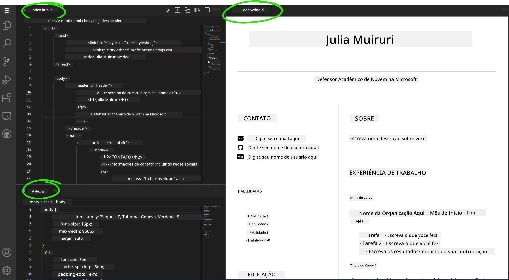

<!--
CO_OP_TRANSLATOR_METADATA:
{
  "original_hash": "effe56ba51c38d7bdfad1ea38288666b",
  "translation_date": "2025-10-22T23:01:11+00:00",
  "source_file": "8-code-editor/1-using-a-code-editor/assignment.md",
  "language_code": "br"
}
-->
# Crie um Site de Currículo Usando o VSCode.dev

Transforme suas perspectivas de carreira criando um site de currículo profissional que destaque suas habilidades e experiências de forma interativa e moderna. Em vez de enviar PDFs tradicionais, imagine fornecer aos recrutadores um site elegante e responsivo que demonstre tanto suas qualificações quanto suas habilidades em desenvolvimento web.

Este exercício prático coloca todas as suas habilidades com o VSCode.dev em ação enquanto você cria algo realmente útil para sua carreira. Você experimentará o fluxo completo de desenvolvimento web – desde a criação do repositório até a implantação – tudo dentro do seu navegador.

Ao concluir este projeto, você terá uma presença online profissional que pode ser facilmente compartilhada com empregadores em potencial, atualizada conforme suas habilidades evoluem e personalizada para combinar com sua marca pessoal. Este é exatamente o tipo de projeto prático que demonstra habilidades reais em desenvolvimento web.

## Objetivos de Aprendizado

Após concluir este exercício, você será capaz de:

- **Criar** e gerenciar um projeto completo de desenvolvimento web usando o VSCode.dev
- **Estruturar** um site profissional usando elementos semânticos de HTML
- **Estilizar** layouts responsivos com técnicas modernas de CSS
- **Implementar** recursos interativos usando tecnologias básicas da web
- **Implantar** um site ao vivo acessível por meio de uma URL compartilhável
- **Demonstrar** as melhores práticas de controle de versão ao longo do processo de desenvolvimento

## Pré-requisitos

Antes de começar este exercício, certifique-se de que você tem:

- Uma conta no GitHub (crie uma em [github.com](https://github.com/) se necessário)
- Concluído a lição do VSCode.dev sobre navegação na interface e operações básicas
- Compreensão básica da estrutura HTML e conceitos de estilização em CSS

## Configuração do Projeto e Criação do Repositório

Vamos começar configurando a base do seu projeto. Este processo reflete os fluxos de trabalho de desenvolvimento do mundo real, onde os projetos começam com a inicialização adequada do repositório e planejamento da estrutura.

### Passo 1: Crie Seu Repositório no GitHub

Configurar um repositório dedicado garante que seu projeto esteja devidamente organizado e com controle de versão desde o início.

1. **Acesse** [GitHub.com](https://github.com) e faça login na sua conta
2. **Clique** no botão verde "New" ou no ícone "+" no canto superior direito
3. **Nomeie** seu repositório como `meu-curriculo` (ou escolha um nome personalizado, como `curriculo-joao-silva`)
4. **Adicione** uma breve descrição: "Site de currículo profissional construído com HTML e CSS"
5. **Selecione** "Public" para tornar seu currículo acessível a empregadores em potencial
6. **Marque** "Add a README file" para criar uma descrição inicial do projeto
7. **Clique** em "Create repository" para finalizar a configuração

> 💡 **Dica de Nomeação de Repositório**: Use nomes descritivos e profissionais que indiquem claramente o propósito do projeto. Isso ajuda ao compartilhar com empregadores ou durante revisões de portfólio.

### Passo 2: Inicialize a Estrutura do Projeto

Como o VSCode.dev exige pelo menos um arquivo para abrir um repositório, criaremos nosso arquivo HTML principal diretamente no GitHub antes de mudar para o editor web.

1. **Clique** no link "creating a new file" no seu novo repositório
2. **Digite** `index.html` como nome do arquivo
3. **Adicione** esta estrutura inicial de HTML:

```html
<!DOCTYPE html>
<html lang="en">
<head>
    <meta charset="UTF-8">
    <meta name="viewport" content="width=device-width, initial-scale=1.0">
    <title>Your Name - Professional Resume</title>
</head>
<body>
    <h1>Your Name</h1>
    <p>Professional Resume Website</p>
</body>
</html>
```

4. **Escreva** uma mensagem de commit: "Adicionar estrutura inicial de HTML"
5. **Clique** em "Commit new file" para salvar suas alterações


**O que essa configuração inicial realiza:**
- **Estabelece** uma estrutura de documento HTML5 adequada com elementos semânticos
- **Inclui** meta tag de viewport para compatibilidade com design responsivo
- **Define** um título descritivo da página que aparece nas abas do navegador
- **Cria** a base para organização profissional de conteúdo

## Trabalhando no VSCode.dev

Agora que a base do seu repositório está estabelecida, vamos migrar para o VSCode.dev para o trabalho principal de desenvolvimento. Este editor baseado na web fornece todas as ferramentas necessárias para desenvolvimento web profissional.

### Passo 3: Abra Seu Projeto no VSCode.dev

1. **Acesse** [vscode.dev](https://vscode.dev) em uma nova aba do navegador
2. **Clique** em "Open Remote Repository" na tela de boas-vindas
3. **Copie** a URL do seu repositório no GitHub e cole no campo de entrada

   Formato: `https://github.com/seu-usuario/meu-curriculo`
   
   *Substitua `seu-usuario` pelo seu nome de usuário real do GitHub*

4. **Pressione** Enter para carregar seu projeto

✅ **Indicador de sucesso**: Você deve ver os arquivos do seu projeto na barra lateral do Explorer e `index.html` disponível para edição na área principal do editor.


**O que você verá na interface:**
- **Barra lateral do Explorer**: **Exibe** os arquivos e estrutura de pastas do seu repositório
- **Área do editor**: **Mostra** o conteúdo dos arquivos selecionados para edição
- **Barra de atividades**: **Fornece** acesso a recursos como Controle de Fonte e Extensões
- **Barra de status**: **Indica** o status da conexão e informações da branch atual

### Passo 4: Construa o Conteúdo do Seu Currículo

Substitua o conteúdo de espaço reservado em `index.html` por uma estrutura abrangente de currículo. Este HTML fornece a base para uma apresentação profissional de suas qualificações.

<details>
<summary><b>Estrutura Completa de Currículo em HTML</b></summary>

```html
<!DOCTYPE html>
<html lang="en">
<head>
    <meta charset="UTF-8">
    <meta name="viewport" content="width=device-width, initial-scale=1.0">
    <link href="style.css" rel="stylesheet">
    <link rel="stylesheet" href="https://cdnjs.cloudflare.com/ajax/libs/font-awesome/5.15.4/css/all.min.css">
    <title>Your Name - Professional Resume</title>
</head>
<body>
    <header id="header">
        <h1>Your Full Name</h1>
        <hr>
        <p class="role">Your Professional Title</p>
        <hr>
    </header>
    
    <main>
        <article id="mainLeft">
            <section>
                <h2>CONTACT</h2>
                <p>
                    <i class="fa fa-envelope" aria-hidden="true"></i>
                    <a href="mailto:your.email@domain.com">your.email@domain.com</a>
                </p>
                <p>
                    <i class="fab fa-github" aria-hidden="true"></i>
                    <a href="https://github.com/your-username">github.com/your-username</a>
                </p>
                <p>
                    <i class="fab fa-linkedin" aria-hidden="true"></i>
                    <a href="https://linkedin.com/in/your-profile">linkedin.com/in/your-profile</a>
                </p>
            </section>
            
            <section>
                <h2>SKILLS</h2>
                <ul>
                    <li>HTML5 & CSS3</li>
                    <li>JavaScript (ES6+)</li>
                    <li>Responsive Web Design</li>
                    <li>Version Control (Git)</li>
                    <li>Problem Solving</li>
                </ul>
            </section>
            
            <section>
                <h2>EDUCATION</h2>
                <h3>Your Degree or Certification</h3>
                <p>Institution Name</p>
                <p>Start Date - End Date</p>
            </section>
        </article>
        
        <article id="mainRight">
            <section>
                <h2>ABOUT</h2>
                <p>Write a compelling summary that highlights your passion for web development, key achievements, and career goals. This section should give employers insight into your personality and professional approach.</p>
            </section>
            
            <section>
                <h2>WORK EXPERIENCE</h2>
                <div class="job">
                    <h3>Job Title</h3>
                    <p class="company">Company Name | Start Date – End Date</p>
                    <ul>
                        <li>Describe a key accomplishment or responsibility</li>
                        <li>Highlight specific skills or technologies used</li>
                        <li>Quantify impact where possible (e.g., "Improved efficiency by 25%")</li>
                    </ul>
                </div>
                
                <div class="job">
                    <h3>Previous Job Title</h3>
                    <p class="company">Previous Company | Start Date – End Date</p>
                    <ul>
                        <li>Focus on transferable skills and achievements</li>
                        <li>Demonstrate growth and learning progression</li>
                        <li>Include any leadership or collaboration experiences</li>
                    </ul>
                </div>
            </section>
            
            <section>
                <h2>PROJECTS</h2>
                <div class="project">
                    <h3>Project Name</h3>
                    <p>Brief description of what the project accomplishes and technologies used.</p>
                    <a href="#" target="_blank">View Project</a>
                </div>
            </section>
        </article>
    </main>
</body>
</html>
```
</details>

**Diretrizes de personalização:**
- **Substitua** todo o texto de espaço reservado pelas suas informações reais
- **Ajuste** as seções com base no seu nível de experiência e foco de carreira
- **Adicione** ou remova seções conforme necessário (ex.: Certificações, Trabalho Voluntário, Idiomas)
- **Inclua** links para seus perfis e projetos reais

### Passo 5: Crie Arquivos de Suporte

Sites profissionais exigem estruturas organizadas de arquivos. Crie a folha de estilos CSS e os arquivos de configuração necessários para um projeto completo.

1. **Passe o mouse** sobre o nome da pasta do seu projeto na barra lateral do Explorer
2. **Clique** no ícone "Novo Arquivo" (📄+) que aparece
3. **Crie** estes arquivos um de cada vez:
   - `style.css` (para estilização e layout)
   - `codeswing.json` (para configuração da extensão de pré-visualização)

**Criando o arquivo CSS (`style.css`):**

<details>
<summary><b>Estilização Profissional em CSS</b></summary>

```css
/* Modern Resume Styling */
body {
    font-family: 'Segoe UI', Tahoma, Geneva, Verdana, sans-serif;
    font-size: 16px;
    line-height: 1.6;
    max-width: 960px;
    margin: 0 auto;
    padding: 20px;
    color: #333;
    background-color: #f9f9f9;
}

/* Header Styling */
header {
    text-align: center;
    margin-bottom: 3em;
    padding: 2em;
    background: linear-gradient(135deg, #667eea 0%, #764ba2 100%);
    color: white;
    border-radius: 10px;
    box-shadow: 0 4px 6px rgba(0, 0, 0, 0.1);
}

h1 {
    font-size: 3em;
    letter-spacing: 0.1em;
    margin-bottom: 0.2em;
    font-weight: 300;
}

.role {
    font-size: 1.3em;
    font-weight: 300;
    margin: 1em 0;
}

/* Main Content Layout */
main {
    display: grid;
    grid-template-columns: 35% 65%;
    gap: 3em;
    margin-top: 3em;
    background: white;
    padding: 2em;
    border-radius: 10px;
    box-shadow: 0 2px 10px rgba(0, 0, 0, 0.1);
}

/* Typography */
h2 {
    font-size: 1.4em;
    font-weight: 600;
    margin-bottom: 1em;
    color: #667eea;
    border-bottom: 2px solid #667eea;
    padding-bottom: 0.3em;
}

h3 {
    font-size: 1.1em;
    font-weight: 600;
    margin-bottom: 0.5em;
    color: #444;
}

/* Section Styling */
section {
    margin-bottom: 2.5em;
}

#mainLeft {
    border-right: 1px solid #e0e0e0;
    padding-right: 2em;
}

/* Contact Links */
section a {
    color: #667eea;
    text-decoration: none;
    transition: color 0.3s ease;
}

section a:hover {
    color: #764ba2;
    text-decoration: underline;
}

/* Icons */
i {
    margin-right: 0.8em;
    width: 20px;
    text-align: center;
    color: #667eea;
}

/* Lists */
ul {
    list-style: none;
    padding-left: 0;
}

li {
    margin: 0.5em 0;
    padding: 0.3em 0;
    position: relative;
}

li:before {
    content: "▸";
    color: #667eea;
    margin-right: 0.5em;
}

/* Work Experience */
.job, .project {
    margin-bottom: 2em;
    padding-bottom: 1.5em;
    border-bottom: 1px solid #f0f0f0;
}

.company {
    font-style: italic;
    color: #666;
    margin-bottom: 0.5em;
}

/* Responsive Design */
@media (max-width: 768px) {
    main {
        grid-template-columns: 1fr;
        gap: 2em;
    }
    
    #mainLeft {
        border-right: none;
        border-bottom: 1px solid #e0e0e0;
        padding-right: 0;
        padding-bottom: 2em;
    }
    
    h1 {
        font-size: 2.2em;
    }
    
    body {
        padding: 10px;
    }
}

/* Print Styles */
@media print {
    body {
        background: white;
        color: black;
        font-size: 12pt;
    }
    
    header {
        background: none;
        color: black;
        box-shadow: none;
    }
    
    main {
        box-shadow: none;
    }
}
```
</details>

**Criando o arquivo de configuração (`codeswing.json`):**

```json
{
    "scripts": [],
    "styles": []
}
```

**Entendendo os recursos do CSS:**
- **Utiliza** CSS Grid para estrutura de layout responsivo e profissional
- **Implementa** esquemas de cores modernos com cabeçalhos em gradiente
- **Inclui** efeitos de hover e transições suaves para interatividade
- **Fornece** design responsivo que funciona em todos os tamanhos de dispositivos
- **Adiciona** estilos amigáveis para impressão e geração de PDF

### Passo 6: Instale e Configure Extensões

Extensões melhoram sua experiência de desenvolvimento ao fornecer recursos de pré-visualização ao vivo e ferramentas de fluxo de trabalho aprimoradas. A extensão CodeSwing é particularmente útil para projetos de desenvolvimento web.

**Instalando a Extensão CodeSwing:**

1. **Clique** no ícone de Extensões (🧩) na Barra de Atividades
2. **Pesquise** por "CodeSwing" na caixa de busca do marketplace
3. **Selecione** a extensão CodeSwing nos resultados da busca
4. **Clique** no botão azul "Install"


**O que o CodeSwing oferece:**
- **Habilita** pré-visualização ao vivo do seu site enquanto você edita
- **Exibe** mudanças em tempo real sem necessidade de atualização manual
- **Suporta** múltiplos tipos de arquivos, incluindo HTML, CSS e JavaScript
- **Fornece** uma experiência integrada de ambiente de desenvolvimento

**Resultados imediatos após a instalação:**
Assim que o CodeSwing for instalado, você verá uma pré-visualização ao vivo do seu site de currículo aparecer no editor. Isso permite que você veja exatamente como seu site está enquanto faz alterações.



**Entendendo a interface aprimorada:**
- **Visualização dividida**: **Mostra** seu código de um lado e a pré-visualização ao vivo do outro
- **Atualizações em tempo real**: **Reflete** mudanças imediatamente enquanto você digita
- **Pré-visualização interativa**: **Permite** testar links e interações
- **Simulação móvel**: **Fornece** capacidades de teste de design responsivo

### Passo 7: Controle de Versão e Publicação

Agora que seu site de currículo está completo, use o Git para salvar seu trabalho e torná-lo disponível online.

**Comitando suas alterações:**

1. **Clique** no ícone de Controle de Fonte (🌿) na Barra de Atividades
2. **Revise** todos os arquivos que você criou e modificou na seção "Changes"
3. **Adicione** suas alterações clicando no ícone "+" ao lado de cada arquivo
4. **Escreva** uma mensagem de commit descritiva, como:
   - "Adicionar site completo de currículo com design responsivo"
   - "Implementar estilização profissional e estrutura de conteúdo"
5. **Clique** no checkmark (✓) para comitar e enviar suas alterações

**Exemplos de mensagens de commit eficazes:**
- "Adicionar conteúdo e estilização profissional ao currículo"
- "Implementar design responsivo para compatibilidade móvel"
- "Atualizar informações de contato e links de projetos"

> 💡 **Dica Profissional**: Boas mensagens de commit ajudam a rastrear a evolução do seu projeto e demonstram atenção aos detalhes – qualidades que os empregadores valorizam.

**Acessando seu site publicado:**
Depois de comitado, você pode retornar ao seu repositório no GitHub usando o menu hambúrguer (☰) no canto superior esquerdo. Seu site de currículo agora está com controle de versão e pronto para implantação ou compartilhamento.

## Resultados e Próximos Passos

**Parabéns! 🎉** Você criou com sucesso um site de currículo profissional usando o VSCode.dev. Seu projeto demonstra:
**Habilidades técnicas demonstradas:**
- **Gerenciamento de repositório**: Criou e organizou uma estrutura completa de projeto
- **Desenvolvimento web**: Construiu um site responsivo usando HTML5 e CSS3 modernos
- **Controle de versão**: Implementou fluxo de trabalho Git adequado com commits significativos
- **Proficiência em ferramentas**: Usou efetivamente a interface e o sistema de extensões do VSCode.dev

**Resultados profissionais alcançados:**
- **Presença online**: Uma URL compartilhável que destaca suas qualificações
- **Formato moderno**: Uma alternativa interativa aos currículos tradicionais em PDF
- **Habilidades demonstráveis**: Evidência concreta de suas capacidades em desenvolvimento web
- **Atualizações fáceis**: Uma base que você pode melhorar e personalizar continuamente

### Opções de Implantação

Para tornar seu currículo acessível aos empregadores, considere estas opções de hospedagem:

**GitHub Pages (Recomendado):**
1. Vá para as Configurações do seu repositório no GitHub
2. Role até a seção "Pages"
3. Selecione "Deploy from a branch" e escolha "main"
4. Seu site estará disponível em `https://seu-usuario.github.io/meu-curriculo`

**Plataformas alternativas:**
- **Netlify**: Implantação automática com domínios personalizados
- **Vercel**: Implantação rápida com recursos modernos de hospedagem
- **GitHub Codespaces**: Ambiente de desenvolvimento com pré-visualização integrada

### Sugestões de Melhoria

Continue desenvolvendo suas habilidades adicionando estes recursos:

**Melhorias técnicas:**
- **Interatividade com JavaScript**: Adicione rolagem suave ou elementos interativos
- **Alternância de modo escuro**: Implemente troca de tema para preferência do usuário
- **Formulário de contato**: Permita comunicação direta com empregadores em potencial
- **Otimização de SEO**: Adicione meta tags e dados estruturados para melhor visibilidade em buscas

**Aprimoramentos de conteúdo:**
- **Portfólio de projetos**: Inclua links para repositórios do GitHub e demonstrações ao vivo
- **Visualização de habilidades**: Crie barras de progresso ou sistemas de classificação de habilidades
- **Seção de depoimentos**: Inclua recomendações de colegas ou instrutores
- **Integração de blog**: Adicione uma seção de blog para mostrar sua jornada de aprendizado

## Desafio do Agente GitHub Copilot 🚀

Use o modo Agent para concluir o seguinte desafio:

**Descrição:** Melhore seu site de currículo com recursos avançados que demonstrem capacidades profissionais de desenvolvimento web e princípios modernos de design.

**Desafio:** Com base no seu site de currículo existente, implemente estes recursos avançados:
1. Adicione uma alternância de tema claro/escuro com transições suaves
2. Crie uma seção interativa de habilidades com barras de progresso animadas
3. Implemente um formulário de contato com validação de formulário
4. Adicione uma seção de portfólio de projetos com efeitos de hover e popups modais
5. Inclua uma seção de blog com pelo menos 3 posts de exemplo sobre sua jornada de aprendizado
6. Otimize para SEO com meta tags adequadas, dados estruturados e desempenho
7. Implemente o site aprimorado usando GitHub Pages ou Netlify
8. Documente todos os novos recursos no seu README.md com capturas de tela

Seu site aprimorado deve demonstrar domínio de práticas modernas de desenvolvimento web, incluindo design responsivo, interatividade com JavaScript e fluxos de trabalho profissionais de implantação.

## Extensão do Desafio

Pronto para levar suas habilidades ainda mais longe? Experimente estes desafios avançados:

**📱 Redesign Focado em Mobile:** Reconstrua completamente seu site usando uma abordagem focada em dispositivos móveis com CSS Grid e Flexbox

**🔍 Otimização de SEO:** Implemente SEO abrangente, incluindo meta tags, dados estruturados e otimização de desempenho

**🌐 Suporte a Múltiplos Idiomas:** Adicione recursos de internacionalização para suportar vários idiomas

**📊 Integração de Analytics:** Adicione Google Analytics para rastrear o engajamento dos visitantes e otimizar seu conteúdo

**🚀 Otimização de Desempenho:** Alcance pontuações perfeitas no Lighthouse em todas as categorias

## Revisão e Autoestudo

Expanda seu conhecimento com estes recursos:

**Recursos Avançados do VSCode.dev:**
- [Documentação do VSCode.dev](https://code.visualstudio.com/docs/editor/vscode-web?WT.mc_id=academic-0000-alfredodeza) - Guia completo para edição baseada na web
- [GitHub Codespaces](https://docs.github.com/en/codespaces) - Ambientes de desenvolvimento na nuvem

**Melhores Práticas de Desenvolvimento Web:**
- **Design Responsivo**: Estude CSS Grid e Flexbox para layouts modernos
- **Acessibilidade**: Aprenda as diretrizes WCAG para um design web inclusivo  
- **Desempenho**: Explore ferramentas como o Lighthouse para otimização  
- **SEO**: Entenda os fundamentos da otimização para mecanismos de busca  

**Desenvolvimento Profissional:**  
- **Construção de Portfólio**: Crie projetos adicionais para mostrar habilidades diversas  
- **Código Aberto**: Contribua para projetos existentes para ganhar experiência em colaboração  
- **Networking**: Compartilhe seu site de currículo em comunidades de desenvolvedores para receber feedback  
- **Aprendizado Contínuo**: Mantenha-se atualizado com tendências e tecnologias de desenvolvimento web  

---

**Próximos Passos:** Compartilhe seu site de currículo com amigos, familiares ou mentores para receber feedback. Use as sugestões deles para iterar e melhorar seu design. Lembre-se, este projeto não é apenas um currículo – é uma demonstração do seu crescimento como desenvolvedor web!

---

**Aviso Legal**:  
Este documento foi traduzido usando o serviço de tradução por IA [Co-op Translator](https://github.com/Azure/co-op-translator). Embora nos esforcemos para garantir a precisão, esteja ciente de que traduções automatizadas podem conter erros ou imprecisões. O documento original em seu idioma nativo deve ser considerado a fonte autoritativa. Para informações críticas, recomenda-se a tradução profissional humana. Não nos responsabilizamos por quaisquer mal-entendidos ou interpretações incorretas decorrentes do uso desta tradução.