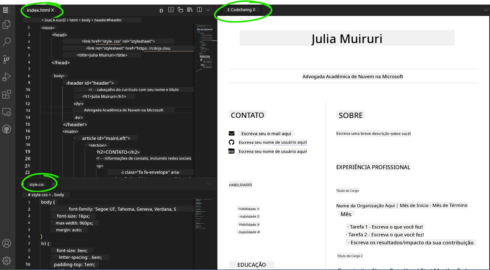

<!--
CO_OP_TRANSLATOR_METADATA:
{
  "original_hash": "bd3aa6d2b879c30ea496c43aec1c49ed",
  "translation_date": "2025-08-28T23:57:29+00:00",
  "source_file": "8-code-editor/1-using-a-code-editor/assignment.md",
  "language_code": "br"
}
-->
# Crie um site de currículo usando vscode.dev

_Que incrível seria se um recrutador pedisse seu currículo e você enviasse um link?_ 😎

## Objetivos

Após esta tarefa, você aprenderá a:

- Criar um site para exibir seu currículo

### Pré-requisitos

1. Uma conta no GitHub. Acesse [GitHub](https://github.com/) e crie uma conta, caso ainda não tenha uma.

## Passos

**Passo 1:** Crie um novo repositório no GitHub e dê a ele o nome `my-resume`.

**Passo 2:** Crie um arquivo `index.html` no seu repositório. Vamos adicionar pelo menos um arquivo diretamente no github.com, pois não é possível abrir um repositório vazio no vscode.dev.

Clique no link `creating a new file`, digite o nome `index.html` e selecione o botão `Commit new file`.


**Passo 3:** Abra [VSCode.dev](https://vscode.dev) e selecione o botão `Open Remote Repository`.

Copie a URL do repositório que você acabou de criar para o site do currículo e cole na caixa de entrada:

_Substitua `your-username` pelo seu nome de usuário do GitHub._

```
https://github.com/your-username/my-resume
```

✅ Se tudo der certo, você verá seu projeto e o arquivo index.html abertos no editor de texto no navegador.


**Passo 4:** Abra o arquivo `index.html`, cole o código abaixo na área de código e salve.

<details>
    <summary><b>Código HTML responsável pelo conteúdo do site do seu currículo.</b></summary>
    
        <html>

            <head>
                <link href="style.css" rel="stylesheet">
                <link rel="stylesheet" href="https://cdnjs.cloudflare.com/ajax/libs/font-awesome/5.15.4/css/all.min.css">
                <title>Seu Nome Aqui!</title>
            </head>
            <body>
                <header id="header">
                    <!-- cabeçalho do currículo com seu nome e título -->
                    <h1>Seu Nome Aqui!</h1>
                    <hr>
                    Sua Função!
                    <hr>
                </header>
                <main>
                    <article id="mainLeft">
                        <section>
                            <h2>CONTATO</h2>
                            <!-- informações de contato, incluindo redes sociais -->
                            <p>
                                <i class="fa fa-envelope" aria-hidden="true"></i>
                                <a href="mailto:username@domain.top-level domain">Escreva seu e-mail aqui</a>
                            </p>
                            <p>
                                <i class="fab fa-github" aria-hidden="true"></i>
                                <a href="github.com/yourGitHubUsername">Escreva seu nome de usuário aqui!</a>
                            </p>
                            <p>
                                <i class="fab fa-linkedin" aria-hidden="true"></i>
                                <a href="linkedin.com/yourLinkedInUsername">Escreva seu nome de usuário aqui!</a>
                            </p>
                        </section>
                        <section>
                            <h2>HABILIDADES</h2>
                            <!-- suas habilidades -->
                            <ul>
                                <li>Habilidade 1!</li>
                                <li>Habilidade 2!</li>
                                <li>Habilidade 3!</li>
                                <li>Habilidade 4!</li>
                            </ul>
                        </section>
                        <section>
                            <h2>EDUCAÇÃO</h2>
                            <!-- sua formação acadêmica -->
                            <h3>Escreva seu curso aqui!</h3>
                            <p>
                                Escreva sua instituição aqui!
                            </p>
                            <p>
                                Data de início - Data de término
                            </p>
                        </section>            
                    </article>
                    <article id="mainRight">
                        <section>
                            <h2>SOBRE</h2>
                            <!-- sobre você -->
                            <p>Escreva um resumo sobre você!</p>
                        </section>
                        <section>
                            <h2>EXPERIÊNCIA PROFISSIONAL</h2>
                            <!-- sua experiência profissional -->
                            <h3>Título do Cargo</h3>
                            <p>
                                Nome da Organização Aqui | Mês de Início – Mês de Término
                            </p>
                            <ul>
                                    <li>Tarefa 1 - Escreva o que você fez!</li>
                                    <li>Tarefa 2 - Escreva o que você fez!</li>
                                    <li>Escreva os resultados/impacto da sua contribuição</li>
                                    
                            </ul>
                            <h3>Título do Cargo 2</h3>
                            <p>
                                Nome da Organização Aqui | Mês de Início – Mês de Término
                            </p>
                            <ul>
                                    <li>Tarefa 1 - Escreva o que você fez!</li>
                                    <li>Tarefa 2 - Escreva o que você fez!</li>
                                    <li>Escreva os resultados/impacto da sua contribuição</li>
                                    
                            </ul>
                        </section>
                    </article>
                </main>
            </body>
        </html>
</details>

Adicione os detalhes do seu currículo substituindo o _texto de exemplo_ no código HTML.

**Passo 5:** Passe o mouse sobre a pasta My-Resume, clique no ícone `New File ...` e crie 2 novos arquivos no seu projeto: `style.css` e `codeswing.json`.

**Passo 6:** Abra o arquivo `style.css`, cole o código abaixo e salve.

<details>
        <summary><b>Código CSS para formatar o layout do site.</b></summary>
            
            body {
                font-family: 'Segoe UI', Tahoma, Geneva, Verdana, sans-serif;
                font-size: 16px;
                max-width: 960px;
                margin: auto;
            }
            h1 {
                font-size: 3em;
                letter-spacing: .6em;
                padding-top: 1em;
                padding-bottom: 1em;
            }

            h2 {
                font-size: 1.5em;
                padding-bottom: 1em;
            }

            h3 {
                font-size: 1em;
                padding-bottom: 1em;
            }
            main { 
                display: grid;
                grid-template-columns: 40% 60%;
                margin-top: 3em;
            }
            header {
                text-align: center;
                margin: auto 2em;
            }

            section {
                margin: auto 1em 4em 2em;
            }

            i {
                margin-right: .5em;
            }

            p {
                margin: .2em auto
            }

            hr {
                border: none;
                background-color: lightgray;
                height: 1px;
            }

            h1, h2, h3 {
                font-weight: 100;
                margin-bottom: 0;
            }
            #mainLeft {
                border-right: 1px solid lightgray;
            }
            
</details>

**Passo 6:** Abra o arquivo `codeswing.json`, cole o código abaixo e salve.

    {
    "scripts": [],
    "styles": []
    }

**Passo 7:** Instale a extensão `Codeswing` para visualizar o site do currículo na área de código.

Clique no ícone _`Extensions`_ na barra de atividades e digite Codeswing. Clique no _botão azul de instalação_ na barra de atividades expandida para instalar ou use o botão de instalação que aparece na área de código ao selecionar a extensão para carregar informações adicionais. Assim que a extensão for instalada, observe as mudanças no seu projeto na área de código 😃.


Isso é o que você verá na sua tela após instalar a extensão.



Se estiver satisfeito com as alterações feitas, passe o mouse sobre a pasta `Changes` e clique no botão `+` para preparar as alterações.

Digite uma mensagem de commit _(Uma descrição das alterações feitas no projeto)_ e confirme suas alterações clicando no `check`. Quando terminar de trabalhar no projeto, selecione o ícone de menu hambúrguer no canto superior esquerdo para retornar ao repositório no GitHub.

Parabéns 🎉 Você acabou de criar seu site de currículo usando vscode.dev em poucos passos.

## 🚀 Desafio

Abra um repositório remoto no qual você tenha permissões para fazer alterações e atualize alguns arquivos. Em seguida, tente criar um novo branch com suas alterações e faça um Pull Request.

## Revisão e Autoestudo

Leia mais sobre [VSCode.dev](https://code.visualstudio.com/docs/editor/vscode-web?WT.mc_id=academic-0000-alfredodeza) e algumas de suas outras funcionalidades.

---

**Aviso Legal**:  
Este documento foi traduzido utilizando o serviço de tradução por IA [Co-op Translator](https://github.com/Azure/co-op-translator). Embora nos esforcemos para garantir a precisão, esteja ciente de que traduções automatizadas podem conter erros ou imprecisões. O documento original em seu idioma nativo deve ser considerado a fonte autoritativa. Para informações críticas, recomenda-se a tradução profissional realizada por humanos. Não nos responsabilizamos por quaisquer mal-entendidos ou interpretações equivocadas decorrentes do uso desta tradução.