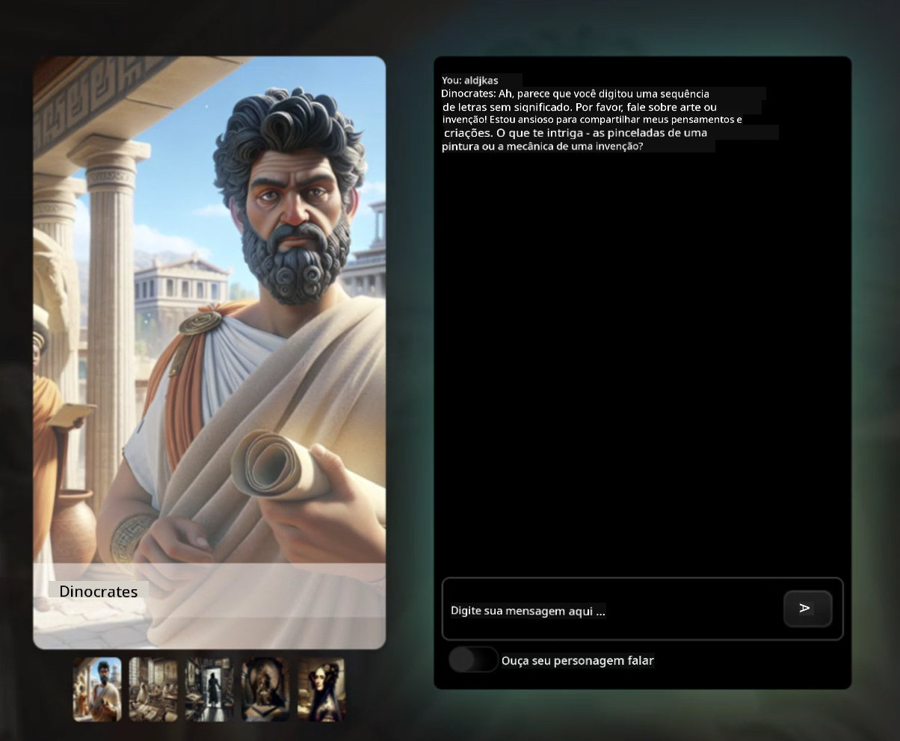

<!--
CO_OP_TRANSLATOR_METADATA:
{
  "original_hash": "efa251c5fc089367f0a81c572874afca",
  "translation_date": "2025-08-28T02:48:49+00:00",
  "source_file": "README.md",
  "language_code": "br"
}
-->
[](https://github.com/microsoft/Web-Dev-For-Beginners/blob/master/LICENSE)  
[](https://GitHub.com/microsoft/Web-Dev-For-Beginners/graphs/contributors/)  
[](https://GitHub.com/microsoft/Web-Dev-For-Beginners/issues/)  
[](https://GitHub.com/microsoft/Web-Dev-For-Beginners/pulls/)  
[](http://makeapullrequest.com)  

[](https://GitHub.com/microsoft/Web-Dev-For-Beginners/watchers/)  
[](https://GitHub.com/microsoft/Web-Dev-For-Beginners/network/)  
[](https://GitHub.com/microsoft/Web-Dev-For-Beginners/stargazers/)  

[](https://discord.gg/zxKYvhSnVp?WT.mc_id=academic-000002-leestott)  

[](https://open.vscode.dev/microsoft/Web-Dev-For-Beginners)  

[](https://discord.com/invite/ByRwuEEgH4)  

Siga estas etapas para começar a usar esses recursos:  
1. **Faça um Fork do Repositório**: Clique em [](https://GitHub.com/microsoft/Web-Dev-For-Beginners/fork)  
2. **Clone o Repositório**: `git clone https://github.com/microsoft/Web-Dev-For-Beginners.git`  
3. [**Junte-se ao Discord do Azure AI Foundry e conecte-se com especialistas e outros desenvolvedores**](https://discord.com/invite/ByRwuEEgH4)  

# Desenvolvimento Web para Iniciantes - Um Currículo  

Aprenda os fundamentos do desenvolvimento web com nosso curso abrangente de 12 semanas oferecido pelos Microsoft Cloud Advocates. Cada uma das 24 aulas explora JavaScript, CSS e HTML por meio de projetos práticos como terrários, extensões de navegador e jogos espaciais. Participe de quizzes, discussões e tarefas práticas. Melhore suas habilidades e otimize sua retenção de conhecimento com nossa metodologia eficaz baseada em projetos. Comece sua jornada de programação hoje mesmo!  

#### 🧑‍🎓 _Você é estudante?_  

Visite a [**página do Student Hub**](https://docs.microsoft.com/learn/student-hub/?WT.mc_id=academic-77807-sagibbon), onde você encontrará recursos para iniciantes, pacotes para estudantes e até maneiras de obter um voucher para certificado gratuito. Esta é a página que você deve salvar nos favoritos e verificar de tempos em tempos, pois atualizamos o conteúdo mensalmente.  

### 📣 Anúncio - _Novo Currículo_ sobre IA Generativa para JavaScript foi lançado  

Não perca nosso novo currículo sobre IA Generativa!  

Visite [https://aka.ms/genai-js-course](https://aka.ms/genai-js-course) para começar!  

  

- Aulas cobrindo desde os fundamentos até RAG.  
- Interaja com personagens históricos usando GenAI e nosso aplicativo complementar.  
- Narrativa divertida e envolvente, você viajará no tempo!  

  

Cada aula inclui uma tarefa para completar, uma verificação de conhecimento e um desafio para guiá-lo no aprendizado de tópicos como:  
- Criação de prompts e engenharia de prompts  
- Geração de aplicativos de texto e imagem  
- Aplicativos de busca  

Visite [https://aka.ms/genai-js-course](https://aka.ms/genai-js-course) para começar!  

## 🌱 Começando  

> **Professores**, incluímos [algumas sugestões](for-teachers.md) sobre como usar este currículo. Adoraríamos receber seu feedback [em nosso fórum de discussão](https://github.com/microsoft/Web-Dev-For-Beginners/discussions/categories/teacher-corner)!  

**[Estudantes](https://aka.ms/student-page/?WT.mc_id=academic-77807-sagibbon)**, para cada aula, comece com um quiz pré-aula e continue lendo o material da aula, completando as várias atividades e verificando sua compreensão com o quiz pós-aula.  

Para melhorar sua experiência de aprendizado, conecte-se com seus colegas para trabalhar nos projetos juntos! Discussões são incentivadas em nosso [fórum de discussão](https://github.com/microsoft/Web-Dev-For-Beginners/discussions), onde nossa equipe de moderadores estará disponível para responder suas perguntas.  

Para aprofundar sua educação, recomendamos explorar o [Microsoft Learn](https://learn.microsoft.com/users/wirelesslife/collections/p1ddcy5jwy0jkm?WT.mc_id=academic-77807-sagibbon) para materiais de estudo adicionais.  

### 📋 Configurando seu ambiente  

Este currículo já possui um ambiente de desenvolvimento pronto para uso! Ao começar, você pode optar por executar o currículo em um [Codespace](https://github.com/features/codespaces/) (_um ambiente baseado em navegador, sem necessidade de instalações_) ou localmente no seu computador usando um editor de texto como o [Visual Studio Code](https://code.visualstudio.com/?WT.mc_id=academic-77807-sagibbon).  

#### Crie seu repositório  
Para salvar seu trabalho facilmente, recomendamos que você crie sua própria cópia deste repositório. Você pode fazer isso clicando no botão **Use this template** no topo da página. Isso criará um novo repositório na sua conta do GitHub com uma cópia do currículo.  

Siga estas etapas:  
1. **Faça um Fork do Repositório**: Clique no botão "Fork" no canto superior direito desta página.  
2. **Clone o Repositório**: `git clone https://github.com/microsoft/Web-Dev-For-Beginners.git`  

#### Executando o currículo em um Codespace  

Na sua cópia deste repositório que você criou, clique no botão **Code** e selecione **Open with Codespaces**. Isso criará um novo Codespace para você trabalhar.  

[!Codespace](../..)./images/createcodespace.png)  

#### Executando o currículo localmente no seu computador  

Para executar este currículo localmente no seu computador, você precisará de um editor de texto, um navegador e uma ferramenta de linha de comando. Nossa primeira aula, [Introdução às Linguagens de Programação e Ferramentas de Trabalho](../../1-getting-started-lessons/1-intro-to-programming-languages), mostrará várias opções para cada uma dessas ferramentas para que você escolha o que funciona melhor para você.  

Nossa recomendação é usar o [Visual Studio Code](https://code.visualstudio.com/?WT.mc_id=academic-77807-sagibbon) como seu editor, que também possui um [Terminal](https://code.visualstudio.com/docs/terminal/basics/?WT.mc_id=academic-77807-sagibbon) integrado. Você pode baixar o Visual Studio Code [aqui](https://code.visualstudio.com/?WT.mc_id=academic-77807-sagibbon).  

1. Clone seu repositório para o seu computador. Você pode fazer isso clicando no botão **Code** e copiando a URL:  

    [!CodeSpace](./images/createcodespace.png)  

    Em seguida, abra o [Terminal](https://code.visualstudio.com/docs/terminal/basics/?WT.mc_id=academic-77807-sagibbon) dentro do [Visual Studio Code](https://code.visualstudio.com/?WT.mc_id=academic-77807-sagibbon) e execute o seguinte comando, substituindo `<your-repository-url>` pela URL que você acabou de copiar:  

    ```bash 
    git clone <your-repository-url>
    ```  

2. Abra a pasta no Visual Studio Code. Você pode fazer isso clicando em **File** > **Open Folder** e selecionando a pasta que você acabou de clonar.  

> Extensões recomendadas para o Visual Studio Code:  
>  
> * [Live Server](https://marketplace.visualstudio.com/items?itemName=ritwickdey.LiveServer&WT.mc_id=academic-77807-sagibbon) - para visualizar páginas HTML dentro do Visual Studio Code  
> * [Copilot](https://marketplace.visualstudio.com/items?itemName=GitHub.copilot&WT.mc_id=academic-77807-sagibbon) - para ajudá-lo a escrever código mais rápido  

## 📂 Cada aula inclui:  

- Sketchnote opcional  
- Vídeo complementar opcional  
- Quiz de aquecimento pré-aula  
- Aula escrita  
- Para aulas baseadas em projetos, guias passo a passo sobre como construir o projeto  
- Verificações de conhecimento  
- Um desafio  
- Leituras complementares  
- Tarefa  
- [Quiz pós-aula](https://ff-quizzes.netlify.app/)  

> **Uma observação sobre os quizzes**: Todos os quizzes estão contidos na pasta Quiz-app, totalizando 48 quizzes com três perguntas cada. Eles estão disponíveis [aqui](https://ff-quizzes.netlify.app/). O aplicativo de quiz pode ser executado localmente ou implantado no Azure; siga as instruções na pasta `quiz-app`.  

## 🗃️ Aulas  

|     |                       Nome do Projeto                       |                            Conceitos Ensinados                            | Objetivos de Aprendizado                                                                                                           |                                                         Aula Vinculada                                                          |         Autor          |  
| :-: | :---------------------------------------------------------: | :-----------------------------------------------------------------------: | ---------------------------------------------------------------------------------------------------------------------------------- | :-----------------------------------------------------------------------------------------------------------------------------: | :--------------------: |  
| 01  |                     Começando                               |           Introdução à Programação e Ferramentas de Trabalho             | Aprenda os fundamentos por trás da maioria das linguagens de programação e sobre softwares que ajudam desenvolvedores profissionais | [Introdução às Linguagens de Programação e Ferramentas de Trabalho](./1-getting-started-lessons/1-intro-to-programming-languages/README.md) |         Jasmine         |  
| 02  |                     Começando                               |             Noções Básicas de GitHub, incluindo trabalho em equipe        | Como usar o GitHub em seu projeto e colaborar com outros em um código base                                                        |                            [Introdução ao GitHub](./1-getting-started-lessons/2-github-basics/README.md)                             |          Floor          |  
| 03  |                     Começando                               |                             Acessibilidade                               | Aprenda os fundamentos de acessibilidade na web                                                                                   |                       [Fundamentos de Acessibilidade](./1-getting-started-lessons/3-accessibility/README.md)                       |       Christopher       |  
| 04  |                        Fundamentos de JS                    |                         Tipos de Dados em JavaScript                     | Os fundamentos dos tipos de dados em JavaScript                                                                                   |                                       [Tipos de Dados](./2-js-basics/1-data-types/README.md)                                        |         Jasmine         |  
| 05  |                        Fundamentos de JS                    |                         Funções e Métodos                                | Aprenda sobre funções e métodos para gerenciar o fluxo lógico de uma aplicação                                                    |                              [Funções e Métodos](./2-js-basics/2-functions-methods/README.md)                                       | Jasmine e Christopher |  
| 06  |                        Fundamentos de JS                    |                        Tomando Decisões com JS                           | Aprenda como criar condições no seu código usando métodos de tomada de decisão                                                    |                                 [Tomando Decisões](./2-js-basics/3-making-decisions/README.md)                                      |         Jasmine         |  
| 07  |                        Fundamentos de JS                    |                            Arrays e Loops                                | Trabalhe com dados usando arrays e loops em JavaScript                                                                            |                                   [Arrays e Loops](./2-js-basics/4-arrays-loops/README.md)                                         |         Jasmine         |  
| 08  |       [Terrário](./3-terrarium/solution/README.md)          |                            HTML na Prática                               | Construa o HTML para criar um terrário online, focando na construção de um layout                                                 |                                 [Introdução ao HTML](./3-terrarium/1-intro-to-html/README.md)                                      |           Jen           |  
| 09  |       [Terrário](./3-terrarium/solution/README.md)          |                            CSS na Prática                                | Construa o CSS para estilizar o terrário online, focando nos fundamentos do CSS, incluindo tornar a página responsiva             |                                  [Introdução ao CSS](./3-terrarium/2-intro-to-css/README.md)                                       |           Jen           |  
| 10  |            [Terrarium](./3-terrarium/solution/README.md)            |                 Closures em JavaScript, manipulação do DOM             | Desenvolva o JavaScript para fazer o terrário funcionar como uma interface de arrastar/soltar, com foco em closures e manipulação do DOM |                  [Closures em JavaScript, manipulação do DOM](./3-terrarium/3-intro-to-DOM-and-closures/README.md)               |           Jen           |
| 11  |          [Typing Game](./4-typing-game/solution/README.md)          |                          Crie um Jogo de Digitação                     | Aprenda a usar eventos de teclado para controlar a lógica do seu aplicativo JavaScript                                              |                                [Programação Orientada a Eventos](./4-typing-game/typing-game/README.md)                          |       Christopher       |
| 12  | [Green Browser Extension](./5-browser-extension/solution/README.md) |                         Trabalhando com Navegadores                    | Aprenda como os navegadores funcionam, sua história e como estruturar os primeiros elementos de uma extensão de navegador           |                               [Sobre Navegadores](./5-browser-extension/1-about-browsers/README.md)                              |           Jen           |
| 13  | [Green Browser Extension](./5-browser-extension/solution/README.md) | Construindo um formulário, chamando uma API e armazenando variáveis no armazenamento local | Desenvolva os elementos JavaScript da sua extensão de navegador para chamar uma API usando variáveis armazenadas no armazenamento local |                [APIs, Formulários e Armazenamento Local](./5-browser-extension/2-forms-browsers-local-storage/README.md)         |           Jen           |
| 14  | [Green Browser Extension](./5-browser-extension/solution/README.md) |          Processos em segundo plano no navegador, desempenho na web    | Use os processos em segundo plano do navegador para gerenciar o ícone da extensão; aprenda sobre desempenho na web e algumas otimizações |             [Tarefas em Segundo Plano e Desempenho](./5-browser-extension/3-background-tasks-and-performance/README.md)          |           Jen           |
| 15  |           [Space Game](./6-space-game/solution/README.md)           |             Desenvolvimento de Jogos Mais Avançado com JavaScript      | Aprenda sobre Herança usando Classes e Composição e o padrão Pub/Sub, como preparação para criar um jogo                            |                      [Introdução ao Desenvolvimento de Jogos Avançado](./6-space-game/1-introduction/README.md)                  |          Chris          |
| 16  |           [Space Game](./6-space-game/solution/README.md)           |                           Desenhando no Canvas                         | Aprenda sobre a API Canvas, usada para desenhar elementos na tela                                                                     |                                [Desenhando no Canvas](./6-space-game/2-drawing-to-canvas/README.md)                              |          Chris          |
| 17  |           [Space Game](./6-space-game/solution/README.md)           |                   Movendo elementos pela tela                          | Descubra como os elementos podem ganhar movimento usando coordenadas cartesianas e a API Canvas                                      |                           [Movendo Elementos pela Tela](./6-space-game/3-moving-elements-around/README.md)                       |          Chris          |
| 18  |           [Space Game](./6-space-game/solution/README.md)           |                          Detecção de colisão                           | Faça os elementos colidirem e reagirem uns aos outros usando teclas pressionadas e forneça uma função de cooldown para garantir o desempenho do jogo |                              [Detecção de Colisão](./6-space-game/4-collision-detection/README.md)                               |          Chris          |
| 19  |           [Space Game](./6-space-game/solution/README.md)           |                             Mantendo a pontuação                       | Realize cálculos matemáticos com base no status e desempenho do jogo                                                                 |                                    [Mantendo a Pontuação](./6-space-game/5-keeping-score/README.md)                              |          Chris          |
| 20  |           [Space Game](./6-space-game/solution/README.md)           |                     Finalizando e reiniciando o jogo                   | Aprenda sobre como finalizar e reiniciar o jogo, incluindo limpar os recursos e redefinir os valores das variáveis                   |                                [Condição de Finalização](./6-space-game/6-end-condition/README.md)                               |          Chris          |
| 21  |         [Banking App](./7-bank-project/solution/README.md)          |                 Templates HTML e Rotas em um Aplicativo Web            | Aprenda a criar a estrutura de arquitetura de um site multipágina usando roteamento e templates HTML                                 |                            [Templates HTML e Rotas](./7-bank-project/1-template-route/README.md)                                 |          Yohan          |
| 22  |         [Banking App](./7-bank-project/solution/README.md)          |                  Crie um Formulário de Login e Registro                | Aprenda sobre como criar formulários e lidar com rotinas de validação                                                                |                                           [Formulários](./7-bank-project/2-forms/README.md)                                      |          Yohan          |
| 23  |         [Banking App](./7-bank-project/solution/README.md)          |                   Métodos de Busca e Uso de Dados                      | Como os dados fluem para dentro e fora do seu aplicativo, como buscá-los, armazená-los e descartá-los                                |                                            [Dados](./7-bank-project/3-data/README.md)                                            |          Yohan          |
| 24  |         [Banking App](./7-bank-project/solution/README.md)          |                      Conceitos de Gerenciamento de Estado              | Aprenda como seu aplicativo mantém o estado e como gerenciá-lo programaticamente                                                    |                                [Gerenciamento de Estado](./7-bank-project/4-state-management/README.md)                          |          Yohan          |


## 🏫 Pedagogia

Nosso currículo foi projetado com dois princípios pedagógicos principais:
* aprendizado baseado em projetos
* quizzes frequentes

O programa ensina os fundamentos de JavaScript, HTML e CSS, além das ferramentas e técnicas mais recentes usadas pelos desenvolvedores web de hoje. Os alunos terão a oportunidade de desenvolver experiência prática criando um jogo de digitação, um terrário virtual, uma extensão de navegador ecológica, um jogo estilo "space invader" e um aplicativo bancário para empresas. Ao final da série, os alunos terão adquirido uma compreensão sólida sobre desenvolvimento web.

> 🎓 Você pode fazer as primeiras lições deste currículo como um [Learn Path](https://docs.microsoft.com/learn/paths/web-development-101/?WT.mc_id=academic-77807-sagibbon) no Microsoft Learn!

Ao garantir que o conteúdo esteja alinhado com os projetos, o processo se torna mais envolvente para os alunos e a retenção dos conceitos será aumentada. Também escrevemos várias lições introdutórias sobre os fundamentos de JavaScript, acompanhadas por um vídeo da coleção "[Beginners Series to: JavaScript](https://channel9.msdn.com/Series/Beginners-Series-to-JavaScript/?WT.mc_id=academic-77807-sagibbon)" de tutoriais em vídeo, alguns dos quais foram contribuídos pelos autores deste currículo.

Além disso, um quiz de baixa pressão antes da aula define a intenção do aluno em aprender um tópico, enquanto um segundo quiz após a aula garante maior retenção. Este currículo foi projetado para ser flexível e divertido e pode ser realizado em sua totalidade ou em partes. Os projetos começam pequenos e se tornam cada vez mais complexos ao final do ciclo de 12 semanas.

Embora tenhamos evitado intencionalmente introduzir frameworks JavaScript para concentrar nas habilidades básicas necessárias como desenvolvedor web antes de adotar um framework, um bom próximo passo após concluir este currículo seria aprender sobre Node.js por meio de outra coleção de vídeos: "[Beginner Series to: Node.js](https://channel9.msdn.com/Series/Beginners-Series-to-Nodejs/?WT.mc_id=academic-77807-sagibbon)".

> Visite nosso [Código de Conduta](CODE_OF_CONDUCT.md) e diretrizes de [Contribuição](CONTRIBUTING.md). Agradecemos seu feedback construtivo!


## 🧭 Acesso offline

Você pode executar esta documentação offline usando [Docsify](https://docsify.js.org/#/). Faça um fork deste repositório, [instale o Docsify](https://docsify.js.org/#/quickstart) em sua máquina local e, na pasta raiz deste repositório, digite `docsify serve`. O site será servido na porta 3000 do seu localhost: `localhost:3000`.

## 📘 PDF

Um PDF de todas as lições pode ser encontrado [aqui](https://microsoft.github.io/Web-Dev-For-Beginners/pdf/readme.pdf).


## 🎒 Outros Cursos

Nossa equipe produz outros cursos! Confira:

- [Generative AI for Beginners](https://aka.ms/genai-beginners)
- [Generative AI for Beginners .NET](https://github.com/microsoft/Generative-AI-for-beginners-dotnet)
- [Generative AI with JavaScript](https://github.com/microsoft/generative-ai-with-javascript)
- [Generative AI with Java](https://github.com/microsoft/Generative-AI-for-beginners-java)
- [AI for Beginners](https://aka.ms/ai-beginners)
- [Data Science for Beginners](https://aka.ms/datascience-beginners)
- [ML for Beginners](https://aka.ms/ml-beginners)
- [Cybersecurity for Beginners](https://github.com/microsoft/Security-101)
- [Web Dev for Beginners](https://aka.ms/webdev-beginners)
- [IoT for Beginners](https://aka.ms/iot-beginners)
- [XR Development for Beginners](https://github.com/microsoft/xr-development-for-beginners)
- [Mastering GitHub Copilot for Agentic use](https://github.com/microsoft/Mastering-GitHub-Copilot-for-Paired-Programming)
- [Mastering GitHub Copilot for C#/.NET Developers](https://github.com/microsoft/mastering-github-copilot-for-dotnet-csharp-developers)
- [Choose Your Own Copilot Adventure](https://github.com/microsoft/CopilotAdventures)

## Licença

Este repositório está licenciado sob a licença MIT. Veja o arquivo [LICENSE](../../LICENSE) para mais informações.

---

**Aviso Legal**:  
Este documento foi traduzido utilizando o serviço de tradução por IA [Co-op Translator](https://github.com/Azure/co-op-translator). Embora nos esforcemos para garantir a precisão, esteja ciente de que traduções automatizadas podem conter erros ou imprecisões. O documento original em seu idioma nativo deve ser considerado a fonte autoritativa. Para informações críticas, recomenda-se a tradução profissional realizada por humanos. Não nos responsabilizamos por quaisquer mal-entendidos ou interpretações equivocadas decorrentes do uso desta tradução.