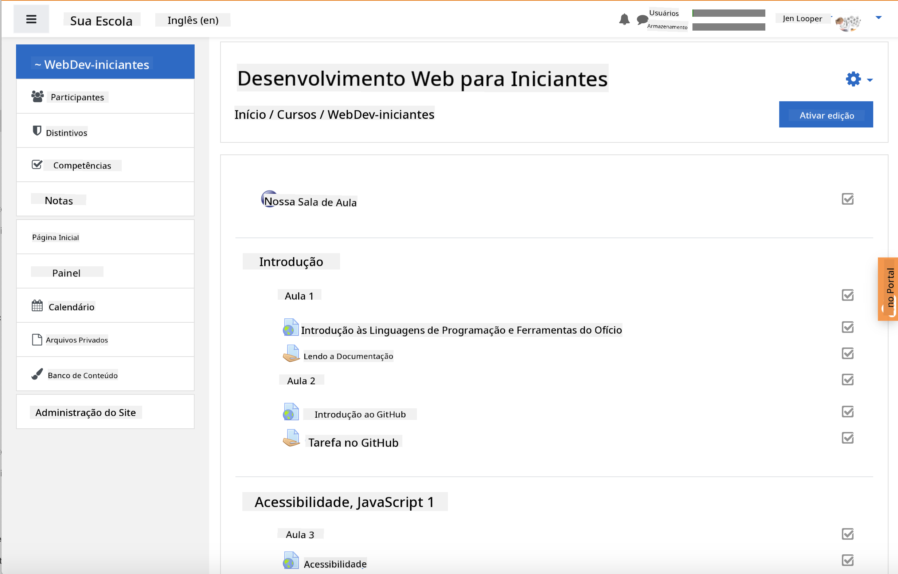
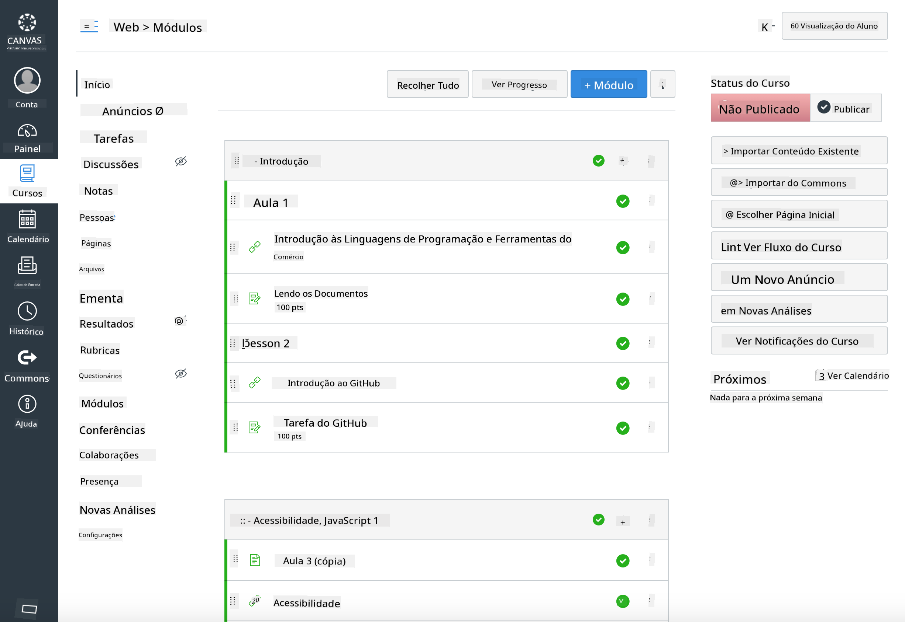

<!--
CO_OP_TRANSLATOR_METADATA:
{
  "original_hash": "71009af209f81cc01a1f2d324200375f",
  "translation_date": "2025-10-03T09:32:21+00:00",
  "source_file": "for-teachers.md",
  "language_code": "br"
}
-->
### Para Educadores

Você está convidado a usar este currículo em sua sala de aula. Ele funciona perfeitamente com o GitHub Classroom e as principais plataformas LMS, e também pode ser usado como um repositório independente com seus alunos.

### Uso com GitHub Classroom

Para gerenciar aulas e tarefas por turma, crie um repositório por aula para que o GitHub Classroom possa vincular cada tarefa de forma independente.

- Faça um fork deste repositório para sua organização.
- Crie um repositório separado para cada aula, extraindo cada pasta de aula para seu próprio repositório.
  - Opção A: Crie repositórios vazios (um por aula) e copie o conteúdo da pasta de aula para cada um.
  - Opção B: Use uma abordagem que preserve o histórico do Git (por exemplo, divida uma pasta em um novo repositório) se precisar de proveniência.
- No GitHub Classroom, crie uma tarefa por aula e aponte para o repositório correspondente.
- Configurações recomendadas:
  - Visibilidade do repositório: privada para o trabalho dos alunos.
  - Use o código inicial do branch padrão do repositório da aula.
  - Adicione templates de issues e pull requests para quizzes e submissões.
  - Opcionalmente, configure autograding e testes se suas aulas incluírem esses recursos.
- Convenções que ajudam:
  - Nomes de repositórios como lesson-01-intro, lesson-02-html, etc.
  - Labels: quiz, assignment, needs-review, late, resubmission.
  - Tags/releases por turma (por exemplo, v2025-term1).

Dica: Evite armazenar repositórios dentro de pastas sincronizadas (por exemplo, OneDrive/Google Drive) para prevenir conflitos do Git no Windows.

### Uso com Moodle, Canvas ou Blackboard

Este currículo inclui pacotes importáveis para fluxos de trabalho comuns em LMS.

- Moodle: Use o arquivo de upload do Moodle [Moodle upload file](../../../../../../../teaching-files/webdev-moodle.mbz) para carregar o curso completo.
- Common Cartridge: Use o arquivo Common Cartridge [Common Cartridge file](../../../../../../../teaching-files/webdev-common-cartridge.imscc) para maior compatibilidade com LMS.
- Observações:
  - O Moodle Cloud tem suporte limitado para Common Cartridge. Prefira o arquivo do Moodle acima, que também pode ser carregado no Canvas.
  - Após a importação, revise os módulos, datas de entrega e configurações de quizzes para ajustar ao cronograma do seu período.

> O currículo em uma sala de aula do Moodle

> O currículo no Canvas

### Uso do repositório diretamente (sem Classroom)

Se preferir não usar o GitHub Classroom, você pode executar o curso diretamente deste repositório.

- Formatos síncronos/online (Zoom/Teams):
  - Realize aquecimentos curtos liderados por mentores; use salas de grupo para quizzes.
  - Anuncie um período de tempo para quizzes; os alunos enviam respostas como Issues no GitHub.
  - Para tarefas colaborativas, os alunos trabalham em repositórios públicos das aulas e abrem pull requests.
- Formatos privados/assíncronos:
  - Os alunos fazem fork de cada aula para seus próprios repositórios **privados** e adicionam você como colaborador.
  - Eles enviam via Issues (quizzes) e Pull Requests (tarefas) no repositório da sua sala de aula ou em seus forks privados.

### Melhores práticas

- Ofereça uma aula de orientação sobre Git/GitHub, Issues e PRs.
- Use checklists em Issues para quizzes/tarefas com várias etapas.
- Adicione CONTRIBUTING.md e CODE_OF_CONDUCT.md para estabelecer normas na sala de aula.
- Inclua notas de acessibilidade (texto alternativo, legendas) e ofereça PDFs imprimíveis.
- Versione seu conteúdo por período e congele os repositórios das aulas após a publicação.

### Feedback e suporte

Queremos que este currículo funcione para você e seus alunos. Por favor, abra uma nova Issue neste repositório para relatar bugs, fazer solicitações ou sugerir melhorias, ou inicie uma discussão no Teacher Corner.

---

**Aviso Legal**:  
Este documento foi traduzido utilizando o serviço de tradução por IA [Co-op Translator](https://github.com/Azure/co-op-translator). Embora nos esforcemos para garantir a precisão, esteja ciente de que traduções automatizadas podem conter erros ou imprecisões. O documento original em seu idioma nativo deve ser considerado a fonte autoritativa. Para informações críticas, recomenda-se a tradução profissional realizada por humanos. Não nos responsabilizamos por quaisquer mal-entendidos ou interpretações equivocadas decorrentes do uso desta tradução.