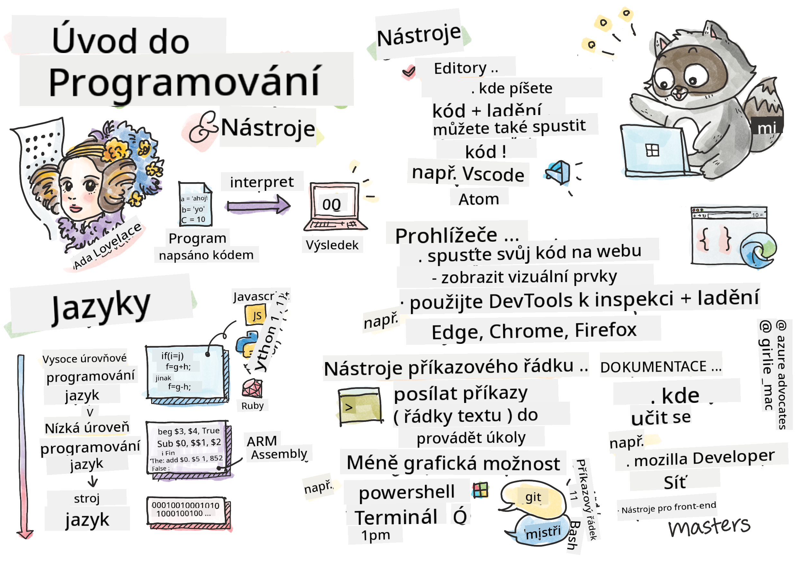

<!--
CO_OP_TRANSLATOR_METADATA:
{
  "original_hash": "c63675cfaf1d223b37bb9fecbfe7c252",
  "translation_date": "2025-08-28T04:30:40+00:00",
  "source_file": "1-getting-started-lessons/1-intro-to-programming-languages/README.md",
  "language_code": "cs"
}
-->
# Úvod do programovacích jazyků a nástrojů

Tato lekce pokrývá základy programovacích jazyků. Témata zde uvedená se vztahují na většinu moderních programovacích jazyků. V části "Nástroje" se naučíte o užitečném softwaru, který vám jako vývojáři pomůže.


> Sketchnote od [Tomomi Imura](https://twitter.com/girlie_mac)

## Kvíz před lekcí
[Kvíz před lekcí](https://forms.office.com/r/dru4TE0U9n?origin=lprLink)

## Úvod

V této lekci se budeme zabývat:

- Co je programování?
- Typy programovacích jazyků
- Základní prvky programu
- Užitečný software a nástroje pro profesionálního vývojáře

> Tuto lekci si můžete projít na [Microsoft Learn](https://docs.microsoft.com/learn/modules/web-development-101/introduction-programming/?WT.mc_id=academic-77807-sagibbon)!

## Co je programování?

Programování (také známé jako kódování) je proces psaní instrukcí pro zařízení, jako je počítač nebo mobilní zařízení. Tyto instrukce píšeme pomocí programovacího jazyka, který je následně interpretován zařízením. Tyto sady instrukcí mohou být označovány různými názvy, například *program*, *počítačový program*, *aplikace (app)* nebo *spustitelný soubor*.

*Program* může být cokoliv, co je napsáno pomocí kódu; webové stránky, hry a mobilní aplikace jsou programy. I když je možné vytvořit program bez psaní kódu, základní logika je interpretována zařízením a tato logika byla s největší pravděpodobností napsána pomocí kódu. Program, který *běží* nebo *provádí* kód, vykonává instrukce. Zařízení, na kterém čtete tuto lekci, právě spouští program, aby ji zobrazilo na vaší obrazovce.

✅ Udělejte si malý průzkum: Kdo je považován za prvního programátora na světě?

## Programovací jazyky

Programovací jazyky umožňují vývojářům psát instrukce pro zařízení. Zařízení rozumí pouze binárnímu kódu (1 a 0), což však pro *většinu* vývojářů není příliš efektivní způsob komunikace. Programovací jazyky slouží jako prostředník mezi lidmi a počítači.

Programovací jazyky mají různé formáty a mohou sloužit různým účelům. Například JavaScript se primárně používá pro webové aplikace, zatímco Bash se používá hlavně pro operační systémy.

*Nízké úrovně jazyků* obvykle vyžadují méně kroků pro interpretaci instrukcí zařízením než *vysoké úrovně jazyků*. Co však činí vysoké úrovně jazyků populárními, je jejich čitelnost a podpora. JavaScript je považován za jazyk vysoké úrovně.

Následující kód ukazuje rozdíl mezi jazykem vysoké úrovně (JavaScript) a jazykem nízké úrovně (ARM assembler).

```javascript
let number = 10
let n1 = 0, n2 = 1, nextTerm;

for (let i = 1; i <= number; i++) {
    console.log(n1);
    nextTerm = n1 + n2;
    n1 = n2;
    n2 = nextTerm;
}
```

```c
 area ascen,code,readonly
 entry
 code32
 adr r0,thumb+1
 bx r0
 code16
thumb
 mov r0,#00
 sub r0,r0,#01
 mov r1,#01
 mov r4,#10
 ldr r2,=0x40000000
back add r0,r1
 str r0,[r2]
 add r2,#04
 mov r3,r0
 mov r0,r1
 mov r1,r3
 sub r4,#01
 cmp r4,#00
 bne back
 end
```

Věřte nebo ne, *oba dělají totéž*: tisknou Fibonacciho posloupnost až do čísla 10.

✅ Fibonacciho posloupnost je [definována](https://en.wikipedia.org/wiki/Fibonacci_number) jako sada čísel, kde každé číslo je součtem dvou předchozích, počínaje 0 a 1. Prvních 10 čísel Fibonacciho posloupnosti je 0, 1, 1, 2, 3, 5, 8, 13, 21 a 34.

## Prvky programu

Jednotlivá instrukce v programu se nazývá *příkaz* a obvykle má znak nebo mezeru, která označuje, kde příkaz končí, nebo *končí*. Způsob, jakým program končí, se liší podle jazyka.

Příkazy v programu mohou záviset na datech poskytnutých uživatelem nebo z jiného zdroje, aby mohly vykonávat instrukce. Data mohou změnit chování programu, a proto programovací jazyky obsahují způsob, jak data dočasně uložit, aby mohla být použita později. Tyto způsoby se nazývají *proměnné*. Proměnné jsou příkazy, které zařízení instruují, aby uložilo data do své paměti. Proměnné v programech jsou podobné proměnným v algebře, kde mají jedinečný název a jejich hodnota se může časem měnit.

Existuje možnost, že některé příkazy nebudou zařízením vykonány. To je obvykle záměrné, když je to napsáno vývojářem, nebo náhodné, když dojde k neočekávané chybě. Tento typ kontroly nad aplikací ji činí robustnější a lépe udržovatelnou. Tyto změny v řízení obvykle nastávají, když jsou splněny určité podmínky. Běžným příkazem používaným v moderním programování k řízení běhu programu je příkaz `if..else`.

✅ O tomto typu příkazu se dozvíte více v následujících lekcích.

## Nástroje

[](https://youtube.com/watch?v=69WJeXGBdxg "Nástroje")

> 🎥 Klikněte na obrázek výše pro video o nástrojích

V této části se dozvíte o některém softwaru, který může být velmi užitečný, když začínáte svou profesionální vývojářskou cestu.

**Vývojové prostředí** je jedinečná sada nástrojů a funkcí, které vývojář často používá při psaní softwaru. Některé z těchto nástrojů byly přizpůsobeny specifickým potřebám vývojáře a mohou se časem měnit, pokud vývojář změní priority v práci, osobních projektech nebo při používání jiného programovacího jazyka. Vývojová prostředí jsou tak jedinečná jako vývojáři, kteří je používají.

### Editory

Jedním z nejdůležitějších nástrojů pro vývoj softwaru je editor. Editory jsou místem, kde píšete svůj kód a někdy i spouštíte svůj kód.

Vývojáři spoléhají na editory z několika dalších důvodů:

- *Ladění* pomáhá odhalit chyby a problémy tím, že prochází kód řádek po řádku. Některé editory mají schopnosti ladění; mohou být přizpůsobeny a přidány pro specifické programovací jazyky.
- *Zvýraznění syntaxe* přidává barvy a formátování textu do kódu, což usnadňuje jeho čtení. Většina editorů umožňuje přizpůsobené zvýraznění syntaxe.
- *Rozšíření a integrace* jsou specializované nástroje pro vývojáře, vytvořené vývojáři. Tyto nástroje nebyly součástí základního editoru. Například mnoho vývojářů dokumentuje svůj kód, aby vysvětlili, jak funguje. Mohou nainstalovat rozšíření pro kontrolu pravopisu, které pomáhá najít překlepy v dokumentaci. Většina rozšíření je určena pro použití v konkrétním editoru a většina editorů má způsob, jak vyhledávat dostupná rozšíření.
- *Přizpůsobení* umožňuje vývojářům vytvořit jedinečné vývojové prostředí, které vyhovuje jejich potřebám. Většina editorů je extrémně přizpůsobitelná a může také umožnit vývojářům vytvářet vlastní rozšíření.

#### Populární editory a rozšíření pro webový vývoj

- [Visual Studio Code](https://code.visualstudio.com/?WT.mc_id=academic-77807-sagibbon)
  - [Code Spell Checker](https://marketplace.visualstudio.com/items?itemName=streetsidesoftware.code-spell-checker)
  - [Live Share](https://marketplace.visualstudio.com/items?itemName=MS-vsliveshare.vsliveshare)
  - [Prettier - Code formatter](https://marketplace.visualstudio.com/items?itemName=esbenp.prettier-vscode)
- [Atom](https://atom.io/)
  - [spell-check](https://atom.io/packages/spell-check)
  - [teletype](https://atom.io/packages/teletype)
  - [atom-beautify](https://atom.io/packages/atom-beautify)
  
- [Sublimetext](https://www.sublimetext.com/)
  - [emmet](https://emmet.io/)
  - [SublimeLinter](http://www.sublimelinter.com/en/stable/)

### Prohlížeče

Dalším klíčovým nástrojem je prohlížeč. Weboví vývojáři spoléhají na prohlížeč, aby viděli, jak jejich kód běží na webu. Prohlížeč se také používá k zobrazení vizuálních prvků webové stránky, které jsou napsány v editoru, jako je HTML.

Mnoho prohlížečů obsahuje *nástroje pro vývojáře* (DevTools), které obsahují sadu užitečných funkcí a informací, jež pomáhají vývojářům shromažďovat a zachytávat důležité informace o jejich aplikaci. Například: Pokud má webová stránka chyby, je někdy užitečné vědět, kdy k nim došlo. DevTools v prohlížeči mohou být nakonfigurovány tak, aby tyto informace zachytily.

#### Populární prohlížeče a DevTools

- [Edge](https://docs.microsoft.com/microsoft-edge/devtools-guide-chromium/?WT.mc_id=academic-77807-sagibbon)
- [Chrome](https://developers.google.com/web/tools/chrome-devtools/)
- [Firefox](https://developer.mozilla.org/docs/Tools)

### Nástroje příkazového řádku

Někteří vývojáři preferují méně grafické prostředí pro své každodenní úkoly a spoléhají na příkazový řádek. Psaní kódu vyžaduje značné množství psaní a někteří vývojáři preferují nepřerušovat svůj tok na klávesnici. Používají klávesové zkratky pro přepínání mezi okny na ploše, práci na různých souborech a používání nástrojů. Většinu úkolů lze provést myší, ale jednou z výhod příkazového řádku je, že mnoho věcí lze provést bez nutnosti přepínání mezi myší a klávesnicí. Další výhodou příkazového řádku je, že je konfigurovatelný a můžete uložit vlastní konfiguraci, později ji změnit a importovat ji do jiných vývojových strojů. Protože vývojová prostředí jsou tak jedinečná pro každého vývojáře, někteří se příkazovému řádku vyhýbají, někteří na něm zcela spoléhají a někteří preferují kombinaci obojího.

### Populární možnosti příkazového řádku

Možnosti příkazového řádku se liší podle operačního systému, který používáte.

*💻 = předinstalováno v operačním systému.*

#### Windows

- [Powershell](https://docs.microsoft.com/powershell/scripting/overview?view=powershell-7/?WT.mc_id=academic-77807-sagibbon) 💻
- [Command Line](https://docs.microsoft.com/windows-server/administration/windows-commands/windows-commands/?WT.mc_id=academic-77807-sagibbon) (také známý jako CMD) 💻
- [Windows Terminal](https://docs.microsoft.com/windows/terminal/?WT.mc_id=academic-77807-sagibbon)
- [mintty](https://mintty.github.io/)
  
#### MacOS

- [Terminal](https://support.apple.com/guide/terminal/open-or-quit-terminal-apd5265185d-f365-44cb-8b09-71a064a42125/mac) 💻
- [iTerm](https://iterm2.com/)
- [Powershell](https://docs.microsoft.com/powershell/scripting/install/installing-powershell-core-on-macos?view=powershell-7/?WT.mc_id=academic-77807-sagibbon)

#### Linux

- [Bash](https://www.gnu.org/software/bash/manual/html_node/index.html) 💻
- [KDE Konsole](https://docs.kde.org/trunk5/en/konsole/konsole/index.html)
- [Powershell](https://docs.microsoft.com/powershell/scripting/install/installing-powershell-core-on-linux?view=powershell-7/?WT.mc_id=academic-77807-sagibbon)

#### Populární nástroje příkazového řádku

- [Git](https://git-scm.com/) (💻 na většině operačních systémů)
- [NPM](https://www.npmjs.com/)
- [Yarn](https://classic.yarnpkg.com/en/docs/cli/)

### Dokumentace

Když se vývojář chce naučit něco nového, pravděpodobně se obrátí na dokumentaci, aby se naučil, jak to používat. Vývojáři často spoléhají na dokumentaci, aby je provedla správným používáním nástrojů a jazyků, a také aby získali hlubší znalosti o tom, jak fungují.

#### Populární dokumentace o webovém vývoji

- [Mozilla Developer Network (MDN)](https://developer.mozilla.org/docs/Web), od Mozilly, vydavatele prohlížeče [Firefox](https://www.mozilla.org/firefox/)
- [Frontend Masters](https://frontendmasters.com/learn/)
- [Web.dev](https://web.dev), od Googlu, vydavatele [Chrome](https://www.google.com/chrome/)
- [Microsoftova vlastní dokumentace pro vývojáře](https://docs.microsoft.com/microsoft-edge/#microsoft-edge-for-developers), pro [Microsoft Edge](https://www.microsoft.com/edge)
- [W3 Schools](https://www.w3schools.com/where_to_start.asp)

✅ Udělejte si průzkum: Nyní, když znáte základy prostředí webového vývojáře, porovnejte a kontrastujte je s prostředím webového designéra.

---

## 🚀 Výzva

Porovnejte některé programovací jazyky. Jaké jsou jedinečné vlastnosti JavaScriptu oproti Javě? A co třeba COBOL oproti Go?

## Kvíz po lekci
[Kvíz po lekci](https://ashy-river-0debb7803.1.azurestaticapps.net/quiz/2)

## Přehled a samostudium

Prostudujte si různé jazyky dostupné pro programátora. Zkuste napsat jeden řádek v jednom jazyce a poté jej přepište do dvou dalších. Co jste se naučili?

## Zadání

[Čtení dokumentace](assignment.md)

---

**Prohlášení**:  
Tento dokument byl přeložen pomocí služby pro automatický překlad [Co-op Translator](https://github.com/Azure/co-op-translator). I když se snažíme o přesnost, mějte prosím na paměti, že automatické překlady mohou obsahovat chyby nebo nepřesnosti. Původní dokument v jeho původním jazyce by měl být považován za autoritativní zdroj. Pro důležité informace se doporučuje profesionální lidský překlad. Neodpovídáme za žádné nedorozumění nebo nesprávné interpretace vyplývající z použití tohoto překladu.