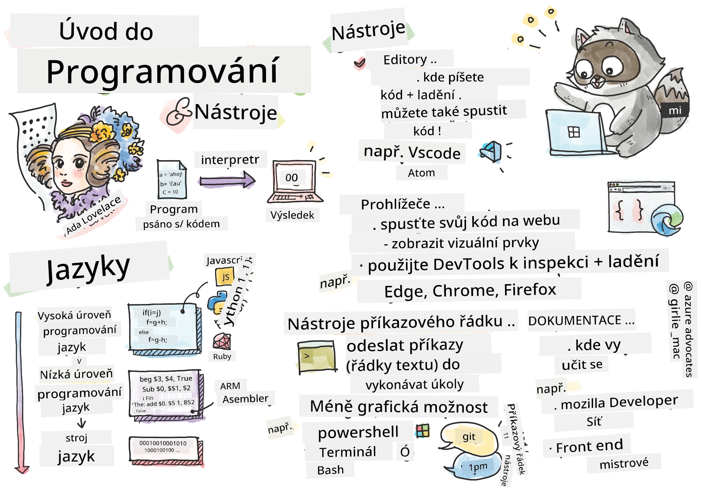
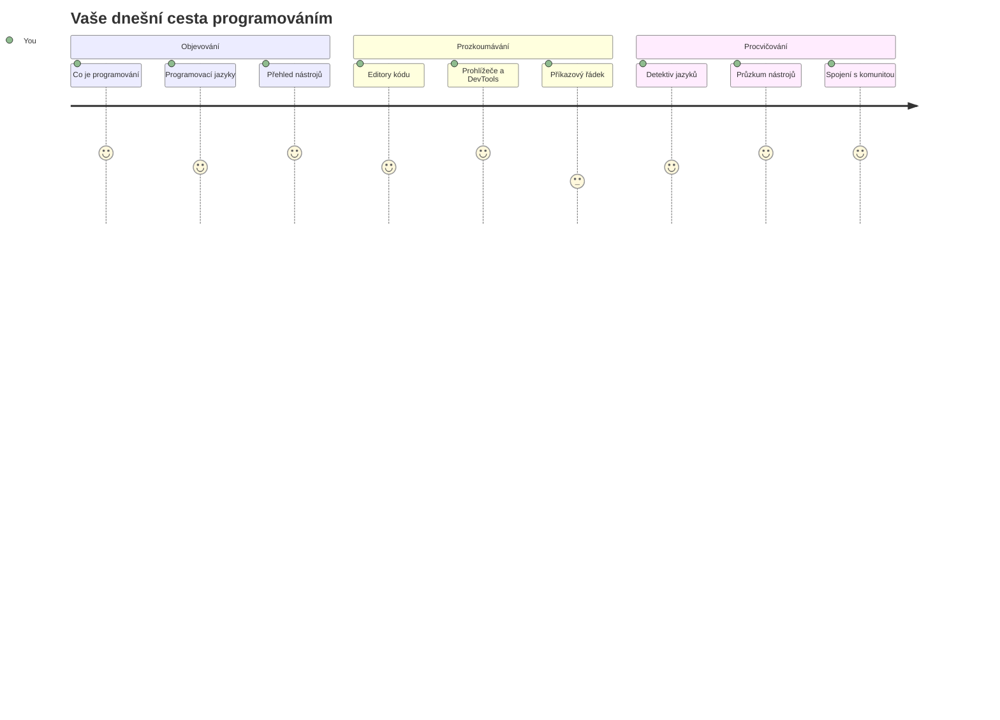
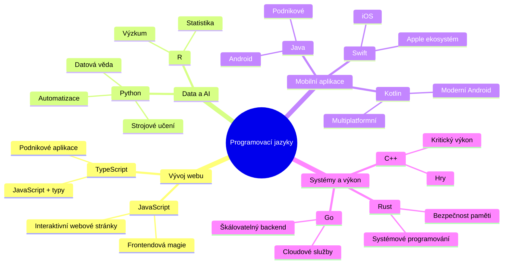
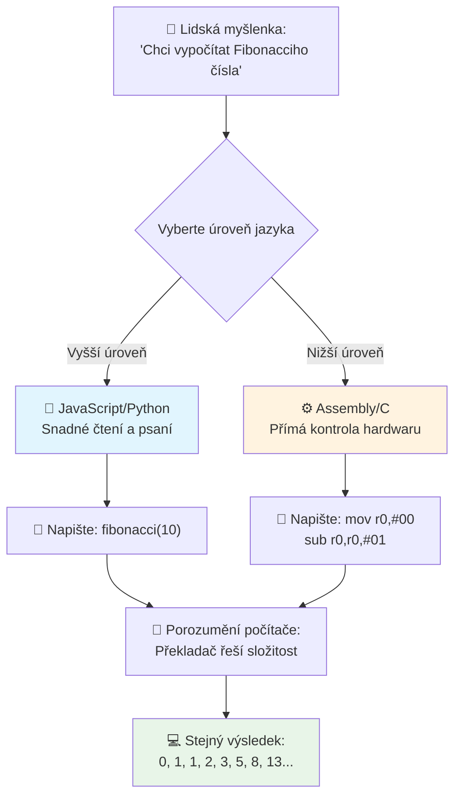
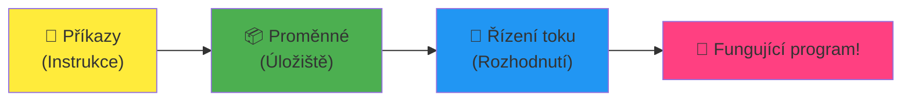
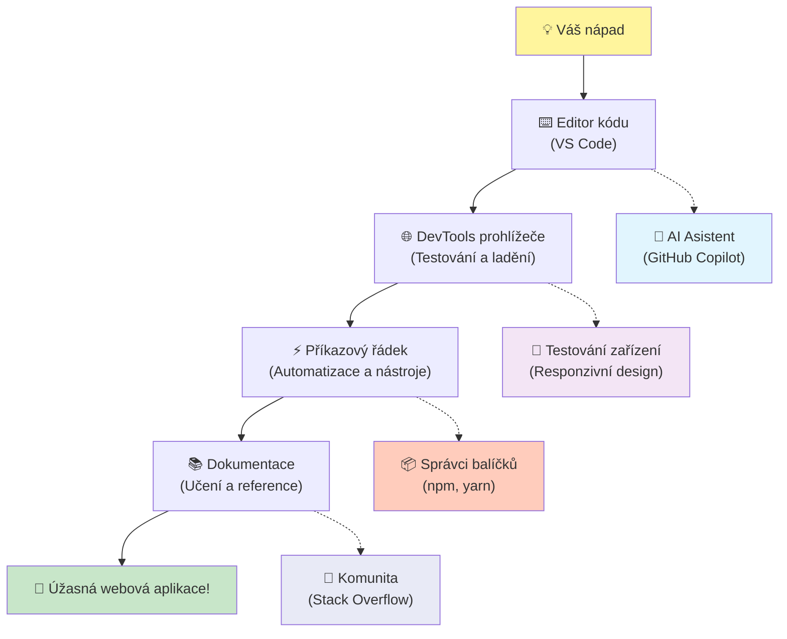
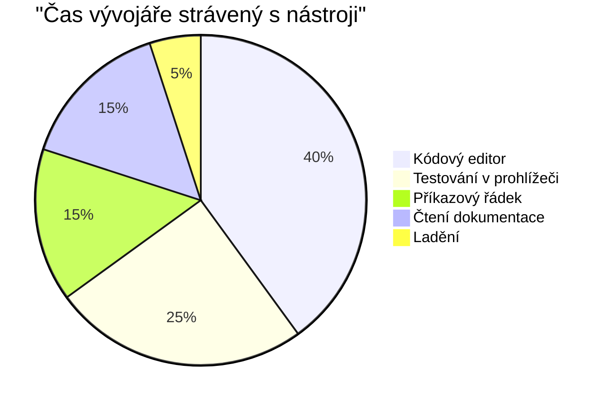
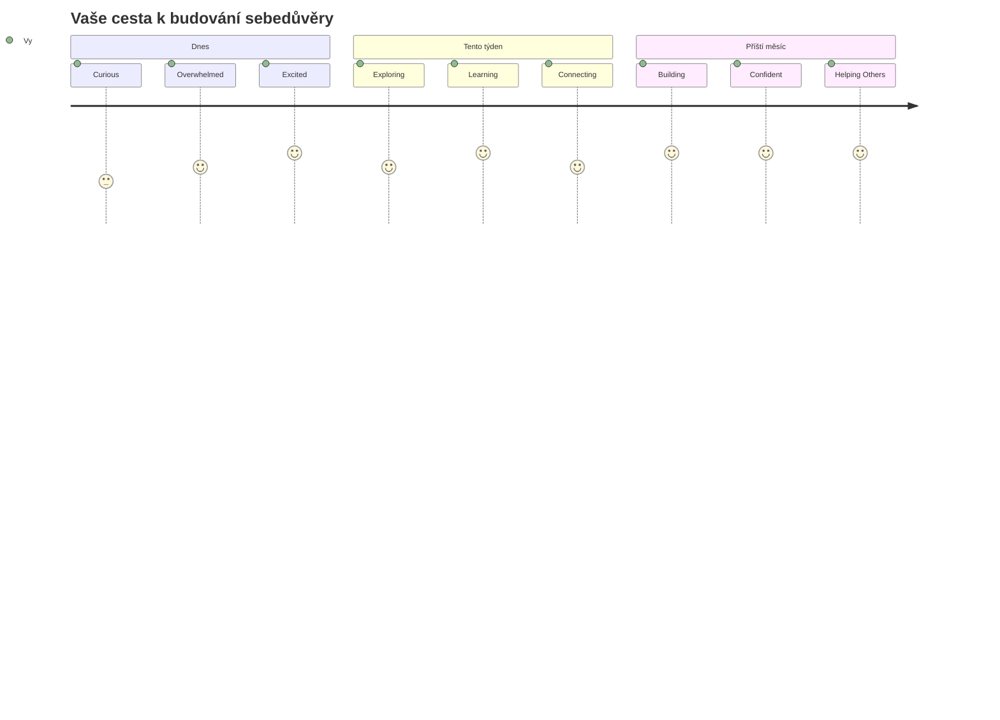

<!--
CO_OP_TRANSLATOR_METADATA:
{
  "original_hash": "d45ddcc54eb9232a76d08328b09d792e",
  "translation_date": "2026-01-07T04:12:06+00:00",
  "source_file": "1-getting-started-lessons/1-intro-to-programming-languages/README.md",
  "language_code": "cs"
}
-->
# Úvod do programovacích jazyků a moderních vývojářských nástrojů
 
Ahoj, budoucí vývojáři! 👋 Můžu vám něco říct, co mi dělá husí kůži každý den? Chystáte se objevovat, že programování není jen o počítačích – je to skutečná superschopnost přivést vaše nejdivočejší nápady k životu!

Znám ten moment, kdy používáte svoji oblíbenou aplikaci a všechno do sebe perfektně zapadne? Když kliknete na tlačítko a stane se něco naprosto magického, co vás přiměje říct „wow, jak to DĚLALI?“ No, někdo přesně jako vy – pravděpodobně sedící ve své oblíbené kavárně ve 2 ráno s třetím espressem – napsal kód, který tu magii vytvořil. A teď vás čeká něco, co vám úplně vyrazí dech: na konci této lekce nejen pochopíte, jak to udělali, ale budete přímo chtít to vyzkoušet sami!

Podívejte, chápu, že programování může být zatím zastrašující. Když jsem začínal já, upřímně jsem si myslel, že musíte být nějací matematičtí géniové nebo kódovat už od pěti let. Ale co mi úplně změnilo pohled: programování je přesně jako naučit se konverzovat v novém jazyce. Začnete „ahoj“ a „děkuji“, pak si objednáváte kávu a než se nadějete, vedete hluboké filozofické debaty! Akorát v tomto případě konverzujete s počítači a upřímně? Jsou to ti nejtrpělivější konverzační partneři na světě – nikdy vás nekritizují za chyby a vždycky jsou nadšení to zkusit znovu!

Dnes si prozkoumáme úžasné nástroje, které činí moderní webový vývoj nejen možným, ale doopravdy návykovým. Mluvím o stejných editorech, prohlížečích a pracovních postupech, které používají vývojáři ve Netflixu, Spotify a ve vašem oblíbeném indie studiu každý den. A tady je část, která vás nadchne: většina těchto profesionálních, průmyslových standardů je úplně zdarma!


> Sketchnote od [Tomomi Imura](https://twitter.com/girlie_mac)


## Podíváme se, co už umíte!

Než se pustíme do zábavy, jsem zvědavý – co už o světě programování víte? A pokud při pohledu na tyto otázky myslíte „nemám o tom absolutně žádné ponětí,“ vůbec nevadí, je to perfektní! To znamená, že jste na přesně správném místě. Považujte tento kvíz za rozcvičku před tréninkem – jen prostě rozehříváme mozkové svaly!

[Vyplňte předběžný kvíz](https://forms.office.com/r/dru4TE0U9n?origin=lprLink)


## Dobrodružství, na které se společně vydáme

Dobře, upřímně jsem celý nadšený z toho, co dnes budeme objevovat! Fakt, rád bych viděl vaši tvář, až vám některé z těchto konceptů začnou dávat smysl. Tady je neuvěřitelná cesta, na kterou se společně vydáme:

- **Co programování vlastně je (a proč je to ta nejúžasnější věc!)** – Objevíme, jak kód je doslova neviditelná magie, která pohání vše kolem vás, od budíku, který nějak ví, že je pondělí ráno, až po algoritmus, který perfektně vybírá vaše doporučení na Netflixu
- **Programovací jazyky a jejich úžasné osobnosti** – Představte si párty, kde každý má úplně jiné superschopnosti a způsoby řešení problémů. Takový je svět programovacích jazyků – a vy se s nimi budete rádi seznamovat!
- **Základní stavební kameny, které vytvářejí digitální magii** – Představte si to jako ultimátní kreativní LEGO sadu. Jakmile pochopíte, jak tyto kousky do sebe zapadají, uvědomíte si, že můžete skutečně postavit cokoli, co vám přijde na mysl
- **Profesionální nástroje, díky kterým se budete cítit, jako byste právě dostali kouzelnickou hůlku** – Nezveličuji – tyto nástroje vám skutečně dají pocit superhrdiny a ta nejlepší část? Jsou to ty stejné, které používají profíci!

> 💡 **Tady je věc**: ani nepřemýšlejte o tom, že byste si to dnes všechno měli zapamatovat! Teď chci, abyste pocítili ten jiskřivý zájem o to, co je možné. Detaily vám zůstávají přirozeně, když budeme spolu cvičit – takto se skutečně učíte!

> Tuto lekci si můžete projít i na [Microsoft Learn](https://docs.microsoft.com/learn/modules/web-development-101/introduction-programming/?WT.mc_id=academic-77807-sagibbon)!

## Co vlastně *je* programování?

Dobře, pojďme na tu zásadní otázku: co je programování doopravdy?

Povím vám příběh, který mi úplně změnil pohled na to. Minulý týden jsem se snažil vysvětlit mámě, jak používat náš nový dálkový ovladač od chytré televize. Přistihl jsem se, jak říkám věci jako „Stiskni červené tlačítko, ale ne to velké červené, to malé vlevo... ne, vaši druhou levou... dobře, drž ho dvě vteřiny, ne jednu, ne tři...“ Zní to povědomě? 😅

To je programování! Je to umění dávat velmi detailní, krok za krokem instrukce něčemu, co je mocné, ale potřebuje všechno přesně vyspecifikované. Akorát místo toho, abyste vysvětlovali mámě (která může zeptat „které červené tlačítko?!“), vysvětlujete počítači (který prostě udělá přesně to, co mu řeknete, i když to není úplně, co jste mysleli).

Co mě nadchlo, když jsem tohle poprvé pochopil: počítače jsou vlastně na základní úrovni docela jednoduché. Rozumí doslova jen dvěma věcem – 1 a 0, což je v podstatě „ano“ a „ne“ nebo „zapnuto“ a „vypnuto.“ To je vše! Ale tady nastává ta magie – nemusíme mluvit v jedničkách a nulách, jako v Matrixu. To jsou **programovací jazyky**, které nám pomáhají. Jsou jako nejlepší překladatel světa, který vezme vaše úplně normální lidské myšlenky a převede je do počítačového jazyka.

A tady je něco, co mi dělá husí kůži každé ráno, když se probouzím: doslova *všechno* digitální ve vašem životě začalo u někoho přesně jako jste vy, pravděpodobně sedícího v pyžamu s šálkem kávy a píšícího kód na notebooku. Ten Instagram filtr, který vás nechá vypadat dokonale? Někdo napsal ten kód. Doporučení, které vás zavedlo k vaší nové oblíbené písničce? Vývojář vytvořil ten algoritmus. Aplikace, která pomáhá rozdělit účet za večeři s přáteli? Jo, někdo si řekl „tohle je otravné, to zkusím opravit“ a... udělal to!

Když se naučíte programovat, neosvojujete si jen novou dovednost – stáváte se součástí úžasné komunity řešitelů problémů, kteří každý den přemýšlejí: „Co kdybych mohl postavit něco, co někomu zlepší den alespoň trochu?“ Opravdu, existuje něco lepšího?

✅ **Zajímavý úkol**: Najděte si, kdo myslíte, že byl první programátor na světě? Dám vám nápovědu: možná to není ten, koho čekáte! Příběh této osoby je naprosto fascinující a ukazuje, že programování vždycky bylo o kreativním hledání řešení a přemýšlení mimo zaběhnuté šablony.

### 🧠 **Jak se cítíte?**

**Chvilku se zamyslete:**
- Dává vám teď smysl představa „dávat počítačům instrukce“?
- Umíte si představit denní úkol, který byste chtěli automatizovat pomocí programování?
- Jaké otázky se vám honí hlavou ohledně celého toho programování?

> **Pamatujte**: Je naprosto normální, pokud některé koncepty zatím nejsou úplně jasné. Učení programování je jako učení nového jazyka – mozek potřebuje čas na vybudování nových neuronových spojů. Děláte to skvěle!

## Programovací jazyky jsou jako různé druhy magie

Dobře, tohle možná bude znít divně, ale vydržte se mnou – programovací jazyky jsou hodně jako různé hudební styly. Přemýšlejte o tom: máte jazz, který je hladký a improvizační, rock, který je silný a přímý, klasiku, co je elegantní a strukturovaná, a hip-hop, který je kreativní a expresivní. Každý styl má svou atmosféru, svoji komunitu nadšených fanoušků a každý je perfektní pro jiné nálady a příležitosti.

Programovací jazyky fungují stejně! Nechtěli byste používat stejný jazyk na tvorbu zábavné mobilní hry jako na zpracování obřího množství klimatických dat, stejně jako byste nehráli death metal při józe (no aspoň většinou ne! 😄).

Ale to, co mi pořád vyrazí dech, je tohle: ty jazyky jsou jako mít po boku nejtrpělivějšího a nejbystřejšího tlumočníka na světě. Můžete vyjádřit své myšlenky způsobem, který je přirozený vaší lidské mysli, a on zvládne veškerou neuvěřitelně složitou práci s překladem do jedniček a nul, které počítače skutečně „mluví“. Je to jako mít kamaráda, který dokonale ovládá oba jazyky – „lidskou kreativitu“ i „počítačovou logiku“ – a nikdy se neunaví, nepotřebuje pauzu na kávu a nikdy se na vás nezlobí, když se ptáte stejnou otázku dvakrát!

### Oblíbené programovací jazyky a jejich použití


| Jazyk | Nejlepší pro | Proč je populární |
|----------|----------|------------------|
| **JavaScript** | Webový vývoj, uživatelská rozhraní | Běží v prohlížečích a pohání interaktivní weby |
| **Python** | Data science, automatizace, AI | Snadné čtení a učení, silné knihovny |
| **Java** | Podnikové aplikace, Android aplikace | Platformně nezávislý, robustní pro velké systémy |
| **C#** | Windows aplikace, vývoj her | Silná podpora Microsoft ekosystému |
| **Go** | Cloudové služby, backend systémy | Rychlý, jednoduchý, navržený pro moderní výpočty |

### Jazyky na vysoké úrovni vs. nízké úrovni

Dobře, tohle byl opravdu koncept, který mě úplně zmátl na začátku, tak sdílím analogii, která to konečně rozsvítila i mě – doufám, že pomůže i vám!

Představte si, že jste v cizí zemi, kde neumíte jazyk, a zoufale hledáte nejbližší záchod (to jsme všichni zažili, že? 😅):

- **Programování nízké úrovně** je jako naučit se místní dialekt tak dobře, že si můžete povídat s babičkou prodávající ovoce na rohu pomocí kulturních narážek, místní slangu a vtipů, kterým rozumí jen někdo, kdo tam vyrostl. Super impresivní a neuvěřitelně efektivní… pokud jste fluent! Ale dost náročné, když jen chcete najít záchod.

- **Programování vysoké úrovně** je jako mít úžasného místního kamaráda, který vás prostě chápe. Můžete říct „Opravdu potřebuji najít toaletu“ v obyčejné angličtině a on zařídí celý kulturní překlad a dá vám instrukce tak, že jim rozumí i vaše netypická hlava.

V programovacích termínech:
- **Jazyky nízké úrovně** (například Assembly nebo C) vám umožní mít neuvěřitelně detailní rozhovor s fyzickým hardwarem počítače, ale musíte myslet jako stroj, což je… no, řekněme, že to je pořádná změna myšlení!
- **Jazyky vysoké úrovně** (jako JavaScript, Python nebo C#) vám dovolí myslet jako člověk, zatímco ony se starají o veškerou strojovou řeč v pozadí. Navíc mají úžasné přívětivé komunity plné lidí, kteří si pamatují, jaké to bylo být nováčky, a skutečně chtějí pomoci!

Hádejte, které vám doporučím začít? 😉 Jazyky vysoké úrovně jsou jako pomocná kolečka na kole, která nikdy nechcete sundat, protože celý zážitek je díky nim mnohem příjemnější!


### Ukážu vám, proč jsou jazyky vysoké úrovně tak přátelské

Dobře, chystám se vám ukázat něco, co perfektně demonstruje, proč jsem si zamiloval jazyky vysoké úrovně, ale nejdřív – potřebuji, abyste mi něco slíbili. Když uvidíte první ukázku kódu, nezpanikařte! Má vypadat trochu zastrašujícím dojmem. To je přesně ten bod, který chci zdůraznit!

Podíváme se na stejný úkol napsaný ve dvou úplně odlišných stylech. Oba vytvoří tzv. Fibonacciho posloupnost – nádherný matematický vzor, kde je každé číslo součtem dvou předchozích: 0, 1, 1, 2, 3, 5, 8, 13... (Zajímavost: tenhle vzor najdete doslova všude v přírodě – spirály slunečnicových semen, vzory šišek, dokonce i v tom, jak se tvoří galaxie!)

Připraveni vidět rozdíl? Jdeme na to!

**Jazyk vysoké úrovně (JavaScript) – přátelský k lidem:**

```javascript
// Krok 1: Základní nastavení Fibonacciho posloupnosti
const fibonacciCount = 10;
let current = 0;
let next = 1;

console.log('Fibonacci sequence:');
```

**Co tento kód dělá:**
- **Deklaruje** konstantu určující, kolik Fibonacciho čísel chceme vygenerovat
- **Inicializuje** dvě proměnné pro sledování současného a dalšího čísla v posloupnosti
- **Nastavuje** počáteční hodnoty (0 a 1), které definují Fibonacciho vzor
- **Zobrazuje** hlavičku pro identifikaci našeho výstupu

```javascript
// Krok 2: Vygenerujte posloupnost pomocí smyčky
for (let i = 0; i < fibonacciCount; i++) {
  console.log(`Position ${i + 1}: ${current}`);
  
  // Vypočítejte další číslo v posloupnosti
  const sum = current + next;
  current = next;
  next = sum;
}
```

**Co se zde děje podrobněji:**
- **Prochází** každou pozici v posloupnosti pomocí cyklu `for`
- **Zobrazuje** každé číslo s jeho pozicí využitím formátování šablonových řetězců
- **Vypočítává** další Fibonacciho číslo sčítáním současné a další hodnoty
- **Aktualizuje** sledovací proměnné pro přechod na další iteraci

```javascript
// Krok 3: Moderní funkcionální přístup
const generateFibonacci = (count) => {
  const sequence = [0, 1];
  
  for (let i = 2; i < count; i++) {
    sequence[i] = sequence[i - 1] + sequence[i - 2];
  }
  
  return sequence;
};

// Příklad použití
const fibSequence = generateFibonacci(10);
console.log(fibSequence);
```

**Výše jsme:**
- **Vytvořili** znovupoužitelnou funkci pomocí moderní syntaxi šipek (arrow function)
- **Sestavili** pole pro uložení celé posloupnosti místo zobrazení po jednom
- **Použili** indexování pole pro výpočet každého nového čísla ze starších
- **Vrátili** celou posloupnost pro flexibilní použití v dalších částech programu

**Jazyk nízké úrovně (ARM Assembly) – přátelský k počítači:**

```assembly
 area ascen,code,readonly
 entry
 code32
 adr r0,thumb+1
 bx r0
 code16
thumb
 mov r0,#00
 sub r0,r0,#01
 mov r1,#01
 mov r4,#10
 ldr r2,=0x40000000
back add r0,r1
 str r0,[r2]
 add r2,#04
 mov r3,r0
 mov r0,r1
 mov r1,r3
 sub r4,#01
 cmp r4,#00
 bne back
 end
```

Všimněte si, jak verze v JavaScriptu čte téměř jako instrukce v angličtině, zatímco verze v Assembly používá záhadné příkazy, které přímo řídí procesor počítače. Oba úkoly splní stejný úkol, ale jazyk vysoké úrovně je pro lidi mnohem snadněji pochopitelný, psaný a udržovatelný.

**Klíčové rozdíly, které si všimnete:**
- **Čitelnost**: JavaScript používá popisné názvy jako `fibonacciCount`, zatímco Assembly používá nesrozumitelné označení jako `r0`, `r1`
- **Komentáře**: Vysokoúrovňové jazyky podporují vysvětlující komentáře, které činí kód samodokumentujícím
- **Struktura**: Logický tok JavaScriptu odpovídá tomu, jak lidé přemýšlejí o problémech krok za krokem
- **Údržba**: Aktualizace verze JavaScriptu pro různé požadavky je přímá a jasná

✅ **O Fibonacciho posloupnosti**: Tento naprosto nádherný číselný vzorec (kde každé číslo se rovná součtu dvou předchozích: 0, 1, 1, 2, 3, 5, 8...) se doslova *vyskytuje všude* v přírodě! Najdete ho ve spirálách slunečnic, vzorcích šišek, způsobu, jak křivky ulit náutila a dokonce i ve způsobu růstu větví stromů. Je to docela úžasné, jak nám matematika a kód mohou pomoci pochopit a znovu vytvořit vzory, které příroda používá k tvorbě krásy!

## Základní stavební kameny, které vytvářejí kouzlo

Dobře, teď když jste viděli, jak programovací jazyky vypadají v akci, pojďme rozložit základní kousky, které tvoří doslova každý program, který kdy byl napsán. Považujte je za základní ingredience ve vašem oblíbeném receptu – jakmile pochopíte, co každý dělá, budete schopni číst a psát kód téměř v jakémkoli jazyce!

Je to něco jako učení se gramatice programování. Pamatujete si, jak jste se ve škole učili o podstatných jménech, slovesech a jak skládat věty dohromady? Programování má svou vlastní verzi gramatiky a upřímně je mnohem logičtější a shovívavější než anglická gramatika byla! 😄

### Příkazy: Krok za krokem pokyny

Začněme s **příkazy** – ty jsou jako jednotlivé věty v konverzaci s vaším počítačem. Každý příkaz říká počítači, aby udělal jednu konkrétní věc, podobně jako když dáváte směrování: „Zahni tady vlevo,“ „Zastav na červenou,“ „Zaparkuj na tom místě.“

Co mám na příkazech rád, je to, jak jsou obvykle čitelné. Podívejte se na to:

```javascript
// Základní příkazy, které vykonávají jednotlivé akce
const userName = "Alex";                    
console.log("Hello, world!");              
const sum = 5 + 3;                         
```

**Toto kód dělá:**
- **Deklaruje** konstantní proměnnou pro uložení jména uživatele
- **Zobrazí** uvítací zprávu do konzole
- **Spočítá** a uloží výsledek matematické operace

```javascript
// Výrazy, které interagují s webovými stránkami
document.title = "My Awesome Website";      
document.body.style.backgroundColor = "lightblue";
```

**Krok za krokem se děje toto:**
- **Upraví** titulek webové stránky, který se zobrazuje na kartě v prohlížeči
- **Změní** barvu pozadí celého těla stránky

### Proměnné: Paměťový systém vašeho programu

Dobře, **proměnné** jsou upřímně jeden z mých nejoblíbenějších konceptů učit, protože jsou tak podobné věcem, které už každý den používáte!

Zamyslete se na chvíli nad seznamem kontaktů ve vašem telefonu. Nezapamatujete si čísla na všechny – místo toho uložíte „Maminka,“ „Nejlepší přítel“ nebo „Pizzerie, která rozváží do 2 ráno“ a necháte telefon pamatovat si ta skutečná čísla. Proměnné fungují úplně stejně! Jsou to jako označené kontejnery, kde váš program může uložit informace a později je vyhledat pomocí smysluplného jména.

Co je opravdu skvělé: proměnné se mohou měnit, zatímco váš program běží (odtud název „proměnlivé“ – vidíte, co udělali?). Stejně jako můžete aktualizovat ten kontakt na pizzerii, když objevíte něco lepšího, proměnné se mohou změnit, když váš program získá nové informace nebo když se situace změní!

Ukážu vám, jak to může být krásně jednoduché:

```javascript
// Krok 1: Vytváření základních proměnných
const siteName = "Weather Dashboard";        
let currentWeather = "sunny";               
let temperature = 75;                       
let isRaining = false;                      
```

**Pochopení těchto konceptů:**
- **Uložení** neměnných hodnot do `const` proměnných (například název stránky)
- **Použití** `let` pro hodnoty, které se mohou během programu měnit
- **Přiřazení** různých datových typů: řetězce (text), čísla a booleany (true/false)
- **Výběr** popisných názvů, které vysvětlují, co každá proměnná obsahuje

```javascript
// Krok 2: Práce s objekty pro seskupení souvisejících dat
const weatherData = {                       
  location: "San Francisco",
  humidity: 65,
  windSpeed: 12
};
```

**Výše jsme:**
- **Vytvořili** objekt pro seskupení souvisejících informací o počasí
- **Organizovali** více dat pod jedno jméno proměnné
- **Použili** klíč-hodnota páry k jasnému označení každé informace

```javascript
// Krok 3: Používání a aktualizace proměnných
console.log(`${siteName}: Today is ${currentWeather} and ${temperature}°F`);
console.log(`Wind speed: ${weatherData.windSpeed} mph`);

// Aktualizace změnitelných proměnných
currentWeather = "cloudy";                  
temperature = 68;                          
```

**Pojďme porozumět každé části:**
- **Zobrazit** informace pomocí šablonových literálů se syntaxí `${}`
- **Přistupovat** k vlastnostem objektu pomocí tečkové notace (`weatherData.windSpeed`)
- **Aktualizovat** proměnné deklarované s `let` pro odrážení měnících se podmínek
- **Kombinovat** více proměnných k vytvoření smysluplných zpráv

```javascript
// Krok 4: Moderní destrukturalizace pro čistější kód
const { location, humidity } = weatherData; 
console.log(`${location} humidity: ${humidity}%`);
```

**Co musíte vědět:**
- **Extrahovat** specifické vlastnosti z objektů pomocí destrukturalizace přiřazení
- **Vytvářet** nové proměnné automaticky se stejnými názvy jako klíče objektu
- **Zjednodušit** kód vyhnutím se opakované tečkové notaci

### Řízení toku: Naučte svůj program myslet

Dobře, tady programování začne být naprosto ohromující! **Řízení toku** je v podstatě učení vašeho programu, jak dělat chytrá rozhodnutí, přesně jako to děláte vy každý den bez přemýšlení.

Představte si toto: dnes ráno jste asi šli něčím jako „Když prší, vezmu si deštník. Když je zima, obléknu si bundu. Když jdu pozdě, vynechám snídani a vezmu si kávu cestou.“ Váš mozek přirozeně sleduje tuto logiku pokud-pak desítkykrát denně!

Toto dělá programy inteligentními a živými místo toho, aby jen následovaly nudný, předvídatelný scénář. Mohou skutečně pohledět na situaci, vyhodnotit, co se děje, a reagovat vhodně. Je to jako dát programu mozek, který se dokáže přizpůsobit a vybírat si!

Chcete vidět, jak krásně to funguje? Ukážu vám to:

```javascript
// Krok 1: Základní podmíněná logika
const userAge = 17;

if (userAge >= 18) {
  console.log("You can vote!");
} else {
  const yearsToWait = 18 - userAge;
  console.log(`You'll be able to vote in ${yearsToWait} year(s).`);
}
```

**Tento kód dělá:**
- **Zkontroluje**, zda uživatel dosáhl věku pro hlasování
- **Provede** různé bloky kódu podle výsledku podmínky
- **Spočítá** a zobrazí, jak dlouho ještě do způsobilosti k volbám, pokud je pod 18
- **Poskytne** specifickou, užitečnou zpětnou vazbu pro každou situaci

```javascript
// Krok 2: Více podmínek s logickými operátory
const userAge = 17;
const hasPermission = true;

if (userAge >= 18 && hasPermission) {
  console.log("Access granted: You can enter the venue.");
} else if (userAge >= 16) {
  console.log("You need parent permission to enter.");
} else {
  console.log("Sorry, you must be at least 16 years old.");
}
```

**Rozbor, co se tu děje:**
- **Spojíme** více podmínek pomocí operátoru `&&` (a)
- **Vytvoříme** hierarchii podmínek pomocí `else if` pro více scénářů
- **Zpracujeme** všechny možné případy pomocí konečného `else`
- **Poskytujeme** jasnou a praktickou zpětnou vazbu pro každou situaci

```javascript
// Krok 3: Stručná podmínka s ternárním operátorem
const votingStatus = userAge >= 18 ? "Can vote" : "Cannot vote yet";
console.log(`Status: ${votingStatus}`);
```

**Na co si pamatovat:**
- **Použijte** ternární operátor (`? :`) pro jednoduché dvou-variantní podmínky
- **Napište** podmínku první, následovanou `?`, pak pravdivý výsledek, pak `:`, a nakonec nepravdivý výsledek
- **Použijte** tento vzor, když potřebujete přiřadit hodnoty podle podmínek

```javascript
// Krok 4: Řešení více konkrétních případů
const dayOfWeek = "Tuesday";

switch (dayOfWeek) {
  case "Monday":
  case "Tuesday":
  case "Wednesday":
  case "Thursday":
  case "Friday":
    console.log("It's a weekday - time to work!");
    break;
  case "Saturday":
  case "Sunday":
    console.log("It's the weekend - time to relax!");
    break;
  default:
    console.log("Invalid day of the week");
}
```

**Tento kód dokáže následující:**
- **Porovná** hodnotu proměnné s více specifickými případy
- **Seskupí** podobné případy dohromady (pracovní dny vs. víkendy)
- **Spustí** odpovídající blok kódu, když najde shodu
- **Zahrnuje** `default` případ pro neočekávané hodnoty
- **Používá** příkazy `break`, aby zabránil pokračování kódu v dalším případě

> 💡 **Skutečná analogie**: Myslete na řízení toku jako na nejtrpělivější GPS na světě, která vám dává pokyny. Může říct „Pokud je na Main Street provoz, jeďte raději po dálnici. Pokud je dálnice zablokovaná stavbou, zkuste malebnou cestu.“ Programy používají stejný druh podmíněné logiky, aby inteligentně reagovaly na různé situace a vždy poskytly uživatelům nejlepší možný zážitek.

### 🎯 **Ověření konceptů: Mistrovství stavebních kamenů**

**Podívejme se, jak na tom jste se základy:**
- Dokážete vysvětlit rozdíl mezi proměnnou a příkazem svými slovy?
- Zamyslete se nad reálnou situací, kdy byste použili rozhodnutí typu pokud-pak (například náš příklad s hlasováním)
- Co vás na programovací logice nejvíc překvapilo?

**Rychlý posilovač sebevědomí:**

✅ **Co bude dál**: Budeme mít absolutní zábavu, když se do těchto konceptů ponoříme hlouběji na naší úžasné cestě spolu! Teď se jen soustřeďte na pocit vzrušení z těch všech úžasných možností před vámi. Konkrétní dovednosti a techniky přirozeně přijdou, jak budeme společně procvičovat – slibuji, že to bude mnohem zábavnější, než možná očekáváte!

## Nástroje řemesla

Dobře, tady se upřímně začínám tak těšit, že se sotva udržím! 🚀 Půjdeme mluvit o neuvěřitelných nástrojích, které vám dají pocit, jako byste právě dostali klíče od digitální vesmírné lodi.

Víte, jak má kuchař ty dokonale vyvážené nože, které jsou prodloužením jeho rukou? Nebo jak má hudebník tu jedinou kytaru, která jakmile se jí dotkne, jako by zpívala? No, vývojáři mají svoji vlastní verzi těchto magických nástrojů a tady je něco, co vás opravdu ohromí – většina z nich je úplně zdarma!

Skoro skáču na židli s nadšením, že vám je můžu ukázat, protože úplně změnily způsob, jak stavíme software. Mluvíme o asistentech pro psaní kódu poháněných umělou inteligencí (nemyslím si to!), cloudových prostředích, kde můžete stavět celé aplikace doslova odkudkoli s Wi-Fi, a ladicích nástrojích tak sofistikovaných, že jsou jako rentgenové vidění pro vaše programy.

A tady je část, která mi stále dává husí kůži: nejsou to „nástroje pro začátečníky“, které rychle přerostete. Jsou to úplně stejné profesionální nástroje, které používají vývojáři ve Google, Netflixu a v tom indie vývojářském studiu, které máte rádi, právě teď. Budete se při jejich používání cítit jako fakt profíci!


### Editory kódu a IDE: Vaši noví digitální nejlepší přátelé

Pojďme mluvit o editorech kódu – ty se vážně chystají stát vašimi novými oblíbenými místy! Považujte je za své osobní útočiště programování, kde strávíte většinu času tvorbou a zdokonalováním svých digitálních výtvorů.

Ale to, co je na moderních editorech naprosto kouzelné, je, že nejsou jen obyčejné textové editory. Jsou jako mít nejchytřejšího a nejpodpůrnějšího mentora programování, který sedí přímo vedle vás 24/7. Chytají vaše překlepy dřív, než je vůbec zaregistrujete, navrhují vylepšení, která vás nechají vypadat jako géniové, pomáhají vám pochopit, co každý kousek kódu dělá, a některé dokonce předpovídají, co chcete napsat, a nabídnou vám dokončit vaše myšlenky!

Pamatuji si, když jsem poprvé objevil automatické doplňování – doslova jsem měl pocit, že žiju v budoucnosti. Začnete něco psát a editor vám řekne: „Hej, nemyslel jsi na tuto funkci, která dělá přesně to, co potřebuješ?“ Je to jako mít mentálního čtecího kamaráda při kódování!

**Co dělá tyto editory tak úžasnými?**

Moderní editory kódu nabízejí působivé spektrum funkcí navržených pro zvýšení vaší produktivity:

| Funkce | Co dělá | Proč pomáhá |
|---------|--------------|--------------|
| **Zvýraznění syntaxe** | Barevně odlišuje různé části kódu | Usnadňuje čtení kódu a hledání chyb |
| **Automatické doplňování** | Navrhuje kód při psaní | Zrychluje psaní kódu a snižuje překlepy |
| **Nástroje ladění** | Pomáhají najít a opravit chyby | Šetří hodiny času při hledání problémů |
| **Rozšíření** | Přidávají specializované funkce | Přizpůsobí editor jakékoli technologii |
| **Asistenti AI** | Navrhují kód a vysvětlení | Zrychlují učení a produktivitu |

> 🎥 **Video zdroj**: Chcete vidět tyto nástroje v akci? Podívejte se na toto [Tools of the Trade video](https://youtube.com/watch?v=69WJeXGBdxg) pro komplexní přehled.

#### Doporučené editory pro webový vývoj

**[Visual Studio Code](https://code.visualstudio.com/?WT.mc_id=academic-77807-sagibbon)** (zdarma)  
- Nejoblíbenější mezi webovými vývojáři  
- Vynikající ekosystém rozšíření  
- Vestavěný terminál a integrace s Gitem  
- **Nezbytná rozšíření**:  
  - [GitHub Copilot](https://marketplace.visualstudio.com/items?itemName=GitHub.copilot) - AI-poháněné návrhy kódu  
  - [Live Share](https://marketplace.visualstudio.com/items?itemName=MS-vsliveshare.vsliveshare) - Spolupráce v reálném čase  
  - [Prettier](https://marketplace.visualstudio.com/items?itemName=esbenp.prettier-vscode) - Automatické formátování kódu  
  - [Code Spell Checker](https://marketplace.visualstudio.com/items?itemName=streetsidesoftware.code-spell-checker) - Odhalování překlepů v kódu

**[JetBrains WebStorm](https://www.jetbrains.com/webstorm/)** (placené, zdarma pro studenty)  
- Pokročilé nástroje pro ladění a testování  
- Inteligentní dokončování kódu  
- Vestavěná správa verzí

**Cloudová IDE** (různá cenová politika)  
- [GitHub Codespaces](https://github.com/features/codespaces) - Plnohodnotný VS Code v prohlížeči  
- [Replit](https://replit.com/) - Skvělé pro učení a sdílení kódu  
- [StackBlitz](https://stackblitz.com/) - Okamžitý full-stack webový vývoj

> 💡 **Tip na začátek**: Začněte s Visual Studio Code – je zdarma, široce používaný v oboru a má obrovskou komunitu vytvářející užitečné návody a rozšíření.

### Webové prohlížeče: Vaše tajná vývojářská laboratoř

Dobře, připravte se, že vám to úplně vyrazí dech! Víte, jak jste používali prohlížeče k prohlížení sociálních sítí a sledování videí? Ukázalo se, že celý čas skrývají tuto neuvěřitelnou tajnou vývojářskou laboratoř, která čeká, až ji objevíte!

Pokaždé, když kliknete pravým tlačítkem na webovou stránku a vyberete „Prozkoumat prvek,“ otevírá se vám skrytý svět vývojářských nástrojů, které jsou upřímně silnější než některé drahé programy, za které jsem kdysi platil stovky dolarů. Je to jako objevit, že vaše obyčejná domácí kuchyně skrývá profesionální kuchařskou laboratoř za tajným panelem!
Poprvé, když mi někdo ukázal nástroje pro vývojáře v prohlížeči, strávil jsem asi tři hodiny jen klikáním a říkal si: „POČKEJ, TO MŮŽE DĚLAT I TO?“ Doslova můžete upravovat jakoukoli webovou stránku v reálném čase, přesně vidět, jak rychle se všechno načítá, testovat, jak vaše stránka vypadá na různých zařízeních, a dokonce ladit JavaScript jako opravdový profík. Je to naprosto úžasné!

**Tady je důvod, proč jsou prohlížeče vaším tajným zbraněm:**

Když vytváříte webovou stránku nebo webovou aplikaci, potřebujete vidět, jak vypadá a chová se v reálném světě. Prohlížeče nejen zobrazují vaši práci, ale také poskytují podrobné informace o výkonu, přístupnosti a možných problémech.

#### Nástroje pro vývojáře v prohlížeči (DevTools)

Moderní prohlížeče obsahují komplexní sady nástrojů pro vývoj:

| Kategorie nástroje | Co dělá | Příklad použití |
|---------------|--------------|------------------|
| **Inspektor elementů** | Zobrazení a úprava HTML/CSS v reálném čase | Úprava stylu pro okamžité výsledky |
| **Konzole** | Zobrazení chybových zpráv a testování JavaScriptu | Ladění problémů a experimentování s kódem |
| **Monitor sítě** | Sledování načítání zdrojů | Optimalizace výkonu a doby načítání |
| **Kontrola přístupnosti** | Testování inkluzivního designu | Zajištění funkčnosti webu pro všechny uživatele |
| **Simulátor zařízení** | Náhled na různých velikostech obrazovek | Testování responzivního designu bez více zařízení |

#### Doporučené prohlížeče pro vývoj

- **[Chrome](https://developers.google.com/web/tools/chrome-devtools/)** - Průmyslový standard DevTools s rozsáhlou dokumentací
- **[Firefox](https://developer.mozilla.org/docs/Tools)** - Skvělé nástroje pro CSS Grid a přístupnost
- **[Edge](https://docs.microsoft.com/microsoft-edge/devtools-guide-chromium/?WT.mc_id=academic-77807-sagibbon)** - Postavený na Chromium s vývojářskými zdroji od Microsoftu

> ⚠️ **Důležitý tip pro testování**: Vždy testujte své weby v několika prohlížečích! To, co funguje perfektně v Chromu, může vypadat jinak v Safari nebo Firefoxu. Profesionální vývojáři testují ve všech hlavních prohlížečích, aby zajistili konzistentní uživatelský zážitek.


### Nástroje příkazové řádky: Vaše brána do supermocí vývojáře

Dobře, pojďme mít teď upřímný moment ohledně příkazové řádky, protože chci, abyste to slyšeli od někoho, kdo tomu skutečně rozumí. Když jsem ji poprvé viděl – jen tu strašidelnou černou obrazovku s blikajícím textem – doslova jsem si pomyslel: „Ne, rozhodně ne! To vypadá jako něco z hackerského filmu z 80. let a já na to opravdu nejsem dost chytrý!“ 😅

Ale tady je to, co bych si přál, aby mi tehdy někdo řekl, a co říkám vám teď: příkazová řádka není strašidelná – je to vlastně jako mít přímý rozhovor s vaším počítačem. Představte si to jako rozdíl mezi objednávkou jídla přes stylovou aplikaci s obrázky a menu (což je hezké a snadné) oproti vstupu do vaší oblíbené místní restaurace, kde kuchař přesně zná, co máte rád, a umí vytvořit něco perfektního jen proto, že řeknete „překvap mě něčím úžasným.“

Příkazová řádka je místo, kam chodí vývojáři, aby se cítili jako opravdoví kouzelníci. Napíšete pár zdánlivě magických slov (dobře, jsou to jen příkazy, ale mají magický nádech!), stisknete enter a BUM – vytvořili jste celé struktury projektů, nainstalovali výkonné nástroje z celého světa, nebo nasadili svou aplikaci na internet, aby ji mohly vidět miliony lidí. Jakmile ochutnáte tu moc, je to opravdu návykové!

**Proč se příkazová řádka stane vaším oblíbeným nástrojem:**

I když jsou grafická rozhraní skvělá pro mnoho úkolů, příkazová řádka vyniká v automatizaci, přesnosti a rychlosti. Mnoho vývojářských nástrojů funguje primárně přes příkazové rozhraní a naučit se je efektivně používat může výrazně zlepšit vaši produktivitu.

```bash
# Krok 1: Vytvořte adresář projektu a přejděte do něj
mkdir my-awesome-website
cd my-awesome-website
```

**Co tento kód dělá:**
- **Vytvoří** nový adresář s názvem "my-awesome-website" pro váš projekt
- **Přejde** do nově vytvořeného adresáře, aby mohl začít pracovat

```bash
# Krok 2: Inicializujte projekt s package.json
npm init -y

# Nainstalujte moderní vývojové nástroje
npm install --save-dev vite prettier eslint
npm install --save-dev @eslint/js
```

**Krok za krokem, co se děje:**
- **Inicializuje** nový Node.js projekt s výchozími nastaveními pomocí `npm init -y`
- **Nainstaluje** Vite jako moderní nástroj pro rychlý vývoj a produkční sestavení
- **Přidá** Prettier pro automatické formátování kódu a ESLint pro kontrolu kvality
- **Použije** přepínač `--save-dev`, aby tyto závislosti byly jen pro vývoj

```bash
# Krok 3: Vytvořte strukturu projektu a soubory
mkdir src assets
echo '<!DOCTYPE html><html><head><title>My Site</title></head><body><h1>Hello World</h1></body></html>' > index.html

# Spusťte vývojový server
npx vite
```

**Ve výše uvedeném jsme:**
- **Uspořádali** náš projekt vytvořením samostatných složek pro zdrojový kód a assety
- **Vygenerovali** základní HTML soubor s správnou strukturou dokumentu
- **Spustili** vývojový server Vite pro živé aktualizace a horkou náhradu modulů

#### Základní nástroje příkazové řádky pro webový vývoj

| Nástroj | Účel | Proč ho potřebujete |
|------|---------|-----------------|
| **[Git](https://git-scm.com/)** | Správa verzí | Sledování změn, spolupráce s ostatními, zálohování práce |
| **[Node.js & npm](https://nodejs.org/)** | JavaScript runtime & správa balíčků | Spouštění JavaScriptu mimo prohlížeče, instalace moderních vývojových nástrojů |
| **[Vite](https://vitejs.dev/)** | Nástroj pro sestavení & dev server | Bleskový vývoj s horkou náhradou modulů |
| **[ESLint](https://eslint.org/)** | Kvalita kódu | Automatické nalezení a oprava problémů v JavaScriptu |
| **[Prettier](https://prettier.io/)** | Formátování kódu | Udržování kódu konzistentně formátovaného a čitelného |

#### Platformně specifické možnosti

**Windows:**
- **[Windows Terminal](https://docs.microsoft.com/windows/terminal/?WT.mc_id=academic-77807-sagibbon)** - Moderní, plně vybavený terminál
- **[PowerShell](https://docs.microsoft.com/powershell/?WT.mc_id=academic-77807-sagibbon)** 💻 - Výkonné skriptovací prostředí
- **[Příkazový řádek](https://docs.microsoft.com/windows-server/administration/windows-commands/?WT.mc_id=academic-77807-sagibbon)** 💻 - Tradiční Windows příkazová řádka

**macOS:**
- **[Terminal](https://support.apple.com/guide/terminal/)** 💻 - Vestavěná terminálová aplikace
- **[iTerm2](https://iterm2.com/)** - Vylepšený terminál s pokročilými funkcemi

**Linux:**
- **[Bash](https://www.gnu.org/software/bash/)** 💻 - Standardní linuxová shell
- **[KDE Konsole](https://docs.kde.org/trunk5/en/konsole/konsole/index.html)** - Pokročilý terminálový emulátor

> 💻 = Předinstalováno v operačním systému

> 🎯 **Cesta učení**: Začněte se základními příkazy jako `cd` (změna adresáře), `ls` nebo `dir` (výpis souborů) a `mkdir` (vytvoření složky). Procvičujte moderní pracovní příkazy jako `npm install`, `git status` a `code .` (otevře současný adresář ve VS Code). Jakmile si zvyknete, přirozeně osvojíte více pokročilých příkazů a automatizačních technik.


### Dokumentace: Váš vždy dostupný učitel a mentor

Dobře, prozradím vám malý tajemství, které vám pomůže cítit se mnohem lépe jako začátečník: i ti nejzkušenější vývojáři stráví obrovskou část svého času čtením dokumentace. A není to proto, že by nevěděli, co dělají – to je vlastně známka moudrosti!

Představte si dokumentaci jako přístup k nejtrpělivějším, nejvzdělanějším učitelům světa, kteří jsou k dispozici 24/7. Zasekli jste se na problému ve 2 ráno? Dokumentace je tam s teplým virtuálním objetím a přesně vám podá odpověď, kterou potřebujete. Chcete se naučit o nějaké skvělé nové funkci, o které všichni mluví? Dokumentace to má připravené s příklady krok za krokem. Snažíte se pochopit, proč něco funguje tak, jak to funguje? Hádejte co – dokumentace je připravená vám to vysvětlit způsobem, který vám to konečně rozsvítí!

Tady je něco, co úplně změnilo můj pohled: svět webového vývoje se hýbe neuvěřitelně rychle a nikdo (mám na mysli opravdu nikdo!) nemá všechno v paměti. Viděl jsem zkušené vývojáře s 15+ lety praxe, jak vyhledávají základní syntaxi, a víte co? To není trapné – to je chytré! Není to o perfektní paměti; je to o tom vědět, kde rychle najít spolehlivé odpovědi a umět je správně použít.

**Tady se odehrává ta opravdová magie:**

Profesionální vývojáři tráví výraznou část svého času čtením dokumentace – ne proto, že by nevěděli, co dělají, ale protože oblast webového vývoje se tak rychle vyvíjí, že udržet krok vyžaduje neustálé učení. Skvělá dokumentace vám pomůže pochopit nejen *jak* něco používat, ale také *proč* a *kdy* to použít.

#### Základní zdroje dokumentace

**[Mozilla Developer Network (MDN)](https://developer.mozilla.org/docs/Web)**
- Zlatý standard dokumentace webových technologií
- Obsáhlé průvodce pro HTML, CSS a JavaScript
- Zahrnuje informace o kompatibilitě prohlížečů
- Obsahuje praktické příklady a interaktivní ukázky

**[Web.dev](https://web.dev)** (od Google)
- Moderní doporučené postupy ve webovém vývoji
- Průvodce optimalizací výkonu
- Principy přístupnosti a inkluzivního designu
- Případové studie z reálných projektů

**[Microsoft Developer Documentation](https://docs.microsoft.com/microsoft-edge/#microsoft-edge-for-developers)**
- Vývojářské zdroje pro prohlížeč Edge
- Průvodce pro progresivní webové aplikace
- Přehled multiplatformního vývoje

**[Frontend Masters Learning Paths](https://frontendmasters.com/learn/)**
- Strukturované výukové plány
- Videokurzy od expertů z oboru
- Praktické cvičení s kódováním

> 📚 **Strategie studia**: Nesnažte se dokumentaci memorovat – místo toho se naučte, jak ji efektivně procházet. Přidejte si do záložek často používané reference a trénujte využívání vyhledávání pro rychlé nalezení konkrétních informací.

### 🔧 **Otestujte své mistrovství s nástroji: Co na vás nejvíc zapůsobilo?**

**Zastavte se na chvíli a zamyslete se:**
- Který nástroj si chcete vyzkoušet jako první? (Žádná špatná odpověď!)
- Stále je pro vás příkazová řádka zastrašující nebo vás to láká ji poznat?
- Dokážete si představit, že byste používali nástroje pro vývojáře v prohlížeči k nahlédnutí pod pokličku svých oblíbených webů?


> **Zajímavost**: Většina vývojářů tráví asi 40 % času v editoru kódu, ale všimněte si, kolik času jde na testování, učení a řešení problémů. Programování není jen psaní kódu – je to vytváření zážitků!

✅ **K zamyšlení**: Tady je něco zajímavého k přemýšlení – jak myslíte, že se nástroje pro tvorbu webů (vývoj) liší od nástrojů pro návrh vzhledu (design)? Je to jako rozdíl mezi architektem, který navrhuje krásný dům, a stavebním dodavatelem, který ho skutečně postaví. Obě role jsou klíčové, ale vyžadují odlišnou sadu nástrojů! Takové myšlení vám opravdu pomůže vidět širší obraz, jak weby vznikají.

## Výzva GitHub Copilot Agenta 🚀

Použijte režim Agenta k dokončení následující výzvy:

**Popis:** Prozkoumejte funkce moderního kódovacího editoru nebo IDE a ukažte, jak může zlepšit váš pracovní tok jako webový vývojář.

**Zadání:** Vyberte si kódovací editor nebo IDE (například Visual Studio Code, WebStorm nebo cloudové IDE). Vyjmenujte tři funkce nebo rozšíření, které vám pomáhají psát, ladit nebo udržovat kód efektivněji. U každé krátce vysvětlete, jak zlepšuje váš pracovní proces.

---

## 🚀 Výzva

**Tak dobře, detektive, jsi připraven na svůj první případ?**

Teď když máš tento skvělý základ, čeká tě dobrodružství, které ti pomůže vidět, jak neuvěřitelně různorodý a fascinující je svět programování. A poslouchej – není to o psaní kódu, takže žádný tlak! Představ si sám sebe jako detektiva programovacích jazyků na svém úplně prvním vzrušujícím případě!

**Tvůj úkol, pokud se rozhodneš ho přijmout:**
1. **Staň se objevitelem jazyků**: Vyber tři programovací jazyky z úplně odlišných světů – třeba jeden pro tvorbu webů, jeden pro mobilní aplikace a jeden pro vědecká data. Najdi příklady stejného jednoduchého úkolu napsaného v každém jazyce. Slibuju, že tě překvapí, jak odlišně mohou vypadat, i když dělají úplně to samé!

2. **Získej jejich příběhy vzniku**: Co dělá každý jazyk výjimečným? Tady je zajímavý fakt – každý programovací jazyk vznikl, protože někdo řekl: „Víš co? Musí existovat lepší způsob, jak vyřešit tento konkrétní problém.“ Můžeš zjistit, jaké problémy to byly? Některé z těch příběhů jsou opravdu fascinující!

3. **Poznej komunity**: Podívej se, jak vstřícná a zapálená je komunita kolem každého jazyka. Některé mají miliony vývojářů sdílejících znalosti a pomáhajících si, jiné jsou menší, ale neskutečně soudržné a podporující. Budeš rád vidět, jaké osobnosti tyto komunity mají!

4. **Řiď se svým instinktem**: Který jazyk ti teď přijde nejsnazší? Neřeš, že bys měl udělat „perfektní“ volbu – jen naslouchej svému pocitu! Opravdu neexistuje špatná odpověď a vždy můžeš později prozkoumat další.

**Bonusová detektivní práce**: Podívej se, které hlavní weby nebo aplikace jsou postavené s použitím každého jazyka. Zaručuji ti, že budeš šokovaný, až zjistíš, co pohání Instagram, Netflix nebo tu mobilní hru, kterou nemůžeš přestat hrát!

> 💡 **Pamatuj**: Dnes se nesnažíš stát expertem na žádný z těchto jazyků. Jen si pořádně prohlížíš sousedství, než se rozhodneš, kde chceš zakotvit. Dej si na čas, bav se a nech svou zvědavost vést!

## Oslavme, co jsi objevil!

Páni, dnes jsi nasál tolik neuvěřitelných informací! Opravdu se těším, kolik toho z téhle úžasné cesty ti zůstalo. A pamatuj – není to test, kde musíš být perfektní. Je to spíš oslava všeho skvělého, co ses o tomto fascinujícím světě dozvěděl, do kterého se brzy ponoříš!

[Vyzkoušej si kvíz po lekci](https://ff-quizzes.netlify.app/web/)
## Revize a Samostudium

**Vezmi si čas na prozkoumání a bav se tím!**

Dnes jsi zvládl spoustu věcí, a to je něco, na co můžeš být hrdý! Teď přichází ta zábavná část – prozkoumání témat, která vzbudila tvou zvědavost. Pamatuj, že to není domácí úkol – je to dobrodružství!

**Ponoř se hlouběji do toho, co tě nadchlo:**

**Zapoj se prakticky do programovacích jazyků:**
- Navštiv oficiální webové stránky 2-3 jazyků, které tě zaujaly. Každý má svou osobnost a příběh!
- Vyzkoušej si online „coding playgroundy“ jako [CodePen](https://codepen.io/), [JSFiddle](https://jsfiddle.net/), nebo [Replit](https://replit.com/). Neboj se experimentovat – nic nezničíš!
- Přečti si, jak tvůj oblíbený jazyk vznikl. Vážně, některé z těchto příběhů jsou fascinující a pomohou ti pochopit, proč jazyky fungují tak, jak fungují.

**Seznam se se svými novými nástroji:**
- Stáhni si Visual Studio Code, pokud ho ještě nemáš – je zdarma a bude se ti líbit!
- Strav pár minut prohlížením tržiště rozšíření. Je to jako obchod s aplikacemi pro tvůj kódovací editor!
- Otevři vývojářské nástroje v prohlížeči a jen tak klikaj po webu. Nemusíš tomu všemu rozumět – jen si zvykej, co tam je.

**Připoj se ke komunitě:**
- Sleduj vývojářské komunity na [Dev.to](https://dev.to/), [Stack Overflow](https://stackoverflow.com/), nebo [GitHub](https://github.com/). Programátorská komunita je neuvěřitelně vstřícná k nováčkům!
- Sleduj na YouTube videa přátelská k začátečníkům. Je tam spousta skvělých tvůrců, kteří si pamatují, jaké to je začínat.
- Zvaž připojení k místním setkáním nebo online komunitám. Věř mi, vývojáři rádi pomáhají nováčkům!

> 🎯 **Poslouchej, co ti chci říct**: Nečeká se od tebe, že se ze dne na den staneš kódovacím mágem! Právě teď se jen seznamuješ s tím úžasným světem, jehož součástí se chystáš stát. Vezmi si čas, užij si cestu a pamatuj – každý jeden vývojář, kterého obdivuješ, jednou seděl právě tam, kde jsi teď, cítil se nadšený a možná trochu zahlcený. To je úplně normální a znamená to, že to děláš správně!


## Zadání

[Reading the Docs](assignment.md)

> 💡 **Malé popostrčení pro tvé zadání**: Určitě bych rád viděl, jak prozkoumáš nějaké nástroje, které jsme zatím neprobírali! Vynech editory, prohlížeče a příkazové nástroje, o kterých jsme už mluvili – existuje celý tento neuvěřitelný vesmír skvělých vývojářských nástrojů, které čekají na objevení. Hledej takové, které jsou aktivně udržované a mají živé, nápomocné komunity (ty mají obvykle nejlepší tutoriály a nejpřátelštější lidi, když se zasekneš a potřebuješ pomocnou ruku).

---

## 🚀 Tvůj časový plán programátorské cesty

### ⚡ **Co můžeš udělat během příštích 5 minut**
- [ ] Přidej si do záložek 2-3 weby programovacích jazyků, které tě zaujaly
- [ ] Stáhni si Visual Studio Code, pokud ho ještě nemáš
- [ ] Otevři ve svém prohlížeči DevTools (F12) a klikni si na jakémkoli webu
- [ ] Připoj se do jedné programátorské komunity (Dev.to, Reddit r/webdev, nebo Stack Overflow)

### ⏰ **Co můžeš stihnout během hodiny**
- [ ] Dokonči kvíz po lekci a zamysli se nad svými odpověďmi
- [ ] Nastav VS Code s rozšířením GitHub Copilot
- [ ] Vyzkoušej příklad „Hello World“ ve 2 různých programovacích jazycích online
- [ ] Podívej se na video „Den v životě vývojáře“ na YouTube
- [ ] Začni s detektivní prací na svém zvoleném programovacím jazyku (z výzvy)

### 📅 **Týdenní dobrodružství**
- [ ] Dokonči zadání a prozkoumej 3 nové vývojářské nástroje
- [ ] Sleduj 5 vývojářů nebo programátorských účtů na sociálních sítích
- [ ] Zkus postavit něco malého v CodePen nebo Replit (třeba jen „Hello, [Tvé jméno]!“)
- [ ] Přečti si jeden blogový příspěvek vývojáře o jeho kódovací cestě
- [ ] Připoj se k virtuálnímu setkání nebo se podívej na programátorskou přednášku
- [ ] Začni se učit svůj zvolený jazyk podle online tutoriálů

### 🗓️ **Měsíční proměna**
- [ ] Postav svůj první malý projekt (i jednoduchá webová stránka se počítá!)
- [ ] Přispěj do open-source projektu (začni opravami dokumentace)
- [ ] Mentoruj někoho, kdo právě začíná s programováním
- [ ] Vytvoř si webovou stránku s portfolio vývojáře
- [ ] Spoj se s místními komunitami vývojářů nebo studijními skupinami
- [ ] Začni plánovat svůj další učební milník

### 🎯 **Závěrečné zhodnocení**

**Než budeš pokračovat dál, oslav tohle:**
- Co tě dnes na programování nejvíc nadchlo?
- Který nástroj nebo koncept chceš prozkoumat jako první?
- Jak se cítíš ohledně začátku této programátorské cesty?
- Jakou jednu otázku bys chtěl teď položit vývojáři?


> 🌟 **Pamatuj**: Každý expert byl jednou začátečník. Každý zkušený vývojář se kdysi cítil přesně tak, jako ty teď – nadšený, možná trochu zahlcený a rozhodně zvědavý na možnosti. Jsi v úžasné společnosti a tahle cesta bude neuvěřitelná. Vítej ve skvělém světě programování! 🎉

---

<!-- CO-OP TRANSLATOR DISCLAIMER START -->
**Prohlášení o vyloučení odpovědnosti**:  
Tento dokument byl přeložen pomocí AI překladatelské služby [Co-op Translator](https://github.com/Azure/co-op-translator). I když usilujeme o přesnost, mějte prosím na paměti, že automatické překlady mohou obsahovat chyby nebo nepřesnosti. Původní dokument v jeho mateřském jazyce by měl být považován za autoritativní zdroj. Pro důležité informace doporučujeme profesionální lidský překlad. Nejsme odpovědni za jakákoliv nedorozumění nebo špatné interpretace vzniklé z použití tohoto překladu.
<!-- CO-OP TRANSLATOR DISCLAIMER END -->