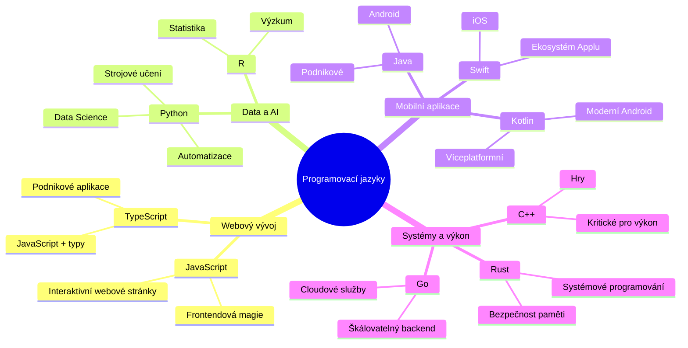
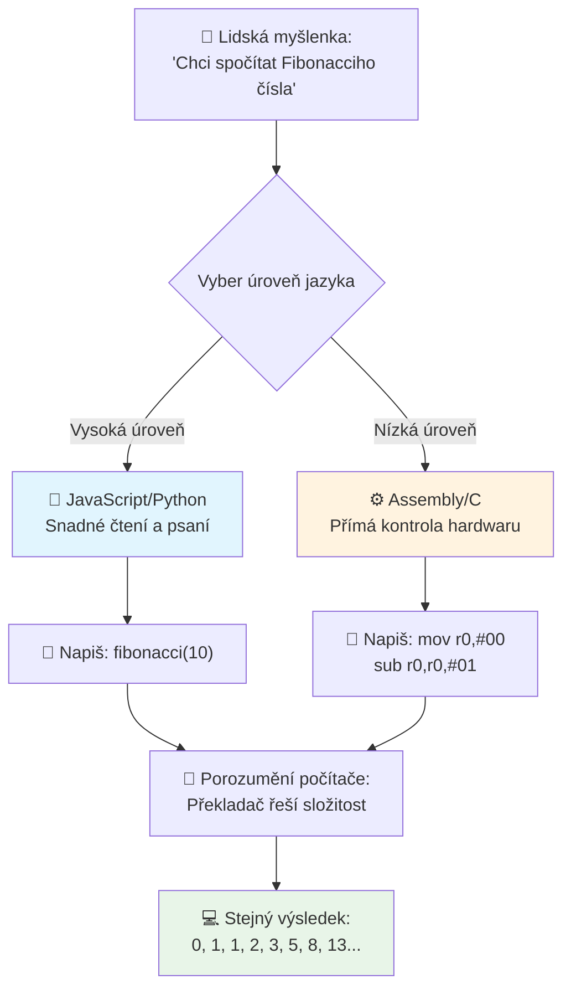
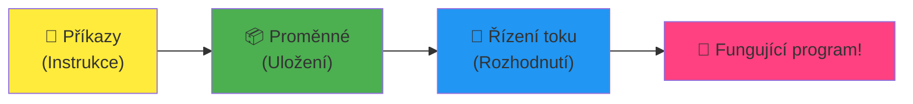
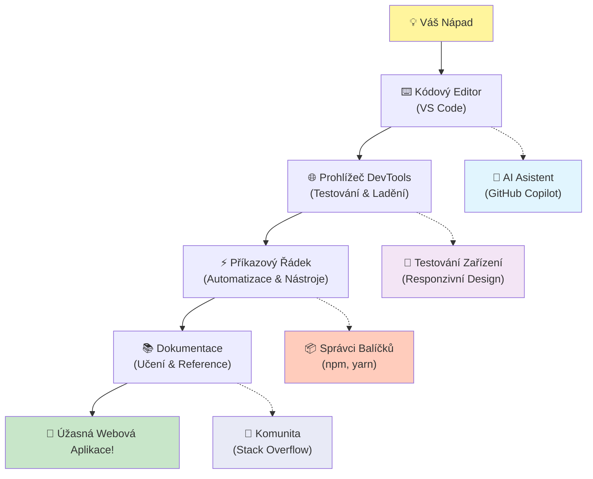
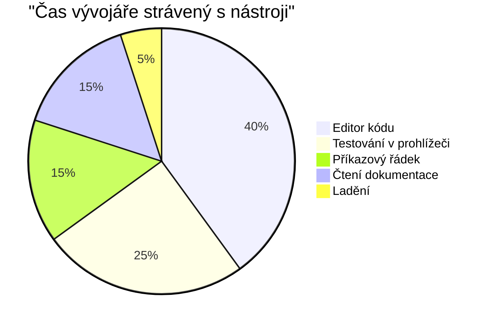
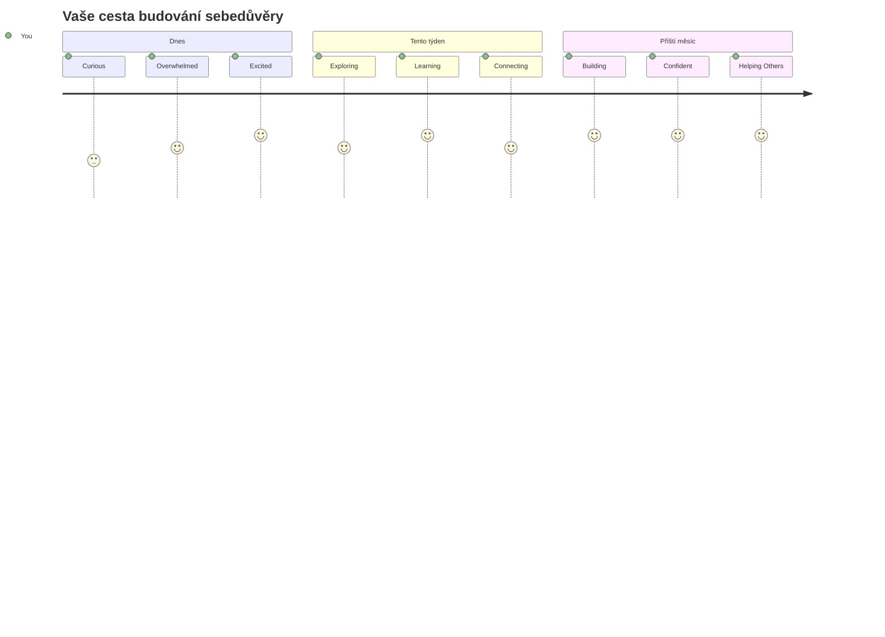

# Úvod do programovacích jazyků a moderních vývojářských nástrojů
 
Ahoj, budoucí vývojáři! 👋 Můžu ti říct něco, co mi dodnes dává husí kůži každý den? Připravuješ se na odhalení, že programování není jen o počítačích – je to o skutečných superhrdinských schopnostech, které ti pomohou uskutečnit ty nejdivočejší nápady!

Znáš ten okamžik, kdy používáš svou oblíbenou aplikaci a všechno najednou perfektně sedí? Když klikneš na tlačítko a stane se něco naprosto magického, co tě donutí říct „wow, jak to udělali?“ No, někdo úplně jako ty – pravděpodobně sedící ve své oblíbené kavárně ve 2 ráno s třetí espressem – napsal kód, který tu magii vytvořil. A teď přijde to, co ti převrátí svět: na konci této lekce nejen že pochopíš, jak to udělali, ale budeš chtít to sám vyzkoušet!

Podívej, naprosto chápu, jestli se ti programování teď zdá zastrašující. Když jsem začínal, myslel jsem si upřímně, že musíš být nějaký génius matematiky nebo programovat už od pěti let. Ale co mi úplně změnilo pohled: programování je přesně jako učení se konverzovat v novém jazyce. Začneš „ahoj“ a „děkuju,“ pak si objednáš kafe a než se naděješ, vedeš hluboké filozofické debaty! Akorát v tomto případě mluvíš s počítači, a věř mi? Jsou to ti nejtrpělivější společníci – nikdy tě nesoudí za chyby a jsou vždy rádi, že to můžeš zkusit znovu!

Dnes se podíváme na úžasné nástroje, které dělají moderní webový vývoj nejen možným, ale opravdu návykovým. Mluvím o těch samých editorech, prohlížečích a pracovních postupech, které vývojáři v Netflixu, Spotify nebo tvém oblíbeném indie studiu používají každý den. A teď ta část, kvůli které si zatancuješ radostní tanec: většina těchto profesionálních, průmyslových standardních nástrojů je úplně zdarma!


> Sketchnote od [Tomomi Imura](https://twitter.com/girlie_mac)


```mermaid
journey
    title Vaše dnešní programovací cesta
    section Objevte
      Co je programování: 5: You
      Programovací jazyky: 4: You
      Přehled nástrojů: 5: You
    section Prozkoumejte
      Kódovací editory: 4: You
      Prohlížeče a nástroje pro vývojáře: 5: You
      Příkazový řádek: 3: You
    section Procvičujte
      Detektiv jazyků: 4: You
      Průzkum nástrojů: 5: You
      Spojení s komunitou: 5: You
```
## Podívejme se, co už umíš!

Než se pustíme do zábavy, jsem zvědavý – co už o programování víš? A poslouchej, jestli na tyhle otázky koukáš a myslíš si „fakt o tom nic nevím,“ to je nejen v pořádku, ale skvělé! Znamená to, že jsi přesně tam, kde máš být. Považuj tenhle kvíz za rozcvičku před tréninkem – jen rozehříváme mozek!

[Vyzkoušej předběžný kvíz](https://ff-quizzes.netlify.app/web/)


## Dobrodružství, na které se spolu vydáme

Dobře, fakt jsem nadšený z toho, co dnes budeme zkoumat! Opravdu, rád bych viděl tvůj výraz, až ti některé z těchto konceptů budou dávat smysl. Tady je neuvěřitelná cesta, na kterou se spolu vydáme:

- **Co vlastně programování je (a proč je to nejúžasnější věc na světě!)** – Objevíme, jak je kód doslova neviditelnou magií pohánějící vše kolem tebe, od budíku, který nějak ví, že je pondělí ráno, až po algoritmus, který perfektně vybírá doporučení na Netflixu
- **Programovací jazyky a jejich úžasné osobnosti** – Představ si párty, kde každý má úplně jiné super-schopnosti a způsoby řešení problémů. Takový je svět programovacích jazyků a ty je budeš milovat!
- **Základní stavební kameny digitální magie** – Považuj je za ultimátní kreativní LEGO set. Jakmile pochopíš, jak tyto části fungují dohromady, uvědomíš si, že můžeš postavit cokoliv, co si jen představíš
- **Profesionální nástroje, které ti dají pocit, že držíš kouzelnickou hůlku** – Nezveličuji – tyto nástroje ti fakt dají pocit superhrdiny a nejlepší na tom je? Používají je úplně ti samí profíci!

> 💡 **Tip**: Nezkoušej si dnes všechno pamatovat! Teď chci, abys cítil to nadšení z možností, které to přináší. Podrobnosti se ti přirozeně usadí, když si to spolu vyzkoušíme – takhle se skutečně učíme!

> Tuto lekci najdeš také na [Microsoft Learn](https://learn.microsoft.com/en-us/learn/modules/web-development-101/introduction-programming/?WT.mc_id=academic-77807-sagibbon)!

## Co přesně *je* programování?

Dobře, pojďme se vrhnout na otázku za milion dolarů: co vlastně programování je?

Dám ti příběh, který mi úplně změnil pohled na věc. Minulý týden jsem se snažil vysvětlit mámě, jak používat náš nový chytrý dálkový ovladač. Přistihl jsem se, jak říkám věci jako „Stiskni červené tlačítko, ale ne to velké červené, to malé vlevo... ne, tvá druhá levá... dobře, a teď to drž dvě vteřiny, ne jednu, ne tři...“ Zní to povědomě? 😅

To je programování! Je to umění dávat velmi detailní a přesné pokyny něčemu, co je velmi silné, ale potřebuje všechno dokonale vysvětlit. Akorát místo toho, že to vysvětluješ mamce (která se může zeptat „které červené tlačítko?!“), to vysvětluješ počítači (který přesně dělá to, co mu řekneš, i když jsi to myslel jinak).

Co mě úplně ohromilo na začátku: počítače jsou ve své podstatě poměrně jednoduché. Rozumějí jen dvěma věcem – 1 a 0, což je vlastně „ano“ a „ne“ nebo „zapnuto“ a „vypnuto“. To je vše! Ale tady začíná ta magie – nemusíme mluvit v 1 a 0 jako v Matrixu. Přicházejí na pomoc **programovací jazyky**. Jsou jako nejlepší překladatel na světě, který vezme tvoje běžné lidské myšlenky a převede je do počítačového jazyka.

A to, co mi stále dává husí kůži každé ráno, když se probudím: úplně *všechno* digitální ve tvém životě začalo někým úplně jako ty, pravděpodobně v pyžamu s šálkem kávy, jak píše kód na svém laptopu. Ten Instagram filtr, který tě dělá dokonalým? Někdo to zakódoval. Doporučení, které tě přivedlo k tvé nové oblíbené písni? Vývojář vytvořil ten algoritmus. Aplikace, která pomáhá rozdělit účet za večeři s přáteli? Jo, někdo si řekl „tohle otravuje, asi to opravím“ a pak... to udělal!

Když se naučíš programovat, neosvojuješ si jen novou dovednost – stáváš se součástí úžasné komunity řešitelů problémů, kteří tráví dny přemýšlením: „Co kdybych mohl vytvořit něco, co někomu vylepší den jen o kousek?“ Upřímně, existuje něco lepšího?

✅ **Hledání zajímavosti**: Tady je super věc, kterou si můžeš vyhledat, až budeš mít chvilku – kdo podle tebe byl první počítačový programátor na světě? Dám ti nápovědu: možná to není ten, koho čekáš! Příběh této osoby je fascinující a ukazuje, že programování vždy bylo o kreativním řešení problémů a nepřemýšlení v zaběhnutých kolejích.

### 🧠 **Čas na kontrolu: Jak se cítíš?**

**Chvilku se zamysli:**
- Dává ti teď smysl představa „dávání pokynů počítačům“?
- Dokážeš si představit každodenní úkol, který bys chtěl automatizovat pomocí programování?
- Jaké otázky se ti honí hlavou ohledně celého toho programování?

> **Pamatuj**: Je zcela normální, že některé koncepty jsou teď trochu nejasné. Učit se programovat je jako naučit se nový jazyk – mozek potřebuje čas na vybudování těch neuronových spojení. Děláš to skvěle!

## Programovací jazyky jsou jako různé příchutě magie

Dobře, bude to znít divně, ale drž se mě – programovací jazyky jsou hodně jako různé druhy hudby. Představ si: jazz, který je hladký a improvizační, rock, který je silný a přímočarý, klasická hudba elegantní a strukturovaná a hip-hop kreativní a expresivní. Každý styl má svoji atmosféru, svoji komunitu vášnivých fanoušků a každý je perfektní pro jiné nálady a příležitosti.

Programovací jazyky fungují úplně stejně! Nepoužil bys stejný jazyk pro tvorbu zábavné mobilní hry jako na zpracování obrovského množství klimatických dat, stejně jako bys nehrál death metal na hodině jógy (no, většinou ne! 😄).

Ale co mi pokaždé vyrazí dech: tyto jazyky jsou jako mít vedle sebe toho nejtrpělivějšího, brilantního tlumočníka na světě. Můžeš vyjádřit své nápady způsobem, který je přirozený tvému lidskému mozku, a on uloží všechnu tu neuvěřitelně složitou práci překladu do 1 a 0, které počítače skutečně rozumí. Je to jako mít přítele, který plynule mluví oběma jazyky „lidská kreativita“ i „počítačová logika“ – nikdy se neunaví, nepotřebuje kávové pauzy a nikdy tě nesoudí, když se zeptáš na totéž dvakrát!

### Populární programovací jazyky a jejich použití


```mermaid
mindmap
  root((Programovací jazyky))
    Webový vývoj
      JavaScript
        Frontendová magie
        Interaktivní webové stránky
      TypeScript
        JavaScript + typy
        Podnikové aplikace
    Data a AI
      Python
        Data Science
        Strojové učení
        Automatizace
      R
        Statistika
        Výzkum
    Mobilní aplikace
      Java
        Android
        Podnikové
      Swift
        iOS
        Ekosystém Applu
      Kotlin
        Moderní Android
        Víceplatformní
    Systémy a výkon
      C++
        Hry
        Kritické pro výkon
      Rust
        Bezpečnost paměti
        Systémové programování
      Go
        Cloudové služby
        Škálovatelný backend
```
| Jazyk | Vhodné pro | Proč je populární |
|----------|----------|------------------|
| **JavaScript** | Webový vývoj, uživatelská rozhraní | Běží v prohlížečích a pohání interaktivní weby |
| **Python** | Data science, automatizace, AI | Snadné čtení a učení, silné knihovny |
| **Java** | Podnikové aplikace, Android aplikace | Nezávislý na platformě, robustní pro velké systémy |
| **C#** | Windows aplikace, vývoj her | Silná podpora Microsoft ekosystému |
| **Go** | Cloudové služby, backend systémy | Rychlý, jednoduchý, navržený pro moderní výpočty |

### Jazyky vyšší a nižší úrovně

Dobře, tahle myšlenka mi fakt rozbila mozek, když jsem začínal, takže ti předám přirovnání, které mi konečně všechno vysvětlilo – a doufám, že ti pomůže taky!

Představ si, že jsi v cizí zemi, kde neumíš jazyk, a zoufale potřebuješ najít nejbližší záchod (to jsme všichni zažili, že? 😅):

- **Programování nízké úrovně** je jako umět místní dialekt tak dobře, že můžeš mluvit s babičkou prodávající ovoce u rohu, používat kulturní odkazy, místní slang a vtipy, které rozumí jen ten, kdo tam vyrostl. Super působivé a neuvěřitelně efektivní... když jsi plynulý! Ale docela zmatek, když jen hledáš záchod.

- **Programování vysoké úrovně** je jako mít toho skvělého místního kamaráda, který tě prostě chápe. Můžeš říct obyčejnou angličtinou „Opravdu potřebuji najít toaletu“ a on zařídí veškerý kulturní překlad a řekne ti to způsobem, kterému rozumí i tvůj ne-místní mozek.

V programovacích termínech:
- **Jazyky nízké úrovně** (jako Assembly nebo C) ti umožňují vykonat opravdu detaily rozhovoru s fyzickým hardwarem počítače, ale musíš myslet jako stroj, což je... no, řekněme, že je to pořádná mentální změna!
- **Jazyky vysoké úrovně** (jako JavaScript, Python nebo C#) ti dovolí myslet jako člověk, zatímco ony za scénou ovládají všechno „strojové“ řeči. Navíc mají neuvěřitelně vstřícné komunity plné lidí, kteří si pamatují, jaké to bylo být nováčkem a opravdu chtějí pomoci!

Uhodni, které ti doporučím začít? 😉 Jazyky vysoké úrovně jsou jako pomocná kolečka na kole, která vlastně nikdy nechceš sundat, protože dělají celý zážitek mnohem příjemnějším!


```mermaid
flowchart TB
    A["👤 Lidská myšlenka:<br/>'Chci spočítat Fibonacciho čísla'"] --> B{Vyber úroveň jazyka}
    
    B -->|Vysoká úroveň| C["🌟 JavaScript/Python<br/>Snadné čtení a psaní"]
    B -->|Nízká úroveň| D["⚙️ Assembly/C<br/>Přímá kontrola hardwaru"]
    
    C --> E["📝 Napiš: fibonacci(10)"]
    D --> F["📝 Napiš: mov r0,#00<br/>sub r0,r0,#01"]
    
    E --> G["🤖 Porozumění počítače:<br/>Překladač řeší složitost"]
    F --> G
    
    G --> H["💻 Stejný výsledek:<br/>0, 1, 1, 2, 3, 5, 8, 13..."]
    
    style C fill:#e1f5fe
    style D fill:#fff3e0
    style H fill:#e8f5e8
```
### Ukážu ti, proč jsou jazyky vyšší úrovně tak přátelské

Dobře, ukážu ti něco, co dokonale ilustruje, proč jsem si zamiloval jazyky vyšší úrovně, ale nejdřív mi něco slíbij. Když uvidíš první ukázku kódu, nezpanikař! Má působit zastrašujícím dojmem. To je přesně to, co chci ukázat!

Podíváme se na stejný úkol napsaný ve dvou naprosto odlišných stylech. Oba vytvoří takzvanou Fibonacciho posloupnost – je to krásný matematický vzor, kde je každé číslo součtem dvou předchozích: 0, 1, 1, 2, 3, 5, 8, 13... (Zajímavost: tento vzor najdeš doslova všude v přírodě – spirály semen slunečnice, vzory šišek, dokonce i ve formování galaxií!)

Připraven vidět rozdíl? Jdeme na to!

**Jazyk vyšší úrovně (JavaScript) – přívětivý pro člověka:**

```javascript
// Krok 1: Základní nastavení Fibonacciho posloupnosti
const fibonacciCount = 10;
let current = 0;
let next = 1;

console.log('Fibonacci sequence:');
```

**Co tenhle kód dělá:**
- **Definuje** konstantu, která určuje, kolik Fibonacciho čísel chceme vygenerovat
- **Inicializuje** dvě proměnné pro sledování aktuálního a následujícího čísla v posloupnosti
- **Nastavuje** počáteční hodnoty (0 a 1), které definují Fibonacciho vzor
- **Zobrazuje** hlavičkovou zprávu k identifikaci výstupu

```javascript
// Krok 2: Vygenerujte sekvenci pomocí smyčky
for (let i = 0; i < fibonacciCount; i++) {
  console.log(`Position ${i + 1}: ${current}`);
  
  // Vypočítejte další číslo v sekvenci
  const sum = current + next;
  current = next;
  next = sum;
}
```

**Co se tu děje podrobně:**
- **Prochází** každý index v posloupnosti pomocí cyklu `for`
- **Zobrazuje** každé číslo s jeho pozicí pomocí formátování template literálu
- **Vypočítává** další Fibonacciho číslo sečtením aktuálního a následujícího
- **Aktualizuje** sledovací proměnné pro další iteraci

```javascript
// Krok 3: Moderní funkcionální přístup
const generateFibonacci = (count) => {
  const sequence = [0, 1];
  
  for (let i = 2; i < count; i++) {
    sequence[i] = sequence[i - 1] + sequence[i - 2];
  }
  
  return sequence;
};

// Příklad použití
const fibSequence = generateFibonacci(10);
console.log(fibSequence);
```

**Výše jsme:**
- **Vytvořili** znovu použitelnou funkci pomocí moderní syntaxe arrow function
- **Postavili** pole, které uchovává celou posloupnost místo postupného zobrazování
- **Použili** indexování pole pro výpočet nového čísla z předchozích hodnot
- **Vrátili** celou posloupnost pro flexibilní použití v programu

**Jazyk nižší úrovně (ARM Assembly) – přívětivý pro počítač:**

```assembly
 area ascen,code,readonly
 entry
 code32
 adr r0,thumb+1
 bx r0
 code16
thumb
 mov r0,#00
 sub r0,r0,#01
 mov r1,#01
 mov r4,#10
 ldr r2,=0x40000000
back add r0,r1
 str r0,[r2]
 add r2,#04
 mov r3,r0
 mov r0,r1
 mov r1,r3
 sub r4,#01
 cmp r4,#00
 bne back
 end
```

Všimni si, jak verze v JavaScriptu čte téměř jako instrukce v angličtině, zatímco verze v Assembly používá kryptické příkazy, které přímo ovládají procesor počítače. Obě verze splní stejný úkol, ale jazyk vyšší úrovně je mnohem snazší na pochopení, psaní a údržbu pro lidi.

**Klíčové rozdíly, které si všimneš:**
- **Čitelnost**: JavaScript používá popisné názvy jako `fibonacciCount`, zatímco Assembly používá kryptické štítky jako `r0`, `r1`
- **Komentáře**: Vyšší programovací jazyky podporují vysvětlující komentáře, které činí kód samodokumentujícím
- **Struktura**: Logický tok JavaScriptu odpovídá tomu, jak lidé krok za krokem uvažují o problémech
- **Údržba**: Aktualizace verze JavaScriptu pro různé požadavky je jednoduchá a jasná

✅ **O Fibonacciho posloupnosti**: Tento naprosto nádherný číselný vzor (kde každé číslo je součtem dvou předešlých: 0, 1, 1, 2, 3, 5, 8...) se objevuje doslova *všude* v přírodě! Najdete ho ve spirálách slunečnic, vzorech šišek, v zakřivení mušlí nautilů a dokonce i na tom, jak rostou větve stromů. Je to opravdu ohromující, jak nám matematika a kód mohou pomoci pochopit a znovu vytvořit vzory, které příroda používá k tvorbě krásy!


## Stavební kameny, které vytvářejí kouzlo

Dobře, teď když už jste viděli, jak programovací jazyky vypadají v praxi, pojďme rozebrat základní části, které tvoří doslova každý napsaný program. Představte si je jako základní ingredience vašeho oblíbeného receptu – jakmile pochopíte, co každá dělá, budete schopni číst a psát kód téměř v libovolném jazyce!

Je to něco jako naučit se gramatiku programování. Pamatujete si, jak jste se ve škole učili o podstatných jménech, slovesech a jak skládat věty? Programování má svoji vlastní gramatiku a upřímně, je mnohem logičtější a shovívavější než anglická gramatika! 😄

### Příkazy: Krok za krokem instrukce

Začněme s **příkazy** – ty jsou jako jednotlivé věty v rozhovoru s počítačem. Každý příkaz říká počítači, aby udělal jednu konkrétní věc, něco jako dát pokyny: „Zahni tady doleva,“ „Stůj na červené,“ „Zaparkuj na tom místě.“

Co mám na příkazech rád, je jejich čitelnost. Podívejte:

```javascript
// Základní příkazy, které vykonávají jednotlivé akce
const userName = "Alex";                    
console.log("Hello, world!");              
const sum = 5 + 3;                         
```

**Tento kód dělá:**
- **Deklaruje** konstantní proměnnou pro uložení jména uživatele
- **Zobrazí** uvítací zprávu v konzoli
- **Vypočítá** a uloží výsledek matematické operace

```javascript
// Příkazy, které komunikují s webovými stránkami
document.title = "My Awesome Website";      
document.body.style.backgroundColor = "lightblue";
```

**Krok za krokem se děje toto:**
- **Upraví** název webové stránky, který se zobrazuje v záložce prohlížeče
- **Změní** barvu pozadí celého těla stránky

### Proměnné: Paměťový systém vašeho programu

Dobře, **proměnné** jsou upřímně jeden z mých nejoblíbenějších pojmů na výuku, protože jsou velmi podobné věcem, které každý den používáte!

Přemýšlejte o seznamu kontaktů ve vašem telefonu. Neznáte všechny telefonní čísla nazpaměť – místo toho uložíte „Mámu“, „Nejlepšího kamaráda“ nebo „Pizzerii, která rozváží do 2 ráno“ a telefon si pamatuje skutečná čísla. Proměnné fungují úplně stejně! Jsou to označené kontejnery, kde může program uložit informace a později je podle názvu, který dává smysl, vyvolat.

Co je na tom nejvíc cool: proměnné se mohou během běhu programu měnit (odtud název „proměnná“ – chápete, co tím chtěli říct?). Stejně jako můžete aktualizovat kontakt na pizzerii, když objevíte ještě lepší místo, mohou být proměnné aktualizovány během toho, co se program učí nové informace nebo když se mění situace!

Ukážu vám, jak to může být krásně jednoduché:

```javascript
// Krok 1: Vytváření základních proměnných
const siteName = "Weather Dashboard";        
let currentWeather = "sunny";               
let temperature = 75;                       
let isRaining = false;                      
```

**Co je potřeba pochopit:**
- **Ukládat** neměnné hodnoty v `const` proměnných (např. název stránky)
- **Používat** `let` pro hodnoty, které se mohou měnit během programu
- **Přiřazovat** různé datové typy: řetězce (text), čísla, booleany (true/false)
- **Volit** popisné názvy, které vysvětlují, co každá proměnná obsahuje

```javascript
// Krok 2: Práce s objekty pro seskupení souvisejících dat
const weatherData = {                       
  location: "San Francisco",
  humidity: 65,
  windSpeed: 12
};
```

**V příkladu jsme:**
- **Vytvořili** objekt pro seskupení souvisejících informací o počasí
- **Uspořádali** více dat pod jedním názvem proměnné
- **Použili** páry klíč-hodnota, aby bylo jasné, co každá informace znamená

```javascript
// Krok 3: Používání a aktualizace proměnných
console.log(`${siteName}: Today is ${currentWeather} and ${temperature}°F`);
console.log(`Wind speed: ${weatherData.windSpeed} mph`);

// Aktualizace proměnných, které se mohou měnit
currentWeather = "cloudy";                  
temperature = 68;                          
```

**Pojďme si rozebrat jednotlivé části:**
- **Zobrazujeme** informace pomocí šablonových literálů se syntaxí `${}`
- **Přistupujeme** k vlastnostem objektu pomocí tečkové notace (`weatherData.windSpeed`)
- **Aktualizujeme** proměnné deklarované s `let` tak, aby odrážely měnící se podmínky
- **Kombinujeme** více proměnných pro vytvoření smysluplných zpráv

```javascript
// Krok 4: Moderní destrukturalizace pro čistší kód
const { location, humidity } = weatherData; 
console.log(`${location} humidity: ${humidity}%`);
```

**Co je dobré vědět:**
- **Vytahovat** specifické vlastnosti z objektů pomocí destrukturalizace
- **Vytvářet** nové proměnné automaticky se stejnými názvy jako klíče objektu
- **Zjednodušovat** kód vyhnutím se opakované tečkové notaci

### Řízení toku: Učit váš program přemýšlet

Dobře, teď to je místo, kde programování začíná být naprosto ohromující! **Řízení toku** je v podstatě učit program, jak dělat chytrá rozhodnutí, přesně jako děláte vy každý den bez přemýšlení.

Představte si to takto: dnes ráno jste pravděpodobně mysleli „Jestli prší, vezmu si deštník. Je-li zima, obleču si bundu. Pokud jdu pozdě, přeskočím snídani a vezmu si kafe cestou.“ Váš mozek automaticky následuje tuto logiku pokud-pak desítkykrát za den!

To je přesně to, co dělá programy chytřejšími a živějšími, místo aby jen bezmyšlenkovitě následovaly nudný předvídatelný skript. Mohou skutečně zhodnotit situaci, posoudit, co se děje, a adekvátně reagovat. Je to jako dát programu mozek, který se dokáže přizpůsobit a činit rozhodnutí!

Chcete vidět, jak to skvěle funguje? Tady to máte:

```javascript
// Krok 1: Základní podmíněná logika
const userAge = 17;

if (userAge >= 18) {
  console.log("You can vote!");
} else {
  const yearsToWait = 18 - userAge;
  console.log(`You'll be able to vote in ${yearsToWait} year(s).`);
}
```

**Tento kód dělá:**
- **Kontroluje**, zda uživatel dosáhl věku potřebného pro hlasování
- **Spustí** různé bloky kódu podle výsledku podmínky
- **Vypočítá** a zobrazí, jak dlouho ještě do dosažení způsobilosti
- **Dá** konkrétní, užitečnou zpětnou vazbu pro každý scénář

```javascript
// Krok 2: Více podmínek s logickými operátory
const userAge = 17;
const hasPermission = true;

if (userAge >= 18 && hasPermission) {
  console.log("Access granted: You can enter the venue.");
} else if (userAge >= 16) {
  console.log("You need parent permission to enter.");
} else {
  console.log("Sorry, you must be at least 16 years old.");
}
```

**Co se tady děje:**
- **Spojuje** více podmínek pomocí operátoru `&&` (a)
- **Vytváří** hierarchii podmínek pomocí `else if` pro různé případy
- **Obsluhuje** všechny možné případy pomocí finálního `else`
- **Poskytuje** jasnou, použivatelsky přívětivou zpětnou vazbu v každé situaci

```javascript
// Krok 3: Stručná podmínka s ternárním operátorem
const votingStatus = userAge >= 18 ? "Can vote" : "Cannot vote yet";
console.log(`Status: ${votingStatus}`);
```

**Pamatujte si:**
- **Používá** ternární operátor (`? :`) pro jednoduché dvoumožnosti
- **Píše** podmínku nejdřív, pak `?`, pak výsledek pravdy, následovaný `:`, pak výsledek nepravdy
- **Používá** tento vzor, když potřebujete přiřazovat hodnoty na základě podmínek

```javascript
// Krok 4: Zpracování více specifických případů
const dayOfWeek = "Tuesday";

switch (dayOfWeek) {
  case "Monday":
  case "Tuesday":
  case "Wednesday":
  case "Thursday":
  case "Friday":
    console.log("It's a weekday - time to work!");
    break;
  case "Saturday":
  case "Sunday":
    console.log("It's the weekend - time to relax!");
    break;
  default:
    console.log("Invalid day of the week");
}
```

**Tento kód udělá toto:**
- **Porovná** hodnotu proměnné s několika specifickými případy
- **Seskupí** podobné případy dohromady (pracovní dny vs. víkendy)
- **Spustí** příslušný blok kódu, když najde shodu
- **Zahrne** `default` případ pro neočekávané hodnoty
- **Použije** příkazy `break` aby zabránil pokračování do dalšího případu

> 💡 **Analogicky ze života**: Řízení toku si představte jako nejtrpělivější GPS na světě, která vám dává instrukce. Může říct „Pokud je na Hlavní ulici zácpa, jeď raději po dálnici. Když je dálnice uzavřená kvůli opravám, zkus jet okružní cestou.“ Programy používají úplně stejnou podmíněnou logiku, aby chytře reagovaly na různé situace a vždy poskytly uživatelům ten nejlepší zážitek.

### 🎯 **Kontrola znalostí: Ovládnutí základů**

**Pojďme zjistit, jak na tom jste se základy:**
- Dokážete vlastními slovy vysvětlit rozdíl mezi proměnnou a příkazem?
- Vymyslete skutečný příklad, kdy použijete rozhodnutí pokud-pak (jako náš příklad s hlasováním)
- Co vás na logice programování nejvíce překvapilo?

**Rychlý posilovač sebedůvěry:**

```mermaid
flowchart LR
    A["📝 Příkazy<br/>(Instrukce)"] --> B["📦 Proměnné<br/>(Uložení)"] --> C["🔀 Řízení toku<br/>(Rozhodnutí)"] --> D["🎉 Fungující program!"]
    
    style A fill:#ffeb3b
    style B fill:#4caf50
    style C fill:#2196f3
    style D fill:#ff4081
```
✅ **Co bude dál**: Čeká nás naprosto úžasné dobrodružství, kde se do těchto pojmů ponoříme ještě hlouběji! Teď se jen soustřeďte na to vzrušení z nekonečných možností před vámi. Konkrétní dovednosti a techniky si osvojíte přirozeně, když budeme společně cvičit – slibuji, že to bude mnohem zábavnější, než jste možná čekali!

## Nástroje řemesla

Dobře, tady už se opravdu nemohu ubránit nadšení! 🚀 Začneme mluvit o úžasných nástrojích, které vám dají pocit, jako byste právě dostali klíče od digitálního vesmírného plavidla.

Víte, jak má kuchař ty perfektně vyvážené nože, které jsou prodloužením jeho rukou? Nebo jak má muzikant tu jednu kytaru, která skoro zpívá od okamžiku, kdy se jí dotkne? No, vývojáři mají svou vlastní verzi těchto magických nástrojů a tady je něco, co vám úplně vyrazí dech – většina z nich je naprosto zdarma!

Doslova se nemohu v práci udržet na židli, když vám to chci ukázat, protože tyto nástroje zcela změnily způsob, jakým tvoříme software. Mluvíme tady o asistentech kódování poháněných AI, kteří vám pomáhají psát kód (to fakt nemám na háku!), cloudových prostředích, kde můžete stavět celou aplikaci doslova odkudkoliv s Wi-Fi, a ladicích nástrojích tak propracovaných, že to je jako mít rentgenové vidění vašeho programu.

A teď to, co mi dodnes zimnici dělá: nejsou to žádné „začátečnické nástroje“, které přerostete. Jsou to přesně ty samé profesionální nástroje, které právě teď používají vývojáři ve firmách jako Google, Netflix a v tom indie studiu aplikací, co máte rádi. Budete mít pocit, že jste opravdový profík!


```mermaid
graph TD
    A["💡 Váš Nápad"] --> B["⌨️ Kódový Editor<br/>(VS Code)"] 
    B --> C["🌐 Prohlížeč DevTools<br/>(Testování & Ladění)"]
    C --> D["⚡ Příkazový Řádek<br/>(Automatizace & Nástroje)"]
    D --> E["📚 Dokumentace<br/>(Učení & Reference)"]
    E --> F["🚀 Úžasná Webová Aplikace!"]
    
    B -.-> G["🤖 AI Asistent<br/>(GitHub Copilot)"]
    C -.-> H["📱 Testování Zařízení<br/>(Responzivní Design)"]
    D -.-> I["📦 Správci Balíčků<br/>(npm, yarn)"]
    E -.-> J["👥 Komunita<br/>(Stack Overflow)"]
    
    style A fill:#fff59d
    style F fill:#c8e6c9
    style G fill:#e1f5fe
    style H fill:#f3e5f5
    style I fill:#ffccbc
    style J fill:#e8eaf6
```
### Editory kódu a IDE: Vaši noví digitální nejlepší přátelé

Pojďme mluvit o editorech kódu – ty se vám brzy stanou oblíbeným místem k pobývání! Představte si je jako svůj osobní kódovací azyl, kde strávíte většinu času tvořením a vylepšováním digitálních výtvorů.

A teď to magické u moderních editorů: nejsou to jen běžné textové editory. Jsou to jako mít po boku nejbystřejšího a nejpodporujícího mentora programování nonstop. Zachytí vaše překlepy dřív, než si jich všimnete, navrhují vylepšení, díky kterým vypadáte jako génius, pomáhají pochopit, co každý kus kódu dělá, a někteří dokonce předvídají, co se chystáte napsat a nabídnou vám dokončení myšlenky!

Pamatuji si, když jsem poprvé objevil automatické dokončování – připadalo mi, jako bych žil v budoucnosti. Začnete něco psát a editor vám řekne: „Hele, nechtěl jsi použít tuto funkci, která dělá přesně to, co potřebuješ?“ Je to jako mít čtecův mysl za kamaráda na kódování!

**Proč jsou tyto editory tak neuvěřitelné?**

Moderní editory nabízejí působivou škálu funkcí navržených pro zvýšení produktivity:

| Funkce | Co dělá | Proč pomáhá |
|---------|--------------|--------------|
| **Zvýraznění syntaxe** | Barevně odlišuje části kódu | Usnadňuje čtení kódu a hledání chyb |
| **Automatické dokončování** | Nabízí kód při psaní | Zrychluje psaní a snižuje překlepy |
| **Nástroje pro ladění** | Pomáhá najít a opravit chyby | Šetří hodiny času při hledání chyb |
| **Rozšíření** | Přidávají specializované funkce | Přizpůsobíte editor pro libovolné technologie |
| **AI asistenti** | Navrhují kód a vysvětlení | Urychlují učení a produktivitu |

> 🎥 **Video zdroj**: Chcete vidět tyto nástroje v akci? Podívejte se na toto [video Nástroje řemesla](https://youtube.com/watch?v=69WJeXGBdxg) pro komplexní přehled.

#### Doporučené editory pro webový vývoj

**[Visual Studio Code](https://code.visualstudio.com/?WT.mc_id=academic-77807-sagibbon)** (zdarma)
- Nejoblíbenější mezi webovými vývojáři
- Skvělý ekosystém rozšíření
- Integrovaný terminál a podpora Git
- **Must-have rozšíření**:
  - [GitHub Copilot](https://marketplace.visualstudio.com/items?itemName=GitHub.copilot) - AI navrhuje kód
  - [Live Share](https://marketplace.visualstudio.com/items?itemName=MS-vsliveshare.vsliveshare) - Spolupráce v reálném čase
  - [Prettier](https://marketplace.visualstudio.com/items?itemName=esbenp.prettier-vscode) - Automatické formátování kódu
  - [Code Spell Checker](https://marketplace.visualstudio.com/items?itemName=streetsidesoftware.code-spell-checker) - Opravuje překlepy v kódu

**[JetBrains WebStorm](https://www.jetbrains.com/webstorm/)** (placený, zdarma pro studenty)
- Pokročilé nástroje pro ladění a testování
- Inteligentní dokončování kódu
- Integrovaná správa verzí

**Cloudová IDE** (různé ceny)
- [GitHub Codespaces](https://github.com/features/codespaces) - Plné VS Code v prohlížeči
- [Replit](https://replit.com/) - Skvělé pro učení a sdílení kódu
- [StackBlitz](https://stackblitz.com/) - Okamžitý vývoj full-stack webu

> 💡 **Tip na začátek**: Začněte s Visual Studio Code – je zdarma, široce používaný v oboru a má obrovskou komunitu tvořící užitečné návody a rozšíření.


### Webové prohlížeče: Vaše tajná vývojářská laboratoř

Dobře, připravte se, že vám doslova spadne čelist! Víte, jak jste používali prohlížeče k brouzdání sociálních sítí a sledování videí? Ukazuje se, že celý ten čas skrývají neuvěřitelnou tajnou laboratoř pro vývojáře, jen čekající na to, až ji objevíte!

Pokaždé, když kliknete pravým tlačítkem na webovou stránku a vyberete „Prozkoumat prvek“, otevíráte skrytý svět nástrojů pro vývojáře, které jsou upřímně mocnější než některé drahé softwary, za které jsem kdysi platil stovky dolarů. Je to jako objevit, že vaše obyčejná kuchyně skrývá profesionální kuchařskou laboratoř za tajnou stěnou!
Poprvé, když mi někdo ukázal DevTools v prohlížeči, strávil jsem asi tři hodiny jenom klikáním a říkáním „POČKEJ, TO TO UMÍ TŘEBA I TO?!” Doslova můžeš upravovat jakoukoli webovou stránku v reálném čase, přesně vidět, jak rychle se všechno načítá, testovat, jak tvůj web vypadá na různých zařízeních, a dokonce ladit JavaScript jako úplný profík. Je to naprosto ohromující!

**Tady je důvod, proč jsou prohlížeče tvou tajnou zbraní:**

Když vytváříš web nebo webovou aplikaci, potřebuješ vidět, jak vypadá a chová se v reálném světě. Prohlížeče nejenže zobrazují tvou práci, ale také poskytují podrobné informace o výkonu, přístupnosti a možných problémech.

#### Nástroje pro vývojáře v prohlížeči (DevTools)

Moderní prohlížeče obsahují komplexní vývojářské sady:

| Kategorie nástroje | Co dělá | Příklad použití |
|---------------|--------------|------------------|
| **Inspektor prvků** | Prohlížení a úprava HTML/CSS v reálném čase | Úprava stylů pro okamžité výsledky |
| **Konzole** | Zobrazení chybových hlášení a testování JavaScriptu | Ladění problémů a experimentování s kódem |
| **Monitorování sítě** | Sledování, jak se načítají zdroje | Optimalizace výkonu a doby načítání |
| **Kontrola přístupnosti** | Testování inkluzivního designu | Zajištění, že váš web funguje pro všechny uživatele |
| **Simulátor zařízení** | Náhled na různých velikostech obrazovky | Testování responzivního designu bez potřeby více zařízení |

#### Doporučené prohlížeče pro vývoj

- **[Chrome](https://developers.google.com/web/tools/chrome-devtools/)** – Průmyslový standard DevTools s rozsáhlou dokumentací
- **[Firefox](https://developer.mozilla.org/docs/Tools)** – Skvělé nástroje pro CSS Grid a přístupnost
- **[Edge](https://docs.microsoft.com/microsoft-edge/devtools-guide-chromium/?WT.mc_id=academic-77807-sagibbon)** – Postavený na Chromium s vývojářskými zdroji Microsoftu

> ⚠️ **Důležitá testovací rada**: Vždy testujte své weby v několika prohlížečích! To, co perfektně funguje v Chromu, může vypadat jinak v Safari nebo Firefoxu. Profesionální vývojáři testují ve všech hlavních prohlížečích, aby zajistili konzistentní uživatelský zážitek.


### Nástroje příkazové řádky: Brána k supermocím vývojáře

Dobře, pojďme být teď úplně upřímní ohledně příkazové řádky, protože chci, abys to slyšel od někoho, kdo jí opravdu rozumí. Když jsem ji poprvé viděl – jen černou obrazovku s blikajícím textem – doslova jsem si říkal: „Ne, tohle fakt ne! Vypadá to jako něco z hackerovského filmu z 80. let a rozhodně na to nemám dost chytrosti!“ 😅

Ale tady je to, co bych si přál, aby mi někdo tehdy řekl, a co ti říkám teď: příkazová řádka není děsivá – je to vlastně jako přímý rozhovor s tvým počítačem. Představ si to jako rozdíl mezi objednáním jídla přes luxusní aplikaci s obrázky a menu (což je snadné a pohodlné) versus vstoupením do své oblíbené místní restaurace, kde kuchař přesně ví, co máš rád, a udělá ti něco naprosto perfektního jen tím, že mu řekneš „překvap mě něčím skvělým“.

Příkazová řádka je místo, kam chodí vývojáři cítit se jako opravdoví kouzelníci. Napíšeš pár zdánlivě magických slov (dobře, jsou to jen příkazy, ale vypadají jako kouzla!), stiskneš enter a BAM – vytvoříš celé struktury projektů, nainstaluješ výkonné nástroje z celého světa, nebo nasadíš svou aplikaci na internet, aby ji viděly miliony lidí. Jakmile ochutnáš tu moc, je to fakt návykové!

**Proč se příkazová řádka stane tvým oblíbeným nástrojem:**

Zatímco grafická rozhraní jsou skvělá pro mnoho úkolů, příkazová řádka exceluje v automatizaci, přesnosti a rychlosti. Mnoho vývojářských nástrojů funguje především přes příkazovou řádku a naučit se je efektivně používat může výrazně zvýšit tvoji produktivitu.

```bash
# Krok 1: Vytvořte a přejděte do adresáře projektu
mkdir my-awesome-website
cd my-awesome-website
```

**Tento kód dělá následující:**
- **Vytvoří** novou složku s názvem „my-awesome-website“ pro tvůj projekt
- **Přejde** do nově vytvořené složky, abys mohl začít pracovat

```bash
# Krok 2: Inicializujte projekt s package.json
npm init -y

# Nainstalujte moderní nástroje pro vývoj
npm install --save-dev vite prettier eslint
npm install --save-dev @eslint/js
```

**Krok za krokem, co se děje:**
- **Inicializuje** nový projekt Node.js s výchozím nastavením pomocí `npm init -y`
- **Nainstaluje** Vite jako moderní nástroj pro rychlý vývoj a produkční sestavení
- **Přidá** Prettier pro automatické formátování kódu a ESLint pro kontrolu kvality kódu
- **Použije** příznak `--save-dev` k označení těchto balíčků jako závislostí pouze pro vývoj

```bash
# Krok 3: Vytvoření struktury projektu a souborů
mkdir src assets
echo '<!DOCTYPE html><html><head><title>My Site</title></head><body><h1>Hello World</h1></body></html>' > index.html

# Spuštění vývojového serveru
npx vite
```

**Výše uvedené zahrnuje:**
- **Organizaci** projektu vytvořením samostatných složek pro zdrojový kód a assety
- **Vygenerování** základního HTML souboru s řádnou strukturou dokumentu
- **Spuštění** vývojového serveru Vite pro živé načítání a nahrazování modulů za běhu

#### Základní nástroje příkazové řádky pro webový vývoj

| Nástroj | Účel | Proč ho potřebuješ |
|------|---------|-----------------|
| **[Git](https://git-scm.com/)** | Správa verzí | Sledování změn, spolupráce, zálohování práce |
| **[Node.js & npm](https://nodejs.org/)** | JavaScript runtime a správce balíčků | Spouštění JavaScriptu mimo prohlížeč, instalace moderních vývojářských nástrojů |
| **[Vite](https://vitejs.dev/)** | Nástroj pro sestavení a vývojový server | Bleskurychlý vývoj s hot module replacement |
| **[ESLint](https://eslint.org/)** | Kvalita kódu | Automatické hledání a oprava problémů v JavaScriptu |
| **[Prettier](https://prettier.io/)** | Formátování kódu | Udržuje kód konzistentně formátovaný a čitelný |

#### Platformně specifické možnosti

**Windows:**
- **[Windows Terminal](https://docs.microsoft.com/windows/terminal/?WT.mc_id=academic-77807-sagibbon)** – Moderní terminál s bohatými funkcemi
- **[PowerShell](https://docs.microsoft.com/powershell/?WT.mc_id=academic-77807-sagibbon)** 💻 – Výkonné skriptovací prostředí
- **[Command Prompt](https://learn.microsoft.com/windows-server/administration/windows-commands/windows-commands)** 💻 – Tradiční příkazová řádka Windows

**macOS:**
- **[Terminal](https://support.apple.com/guide/terminal/)** 💻 – Vestavěná terminálová aplikace
- **[iTerm2](https://iterm2.com/)** – Vylepšený terminál s pokročilými funkcemi

**Linux:**
- **[Bash](https://www.gnu.org/software/bash/)** 💻 – Standardní linuxová shell
- **[KDE Konsole](https://docs.kde.org/trunk5/en/konsole/konsole/index.html)** – Pokročilý emulátor terminálu

> 💻 = Předinstalováno v operačním systému

> 🎯 **Výuková cesta**: Začni se základními příkazy jako `cd` (změna adresáře), `ls` nebo `dir` (výpis souborů) a `mkdir` (vytvoření složky). Procvičuj moderní příkazy pracovního postupu, jako jsou `npm install`, `git status` a `code .` (otevře aktuální složku ve VS Code). Jakmile se s nimi osmělíš, přirozeně se naučíš i pokročilejší příkazy a automatizační techniky.


### Dokumentace: Tvůj vždy dostupný učitelský mentor

Dobře, podělím se o jedno malé tajemství, které ti rozhodně zlepší pocit z toho, že jsi začátečník: i ti nejzkušenější vývojáři tráví velkou část svého času čtením dokumentace. A to není proto, že by nevěděli, co dělají – je to vlastně známka moudrosti!

Představ si dokumentaci jako přístup ke světu nejtrpělivějších a nejznalejších učitelů, kteří jsou k dispozici 24/7. Máš problém ve dvě ráno? Dokumentace je tu s virtuálním teplým objetím a přesně tou odpovědí, kterou potřebuješ. Chceš se naučit nějakou novou super funkci, o které všichni mluví? Dokumentace tě podpoří s krok za krokem příklady. Snažíš se pochopit, proč něco funguje tak, jak to funguje? Hádej co – dokumentace to dokáže vysvětlit tak, že ti to konečně dá smysl!

Něco, co mi úplně změnilo pohled: svět webového vývoje se neuvěřitelně rychle mění a nikdo (myslím, že opravdu nikdo!) nemá všechno z hlavy. Viděl jsem senior vývojáře s více než 15 lety zkušeností, jak hledají základní syntaxi, a víš co? Není to trapné – je to chytré! Nejde o perfektní paměť; jde o to vědět, kde rychle najít spolehlivé odpovědi a jak je použít.

**Právě zde se děje skutečná magie:**

Profesionální vývojáři tráví významnou část času čtením dokumentace – ne proto, že by nevěděli, co dělají, ale protože oblast webového vývoje se vyvíjí tak rychle, že udržet krok vyžaduje neustálé učení. Skvělá dokumentace ti pomůže pochopit nejen *jak* něco použít, ale i *proč* a *kdy* to použít.

#### Základní zdroje dokumentace

**[Mozilla Developer Network (MDN)](https://developer.mozilla.org/docs/Web)**
- Zlatý standard dokumentace webových technologií
- Komplexní průvodce HTML, CSS a JavaScriptem
- Obsahuje informace o kompatibilitě prohlížečů
- Nabízí praktické příklady a interaktivní ukázky

**[Web.dev](https://web.dev)** (od Google)
- Moderní osvědčené postupy webového vývoje
- Průvodce optimalizací výkonu
- Principy přístupnosti a inkluzivního designu
- Případové studie z reálných projektů

**[Microsoft Developer Documentation](https://docs.microsoft.com/microsoft-edge/#microsoft-edge-for-developers)**
- Zdroje pro vývoj prohlížeče Edge
- Průvodce Progressive Web App
- Pohledy na multiplatformní vývoj

**[Frontend Masters Learning Paths](https://frontendmasters.com/learn/)**
- Strukturované vzdělávací kurzy
- Videokurzy od odborníků z oboru
- Praktická cvičení s kódováním

> 📚 **Studijní strategie**: Nesnaž se dokumentaci celou naučit nazpaměť – raději se nauč s ní efektivně pracovat. Přidej si oblíbené odkazy do záložek a trénuj vyhledávání konkrétních informací.

### 🔧 **Kontrola zvládnutí nástrojů: Co na tebe nejvíc zapůsobilo?**

**Zamysli se na chvíli:**
- Který nástroj tě nejvíc láká vyzkoušet jako první? (Neexistuje špatná odpověď!)
- Stále se ti příkazová řádka zdá zastrašující, nebo tě už zajímá?
- Dokážeš si představit, že bys použil DevTools v prohlížeči k nahlédnutí za oponu svých oblíbených webů?


```mermaid
pie title "Čas vývojáře strávený s nástroji"
    "Editor kódu" : 40
    "Testování v prohlížeči" : 25
    "Příkazový řádek" : 15
    "Čtení dokumentace" : 15
    "Ladění" : 5
```
> **Zajímavost**: Většina vývojářů tráví asi 40 % svého času v editoru kódu, ale všimni si, kolik času jde na testování, učení a řešení problémů. Programování není jen psaní kódu – je to tvorba zážitků!

✅ **K zamyšlení**: Tady je něco zajímavého, nad čím můžeš přemýšlet – jak myslíš, že se nástroje pro tvorbu webů (vývoj) liší od nástrojů pro návrh jejich vzhledu (design)? Je to jako rozdíl mezi architektem, který navrhuje krásný dům, a stavebním dodavatelem, který ho skutečně postaví. Oba jsou klíčoví, ale potřebují jiné nářadí! Tento pohled ti opravdu pomůže vidět větší obrázek, jak weby vznikají.

## Výzva GitHub Copilot Agenta 🚀

Použij režim Agenta k dokončení následující výzvy:

**Popis:** Prozkoumej funkce moderního editoru kódu nebo IDE a ukaž, jak může zlepšit tvůj pracovní postup jako webový vývojář.

**Zadání:** Vyber si editor kódu nebo IDE (například Visual Studio Code, WebStorm nebo cloudové IDE). Uveď tři funkce nebo rozšíření, které ti pomáhají psát, ladit nebo udržovat kód efektivněji. U každé uveď krátké vysvětlení, jak ti zlepší pracovní postup.

---

## 🚀 Výzva

**Dobře, detektive, jsi připraven na svůj první případ?**

Teď, když máš tento skvělý základ, mám pro tebe dobrodružství, které ti pomůže vidět, jak neuvěřitelně rozmanitý a fascinující svět programování skutečně je. A pozor – zatím nepůjde o psaní kódu, takže žádný stres! Představ si, že jsi detektiv programovacích jazyků na svém úplně prvním vzrušujícím případu!

**Tvoje mise, pokud se rozhodneš ji přijmout:**
1. **Staň se průzkumníkem jazyků**: Vyber tři programovací jazyky z úplně odlišných světů – třeba jeden, který staví weby, druhý, co tvoří mobilní aplikace, a třetí, co zpracovává data pro vědce. Najdi příklady téže jednoduché úlohy napsané v každém jazyce. Slibuji, že tě ohromí, jak moc se můžou lišit, přestože dělají přesně tutéž věc!

2. **Objev jejich příběhy vzniku**: Co dělá každý jazyk jedinečným? Tady je zajímavý fakt – každý programovací jazyk vznikl proto, že někdo řekl: „Víš co? Musí existovat lepší způsob, jak vyřešit tenhle konkrétní problém.“ Dokážeš zjistit, jaké to byly problémy? Některé příběhy jsou fakt fascinující!

3. **Poznej komunity**: Podívej se, jak přátelská a vášnivá je komunita každého jazyka. Některé mají miliony vývojářů, kteří sdílejí znalosti a pomáhají si navzájem, jiné jsou menší, ale neuvěřitelně soudržné a podporující. Určitě oceníš osobnosti, které tyto komunity mají!

4. **Poslouchej svůj instinkt**: Který jazyk ti teď přijde nejpřístupnější? Nezáleží na „dokonalém“ výběru – prostě naslouchej svému pocitu! Opravdu neexistuje špatná odpověď a později můžeš prozkoumat i jiné.

**Bonusová detektivní práce**: Zjisti, které významné weby nebo aplikace jsou postavené s každým jazykem. Zaručuji ti, že budeš překvapený, co pohání Instagram, Netflix nebo tu mobilní hru, kterou nemůžeš přestat hrát!

> 💡 **Pamatuj**: Nezískáváš dnes titul experta na žádný z těchto jazyků. Jen poznáváš okolí, než se rozhodneš, kde chceš „založit své působiště“. Dej si čas, bav se a nech se vést svou zvědavostí!

## Oslavme, co jsi objevil!

Děs běs, dnes jsi vstřebal tolik úžasných informací! Jsem opravdu nadšený, kolik z této úžasné cesty si zapamatoval. A pamatuj – není to zkouška, kde musíš být perfektní. Je to spíš oslava všeho toho skvělého, co ses o tomto fascinujícím světě naučil!

[Vyzkoušej kvíz po lekci](https://ff-quizzes.netlify.app/web/)

## Přehled & Samostudium

**Věnuj čas průzkumu a užij si to!**
Za dnešek jste toho zvládli hodně a to je důvod být na sebe hrdý! Teď přichází ta zábavná část – prozkoumávání témat, která probudila vaši zvědavost. Pamatujte, toto není domácí úkol – je to dobrodružství!

**Ponořte se hlouběji do toho, co vás baví:**

**Pusťte se do programovacích jazyků:**
- Navštivte oficiální webové stránky 2-3 jazyků, které vás zaujaly. Každý z nich má svou osobnost a příběh!
- Vyzkoušejte online kódovací hřiště jako [CodePen](https://codepen.io/), [JSFiddle](https://jsfiddle.net/) nebo [Replit](https://replit.com/). Nebojte se experimentovat – ničeho nepokazíte!
- Přečtěte si, jak váš oblíbený jazyk vznikl. Některé z těchto příběhů jsou fakt fascinující a pomohou vám pochopit, proč jazyky fungují tak, jak fungují.

**Zvládněte své nové nástroje:**
- Stáhněte si Visual Studio Code, pokud ho ještě nemáte – je zdarma a určitě si ho zamilujete!
- Strávte pár minut prohlížením tržiště rozšíření. Je to jako obchod s aplikacemi pro váš kódovací editor!
- Otevřete nástroje pro vývojáře ve vašem prohlížeči a jen tak si proklikejte. Nemusíte rozumět všemu – prostě si zvyknete, co tam je.

**Připojte se ke komunitě:**
- Sledujte vývojářské komunity na [Dev.to](https://dev.to/), [Stack Overflow](https://stackoverflow.com/) nebo [GitHub](https://github.com/). Programátorská komunita je nesmírně vstřícná k nováčkům!
- Podívejte se na začátečnická videa o kódování na YouTube. Je tam spousta skvělých tvůrců, kteří si pamatují, jaké to bylo začínat.
- Zvažte účast na místních setkáních nebo online komunitách. Věřte mi, programátoři rádi pomáhají nováčkům!

> 🎯 **Poslouchejte, toto si chci, abyste si zapamatovali**: Nečeká se od vás, že se přes noc stanete mistrem kódování! Teď si jen zvykáte na ten úžasný nový svět, do kterého patříte. Nechte si na to čas, užijte si cestu a pamatujte – každý programátor, kterého obdivujete, kdysi seděl přesně tam, kde jste teď vy, vzrušený a možná trochu zahlcený. To je naprosto normální a znamená to, že to děláte správně!


## Úkol

[Reading the Docs](assignment.md)

> 💡 **Malé popostrčení k vašemu úkolu**: Rád bych, kdybyste zkoumali nějaké nástroje, o kterých jsme ještě nemluvili! Přeskočte editory, prohlížeče a příkazové řádky, o kterých jsme už hovořili – existuje celý neuvěřitelný svět úžasných vývojářských nástrojů, které čekají, až je objevíte. Hledejte takové, které jsou aktivně udržované a mají živé, vstřícné komunity (ty mají obvykle nejlepší tutoriály a nejpomáhající lidi, když se zaseknete a budete potřebovat pomocnou ruku).

---

## 🚀 Váš časový plán programování

### ⚡ **Co můžete udělat během dalších 5 minut**
- [ ] Přidejte si do záložek 2-3 webové stránky programovacích jazyků, které vás zaujaly
- [ ] Stáhněte si Visual Studio Code, pokud ho ještě nemáte
- [ ] Otevřete nástroje pro vývojáře ve svém prohlížeči (F12) a proklikněte si jakoukoli stránku
- [ ] Připojte se do jedné programátorské komunity (Dev.to, Reddit r/webdev nebo Stack Overflow)

### ⏰ **Co můžete stihnout během této hodiny**
- [ ] Dokončit kvíz po lekci a zamyslet se nad odpověďmi
- [ ] Nastavit VS Code s rozšířením GitHub Copilot
- [ ] Vyzkoušet příklad „Hello World“ v 2 různých programovacích jazycích online
- [ ] Podívat se na video „Den v životě vývojáře“ na YouTube
- [ ] Zahájit své detektivní pátrání po programovacím jazyce (z výzvy)

### 📅 **Vaše týdenní dobrodružství**
- [ ] Dokončit úkol a prozkoumat 3 nové vývojářské nástroje
- [ ] Sledujte 5 vývojářů nebo programátorských účtů na sociálních sítích
- [ ] Zkuste vytvořit něco malého v CodePen nebo Replit (i jen „Hello, [Vaše Jméno]!“)
- [ ] Přečíst si jeden blogový příspěvek vývojáře o jeho cestě kódováním
- [ ] Připojit se k virtuálnímu setkání nebo shlédnout programátorský přednášku
- [ ] Začněte se učit vybraný jazyk pomocí online tutoriálů

### 🗓️ **Vaše měsíční proměna**
- [ ] Postavte svůj první malý projekt (i jednoduchá webová stránka se počítá!)
- [ ] Přispět do open-source projektu (začněte opravami dokumentace)
- [ ] Mentorovat někoho, kdo právě začíná s programováním
- [ ] Vytvořit si svůj web s portfoliem vývojáře
- [ ] Spojit se s místními vývojářskými komunitami nebo studijními skupinami
- [ ] Začít plánovat další milník ve svém vzdělávání

### 🎯 **Závěrečné zamyšlení**

**Než budete pokračovat, na chvíli si připomeňte:**
- Co vás dnes na programování nejvíce nadchlo?
- Který nástroj nebo koncept chcete prozkoumat jako první?
- Jak se cítíte ohledně zahájení této programátorské cesty?
- Jakou otázku byste chtěli právě teď položit nějakému vývojáři?


```mermaid
journey
    title Vaše cesta budování sebedůvěry
    section Dnes
      Curious: 3: You
      Overwhelmed: 4: You
      Excited: 5: You
    section Tento týden
      Exploring: 4: You
      Learning: 5: You
      Connecting: 4: You
    section Příští měsíc
      Building: 5: You
      Confident: 5: You
      Helping Others: 5: You
```
> 🌟 **Pamatujte**: Každý expert byl jednou začátečníkem. Každý zkušený vývojář se někdy cítil přesně tak jako vy právě teď – nadšený, možná trochu zahlcený a rozhodně zvědavý, co všechno je možné. Jste v úžasné společnosti a tato cesta bude neuvěřitelná. Vítejte v nádherném světě programování! 🎉

---

<!-- CO-OP TRANSLATOR DISCLAIMER START -->
**Upozornění**:  
Tento dokument byl přeložen pomocí AI překladatelské služby [Co-op Translator](https://github.com/Azure/co-op-translator). Přestože usilujeme o přesnost, mějte prosím na paměti, že automatizované překlady mohou obsahovat chyby nebo nepřesnosti. Originální dokument v jeho rodném jazyce by měl být považován za autoritativní zdroj. Pro kritické informace se doporučuje využít profesionální lidský překlad. Neschvalujeme žádnou odpovědnost za případné nedorozumění nebo nesprávné výklady vyplývající z použití tohoto překladu.
<!-- CO-OP TRANSLATOR DISCLAIMER END -->