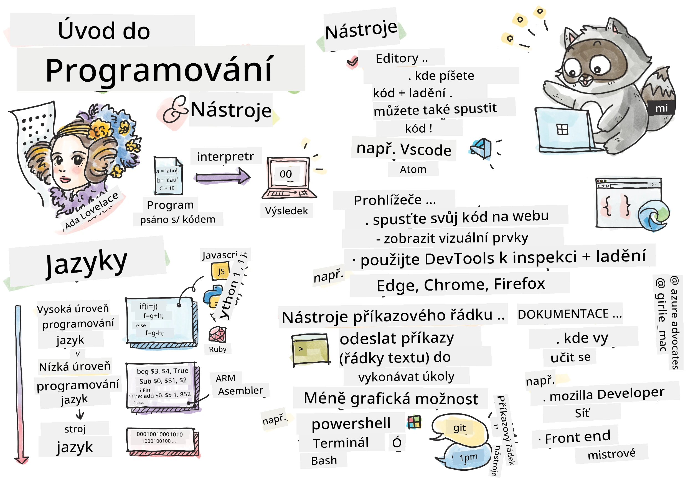
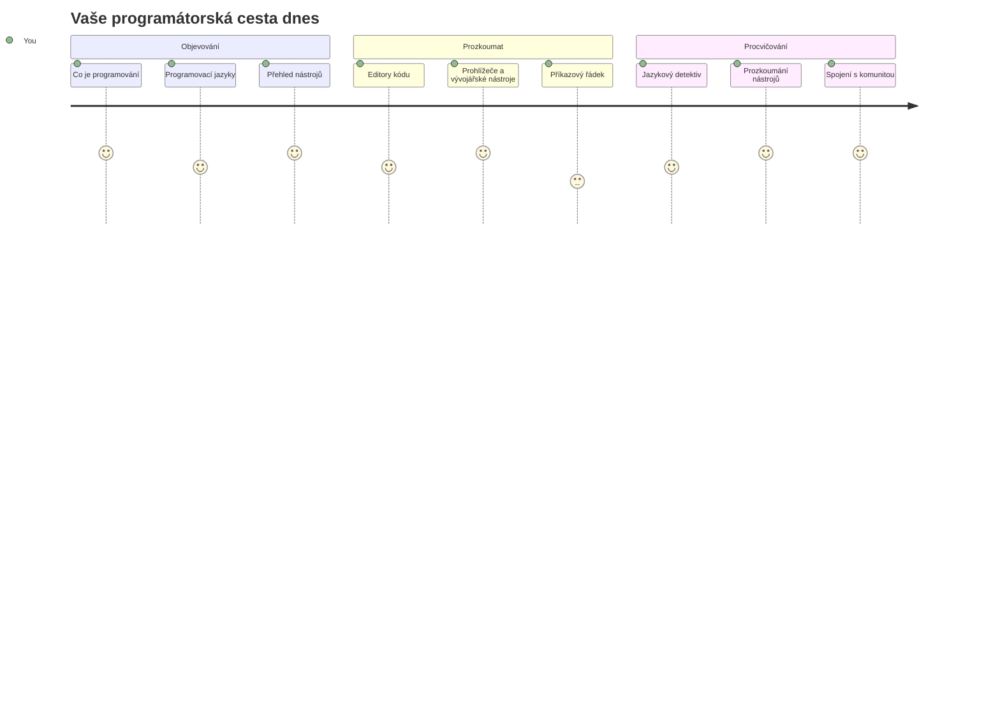
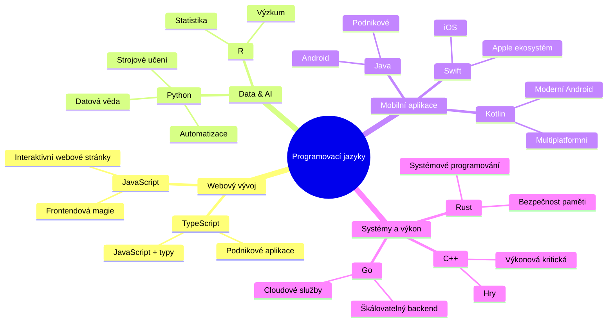
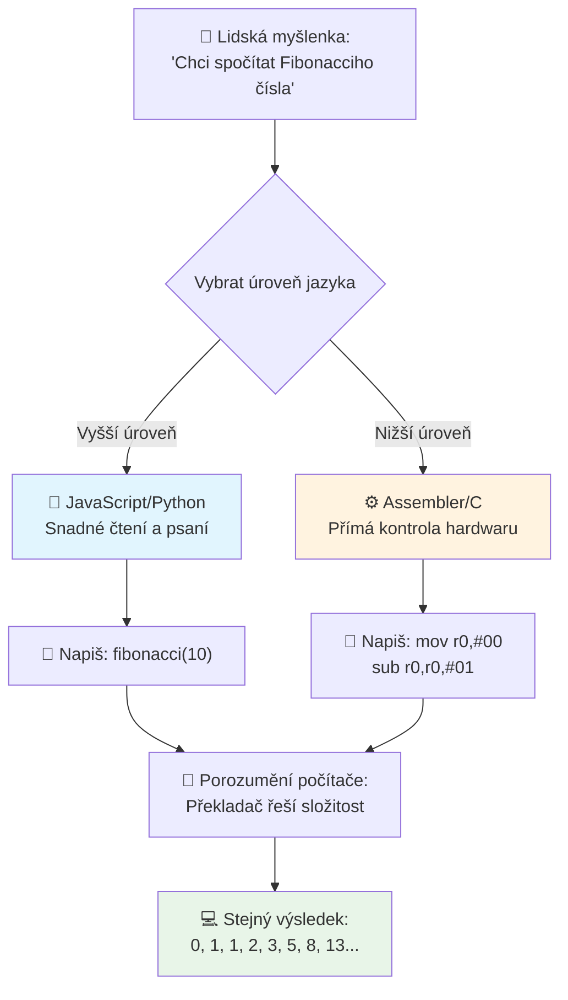
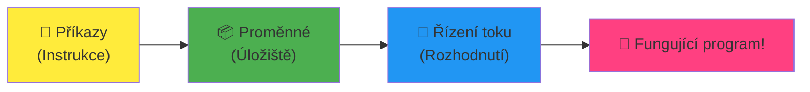
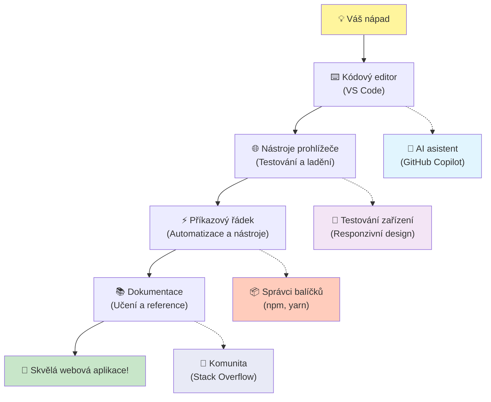
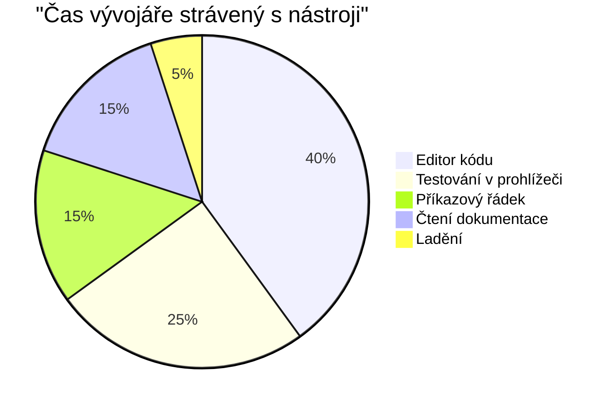
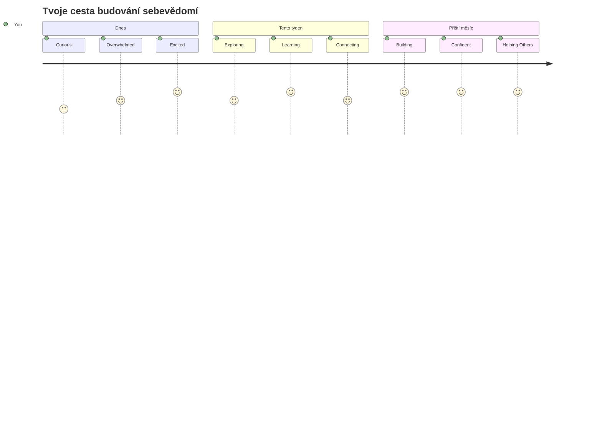

# Úvod do programovacích jazyků a moderních nástrojů pro vývojáře

Ahoj, budoucí vývojáři! 👋 Můžu ti říct něco, co mi pokaždé cestou mrazí v zádech? Právě se chystáš objevit, že programování není jen o počítačích – je to o tom mít skutečné superschopnosti přivést k životu své nejdivočejší nápady!

Znáš ten moment, kdy používáš svoji oblíbenou aplikaci a vše na sebe perfektně navazuje? Když ťukneš na tlačítko a stane se něco naprosto kouzelného, co tě nechá říct „wow, jak to udělali?“ No, někdo přesně jako ty – pravděpodobně sedí ve své oblíbené kavárně ve 2 ráno u třetího espressa – napsal kód, který to kouzlo stvořil. A teď přijde to, co ti rozum vyrazí: na konci této lekce nejen pochopíš, jak to udělali, ale už nebudeš moct dočkat, až to zkusíš sám!

Vidíš, chápu, že programování může teď působit zastrašujícím dojmem. Když jsem začínal, opravdu jsem si myslel, že musíš být nějaký matematik nebo programovat už od pěti let. Ale tohle mi úplně změnilo pohled: programování je přesně jako učení se mluvit v novém jazyce. Začínáš „ahoj“ a „děkuju“, pak se učíš objednat kávu a než se naděješ, vedeš hluboké filozofické diskuse! Jenže v tomto případě vedeš rozhovory s počítači, a upřímně? Jsou to nejtrpělivější konverzační partneři, jaké budeš mít – nikdy netrestají tvoje chyby a vždy se těší, že to zkusíš znovu!

Dnes prozkoumáme úžasné nástroje, díky kterým není moderní webový vývoj jen možný, ale taky skutečně návykový. Mluvím o přesně těch editorech, prohlížečích a pracovních postupech, které denně používají vývojáři v Netflixu, Spotify a tvém oblíbeném nezávislém app studiu. A tady je část, která tě rozesměje radostí: většina těchto profesionálních, průmyslově standardních nástrojů je úplně zdarma!


> Sketchnote od [Tomomi Imura](https://twitter.com/girlie_mac)


```mermaid
journey
    title Vaše programátorská cesta dnes
    section Objevování
      Co je programování: 5: You
      Programovací jazyky: 4: You
      Přehled nástrojů: 5: You
    section Prozkoumat
      Editory kódu: 4: You
      Prohlížeče a vývojářské nástroje: 5: You
      Příkazový řádek: 3: You
    section Procvičování
      Jazykový detektiv: 4: You
      Prozkoumání nástrojů: 5: You
      Spojení s komunitou: 5: You
```
## Podívejme se, co už víš!

Než se pustíme do zábavy, zajímá mě – co už o programování víš? A poslouchej, pokud na tyto otázky koukáš a myslíš si „nemám o tom vůbec žádnou představu,“ to není jen v pořádku, to je perfektní! To znamená, že jsi přesně tam, kde máš být. Považuj tento kvíz za rozcvičku před cvičením – jen zahříváme mozkové svaly!

[Vyplň si kvíz před lekcí](https://ff-quizzes.netlify.app/web/)


## Dobrodružství, na které se spolu vydáme

Dobře, skutečně se nemohu dočkat, co dnes prozkoumáme! Opravdu, přál bych si vidět tvůj výraz, až ti některé z těch konceptů dojdou. Tady je ta úžasná cesta, na kterou se spolu vydáme:

- **Co vlastně programování je (a proč je to ta nejvíc cool věc vůbec!)** – Objistíme si, jak je kód doslova neviditelné kouzlo pohánějící všechno kolem tebe, od budíku, který nějak ví, že je pondělí ráno, až po algoritmus, který perfektně vyladí tvoje Netflix doporučení
- **Programovací jazyky a jejich úžasné osobnosti** – Představ si, že přijdeš na párty, kde každý má úplně jiné superschopnosti a způsoby řešení problémů. Takový je svět programovacích jazyků a ty si je zamiluješ!
- **Základní stavební kameny, které dělají digitální magii** – Považuj je za ultimátní kreativní LEGO sadu. Jakmile pochopíš, jak tyto části zapadají, uvědomíš si, že můžeš doslova postavit cokoli, co si vymyslíš
- **Profesionální nástroje, které tě nechají cítit, jako bys dostal kouzelnickou hůlku** – Ne, to není přehánění – tyto nástroje tě opravdu donutí cítit se jako mág, a ta nejlepší část? Jsou to ty samé, které používají profíci!

> 💡 **Něco k zapamatování:** Nemysli si, že dnes musíš všechno naučit nazpaměť! Teď chci, aby sis jen zapálil tu jiskru vzrušení z toho, co je možné. Detaily ti budou přirozeně ulehávat do paměti při společném praktickém procvičování – takhle skutečné učení funguje!

> Tuto lekci můžeš absolvovat i na [Microsoft Learn](https://learn.microsoft.com/en-us/learn/modules/web-development-101/introduction-programming/?WT.mc_id=academic-77807-sagibbon)!

## Tak co to vlastně *je* programování?

Dobře, pojďme se podívat na otázku za milion dolarů: co je to programování, opravdu?

Dám ti příběh, který mi úplně změnil, jak o tom přemýšlím. Minulý týden jsem se snažil vysvětlit mamince, jak používat dálkový ovladač na naší nové chytré televizi. Přistihl jsem se, jak říkám věci jako „Stiskni červené tlačítko, ale ne to velké červené, malé červené vlevo... ne, tvoje druhá levá... dobrá, teď drž dvě sekundy, ne jednu, ne tři...“ Zní to povědomě? 😅

Tohle je programování! Je to umění dávat opravdu detailní, krok za krokem instrukce něčemu, co je velmi výkonné, ale potřebuje, aby všechno bylo přesně vysvětleno. Jenže místo toho, abys to vysvětloval mamince (která může říct „které červené tlačítko?!“), vysvětluješ to počítači (který prostě dělá přesně to, co mu řekneš, i když to není úplně to, co jsi myslel).

Když jsem to poprvé pochopil, úplně mi to zmátlo hlavu: počítače jsou ve své podstatě vlastně docela jednoduché. Rozumí jen dvěma věcem – 1 a 0, což je v podstatě „ano“ a „ne“ nebo „zapnuto“ a „vypnuto.“ To je všechno! Ale tady přichází kouzlo – nemusíme mluvit v 1 a 0 jako bychom byli ve filmu Matrix. Právě proto tu jsou **programovací jazyky**. Jsou jako nejlepší překladatel světa, který vezme tvoje úplně normální lidské myšlenky a převede je do počítačové řeči.

A teď přijde něco, co mi každý den ráno skutečně dává husí kůži: doslova *všechno* digitální v tvém životě začalo někým přesně jako jsi ty, pravděpodobně v pyžamu s šálkem kávy, který píše kód na svém notebooku. Ten Instagram filtr, který tě dělá dokonalým? Někdo ho naprogramoval. Doporučení, které tě dovedlo k nové oblíbené písničce? Vývojář vytvořil ten algoritmus. Aplikace, která ti pomáhá rozdělit účet za večeři s přáteli? Jo, někdo si řekl „to je otravné, tohle opravím“ a pak… taky udělal!

Když se naučíš programovat, nezískáš jen novou dovednost – stáváš se součástí úžasné komunity řešitelů problémů, kteří denně přemýšlejí: „Co kdybych mohl postavit něco, co někomu zlepší den alespoň trochu?“ Upřímně, je něco lepšího než tohle?

✅ **Zábavná fakta:** Když budeš mít chvilku, mrkni na tohle – kdo byl podle tebe první programátor na světě? Mám nápovědu: nemusí to být ten, koho očekáváš! Příběh této osoby je fascinující a ukazuje, že programování vždycky bylo o kreativním řešení problémů a myšlení mimo zaběhnuté cesty.

### 🧠 **Jak se nyní cítíš?**

**Zastav se a zamysli:**
- Dává ti teď smysl představa „dávání pokynů počítačům“?
- Napadá tě nějaký každodenní úkol, který bys chtěl pomocí programování automatizovat?
- Jaké otázky tě ohledně programování napadají?

> **Pamatuj:** Je naprosto normální, pokud ti něco teď připadá matoucí. Učení programování je jako učení nového jazyka – trvá, než si mozek vybuduje nové spojení. Děláš to skvěle!

## Programovací jazyky jsou jako různé druhy kouzel

Dobře, zní to asi divně, ale vydrž – programovací jazyky jsou hodně podobné různým hudebním žánrům. Přemýšlej: máš jazz, který je hladký a improvizační, rock, který je silný a přímý, klasiku, která je elegantní a strukturovaná, a hip-hop, který je kreativní a expresivní. Každý styl má svoji atmosféru, svoji komunitu zapálených fanoušků a každý je perfektní pro různé nálady a příležitosti.

Programovací jazyky fungují přesně stejně! Nepoužil bys stejný jazyk na vývoj zábavné mobilní hry, jaký bys použil na zpracování obrovského množství klimatických dat, stejně jako bys nehrál death metal na hodině jógy (no, většinou ne! 😄).

Ale co mi absolutně vždycky vyrazí dech: tyto jazyky jsou jako nejtrpělivější, nejbystřejší tlumočník na světě, který sedí vedle tebe. Můžeš vyjádřit své myšlenky způsobem, který je pro tvůj lidský mozek přirozený, a oni zvládnou všechno to neuvěřitelně složité přeložení do jedniček a nul, které počítače skutečně „mluví“. Je to jako mít přítele, který perfektně ovládá „lidskou kreativitu“ i „počítačovou logiku“ – a nikdy se neunaví, nikdy nepotřebuje přestávky na kafe a nikdy tě neodsoudí za to, že se ptáš dvakrát!

### Oblíbené programovací jazyky a jejich použití


```mermaid
mindmap
  root((Programovací jazyky))
    Webový vývoj
      JavaScript
        Frontendová magie
        Interaktivní webové stránky
      TypeScript
        JavaScript + typy
        Podnikové aplikace
    Data & AI
      Python
        Datová věda
        Strojové učení
        Automatizace
      R
        Statistika
        Výzkum
    Mobilní aplikace
      Java
        Android
        Podnikové
      Swift
        iOS
        Apple ekosystém
      Kotlin
        Moderní Android
        Multiplatformní
    Systémy a výkon
      C++
        Hry
        Výkonová kritická
      Rust
        Bezpečnost paměti
        Systémové programování
      Go
        Cloudové služby
        Škálovatelný backend
```
| Jazyk | Nejlepší pro | Proč je populární |
|----------|----------|------------------|
| **JavaScript** | Vývoj webu, uživatelská rozhraní | Funguje v prohlížečích a pohání interaktivní weby |
| **Python** | Data science, automatizace, AI | Snadno čitelný a učenlivý, silné knihovny |
| **Java** | Podnikové aplikace, Android aplikace | Nezávislý na platformě, robustní pro velké systémy |
| **C#** | Windows aplikace, vývoj her | Silná podpora v Microsoft ekosystému |
| **Go** | Cloudové služby, backend systémy | Rychlý, jednoduchý, navržený pro moderní výpočetní prostředí |

### Vyšší vs. nižší úroveň jazyků

Dobře, upřímně to byl koncept, který mi úplně rozbil mozek, když jsem začínal, tak ti povím analogii, která mi to konečně otevřela – doufám, že ti taky pomůže!

Představ si, že cestuješ do země, kde neumíš jazyk, a zoufale potřebuješ najít nejbližší záchod (to jsme všichni zažili, že jo? 😅):

- **Programování na nízké úrovni** je jako naučit se místní dialekt tak dobře, že můžeš mluvit s babičkou prodávající ovoce na rohu, používat kulturní odkazy, místní slang a vtipy, kterým rozumí jen místní. Super působivé a nesmírně efektivní... pokud jsi plynulý! Ale docela matoucí, když se prostě snažíš najít záchod.

- **Programování na vysoké úrovni** je jako mít úžasného místního přítele, který ti rozumí. Můžeš říct „Potřebuju opravdu najít toaletu“ jednoduše v angličtině a on překládá všechny kulturní nuance a dává ti směrovky srozumitelné pro tvůj ne-místní mozek.

Ve světě programování:
- **Jazyky na nízké úrovni** (jako Assembly nebo C) ti umožňují mluvit velmi detailně přímo s hardwarem počítače, ale musíš myslet jako stroj, což... no, řekněme, že je to velká změna myšlení!
- **Jazyky na vysoké úrovni** (jako JavaScript, Python nebo C#) ti umožní myslet jako člověk a ony se postarají o veškerý strojový kód za oponou. Navíc mají nesmírně přívětivé komunity plné lidí, kteří si pamatují, jaké to je být nováček, a skutečně chtějí pomáhat!

Hádej, které ti navrhnu začít používat? 😉 Jazyky na vysoké úrovni jsou jako pomocná kolečka na kole, která vlastně nikdy nechceš sundat, protože ti celý zážitek tolik usnadní!


```mermaid
flowchart TB
    A["👤 Lidská myšlenka:<br/>'Chci spočítat Fibonacciho čísla'"] --> B{Vybrat úroveň jazyka}
    
    B -->|Vyšší úroveň| C["🌟 JavaScript/Python<br/>Snadné čtení a psaní"]
    B -->|Nižší úroveň| D["⚙️ Assembler/C<br/>Přímá kontrola hardwaru"]
    
    C --> E["📝 Napiš: fibonacci(10)"]
    D --> F["📝 Napiš: mov r0,#00<br/>sub r0,r0,#01"]
    
    E --> G["🤖 Porozumění počítače:<br/>Překladač řeší složitost"]
    F --> G
    
    G --> H["💻 Stejný výsledek:<br/>0, 1, 1, 2, 3, 5, 8, 13..."]
    
    style C fill:#e1f5fe
    style D fill:#fff3e0
    style H fill:#e8f5e8
```
### Ukážu ti, proč jsou jazyky na vysoké úrovni tak přátelské

Dobře, ukážu ti něco, co perfektně ukazuje, proč jsem si zamiloval jazyky na vysoké úrovni, ale nejdřív – slib mi něco. Až uvidíš ten první kódový příklad, nepanikař! Má vypadat zastrašujícím dojmem. To je přesně ten bod, který chci ukázat!

Podíváme se na úplně stejný úkol napsaný ve dvou úplně odlišných stylech. Oba vytvářejí tzv. Fibonacciho posloupnost – je to krásný matematický vzor, kde každé číslo je součtem dvou předchozích: 0, 1, 1, 2, 3, 5, 8, 13... (Zábavná poznámka: tento vzor najdeš doslova všude v přírodě – spirály na semenech slunečnice, vzory šišek, dokonce i ve formování galaxií!)

Připraven na rozdíl? Jdeme na to!

**Jazyk na vysoké úrovni (JavaScript) – Přátelský pro člověka:**

```javascript
// Krok 1: Základní nastavení Fibonacciho posloupnosti
const fibonacciCount = 10;
let current = 0;
let next = 1;

console.log('Fibonacci sequence:');
```

**Co tento kód dělá:**
- **Deklaruje** konstantu, která určuje, kolik Fibonacciho čísel chceme vygenerovat
- **Inicializuje** dvě proměnné pro sledování aktuálního a dalšího čísla v posloupnosti
- **Nastaví** počáteční hodnoty (0 a 1), které definují Fibonacciho vzor
- **Zobrazí** nadpis, aby identifikoval naši výstupní zprávu

```javascript
// Krok 2: Vygenerujte sekvenci pomocí smyčky
for (let i = 0; i < fibonacciCount; i++) {
  console.log(`Position ${i + 1}: ${current}`);
  
  // Vypočítejte další číslo v sekvenci
  const sum = current + next;
  current = next;
  next = sum;
}
```

**Rozbor, co se zde děje:**
- **Prochází** každou pozici v posloupnosti pomocí cyklu `for`
- **Zobrazuje** každé číslo s jeho pozicí pomocí formátování šablony
- **Vypočítá** další Fibonacciho číslo sčítáním aktuálního a dalšího čísla
- **Aktualizuje** sledovací proměnné pro přechod k další iteraci

```javascript
// Krok 3: Moderní funkcionální přístup
const generateFibonacci = (count) => {
  const sequence = [0, 1];
  
  for (let i = 2; i < count; i++) {
    sequence[i] = sequence[i - 1] + sequence[i - 2];
  }
  
  return sequence;
};

// Příklad použití
const fibSequence = generateFibonacci(10);
console.log(fibSequence);
```

**Výše jsme:**
- **Vytvořili** znovupoužitelnou funkci pomocí moderní syntaxe šipkových funkcí
- **Postavili** pole pro uložení celé posloupnosti místo zobrazení po jednom
- **Použili** indexování pole k výpočtu každého nového čísla z předchozích hodnot
- **Vrátili** celou posloupnost pro flexibilní použití v jiných částech programu

**Jazyk na nízké úrovni (ARM Assembly) – Přátelský pro počítač:**

```assembly
 area ascen,code,readonly
 entry
 code32
 adr r0,thumb+1
 bx r0
 code16
thumb
 mov r0,#00
 sub r0,r0,#01
 mov r1,#01
 mov r4,#10
 ldr r2,=0x40000000
back add r0,r1
 str r0,[r2]
 add r2,#04
 mov r3,r0
 mov r0,r1
 mov r1,r3
 sub r4,#01
 cmp r4,#00
 bne back
 end
```

Všimni si, jak verze v JavaScriptu čte téměř jako anglické pokyny, zatímco Assembly verze používá záhadné příkazy, které přímo ovládají procesor počítače. Oba provádějí přesně ten samý úkol, ale jazyk na vysoké úrovni je mnohem snazší pro lidi pochopit, napsat i udržovat.

**Klíčové rozdíly, které si všimneš:**
- **Čitelnost**: JavaScript používá popisné názvy jako `fibonacciCount`, zatímco Assembly používá kryptické označení jako `r0`, `r1`
- **Komentáře**: Vyšší programovací jazyky podporují vysvětlující komentáře, které činí kód samo-dokumentujícím
- **Struktura**: Logický tok JavaScriptu odpovídá tomu, jak lidé přemýšlejí o problémech krok za krokem
- **Údržba**: Aktualizace verze v JavaScriptu pro různé požadavky je jednoduchá a přehledná

✅ **O Fibonacciho posloupnosti**: Tento naprosto nádherný číselný vzorec (kde každé číslo je součtem dvou předchozích: 0, 1, 1, 2, 3, 5, 8...) se objevuje doslova *všude* v přírodě! Najdete ho ve spirálách slunečnic, ve vzorech šišek, v křivkách ulit chobotnic a dokonce i ve způsobu růstu větví stromů. Je opravdu ohromující, jak nám matematika a kód mohou pomoci pochopit a znovu vytvořit vzory, které příroda používá k tvoření krásy!


## Základní stavební kameny magie

Dobře, nyní když jste viděli, jak vypadají programovací jazyky v akci, pojďme rozložit základní části, které tvoří doslova každý napsaný program. Představte si tyto části jako základní ingredience ve vašem oblíbeném receptu – jakmile pochopíte, co každá z nich dělá, budete schopni číst a psát kód prakticky v jakémkoli jazyce!

Je to trochu jako naučit se gramatiku programování. Pamatujete si ze školy, jak jste se učili o podstatných jménech, slovesech a jak tvořit věty? Programování má svou vlastní verzi gramatiky, a upřímně, je mnohem logičtější a shovívavější než anglická gramatika! 😄

### Příkazy: Pokyny krok za krokem

Začněme s **příkazy** – ty jsou jako jednotlivé věty v konverzaci s vaším počítačem. Každý příkaz říká počítači, aby udělal jednu konkrétní věc, podobně jako dávání pokynů: „Zahněte tady vlevo,“ „Zastavte na červené,“ „Zaparkujte na tomto místě.“

Co na příkazech miluji, je jejich obvykle vysoká čitelnost. Podívejte se na to:

```javascript
// Základní příkazy, které provádějí jednotlivé akce
const userName = "Alex";                    
console.log("Hello, world!");              
const sum = 5 + 3;                         
```

**Co tento kód dělá:**
- **Deklaruje** konstantní proměnnou pro uložení jména uživatele
- **Zobrazuje** uvítací zprávu v konzoli
- **Vypočítá** a uloží výsledek matematické operace

```javascript
// Příkazy, které interagují s webovými stránkami
document.title = "My Awesome Website";      
document.body.style.backgroundColor = "lightblue";
```

**Krok za krokem, co se děje:**
- **Upravuje** titul webové stránky, který se zobrazuje na záložce prohlížeče
- **Mění** barvu pozadí celého těla stránky

### Proměnné: Paměťový systém vašeho programu

Dobře, **proměnné** jsou upřímně jedno z mých absolutně nejoblíbenějších pojmů k výuce, protože jsou tak podobné věcem, které každý den používáte!

Přemýšlejte o kontaktu ve svém telefonu. Nepamatujete si všechny telefonní čísla – místo toho uložíte „Máma“, „Nejlepší kamarád“ nebo „Pizza, co rozváží do 2 ráno“ a necháte telefon zapamatovat si ta čísla. Proměnné fungují úplně stejně! Jsou jako označené nádoby, kam může váš program uložit informace a později je získat pomocí názvu, který opravdu dává smysl.

To, co je opravdu skvělé: proměnné se mohou měnit, zatímco váš program běží (odtud název „proměnná“ – vidíte, co udělali?). Stejně jako můžete aktualizovat kontakt na pizzérii, když najdete lepší místo, proměnné lze aktualizovat, jak se program učí nové informace nebo situace se mění!

Ukážu vám, jak krásně jednoduché to může být:

```javascript
// Krok 1: Vytváření základních proměnných
const siteName = "Weather Dashboard";        
let currentWeather = "sunny";               
let temperature = 75;                       
let isRaining = false;                      
```

**Pochopení těchto konceptů:**
- **Ukládejte** neměnné hodnoty do `const` proměnných (např. název webu)
- **Používejte** `let` pro hodnoty, které se mohou měnit během běhu programu
- **Přiřazujte** různé datové typy: řetězce (text), čísla, a booleovské hodnoty (true/false)
- **Vyberte** popisné názvy, které vysvětlují, co každá proměnná obsahuje

```javascript
// Krok 2: Práce s objekty pro seskupení souvisejících dat
const weatherData = {                       
  location: "San Francisco",
  humidity: 65,
  windSpeed: 12
};
```

**V předchozím příkladu jsme:**
- **Vytvořili** objekt pro seskupení souvisejících informací o počasí
- **Uspořádali** více dat pod jedním názvem proměnné
- **Použili** páry klíč-hodnota pro jasné pojmenování každé informace

```javascript
// Krok 3: Používání a aktualizace proměnných
console.log(`${siteName}: Today is ${currentWeather} and ${temperature}°F`);
console.log(`Wind speed: ${weatherData.windSpeed} mph`);

// Aktualizace proměnných, které lze měnit
currentWeather = "cloudy";                  
temperature = 68;                          
```

**Pojďme si vysvětlit jednotlivé části:**
- **Zobrazujeme** informace pomocí šablonových literálů s `${}` syntaxí
- **Přistupujeme** ke vlastnostem objektu pomocí tečkové notace (`weatherData.windSpeed`)
- **Aktualizujeme** proměnné deklarované pomocí `let`, aby odrážely měnící se podmínky
- **Kombinujeme** více proměnných pro vytvoření smysluplných zpráv

```javascript
// Krok 4: Moderní destrukturalizace pro čistší kód
const { location, humidity } = weatherData; 
console.log(`${location} humidity: ${humidity}%`);
```

**Co je potřeba vědět:**
- **Extrahujte** specifické vlastnosti z objektů pomocí destrukturace
- **Vytvářejte** nové proměnné automaticky se stejnými názvy jako klíče objektu
- **Zjednodušte** kód vyhýbáním se opakovanému používání tečkové notace

### Řízení toku: Učíte svůj program myslet

Dobře, tady to programování začíná být naprosto ohromující! **Řízení toku** znamená naučit svůj program dělat chytrá rozhodnutí, přesně jako vy sami každý den bez přemýšlení.

Představte si, že dnes ráno jste asi prošli něčím jako „Pokud prší, vezmu si deštník. Pokud je zima, obléknu si bundu. Pokud jdu pozdě, přeskočím snídani a vezmu si kávu na cestu.“ Váš mozek přirozeně následuje tuto logiku "jestliže-pak" desítkykrát denně!

To dělá programy chytřejší a živější místo toho, aby jen následovaly nudný, předvídatelný scénář. Skutečně mohou situaci posoudit, vyhodnotit, co se děje, a reagovat vhodným způsobem. Je to jako dát programu mozek, který se dokáže přizpůsobit a dělat volby!

Chcete vidět, jak to krásně funguje? Ukážu vám to:

```javascript
// Krok 1: Základní podmíněná logika
const userAge = 17;

if (userAge >= 18) {
  console.log("You can vote!");
} else {
  const yearsToWait = 18 - userAge;
  console.log(`You'll be able to vote in ${yearsToWait} year(s).`);
}
```

**Co tento kód dělá:**
- **Kontroluje**, zda uživatel splňuje věkový limit pro hlasování
- **Spouští** různé bloky kódu podle výsledku podmínky
- **Vypočítává** a zobrazuje, za jak dlouho bude možné hlasovat, pokud je uživatel mladší 18 let
- **Poskytuje** konkrétní a užitečnou zpětnou vazbu pro každou situaci

```javascript
// Krok 2: Více podmínek s logickými operátory
const userAge = 17;
const hasPermission = true;

if (userAge >= 18 && hasPermission) {
  console.log("Access granted: You can enter the venue.");
} else if (userAge >= 16) {
  console.log("You need parent permission to enter.");
} else {
  console.log("Sorry, you must be at least 16 years old.");
}
```

**Co se zde děje:**
- **Kombinuje** více podmínek pomocí operátoru `&&` (a)
- **Vytváří** hierarchii podmínek pomocí `else if` pro více scénářů
- **Zpracovává** všechny možné případy pomocí závěrečného příkazu `else`
- **Poskytuje** jasnou a srozumitelnou zpětnou vazbu pro každou situaci

```javascript
// Krok 3: Srozumitelná podmínka s ternárním operátorem
const votingStatus = userAge >= 18 ? "Can vote" : "Cannot vote yet";
console.log(`Status: ${votingStatus}`);
```

**Co si zapamatovat:**
- **Používejte** ternární operátor (`? :`) pro jednoduché dvou možnostní podmínky
- **Napište** nejdříve podmínku, pak `?`, následuje hodnota pro pravdu, pak `:`, a nakonec hodnota pro nepravdu
- **Použijte** tento vzor, když potřebujete přiřadit hodnoty na základě podmínek

```javascript
// Krok 4: Zpracování více konkrétních případů
const dayOfWeek = "Tuesday";

switch (dayOfWeek) {
  case "Monday":
  case "Tuesday":
  case "Wednesday":
  case "Thursday":
  case "Friday":
    console.log("It's a weekday - time to work!");
    break;
  case "Saturday":
  case "Sunday":
    console.log("It's the weekend - time to relax!");
    break;
  default:
    console.log("Invalid day of the week");
}
```

**Tento kód plní následující:**
- **Porovnává** hodnotu proměnné s více specifickými případy
- **Skupinuje** podobné případy dohromady (pracovní dny vs. víkendy)
- **Spouští** odpovídající blok kódu, když najde shodu
- **Zahrnuje** `default` případ pro neočekávané hodnoty
- **Používá** příkazy `break` k zabránění pokračování kódu do dalšího případu

> 💡 **Reálná analogie**: Řízení toku si představte jako nejtrpělivější GPS na světě, která vám dává pokyny. Může říct „Pokud je na Main Street dopravní zácpa, jeďte dálnicí. Pokud je dálnice zablokovaná stavbou, zvolte panoramatickou cestu.“ Programy používají přesně tento typ podmíněné logiky, aby chytře reagovaly na různé situace a vždy uživatelům poskytly co nejlepší zážitek.

### 🎯 **Kontrola porozumění: Ovládnutí základních stavebních prvků**

**Podívejme se, jak rozumíte základům:**
- Dokážete vlastními slovy vysvětlit rozdíl mezi proměnnou a příkazem?
- Vymyslete reálný příklad, kde byste použili rozhodovací konstrukci if-then (jako náš příklad s hlasováním)
- Co vás v logice programování nejvíce překvapilo?

**Rychlé povzbuzení:**

```mermaid
flowchart LR
    A["📝 Příkazy<br/>(Instrukce)"] --> B["📦 Proměnné<br/>(Úložiště)"] --> C["🔀 Řízení toku<br/>(Rozhodnutí)"] --> D["🎉 Fungující program!"]
    
    style A fill:#ffeb3b
    style B fill:#4caf50
    style C fill:#2196f3
    style D fill:#ff4081
```
✅ **Co přijde dál**: Budeme mít absolutní radost, když se společně ponoříme hlouběji do těchto konceptů! Teď se jen soustřeďte na pocit vzrušení z nekonečných možností před vámi. Konkrétní dovednosti a techniky přijdou přirozeně, když budeme společně trénovat – slibuji, že to bude zábava, jakou jste nečekali!

## Nástroje řemesla

Dobře, tady se opravdu nemohu ubránit nadšení! 🚀 Brzy si povíme o úžasných nástrojích, které vás přenesou do role, kdy budete mít klíče k digitálnímu vesmírnému plavidlu.

Víte, jak má kuchař perfektně vyvážené nože, které jsou jako pokračování jeho rukou? Nebo jak má muzikant tu jednu kytaru, která zní, jakmile se jí dotkne? Vývojáři mají své vlastní verze těchto magických nástrojů, a teď přijde část, která vás opravdu ohromí – většina z nich je úplně zdarma!

Těším se, že vám je ukážu, protože zcela změnily způsob, jak stavíme software. Mluvíme o asistentech pro psaní kódu poháněných umělou inteligencí (to vážně myslím!), cloudových prostředích, kde můžete tvořit celé aplikace z prakticky kdekoli s Wi-Fi, a ladicích nástrojích tak sofistikovaných, že jsou jako rentgenové vidění pro vaše programy.

A teď část, která mě stále dojímá: to nejsou nástroje pro začátečníky, ze kterých vyrostete. Jsou to přesně ty profesionální nástroje, které používají vývojáři ve firmách jako Google, Netflix a ta nezávislá vývojářská studio, která máte rádi právě teď. S nimi se budete cítit jako opravdový profík!


```mermaid
graph TD
    A["💡 Váš nápad"] --> B["⌨️ Kódový editor<br/>(VS Code)"] 
    B --> C["🌐 Nástroje prohlížeče<br/>(Testování a ladění)"]
    C --> D["⚡ Příkazový řádek<br/>(Automatizace a nástroje)"]
    D --> E["📚 Dokumentace<br/>(Učení a reference)"]
    E --> F["🚀 Skvělá webová aplikace!"]
    
    B -.-> G["🤖 AI asistent<br/>(GitHub Copilot)"]
    C -.-> H["📱 Testování zařízení<br/>(Responzivní design)"]
    D -.-> I["📦 Správci balíčků<br/>(npm, yarn)"]
    E -.-> J["👥 Komunita<br/>(Stack Overflow)"]
    
    style A fill:#fff59d
    style F fill:#c8e6c9
    style G fill:#e1f5fe
    style H fill:#f3e5f5
    style I fill:#ffccbc
    style J fill:#e8eaf6
```
### Editory kódu a IDE: Vaši noví digitální nejlepší přátelé

Povíme si něco o editorech kódu – ty se brzy stanou vaším nejoblíbenějším místem na práci! Představte si je jako osobní svatyni programování, kde strávíte většinu času tvořením a vylepšováním svých digitálních výtvorů.

A teď přijde to kouzlo moderních editorů: nejsou to jen fancy textové editory. Jsou to jako mít po boku nejbystřejšího, nejpodporujícího mentora programování nonstop. Chytí vaše překlepy dříve, než si jich všimnete, navrhnou vylepšení, která vás udělají za génia, pomohou vám pochopit, co každý kousek kódu dělá, a některé dokonce dokážou předpovědět, co budete chtít napsat, a nabídnout dokončení!

Pamatuji si, když jsem poprvé objevila automatické doplňování – měl jsem pocit, že žiju v budoucnosti. Začnete něco psát a editor říká: „Měl jsi na mysli tuhle funkci, která přesně dělá, co potřebuješ?“ Je to jako mít telepatického parťáka pro kódování!

**Co dělá tyto editory tak úžasnými?**

Moderní editory kódu nabízejí širokou škálu funkcí, které zvyšují vaši produktivitu:

| Funkce | Co dělá | Proč pomáhá |
|---------|--------------|--------------|
| **Zvýraznění syntaxe** | Barevně odliší části kódu | Usnadňuje čtení kódu a hledání chyb |
| **Automatické doplňování** | Nabízí kód při psaní | Urychluje psaní a snižuje překlepy |
| **Nástroje pro ladění** | Pomáhá najít a opravit chyby | Šetří hodiny hledání závad |
| **Rozšíření** | Přidává specializované funkce | Přizpůsobí editor jakékoli technologii |
| **AI asistenti** | Nabízejí kód a vysvětlení | Urychlují učení a produktivitu |

> 🎥 **Video zdroj**: Chcete vidět tyto nástroje v akci? Podívejte se na toto video [Tools of the Trade video](https://youtube.com/watch?v=69WJeXGBdxg) pro komplexní přehled.

#### Doporučené editory pro webový vývoj

**[Visual Studio Code](https://code.visualstudio.com/?WT.mc_id=academic-77807-sagibbon)** (zdarma)
- Nejoblíbenější mezi webovými vývojáři
- Skvělý ekosystém rozšíření
- Integrovaný terminál a Git
- **Nutná rozšíření**:
  - [GitHub Copilot](https://marketplace.visualstudio.com/items?itemName=GitHub.copilot) – AI navrhování kódu
  - [Live Share](https://marketplace.visualstudio.com/items?itemName=MS-vsliveshare.vsliveshare) – Spolupráce v reálném čase
  - [Prettier](https://marketplace.visualstudio.com/items?itemName=esbenp.prettier-vscode) – Automatické formátování kódu
  - [Code Spell Checker](https://marketplace.visualstudio.com/items?itemName=streetsidesoftware.code-spell-checker) – Kontrola překlepů v kódu

**[JetBrains WebStorm](https://www.jetbrains.com/webstorm/)** (placené, zdarma pro studenty)
- Pokročilé nástroje pro ladění a testování
- Inteligentní dokončování kódu
- Integrovaná správa verzí

**Cloudová IDE** (různé ceny)
- [GitHub Codespaces](https://github.com/features/codespaces) – Plný VS Code v prohlížeči
- [Replit](https://replit.com/) – Skvělé pro učení a sdílení kódu
- [StackBlitz](https://stackblitz.com/) – Okamžitý full-stack webový vývoj

> 💡 **Tip na začátek**: Začněte s Visual Studio Code – je zdarma, široce používaný v oboru a má obrovskou komunitu vytvářející užitečné návody a rozšíření.


### Webové prohlížeče: Vaše tajná vývojářská laboratoř

Dobře, připravte se, že vám to úplně vyrazí dech! Víš, jak používáš prohlížeče k procházení sociálních sítí a sledování videí? Ukazuje se, že celý čas skrývaly tu úžasnou tajnou laboratoř pro vývojáře, která čekala, až ji objevíš!

Pokaždé, když kliknete pravým tlačítkem na webovou stránku a vyberete „Prozkoumat prvek“, otevíráte skrytý svět vývojářských nástrojů, které jsou upřímně mocnější než některé drahé programy, za které jsem dřív platila stovky dolarů. Je to jako objevit, že vaše stará kuchyň skrývá profesionální kuchařskou laboratoř za tajným panelem!
Poprvé, když mi někdo ukázal DevTools v prohlížeči, strávil jsem asi tři hodiny jen klikáním a říkáním „POČKEJ, TO UMÍ I TOHLE?!“ Doslova můžete upravovat jakoukoli webovou stránku v reálném čase, přesně vidět, jak rychle se vše načítá, testovat, jak vypadá vaše stránka na různých zařízeních, a dokonce ladit JavaScript jako naprostý profík. Je to naprosto ohromující!

**Tady je důvod, proč jsou prohlížeče vaším tajným trikem:**

Když vytváříte web nebo webovou aplikaci, potřebujete vidět, jak vypadá a jak se chová v reálném světě. Prohlížeče nejen zobrazují vaši práci, ale také poskytují podrobnou zpětnou vazbu o výkonu, přístupnosti a potenciálních problémech.

#### Vývojářské nástroje prohlížeče (DevTools)

Moderní prohlížeče obsahují komplexní vývojové nástroje:

| Kategorie nástroje | Co dělá | Příklad použití |
|-------------------|---------|-----------------|
| **Inspektor prvků** | Zobrazí a upraví HTML/CSS v reálném čase | Úprava stylů pro okamžité výsledky |
| **Konzole** | Zobrazí chybové zprávy a testuje JavaScript | Ladění problémů a experimentování s kódem |
| **Monitor sítě** | Sleduje načítání zdrojů | Optimalizace výkonu a doby načítání |
| **Kontrola přístupnosti** | Testuje inkluzivní design | Zajištění funkčnosti pro všechny uživatele |
| **Simulátor zařízení** | Náhled na různých velikostech obrazovky | Testování responzivního designu bez více zařízení |

#### Doporučené prohlížeče pro vývoj

- **[Chrome](https://developers.google.com/web/tools/chrome-devtools/)** – Průmyslový standard DevTools s rozsáhlou dokumentací
- **[Firefox](https://developer.mozilla.org/docs/Tools)** – Výborné nástroje pro CSS Grid a přístupnost
- **[Edge](https://docs.microsoft.com/microsoft-edge/devtools-guide-chromium/?WT.mc_id=academic-77807-sagibbon)** – Postavený na Chromium s vývojářskými zdroji od Microsoftu

> ⚠️ **Důležitý tip pro testování**: Vždy testujte své weby ve více prohlížečích! To, co funguje perfektně v Chromu, může vypadat odlišně v Safari nebo Firefoxu. Profesionální vývojáři testují napříč všemi hlavními prohlížeči, aby zajistili konzistentní uživatelský zážitek.


### Nástroje příkazové řádky: vaše brána k vývojářským supermocím

Dobře, pojďme si upřímně promluvit o příkazové řádce, protože chci, abyste to slyšeli od někoho, kdo jí opravdu rozumí. Když jsem ji poprvé viděl – jen tu děsivou černou obrazovku s blikajícím textem – doslova jsem si pomyslel: „Ne, to rozhodně ne! Vypadá to jako něco z hackerovského filmu z 80. let a já na to rozhodně nejsem dost chytrý!“ 😅

Ale tady je, co bych si přál, aby mi někdo tehdy řekl, a co vám říkám teď: příkazová řádka není děsivá – je to vlastně jako mít přímou konverzaci s počítačem. Myslete na to jako na rozdíl mezi objednávkou jídla přes hezkou aplikaci s obrázky a menu (což je fajn a snadné) versus osobní návštěvou vaší oblíbené místní restaurace, kde kuchař přesně ví, co máte rádi, a dokáže uvařit něco perfektního jen proto, že řeknete „překvap mě něčím úžasným“.

Na příkazovou řádku chodí vývojáři, aby se cítili jako úplní kouzelníci. Napíšete pár na první pohled magických slov (dobře, jsou to jen příkazy, ale působí magicky!), stisknete enter a HOP – vytvořili jste celé struktury projektů, nainstalovali výkonné nástroje z celého světa, nebo nasadili svou aplikaci na internet milionům lidí. Jakmile okusíte tu sílu, je to fakt návykové!

**Proč se příkazová řádka stane vaším oblíbeným nástrojem:**

I když jsou grafická rozhraní skvělá pro mnoho úkolů, příkazová řádka vyniká v automatizaci, přesnosti a rychlosti. Mnoho vývojových nástrojů funguje hlavně přes příkazovou řádku a naučit se je efektivně používat může výrazně zlepšit vaši produktivitu.

```bash
# Krok 1: Vytvořte a přejděte do adresáře projektu
mkdir my-awesome-website
cd my-awesome-website
```

**Tento kód dělá toto:**
- **Vytvoří** novou složku nazvanou „my-awesome-website“ pro váš projekt
- **Přejde** do nově vytvořené složky, aby mohl začít pracovat

```bash
# Krok 2: Inicializujte projekt s package.json
npm init -y

# Nainstalujte moderní vývojové nástroje
npm install --save-dev vite prettier eslint
npm install --save-dev @eslint/js
```

**Krok za krokem, co se děje:**
- **Inicializuje** nový projekt Node.js s výchozím nastavením pomocí `npm init -y`
- **Nainstaluje** Vite jako moderní nástroj pro rychlý vývoj a produkční sestavení
- **Přidá** Prettier pro automatické formátování kódu a ESLint pro kontrolu kvality kódu
- **Používá** přepínač `--save-dev` k označení těchto závislostí jako pouze pro vývoj

```bash
# Krok 3: Vytvořte strukturu projektu a soubory
mkdir src assets
echo '<!DOCTYPE html><html><head><title>My Site</title></head><body><h1>Hello World</h1></body></html>' > index.html

# Spusťte vývojový server
npx vite
```

**Výše uvedeným jsme:**
- **Uspořádali** náš projekt vytvořením samostatných složek pro zdrojový kód a zdroje
- **Vygenerovali** základní HTML soubor s správnou strukturou dokumentu
- **Spustili** Vite vývojový server pro živé aktualizace a hot module replacement

#### Nezbytné nástroje příkazové řádky pro webový vývoj

| Nástroj | Účel | Proč ho potřebujete |
|---------|-------|--------------------|
| **[Git](https://git-scm.com/)** | Správa verzí | Sleduje změny, umožňuje spolupráci a zálohy práce |
| **[Node.js & npm](https://nodejs.org/)** | JavaScript runtime a správa balíčků | Spouští JavaScript mimo prohlížeče, instaluje moderní vývojové nástroje |
| **[Vite](https://vitejs.dev/)** | Nástroj pro sestavení a dev server | Bleskově rychlý vývoj s hot module replacement |
| **[ESLint](https://eslint.org/)** | Kvalita kódu | Automaticky najde a opraví problémy v JavaScriptu |
| **[Prettier](https://prettier.io/)** | Formátování kódu | Udržuje kód konzistentně formátovaný a přehledný |

#### Platformově specifické možnosti

**Windows:**
- **[Windows Terminal](https://docs.microsoft.com/windows/terminal/?WT.mc_id=academic-77807-sagibbon)** – Moderní a funkčně bohatý terminál
- **[PowerShell](https://docs.microsoft.com/powershell/?WT.mc_id=academic-77807-sagibbon)** 💻 – Výkonné skriptovací prostředí
- **[Příkazový řádek](https://docs.microsoft.com/windows-server/administration/windows-commands/?WT.mc_id=academic-77807-sagibbon)** 💻 – Tradiční Windows příkazová řádka

**macOS:**
- **[Terminal](https://support.apple.com/guide/terminal/)** 💻 – Vestavěná terminálová aplikace
- **[iTerm2](https://iterm2.com/)** – Vylepšený terminál s pokročilými funkcemi

**Linux:**
- **[Bash](https://www.gnu.org/software/bash/)** 💻 – Standardní shell na Linuxu
- **[KDE Konsole](https://docs.kde.org/trunk5/en/konsole/konsole/index.html)** – Pokročilý terminálový emulátor

> 💻 = Předinstalováno v operačním systému

> 🎯 **Cesta učení**: Začněte s základními příkazy jako `cd` (změna složky), `ls` nebo `dir` (výpis souborů) a `mkdir` (vytvoření složky). Procvičujte moderní pracovní příkazy jako `npm install`, `git status` a `code .` (otevření aktuální složky ve VS Code). Jakmile získáte jistotu, přirozeně se naučíte pokročilejší příkazy a automatizační techniky.


### Dokumentace: váš vždy dostupný učitel

Dobře, prozradím vám malé tajemství, které vám pomůže cítit se mnohem lépe jako začátečník: i ti nejzkušenější vývojáři tráví obrovskou část svého času čtením dokumentace. A není to proto, že by nevěděli, co dělají – je to vlastně znamení moudrosti!

Považujte dokumentaci za přístup k nejtrpělivějším a nejzkušenějším učitelům na světě, kteří jsou k dispozici 24/7. Máte problém v 2 ráno? Dokumentace je tu s virtuálním teplým objetím a přesně tou odpovědí, kterou potřebujete. Chcete se naučit o nějaké skvělé nové funkci, o které všechny mluví? Dokumentace vás provede krok za krokem s příklady. Snažíte se pochopit, proč něco funguje tak, jak to funguje? Tušíte správně – dokumentace vám to vysvětlí způsobem, který vám konečně dá smysl!

Něco, co mi úplně změnilo pohled: svět webového vývoje se pohybuje neuvěřitelně rychle a nikdo (myslím naprosto nikdo!) nemá všechno v paměti. Viděl jsem zkušené vývojáře s 15+ lety praxe hledat základní syntaxi, a víte co? Není to trapné – je to chytré! Nejde o perfektní paměť, ale o vědění, kde rychle najít spolehlivé odpovědi a jak je aplikovat.

**Tady se děje ta opravdová magie:**

Profesionální vývojáři tráví významnou část svého času čtením dokumentace – ne proto, že nevědí, co dělají, ale protože svět webového vývoje se rychle mění a udržet krok znamená se nepřetržitě učit. Skvělá dokumentace vám pomůže pochopit nejen *jak* něco používat, ale *proč* a *kdy* to použít.

#### Základní zdroje dokumentace

**[Mozilla Developer Network (MDN)](https://developer.mozilla.org/docs/Web)**
- Zlatý standard pro dokumentaci webových technologií
- Komplexní návody pro HTML, CSS a JavaScript
- Obsahuje informace o kompatibilitě v prohlížečích
- Nabízí praktické příklady a interaktivní ukázky

**[Web.dev](https://web.dev)** (Google)
- Nejlepší moderní praktiky webového vývoje
- Průvodce optimalizací výkonu
- Principy přístupnosti a inkluzivního designu
- Případové studie z reálných projektů

**[Microsoft Developer Documentation](https://docs.microsoft.com/microsoft-edge/#microsoft-edge-for-developers)**
- Zdroje pro vývoj v prohlížeči Edge
- Průvodci pro progresivní webové aplikace
- Pohledy na multiplatformní vývoj

**[Frontend Masters Learning Paths](https://frontendmasters.com/learn/)**
- Strukturované kurikulum
- Video kurzy od odborníků z praxe
- Praktická cvičení s kódováním

> 📚 **Studijní strategie**: Nesnažte se dokumentaci memorovat – místo toho se naučte, jak se v ní efektivně orientovat. Přidejte si do záložek často používané odkazy a procvičujte, jak používat vyhledávání k rychlému nalezení konkrétních informací.

### 🔧 **Ověření ovládání nástrojů: Co na vás nejvíc zapůsobilo?**

**Chvilku se zamyslete:**
- Který nástroj chcete zkusit jako první? (Špatná odpověď neexistuje!)
- Stále je pro vás příkazová řádka děsivá, nebo vás zajímá?
- Dokážete si představit, že použijete DevTools prohlížeče a nahlédnete pod pokličku svých oblíbených webů?


```mermaid
pie title "Čas vývojáře strávený s nástroji"
    "Editor kódu" : 40
    "Testování v prohlížeči" : 25
    "Příkazový řádek" : 15
    "Čtení dokumentace" : 15
    "Ladění" : 5
```
> **Zajímavost**: Většina vývojářů tráví asi 40 % času ve svém kódovacím editoru, ale všimněte si, kolik času jde na testování, učení a řešení problémů. Programování není jen psaní kódu – je to tvorba zážitků!

✅ **Zamyslete se**: Tady je zajímavá otázka – jak si myslíte, že se nástroje pro tvorbu webů (vývoj) liší od nástrojů na návrh jejich vzhledu (design)? Je to jako rozdíl mezi architektem, který navrhuje krásný dům, a dodavatelem, který ho skutečně staví. Oba jsou klíčoví, ale potřebují odlišné nástroje! Takové uvažování vám opravdu pomůže vidět širší obraz, jak weby vznikají.

## Výzva GitHub Copilot Agenta 🚀

Použijte režim Agenta k dokončení následující výzvy:

**Popis:** Prozkoumejte funkce moderního kódovacího editoru nebo IDE a ukažte, jak může zlepšit váš pracovní postup jako webového vývojáře.

**Zadání:** Vyberte si kódovací editor nebo IDE (např. Visual Studio Code, WebStorm nebo cloudové IDE). Uveďte tři funkce nebo rozšíření, které vám pomáhají efektivněji psát, ladit nebo udržovat kód. U každé krátce vysvětlete, jak vaši práci zlepšuje.

---

## 🚀 Výzva

**Tak šéfe, připraven na svůj první případ?**

Teď, když máte skvělé základy, mám pro vás dobrodružství, které vám pomůže vidět, jak neuvěřitelně rozmanitý a fascinující je svět programování. A pozor – tady nejde o psaní kódu, takže netlačte na pilu! Považujte se za detektiva programovacích jazyků na vašem úplně prvním vzrušujícím případu!

**Vaše mise, pokud ji přijmete:**
1. **Staňte se průzkumníkem jazyků**: Vyberte tři programovací jazyky z úplně jiných světů – třeba jeden pro tvorbu webů, jeden pro mobilní aplikace a jeden pro vědecké zpracování dat. Najděte příklady stejného jednoduchého úkolu, napsané v každém jazyce. Slíbím vám, že budete naprosto ohromeni tím, jak mohou vypadat rozdílně, i když dělají úplně tu samou věc!

2. **Objevte jejich příběhy vzniku**: Co dělá každý jazyk výjimečným? Tady je zajímavost – každý programovací jazyk vznikl, protože někdo řekl: „Víš co? Musí existovat lepší způsob, jak vyřešit tenhle konkrétní problém.“ Dokážete zjistit, jaké problémy to byly? Některé příběhy jsou opravdu fascinující!

3. **Poznejte komunity**: Prozkoumejte, jak vstřícná a zanícená je komunita každého jazyka. Některé mají miliony vývojářů, kteří si sdílejí znalosti a pomáhají si, jiné jsou menší, ale neuvěřitelně soudržné a podporující. Určitě vás nadchne, jaké různé osobnosti tyto komunity mají!

4. **Řiďte se svým instinktem**: Který jazyk vám teď připadá nejpřístupnější? Netrapte se tím, abyste vybrali „perfektní“ jazyk – prostě poslouchejte svůj vnitřní pocit! Není tady špatná volba a vždy můžete později vyzkoumat další.

**Bonusová detektivní práce**: Zapátrejte, které velké weby nebo aplikace jsou postavené v každém z těchto jazyků. Zaručuji, že budete šokováni, co pohání Instagram, Netflix nebo tu mobilní hru, kterou nemůžete přestat hrát!

> 💡 **Pamatujte**: Dnes se nesnažíte stát expertem na žádný z těchto jazyků. Jen se seznamujete s oblastí, než si vyberete, kde chcete začít. Dejte si na čas, užijte si to a nechte se vést zvědavostí!

## Oslavme, co jste objevili!

Ty jo, dnes jste nasáli tolik neuvěřitelných informací! Opravdu mě těší, kolik z té skvělé cesty vám zůstalo v paměti. A pamatujte – není to test, kde musíte mít vše perfektní. Je to oslava všeho toho úžasného, co jste se o tomto fascinujícím světě dozvěděli!

[Vyzkoušejte test po lekci](https://ff-quizzes.netlify.app/web/)

## Přehled & Samostudium

**Vezměte si čas na objevování a zábavu!**
Pokryli jste dnes hodně témat, a to je něco, na co můžete být hrdí! Teď přichází ta zábavná část – prozkoumávání témat, která ve vás vzbudila zvědavost. Nezapomeňte, že to není domácí úkol – je to dobrodružství!

**Ponořte se hlouběji do toho, co vás nadchlo:**

**Zapojte se do programovacích jazyků:**
- Navštivte oficiální webové stránky 2-3 jazyků, které vám padly do oka. Každý z nich má svou osobnost a příběh!
- Vyzkoušejte si nějaká online programovací hřiště jako [CodePen](https://codepen.io/), [JSFiddle](https://jsfiddle.net/) nebo [Replit](https://replit.com/). Nebojte se experimentovat – nic tím nezlomíte!
- Přečtěte si, jak váš oblíbený jazyk vznikl. Některé z těchto příběhů jsou opravdu fascinující a pomohou vám pochopit, proč jazyky fungují tak, jak fungují.

**Zvykněte si na své nové nástroje:**
- Stáhněte si Visual Studio Code, pokud ho ještě nemáte – je zdarma a budete ho milovat!
- Stravte pár minut prohlížením tržiště rozšíření. Je to jako obchod s aplikacemi pro váš kódový editor!
- Otevřete Vývojářské nástroje ve svém prohlížeči a jen si klikejte kolem. Nemusíte rozumět všemu – stačí, když si zvyknete, co tam je.

**Připojte se ke komunitě:**
- Sledujte některé vývojářské komunity na [Dev.to](https://dev.to/), [Stack Overflow](https://stackoverflow.com/) nebo [GitHub](https://github.com/). Programátorská komunita je nesmírně vstřícná k nováčkům!
- Podívejte se na začátečnická videa o programování na YouTube. Je tam spousta skvělých tvůrců, kteří si pamatují, jaké to je začínat.
- Zvažte připojení k místním setkáním nebo online komunitám. Věřte mi, vývojáři rádi pomáhají nováčkům!

> 🎯 **Poslouchejte, co chci, abyste si zapamatovali**: Neočekává se, že se z vás přes noc stane programovací čaroděj! Teď jen poznáváte tento úžasný nový svět, jehož součástí se brzy stanete. Vezměte si čas, užívejte si cestu a pamatujte – každý programátor, kterého obdivujete, seděl přesně tam, kde jste teď vy, plný nadšení a možná trochu zahlcený. To je naprosto normální a znamená to, že to děláte správně!


## Zadání

[Reading the Docs](assignment.md)

> 💡 **Malé nakopnutí k vašemu úkolu**: Rád(a) bych vás viděl(a), jak zkoumáte nějaké nástroje, o kterých jsme ještě nemluvili! Přeskočte editory, prohlížeče a nástroje příkazové řádky, které jsme už probírali – je tu celý neuvěřitelný svět skvělých vývojářských nástrojů, které čekají na to, až je objevíte. Hledejte takové, které jsou aktivně udržované a mají živé, nápomocné komunity (ty obvykle mají nejlepší návody a nejvíc podpůrných lidí, pokud se zaseknete a budete potřebovat přátelskou pomoc).

---

## 🚀 Váš časový plán programátorské cesty

### ⚡ **Co můžete udělat během příštích 5 minut**
- [ ] Přidejte si do záložek 2-3 webové stránky programovacích jazyků, které vás zaujaly
- [ ] Stáhněte si Visual Studio Code, pokud ho ještě nemáte
- [ ] Otevřete si Vývojářské nástroje prohlížeče (F12) a klikejte na jakékoliv webové stránce
- [ ] Připojte se k jedné programátorské komunitě (Dev.to, Reddit r/webdev nebo Stack Overflow)

### ⏰ **Co můžete stihnout během této hodiny**
- [ ] Dokončete kvíz po lekci a zamyslete se nad svými odpověďmi
- [ ] Nastavte VS Code s rozšířením GitHub Copilot
- [ ] Vyzkoušejte si "Hello World" v 2 různých programovacích jazycích online
- [ ] Podívejte se na video „Den v životě vývojáře“ na YouTube
- [ ] Začněte pátrat po informacích o programovacích jazycích (z výzvy)

### 📅 **Vaše týdenní dobrodružství**
- [ ] Splňte úkol a prozkoumejte 3 nové vývojářské nástroje
- [ ] Sledujte 5 vývojářů nebo programátorských účtů na sociálních sítích
- [ ] Zkuste postavit něco malého v CodePen nebo Replit (i jen „Hello, [Vaše jméno]!“)
- [ ] Přečtěte si jeden blogový příspěvek od vývojáře o jeho programátorské cestě
- [ ] Připojte se k virtuálnímu setkání nebo shlédněte přednášku o programování
- [ ] Začněte se učit vybraný jazyk pomocí online tutoriálů

### 🗓️ **Vaše měsíční proměna**
- [ ] Postavte svůj první malý projekt (i jednoduchá webová stránka se počítá!)
- [ ] Přispějte k open-source projektu (začněte opravami dokumentace)
- [ ] Mentorujte někoho, kdo právě začíná svou programátorskou cestu
- [ ] Vytvořte si svůj vývojářský portfolio web
- [ ] Spojte se s místními vývojářskými komunitami nebo studijními skupinami
- [ ] Začněte plánovat svůj další učební milník

### 🎯 **Konečné reflexní tachování**

**Než půjdete dál, na chvíli se zastavte a oslavte:**
- Co vás dnes na programování nejvíc nadchlo?
- Který nástroj nebo koncept chcete prozkoumat jako první?
- Jak se cítíte při začátku této programátorské cesty?
- Jakou otázku byste chtěli teď položit nějakému vývojáři?


```mermaid
journey
    title Tvoje cesta budování sebevědomí
    section Dnes
      Curious: 3: You
      Overwhelmed: 4: You
      Excited: 5: You
    section Tento týden
      Exploring: 4: You
      Learning: 5: You
      Connecting: 4: You
    section Příští měsíc
      Building: 5: You
      Confident: 5: You
      Helping Others: 5: You
```
> 🌟 **Pamatujte**: Každý expert byl jednou začátečník. Každý zkušený vývojář se někdy cítil přesně tak, jak se cítíte vy teď – nadšeně, možná trochu zahlceně a určitě zvědavě, co je možné. Jste v úžasné společnosti a tato cesta bude neuvěřitelná. Vítejte ve skvělém světě programování! 🎉

---

<!-- CO-OP TRANSLATOR DISCLAIMER START -->
**Vyloučení odpovědnosti**:  
Tento dokument byl přeložen pomocí AI překladatelské služby [Co-op Translator](https://github.com/Azure/co-op-translator). Přestože usilujeme o přesnost, mějte na paměti, že automatické překlady mohou obsahovat chyby nebo nepřesnosti. Původní dokument v jeho mateřském jazyce by měl být považován za autoritativní zdroj. Pro kritické informace se doporučuje profesionální lidský překlad. Za jakékoliv nedorozumění nebo chybné výklady vyplývající z použití tohoto překladu neneseme odpovědnost.
<!-- CO-OP TRANSLATOR DISCLAIMER END -->