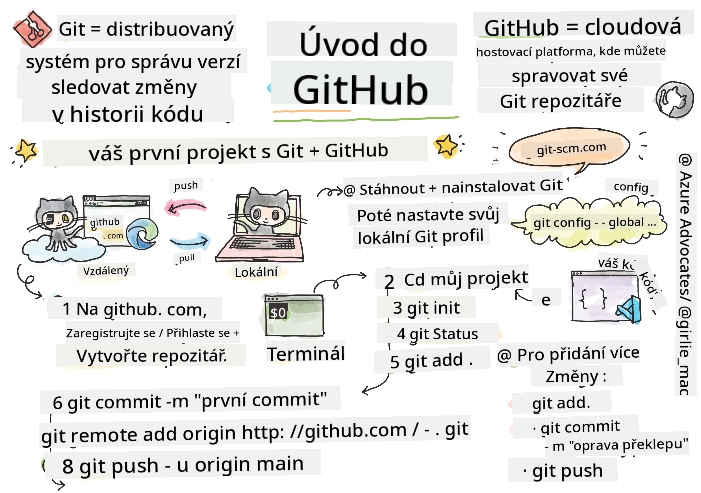

<!--
CO_OP_TRANSLATOR_METADATA:
{
  "original_hash": "acad15f3164cd6348e065ff38619aae9",
  "translation_date": "2025-10-24T20:51:11+00:00",
  "source_file": "1-getting-started-lessons/2-github-basics/README.md",
  "language_code": "cs"
}
-->
# Úvod do GitHubu

Ahoj, budoucí vývojáři! 👋 Připraveni připojit se k milionům programátorů po celém světě? Jsem opravdu nadšený, že vám mohu představit GitHub – představte si to jako sociální síť pro programátory, ale místo sdílení fotek obědů sdílíme kód a společně vytváříme úžasné věci!

To, co mě naprosto fascinuje, je fakt, že každá aplikace na vašem telefonu, každá webová stránka, kterou navštívíte, a většina nástrojů, které se naučíte používat, byly vytvořeny týmy vývojářů spolupracujících na platformách jako GitHub. Ta hudební aplikace, kterou milujete? Někdo jako vy na ní pracoval. Ta hra, kterou nemůžete odložit? Jo, pravděpodobně byla vytvořena díky spolupráci na GitHubu. A teď se i VY naučíte, jak být součástí této úžasné komunity!

Vím, že to na začátku může působit trochu složitě – pamatuji si, jak jsem poprvé zíral na stránku GitHubu a říkal si: „Co to všechno znamená?“ Ale věřte mi, každý vývojář začínal přesně tam, kde jste teď vy. Na konci této lekce budete mít svůj vlastní GitHub repozitář (představte si to jako svou osobní výstavní síň projektů v cloudu) a budete vědět, jak si ukládat svou práci, sdílet ji s ostatními a dokonce přispívat do projektů, které používají miliony lidí.

Půjdeme na tuto cestu společně, krok za krokem. Žádný spěch, žádný tlak – jen vy, já a pár opravdu skvělých nástrojů, které se stanou vašimi novými nejlepšími přáteli!


> Sketchnote od [Tomomi Imura](https://twitter.com/girlie_mac)

## Kvíz před lekcí
[Kvíz před lekcí](https://ff-quizzes.netlify.app)

## Úvod

Než se pustíme do opravdu vzrušujících věcí, připravíme váš počítač na trochu GitHub magie! Představte si to jako organizování svých uměleckých potřeb před vytvořením mistrovského díla – mít správné nástroje připravené dělá všechno mnohem hladší a zábavnější.

Provedu vás každým krokem nastavení osobně a slibuji, že to není ani zdaleka tak děsivé, jak to na první pohled může vypadat. Pokud vám něco hned nedojde, je to úplně normální! Pamatuji si, jak jsem nastavoval své první vývojové prostředí a měl pocit, že se snažím číst starověké hieroglyfy. Každý vývojář byl přesně tam, kde jste teď vy, a přemýšlel, jestli to dělá správně. Malý spoiler: pokud se učíte, už to děláte správně! 🌟

V této lekci se naučíte:

- sledovat práci, kterou děláte na svém počítači
- pracovat na projektech s ostatními
- jak přispívat do open source softwaru

### Předpoklady

Pojďme připravit váš počítač na trochu GitHub magie! Nebojte se – toto nastavení je něco, co musíte udělat jen jednou, a pak budete připraveni na celou svou programátorskou cestu.

Dobře, začněme od základu! Nejprve musíme zkontrolovat, zda už máte na svém počítači nainstalovaný Git. Git je v podstatě jako super chytrý asistent, který si pamatuje každou změnu, kterou provedete ve svém kódu – mnohem lepší než zběsilé mačkání Ctrl+S každé dvě sekundy (to jsme zažili všichni!).

Podívejme se, jestli už máte Git nainstalovaný, zadáním tohoto kouzelného příkazu do terminálu:
`git --version`

Pokud Git ještě nemáte, žádný problém! Stačí přejít na [download Git](https://git-scm.com/downloads) a stáhnout si ho. Jakmile ho nainstalujete, musíme Git správně představit:

> 💡 **První nastavení**: Tyto příkazy řeknou Gitu, kdo jste. Tyto informace budou připojeny ke každému commitu, který provedete, takže si vyberte jméno a e-mail, které jste ochotni sdílet veřejně.

```bash
git config --global user.name "your-name"
git config --global user.email "your-email"
```

Pro kontrolu, zda je Git již nakonfigurován, můžete zadat:
```bash
git config --list
```

Budete také potřebovat účet na GitHubu, editor kódu (například Visual Studio Code) a budete muset otevřít svůj terminál (nebo: příkazový řádek).

Přejděte na [github.com](https://github.com/) a vytvořte si účet, pokud ho ještě nemáte, nebo se přihlaste a vyplňte svůj profil.

💡 **Moderní tip**: Zvažte nastavení [SSH klíčů](https://docs.github.com/en/authentication/connecting-to-github-with-ssh) nebo použití [GitHub CLI](https://cli.github.com/) pro snadnější autentizaci bez hesel.

✅ GitHub není jediný repozitář kódu na světě; existují i jiné, ale GitHub je nejznámější.

### Příprava

Budete potřebovat složku s projektem kódu na svém lokálním počítači (notebooku nebo PC) a veřejný repozitář na GitHubu, který bude sloužit jako příklad, jak přispívat do projektů ostatních.

### Udržování vašeho kódu v bezpečí

Pojďme si na chvíli promluvit o bezpečnosti – ale nebojte se, nebudeme vás zahlcovat strašidelnými věcmi! Představte si tyto bezpečnostní postupy jako zamykání auta nebo domu. Jsou to jednoduché návyky, které se stanou samozřejmostí a ochrání vaši tvrdou práci.

Ukážeme vám moderní, bezpečné způsoby práce s GitHubem hned od začátku. Tímto způsobem si osvojíte dobré návyky, které vám budou sloužit po celou vaši programátorskou kariéru.

Při práci s GitHubem je důležité dodržovat nejlepší bezpečnostní postupy:

| Oblast bezpečnosti | Nejlepší postup | Proč je to důležité |
|--------------------|-----------------|---------------------|
| **Autentizace** | Používejte SSH klíče nebo osobní přístupové tokeny | Hesla jsou méně bezpečná a postupně se vyřazují |
| **Dvoufaktorová autentizace** | Aktivujte 2FA na svém GitHub účtu | Přidává další vrstvu ochrany účtu |
| **Bezpečnost repozitáře** | Nikdy necommitujte citlivé informace | API klíče a hesla by nikdy neměly být ve veřejných repozitářích |
| **Správa závislostí** | Aktivujte Dependabot pro aktualizace | Udržuje vaše závislosti bezpečné a aktuální |

> ⚠️ **Důležité bezpečnostní upozornění**: Nikdy necommitujte API klíče, hesla nebo jiné citlivé informace do žádného repozitáře. Používejte environmentální proměnné a soubory `.gitignore` k ochraně citlivých dat.

**Moderní nastavení autentizace:**

```bash
# Generate SSH key (modern ed25519 algorithm)
ssh-keygen -t ed25519 -C "your_email@example.com"

# Set up Git to use SSH
git remote set-url origin git@github.com:username/repository.git
```

> 💡 **Tip pro profíky**: SSH klíče eliminují potřebu opakovaného zadávání hesel a jsou bezpečnější než tradiční metody autentizace.

---

## Správa vašeho kódu jako profík

Dobře, TEĎ to začne být opravdu vzrušující! 🎉 Naučíme se, jak sledovat a spravovat váš kód jako profíci, a upřímně, tohle je jedna z mých nejoblíbenějších věcí, které učím, protože je to opravdová změna hry.

Představte si to: píšete úžasný příběh a chcete si uchovat každou verzi, každou brilantní úpravu a každý „počkej, to je geniální!“ moment. Přesně to Git dělá pro váš kód! Je to jako mít neuvěřitelný cestující zápisník, který si pamatuje VŠECHNO – každý stisk klávesy, každou změnu, každý „ups, to všechno rozbilo“ moment, který můžete okamžitě vrátit zpět.

Budu upřímný – na začátku to může působit ohromně. Když jsem začínal, říkal jsem si: „Proč si prostě nemůžu ukládat soubory normálně?“ Ale věřte mi: jakmile vám Git začne dávat smysl (a ono začne!), budete mít ten moment „aha“, kdy si řeknete: „Jak jsem kdy mohl programovat bez tohohle?“ Je to jako objevit, že můžete létat, když jste celý život chodili pěšky!

Představme si, že máte na svém počítači složku s nějakým projektem kódu a chcete začít sledovat svůj pokrok pomocí gitu – systému pro správu verzí. Někteří lidé přirovnávají používání gitu k psaní milostného dopisu svému budoucímu já. Když si za pár dní, týdnů nebo měsíců přečtete své commit zprávy, budete schopni si vybavit, proč jste udělali určité rozhodnutí, nebo „vrátit“ změnu – to vše, když píšete dobré „commit zprávy“.

### Úkol: Vytvořte svůj první repozitář!

> 🎯 **Vaše mise (a jsem z toho nadšený!)**: Společně vytvoříme váš úplně první GitHub repozitář! Až skončíme, budete mít svůj vlastní malý koutek internetu, kde bude váš kód, a provedete svůj první „commit“ (to je vývojářský slang pro chytré ukládání vaší práce).
>
> To je opravdu speciální moment – právě se oficiálně připojujete ke globální komunitě vývojářů! Stále si pamatuji ten pocit vzrušení, když jsem vytvořil svůj první repozitář a říkal si: „Wow, opravdu to dělám!“

Projdeme si toto dobrodružství společně, krok za krokem. Věnujte každému kroku dostatek času – není žádná cena za spěchání a slibuji, že každý jednotlivý krok bude dávat smysl. Pamatujte, každý programátorský superstar, kterého obdivujete, byl jednou přesně tam, kde jste teď vy, připraven vytvořit svůj první repozitář. Jak úžasné to je?

> Podívejte se na video
> 
> [](https://www.youtube.com/watch?v=9R31OUPpxU4)

**Pojďme na to společně:**

1. **Vytvořte svůj repozitář na GitHubu**. Přejděte na GitHub.com a najděte jasně zelené tlačítko **New** (nebo znak **+** v pravém horním rohu). Klikněte na něj a vyberte **New repository**.

   Co udělat:
   1. Dejte svému repozitáři jméno – udělejte ho pro vás smysluplným!
   1. Přidejte popis, pokud chcete (to pomáhá ostatním pochopit, o čem váš projekt je)
   1. Rozhodněte se, zda chcete, aby byl veřejný (viditelný pro všechny) nebo soukromý (jen pro vás)
   1. Doporučuji zaškrtnout políčko pro přidání README souboru – je to jako titulní stránka vašeho projektu
   1. Klikněte na **Create repository** a oslavte – právě jste vytvořili svůj první repozitář! 🎉

2. **Přejděte do složky svého projektu**. Teď si otevřeme váš terminál (nebojte se, není to tak děsivé, jak to vypadá!). Musíme říct vašemu počítači, kde jsou vaše projektové soubory. Zadejte tento příkaz:

   ```bash
   cd [name of your folder]
   ```

   **Co tady děláme:**
   - V podstatě říkáme „Hej počítači, vezmi mě do složky mého projektu“
   - Je to jako otevřít konkrétní složku na ploše, ale děláme to pomocí textových příkazů
   - Nahraďte `[name of your folder]` skutečným názvem vaší projektové složky

3. **Proměňte svou složku v Git repozitář**. Tady se děje magie! Zadejte:

   ```bash
   git init
   ```

   **Co se právě stalo (docela cool věc!):**
   - Git právě vytvořil skrytou složku `.git` ve vašem projektu – neuvidíte ji, ale je tam!
   - Vaše běžná složka je nyní „repozitář“, který může sledovat každou změnu, kterou provedete
   - Představte si to jako přidání super schopností vaší složce, aby si pamatovala všechno

4. **Zkontrolujte, co se děje**. Podívejme se, co si Git myslí o vašem projektu právě teď:

   ```bash
   git status
   ```

   **Porozumění tomu, co vám Git říká:**
   
   Můžete vidět něco, co vypadá takto:

   ```output
   Changes not staged for commit:
   (use "git add <file>..." to update what will be committed)
   (use "git restore <file>..." to discard changes in working directory)

        modified:   file.txt
        modified:   file2.txt
   ```

   **Nebojte se! Tady je, co to znamená:**
   - Soubory v **červené** jsou soubory, které mají změny, ale ještě nejsou připraveny k uložení
   - Soubory v **zelené** (až je uvidíte) jsou připraveny k uložení
   - Git je užitečný tím, že vám přesně říká, co můžete udělat dál

   > 💡 **Tip pro profíky**: Příkaz `git status` je váš nejlepší přítel! Používejte ho kdykoli, když si nejste jisti, co se děje. Je to jako ptát se Gitu „Hej, jaká je teď situace?“

5. **Připravte své soubory k uložení** (tomu se říká „staging“):

   ```bash
   git add .
   ```

   **Co jsme právě udělali:**
   - Řekli jsme Gitu „Hej, chci zahrnout VŠECHNY své soubory do dalšího uložení“
   - Tečka znamená „všechno v této složce“
   - Teď jsou vaše soubory „připravené“ na další krok

   **Chcete být selektivnější?** Můžete přidat jen konkrétní soubory:

   ```bash
   git add [file or folder name]
   ```

   **Proč byste to chtěli udělat?**
   - Někdy chcete uložit související změny dohromady
   - Pomáhá vám organizovat práci do logických celků
   - Usnadňuje pochopení, co se změnilo a kdy

   **Změnili jste názor?** Žádný problém! Můžete soubory odebrat z přípravy takto:

   ```bash
   # Unstage everything
   git reset
   
   # Unstage just one file
   git reset [file name]
   ```

   Nebojte se – tohle vaši práci nesmaže, jen odebere soubory z „připravené k uložení“ hromady.

6. **Trvale uložte svou práci** (provedení prvního commitu!):

   ```bash
   git commit -m "first commit"
   ```

   **🎉 Gratulace! Právě jste provedli svůj první commit!**
   
   **Co se právě stalo:**
   - Git si vzal „snímek“ všech vašich připravených souborů v tomto přesném okamžiku
   - Vaše commit zpráva „first commit“ vysvětluje, o čem je tento bod uložení
   - Git dal tomuto snímku unikátní ID, takže ho vždy najdete
   - Oficiálně jste začali sledovat historii svého projektu!

   > 💡 **Budoucí commit zprávy**: Pro vaše další commity buďte více popisní! Místo „updated stuff“ zkuste „Přidání kontaktního formuláře na domovskou stránku“ nebo „Oprava chyby v navigačním menu“. Vaše budoucí já vám poděkuje!

7. **Připojte svůj lokální projekt k GitHubu**. Právě teď váš projekt existuje pouze na vašem počítači. Pojďme ho připojit k vašemu GitHub repozitáři, abyste ho mohli sdílet se světem!

   Nejprve přejděte na stránku svého GitHub repozitáře a zkopírujte URL. Poté se vraťte sem a zadejte:

@@CODE
   - Vytvořili jsme spojení mezi vaším lokálním projektem a vaším GitHub repozitářem.
   - "Origin" je jen přezdívka pro váš GitHub repozitář – je to jako přidání kontaktu do vašeho telefonu.
   - Nyní váš lokální Git ví, kam poslat váš kód, když jste připraveni ho sdílet.

   💡 **Jednodušší způsob**: Pokud máte nainstalovaný GitHub CLI, můžete to udělat jedním příkazem:
   ```bash
   gh repo create my-repo --public --push --source=.
   ```

8. **Pošlete svůj kód na GitHub** (velký okamžik!):

   ```bash
   git push -u origin main
   ```

   **🚀 To je ono! Nahráváte svůj kód na GitHub!**
   
   **Co se děje:**
   - Vaše commity cestují z vašeho počítače na GitHub.
   - Příznak `-u` nastavuje trvalé spojení, takže budoucí pushování je jednodušší.
   - "main" je název vašeho hlavního větve (jako hlavní složka).
   - Poté už stačí pro budoucí nahrávání zadat jen `git push`!

   💡 **Rychlá poznámka**: Pokud se vaše větev jmenuje jinak (například "master"), použijte tento název. Můžete to zkontrolovat pomocí `git branch --show-current`.

9. **Váš nový každodenní rytmus kódování** (tady to začne být návykové!):

   Odteď, kdykoli provedete změny ve svém projektu, máte před sebou tento jednoduchý tříkrokový postup:

   ```bash
   git add .
   git commit -m "describe what you changed"
   git push
   ```

   **To se stane vaším kódovacím rytmem:**
   - Udělejte nějaké skvělé změny ve svém kódu ✨
   - Připravte je pomocí `git add` ("Hej Git, všimni si těchto změn!")
   - Uložte je pomocí `git commit` a popisné zprávy (budoucí vy vám poděkuje!)
   - Sdílejte je se světem pomocí `git push` 🚀
   - Opakujte – vážně, stane se to tak přirozené jako dýchání!

   Miluji tento pracovní postup, protože je to jako mít více uložených bodů ve videohře. Udělali jste změnu, kterou milujete? Commitujte ji! Chcete zkusit něco riskantního? Žádný problém – vždy se můžete vrátit k poslednímu commitu, pokud se věci pokazí!

   > 💡 **Tip**: Možná budete chtít použít soubor `.gitignore`, abyste zabránili sledování souborů, které nechcete na GitHubu – například poznámkový soubor, který ukládáte ve stejné složce, ale nemá místo ve veřejném repozitáři. Šablony pro soubory `.gitignore` najdete na [.gitignore templates](https://github.com/github/gitignore) nebo si vytvořte vlastní pomocí [gitignore.io](https://www.toptal.com/developers/gitignore).

#### Moderní pracovní postupy s Gitem

Zvažte přijetí těchto moderních praktik:

- **Konvenční commity**: Používejte standardizovaný formát zpráv commitů jako `feat:`, `fix:`, `docs:` atd. Více se dozvíte na [conventionalcommits.org](https://www.conventionalcommits.org/).
- **Atomické commity**: Každý commit by měl představovat jednu logickou změnu.
- **Časté commity**: Commitujte často s popisnými zprávami, místo velkých a nepravidelných commitů.

#### Zprávy commitů

Skvělý předmět zprávy commitu by měl dokončit následující větu:
Pokud bude aplikován, tento commit <vaše předmětná zpráva zde>

Pro předmět používejte rozkazovací způsob v přítomném čase: "změnit" místo "změněno" nebo "změny". 
Stejně jako v předmětu, i v těle (volitelném) používejte rozkazovací způsob v přítomném čase. Tělo by mělo zahrnovat motivaci ke změně a kontrastovat to s předchozím chováním. Vysvětlujete `proč`, ne `jak`.

✅ Věnujte pár minut prozkoumání GitHubu. Najdete opravdu skvělou zprávu commitu? Najdete nějakou velmi stručnou? Jaké informace považujete za nejdůležitější a užitečné pro sdělení ve zprávě commitu?

## Spolupráce s ostatními (ta zábavná část!)

Připravte se, protože TOTO je místo, kde se GitHub stává naprosto magickým! 🪄 Zvládli jste správu vlastního kódu, ale teď se ponoříme do mé absolutně nejoblíbenější části – spolupráce s úžasnými lidmi z celého světa.

Představte si to: zítra se probudíte a zjistíte, že někdo v Tokiu vylepšil váš kód, zatímco jste spali. Pak někdo v Berlíně opraví chybu, na které jste uvízli. Odpoledne přidá vývojář v São Paulu funkci, na kterou jste ani nepomysleli. To není sci-fi – to je prostě úterý ve vesmíru GitHubu!

Co mě opravdu nadchne, je to, že dovednosti spolupráce, které se chystáte naučit? To jsou PŘESNĚ ty samé pracovní postupy, které týmy v Googlu, Microsoftu a vašich oblíbených startupech používají každý den. Nejenže se učíte skvělý nástroj – učíte se tajný jazyk, který umožňuje celému softwarovému světu spolupracovat.

Vážně, jakmile zažijete ten pocit, když někdo poprvé sloučí váš pull request, pochopíte, proč jsou vývojáři tak vášniví ohledně open source. Je to jako být součástí největšího, nejkreativnějšího týmového projektu na světě!

> Podívejte se na video
>
> [](https://www.youtube.com/watch?v=bFCM-PC3cu8)

Hlavním důvodem pro umístění věcí na GitHub bylo umožnit spolupráci s ostatními vývojáři.

Ve vašem repozitáři přejděte na `Insights > Community`, abyste viděli, jak váš projekt odpovídá doporučeným komunitním standardům.

Chcete, aby váš repozitář vypadal profesionálně a přívětivě? Přejděte do svého repozitáře a klikněte na `Insights > Community`. Tato skvělá funkce vám ukáže, jak váš projekt odpovídá tomu, co GitHub komunita považuje za "dobré praktiky repozitáře."

> 🎯 **Jak udělat váš projekt atraktivním**: Dobře organizovaný repozitář s kvalitní dokumentací je jako mít čistý, přívětivý obchod. Ukazuje lidem, že vám na vaší práci záleží, a motivuje ostatní, aby přispěli!

**Co dělá repozitář skvělým:**

| Co přidat | Proč je to důležité | Co to pro vás znamená |
|-----------|---------------------|-----------------------|
| **Popis** | První dojem je důležitý! | Lidé okamžitě vědí, o čem váš projekt je |
| **README** | Hlavní stránka vašeho projektu | Jako přívětivý průvodce pro nové návštěvníky |
| **Pokyny pro přispěvatele** | Ukazuje, že vítáte pomoc | Lidé přesně vědí, jak vám mohou pomoci |
| **Kodex chování** | Vytváří přátelské prostředí | Každý se cítí vítán k účasti |
| **Licence** | Právní jasnost | Ostatní vědí, jak mohou váš kód používat |
| **Bezpečnostní politika** | Ukazuje, že jste zodpovědní | Demonstruje profesionální přístup |

> 💡 **Profesionální tip**: GitHub poskytuje šablony pro všechny tyto soubory. Při vytváření nového repozitáře zaškrtněte políčka pro automatické generování těchto souborů.

**Moderní funkce GitHubu k prozkoumání:**

🤖 **Automatizace & CI/CD:**
- **GitHub Actions** pro automatizované testování a nasazení
- **Dependabot** pro automatické aktualizace závislostí

💬 **Komunita & řízení projektů:**
- **GitHub Discussions** pro komunitní diskuze nad rámec problémů
- **GitHub Projects** pro řízení projektů ve stylu kanban
- **Pravidla ochrany větví** pro prosazování standardů kvality kódu

Všechny tyto zdroje budou užitečné při začleňování nových členů týmu. A to jsou obvykle věci, na které se noví přispěvatelé podívají, než se podívají na váš kód, aby zjistili, zda je váš projekt tím správným místem, kde by měli trávit svůj čas.

✅ README soubory, i když jejich příprava zabere čas, jsou často přehlíženy zaneprázdněnými správci. Najdete příklad obzvláště popisného README? Poznámka: existují [nástroje, které pomáhají vytvářet dobré README](https://www.makeareadme.com/), které byste mohli vyzkoušet.

### Úkol: Sloučit nějaký kód

Dokumentace pro přispěvatele pomáhá lidem přispívat do projektu. Vysvětluje, jaké typy příspěvků hledáte a jak proces funguje. Přispěvatelé budou muset projít sérií kroků, aby mohli přispět do vašeho repozitáře na GitHubu:

1. **Forkování vašeho repozitáře**. Pravděpodobně budete chtít, aby lidé _forkovali_ váš projekt. Forkování znamená vytvoření repliky vašeho repozitáře na jejich GitHub profilu.
1. **Klonování**. Odtud si projekt naklonují na svůj lokální počítač.
1. **Vytvoření větve**. Budete chtít, aby si vytvořili _větev_ pro svou práci.
1. **Zaměření změny na jednu oblast**. Požádejte přispěvatele, aby se soustředili na jednu věc najednou – tím se zvýší šance, že budete moci _sloučit_ jejich práci. Představte si, že opraví chybu, přidají novou funkci a aktualizují několik testů – co když chcete nebo můžete implementovat jen 2 z 3 nebo 1 z 3 změn?

✅ Představte si situaci, kdy jsou větve obzvláště důležité pro psaní a odesílání dobrého kódu. Jaké případy použití vás napadají?

> Poznámka: Buďte tou změnou, kterou chcete vidět ve světě, a vytvářejte větve i pro svou vlastní práci. Jakékoli commity, které provedete, budou provedeny na větvi, na kterou jste aktuálně "přepnuti". Použijte `git status`, abyste viděli, na které větvi právě jste.

Pojďme si projít pracovní postup přispěvatele. Předpokládejme, že přispěvatel již _forkoval_ a _naklonoval_ repozitář, takže má připravený Git repozitář na svém lokálním počítači:

1. **Vytvoření větve**. Použijte příkaz `git branch` k vytvoření větve, která bude obsahovat změny, které chce přispěvatel přidat:

   ```bash
   git branch [branch-name]
   ```

   > 💡 **Moderní přístup**: Můžete také vytvořit a přepnout na novou větev jedním příkazem:
   ```bash
   git switch -c [branch-name]
   ```

1. **Přepnutí na pracovní větev**. Přepněte na určenou větev a aktualizujte pracovní adresář pomocí `git switch`:

   ```bash
   git switch [branch-name]
   ```

   > 💡 **Moderní poznámka**: `git switch` je moderní náhrada za `git checkout` při změně větví. Je jasnější a bezpečnější pro začátečníky.

1. **Práce na změnách**. V tomto bodě chcete přidat své změny. Nezapomeňte o nich informovat Git pomocí následujících příkazů:

   ```bash
   git add .
   git commit -m "my changes"
   ```

   > ⚠️ **Kvalita zprávy commitu**: Ujistěte se, že dáváte svému commit názorný název, jak pro vás, tak pro správce repozitáře, na kterém pomáháte. Buďte konkrétní ohledně toho, co jste změnili!

1. **Sloučení vaší práce s větví `main`**. V určitém okamžiku dokončíte práci a budete chtít sloučit svou práci s větví `main`. Mezitím se mohla větev `main` změnit, takže se ujistěte, že ji nejprve aktualizujete na nejnovější verzi pomocí následujících příkazů:

   ```bash
   git switch main
   git pull
   ```

   V tomto bodě se chcete ujistit, že jakékoli _konflikty_, situace, kdy Git nemůže snadno _sloučit_ změny, se objeví ve vaší pracovní větvi. Proto spusťte následující příkazy:

   ```bash
   git switch [branch_name]
   git merge main
   ```

   Příkaz `git merge main` přinese všechny změny z `main` do vaší větve. Doufejme, že můžete pokračovat. Pokud ne, VS Code vám ukáže, kde je Git _zmatený_, a vy jen upravíte dotčené soubory, abyste určili, který obsah je nejpřesnější.

   💡 **Moderní alternativa**: Zvažte použití `git rebase` pro čistší historii:
   ```bash
   git rebase main
   ```
   Tím se vaše commity přehrají na vrchol nejnovější větve main, čímž se vytvoří lineární historie.

1. **Pošlete svou práci na GitHub**. Poslání vaší práce na GitHub znamená dvě věci. Pushnutí vaší větve do vašeho repozitáře a poté otevření PR, Pull Request.

   ```bash
   git push --set-upstream origin [branch-name]
   ```

   Výše uvedený příkaz vytvoří větev na vašem forkovaném repozitáři.

1. **Otevřete PR**. Dále chcete otevřít PR. To uděláte tak, že přejdete na forkovaný repozitář na GitHubu. Na GitHubu uvidíte indikaci, zda chcete vytvořit nový PR, kliknete na to a dostanete se do rozhraní, kde můžete změnit název zprávy commitu, dát jí vhodnější popis. Nyní správce repozitáře, který jste forkovali, uvidí tento PR a _držte palce_, že ho ocení a _sloučí_ váš PR. Nyní jste přispěvatelem, hurá :)

   💡 **Moderní tip**: PR můžete také vytvořit pomocí GitHub CLI:
   ```bash
   gh pr create --title "Your PR title" --body "Description of changes"
   ```

   🔧 **Nejlepší praktiky pro PR**:
   - Odkazujte na související problémy pomocí klíčových slov jako "Fixes #123".
   - Přidejte screenshoty pro změny v uživatelském rozhraní.
   - Požádejte o konkrétní recenzenty.
   - Používejte draft PR pro rozpracované úkoly.
   - Ujistěte se, že všechny CI kontroly projdou před žádostí o recenzi.

1. **Úklid**. Je považováno za dobrou praxi _uklidit_ po úspěšném sloučení PR. Chcete vyčistit jak svou lokální větev, tak větev, kterou jste pushovali na GitHub. Nejprve ji smažte lokálně pomocí následujícího příkazu:

   ```bash
   git branch -d [branch-name]
   ```

   Ujistěte se, že přejdete na stránku GitHub pro forkovaný repozitář a odstraníte vzdálenou větev, kterou jste právě pushovali.

`Pull request` se může zdát jako zvláštní termín, protože ve skutečnosti chcete své změny pushovat do projektu. Ale správce (vlastník projektu) nebo hlavní tým musí zvážit vaše změny před jejich sloučením s "hlavní" větví projektu, takže ve skutečnosti žádáte správce o rozhodnutí o změně.

Pull request je místo, kde můžete porovnávat a diskutovat o rozdílech zavedených na větvi s recenzemi, komentáři, integrovanými testy a dalšími věcmi. Dobrý pull request se řídí přibližně stejnými pravidly jako zpráva commitu. Můžete přidat odkaz na problém v trackeru problémů, když
🤞Držme palce, aby všechny kontroly prošly a majitelé projektu sloučili vaše změny do projektu🤞

Aktualizujte svou aktuální lokální pracovní větev o všechny nové commity z odpovídající vzdálené větve na GitHubu:

`git pull`

## Přispívání do open source (Vaše šance udělat změnu!)

Jste připraveni na něco, co vám naprosto vyrazí dech? 🤯 Pojďme si povídat o přispívání do open source projektů – už jen při pomyšlení na to, že vám to sdílím, mám husí kůži!

Tohle je vaše šance stát se součástí něčeho opravdu mimořádného. Představte si, že zlepšujete nástroje, které každý den používají miliony vývojářů, nebo opravujete chybu v aplikaci, kterou vaši přátelé milují. To není jen sen – to je přesně to, o čem je přispívání do open source!

Tady je něco, co mě pokaždé nadchne: každý jednotlivý nástroj, se kterým jste se učili – váš editor kódu, frameworky, které budeme zkoumat, dokonce i prohlížeč, ve kterém tohle čtete – začal s někým, kdo byl přesně jako vy a udělal svůj úplně první příspěvek. Ten geniální vývojář, který vytvořil váš oblíbený doplněk pro VS Code? I on byl jednou začátečníkem, který s třesoucíma se rukama klikl na "create pull request", přesně jako se chystáte udělat vy.

A tady je ta nejkrásnější část: komunita open source je jako největší internetové objetí. Většina projektů aktivně hledá nováčky a má problémy označené jako "good first issue" speciálně pro lidi jako vy! Správci projektů se opravdu těší, když vidí nové přispěvatele, protože si pamatují své vlastní první kroky.

Nejenže se učíte kódovat – připravujete se na to, že se připojíte ke globální rodině tvůrců, kteří se každý den probouzejí s myšlenkou "Jak můžeme udělat digitální svět o něco lepší?" Vítejte v klubu! 🌟

Nejprve najděte na GitHubu repozitář (nebo **repo**), který vás zajímá a do kterého byste chtěli přispět změnou. Budete chtít zkopírovat jeho obsah na svůj počítač.

✅ Skvělý způsob, jak najít repozitáře vhodné pro začátečníky, je [vyhledávání podle tagu 'good-first-issue'](https://github.blog/2020-01-22-browse-good-first-issues-to-start-contributing-to-open-source/).


Existuje několik způsobů, jak zkopírovat kód. Jedním z nich je "klonování" obsahu repozitáře pomocí HTTPS, SSH nebo GitHub CLI (Command Line Interface).

Otevřete svůj terminál a klonujte repozitář takto:
```bash
# Using HTTPS
git clone https://github.com/ProjectURL

# Using SSH (requires SSH key setup)
git clone git@github.com:username/repository.git

# Using GitHub CLI
gh repo clone username/repository
```

Pro práci na projektu přepněte do správné složky:
`cd ProjectURL`

Celý projekt můžete také otevřít pomocí:
- **[GitHub Codespaces](https://github.com/features/codespaces)** - Cloudové vývojové prostředí GitHubu s VS Code v prohlížeči
- **[GitHub Desktop](https://desktop.github.com/)** - GUI aplikace pro operace s Gitem  
- **[GitHub.dev](https://github.dev)** - Stiskněte klávesu `.` na jakémkoli repozitáři GitHubu a otevřete VS Code v prohlížeči
- **VS Code** s rozšířením GitHub Pull Requests

Nakonec můžete kód stáhnout ve formě zipovaného souboru.

### Několik dalších zajímavostí o GitHubu

Na GitHubu můžete označit hvězdičkou, sledovat nebo "forkovat" jakýkoli veřejný repozitář. Své označené repozitáře najdete v rozbalovací nabídce v pravém horním rohu. Je to jako záložky, ale pro kód.

Projekty mají sledovač problémů, většinou na GitHubu v záložce "Issues", pokud není uvedeno jinak, kde lidé diskutují o problémech souvisejících s projektem. A záložka Pull Requests je místem, kde lidé diskutují a recenzují změny, které jsou v procesu.

Projekty mohou mít také diskuse ve fórech, mailing listech nebo chatovacích kanálech jako Slack, Discord nebo IRC.

🔧 **Moderní funkce GitHubu**:
- **GitHub Discussions** - Vestavěné fórum pro komunitní konverzace
- **GitHub Sponsors** - Finanční podpora správců  
- **Security tab** - Zprávy o zranitelnostech a bezpečnostní doporučení
- **Actions tab** - Automatizované pracovní postupy a CI/CD pipeline
- **Insights tab** - Analýzy o přispěvatelích, commitech a zdraví projektu
- **Projects tab** - Vestavěné nástroje pro správu projektů na GitHubu

✅ Prozkoumejte svůj nový GitHub repozitář a vyzkoušejte několik věcí, jako je úprava nastavení, přidání informací do repozitáře, vytvoření projektu (například Kanban board) a nastavení GitHub Actions pro automatizaci. Je toho hodně, co můžete dělat!

---

## 🚀 Výzva 

Dobře, je čas otestovat vaše nové GitHub super schopnosti! 🚀 Tady je výzva, která vám vše krásně spojí dohromady:

Vezměte kamaráda (nebo člena rodiny, který se vás pořád ptá, co děláte s tím "počítačovým věcem") a pusťte se společně do dobrodružství kolaborativního kódování! Tady se děje ta pravá magie – vytvořte projekt, nechte je ho forkovat, vytvořte nějaké větve a slučte změny jako profíci, kterými se stáváte.

Nebudu lhát – pravděpodobně se někdy zasmějete (zvlášť když se oba pokusíte změnit stejný řádek), možná budete chvíli zmatení, ale určitě zažijete ty úžasné "aha!" momenty, které dělají celé učení tak hodnotným. Navíc je něco speciálního na tom, když sdílíte první úspěšné sloučení s někým jiným – je to jako malá oslava toho, jak daleko jste se dostali!

Nemáte zatím parťáka na kódování? Žádný problém! Komunita GitHubu je plná neuvěřitelně přátelských lidí, kteří si pamatují, jaké to bylo být nováčkem. Hledejte repozitáře s označením "good first issue" – v podstatě říkají "Hej začátečníci, pojďte se učit s námi!" Jak úžasné to je?

## Kvíz po přednášce
[Kvíz po přednášce](https://ff-quizzes.netlify.app/web/en/)

## Recenze & Pokračujte v učení

Uf! 🎉 Podívejte se na sebe – právě jste zvládli základy GitHubu jako absolutní šampion! Pokud máte pocit, že je vaše hlava teď trochu plná, je to úplně normální a upřímně dobré znamení. Právě jste se naučili nástroje, které mi trvalo týdny, než jsem se s nimi cítil pohodlně.

Git a GitHub jsou neuvěřitelně silné (opravdu silné) a každý vývojář, kterého znám – včetně těch, kteří teď vypadají jako kouzelníci – musel cvičit a trochu se potýkat, než mu to všechno docvaklo. Skutečnost, že jste prošli touto lekcí, znamená, že už jste na cestě k ovládnutí některých z nejdůležitějších nástrojů v sadě vývojáře.

Tady jsou některé naprosto fantastické zdroje, které vám pomohou cvičit a stát se ještě úžasnějšími:

- [Průvodce přispíváním do open source softwaru](https://opensource.guide/how-to-contribute/#how-to-submit-a-contribution) – Vaše mapa k tomu, jak udělat změnu
- [Git cheatsheet](https://training.github.com/downloads/github-git-cheat-sheet/) – Mějte to po ruce pro rychlou referenci!

A pamatujte: praxe dělá pokrok, ne dokonalost! Čím více budete používat Git a GitHub, tím přirozenější to bude. GitHub vytvořil několik úžasných interaktivních kurzů, které vám umožní cvičit v bezpečném prostředí:

- [Úvod do GitHubu](https://github.com/skills/introduction-to-github)
- [Komunikace pomocí Markdownu](https://github.com/skills/communicate-using-markdown)  
- [GitHub Pages](https://github.com/skills/github-pages)
- [Řešení konfliktů při slučování](https://github.com/skills/resolve-merge-conflicts)

**Cítíte se dobrodružně? Podívejte se na tyto moderní nástroje:**
- [Dokumentace GitHub CLI](https://cli.github.com/manual/) – Pro chvíle, kdy se chcete cítit jako kouzelník příkazového řádku
- [Dokumentace GitHub Codespaces](https://docs.github.com/en/codespaces) – Kódujte v cloudu!
- [Dokumentace GitHub Actions](https://docs.github.com/en/actions) – Automatizujte vše
- [Nejlepší praktiky pro Git](https://www.atlassian.com/git/tutorials/comparing-workflows) – Zlepšete své pracovní postupy 

## Výzva GitHub Copilot Agent 🚀

Použijte režim Agent k dokončení následující výzvy:

**Popis:** Vytvořte kolaborativní projekt webového vývoje, který demonstruje kompletní GitHub workflow, který jste se naučili v této lekci. Tato výzva vám pomůže procvičit vytvoření repozitáře, funkce spolupráce a moderní Git workflow v reálném scénáři.

**Zadání:** Vytvořte nový veřejný GitHub repozitář pro jednoduchý projekt "Web Development Resources". Repozitář by měl obsahovat dobře strukturovaný soubor README.md, který uvádí užitečné nástroje a zdroje pro webový vývoj, organizované podle kategorií (HTML, CSS, JavaScript atd.). Nastavte repozitář s odpovídajícími komunitními standardy včetně licence, pokynů pro přispívání a kodexu chování. Vytvořte alespoň dvě větve funkcí: jednu pro přidání zdrojů pro CSS a druhou pro zdroje pro JavaScript. Proveďte commity do každé větve s popisnými zprávami o commitech, poté vytvořte pull requesty pro sloučení změn zpět do hlavní větve. Aktivujte funkce GitHubu jako Issues, Discussions a nastavte základní workflow GitHub Actions pro automatické kontroly.

## Úkol 

Vaše mise, pokud ji přijmete: Dokončete kurz [Úvod do GitHubu](https://github.com/skills/introduction-to-github) na GitHub Skills. Tento interaktivní kurz vám umožní procvičit vše, co jste se naučili, v bezpečném, vedeném prostředí. Navíc získáte skvělý odznak, když ho dokončíte! 🏅

**Cítíte se připraveni na další výzvy?**
- Nastavte SSH autentizaci pro svůj GitHub účet (už žádná hesla!)
- Zkuste používat GitHub CLI pro své každodenní operace s Gitem
- Vytvořte repozitář s workflow GitHub Actions
- Prozkoumejte GitHub Codespaces otevřením tohoto repozitáře v cloudovém editoru

Pamatujte: každý expert byl jednou začátečníkem. Máte na to! 💪

---

**Prohlášení**:  
Tento dokument byl přeložen pomocí služby pro automatický překlad [Co-op Translator](https://github.com/Azure/co-op-translator). Ačkoli se snažíme o přesnost, mějte prosím na paměti, že automatické překlady mohou obsahovat chyby nebo nepřesnosti. Původní dokument v jeho původním jazyce by měl být považován za autoritativní zdroj. Pro důležité informace doporučujeme profesionální lidský překlad. Neodpovídáme za žádná nedorozumění nebo nesprávné interpretace vyplývající z použití tohoto překladu.