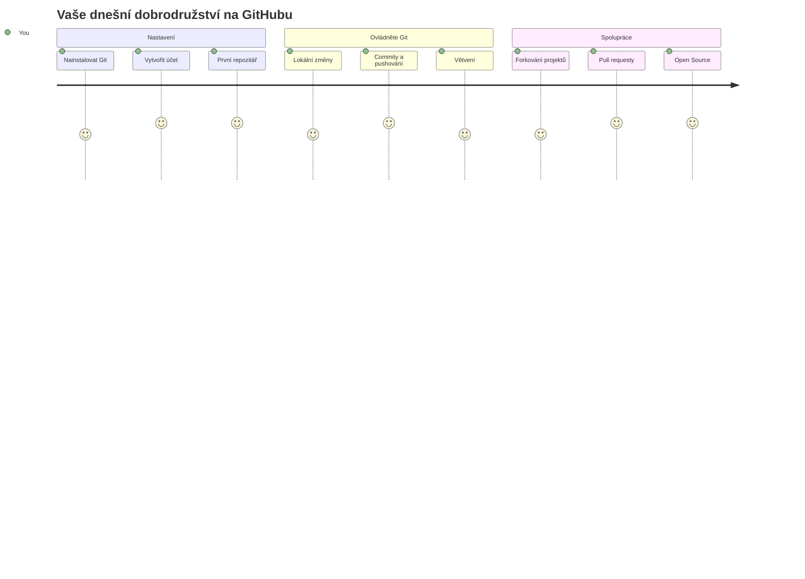
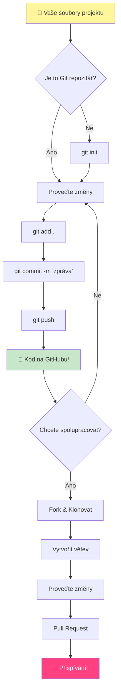
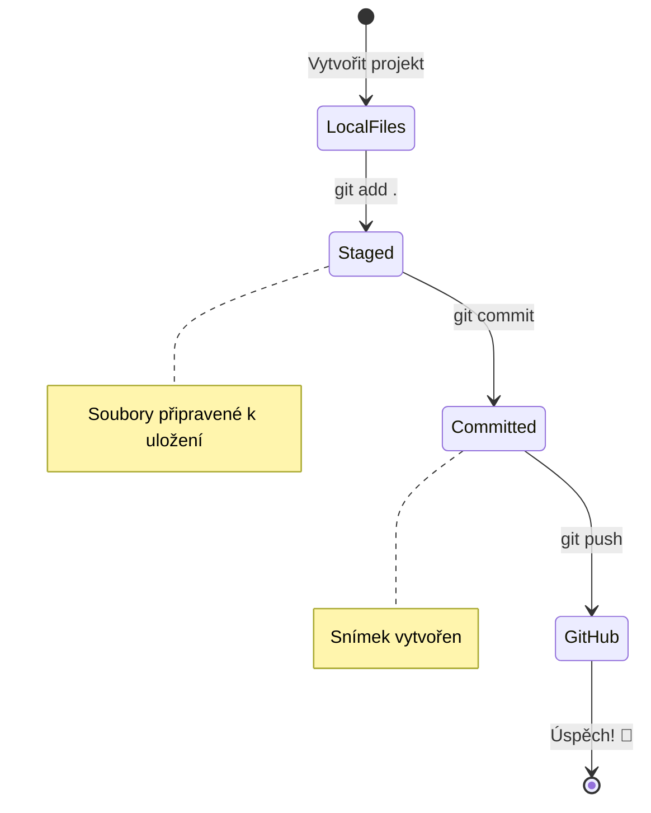
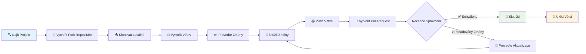
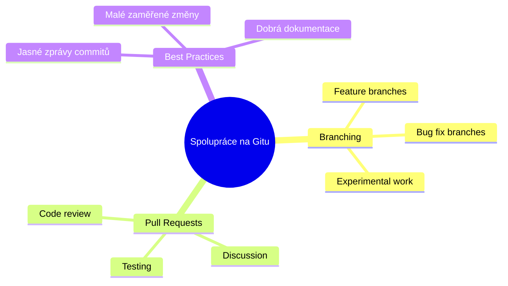
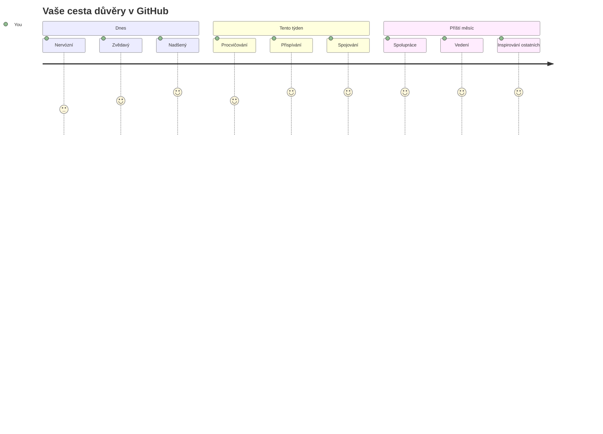

<!--
CO_OP_TRANSLATOR_METADATA:
{
  "original_hash": "5c383cc2cc23bb164b06417d1c107a44",
  "translation_date": "2026-01-07T04:15:32+00:00",
  "source_file": "1-getting-started-lessons/2-github-basics/README.md",
  "language_code": "cs"
}
-->
# Úvod do GitHubu

Ahoj, budoucí vývojáři! 👋 Připraven připojit se k milionům programátorů po celém světě? Jsem opravdu nadšený, že ti mohu představit GitHub – představ si to jako sociální síť pro programátory, jen místo sdílení fotek oběda sdílíme kód a společně budujeme neuvěřitelné věci!

Co mi fakt bere dech: každá aplikace v tvém telefonu, každá webová stránka, kterou navštívíš, a většina nástrojů, které se naučíš používat, byla vytvořena týmy vývojářů spolupracujících na platformách právě jako GitHub. Ta hudební aplikace, kterou máš rád? Někdo jako ty na ní přispěl. Ta hra, od které se nedokážeš odtrhnout? Jo, pravděpodobně postavená díky spolupráci na GitHubu. A teď se naučíš, jak být součástí té úžasné komunity!

Vím, že to může ze začátku působit jako hodně – hele, pamatuju si, jak jsem poprvé koukal na svou první stránku GitHubu a říkal si „Co to sakra všechno znamená?“ Ale tady je ten vtip: každý jediný vývojář začal přesně tam, kde jsi teď ty. Na konci této lekce budeš mít svůj vlastní GitHub repozitář (představ si to jako tvoji osobní prezentaci projektu v cloudu) a budeš vědět, jak si uložit svou práci, sdílet ji s ostatními a dokonce přispívat do projektů, které používají miliony lidí.

Vyrazíme na tuto cestu spolu, krok za krokem. Bez spěchu, bez tlaku – jen ty, já a pár opravdu skvělých nástrojů, které se právě stanou tvými novými nejlepšími přáteli!


> Sketchnote od [Tomomi Imura](https://twitter.com/girlie_mac)


## Přednáškový kvíz
[Přednáškový kvíz](https://ff-quizzes.netlify.app)

## Úvod

Než se pustíme do opravdu vzrušujících věcí, připravme tvůj počítač na trochu GitHub kouzel! Představ si to jako uspořádání výtvarných potřeb před vytvořením mistrovského díla – mít správné nástroje připravené vše usnadní a hlavně udělá víc zábavné.

Provedu tě osobně každým krokem nastavení a slibuji, že to není zdaleka tak děsivé, jak to na první pohled může vypadat. Pokud něco hned nepochopíš, je to naprosto normální! Pamatuju si, jak jsem vybavoval své první vývojové prostředí a měl pocit, že čtu starověké hieroglyfy. Každý vývojář stál přesně tam, kde jsi teď ty, a přemýšlel, jestli to dělá správně. Malá nápověda: pokud se učíš, už to děláš správně! 🌟

V této lekci se naučíme:

- sledovat práci, kterou děláš na svém počítači
- pracovat na projektech s ostatními
- jak přispívat do open source softwaru

### Požadavky

Připravíme tvůj počítač na trochu GitHub kouzel! Neboj – toto nastavení musíš udělat jen jednou a pak jsi připravený na celou svou cestu programováním.

Dobře, začněme od základů! Nejprve musíme zkontrolovat, jestli už máš na svém počítači Git. Git je vlastně jako mít super chytrého asistenta, který pamatuje každou změnu, kterou uděláš ve svém kódu – mnohem lepší než zoufale mačkat Ctrl+S každé dvě sekundy (všichni jsme tím prošli!).

Podívejme se, jestli je Git už nainstalovaný, tím, že napíšeš do terminálu tento kouzelný příkaz:
`git --version`

Pokud Git ještě není, neboj! Stačí jít na [download Git](https://git-scm.com/downloads) a stáhnout ho. Jakmile budeš mít Git nainstalovaný, musíme se s ním správně seznámit:

> 💡 **První nastavení**: Tyto příkazy řeknou Gitu, kdo jsi. Tyto údaje budou připojeny ke každému commitu, který uděláš, takže si vyber jméno a e-mail, který chceš zveřejňovat.

```bash
git config --global user.name "your-name"
git config --global user.email "your-email"
```

Pro kontrolu, jestli je Git nakonfigurovaný, můžeš napsat:
```bash
git config --list
```

Také budeš potřebovat účet na GitHubu, editor kódu (například Visual Studio Code) a otevřít terminál (nebo: příkazový řádek).

Přejdi na [github.com](https://github.com/) a založ si účet, pokud ho ještě nemáš, nebo se přihlas a vyplň svůj profil.

💡 **Moderní tip**: Zvaž nastavení [SSH klíčů](https://docs.github.com/en/authentication/connecting-to-github-with-ssh) nebo použití [GitHub CLI](https://cli.github.com/) pro jednodušší autentifikaci bez hesel.

✅ GitHub není jediným repozitářem kódu na světě; jsou i jiné, ale GitHub je nejznámější

### Příprava

Budeš potřebovat složku s kódovým projektem na svém počítači (notebook nebo PC) a veřejný repozitář na GitHubu, který poslouží jako příklad, jak přispívat do projektů ostatních.

### Uchování kódu v bezpečí

Pojďme si chvíli povídat o bezpečnosti – ale neboj, nebudeme tě zahlcovat strašidelnými věcmi! Bezpečnostní praktiky jsou jako zamykání auta nebo domu. Jsou to jednoduché návyky, které se stanou samozřejmostí a ochrání tvou tvrdou práci.

Ukážeme ti moderní a bezpečné způsoby, jak pracovat s GitHubem od samého začátku. Tím si vytvoříš dobré návyky, které ti budou sloužit celou tvou programátorskou kariéru.

Při práci s GitHub je důležité dodržovat bezpečnostní doporučení:

| Oblast bezpečnosti | Nejlepší postup | Proč je to důležité |
|--------------------|-----------------|---------------------|
| **Autentifikace** | Používej SSH klíče nebo osobní přístupové tokeny | Hesla jsou méně bezpečná a postupně se ruší |
| **Dvoufaktorová autentifikace** | Zapni 2FA na svém GitHub účtu | Přidává další vrstvu ochrany účtu |
| **Bezpečnost repozitáře** | Nikdy nedávej do commitu citlivé informace | API klíče a hesla nesmí být ve veřejných repozitářích |
| **Správa závislostí** | Zapni Dependabot pro aktualizace | Udržuje závislosti bezpečné a aktuální |

> ⚠️ **Kritické bezpečnostní upozornění**: Nikdy neukládej API klíče, hesla nebo jiné citlivé údaje do žádného repozitáře. Používej proměnné prostředí a soubory `.gitignore` k ochraně citlivých dat.

**Moderní nastavení autentifikace:**

```bash
# Vygenerujte SSH klíč (moderní algoritmus ed25519)
ssh-keygen -t ed25519 -C "your_email@example.com"

# Nastavte Git pro používání SSH
git remote set-url origin git@github.com:username/repository.git
```

> 💡 **Profesionální tip**: SSH klíče eliminují potřebu opakovaně zadávat hesla a jsou bezpečnější než tradiční způsoby autentifikace.

---

## Správa kódu jako profesionál

Tak jo, TADY se to stává opravdu vzrušující! 🎉 Naučíme se, jak sledovat a spravovat svůj kód jako profíci, a upřímně, je to jedna z mých nejoblíbenějších věcí učit, protože to doslova mění hru.

Představ si to: píšeš úžasný příběh a chceš sledovat každý návrh, každou geniální úpravu a každý „počkat, tohle je nápad!“ moment během procesu. Přesně to Git dělá s tvým kódem! Je to jako mít neuvěřitelný deník cestování časem, který si pamatuje VŠECHNO – každý stisk klávesy, každou změnu, každý „oops, to jsem zkazil“ okamžik, který můžeš okamžitě vzít zpět.

Upřímně – může to působit zpočátku zahlcujícím dojmem. Když jsem začínal, říkal jsem si „Proč si prostě nemůžu uložit soubory jako normálně?“ Ale věř mi: jakmile ti Git začne dávat smysl (a dá!), zažiješ tu momentální „aha!“ chvíli, kdy si řekneš „Jak jsem kdy mohl programovat bez toho?“ Je to jako objevit, že umíš létat, když jsi celý život chodil pěšky!

Představ si, že máš lokálně složku s nějakým projektem a chceš začít sledovat svůj progres pomocí gitu – systému pro správu verzí. Někteří lidé přirovnávají používání gitu k psaní milostného dopisu svému budoucímu já. Když si pak za dny, týdny nebo měsíce přečteš zprávy commitů, budeš si pamatovat, proč jsi učinil určité rozhodnutí, nebo můžeš „vrátit“ změnu – to platí, když píšeš dobré zprávy commitů.


### Úkol: Vytvoř svůj první repozitář!

> 🎯 **Tvůj úkol (a já jsem nadšený za tebe!)**: Společně vytvoříme tvůj úplně první GitHub repozitář! Až tady skončíme, budeš mít svůj malý koutek internetu, kde bude tvůj kód žít, a uděláš svůj první "commit" (to je programátorský výraz pro chytré uložení práce).
>
> Je to opravdu zvláštní moment – chystáš se oficiálně připojit ke globální komunitě vývojářů! Stále si pamatuju ten adrenalin z vytvoření svého prvního repa, kdy jsem si říkal „Wow, opravdu to dělám!“

Projďme tím dobrodružstvím společně, krok za krokem. Dej si na každé části tolik času, kolik potřebuješ – není žádná soutěž, kdo to udělá rychle. A slibuju ti, že každý krok bude dávat smysl. Pamatuj, každý hvězdný programátor, kterého obdivuješ, seděl přesně tam, kde jsi ty, a chystal se vytvořit svůj první repozitář. Jak to je skvělé?

> Podívej se na video
> 
> [](https://www.youtube.com/watch?v=9R31OUPpxU4)

**Pojďme na to společně:**

1. **Vytvoř si repozitář na GitHubu**. Přejdi na GitHub.com a hledej jasně zelené tlačítko **New** (nebo znak **+** v pravém horním rohu). Klikni na něj a vyber **New repository**.

   Co máš udělat:
   1. Dej repozitáři jméno – ať něco pro tebe znamená!
   1. Přidej popis, pokud chceš (to pomůže ostatním pochopit, o co tvůj projekt je)
   1. Rozhodni se, jestli bude veřejný (každý ho může vidět) nebo soukromý (jen ty)
   1. Doporučuji zaškrtnout políčko na přidání README souboru – je to jako titulní strana tvého projektu
   1. Klikni na **Create repository** a oslavuj – právě jsi vytvořil svůj první repozitář! 🎉

2. **Přejdi do složky s projektem**. Teď otevři svůj terminál (neboj, není to tak strašidelné, jak to vypadá!). Musíme říct počítači, kde jsou tvoje projektové soubory. Napiš tento příkaz:

   ```bash
   cd [name of your folder]
   ```

   **Co děláme:**
   - Říkáme "Hej počítači, ukaž mi moji projektovou složku"
   - Je to jako otevření konkrétní složky na ploše, ale děláme to pomocí příkazů
   - Nahraď `[name of your folder]` skutečným názvem své projektové složky

3. **Přeměň složku na Git repozitář**. Tady začíná magie! Napiš:

   ```bash
   git init
   ```

   **Co se právě stalo (fakt cool věci!):**
   - Git vytvořil skrytou složku `.git` ve tvém projektu – neuvidíš ji, ale je tam!
   - Tvoje běžná složka je teď „repozitář“, který může sledovat každou tvou změnu
   - Představ si to jako dát své složce superschopnosti pamatovat si všechno

4. **Zkontroluj, co se děje**. Podívejme se, co si Git myslí o tvém projektu právě teď:

   ```bash
   git status
   ```

   **Co ti Git říká:**
   
   Můžeš vidět něco jako toto:

   ```output
   Changes not staged for commit:
   (use "git add <file>..." to update what will be committed)
   (use "git restore <file>..." to discard changes in working directory)

        modified:   file.txt
        modified:   file2.txt
   ```

   **Neboj se! Tady je, co to znamená:**
   - Soubory červeně jsou soubory, které se změnily, ale ještě nejsou připravené k uložení
   - Soubory zeleně (když je vidíš) jsou připravené k uložení
   - Git ti pomáhá tím, že přesně říká, co můžeš udělat dál

   > 💡 **Profesionální tip**: Příkaz `git status` je tvůj nejlepší přítel! Používej ho kdykoliv budeš mít zmatek. Je to jako ptát se Gitu: "Hej, co je teď za situaci?"

5. **Připrav si soubory na uložení** (říká se tomu "staging"):

   ```bash
   git add .
   ```

   **Co jsme právě udělali:**
   - Řekli jsme Gitu: „Hej, chci do dalšího uložení zahrnout VŠECHNY své soubory“
   - `.` znamená „vše v této složce“
   - Teď jsou tvoje soubory „připravené“ na další krok

   **Chceš být vybíravější?** Můžeš přidat jen konkrétní soubory:

   ```bash
   git add [file or folder name]
   ```

   **Proč by tě to mohlo zajímat?**
   - Někdy chceš uložit související změny společně
   - Pomáhá ti to uspořádat práci do logických celků
   - Usnadňuje to pochopení, co a kdy se změnilo

   **Změnil/a jsi názor?** Nevadí! Můžeš odebrat soubory z připravených takto:

   ```bash
   # Zrušit přidání všeho
   git reset
   
   # Zrušit přidání pouze jednoho souboru
   git reset [file name]
   ```

   Neboj, to nevymaže tvou práci, jen to vezme soubory z „připravených k uložení“ balíčku.

6. **Ulož svou práci natrvalo** (uděláš svůj první commit!):

   ```bash
   git commit -m "first commit"
   ```

   **🎉 Gratuluji! Právě jsi udělal svůj první commit!**
   
   **Co se právě stalo:**
   - Git pořídil „momentku“ všech připravených souborů v tento přesný okamžik
   - Zpráva commitu „first commit“ vysvětluje, co tento bod uložení znamená
   - Git dal této momentce unikátní ID, abys ji vždy našel
   - Oficiálně jsi začal sledovat historii svého projektu!

   > 💡 **Budoucí zprávy commitů**: Další zprávy piš podrobněji! Místo „updated stuff“ zkus „Přidání kontaktního formuláře na úvodní stránku“ nebo „Oprava chyby v menu navigace“. Tvůj budoucí já ti poděkuje!

7. **Propoj svůj lokální projekt s GitHubem**. Tvojí projekt má zatím domov jen v počítači. Pojďme ho propojit s GitHub repozitářem, aby ho mohl vidět celý svět!

   Nejprve jdi na stránku svého GitHub repozitáře a zkopíruj URL. Pak se vrať sem a napiš:

   ```bash
   git remote add origin https://github.com/username/repository_name.git
   ```
   
   (Nahraď tu URL skutečnou adresou svého repozitáře!)

   **Co jsme právě udělali:**
   - Vytvořili jsme spojení mezi vaším lokálním projektem a vaším repozitářem na GitHubu
   - „Origin“ je jen přezdívka pro váš GitHub repozitář – je to jako přidat kontakt do telefonu
   - Teď váš lokální Git ví, kam poslat váš kód, když budete připraveni jej sdílet

   💡 **Jednodušší cesta**: Pokud máte nainstalovaný GitHub CLI, můžete to udělat jedním příkazem:
   ```bash
   gh repo create my-repo --public --push --source=.
   ```

8. **Poslat svůj kód na GitHub** (ten velký okamžik!):

   ```bash
   git push -u origin main
   ```

   **🚀 To je ono! Nahazujete svůj kód na GitHub!**
   
   **Co se děje:**
   - Vaše commity putují z vašeho počítače na GitHub
   - Přepínač `-u` nastaví trvalé spojení, aby budoucí pushování bylo snazší
   - „main“ je název vašeho primárního větve (jako hlavní složka)
   - Po tomto můžete pro budoucí nahrávání jednoduše zadat `git push`!

   💡 **Rychlá poznámka**: Pokud se vaše větev jmenuje jinak (např. „master“), použijte ten název místo toho. Můžete to zkontrolovat příkazem `git branch --show-current`.

9. **Váš nový denní rytmus kódování** (tady to začne být návykové!):

   Odteď, kdykoliv provedete změny ve svém projektu, máte tento jednoduchý tříkrokový tanec:

   ```bash
   git add .
   git commit -m "describe what you changed"
   git push
   ```

   **To se stane vaším kódovacím rytmem:**
   - Proveďte skvělé změny ve svém kódu ✨
   - Připravte je pomocí `git add` („Hej Gite, věnuj pozornost těmto změnám!“)
   - Uložte je pomocí `git commit` s popisnou zprávou (vaše budoucí já vám poděkuje!)
   - Sdílejte je se světem pomocí `git push` 🚀
   - Opakujte – vážně, tohle se stane tak přirozeným jako dýchání!

   Miluji tento pracovní tok, protože je to jako mít v počítačové hře více uložených bodů. Udělali jste změnu, která se vám líbí? Commitujte ji! Chcete zkusit něco riskantního? Žádný problém – vždy se můžete vrátit k poslednímu commitu, pokud se něco pokazí!

   > 💡 **Tip**: Možná budete chtít také použít `.gitignore` soubor, abyste zabránili souborům, které nechcete sledovat, aby se objevovaly na GitHubu – jako třeba ten poznámkový soubor, který máte ve stejné složce, ale nemá co dělat v veřejném repozitáři. Šablony pro `.gitignore` soubory najdete na [.gitignore templates](https://github.com/github/gitignore) nebo si můžete jeden vytvořit pomocí [gitignore.io](https://www.toptal.com/developers/gitignore).

### 🧠 **První commit do repozitáře: Jaké to bylo?**

**Věnujte chvíli oslavě a zamyšlení:**
- Jaké to bylo vidět svůj kód poprvé na GitHubu?
- Který krok byl nejnáročnější, a který naopak překvapivě snadný?
- Dokážete vlastními slovy vysvětlit rozdíl mezi `git add`, `git commit` a `git push`?


> **Pamatujte**: I zkušení vývojáři někdy zapomenou přesné příkazy. Aby se tento pracovní tok stal svalovou pamětí, je třeba cvičit – daří se vám to skvěle!

#### Moderní Git pracovní toky

Zvažte přijetí těchto moderních praktik:

- **Conventional Commits**: Používejte standardizovaný formát commit zpráv jako `feat:`, `fix:`, `docs:`, atd. Více na [conventionalcommits.org](https://www.conventionalcommits.org/)
- **Atomic commits**: Každý commit by měl představovat jednu logickou změnu
- **Časté commity**: Commitujte často s popisnými zprávami, spíše než velké, zřídka prováděné commity

#### Commit zprávy

Skvělý předmět commit zprávy dokončí následující větu:
Pokud bude tento commit aplikován, <váš text předmětu zde>

Pro předmět používejte imperativ v přítomném čase: „change“ ne „changed“ ani „changes“.
Stejně tak i v těle (volitelném) používejte imperativ v přítomném čase. Tělo by mělo obsahovat motivaci ke změně a kontrast k předchozímu chování. Vysvětlujete *proč*, ne *jak*.

✅ Věnujte několik minut prohlížení GitHubu. Najdete opravdu dobrou commit zprávu? Najdete opravdu minimalistickou? Jaké informace považujete za nejdůležitější a nejvíce užitečné sdělit v commit zprávě?

## Práce s ostatními (Zábavná část!)

Držte si klobouk, protože TADY GitHub začne být opravdu magický! 🪄 Ovládli jste správu vlastního kódu, ale teď se ponoříme do mé úplně nejoblíbenější části – spolupráce s úžasnými lidmi z celého světa.

Představte si: vzbudíte se zítra a uvidíte, že někdo v Tokiu vylepšil váš kód, zatímco jste spali. Pak někdo v Berlíně opraví chybu, na které jste byli zaseknutí. Odpoledne už vývojář v São Paulu přidal funkci, na kterou byste nikdy nepomysleli. To není sci-fi – to je prostě úterý ve světě GitHubu!

Co mě opravdu těší, jsou ty spolupracující dovednosti, které se právě naučíte? Jsou to EXAKTNĚ tyto pracovní toky, které týmy ve firmách jako Google, Microsoft a vaše oblíbené startupy používají každý den. Neučíte se jen nějaký skvělý nástroj – učíte se tajný jazyk, který umožňuje celému světu softwaru spolupracovat.

Vážně, jakmile zažijete ten pocit, když někdo sloučí váš první pull request, pochopíte, proč jsou vývojáři tak zapálení pro open source. Je to jako být součástí největšího, nejkreativnějšího týmového projektu na světě!

> Podívejte se na video
>
> [](https://www.youtube.com/watch?v=bFCM-PC3cu8)

Hlavním důvodem pro umístění věcí na GitHub bylo umožnit spolupráci s ostatními vývojáři.


Ve svém repozitáři přejděte na `Insights > Community`, abyste viděli, jak váš projekt odpovídá doporučeným komunitním standardům.

Chcete, aby váš repozitář vypadal profesionálně a přívětivě? Přejděte do svého repozitáře a klikněte na `Insights > Community`. Tato skvělá funkce vám ukáže, jak váš projekt odpovídá tomu, co komunita GitHub považuje za „dobré praktiky repozitáře“.

> 🎯 **Nechte svůj projekt zazářit**: Dobře organizovaný repozitář s dobrou dokumentací je jako mít čistý, přívětivý výklad obchodu. Ukazuje lidem, že vám na vaší práci záleží, a motivuje ostatní přispívat!

**Co dělá repozitář úžasným:**

| Co přidat | Proč je to důležité | Co to pro vás znamená |
|-----------|--------------------|----------------------|
| **Popis** | První dojem je důležitý! | Lidé hned vědí, co váš projekt dělá |
| **README** | Úvodní stránka projektu | Jako přátelský průvodce pro nové návštěvníky |
| **Příručka pro přispívání** | Ukazuje, že pomoc vítáte | Lidé přesně vědí, jak vám můžou pomoci |
| **Kodex chování** | Vytváří přátelské prostředí | Každý se cítí vítán a může se zapojit |
| **Licence** | Právní jasnost | Ostatní vědí, jak s vaším kódem mohou pracovat |
| **Bezpečnostní politika** | Ukazuje vaši odpovědnost | Demonstruje profesionální přístup |

> 💡 **Profesionální tip**: GitHub poskytuje šablony pro všechny tyto soubory. Při vytváření nového repozitáře zaškrtněte políčka pro automatické generování těchto souborů.

**Moderní funkce GitHubu k prozkoumání:**

🤖 **Automatizace & CI/CD:**
- **GitHub Actions** pro automatizované testování a nasazení
- **Dependabot** pro automatické aktualizace závislostí

💬 **Komunita & řízení projektů:**
- **GitHub Discussions** pro komunitní diskuse mimo issues
- **GitHub Projects** pro kanbanové řízení projektů
- **Pravidla ochrany větví** pro udržování standardů kvality kódu


Všechny tyto nástroje pomohou při onboardingu nových členů týmu. A typicky to jsou věci, na které se noví přispěvatelé dívají ještě předtím, než se podívají na váš kód, aby zjistili, jestli je jejich čas investovaný správně.

✅ README soubory, ačkoliv příprava je časově náročná, jsou často zanedbávány zaneprázdněnými správci. Najdete příklad obzvlášť popisného README? Poznámka: existují [nástroje pro tvorbu kvalitních README](https://www.makeareadme.com/), které můžete vyzkoušet.

### Úkol: Sloučit nějaký kód

Dokumenty pro přispěvatele pomáhají lidem přispívat do projektu. Vysvětlují, jaké typy příspěvků hledáte a jak proces funguje. Přispěvatelé budou muset projít několika kroky, aby mohli přispět do vašeho repozitáře na GitHubu:


1. **Forkování vašeho repozitáře** Pravděpodobně chcete, aby lidé _forkovali_ váš projekt. Forkování znamená vytvoření kopie vašeho repozitáře na jejich GitHub profilu.
1. **Klonování**. Odtamtud projekt naklonují na svůj lokální počítač.
1. **Vytvoření větve**. Chcete, aby si vytvořili _větev_ pro svou práci.
1. **Zaměření změn na jednu oblast**. Požádejte přispěvatele, aby své příspěvky soustředili na jednu věc najednou – tím zvýšíte šanci, že budete moct jejich práci _sloučit_. Představte si, že napíšou opravu chyby, přidají novou funkci a aktualizují několik testů – co když chcete nebo můžete implementovat jen 2 z 3, nebo 1 z 3 změn?

✅ Představte si situaci, kdy jsou větve obzvlášť důležité pro psaní a doručování kvalitního kódu. Jaké případy použití vás napadají?

> Poznámka, buďte tou změnou, kterou chcete ve světě vidět, a vytvářejte větve i pro svou vlastní práci. Jakékoliv commity, které provedete, budou provedeny na větvi, na které jste momentálně „checkoutnuti“. Použijte `git status`, abyste zjistili, která to je.

Projďme si pracovní tok přispěvatele. Předpokládejme, že přispěvatel již repozitář _forknul_ a _klonoval_, takže má Git repo připravené k práci na svém lokálním počítači:

1. **Vytvoření větve**. Použijte příkaz `git branch` k vytvoření větve, která bude obsahovat změny, které chtějí přispět:

   ```bash
   git branch [branch-name]
   ```

   > 💡 **Moderní přístup**: Novou větev můžete vytvořit a přepnout se na ni jediným příkazem:
   ```bash
   git switch -c [branch-name]
   ```

1. **Přepnutí na pracovní větev**. Přepněte se na zadanou větev a aktualizujte pracovní adresář pomocí `git switch`:

   ```bash
   git switch [branch-name]
   ```

   > 💡 **Moderní poznámka**: `git switch` je moderní náhrada za `git checkout`, pokud měníte větve. Je to jasnější a bezpečnější pro začátečníky.

1. **Pracujte**. Teď chcete přidat své změny. Nezapomeňte Gitu to dát najevo následujícími příkazy:

   ```bash
   git add .
   git commit -m "my changes"
   ```

   > ⚠️ **Kvalita commit zpráv**: Postarejte se, aby vaše commit zpráva měla dobrý název, pro vás i pro správce repozitáře, kterému pomáháte. Buďte konkrétní, co jste změnili!

1. **Sloučte svou práci s větví `main`**. V určitém okamžiku skončíte s prací a chcete svou práci spojit s větví `main`. Ta možná mezitím změnila, proto ji nejprve aktualizujte na nejnovější stav těmito příkazy:

   ```bash
   git switch main
   git pull
   ```

   V tuto chvíli chcete zajistit, že případné _konflikty_, tedy situace, kdy Git nemůže jednoduše _sloučit_ změny, se stanou ve vaší pracovní větvi. Proto spusťte tyto příkazy:

   ```bash
   git switch [branch_name]
   git merge main
   ```

   Příkaz `git merge main` přenese všechny změny z větve `main` do vaší větve. Doufejme, že můžete pokračovat dál. Pokud ne, VS Code vám ukáže, kde je Git _zmatený_ a vy jen upravíte postižené soubory tak, aby obsahovaly správný obsah.

   💡 **Moderní alternativa**: Zvažte použití `git rebase` pro přehlednější historii:
   ```bash
   git rebase main
   ```
   Tím se vaše commity „přehrávají“ na nejnovější větev main, což vytváří lineární historii.

1. **Pošlete svou práci na GitHub**. Posílání vaší práce na GitHub znamená dvě věci. Pushnutí větve do vašeho repozitáře a otevření PR (Pull Requestu).

   ```bash
   git push --set-upstream origin [branch-name]
   ```

   Tento příkaz vytvoří větev ve vašem forkovaném repozitáři.

### 🤝 **Kontrola dovedností spolupráce: Jste připraveni pracovat s ostatními?**

**Podívejme se, jak se cítíte ohledně spolupráce:**
- Dává vám teď smysl koncept forkování a pull requestů?
- Co je jedna věc ohledně práce s větvemi, kterou byste chtěli více procvičit?
- Jak pohodlně se cítíte přispívat do cizího projektu?


> **Zvýšení sebedůvěry**: Každý vývojář, kterého obdivujete, byl jednou nervózní z prvního pull requestu. GitHub komunita je pro nováčky nesmírně vstřícná!

1. **Otevřít PR**. Dále chcete otevřít PR. Uděláte to tak, že přejdete do forkovaného repozitáře na GitHubu. Uvidíte tam indikaci, která se zeptá, zda chcete vytvořit nový PR, kliknete na to a dostanete se do rozhraní, kde můžete změnit název commit zprávy, dát jí vhodnější popis. Nyní správce repozitáře, který jste forkli, uvidí tento PR a _držme palce_, že ocení a váš PR _sloučí_. Už jste přispěvatel, hurá :)

   💡 **Moderní tip**: PR můžete také vytvářet pomocí GitHub CLI:
   ```bash
   gh pr create --title "Your PR title" --body "Description of changes"
   ```

   🔧 **Nejlepší postupy pro PR:**
   - Propojte s příslušnými issues pomocí klíčových slov jako „Fixes #123“
   - Přidejte screenshoty u změn UI
   - Požádejte o konkrétní recenzenty
   - Používejte draft PR pro rozpracovanou práci
   - Ujistěte se, že všechny CI kontroly projdou, než požádáte o revizi
1. **Úklid**. Je považováno za dobrý zvyk _uklidit_ poté, co úspěšně sloučíte PR. Chcete uklidit jak svoji lokální větev, tak větev, kterou jste pushli na GitHub. Nejprve ji smažte lokálně pomocí následujícího příkazu:

   ```bash
   git branch -d [branch-name]
   ```

   Poté nezapomeňte navštívit stránku forku na GitHubu a odstranit vzdálenou větev, kterou jste právě pushli.

`Pull request` se může zdát jako hloupý termín, protože ve skutečnosti chcete pushovat své změny do projektu. Ale správce (vlastník projektu) nebo hlavní tým musí vaše změny zvážit, než je sloučí s "main" větví projektu, takže v podstatě žádáte správce o rozhodnutí o změně.

Pull request je místo, kde porovnáváte a diskutujete rozdíly přidané do větve s recenzemi, komentáři, integrovanými testy a dalšími. Dobrá pull request dodržuje přibližně stejná pravidla jako commit message. Můžete přidat odkaz na issue v issue trackeru, pokud vaše práce například opravuje problém. To se dělá pomocí `#` následovaného číslem issue, například `#97`.

🤞Držíme palce, aby všechny kontroly prošly a vlastník projektu vaše změny sloučil do projektu🤞

Aktualizujte svoji aktuální lokální pracovní větev o všechny nové commity z odpovídající vzdálené větve na GitHubu:

`git pull`

## Přispívání do Open Source (Vaše šance udělat rozdíl!)

Jste připraveni na něco, co vám doslova vyrazí dech? 🤯 Pojďme mluvit o přispívání do open source projektů – a už jen při tom mám husí kůži, když to s vámi sdílím!

Toto je vaše šance stát se součástí něčeho skutečně výjimečného. Představte si, že zlepšujete nástroje, které miliony vývojářů používají každý den, nebo opravujete chybu v aplikaci, kterou vaši přátelé milují. To není jen sen – to je podstata přispívání do open source!

Co mi nahání zimnici pokaždé, když na to myslím: každý nástroj, se kterým jste se učili – váš kódový editor, frameworky, které budeme objevovat, dokonce i prohlížeč, ve kterém to čtete – začal tak, že někdo přesně jako vy udělal svůj první příspěvek. Ten geniální vývojář, který vytvořil vaše oblíbené rozšíření VS Code? Byl taky začátečník, který se klepal, když klikal na "create pull request", stejně jako teď vy.

A tady je ta nejkrásnější část: open source komunita je jako největší internetové objetí. Většina projektů aktivně hledá nováčky a má označené issues „good first issue“ právě pro lidi jako jste vy! Správci projektů se upřímně těší, když vidí nové přispěvatele, protože si pamatují své první kroky.

```mermaid
flowchart TD
    A[🔍 Prozkoumejte GitHub] --> B[🏷️ Najděte "dobrý první úkol"]
    B --> C[📖 Přečtěte si Pokyny pro přispívání]
    C --> D[🍴 Vytvořte Fork repozitáře]
    D --> E[💻 Nastavte lokální prostředí]
    E --> F[🌿 Vytvořte větev pro funkci]
    F --> G[✨ Proveďte svůj příspěvek]
    G --> H[🧪 Otestujte své změny]
    H --> I[📝 Napište jasný commit]
    I --> J[📤 Pushněte a vytvořte PR]
    J --> K[💬 Zapojte se do zpětné vazby]
    K --> L[🎉 Sloučeno! Jste přispěvatel!]
    L --> M[🌟 Najděte další úkol]
    
    style A fill:#e1f5fe
    style L fill:#c8e6c9
    style M fill:#fff59d
```
Tady se nejen učíte programovat – připravujete se stát se součástí globální rodiny tvůrců, kteří každý den vstávají s myšlenkou "Jak můžeme digitální svět udělat o něco lepším?" Vítejte v klubu! 🌟

Nejprve najděte na GitHubu repozitář (nebo **repo**) zajímavý pro vás, do kterého chcete přispět změnou. Budete chtít zkopírovat jeho obsah do svého počítače.

✅ Dobrý způsob, jak najít repozitáře vhodné pro začátečníky, je [vyhledat podle štítku 'good-first-issue'](https://github.blog/2020-01-22-browse-good-first-issues-to-start-contributing-to-open-source/).


Existuje několik způsobů, jak zkopírovat kód. Jedním z nich je "klonování" obsahu repozitáře přes HTTPS, SSH nebo pomocí GitHub CLI (Command Line Interface).

Otevřete terminál a klonujte repozitář takto:
```bash
# Použití HTTPS
git clone https://github.com/ProjectURL

# Použití SSH (vyžaduje nastavení SSH klíče)
git clone git@github.com:username/repository.git

# Použití GitHub CLI
gh repo clone username/repository
```

Pro práci na projektu přepněte do správné složky:
`cd ProjectURL`

Projekt můžete také otevřít celý pomocí:
- **[GitHub Codespaces](https://github.com/features/codespaces)** - cloudové vývojové prostředí GitHubu s VS Code v prohlížeči
- **[GitHub Desktop](https://desktop.github.com/)** - GUI aplikace pro operace s Gitem  
- **[GitHub.dev](https://github.dev)** - Stiskněte klávesu `.` v jakémkoli GitHub repozitáři a otevřete VS Code v prohlížeči
- **VS Code** s rozšířením GitHub Pull Requests

Nakonec můžete stáhnout kód ve formě zip archivu.

### Několik dalších zajímavostí o GitHubu

Můžete si označit hvězdičkou, sledovat a/nebo "forkovat" jakýkoli veřejný repozitář na GitHubu. Vaše označené repozitáře najdete v rozbalovacím menu vpravo nahoře. Je to jako záložka, ale pro kód.

Projekty mají issue tracker, většinou na GitHubu v záložce „Issues“, pokud není uvedeno jinak, kde se diskutují problémy související s projektem. A záložka Pull Requests je místo, kde lidé diskutují a přezkoumávají probíhající změny.

Projekty mohou mít také diskuse na fórech, mailing listech nebo v chat kanálech jako Slack, Discord nebo IRC.

🔧 **Moderní funkce GitHubu**:
- **GitHub Discussions** - integrované fórum pro komunitní diskuse
- **GitHub Sponsors** - finanční podpora správců  
- **Záložka Security** - hlášení zranitelností a bezpečnostní upozornění
- **Záložka Actions** - přehled automatizovaných workflow a CI/CD pipeline
- **Záložka Insights** - statistiky o přispěvatelích, commitech a zdraví projektu
- **Záložka Projects** - vestavěné nástroje správy projektů na GitHubu

✅ Projděte svůj nový GitHub repozitář a vyzkoušejte pár věcí, jako upravit nastavení, přidat informace do repozitáře, vytvořit projekt (například Kanban board) a nastavit GitHub Actions pro automatizaci. Můžete toho udělat opravdu hodně!

---

## 🚀 Výzva

Dobře, je čas otestovat vaše nové super schopnosti na GitHubu! 🚀 Tady je výzva, která vám všechno krásně usadí:

Vezměte si kamaráda (nebo člena rodiny, který se vždy ptá, co to děláte s tím „počítačovým“), a pusťte se do společného kódovacího dobrodružství! Tady se děje ta pravá magie – vytvořte projekt, nechte ho forkovat, vytvořte větve a sloučte změny jako opravdoví profíci, kterými se stáváte.

Nebudu lhát – pravděpodobně se mnohokrát zasmějete (zejména když se oba pokusíte změnit stejný řádek), možná si poplácáte hlavy zmateně, ale rozhodně zažijete ty úžasné „aha!“ momenty, které dělají učení smysluplným. Navíc je něco zvláštního na sdílení prvního úspěšného merge s někým jiným – je to jako malá oslava toho, jak daleko jste došli!

Ještě nemáte parťáka na kódování? Žádný problém! GitHub komunita je plná neuvěřitelně vstřícných lidí, kteří si pamatují, jaké to bylo být nováčkem. Hledejte repozitáře s označením „good first issue“ – v podstatě říkají „Hej začátečníci, pojďte se učit s námi!“ Jak úžasné je to?

## Kvíz po přednášce
[Post-lecture quiz](https://ff-quizzes.netlify.app/web/en/)

## Recenze & další učení

Uf! 🎉 Podívejte se na sebe – právě jste zvládli základy GitHubu jako opravdoví šampioni! Pokud máte mozek teď trochu plný, je to zcela normální a upřímně dobré znamení. Právě jste se naučili nástroje, které mi trvalo týdny pochopit, když jsem začínal.

Git a GitHub jsou nesmírně silné (opravdu mocné), a každý vývojář, kterého znám – včetně těch, kteří teď vypadají jako kouzelníci – si musel procvičovat a trochu tápat, než mu to celé došlo. To, že jste tuto lekci dokončili, znamená, že jste na cestě stát se mistrem jednoho z nejdůležitějších nástrojů ve vývojářském arzenálu.

Tady je několik fantastických zdrojů, které vám pomohou procvičovat a stát se ještě lepšími:

- [Průvodce přispíváním do open source softwaru](https://opensource.guide/how-to-contribute/#how-to-submit-a-contribution) – Vaše mapa k tomu, jak něco změnit
- [Git cheatsheet](https://training.github.com/downloads/github-git-cheat-sheet/) – Mějte po ruce pro rychlý přehled!

A pamatujte: praxe dělá pokrok, ne dokonalost! Čím více budete používat Git a GitHub, tím přirozenější to bude. GitHub vytvořil úžasné interaktivní kurzy, které umožňují procvičovat v bezpečném prostředí:

- [Úvod do GitHubu](https://github.com/skills/introduction-to-github)
- [Komunikace pomocí Markdown](https://github.com/skills/communicate-using-markdown)  
- [GitHub Pages](https://github.com/skills/github-pages)
- [Řešení konfliktů při mergování](https://github.com/skills/resolve-merge-conflicts)

**Cítíte dobrodružství? Vyzkoušejte tyto moderní nástroje:**
- [Dokumentace GitHub CLI](https://cli.github.com/manual/) – Pro chvíle, kdy chcete být pány příkazové řádky
- [Dokumentace GitHub Codespaces](https://docs.github.com/en/codespaces) – Kódování v cloudu!
- [Dokumentace GitHub Actions](https://docs.github.com/en/actions) – Automatizujte vše
- [Dobré postupy s Git](https://www.atlassian.com/git/tutorials/comparing-workflows) – Vylepšete si pracovní postupy

## Výzva GitHub Copilot Agenta 🚀

Použijte režim Agenta k dokončení následující výzvy:

**Popis:** Vytvořte společný projekt pro webový vývoj, který předvede kompletní GitHub workflow, které jste se v této lekci naučili. Tato výzva vám pomůže procvičit vytváření repozitářů, funkce spolupráce a moderní Git workflow v reálném scénáři.

**Úkol:** Vytvořte nový veřejný GitHub repozitář pro jednoduchý projekt „Web Development Resources“. Repozitář by měl obsahovat dobře strukturovaný soubor README.md s přehledem užitečných nástrojů a zdrojů pro webový vývoj, uspořádaných podle kategorií (HTML, CSS, JavaScript atd.). Nastavte repozitář s odpovídajícími komunitními standardy včetně licence, pravidel přispívání a kodexu chování. Vytvořte minimálně dvě feature větve: jednu pro přidání zdrojů CSS a druhou pro JavaScriptové zdroje. Pro každou větev proveďte commity s popisnými zprávami a poté vytvořte pull requesty pro sloučení změn zpět do main. Aktivujte na GitHubu funkce jako Issues, Discussions a nastavte základní workflow GitHub Actions pro automatické kontroly.

## Zadání

Vaším úkolem, pokud ho přijmete: Dokončit kurz [Úvod do GitHubu](https://github.com/skills/introduction-to-github) na GitHub Skills. Tento interaktivní kurz vám umožní procvičit vše, co jste se naučili, v bezpečném a krok za krokem vedeném prostředí. Navíc získáte parádní odznak po dokončení! 🏅

**Chcete další výzvy?**
- Nastavte SSH autentizaci pro váš GitHub účet (už žádná hesla!)
- Zkuste používat GitHub CLI pro své denní Git operace
- Vytvořte repozitář s workflow GitHub Actions
- Vyzkoušejte GitHub Codespaces otevřením právě tohoto repozitáře v cloudovém editoru

---

## 🚀 Váš časový plán mistrovství na GitHubu

### ⚡ **Co můžete udělat za dalších 5 minut**
- [ ] Označit tento repozitář a další 3 projekty, které vás zajímají
- [ ] Nastavit dvoufaktorovou autentizaci na GitHubu
- [ ] Vytvořit jednoduchý README pro svůj první repozitář
- [ ] Začít sledovat 5 vývojářů, jejichž práce vás inspiruje

### 🎯 **Co můžete zvládnout během tohoto hodiny**
- [ ] Dokončit kvíz po lekci a zamyslet se nad svoji GitHub cestou
- [ ] Nastavit SSH klíče pro bezheslové přihlašování na GitHub
- [ ] Vytvořit svůj první významný commit s dobrou zprávou
- [ ] Prozkoumat záložku „Explore“ na GitHubu a objevit trendy projekty
- [ ] Procvičit fork repozitáře a provést malou změnu

### 📅 **Týdenní GitHub dobrodružství**
- [ ] Dokončit GitHub Skills kurzy (Úvod do GitHubu, Markdown)
- [ ] Vytvořit první pull request pro open source projekt
- [ ] Nastavit GitHub Pages web k prezentaci své práce
- [ ] Připojit se k diskuzím na projektech, které vás zajímají
- [ ] Vytvořit repozitář s komunitními standardy (README, Licence atd.)
- [ ] Vyzkoušet GitHub Codespaces pro cloudový vývoj

### 🌟 **Měsíční proměna**
- [ ] Přispět do 3 různých open source projektů
- [ ] Mentorovat někoho nového na GitHubu (vrátit pomoc dál)
- [ ] Nastavit automatizované workflow s GitHub Actions
- [ ] Vytvořit portfolio prezentující vaše příspěvky na GitHubu
- [ ] Zúčastnit se Hacktoberfestu nebo podobných komunitních akcí
- [ ] Stát se správcem vlastního projektu, do kterého přispívají i druzí

### 🎓 **Závěrečné ověření GitHub mistrovství**

**Oslavte, jak daleko jste došli:**
- Co se vám na používání GitHubu líbí nejvíc?
- Která funkce spolupráce vás nejvíce nadchla?
- Jak si teď věříte, že můžete přispívat do open source?
- Na který projekt chcete přispět jako první?


> 🌍 **Vítejte v globální vývojářské komunitě!** Teď máte nástroje ke spolupráci s miliony vývojářů po celém světě. Váš první příspěvek může vypadat malý, ale pamatujte – každý velký open source projekt začal někým, kdo udělal svůj první commit. Otázka není, jestli budete mít dopad, ale který úžasný projekt zaujme váš jedinečný pohled jako první! 🚀

Pamatujte: každý expert byl jednou začátečník. Vy to zvládnete! 💪

---

<!-- CO-OP TRANSLATOR DISCLAIMER START -->
**Prohlášení o vyloučení odpovědnosti**:  
Tento dokument byl přeložen pomocí AI překladatelské služby [Co-op Translator](https://github.com/Azure/co-op-translator). Přestože usilujeme o přesnost, mějte prosím na paměti, že automatické překlady mohou obsahovat chyby nebo nepřesnosti. Původní dokument v jeho mateřském jazyce by měl být považován za závazný zdroj. Pro kritické informace se doporučuje profesionální lidský překlad. Nejsme odpovědní za žádné nedorozumění nebo špatné výklady vyplývající z použití tohoto překladu.
<!-- CO-OP TRANSLATOR DISCLAIMER END -->