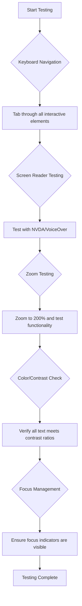
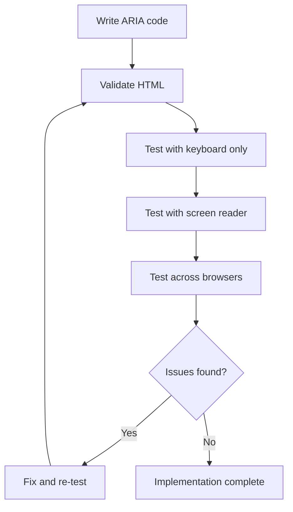

<!--
CO_OP_TRANSLATOR_METADATA:
{
  "original_hash": "90b19cde5b79b29e91babd3138cd8035",
  "translation_date": "2025-10-24T20:49:21+00:00",
  "source_file": "1-getting-started-lessons/3-accessibility/README.md",
  "language_code": "cs"
}
-->
# Vytváření přístupných webových stránek


> Sketchnote od [Tomomi Imura](https://twitter.com/girlie_mac)

## Kvíz před lekcí
[Kvíz před lekcí](https://ff-quizzes.netlify.app/web/)

> Síla webu spočívá v jeho univerzálnosti. Přístup pro všechny, bez ohledu na postižení, je zásadní aspekt.
>
> \- Sir Timothy Berners-Lee, ředitel W3C a vynálezce World Wide Webu

Možná vás to překvapí: když vytváříte přístupné webové stránky, nepomáháte jen lidem s postižením – ve skutečnosti zlepšujete web pro všechny!

Všimli jste si někdy těch snížených obrubníků na rohu ulic? Původně byly navrženy pro vozíčkáře, ale nyní pomáhají lidem s kočárky, doručovatelům s vozíky, cestovatelům s kufry na kolečkách a také cyklistům. Přesně tak funguje přístupný webový design – řešení, která pomáhají jedné skupině, často nakonec prospívají všem. Docela cool, že?

V této lekci se podíváme na to, jak vytvářet webové stránky, které skutečně fungují pro všechny, bez ohledu na to, jak procházejí web. Objevíte praktické techniky, které jsou již zabudovány do webových standardů, vyzkoušíte si testovací nástroje a uvidíte, jak přístupnost zlepšuje použitelnost vašich stránek pro všechny uživatele.

Na konci této lekce budete mít jistotu, že přístupnost se stane přirozenou součástí vašeho vývojového procesu. Připraveni prozkoumat, jak promyšlené designové volby mohou otevřít web miliardám uživatelů? Pojďme na to!

> Tuto lekci si můžete projít na [Microsoft Learn](https://docs.microsoft.com/learn/modules/web-development-101/accessibility/?WT.mc_id=academic-77807-sagibbon)!

## Porozumění asistivním technologiím

Než se pustíme do kódování, pojďme si chvíli uvědomit, jak lidé s různými schopnostmi skutečně zažívají web. Nejde jen o teorii – pochopení těchto reálných navigačních vzorců z vás udělá mnohem lepšího vývojáře!

Asistivní technologie jsou úžasné nástroje, které pomáhají lidem s postižením interagovat s webovými stránkami způsoby, které vás možná překvapí. Jakmile pochopíte, jak tyto technologie fungují, vytváření přístupných webových zážitků se stane mnohem intuitivnějším. Je to jako naučit se vidět svůj kód očima někoho jiného.

### Čtečky obrazovky

[Čtečky obrazovky](https://en.wikipedia.org/wiki/Screen_reader) jsou velmi sofistikované technologie, které převádějí digitální text na hlasový výstup nebo výstup v Braillově písmu. I když jsou primárně používány lidmi se zrakovým postižením, jsou také velmi užitečné pro uživatele s poruchami učení, jako je dyslexie.

Rád přirovnávám čtečku obrazovky k velmi chytrému vypravěči, který vám čte knihu. Čte obsah nahlas v logickém pořadí, oznamuje interaktivní prvky jako „tlačítko“ nebo „odkaz“ a poskytuje klávesové zkratky pro pohyb po stránce. Ale tady je ten háček – čtečky obrazovky mohou fungovat jen tehdy, pokud vytváříme webové stránky se správnou strukturou a smysluplným obsahem. A to je vaše role jako vývojáře!

**Populární čtečky obrazovky na různých platformách:**
- **Windows**: [NVDA](https://www.nvaccess.org/about-nvda/) (zdarma a nejpopulárnější), [JAWS](https://webaim.org/articles/jaws/), [Narrator](https://support.microsoft.com/windows/complete-guide-to-narrator-e4397a0d-ef4f-b386-d8ae-c172f109bdb1/?WT.mc_id=academic-77807-sagibbon) (vestavěný)
- **macOS/iOS**: [VoiceOver](https://support.apple.com/guide/voiceover/welcome/10) (vestavěný a velmi schopný)
- **Android**: [TalkBack](https://support.google.com/accessibility/android/answer/6283677) (vestavěný)
- **Linux**: [Orca](https://wiki.gnome.org/Projects/Orca) (zdarma a open-source)

**Jak čtečky obrazovky navigují webový obsah:**

Čtečky obrazovky poskytují několik navigačních metod, které umožňují efektivní procházení zkušeným uživatelům:
- **Sekvenční čtení**: Čte obsah shora dolů, jako při čtení knihy
- **Navigace podle orientačních bodů**: Přeskakuje mezi sekcemi stránky (hlavička, navigace, hlavní obsah, patička)
- **Navigace podle nadpisů**: Přeskakuje mezi nadpisy pro pochopení struktury stránky
- **Seznam odkazů**: Generuje seznam všech odkazů pro rychlý přístup
- **Ovládací prvky formulářů**: Naviguje přímo mezi vstupními poli a tlačítky

> 💡 **Zajímavost**: 68 % uživatelů čteček obrazovky naviguje primárně podle nadpisů ([WebAIM Survey](https://webaim.org/projects/screenreadersurvey9/#finding)). To znamená, že vaše struktura nadpisů je jako mapa pro uživatele – když ji uděláte správně, doslova pomáháte lidem rychleji najít cestu vaším obsahem!

### Budování testovacího workflow

Dobrá zpráva – efektivní testování přístupnosti nemusí být ohromující! Budete chtít kombinovat automatizované nástroje (jsou skvělé na odhalování zjevných problémů) s ručním testováním. Zde je systematický přístup, který podle mých zkušeností zachytí většinu problémů, aniž by vám zabral celý den:

**Základní workflow pro ruční testování:**



**Kontrolní seznam kroků testování:**
1. **Navigace pomocí klávesnice**: Používejte pouze klávesy Tab, Shift+Tab, Enter, Space a šipky
2. **Testování čtečky obrazovky**: Zapněte NVDA, VoiceOver nebo Narrator a navigujte se zavřenýma očima
3. **Testování přiblížení**: Testujte při úrovních přiblížení 200 % a 400 %
4. **Ověření kontrastu barev**: Zkontrolujte veškerý text a komponenty uživatelského rozhraní
5. **Testování indikátoru zaostření**: Ujistěte se, že všechny interaktivní prvky mají viditelné stavy zaostření

✅ **Začněte s Lighthouse**: Otevřete DevTools svého prohlížeče, spusťte audit přístupnosti Lighthouse a použijte výsledky k zaměření na oblasti ručního testování.

### Nástroje pro přiblížení a zvětšení

Víte, jak si někdy přiblížíte text na telefonu, když je příliš malý, nebo mžouráte na obrazovku notebooku na jasném slunci? Mnoho uživatelů spoléhá na nástroje pro zvětšení, aby byl obsah čitelný každý den. To zahrnuje lidi se slabým zrakem, starší dospělé a kohokoli, kdo se někdy pokusil číst webovou stránku venku.

Moderní technologie přiblížení se vyvinuly nad rámec pouhého zvětšování. Pochopení, jak tyto nástroje fungují, vám pomůže vytvářet responzivní designy, které zůstávají funkční a atraktivní na jakékoli úrovni zvětšení.

**Moderní schopnosti přiblížení v prohlížečích:**
- **Přiblížení stránky**: Proporcionálně zvětšuje veškerý obsah (text, obrázky, rozvržení) – preferovaná metoda
- **Pouze textové přiblížení**: Zvětšuje velikost písma při zachování původního rozvržení
- **Přiblížení gestem**: Podpora mobilních gest pro dočasné zvětšení
- **Podpora prohlížečů**: Všechny moderní prohlížeče podporují přiblížení až na 500 % bez narušení funkčnosti

**Specializovaný software pro zvětšení:**
- **Windows**: [Lupa](https://support.microsoft.com/windows/use-magnifier-to-make-things-on-the-screen-easier-to-see-414948ba-8b1c-d3bd-8615-0e5e32204198) (vestavěná), [ZoomText](https://www.freedomscientific.com/training/zoomtext/getting-started/)
- **macOS/iOS**: [Zoom](https://www.apple.com/accessibility/mac/vision/) (vestavěný s pokročilými funkcemi)

> ⚠️ **Designová úvaha**: WCAG vyžaduje, aby obsah zůstal funkční při přiblížení na 200 %. Na této úrovni by horizontální posouvání mělo být minimální a všechny interaktivní prvky by měly zůstat přístupné.

✅ **Otestujte svůj responzivní design**: Přibližte svůj prohlížeč na 200 % a 400 %. Přizpůsobí se vaše rozvržení elegantně? Můžete stále přistupovat ke všem funkcím bez nadměrného posouvání?

## Moderní nástroje pro testování přístupnosti

Nyní, když rozumíte tomu, jak lidé navigují web pomocí asistivních technologií, pojďme prozkoumat nástroje, které vám pomohou vytvářet a testovat přístupné webové stránky.

Představte si to takto: automatizované nástroje jsou skvělé na odhalování zjevných problémů (jako chybějící alt text), zatímco ruční testování vám pomůže zajistit, že váš web bude v reálném světě příjemný na používání. Společně vám dávají jistotu, že vaše stránky fungují pro všechny.

### Testování kontrastu barev

Dobrá zpráva: kontrast barev je jedním z nejčastějších problémů přístupnosti, ale také jedním z nejsnadněji řešitelných. Dobrý kontrast prospívá všem – od uživatelů se zrakovým postižením až po lidi, kteří se snaží číst své telefony na pláži.

**Požadavky na kontrast podle WCAG:**

| Typ textu | WCAG AA (minimální) | WCAG AAA (vylepšený) |
|-----------|---------------------|---------------------|
| **Normální text** (pod 18pt) | Poměr kontrastu 4,5:1 | Poměr kontrastu 7:1 |
| **Velký text** (18pt+ nebo 14pt+ tučný) | Poměr kontrastu 3:1 | Poměr kontrastu 4,5:1 |
| **Komponenty UI** (tlačítka, okraje formulářů) | Poměr kontrastu 3:1 | Poměr kontrastu 3:1 |

**Základní nástroje pro testování:**
- [Colour Contrast Analyser](https://www.tpgi.com/color-contrast-checker/) - Desktopová aplikace s výběrem barev
- [WebAIM Contrast Checker](https://webaim.org/resources/contrastchecker/) - Webová aplikace s okamžitou zpětnou vazbou
- [Stark](https://www.getstark.co/) - Plugin pro designové nástroje jako Figma, Sketch, Adobe XD
- [Accessible Colors](https://accessible-colors.com/) - Najděte přístupné barevné palety

✅ **Vytvářejte lepší barevné palety**: Začněte s barvami své značky a použijte kontrolory kontrastu k vytvoření přístupných variant. Dokumentujte je jako přístupné barevné tokeny vašeho designového systému.

### Komplexní audit přístupnosti

Nejúčinnější testování přístupnosti kombinuje více přístupů. Žádný jediný nástroj nezachytí vše, takže vytvoření testovací rutiny s různými metodami zajišťuje důkladné pokrytí.

**Testování v prohlížeči (vestavěné v DevTools):**
- **Chrome/Edge**: Audit přístupnosti Lighthouse + panel Přístupnosti
- **Firefox**: Inspektor přístupnosti s podrobným stromovým zobrazením
- **Safari**: Záložka Audit v Web Inspectoru se simulací VoiceOveru

**Profesionální testovací rozšíření:**
- [axe DevTools](https://www.deque.com/axe/devtools/) - Průmyslový standard pro automatizované testování
- [WAVE](https://wave.webaim.org/extension/) - Vizuální zpětná vazba s označením chyb
- [Accessibility Insights](https://accessibilityinsights.io/) - Komplexní testovací sada od Microsoftu

**Příkazový řádek a integrace CI/CD:**
- [axe-core](https://github.com/dequelabs/axe-core) - Knihovna JavaScriptu pro automatizované testování
- [Pa11y](https://pa11y.org/) - Nástroj pro testování přístupnosti v příkazovém řádku
- [Lighthouse CI](https://github.com/GoogleChrome/lighthouse-ci) - Automatizované hodnocení přístupnosti

> 🎯 **Cíl testování**: Snažte se dosáhnout skóre přístupnosti Lighthouse 95+ jako základní úrovně. Pamatujte, že automatizované nástroje zachytí pouze asi 30–40 % problémů s přístupností – ruční testování je stále nezbytné!

## Budování přístupnosti od základů

Klíčem k úspěchu v přístupnosti je začlenit ji do základů od prvního dne. Vím, že je lákavé si říct „přístupnost přidám později“, ale to je jako snažit se přidat rampu k domu až po jeho postavení. Je to možné? Ano. Snadné? Ani ne.

Představte si přístupnost jako plánování domu – je mnohem snazší zahrnout přístupnost pro vozíčkáře do vašich počátečních architektonických plánů, než vše později přestavovat.

### Principy POUR: Základ vaší přístupnosti

Pokyny pro přístupnost webového obsahu (WCAG) jsou postaveny na čtyřech základních principech, které tvoří zkratku POUR. Nebojte se – nejde o nudné akademické koncepty! Jsou to praktické pokyny pro vytváření obsahu, který funguje pro všechny.

Jakmile si osvojíte POUR, rozhodování o přístupnosti se stane mnohem intuitivnějším. Je to jako mít mentální kontrolní seznam, který vás vede při designových volbách. Pojďme si je rozebrat:

**🔍 Vnímatelné**: Informace musí být prezentovány způsoby, které uživatelé mohou vnímat svými dostupnými smysly

- Poskytněte textové alternativy pro netextový obsah (obrázky, videa, zvuk)
- Zajistěte dostatečný kontrast barev pro veškerý text a komponenty UI
- Nabídněte titulky a přepisy pro multimediální obsah
- Navrhněte obsah, který zůstane funkční při zvětšení až na 200 %
- Používejte více smyslových charakteristik (nejen barvu) k předávání informací

**🎮 Ovládatelné**: Všechny prvky rozhraní musí být ovladatelné dostupnými vstupními metodami

- Zajistěte, aby všechny funkce byly přístupné pomocí klávesnice
- Poskytněte uživatelům dostatek času na čtení a interakci s obsahem
- Vyhněte se obsahu, který způsobuje záchvaty nebo vestibulární poruchy
- Pomozte uživatelům efektivně navigovat pomocí jasné struktury a orientačních bodů
- Zajistěte, aby interaktivní prvky měly dostatečnou velikost (minimálně 44px)

**📖 Srozumitelné**: Informace a ovládání UI musí být jasné a pochopitelné

- Používejte jasný, jednoduchý jazyk vhodný pro vaše publikum
- Zajistěte, aby obsah vypadal a fungoval předvídatelně a konzistentně
- Poskytněte jasné instrukce a ch
Barva je silným nástrojem pro komunikaci, ale nikdy by neměla být jediným způsobem, jak předáváte důležité informace. Navrhování nad rámec barev vytváří robustnější a inkluzivnější zážitky, které fungují v různých situacích.

**Navrhování pro rozdíly ve vnímání barev:**

Přibližně 8 % mužů a 0,5 % žen má nějakou formu rozdílu ve vnímání barev (často nazývané "barvoslepost"). Nejčastější typy jsou:
- **Deuteranopie**: Obtížné rozlišování červené a zelené
- **Protanopie**: Červená se jeví jako tmavší
- **Tritanopie**: Obtíže s modrou a žlutou (vzácné)

**Strategie inkluzivního použití barev:**

```css
/* ❌ Bad: Using only color to indicate status */
.error { color: red; }
.success { color: green; }

/* ✅ Good: Color plus icons and context */
.error {
  color: #d32f2f;
  border-left: 4px solid #d32f2f;
}
.error::before {
  content: "⚠️";
  margin-right: 8px;
}

.success {
  color: #2e7d32;
  border-left: 4px solid #2e7d32;
}
.success::before {
  content: "✅";
  margin-right: 8px;
}
```

**Nad rámec základních požadavků na kontrast:**
- Testujte své barevné volby pomocí simulátorů barvosleposti
- Používejte vzory, textury nebo tvary vedle barevného kódování
- Zajistěte, aby interaktivní stavy byly rozlišitelné i bez barev
- Zvažte, jak váš design vypadá v režimu vysokého kontrastu

✅ **Otestujte přístupnost barev**: Použijte nástroje jako [Coblis](https://www.color-blindness.com/coblis-color-blindness-simulator/), abyste viděli, jak váš web vypadá pro uživatele s různými typy vnímání barev.

### Indikátory zaměření a návrh interakcí

Indikátory zaměření jsou digitálním ekvivalentem kurzoru – ukazují uživatelům klávesnice, kde se na stránce nacházejí. Dobře navržené indikátory zaměření zlepšují zážitek pro všechny tím, že činí interakce jasnými a předvídatelnými.

**Moderní osvědčené postupy pro indikátory zaměření:**

```css
/* Enhanced focus styles that work across browsers */
button:focus-visible {
  outline: 2px solid #0066cc;
  outline-offset: 2px;
  box-shadow: 0 0 0 4px rgba(0, 102, 204, 0.25);
}

/* Remove focus outline for mouse users, preserve for keyboard users */
button:focus:not(:focus-visible) {
  outline: none;
}

/* Focus-within for complex components */
.card:focus-within {
  box-shadow: 0 0 0 3px rgba(74, 144, 164, 0.5);
  border-color: #4A90A4;
}

/* Ensure focus indicators meet contrast requirements */
.custom-focus:focus-visible {
  outline: 3px solid #ffffff;
  outline-offset: 2px;
  box-shadow: 0 0 0 6px #000000;
}
```

**Požadavky na indikátory zaměření:**
- **Viditelnost**: Musí mít minimální kontrastní poměr 3:1 vůči okolním prvkům
- **Šířka**: Minimálně 2px tloušťka kolem celého prvku
- **Trvalost**: Měly by zůstat viditelné, dokud se zaměření nepřesune jinam
- **Rozlišení**: Musí být vizuálně odlišné od ostatních stavů uživatelského rozhraní

> 💡 **Tip pro návrh**: Skvělé indikátory zaměření často kombinují obrys, stín a změny barvy, aby zajistily viditelnost na různých pozadích a v různých kontextech.

✅ **Proveďte audit indikátorů zaměření**: Procházejte svůj web pomocí klávesy Tab a zaznamenejte, které prvky mají jasné indikátory zaměření. Jsou některé obtížně viditelné nebo zcela chybí?

### Sémantické HTML: Základ přístupnosti

Sémantické HTML je jako poskytnutí GPS systému pro asistivní technologie na vašem webu. Když používáte správné HTML prvky pro jejich zamýšlený účel, v podstatě poskytujete čtečkám obrazovky, klávesnicím a dalším nástrojům podrobnou mapu, která pomáhá uživatelům efektivně navigovat.

Tady je analogie, která mi opravdu sedla: sémantické HTML je rozdíl mezi dobře organizovanou knihovnou s jasnými kategoriemi a užitečnými značkami versus skladištěm, kde jsou knihy rozházené náhodně. Obě místa mají stejné knihy, ale kde byste raději něco hledali? Přesně tak!

**Stavební kameny přístupné struktury stránky:**

```html
<!-- Landmark elements provide page navigation structure -->
<header>
  <h1>Your Site Name</h1>
  <nav aria-label="Main navigation">
    <ul>
      <li><a href="/home">Home</a></li>
      <li><a href="/about">About</a></li>
      <li><a href="/services">Services</a></li>
    </ul>
  </nav>
</header>

<main>
  <article>
    <header>
      <h1>Article Title</h1>
      <p>Published on <time datetime="2024-10-14">October 14, 2024</time></p>
    </header>
    
    <section>
      <h2>First Section</h2>
      <p>Content that relates to this section...</p>
    </section>
    
    <section>
      <h2>Second Section</h2>
      <p>More related content...</p>
    </section>
  </article>
  
  <aside>
    <h2>Related Links</h2>
    <nav aria-label="Related articles">
      <ul>
        <li><a href="/related-1">First related article</a></li>
        <li><a href="/related-2">Second related article</a></li>
      </ul>
    </nav>
  </aside>
</main>

<footer>
  <p>&copy; 2024 Your Site Name. All rights reserved.</p>
  <nav aria-label="Footer links">
    <ul>
      <li><a href="/privacy">Privacy Policy</a></li>
      <li><a href="/contact">Contact Us</a></li>
    </ul>
  </nav>
</footer>
```

**Proč sémantické HTML mění přístupnost:**

| Sémantický prvek | Účel | Výhoda pro čtečky obrazovky |
|------------------|---------|----------------------|
| `<header>` | Hlavička stránky nebo sekce | "Banner landmark" - rychlá navigace na začátek |
| `<nav>` | Navigační odkazy | "Navigation landmark" - seznam navigačních sekcí |
| `<main>` | Primární obsah stránky | "Main landmark" - přímý přechod na obsah |
| `<article>` | Samostatný obsah | Označuje hranice článku |
| `<section>` | Tematické skupiny obsahu | Poskytuje strukturu obsahu |
| `<aside>` | Související obsah na bočním panelu | "Complementary landmark" |
| `<footer>` | Patička stránky nebo sekce | "Contentinfo landmark" |

**Super schopnosti čteček obrazovky se sémantickým HTML:**
- **Navigace podle orientačních bodů**: Okamžitý přechod mezi hlavními sekcemi stránky
- **Obrysy nadpisů**: Generování obsahu z vaší struktury nadpisů
- **Seznamy prvků**: Vytváření seznamů všech odkazů, tlačítek nebo ovládacích prvků formuláře
- **Povědomí o kontextu**: Porozumění vztahům mezi sekcemi obsahu

> 🎯 **Rychlý test**: Zkuste navigovat na svém webu pomocí čtečky obrazovky a zkratky pro orientační body (D pro orientační bod, H pro nadpis, K pro odkaz v NVDA/JAWS). Dává navigace smysl?

✅ **Proveďte audit své sémantické struktury**: Použijte panel Přístupnosti v nástrojích pro vývojáře vašeho prohlížeče k zobrazení stromu přístupnosti a ověřte, zda vaše značení vytváří logickou strukturu.

### Hierarchie nadpisů: Vytvoření logického obrysu obsahu

Nadpisy jsou naprosto klíčové pro přístupný obsah – jsou jako páteř, která vše drží pohromadě. Uživatelé čteček obrazovky se silně spoléhají na nadpisy, aby porozuměli a navigovali ve vašem obsahu. Představte si to jako poskytování obsahu stránky ve formě tabulky.

**Zlaté pravidlo pro nadpisy:**
Nikdy nepřeskakujte úrovně. Vždy postupujte logicky od `<h1>` k `<h2>` k `<h3>` a tak dále. Pamatujete si, jak jste ve škole dělali osnovy? Je to přesně stejný princip – nepřeskočili byste z "I. Hlavní bod" rovnou na "C. Pod-pod-bod" bez "A. Pod-bodu" mezi tím, že?

**Příklad dokonalé struktury nadpisů:**

```html
<!-- ✅ Excellent: Logical, hierarchical progression -->
<main>
  <h1>Complete Guide to Web Accessibility</h1>
  
  <section>
    <h2>Understanding Screen Readers</h2>
    <p>Introduction to screen reader technology...</p>
    
    <h3>Popular Screen Reader Software</h3>
    <p>NVDA, JAWS, and VoiceOver comparison...</p>
    
    <h3>Testing with Screen Readers</h3>
    <p>Step-by-step testing instructions...</p>
  </section>
  
  <section>
    <h2>Color and Contrast Guidelines</h2>
    <p>Designing with sufficient contrast...</p>
    
    <h3>WCAG Contrast Requirements</h3>
    <p>Understanding the different contrast levels...</p>
    
    <h3>Testing Tools and Techniques</h3>
    <p>Tools for verifying contrast ratios...</p>
  </section>
</main>
```

```html
<!-- ❌ Problematic: Skipping levels, inconsistent structure -->
<h1>Page Title</h1>
<h3>Subsection</h3> <!-- Skipped h2 -->
<h2>This should come before h3</h2>
<h1>Another main heading?</h1> <!-- Multiple h1s -->
```

**Osvědčené postupy pro nadpisy:**
- **Jeden `<h1>` na stránku**: Obvykle hlavní název stránky nebo primární nadpis obsahu
- **Logický postup**: Nikdy nepřeskakujte úrovně (h1 → h2 → h3, ne h1 → h3)
- **Popisný obsah**: Udělejte nadpisy smysluplné, i když jsou čteny mimo kontext
- **Vizuální stylizace pomocí CSS**: Používejte CSS pro vzhled, úrovně HTML pro strukturu

**Statistiky navigace čteček obrazovky:**
- 68 % uživatelů čteček obrazovky naviguje podle nadpisů ([WebAIM Survey](https://webaim.org/projects/screenreadersurvey9/#finding))
- Uživatelé očekávají logický obrys nadpisů
- Nadpisy poskytují nejrychlejší způsob, jak pochopit strukturu stránky

> 💡 **Profesionální tip**: Použijte rozšíření prohlížeče jako "HeadingsMap" k vizualizaci struktury vašich nadpisů. Měla by vypadat jako dobře organizovaná tabulka obsahu.

✅ **Otestujte strukturu nadpisů**: Použijte navigaci nadpisů čtečky obrazovky (klávesa H v NVDA) k přechodu mezi nadpisy. Vypráví postup logický příběh vašeho obsahu?

### Pokročilé techniky vizuální přístupnosti

Nad rámec základů kontrastu a barev existují sofistikované techniky, které pomáhají vytvářet skutečně inkluzivní vizuální zážitky. Tyto metody zajišťují, že váš obsah funguje v různých podmínkách zobrazení a s asistivními technologiemi.

**Základní strategie vizuální komunikace:**

- **Multimodální zpětná vazba**: Kombinujte vizuální, textové a někdy i zvukové podněty
- **Postupné odhalování informací**: Prezentujte informace v stravitelných částech
- **Konzistentní vzory interakcí**: Používejte známé konvence uživatelského rozhraní
- **Responzivní typografie**: Přizpůsobte velikost textu různým zařízením
- **Stavy načítání a chyb**: Poskytněte jasnou zpětnou vazbu pro všechny uživatelské akce

**CSS nástroje pro zlepšení přístupnosti:**

```css
/* Screen reader only text - visually hidden but accessible */
.sr-only {
  position: absolute;
  width: 1px;
  height: 1px;
  padding: 0;
  margin: -1px;
  overflow: hidden;
  clip: rect(0, 0, 0, 0);
  white-space: nowrap;
  border: 0;
}

/* Skip link for keyboard navigation */
.skip-link {
  position: absolute;
  top: -40px;
  left: 6px;
  background: #000000;
  color: #ffffff;
  padding: 8px 16px;
  text-decoration: none;
  border-radius: 4px;
  font-weight: bold;
  transition: top 0.3s ease;
  z-index: 1000;
}

.skip-link:focus {
  top: 6px;
}

/* Reduced motion respect */
@media (prefers-reduced-motion: reduce) {
  .skip-link {
    transition: none;
  }
  
  * {
    animation-duration: 0.01ms !important;
    animation-iteration-count: 1 !important;
    transition-duration: 0.01ms !important;
  }
}

/* High contrast mode support */
@media (prefers-contrast: high) {
  .button {
    border: 2px solid;
  }
}
```

> 🎯 **Vzor přístupnosti**: "Přeskočit odkaz" je nezbytný pro uživatele klávesnice. Měl by být prvním zaostřitelným prvkem na vaší stránce a umožnit přímý přechod na hlavní obsah.

✅ **Implementujte navigaci přeskočení**: Přidejte na své stránky odkazy pro přeskočení a otestujte je stisknutím klávesy Tab ihned po načtení stránky. Měly by se objevit a umožnit vám přejít na hlavní obsah.

## Tvorba smysluplného textu odkazů

Odkazy jsou v podstatě dálnice internetu, ale špatně napsaný text odkazu je jako mít dopravní značky, které říkají jen "Místo" místo "Centrum Chicaga". Moc užitečné, že?

Tady je něco, co mě ohromilo, když jsem se to poprvé dozvěděl: čtečky obrazovky mohou extrahovat všechny odkazy ze stránky a zobrazit je jako jeden velký seznam. Představte si, že vám někdo podá adresář všech odkazů na vaší stránce. Dával by každý z nich smysl sám o sobě? To je test, kterým musí váš text odkazu projít!

### Porozumění vzorům navigace odkazů

Čtečky obrazovky nabízejí výkonné funkce navigace odkazů, které závisí na dobře napsaném textu odkazu:

**Metody navigace odkazů:**
- **Sekvenční čtení**: Odkazy jsou čteny v kontextu jako součást toku obsahu
- **Generování seznamu odkazů**: Všechny odkazy na stránce jsou sestaveny do vyhledatelného adresáře
- **Rychlá navigace**: Přechod mezi odkazy pomocí klávesových zkratek (K v NVDA)
- **Funkce vyhledávání**: Hledání konkrétních odkazů zadáním částečného textu

**Proč je kontext důležitý:**
Když uživatelé čteček obrazovky generují seznam odkazů, vidí něco jako:
- "Stáhnout zprávu"
- "Zjistit více"
- "Klikněte zde"
- "Zásady ochrany osobních údajů"
- "Klikněte zde"

Pouze dva z těchto odkazů poskytují užitečné informace, když jsou čteny mimo kontext!

> 📊 **Dopad na uživatele**: Uživatelé čteček obrazovky procházejí seznamy odkazů, aby rychle pochopili obsah stránky. Obecný text odkazu je nutí vracet se zpět k okolnímu kontextu každého odkazu, což výrazně zpomaluje jejich procházení.

### Běžné chyby v textu odkazů, kterým se vyhnout

Pochopení toho, co nefunguje, vám pomůže rozpoznat a opravit problémy s přístupností ve stávajícím obsahu.

**❌ Obecný text odkazu, který neposkytuje žádný kontext:**

```html
<!-- Meaningless when read from a link list -->
<p>Our sustainability efforts are detailed in our recent report. 
   <a href="/sustainability-2024.pdf">Click here</a> to view it.</p>

<!-- Repeated generic text throughout the page -->
<div class="article-card">
  <h3>Web Accessibility Guide</h3>
  <p>Learn the fundamentals...</p>
  <a href="/accessibility-guide">Read more</a>
</div>
<div class="article-card">
  <h3>Color Contrast Tips</h3>
  <p>Improve your design...</p>
  <a href="/color-contrast">Read more</a>
</div>

<!-- URLs as link text (difficult for screen readers to announce) -->
<p>Visit https://www.w3.org/WAI/WCAG21/quickref/ for WCAG guidelines.</p>

<!-- Vague action words -->
<a href="/contact">Go</a> | <a href="/about">See</a> | <a href="/help">View</a>
```

**Proč tyto vzory selhávají:**
- **"Klikněte zde"** uživatelům nic neříká o cíli
- **"Zjistit více"** opakované několikrát způsobuje zmatek
- **Surové URL adresy** jsou pro čtečky obrazovky obtížně srozumitelné
- **Jednotlivá slova** jako "Jít" nebo "Vidět" postrádají popisný kontext

### Psaní vynikajícího textu odkazů

Popisný text odkazu prospívá všem – uživatelé s dobrým zrakem mohou rychle procházet odkazy a uživatelé čteček obrazovky okamžitě pochopí cíle.

**✅ Příklady jasného, popisného textu odkazu:**

```html
<!-- Descriptive text that explains the destination -->
<p>Our comprehensive <a href="/sustainability-2024.pdf">2024 sustainability report (PDF, 2.1MB)</a> details our environmental initiatives.</p>

<!-- Specific, unique link text for each card -->
<div class="article-card">
  <h3>Web Accessibility Guide</h3>
  <p>Learn the fundamentals of inclusive design...</p>
  <a href="/accessibility-guide">Read our complete web accessibility guide</a>
</div>
<div class="article-card">
  <h3>Color Contrast Tips</h3>
  <p>Improve your design with better color choices...</p>
  <a href="/color-contrast">Explore color contrast best practices</a>
</div>

<!-- Meaningful text instead of raw URLs -->
<p>The <a href="https://www.w3.org/WAI/WCAG21/quickref/">WCAG 2.1 Quick Reference guide</a> provides comprehensive accessibility guidelines.</p>

<!-- Descriptive action links -->
<a href="/contact">Contact our support team</a> | 
<a href="/about">About our company</a> | 
<a href="/help">Get help with your account</a>
```

**Osvědčené postupy pro text odkazu:**
- **Buďte konkrétní**: "Stáhnout čtvrtletní finanční zprávu" vs. "Stáhnout"
- **Uveďte typ souboru a velikost**: "(PDF, 1.2MB)" u stahovatelných souborů
- **Zmiňte, zda odkazy otevírají externě**: "(otevře se v novém okně)" pokud je to vhodné
- **Používejte aktivní jazyk**: "Kontaktujte nás" vs. "Kontaktní stránka"
- **Buďte struční**: Snažte se o 2-8 slov, pokud je to možné

### Pokročilé vzory přístupnosti odkazů

Někdy vizuální designová omezení nebo technické požadavky vyžadují speciální řešení. Zde jsou sofistikované techniky pro běžné náročné scénáře:

**Použití ARIA pro rozšířený kontext:**

```html
<!-- When button text must be short but needs more context -->
<a href="/report.pdf" 
   aria-label="Download 2024 annual financial report, PDF format, 2.3MB">
  Download Report
</a>

<!-- When the full context comes from surrounding content -->
<h3 id="sustainability-heading">Sustainability Initiative</h3>
<p>Our efforts to reduce environmental impact...</p>
<a href="/sustainability-details" 
   aria-labelledby="sustainability-heading"
   aria-describedby="sustainability-summary">
  Learn more
</a>
<p id="sustainability-summary">Detailed breakdown of our 2024 environmental goals and achievements</p>
```

**Indikace typů souborů a externích cílů:**

```html
<!-- Method 1: Include information in visible link text -->
<a href="/annual-report.pdf">
  Download our 2024 annual report (PDF, 2.3MB)
</a>

<!-- Method 2: Use screen reader-only text for file details -->
<a href="/annual-report.pdf">
  Download our 2024 annual report
  <span class="sr-only">(PDF format, 2.3MB)</span>
</a>

<!-- Method 3: External link indication -->
<a href="https://example.com" 
   target="_blank" 
   aria-describedby="external-link-warning">
  Visit external resource
</a>
<span id="external-link-warning" class="sr-only">
  (opens in new window)
</span>

<!-- Method 4: Using CSS for visual indicators -->
<a href="https://example.com" class="external-link">
  External resource
</a>
```

```css
/* Visual indicator for external links */
.external-link::after {
  content: " ↗";
  font-size: 0.8em;
  color: #666;
}

/* Screen reader announcement for external links */
.external-link::before {
  content: "External link: ";
  position: absolute;
  left: -10000px;
  width: 1px;
  height: 1px;
  overflow: hidden;
}
```

> ⚠️ **Důležité**: Při použití `target="_blank"` vždy informujte uživatele, že odkaz se otevře v novém okně nebo záložce. Neočekávané změny navigace mohou být matoucí.

✅ **Otestujte kontext odkazů**: Použijte nástroje pro vývojáře vašeho prohlížeče k vytvoření seznamu všech odkazů na stránce. Rozumíte účelu každého odkazu bez okolního kontextu?

## ARIA: Supernabíjení přístupnosti HTML

[Accessible Rich Internet Applications (ARIA)](https://developer.mozilla.org/docs/Web/Accessibility/ARIA) je jako univerzální překladač mezi vašimi složitými webovými aplikacemi a asistivními technologiemi. Když samotné HTML nemůže vyjádřit vše, co vaše interaktivní komponenty dělají, ARIA přichází na pomoc.

Rád si ARIA představuji jako přidávání užitečných poznámek k vašemu HTML – něco jako scénické poznámky ve scénáři, které pomáhají hercům pochopit jejich role a vztahy.

**Nejdůležitější pravidlo o ARIA**: Vždy používejte nejprve sémantické HTML, poté přidejte ARIA pro jeho rozšíření. Myslete na ARIA jako na koření, ne na hlavní chod. Mělo by objasnit a rozšířit strukturu HTML, nikdy ji nenahrazovat. Nejprve se ujistěte, že máte správný základ!

### Strategická implementace ARIA

ARIA je mocná, ale s mocí přichází odpovědnost. Nesprávné použití ARIA může přístupnost zhoršit více než její absence. Zde je, kdy a jak ji efektivně používat:

**✅ Použijte ARIA, když:**
- Vytváříte vlastní interaktivní widgety (akordeony, záložky, karusely)
- Budujete dynamický obsah, který se mění bez načítání stránky
- Poskytujete další kontext pro složité vztahy v uživatelském rozhraní
- Indikujete stavy načítání nebo živé aktualizace obsahu
- Vytváříte aplikace s vlastním ovládáním

**❌ Vyhněte se ARIA, když:**
- Standardní HTML prvky již poskytují potřebnou sémantiku
- Nejste si jisti, jak ji správně implementovat
- Duplikuje informace již poskyt
5. **Začněte jednoduše**: Složitější implementace ARIA mají větší pravděpodobnost chyb

**🔍 Testovací postup:**



**🚫 Běžné chyby při používání ARIA, kterým se vyhnout:**

- **Rozporuplné informace**: Nekolidujte se sémantikou HTML
- **Přehnané označování**: Příliš mnoho informací ARIA může uživatele zahltit
- **Statická ARIA**: Zapomenutí aktualizovat stavy ARIA při změně obsahu
- **Netestované implementace**: ARIA, která teoreticky funguje, ale v praxi selhává
- **Chybějící podpora klávesnice**: Role ARIA bez odpovídajících interakcí klávesnice

> 💡 **Testovací zdroje**: Používejte nástroje jako [accessibility-checker](https://www.npmjs.com/package/accessibility-checker) pro automatizovanou validaci ARIA, ale vždy testujte s reálnými čtečkami obrazovky pro kompletní zkušenost.

✅ **Učte se od odborníků**: Prostudujte [ARIA Authoring Practices Guide](https://w3c.github.io/aria-practices/) pro osvědčené vzory a implementace složitých interaktivních widgetů.

## Zpřístupnění obrázků a médií

Vizuální a zvukový obsah jsou klíčovou součástí moderních webových zážitků, ale mohou vytvářet bariéry, pokud nejsou implementovány promyšleně. Cílem je zajistit, aby informace a emocionální dopad vašeho média oslovily každého uživatele. Jakmile si to osvojíte, stane se to přirozeností.

Různé typy médií vyžadují různé přístupy k přístupnosti. Je to jako vaření—s jemnou rybou byste nezacházeli stejně jako s pořádným steakem. Porozumění těmto rozdílům vám pomůže vybrat správné řešení pro každou situaci.

### Strategická přístupnost obrázků

Každý obrázek na vašem webu má svůj účel. Porozumění tomuto účelu vám pomůže psát lepší alternativní texty a vytvářet inkluzivnější zážitky.

**Čtyři typy obrázků a jejich strategie pro alt text:**

**Informativní obrázky** - předávají důležité informace:
```html

```

**Dekorativní obrázky** - čistě vizuální bez informační hodnoty:
```html

```

**Funkční obrázky** - slouží jako tlačítka nebo ovládací prvky:
```html
<button>
  
</button>
```

**Složité obrázky** - grafy, diagramy, infografiky:
```html

<div id="chart-description">
  <p>Detailed description: Sales data shows a steady increase across all quarters...</p>
</div>
```

### Zpřístupnění videa a audia

**Požadavky na video:**
- **Titulky**: Textová verze mluveného obsahu a zvukových efektů
- **Zvukové popisy**: Vyprávění vizuálních prvků pro nevidomé uživatele
- **Přepisy**: Kompletní textová verze veškerého zvukového a vizuálního obsahu

```html
<video controls>
  <source src="video.mp4" type="video/mp4">
  <track kind="captions" src="captions.vtt" srclang="en" label="English">
  <track kind="descriptions" src="descriptions.vtt" srclang="en" label="Audio descriptions">
</video>
```

**Požadavky na audio:**
- **Přepisy**: Textová verze veškerého mluveného obsahu
- **Vizuální indikátory**: Pro obsah pouze se zvukem poskytněte vizuální nápovědu

### Moderní techniky pro obrázky

**Použití CSS pro dekorativní obrázky:**
```css
.hero-section {
  background-image: url('decorative-hero.jpg');
  /* Decorative images in CSS don't need alt text */
}
```

**Responzivní obrázky s přístupností:**
```html
<picture>
  <source media="(min-width: 800px)" srcset="large-chart.png">
  <source media="(min-width: 400px)" srcset="medium-chart.png">
  
</picture>
```

✅ **Testujte přístupnost obrázků**: Použijte čtečku obrazovky k navigaci na stránce s obrázky. Získáváte dostatek informací k pochopení obsahu?

## Navigace klávesnicí a správa zaostření

Mnoho uživatelů prochází web pouze pomocí klávesnice. To zahrnuje osoby s motorickým postižením, zkušené uživatele, kteří považují klávesnici za rychlejší než myš, a každého, komu přestala fungovat myš. Zajištění, že váš web dobře funguje s klávesnicí, je zásadní a často zefektivňuje váš web pro všechny.

### Základní vzory navigace klávesnicí

**Standardní interakce klávesnice:**
- **Tab**: Posun zaostření vpřed přes interaktivní prvky
- **Shift + Tab**: Posun zaostření zpět
- **Enter**: Aktivace tlačítek a odkazů
- **Mezerník**: Aktivace tlačítek, zaškrtnutí políček
- **Šipky**: Navigace v rámci skupin komponent (radiobuttony, nabídky)
- **Escape**: Zavření modálních oken, rozbalovacích nabídek nebo zrušení operací

### Nejlepší postupy pro správu zaostření

**Viditelné indikátory zaostření:**
```css
/* Ensure focus is always visible */
button:focus-visible {
  outline: 2px solid #4A90A4;
  outline-offset: 2px;
}

/* Custom focus styles for different components */
.card:focus-within {
  box-shadow: 0 0 0 3px rgba(74, 144, 164, 0.5);
}
```

**Odkazy pro přeskočení pro efektivní navigaci:**
```html
<a href="#main-content" class="skip-link">Skip to main content</a>
<a href="#navigation" class="skip-link">Skip to navigation</a>

<nav id="navigation">
  <!-- navigation content -->
</nav>
<main id="main-content">
  <!-- main content -->
</main>
```

**Správné pořadí zaostření:**
```html
<!-- Use semantic HTML for natural tab order -->
<form>
  <label for="name">Name:</label>
  <input type="text" id="name" tabindex="0">
  
  <label for="email">Email:</label>
  <input type="email" id="email" tabindex="0">
  
  <button type="submit" tabindex="0">Submit</button>
</form>
```

### Zachycení zaostření v modálních oknech

Při otevření modálních dialogů by mělo být zaostření zachyceno uvnitř modálního okna:

```javascript
// Modern focus trap implementation
function trapFocus(element) {
  const focusableElements = element.querySelectorAll(
    'button, [href], input, select, textarea, [tabindex]:not([tabindex="-1"])'
  );
  
  const firstElement = focusableElements[0];
  const lastElement = focusableElements[focusableElements.length - 1];

  element.addEventListener('keydown', (e) => {
    if (e.key === 'Tab') {
      if (e.shiftKey && document.activeElement === firstElement) {
        e.preventDefault();
        lastElement.focus();
      } else if (!e.shiftKey && document.activeElement === lastElement) {
        e.preventDefault();
        firstElement.focus();
      }
    }
    
    if (e.key === 'Escape') {
      closeModal();
    }
  });
  
  // Focus first element when modal opens
  firstElement.focus();
}
```

✅ **Testujte navigaci klávesnicí**: Zkuste navigovat na svém webu pouze pomocí klávesy Tab. Dostanete se ke všem interaktivním prvkům? Je pořadí zaostření logické? Jsou indikátory zaostření jasně viditelné?

## Přístupnost formulářů

Formuláře jsou klíčové pro interakci uživatelů a vyžadují zvláštní pozornost k přístupnosti.

### Asociace štítků a ovládacích prvků formuláře

**Každý ovládací prvek formuláře potřebuje štítek:**
```html
<!-- Explicit labeling (preferred) -->
<label for="username">Username:</label>
<input type="text" id="username" name="username" required>

<!-- Implicit labeling -->
<label>
  Password:
  <input type="password" name="password" required>
</label>

<!-- Using aria-label when visual label isn't desired -->
<input type="search" aria-label="Search products" placeholder="Search...">
```

### Zpracování chyb a validace

**Přístupné chybové zprávy:**
```html
<label for="email">Email Address:</label>
<input type="email" id="email" name="email" 
       aria-describedby="email-error" 
       aria-invalid="true" required>
<div id="email-error" role="alert">
  Please enter a valid email address
</div>
```

**Nejlepší postupy pro validaci formulářů:**
- Použijte `aria-invalid` k označení neplatných polí
- Poskytněte jasné, konkrétní chybové zprávy
- Použijte `role="alert"` pro důležitá oznámení o chybách
- Zobrazte chyby jak okamžitě, tak při odeslání formuláře

### Skupiny polí a jejich seskupení

**Seskupte související ovládací prvky formuláře:**
```html
<fieldset>
  <legend>Shipping Address</legend>
  <label for="street">Street Address:</label>
  <input type="text" id="street" name="street">
  
  <label for="city">City:</label>
  <input type="text" id="city" name="city">
</fieldset>

<fieldset>
  <legend>Preferred Contact Method</legend>
  <input type="radio" id="contact-email" name="contact" value="email">
  <label for="contact-email">Email</label>
  
  <input type="radio" id="contact-phone" name="contact" value="phone">
  <label for="contact-phone">Phone</label>
</fieldset>
```

## Vaše cesta k přístupnosti: Klíčové poznatky

Gratulujeme! Právě jste získali základní znalosti pro vytváření skutečně inkluzivních webových zážitků. To je docela vzrušující! Webová přístupnost není jen o splnění požadavků na shodu—jde o uznání různých způsobů, jak lidé interagují s digitálním obsahem, a navrhování pro tuto úžasnou rozmanitost.

Nyní jste součástí rostoucí komunity vývojářů, kteří chápou, že skvělý design funguje pro všechny. Vítejte v klubu!

**🎯 Vaše sada nástrojů pro přístupnost nyní zahrnuje:**

| Základní princip | Implementace | Dopad |
|------------------|--------------|-------|
| **Základy sémantického HTML** | Používejte správné HTML prvky pro jejich zamýšlený účel | Čtečky obrazovky mohou efektivně navigovat, klávesnice fungují automaticky |
| **Inkluzivní vizuální design** | Dostatečný kontrast, smysluplné použití barev, viditelné indikátory zaostření | Jasné pro každého za jakýchkoli světelných podmínek |
| **Popisný obsah** | Smysluplný text odkazů, alt texty, nadpisy | Uživatelé rozumí obsahu bez vizuálního kontextu |
| **Přístupnost klávesnice** | Pořadí zaostření, klávesové zkratky, správa zaostření | Motorická přístupnost a efektivita pro zkušené uživatele |
| **Vylepšení ARIA** | Strategické použití k vyplnění sémantických mezer | Složité aplikace fungují s asistivními technologiemi |
| **Komplexní testování** | Automatizované nástroje + manuální ověření + testování reálnými uživateli | Odhalení problémů před jejich dopadem na uživatele |

**🚀 Vaše další kroky:**

1. **Začleňte přístupnost do svého pracovního procesu**: Udělejte z testování přirozenou součást svého vývojového procesu
2. **Učte se od reálných uživatelů**: Získejte zpětnou vazbu od lidí, kteří používají asistivní technologie
3. **Buďte aktuální**: Techniky přístupnosti se vyvíjejí s novými technologiemi a standardy
4. **Prosazujte inkluzi**: Sdílejte své znalosti a udělejte z přístupnosti týmovou prioritu

> 💡 **Pamatujte**: Omezení přístupnosti často vedou k inovativním, elegantním řešením, která prospívají všem. Snížené obrubníky, titulky a hlasové ovládání začaly jako funkce přístupnosti a staly se běžnými vylepšeními.

**Obchodní případ je zcela jasný**: Přístupné weby oslovují více uživatelů, mají lepší hodnocení ve vyhledávačích, nižší náklady na údržbu a vyhýbají se právním rizikům. Ale upřímně? Skutečný důvod, proč se starat o přístupnost, jde mnohem hlouběji. Přístupné weby ztělesňují nejlepší hodnoty internetu—otevřenost, inkluzi a myšlenku, že každý si zaslouží rovný přístup k informacím.

Nyní máte vše potřebné k tomu, abyste mohli budovat inkluzivní web budoucnosti. Každý přístupný web, který vytvoříte, činí internet přívětivějším místem pro všechny. Když se nad tím zamyslíte, je to docela úžasné!

## Další zdroje

Pokračujte ve své cestě za poznáním přístupnosti s těmito základními zdroji:

**📚 Oficiální standardy a pokyny:**
- [WCAG 2.1 Guidelines](https://www.w3.org/WAI/WCAG21/quickref/) - Oficiální standard přístupnosti s rychlým přehledem
- [ARIA Authoring Practices Guide](https://w3c.github.io/aria-practices/) - Komplexní vzory pro interaktivní widgety
- [WebAIM Guidelines](https://webaim.org/) - Praktické, snadno pochopitelné pokyny k přístupnosti

**🛠️ Nástroje a testovací zdroje:**
- [axe DevTools](https://www.deque.com/axe/devtools/) - Průmyslový standard pro testování přístupnosti
- [A11y Project Checklist](https://www.a11yproject.com/checklist/) - Krok za krokem ověření přístupnosti
- [Accessibility Insights](https://accessibilityinsights.io/) - Komplexní testovací sada od Microsoftu
- [Color Oracle](https://colororacle.org/) - Simulátor barevné slepoty pro testování designu

**🎓 Učení a komunita:**
- [WebAIM Screen Reader Survey](https://webaim.org/projects/screenreadersurvey9/) - Preference a chování reálných uživatelů
- [Inclusive Components](https://inclusive-components.design/) - Moderní vzory přístupných komponent
- [A11y Coffee](https://a11y.coffee/) - Rychlé tipy a poznatky o přístupnosti
- [Web Accessibility Initiative (WAI)](https://www.w3.org/WAI/) - Komplexní zdroje přístupnosti od W3C

**🎥 Praktické učení:**
- [Accessibility Developer Guide](https://www.accessibility-developer-guide.com/) - Praktické pokyny k implementaci
- [Deque University](https://dequeuniversity.com/) - Profesionální kurzy přístupnosti

## Výzva GitHub Copilot Agent 🚀

Použijte režim Agent k dokončení následující výzvy:

**Popis:** Vytvořte přístupnou komponentu modálního dialogu, která demonstruje správnou správu zaostření, atributy ARIA a vzory navigace klávesnicí.

**Zadání:** Vytvořte kompletní komponentu modálního dialogu s HTML, CSS a JavaScriptem, která zahrnuje: správné zachycení zaostření, klávesu ESC pro zavření, kliknutí mimo dialog pro zavření, atributy ARIA pro čtečky obrazovky a viditelné indikátory zaostření. Modální okno by mělo obsahovat formulář se správnými štítky a zpracováním chyb. Zajistěte, aby komponenta splňovala standardy WCAG 2.1 AA.


## 🚀 Výzva

Vezměte tento HTML a přepište ho tak, aby byl co nejvíce přístupný, podle strategií, které jste se naučili.

```html
<!DOCTYPE html>
<html lang="en">
  <head>
    <meta charset="UTF-8">
    <meta name="viewport" content="width=device-width, initial-scale=1.0">
    <title>Turtle Ipsum - The World's Premier Turtle Fan Club</title>
    <link href='../assets/style.css' rel='stylesheet' type='text/css'>
  </head>
  <body>
    <header class="site-header">
      <h1 class="site-title">Turtle Ipsum</h1>
      <p class="site-subtitle">The World's Premier Turtle Fan Club</p>
    </header>
    
    <nav class="main-nav" aria-label="Main navigation">
      <h2 class="nav-header">Resources</h2>
      <ul class="nav-list">
        <li><a href="https://www.youtube.com/watch?v=CMNry4PE93Y">"I like turtles" video</a></li>
        <li><a href="https://en.wikipedia.org/wiki/Turtle">Basic turtle information</a></li>
        <li><a href="https://en.wikipedia.org/wiki/Turtles_(chocolate)">Chocolate turtles candy</a></li>
      </ul>
    </nav>
    
    <main class="main-content">
      <article>
        <h1>Welcome to Turtle Ipsum</h1>
        <p class="intro">
          <a href="/about">Learn more about our turtle community</a> and discover fascinating facts about these amazing creatures.
        </p>
        <p class="article-text">
          Turtle ipsum dolor sit amet, consectetur adipiscing elit, sed do eiusmod tempor incididunt ut labore et dolore magna aliqua. Ut enim ad minim veniam, quis nostrud exercitation ullamco laboris nisi ut aliquip ex ea commodo consequat. Duis aute irure dolor in reprehenderit in voluptate velit esse cillum dolore eu fugiat nulla pariatur. Excepteur sint occaecat cupidatat non proident, sunt in culpa qui officia deserunt mollit anim id est laborum.
        </p>
      </article>
    </main>
    
    <footer class="footer">
      <section class="newsletter-signup">
        <h2>Stay Updated</h2>
        <button type="button" onclick="showNewsletterForm()">Sign up for turtle news</button>
      </section>
      
      <nav class="footer-nav" aria-label="Footer navigation">
        <h2>Site Pages</h2>
        <ul>
          <li><a href="../">Home</a></li>
          <li><a href="../semantic">Semantic HTML example</a></li>
        </ul>
      </nav>
      
      <p class="footer-copyright">&copy; 2024 Instrument. All rights reserved.</p>
    </footer>
  </body>
</html>
```

**Klíčová vylepšení:**
- Přidána správná sémantická struktura HTML
- Opravená hierarchie nadpisů (jediný h1, logická posloupnost)
- Přidán smysluplný text odkazů místo "klikněte zde"
- Zahrnuty správné ARIA štítky pro navigaci
- Přidán atribut lang a správné meta tagy
- Použití elementu button pro interaktivní prvky
- Strukturovaný obsah patičky s použitím správných orientačních bodů

## Kvíz po přednášce
[Kvíz po přednášce](https://ff-quizzes.netlify.app/web/en/)

## Přehled a samostudium

Mnoho vlád má zákony týkající se požadavků na přístupnost. Prostudujte si zákony o přístupnosti ve vaší domovské zemi. Co je pokryto a co není? Příkladem je [tento vládní web](https://accessibility.blog.gov.uk/).

## Zadání
 
[Analyzujte webovou stránku bez přístupnosti](assignment.md)

Poděkování: [Turtle Ipsum](https://github.com/Instrument/semantic-html-sample) od Instrument

---

**Prohlášení**:  
Tento dokument byl přeložen pomocí služby AI pro překlady [Co-op Translator](https://github.com/Azure/co-op-translator). Ačkoli se snažíme o přesnost, mějte prosím na paměti, že automatizované překlady mohou obsahovat chyby nebo nepřesnosti. Původní dokument v jeho původním jazyce by měl být považován za autoritativní zdroj. Pro důležité informace se doporučuje profesionální lidský překlad. Neodpovídáme za žádná nedorozumění nebo nesprávné interpretace vyplývající z použití tohoto překladu.