<!--
CO_OP_TRANSLATOR_METADATA:
{
  "original_hash": "7f2c48e04754724123ea100a822765e5",
  "translation_date": "2026-01-07T04:08:45+00:00",
  "source_file": "1-getting-started-lessons/3-accessibility/README.md",
  "language_code": "cs"
}
-->
# Tvorba přístupných webových stránek


> Sketchnote od [Tomomi Imura](https://twitter.com/girlie_mac)

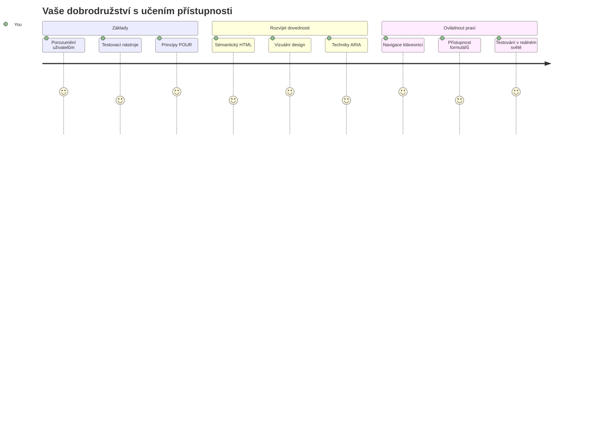
## Přednáškový kvíz
[Přednáškový kvíz](https://ff-quizzes.netlify.app/web/)

> Síla webu spočívá v jeho univerzálnosti. Přístupnost pro každého bez ohledu na postižení je základním aspektem.
>
> \- Sir Timothy Berners-Lee, ředitel W3C a vynálezce World Wide Webu

Tady máte něco, co vás může překvapit: když vytváříte přístupné weby, nepomáháte pouze lidem s postižením — ve skutečnosti tím zlepšujete web pro všechny!

Všimli jste si někdy těch snížených obrubníků na rohu ulic? Původně byly navrženy pro invalidní vozíky, ale teď pomáhají lidem s kočárky, pracovníkům rozvážejícím zásilky, cestovatelům s kufry na kolečkách i cyklistům. Tak přesně funguje přístupný webový design — řešení, která pomáhají jedné skupině, často nakonec prospívají všem. Docela super, že?

V této lekci budeme zkoumat, jak vytvářet webové stránky, které skutečně fungují pro všechny, bez ohledu na způsob, jakým prohlížejí web. Objevíte praktické techniky, které jsou již zabudovány ve webových standardech, vyzkoušíte si testovací nástroje a uvidíte, jak přístupnost zlepšuje použitelnost vašich stránek pro všechny uživatele.

Na konci této lekce budete mít jistotu, že přístupnost je přirozenou součástí vašeho vývojového workflow. Připraveni zjistit, jak promyšlené designové volby mohou otevřít web pro miliardy uživatelů? Pojďme na to!

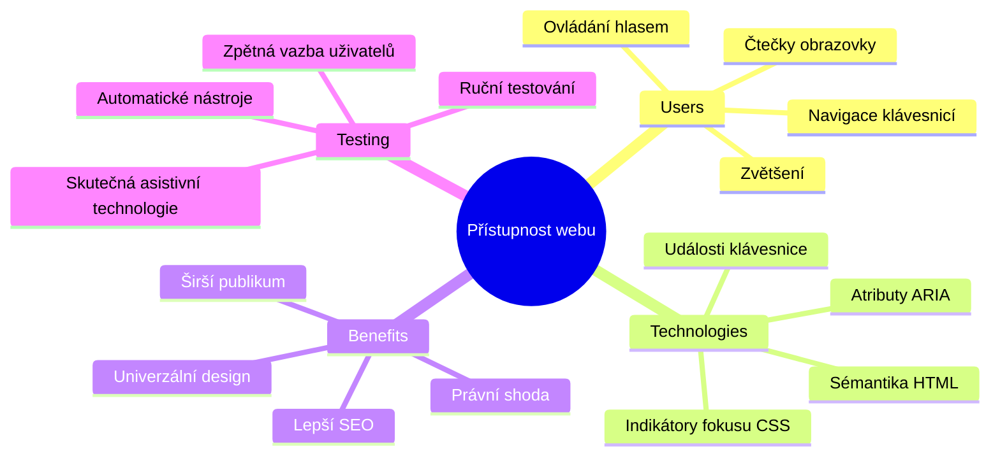
> Tuto lekci můžete absolvovat na [Microsoft Learn](https://docs.microsoft.com/learn/modules/web-development-101/accessibility/?WT.mc_id=academic-77807-sagibbon)!

## Porozumění asistivním technologiím

Než se pustíme do kódování, pojďme si chvíli uvědomit, jak lidé s různými schopnostmi skutečně prožívají web. Není to jen teorie — pochopení těchto reálných navigačních vzorců vás učiní mnohem lepším vývojářem!

Asistivní technologie jsou opravdu úžasné nástroje, které pomáhají lidem s postižením interagovat se stránkami způsoby, které by vás mohly překvapit. Jakmile pochopíte, jak tyto technologie fungují, vytváření přístupných webových zážitků je mnohem intuitivnější. Je to jako vidět svůj kód očima někoho jiného.

### Čtečky obrazovky

[Čtečky obrazovky](https://en.wikipedia.org/wiki/Screen_reader) jsou sofistikované technologie, které převádějí digitální text na řeč nebo výstup v Braillově písmu. Přestože je primárně používají lidé s poruchami zraku, jsou také velmi užitečné pro uživatele s poruchami učení, jako je dyslexie.

Rád si představuji čtečku obrazovky jako velmi chytrého vypravěče, který vám čte knihu. Čte obsah nahlas v logickém pořadí, oznamuje interaktivní prvky jako „tlačítko“ nebo „odkaz“ a poskytuje klávesové zkratky pro rychlý pohyb po stránce. Ale pozor — čtečky obrazovky dokážou kouzlit jen pokud stavíme weby s vhodnou strukturou a smysluplným obsahem. A tady přicházíte na řadu vy jako vývojář!

**Populární čtečky obrazovky na různých platformách:**
- **Windows**: [NVDA](https://www.nvaccess.org/about-nvda/) (zdarma a nejpopulárnější), [JAWS](https://webaim.org/articles/jaws/), [Narrator](https://support.microsoft.com/windows/complete-guide-to-narrator-e4397a0d-ef4f-b386-d8ae-c172f109bdb1/?WT.mc_id=academic-77807-sagibbon) (vestavěný)
- **macOS/iOS**: [VoiceOver](https://support.apple.com/guide/voiceover/welcome/10) (vestavěný a velmi schopný)
- **Android**: [TalkBack](https://support.google.com/accessibility/android/answer/6283677) (vestavěný)
- **Linux**: [Orca](https://wiki.gnome.org/Projects/Orca) (zdarma a open-source)

**Jak čtečky obrazovky navigují webový obsah:**

Čtečky nabízí několik navigačních metod, které dělají prohlížení efektivním pro zkušené uživatele:
- **Sekvenční čtení**: Čte obsah shora dolů, jako byste sledovali knihu
- **Navigace podle orientačních bodů**: Přeskočení mezi sekcemi stránky (hlavička, navigace, hlavní obsah, zápatí)
- **Navigace pomocí nadpisů**: Přeskakování mezi nadpisy pro lepší pochopení struktury stránky
- **Seznam odkazů**: Generování seznamu všech odkazů pro rychlý přístup
- **Ovládací prvky formulářů**: Přímo se přesunout mezi vstupními poli a tlačítky

> 💡 **Toto mě ohromilo**: 68 % uživatelů čteček obrazovky naviguje primárně pomocí nadpisů ([WebAIM Survey](https://webaim.org/projects/screenreadersurvey9/#finding)). To znamená, že struktura nadpisů je pro uživatele jako mapa — když ji máte správně, doslova pomáháte lidem rychleji najít cestu ve vašem obsahu!

### Tvorba vašeho testovacího workflow

Dobrá zpráva — efektivní testování přístupnosti nemusí být složité! Je vhodné kombinovat automatizované nástroje (které výborně odhalí zjevné problémy) s ručním testováním. Zde je systematický přístup, který jsem zjistil jako nejúčinnější a nezabere vám celý den:

**Základní workflow manuálního testování:**

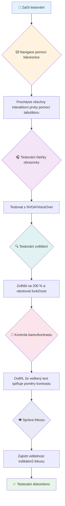
**Kontrolní seznam krok za krokem:**
1. **Navigace klávesnicí**: Použijte pouze Tab, Shift+Tab, Enter, Space a šipky
2. **Testování čtečkou obrazovky**: Zapněte NVDA, VoiceOver nebo Narrator a navigujte se zavřenýma očima
3. **Testování zvětšení**: Testujte při 200 % a 400 % zvětšení
4. **Kontrola kontrastu barev**: Zkontrolujte veškerý text a uživatelské prvky
5. **Testování indikátoru fokusu**: Ujistěte se, že všechny interaktivní prvky mají viditelný stav fokusu

✅ **Začněte Lighthouse**: Otevřete v prohlížeči DevTools, spusťte audit přístupnosti v Lighthouse a podle výsledků zaměřte své manuální testování.

### Nástroje pro zvětšování a lupy

Znáte ten pocit, kdy na telefonu štípnete obrazovku, protože je text příliš malý, nebo se při jasném slunci na notebooku mračíte? Mnoho uživatelů každý den spoléhá na lupy a zvětšovací nástroje, aby bylo čtení obsahu pohodlné. Patří sem lidé se zhoršeným zrakem, starší dospělí a kdokoliv, kdo se někdy snažil číst web venku.

Moderní technologie zvětšení už dávno nejsou jen o zvětšení. Pochopení, jak tyto nástroje fungují, vám pomůže tvořit responzivní designy, které zůstanou funkční a atraktivní při jakémkoli zvětšení.

**Možnosti zvětšování v moderních prohlížečích:**
- **Zvětšení celé stránky**: Proporčně škáluje veškerý obsah (text, obrázky, rozvržení) – toto je preferovaný způsob
- **Zvětšení pouze textu**: Zvětšuje velikost písma, ale zachovává původní rozložení
- **Pinch-to-zoom**: Mobilní gesto pro dočasné přiblížení
- **Podpora v prohlížečích**: Všechny moderní prohlížeče podporují zvětšení až do 500 % bez porušení funkčnosti

**Specializovaný software pro zvětšení:**
- **Windows**: [Lupa (Magnifier)](https://support.microsoft.com/windows/use-magnifier-to-make-things-on-the-screen-easier-to-see-414948ba-8b1c-d3bd-8615-0e5e32204198) (vestavěný), [ZoomText](https://www.freedomscientific.com/training/zoomtext/getting-started/)
- **macOS/iOS**: [Zoom](https://www.apple.com/accessibility/mac/vision/) (vestavěný s pokročilými funkcemi)

> ⚠️ **Úvaha o designu**: WCAG vyžaduje, aby obsah zůstal funkční při zvětšení na 200 %. Na této úrovni by mělo být horizontální posouvání minimální a všechny interaktivní prvky by měly zůstat přístupné.

✅ **Otestujte svůj responzivní design**: Zvětšete svůj prohlížeč na 200 % a 400 %. Přizpůsobí se váš layout elegantně? Můžete stále využívat všechny funkce bez nadměrného rolování?

## Moderní nástroje pro testování přístupnosti

Teď, když už víte, jak lidé s asistivními technologiemi navigují web, pojďme se podívat na nástroje, které vám pomohou vytvářet a testovat přístupné weby.

Můžete si to představit takto: automatizované nástroje skvěle odhalí zjevné problémy (například chybějící alt text), zatímco ruční testování vám umožní zajistit, že váš web je uživatelsky příjemný v reálném světě. Spolu vám dávají jistotu, že vaše stránky fungují pro každého.

### Testování kontrastu barev

Dobrá zpráva: kontrast barev je jedním z nejběžnějších problémů přístupnosti, ale také jedním z nejjednodušších na opravu. Dobrá čitelnost kontrastu prospívá všem — od uživatelů se zrakovým postižením po lidi, kteří se snaží číst svůj telefon na pláži.

**Požadavky WCAG na kontrast:**

| Typ textu | WCAG AA (minimální) | WCAG AAA (vylepšené) |
|-----------|---------------------|---------------------|
| **Normální text** (menší než 18 pt) | kontrast 4,5:1 | kontrast 7:1 |
| **Velký text** (18 pt a více nebo 14 pt a více tučně) | kontrast 3:1 | kontrast 4,5:1 |
| **UI komponenty** (tlačítka, rámečky formulářů) | kontrast 3:1 | kontrast 3:1 |

**Zásadní testovací nástroje:**
- [Colour Contrast Analyser](https://www.tpgi.com/color-contrast-checker/) – desktopová aplikace s výběrem barev
- [WebAIM Contrast Checker](https://webaim.org/resources/contrastchecker/) – webová aplikace s okamžitou zpětnou vazbou
- [Stark](https://www.getstark.co/) – plugin pro návrhové nástroje Figma, Sketch, Adobe XD
- [Accessible Colors](https://accessible-colors.com/) – najděte přístupné palety barev

✅ **Vytvářejte lepší barevné palety**: Začněte s barvami vašeho brandu a použijte nástroje pro kontrolu kontrastu k vytvoření přístupných variant. Dokumentujte je jako přístupné barevné tokeny ve vašem design systému.

### Komplexní audit přístupnosti

Nejúčinnější testování přístupnosti kombinuje více přístupů. Žádný jediný nástroj neodhalí všechno, takže sestavení testovací rutiny z různých metod zajistí důkladné pokrytí.

**Testování v prohlížeči (vestavěné v DevTools):**
- **Chrome/Edge**: audit přístupnosti Lighthouse + panel přístupnosti
- **Firefox**: inspektor přístupnosti s podrobným zobrazením stromu
- **Safari**: panel pro audit v inspektoru webu s emulací VoiceOver

**Profesionální testovací rozšíření:**
- [axe DevTools](https://www.deque.com/axe/devtools/) – průmyslový standard pro automatizované testování
- [WAVE](https://wave.webaim.org/extension/) – vizuální zpětná vazba s označením chyb
- [Accessibility Insights](https://accessibilityinsights.io/) – komplexní sada Microsoftu

**Příkazová řádka a integrace do CI/CD:**
- [axe-core](https://github.com/dequelabs/axe-core) – JavaScript knihovna pro automatizované testování
- [Pa11y](https://pa11y.org/) – nástroj pro testování přístupnosti v příkazové řádce
- [Lighthouse CI](https://github.com/GoogleChrome/lighthouse-ci) – automatizované skórování přístupnosti

> 🎯 **Cíl testování**: Snažte se o skóre přístupnosti v Lighthouse 95+ jako základnu. Pamatujte, že automatizované nástroje odhalí jen asi 30-40 % problémů — manuální testování je stále nezbytné!

### 🧠 **Kontrola testovacích dovedností: Jste připraveni najít problémy?**

**Pojďme zjistit, jak se cítíte ohledně testování přístupnosti:**
- Která metoda testování vám teď přijde nejpřístupnější?
- Dokážete si představit používat pouze klávesnici na celý den?
- Jakou bariéru v přístupnosti jste osobně na internetu zažili?

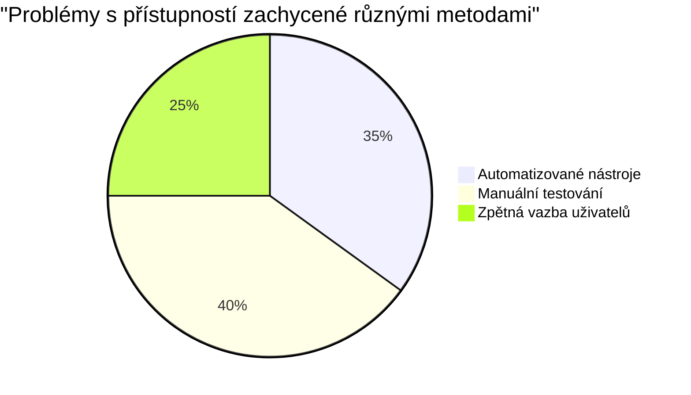
> **Podpora sebevědomí**: Profesionální testeři přístupnosti používají přesně tuto kombinaci metod. Učíte se průmyslové standardy!

## Budování přístupnosti od základu

Klíčem k úspěšné přístupnosti je začlenit ji už od prvního dne. Vím, že lákavé je říct „přidám přístupnost později“, ale to je jako přidávat rampu do domu, který už stojí. Je to možné? Ano. Snadné? Ne tak moc.

Přístupnost si představte jako plánování domu — mnohem jednodušší je zařadit bezbariérový přístup už v architektonických plánech než vše dodatečně upravovat.

### Principy POUR: vaše základna přístupnosti

Směrnice Web Content Accessibility Guidelines (WCAG) se opírají o čtyři základní principy, které tvoří akronym POUR. Nebojte se — nejsou to suché akademické termíny! Jsou to praktické pokyny, jak tvořit obsah, který funguje pro všechny.

Jakmile pochopíte POUR, stane se rozhodování o přístupnosti mnohem intuitivnější. Je to jako mít mentální kontrolní seznam, který vás provází vašimi designovými volbami. Pojďme to rozebrat:

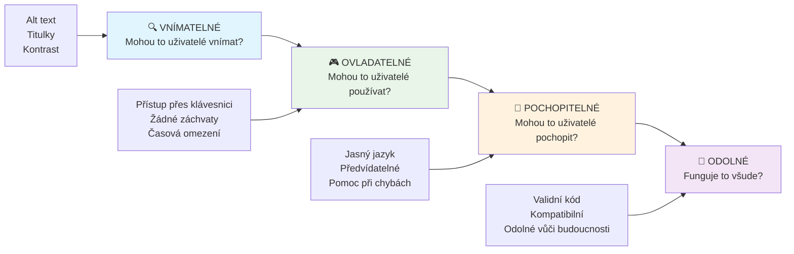
**🔍 Vnímatelné**: Informace musí být prezentovatelné způsoby, které uživatelé mohou vnímat svými dostupnými smysly

- Poskytujte alternativy k textu u netextového obsahu (obrázky, videa, zvuk)
- Zajistěte dostatečný barevný kontrast pro veškerý text a UI komponenty
- Nabídněte titulky a přepisy pro multimediální obsah
- Navrhněte obsah, který zůstane funkční při zvětšení až na 200 %
- Používejte více smyslových charakteristik (nejen barvu) pro přenos informací

**🎮 Ovládatelné**: Všechny komponenty rozhraní musí být ovladatelné dostupnými způsoby zadání

- Zajistěte, aby byla veškerá funkčnost přístupná klávesnicovou navigací
- Poskytněte uživatelům dostatek času ke čtení a interakci s obsahem
- Vyhněte se obsahu způsobujícímu záchvaty nebo vestibulární problémy
- Pomozte uživatelům efektivně navigovat díky jasné struktuře a orientačním bodům
- Zajistěte dostatečnou velikost cílových oblastí interaktivních prvků (min. 44px)

**📖 Srozumitelné**: Informace a ovládání UI musí být jasné a pochopitelné

- Používejte jasný, jednoduchý jazyk vhodný pro vaše publikum
- Zajistěte, aby obsah působil a fungoval předvídatelně a konzistentně
- Poskytněte jasné instrukce a chybové zprávy pro vstup uživatele
- Pomozte uživatelům pochopit a opravit chyby ve formulářích
- Organizujte obsah podle logického pořadí čtení a informační hierarchie

**💪 Robustní**: Obsah musí fungovat spolehlivě napříč různými technologiemi a asistivními zařízeními

- **Používejte validní, sémantický HTML jako základ**
- **Zajistěte kompatibilitu se současnými i budoucími asistivními technologiemi**
- **Dodržujte webové standardy a osvědčené postupy při značkování**
- **Testujte na různých prohlížečích, zařízeních a asistenčních nástrojích**
- **Strukturovat obsah tak, aby se při nepodpoře pokročilých funkcí postupně zhoršoval**

### 🎯 **Kontrola principů POUR: Jak je udělat pevnými**

**Rychlá reflexe základů:**
- Dokážete si představit funkci webu, která porušuje každý princip POUR?
- Který princip vám jako vývojáři přijde nejpřirozenější?
- Jak by tyto principy mohly zlepšit design pro všechny, nejen pro uživatele s postižením?

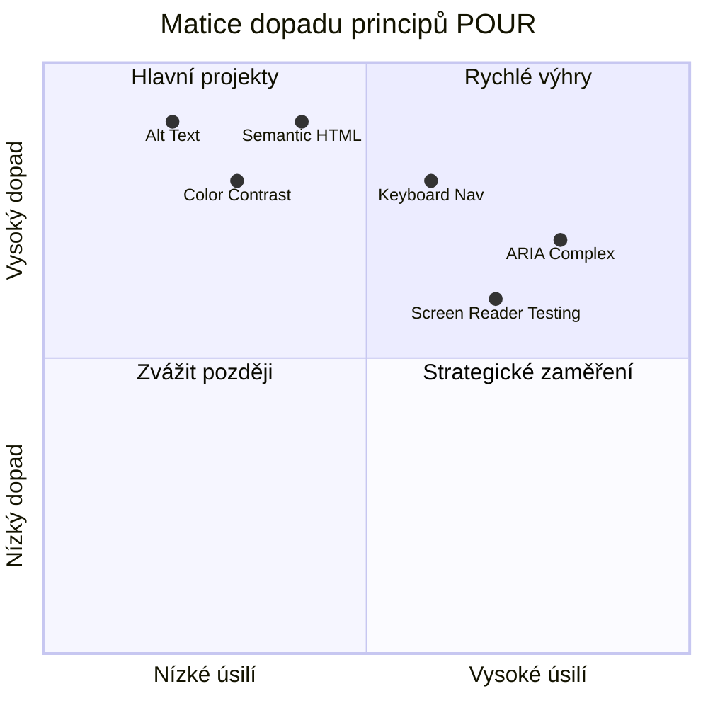
> **Pamatujte**: Začněte s opatřeními s největším dopadem a nejmenší námahou. Sémantický HTML a alt text vám poskytují největší přínos pro přístupnost za minimální úsilí!

## Tvorba přístupného vizuálního designu

Dobrý vizuální design a přístupnost jdou ruku v ruce. Když navrhujete s ohledem na přístupnost, často zjistíte, že tato omezení vedou k čistším, elegantnějším řešením, která prospívají všem uživatelům.

Pojďme prozkoumat, jak vytvářet vizuálně atraktivní designy, které fungují pro všechny, bez ohledu na jejich zrakové schopnosti nebo podmínky, za kterých váš obsah prohlížejí.

### Barva a strategie vizuální přístupnosti

Barva je mocný nástroj pro komunikaci, ale nikdy by neměla být jediným způsobem, jak předávat důležité informace. Navrhování nad rámec barev vytváří robustnější, inkluzivní zážitky, které fungují v různých situacích.

**Navrhujte pro rozdíly v barevném vidění:**

Přibližně 8 % mužů a 0,5 % žen má nějakou formu rozdílu ve vnímání barev (často nazývané „barvoslepost“). Nejčastější typy jsou:
- **Deuteranopie**: obtížnost rozlišovat červenou a zelenou
- **Protanopie**: červená barva vypadá tmavší
- **Tritanopie**: obtížnost s modrou a žlutou (vzácné)

**Inkluzivní strategie barev:**

```css
/* ❌ Bad: Using only color to indicate status */
.error { color: red; }
.success { color: green; }

/* ✅ Good: Color plus icons and context */
.error {
  color: #d32f2f;
  border-left: 4px solid #d32f2f;
}
.error::before {
  content: "⚠️";
  margin-right: 8px;
}

.success {
  color: #2e7d32;
  border-left: 4px solid #2e7d32;
}
.success::before {
  content: "✅";
  margin-right: 8px;
}
```

**Nad rámec základních požadavků na kontrast:**
- Testujte své barevné volby pomocí simulátorů barvosleposti
- Používejte vzory, textury nebo tvary společně s barevným kódováním
- Zajistěte, aby interaktivní stavy zůstaly rozpoznatelné i bez barvy
- Zvažte, jak váš design vypadá v režimu vysokého kontrastu

✅ **Otestujte přístupnost barev:** Použijte nástroje jako [Coblis](https://www.color-blindness.com/coblis-color-blindness-simulator/), abyste viděli, jak váš web vypadá pro uživatele s různými typy barevného vidění.

### Indikátory fokusu a návrh interakce

Indikátory fokusu jsou digitálním ekvivalentem kurzoru — ukazují uživatelům klávesnice, kde se nacházejí na stránce. Dobře navržené indikátory fokusu zlepšují zážitek pro všechny tím, že dělají interakce jasnými a předvídatelnými.

**Nejlepší moderní postupy pro indikátory fokusu:**

```css
/* Enhanced focus styles that work across browsers */
button:focus-visible {
  outline: 2px solid #0066cc;
  outline-offset: 2px;
  box-shadow: 0 0 0 4px rgba(0, 102, 204, 0.25);
}

/* Remove focus outline for mouse users, preserve for keyboard users */
button:focus:not(:focus-visible) {
  outline: none;
}

/* Focus-within for complex components */
.card:focus-within {
  box-shadow: 0 0 0 3px rgba(74, 144, 164, 0.5);
  border-color: #4A90A4;
}

/* Ensure focus indicators meet contrast requirements */
.custom-focus:focus-visible {
  outline: 3px solid #ffffff;
  outline-offset: 2px;
  box-shadow: 0 0 0 6px #000000;
}
```

**Požadavky na indikátor fokusu:**
- **Viditelnost**: Musí mít kontrastní poměr alespoň 3:1 vůči okolním prvkům
- **Šířka**: Minimální tloušťka 2 px okolo celého prvku
- **Trvalost**: Měl by být viditelný, dokud fokus nepřejde jinam
- **Rozlišitelnost**: Musí být vizuálně odlišný od ostatních stavů UI

> 💡 **Tip pro design**: Skvělé indikátory fokusu často používají kombinaci ohraničení, stínu rámečku a barevných změn, aby byla zajištěna viditelnost na různých pozadích a v různých kontextech.

✅ **Auditujte indikátory fokusu:** Procházejte svou stránku pomocí tabulátoru a poznamenejte si, které prvky mají jasné indikátory fokusu. Jsou některé těžko viditelné nebo zcela chybí?

### Sémantický HTML: Základ přístupnosti

Sémantický HTML je jako poskytnutí navigačního systému GPS asistenčním technologiím pro váš web. Když používáte správné HTML prvky pro jejich zamýšlený účel, poskytujete čtečkám obrazovky, klávesnicím a dalším nástrojům podrobnou mapu, která uživatelům pomáhá efektivně se orientovat.

Tady je přirovnání, které mi opravdu sedlo: sémantický HTML je rozdíl mezi dobře organizovanou knihovnou s jasnými kategoriemi a užitečnými značkami versus skladištěm, kde jsou knihy rozházené náhodně. Obě místa mají stejné knihy, ale ve kterém byste raději něco hledali? Přesně tak!

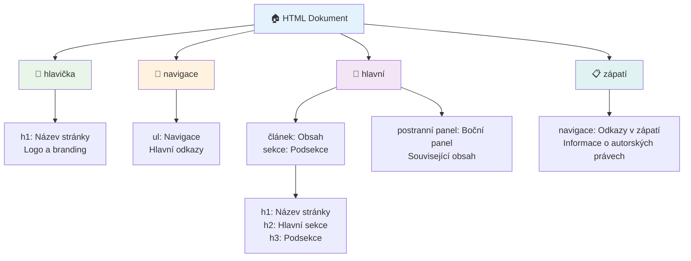
**Stavební kameny přístupné struktury stránky:**

```html
<!-- Landmark elements provide page navigation structure -->
<header>
  <h1>Your Site Name</h1>
  <nav aria-label="Main navigation">
    <ul>
      <li><a href="/home">Home</a></li>
      <li><a href="/about">About</a></li>
      <li><a href="/services">Services</a></li>
    </ul>
  </nav>
</header>

<main>
  <article>
    <header>
      <h1>Article Title</h1>
      <p>Published on <time datetime="2024-10-14">October 14, 2024</time></p>
    </header>
    
    <section>
      <h2>First Section</h2>
      <p>Content that relates to this section...</p>
    </section>
    
    <section>
      <h2>Second Section</h2>
      <p>More related content...</p>
    </section>
  </article>
  
  <aside>
    <h2>Related Links</h2>
    <nav aria-label="Related articles">
      <ul>
        <li><a href="/related-1">First related article</a></li>
        <li><a href="/related-2">Second related article</a></li>
      </ul>
    </nav>
  </aside>
</main>

<footer>
  <p>&copy; 2024 Your Site Name. All rights reserved.</p>
  <nav aria-label="Footer links">
    <ul>
      <li><a href="/privacy">Privacy Policy</a></li>
      <li><a href="/contact">Contact Us</a></li>
    </ul>
  </nav>
</footer>
```

**Proč sémantický HTML proměňuje přístupnost:**

| Sémantický prvek | Účel | Výhoda pro čtečky obrazovky |
|------------------|---------|----------------------------|
| `<header>` | Záhlaví stránky nebo sekce | "Banner landmark" - rychlá navigace na začátek |
| `<nav>` | Navigační odkazy | "Navigation landmark" - seznam navigačních sekcí |
| `<main>` | Hlavní obsah stránky | "Main landmark" - přímý přeskočení na obsah |
| `<article>` | Samostatný obsah | Oznamuje hranice článku |
| `<section>` | Tematické skupiny obsahu | Poskytuje strukturu obsahu |
| `<aside>` | Související obsah v postranním panelu | "Complementary landmark" |
| `<footer>` | Patička stránky nebo sekce | "Contentinfo landmark" |

**Super schopnosti čteček obrazovky sémantickým HTML:**
- **Navigace pomocí landmarků**: Okamžité skákání mezi hlavními částmi stránky
- **Obrysy nadpisů**: Generování obsahu z hierarchie nadpisů
- **Seznamy prvků**: Vytváření seznamů všech odkazů, tlačítek nebo ovládacích prvků formulářů
- **Povědomí o kontextu**: Pochopení vztahů mezi částmi obsahu

> 🎯 **Rychlý test**: Vyzkoušejte navigaci na svém webu pomocí čtečky obrazovky s klávesovými zkratkami pro landmarky (D pro landmark, H pro nadpis, K pro odkaz v NVDA/JAWS). Dává navigace smysl?

### 🏗️ **Kontrola mistrovství Sémantického HTML: Budování pevných základů**

**Zhodnoťme vaše porozumění sémantice:**
- Dokážete identifikovat landmarky na stránce jen podle HTML?
- Jak byste vysvětlili rozdíl mezi `<section>` a `<div>` kamarádovi?
- Co byste nejdříve zkontrolovali, kdyby uživatel čtečky obrazovky hlásil problémy s navigací?

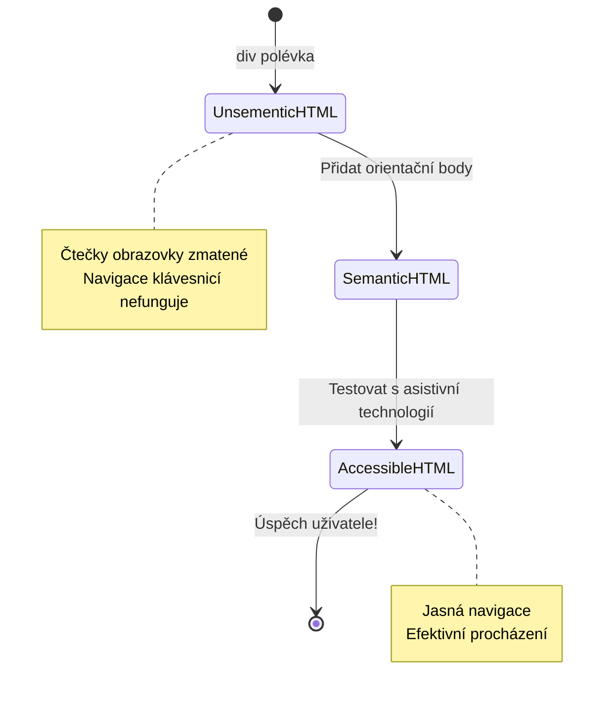
> **Profesionální tip**: Dobré sémantické HTML automaticky řeší asi 70 % problémů s přístupností. Ovládnete-li tuto základnu, jste na dobré cestě!

✅ **Auditujte svou sémantickou strukturu:** Použijte panel Přístupnost (Accessibility) v DevTools vašeho prohlížeče pro zobrazení stromu přístupnosti a ujistěte se, že vaše markup vytváří logickou strukturu.

### Hierarchie nadpisů: Vytváření logického obsahu

Nadpisy jsou naprosto zásadní pro přístupný obsah — jsou jako páteř, která drží všechno pohromadě. Uživatelé čteček obrazovky se na nadpisy silně spoléhají, aby obsah pochopili a mohli se v něm orientovat. Je to podobné jako poskytnutí obsahu stránky.

**Zlaté pravidlo nadpisů:**
Nikdy nevynechávejte úrovně. Vždy postupujte logicky od `<h1>` přes `<h2>` k `<h3>` a dál. Pamatujete si, jak se dělaly osnovy ve škole? Je to stejný princip — nepřeskočili byste z „I. Hlavní bod“ rovnou na „C. Pod-pod-bod“ bez „A. Pod-bodu“ mezi nimi, že?

**Příklad perfektní hierarchie nadpisů:**

```html
<!-- ✅ Excellent: Logical, hierarchical progression -->
<main>
  <h1>Complete Guide to Web Accessibility</h1>
  
  <section>
    <h2>Understanding Screen Readers</h2>
    <p>Introduction to screen reader technology...</p>
    
    <h3>Popular Screen Reader Software</h3>
    <p>NVDA, JAWS, and VoiceOver comparison...</p>
    
    <h3>Testing with Screen Readers</h3>
    <p>Step-by-step testing instructions...</p>
  </section>
  
  <section>
    <h2>Color and Contrast Guidelines</h2>
    <p>Designing with sufficient contrast...</p>
    
    <h3>WCAG Contrast Requirements</h3>
    <p>Understanding the different contrast levels...</p>
    
    <h3>Testing Tools and Techniques</h3>
    <p>Tools for verifying contrast ratios...</p>
  </section>
</main>
```

```html
<!-- ❌ Problematic: Skipping levels, inconsistent structure -->
<h1>Page Title</h1>
<h3>Subsection</h3> <!-- Skipped h2 -->
<h2>This should come before h3</h2>
<h1>Another main heading?</h1> <!-- Multiple h1s -->
```

**Nejlepší postupy nadpisů:**
- **Jeden `<h1>` na stránku**: Obvykle hlavní název stránky nebo nadpis primárního obsahu
- **Logický postup**: Nikdy nevynechávejte úrovně (h1 → h2 → h3, ne h1 → h3)
- **Významný obsah**: Nadpisy by měly dávat smysl i samostatně
- **Vizuální stylování pomocí CSS**: Používejte CSS pro vzhled, HTML úrovně pro strukturu

**Statistiky navigace uživatelů čteček obrazovky:**
- 68 % uživatelů používá navigaci podle nadpisů ([WebAIM Survey](https://webaim.org/projects/screenreadersurvey9/#finding))
- Uživatelé očekávají logickou hierarchii nadpisů
- Nadpisy jsou nejrychlejší cestou k pochopení struktury stránky

> 💡 **Profesionální tip**: Použijte rozšíření prohlížeče jako „HeadingsMap“ pro vizualizaci vaší struktury nadpisů. Měla by číst jako dobře organizovaný obsah.

✅ **Otestujte svou strukturu nadpisů:** Pomocí navigace nadpisy čtečky obrazovky (klávesa H v NVDA) přeskakujte mezi nadpisy. Vypráví postupně logický příběh vašeho obsahu?

### Pokročilé techniky vizuální přístupnosti

Kromě základů kontrastu a barev existují sofistikované techniky, které pomáhají vytvořit skutečně inkluzivní vizuální zážitky. Tyto metody zajistí, že váš obsah funguje v různých podmínkách zobrazení a s asistivními technologiemi.

**Základní strategie vizuální komunikace:**

- **Multimodální zpětná vazba**: Kombinujte vizuální, textové a někdy i zvukové indikace
- **Postupné zveřejňování**: Předávejte informace v stravitelných dávkách
- **Konzistentní vzory interakce**: Používejte známé konvence UI
- **Responzivní typografie**: Přizpůsobujte velikost textu různým zařízením
- **Stavy načítání a chyb**: Poskytujte jasnou zpětnou vazbu pro všechny uživatelské akce

**CSS nástroje pro lepší přístupnost:**

```css
/* Screen reader only text - visually hidden but accessible */
.sr-only {
  position: absolute;
  width: 1px;
  height: 1px;
  padding: 0;
  margin: -1px;
  overflow: hidden;
  clip: rect(0, 0, 0, 0);
  white-space: nowrap;
  border: 0;
}

/* Skip link for keyboard navigation */
.skip-link {
  position: absolute;
  top: -40px;
  left: 6px;
  background: #000000;
  color: #ffffff;
  padding: 8px 16px;
  text-decoration: none;
  border-radius: 4px;
  font-weight: bold;
  transition: top 0.3s ease;
  z-index: 1000;
}

.skip-link:focus {
  top: 6px;
}

/* Reduced motion respect */
@media (prefers-reduced-motion: reduce) {
  .skip-link {
    transition: none;
  }
  
  * {
    animation-duration: 0.01ms !important;
    animation-iteration-count: 1 !important;
    transition-duration: 0.01ms !important;
  }
}

/* High contrast mode support */
@media (prefers-contrast: high) {
  .button {
    border: 2px solid;
  }
}
```

> 🎯 **Vzor přístupnosti**: „skip link“ je nepostradatelný pro uživatele klávesnice. Měl by být prvním fokusovatelným prvkem na stránce a přeskakovat přímo do hlavní oblasti obsahu.

✅ **Implementujte skip navigaci:** Přidejte skip odkazy na stránky a otestujte je stisknutím Tab ihned po načtení stránky. Měly by být viditelné a umožnit vám přeskočit na hlavní obsah.

## Tvorba smysluplného textu odkazů

Odkazy jsou v podstatě dálnice internetu, ale špatně napsaný text odkazů je jako dopravní značky, které jen říkají „Místo“ místo „Centrum Chicaga.“ Ne moc užitečné, že?

Zde jedna věc, která mě fascinovala, když jsem se to poprvé dozvěděl: čtečky obrazovky dokážou extrahovat všechny odkazy ze stránky a zobrazit je jako jeden dlouhý seznam. Představte si, že vám někdo předá adresář všech odkazů na vašem webu. Má každý z nich smysl samostatně? To je test, který musí váš text odkazů projít!

### Pochopení vzorů navigace odkazů

Čtečky obrazovky nabízejí výkonné funkce navigace odkazů, které jsou závislé na dobře napsaném textu odkazu:

**Metody navigace odkazů:**
- **Sekvenční čtení**: Odkazy jsou čteny v kontextu jako součást obsahu
- **Generování seznamu odkazů**: Všechny odkazy na stránce jsou sestaveny do prohledatelného adresáře
- **Rychlá navigace**: Překlikávání mezi odkazy pomocí klávesových zkratek (K v NVDA)
- **Vyhledávací funkce**: Najděte konkrétní odkaz podle části textu

**Proč je kontext důležitý:**
Když uživatelé čtečky obrazovky generují seznam odkazů, vidí například:
- „Stáhnout zprávu“
- „Více informací“
- „Klikněte zde“
- „Zásady ochrany osobních údajů“
- „Klikněte zde“

Pouze dva odkazy poskytují užitečné informace, pokud jsou čteny mimo kontext!

> 📊 **Dopad na uživatele**: Uživatelé čteček obrazovky procházejí seznam odkazů, aby rychle pochopili obsah stránky. Obecné texty odkazů je nutí vracet se k jejich kontextu, což výrazně zpomaluje jejich procházení.

### Časté chyby v textu odkazů, kterým se vyhnout

Porozumění tomu, co nefunguje, vám pomůže rozpoznat a opravit přístupnost v existujícím obsahu.

**❌ Obecné texty odkazů bez kontextu:**

```html
<!-- Meaningless when read from a link list -->
<p>Our sustainability efforts are detailed in our recent report. 
   <a href="/sustainability-2024.pdf">Click here</a> to view it.</p>

<!-- Repeated generic text throughout the page -->
<div class="article-card">
  <h3>Web Accessibility Guide</h3>
  <p>Learn the fundamentals...</p>
  <a href="/accessibility-guide">Read more</a>
</div>
<div class="article-card">
  <h3>Color Contrast Tips</h3>
  <p>Improve your design...</p>
  <a href="/color-contrast">Read more</a>
</div>

<!-- URLs as link text (difficult for screen readers to announce) -->
<p>Visit https://www.w3.org/WAI/WCAG21/quickref/ for WCAG guidelines.</p>

<!-- Vague action words -->
<a href="/contact">Go</a> | <a href="/about">See</a> | <a href="/help">View</a>
```

**Proč tyto vzory selhávají:**
- **„Klikněte zde“** neříká uživatelům nic o cíli odkazu
- **„Číst více“** se opakuje mnohokrát a vytváří zmatení
- **Surové URL** jsou pro čtečky obtížně vyslovitelné
- **Jednoslovné odkazy** jako „Jdi“ nebo „Viz“ postrádají popisný kontext

### Psát vynikající text odkazů

Popisný text odkazů prospívá všem — vidící uživatelé mohou odkazy rychleji prohledávat, uživatelé čteček obrazovky hned pochopí cíle.

**✅ Jasné, popisné příklady textů odkazů:**

```html
<!-- Descriptive text that explains the destination -->
<p>Our comprehensive <a href="/sustainability-2024.pdf">2024 sustainability report (PDF, 2.1MB)</a> details our environmental initiatives.</p>

<!-- Specific, unique link text for each card -->
<div class="article-card">
  <h3>Web Accessibility Guide</h3>
  <p>Learn the fundamentals of inclusive design...</p>
  <a href="/accessibility-guide">Read our complete web accessibility guide</a>
</div>
<div class="article-card">
  <h3>Color Contrast Tips</h3>
  <p>Improve your design with better color choices...</p>
  <a href="/color-contrast">Explore color contrast best practices</a>
</div>

<!-- Meaningful text instead of raw URLs -->
<p>The <a href="https://www.w3.org/WAI/WCAG21/quickref/">WCAG 2.1 Quick Reference guide</a> provides comprehensive accessibility guidelines.</p>

<!-- Descriptive action links -->
<a href="/contact">Contact our support team</a> | 
<a href="/about">About our company</a> | 
<a href="/help">Get help with your account</a>
```

**Nejlepší praxe pro text odkazů:**
- **Buďte konkrétní**: „Stáhnout čtvrtletní finanční zprávu“ místo „Stáhnout“
- **Uveďte typ souboru a velikost**: „(PDF, 1,2 MB)“ pro stahovatelné soubory
- **Upozorněte, pokud se odkaz otevírá externě**: „(otevře se v novém okně)“ pokud je to vhodné
- **Používejte aktivní jazyk**: „Kontaktujte nás“ místo „Kontaktní stránka“
- **Buďte struční**: Když možno, 2-8 slov

### Pokročilé vzory přístupnosti odkazů

Někdy jsou vizuální nebo technická omezení potřeba zvláštních řešení. Zde jsou sofistikované techniky pro běžné náročné situace:

**Použití ARIA pro lepší kontext:**

```html
<!-- When button text must be short but needs more context -->
<a href="/report.pdf" 
   aria-label="Download 2024 annual financial report, PDF format, 2.3MB">
  Download Report
</a>

<!-- When the full context comes from surrounding content -->
<h3 id="sustainability-heading">Sustainability Initiative</h3>
<p>Our efforts to reduce environmental impact...</p>
<a href="/sustainability-details" 
   aria-labelledby="sustainability-heading"
   aria-describedby="sustainability-summary">
  Learn more
</a>
<p id="sustainability-summary">Detailed breakdown of our 2024 environmental goals and achievements</p>
```

**Indikace typů souborů a externích cílů:**

```html
<!-- Method 1: Include information in visible link text -->
<a href="/annual-report.pdf">
  Download our 2024 annual report (PDF, 2.3MB)
</a>

<!-- Method 2: Use screen reader-only text for file details -->
<a href="/annual-report.pdf">
  Download our 2024 annual report
  <span class="sr-only">(PDF format, 2.3MB)</span>
</a>

<!-- Method 3: External link indication -->
<a href="https://example.com" 
   target="_blank" 
   aria-describedby="external-link-warning">
  Visit external resource
</a>
<span id="external-link-warning" class="sr-only">
  (opens in new window)
</span>

<!-- Method 4: Using CSS for visual indicators -->
<a href="https://example.com" class="external-link">
  External resource
</a>
```

```css
/* Visual indicator for external links */
.external-link::after {
  content: " ↗";
  font-size: 0.8em;
  color: #666;
}

/* Screen reader announcement for external links */
.external-link::before {
  content: "External link: ";
  position: absolute;
  left: -10000px;
  width: 1px;
  height: 1px;
  overflow: hidden;
}
```

> ⚠️ **Důležité**: Při použití `target="_blank"` vždy informujte uživatele, že odkaz se otevírá v novém okně nebo záložce. Neočekávané změny navigace mohou být matoucí.

✅ **Otestujte kontext svých odkazů:** Použijte nástroje vývojáře v prohlížeči pro vygenerování seznamu všech odkazů na stránce. Rozumíte účelu každého odkazu bez okolního kontextu?

## ARIA: Zesílení přístupnosti HTML

[Accessible Rich Internet Applications (ARIA)](https://developer.mozilla.org/docs/Web/Accessibility/ARIA) je jako univerzální překladač mezi vašimi komplexními webovými aplikacemi a asistenčními technologiemi. Když samotné HTML nemůže vyjádřit všechny interaktivní funkce, ARIA pomáhá tyto mezery zaplnit.

Rád si myslím o ARIA jako o přidání užitečných poznámek do vašeho HTML — něco jako režijní poznámky ve scénáři, které pomáhají hercům pochopit jejich roli a vztahy.

**Nejdůležitější pravidlo o ARIA**: Vždy používejte nejdříve sémantické HTML a poté ARIA k jeho vylepšení. Považujte ARIA za koření, ne hlavní jídlo. Měla by objasnit a vylepšit vaši HTML strukturu, nikdy ji nenahrazovat. Správnou základnu vytvořte nejdřív!

### Strategická implementace ARIA

ARIA je mocná, ale s mocí přichází zodpovědnost. Nesprávné použití ARIA může přístupnost zhoršit oproti úplné absenci ARIA. Tady je, kdy a jak ji efektivně používat:

**✅ Používejte ARIA, když:**
- Vytváříte vlastní interaktivní widgety (akordeony, karty, karusely)
- Budujete dynamický obsah, který se mění bez načtení stránky
- Poskytujete dodatečný kontext pro složité vztahy v UI
- Indikujete stavy načítání nebo živé aktualizace obsahu
- Vytváříte aplikace s vlastními ovládacími prvky

**❌ Vyhněte se ARIA, když:**
- Standardní HTML prvky již poskytují potřebnou sémantiku
- Nejste si jisti, jak to správně implementovat
- ARIA by duplikovala informace poskytované sémantickým HTML
- Nepřekontrolovali jste to s opravdovými asistenčními technologiemi

> 🎯 **Zlaté pravidlo ARIA**: „Neměňte sémantiku, pokud to není opravdu nutné, vždy zajistěte přístupnost klávesnicí a testujte s reálnými asistenčními technologiemi.“
**Pět kategorií ARIA:**

1. **Role**: Co je tento prvek? (`button`, `tab`, `dialog`)
2. **Vlastnosti**: Jaké jsou jeho funkce? (`aria-required`, `aria-haspopup`)
3. **Stavy**: Jaký je jeho aktuální stav? (`aria-expanded`, `aria-checked`)
4. **Landmarky**: Kde se nachází ve struktuře stránky? (`banner`, `navigation`, `main`)
5. **Živé regiony**: Jak by měly být oznámeny změny? (`aria-live`, `aria-atomic`)

### Základní ARIA vzory pro moderní webové aplikace

Tyto vzory řeší nejběžnější problémy přístupnosti v interaktivních webových aplikacích:

**Pojmenování a popisování prvků:**

```html
<!-- aria-label: Provides accessible name when visible text isn't sufficient -->
<button aria-label="Close newsletter subscription dialog">×</button>

<!-- aria-labelledby: References existing text as the accessible name -->
<section aria-labelledby="news-heading">
  <h2 id="news-heading">Latest News</h2>
  <!-- news content -->
</section>

<!-- aria-describedby: Links to additional descriptive text -->
<input type="password" 
       aria-describedby="pwd-requirements pwd-strength"
       required>
<div id="pwd-requirements">
  Password must contain at least 8 characters, including uppercase, lowercase, and numbers.
</div>
<div id="pwd-strength" aria-live="polite">
  <!-- Dynamic password strength indicator -->
</div>
```

**Živé regiony pro dynamický obsah:**

```html
<!-- Polite announcements (don't interrupt current speech) -->
<div aria-live="polite" id="status-updates">
  <!-- Status messages appear here -->
</div>

<!-- Assertive announcements (interrupt and announce immediately) -->
<div aria-live="assertive" id="urgent-alerts">
  <!-- Error messages and critical alerts -->
</div>

<!-- Loading states with live regions -->
<button id="submit-btn" aria-describedby="loading-status">
  Submit Application
</button>
<div id="loading-status" aria-live="polite" aria-atomic="true">
  <!-- "Processing your application..." appears here -->
</div>
```

**Příklad interaktivního widgetu (akordeon):**

```html
<div class="accordion">
  <h3>
    <button aria-expanded="false" 
            aria-controls="panel-1" 
            id="accordion-trigger-1"
            class="accordion-trigger">
      Accessibility Guidelines
    </button>
  </h3>
  <div id="panel-1" 
       role="region"
       aria-labelledby="accordion-trigger-1" 
       hidden>
    <p>WCAG 2.1 provides comprehensive guidelines...</p>
  </div>
</div>
```

```javascript
// JavaScript pro správu stavu akordeonu
function toggleAccordion(trigger) {
  const panel = document.getElementById(trigger.getAttribute('aria-controls'));
  const isExpanded = trigger.getAttribute('aria-expanded') === 'true';
  
  // Přepínání stavů
  trigger.setAttribute('aria-expanded', !isExpanded);
  panel.hidden = isExpanded;
  
  // Oznámení změny pro čtečky obrazovky
  const status = document.getElementById('status-updates');
  status.textContent = isExpanded ? 'Section collapsed' : 'Section expanded';
}
```

### Nejlepší postupy implementace ARIA

ARIA je mocná, ale vyžaduje pečlivou implementaci. Dodržování těchto zásad pomáhá zajistit, že ARIA zlepší, a ne zkomplikuje přístupnost:

**🛡️ Základní principy:**

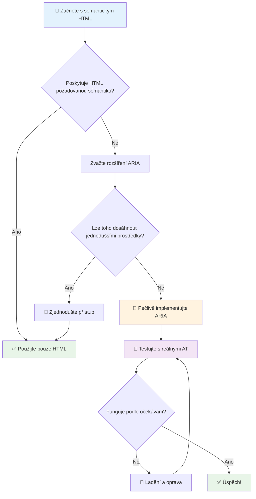
1. **Nejdřív sémantický HTML**: Vždy upřednostňujte `<button>` před `<div role="button">`
2. **Neznemožňujte sémantiku**: Nikdy nezasahujte do významu existujícího HTML (vyhněte se `<h1 role="button">`)
3. **Udržujte klávesnicovou přístupnost**: Všechny interaktivní ARIA prvky musí být plně přístupné z klávesnice
4. **Testujte s reálnými uživateli**: Podpora ARIA se mezi asistivními technologiemi výrazně liší
5. **Začněte jednoduše**: Složitější ARIA implementace často obsahují chyby

**🔍 Testovací workflow:**

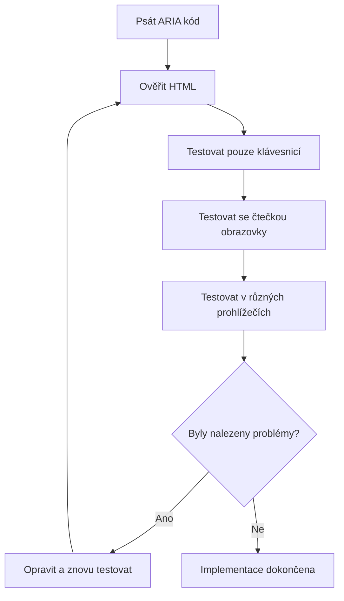
**🚫 Běžné chyby ARIA, kterým je třeba se vyhnout:**

- **Konfliktní informace**: Neprotirečte s HTML sémantikou
- **Nadměrné označování**: Příliš mnoho ARIA informací uživatele zahlcuje
- **Statická ARIA**: Zapomínání aktualizovat ARIA stavy při změně obsahu
- **Netestované implementace**: ARIA, která funguje jen teoreticky, ale v praxi selhává
- **Chybějící podpora klávesnice**: ARIA role bez odpovídajících klávesových interakcí

> 💡 **Testovací zdroje**: Použijte nástroje jako [accessibility-checker](https://www.npmjs.com/package/accessibility-checker) pro automatickou validaci ARIA, ale vždy testujte s reálnými čtečkami obrazovky pro kompletní zážitek.

### 🎭 **Kontrola dovedností ARIA: Jste připraveni na složité interakce?**

**Zhodnoťte svou ARIA jistotu:**
- Kdy byste zvolili ARIA místo sémantického HTML? (Nápověda: téměř nikdy!)
- Dokážete vysvětlit, proč je `<div role="button">` obvykle horší než `<button>`?
- Co je nejdůležitější si pamatovat při testování ARIA?

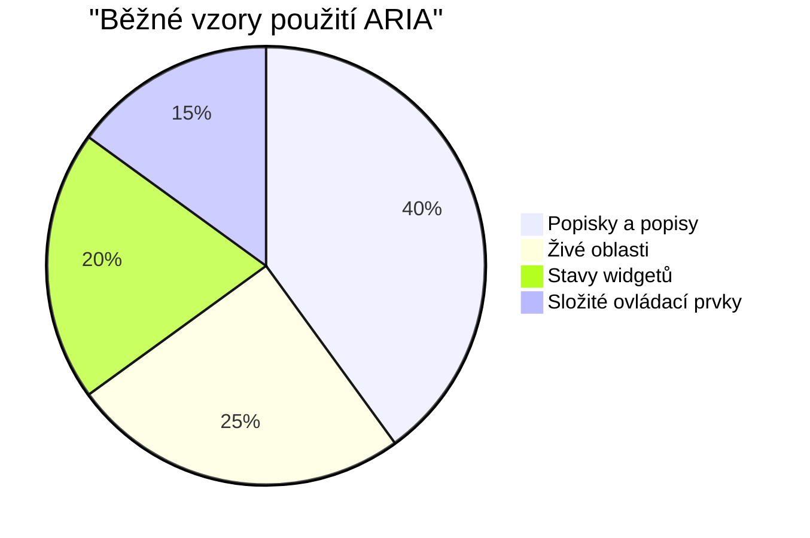
> **Klíčový poznatek**: Většina ARIA použití slouží k označování a popisování prvků. Složitější vzory widgetů jsou mnohem méně časté, než byste čekali!

✅ **Učte se od expertů**: Prostudujte [ARIA Authoring Practices Guide](https://w3c.github.io/aria-practices/) pro osvědčené vzory a implementace složitých interaktivních widgetů.

## Přístupnost obrázků a médií

Vizuální a zvukový obsah jsou základní součástí moderního webu, ale mohou vytvářet bariéry, pokud nejsou promyšleně implementovány. Cílem je zajistit, že informace a emocionální dopad médií dosáhne ke každému uživateli. Jakmile si zvyknete, stane se to samozřejmostí.

Různé druhy médií vyžadují různé přístupy k přístupnosti. Je to jako vaření – nebudete zacházet s jemnou rybou stejně jako s masitým steakem. Pochopení těchto rozdílů vám pomůže vybrat správné řešení pro každou situaci.

### Strategická přístupnost obrázků

Každý obrázek na vašem webu má svůj účel. Porozumění tomuto účelu vám pomůže napsat lepší alternativní text a vytvořit inkluzivnější prostředí.

**Čtyři typy obrázků a strategie jejich alt textu:**

**Informační obrázky** - předávají důležité informace:
```html

```

**Dekorační obrázky** - čistě vizuální, bez informační hodnoty:
```html

```

**Funkční obrázky** - slouží jako tlačítka nebo ovládací prvky:
```html
<button>
  
</button>
```

**Složité obrázky** - grafy, diagramy, infografiky:
```html

<div id="chart-description">
  <p>Detailed description: Sales data shows a steady increase across all quarters...</p>
</div>
```

### Přístupnost videa a audia

**Požadavky na video:**
- **Popisky**: Textová verze mluveného obsahu a zvukových efektů
- **Zvukové popisy**: Narativ vizuálních prvků pro nevidomé uživatele
- **Přepisy**: Plný text všechny zvukové i vizuální informace

```html
<video controls>
  <source src="video.mp4" type="video/mp4">
  <track kind="captions" src="captions.vtt" srclang="en" label="English">
  <track kind="descriptions" src="descriptions.vtt" srclang="en" label="Audio descriptions">
</video>
```

**Požadavky na audio:**
- **Přepisy**: Textová verze všech mluvených obsahů
- **Vizuální indikátory**: U zvukového obsahu poskytněte vizuální signály

### Moderní techniky pro obrázky

**Použití CSS pro dekorační obrázky:**
```css
.hero-section {
  background-image: url('decorative-hero.jpg');
  /* Decorative images in CSS don't need alt text */
}
```

**Responsivní obrázky s přístupností:**
```html
<picture>
  <source media="(min-width: 800px)" srcset="large-chart.png">
  <source media="(min-width: 400px)" srcset="medium-chart.png">
  
</picture>
```

✅ **Otestujte přístupnost obrázků**: Použijte čtečku obrazovky k procházení stránky s obrázky. Dostáváte dostatek informací pro pochopení obsahu?

## Klávesnicová navigace a správa fokusu

Mnoho uživatelů procházejí web výhradně pomocí klávesnice. Patří sem lidé s motorickým postižením, pokročilí uživatelé, kteří považují klávesnici za rychlejší než myš, a kdokoli, komu přestala fungovat myš. Zajištění bezproblémové klávesnicové navigace je klíčové a často také zvyšuje efektivnost webu pro všechny.

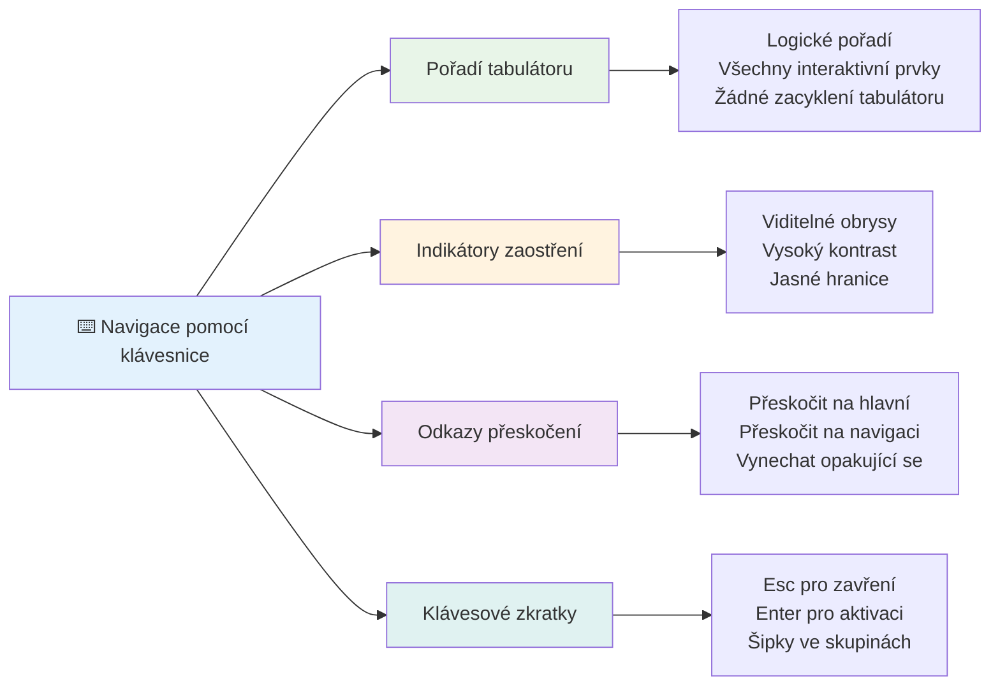
### Základní vzory klávesnicové navigace

**Standardní klávesové interakce:**
- **Tab**: Posun fokusu dopředu mezi interaktivními prvky
- **Shift + Tab**: Posun fokusu zpět
- **Enter**: Aktivace tlačítek a odkazů
- **Mezerník**: Aktivace tlačítek, zaškrtnutí zaškrtávacích políček
- **Šipky**: Navigace uvnitř skupin komponent (radio buttony, menu)
- **Escape**: Zavřít modální okna, rozbalovací seznamy, nebo zrušit akce

### Nejlepší postupy správy fokusu

**Viditelné indikátory fokusu:**
```css
/* Ensure focus is always visible */
button:focus-visible {
  outline: 2px solid #4A90A4;
  outline-offset: 2px;
}

/* Custom focus styles for different components */
.card:focus-within {
  box-shadow: 0 0 0 3px rgba(74, 144, 164, 0.5);
}
```

**Skočit na odkazy pro efektivní navigaci:**
```html
<a href="#main-content" class="skip-link">Skip to main content</a>
<a href="#navigation" class="skip-link">Skip to navigation</a>

<nav id="navigation">
  <!-- navigation content -->
</nav>
<main id="main-content">
  <!-- main content -->
</main>
```

**Správné pořadí tabulátoru:**
```html
<!-- Use semantic HTML for natural tab order -->
<form>
  <label for="name">Name:</label>
  <input type="text" id="name" tabindex="0">
  
  <label for="email">Email:</label>
  <input type="email" id="email" tabindex="0">
  
  <button type="submit" tabindex="0">Submit</button>
</form>
```

### Uzamčení fokusu v modálních oknech

Při otevření modálního dialogu by měl být fokus uzamčen uvnitř dialogu:

```javascript
// Moderní implementace pasti fokusů
function trapFocus(element) {
  const focusableElements = element.querySelectorAll(
    'button, [href], input, select, textarea, [tabindex]:not([tabindex="-1"])'
  );
  
  const firstElement = focusableElements[0];
  const lastElement = focusableElements[focusableElements.length - 1];

  element.addEventListener('keydown', (e) => {
    if (e.key === 'Tab') {
      if (e.shiftKey && document.activeElement === firstElement) {
        e.preventDefault();
        lastElement.focus();
      } else if (!e.shiftKey && document.activeElement === lastElement) {
        e.preventDefault();
        firstElement.focus();
      }
    }
    
    if (e.key === 'Escape') {
      closeModal();
    }
  });
  
  // Zaostřit na první prvek při otevření modálního okna
  firstElement.focus();
}
```

✅ **Otestujte klávesnicovou navigaci**: Zkuste procházet svůj web pouze pomocí klávesy Tab. Dostanete se ke všem interaktivním prvkům? Je pořadí fokusu logické? Jsou indikátory fokusu jasně viditelné?

## Přístupnost formulářů

Formuláře jsou zásadní pro interakci s uživateli a vyžadují zvláštní pozornost k přístupnosti.

### Přiřazení popisků k ovládacím prvkům formuláře

**Každý prvek formuláře potřebuje popisek:**
```html
<!-- Explicit labeling (preferred) -->
<label for="username">Username:</label>
<input type="text" id="username" name="username" required>

<!-- Implicit labeling -->
<label>
  Password:
  <input type="password" name="password" required>
</label>

<!-- Using aria-label when visual label isn't desired -->
<input type="search" aria-label="Search products" placeholder="Search...">
```

### Zpracování chyb a validace

**Přístupné chybové zprávy:**
```html
<label for="email">Email Address:</label>
<input type="email" id="email" name="email" 
       aria-describedby="email-error" 
       aria-invalid="true" required>
<div id="email-error" role="alert">
  Please enter a valid email address
</div>
```

**Nejlepší postupy validace formuláře:**
- Používejte `aria-invalid` pro označení neplatných polí
- Poskytujte jasné, konkrétní chybové zprávy
- Používejte `role="alert"` pro významné chybové oznámení
- Zobrazení chyb ihned i při odeslání formuláře

### Seskupování polí a fieldsety

**Seskupujte související ovládací prvky formuláře:**
```html
<fieldset>
  <legend>Shipping Address</legend>
  <label for="street">Street Address:</label>
  <input type="text" id="street" name="street">
  
  <label for="city">City:</label>
  <input type="text" id="city" name="city">
</fieldset>

<fieldset>
  <legend>Preferred Contact Method</legend>
  <input type="radio" id="contact-email" name="contact" value="email">
  <label for="contact-email">Email</label>
  
  <input type="radio" id="contact-phone" name="contact" value="phone">
  <label for="contact-phone">Phone</label>
</fieldset>
```

## Vaše cesta přístupnosti: Klíčové body

Gratulujeme! Právě jste získali základní znalosti potřebné k vytvoření skutečně inkluzivních webových zážitků. To je opravdu vzrušující! Webová přístupnost není jen o plnění požadavků – jde o pochopení různorodých způsobů, jakými lidé interagují s digitálním obsahem, a navrhování pro tuto úžasnou komplexnost.

Nyní jste součástí rostoucí komunity vývojářů, kteří chápou, že skvělý design funguje pro všechny. Vítejte v klubu!

**🎯 Váš nástrojový balíček pro přístupnost nyní zahrnuje:**

| Základní princip | Implementace | Dopad |
|------------------|--------------|--------|
| **Základ sémantického HTML** | Používejte správné HTML prvky k jejich účelu | Čtečky obrazovky mohou efektivně navigovat, klávesnice fungují automaticky |
| **Inkluzivní vizuální design** | Dostatečný kontrast, smysluplné použití barev, viditelné indikátory fokusu | Jasné pro všechny za jakýchkoli světelných podmínek |
| **Popisný obsah** | Významné texty odkazů, alt text, nadpisy | Uživatelé rozumí obsahu i bez vizuálního kontextu |
| **Klávesnicová přístupnost** | Pořadí tabulátoru, klávesové zkratky, správa fokusu | Přístupnost pro motoricky postižené a efektivita pro pokročilé uživatele |
| **Vylepšení ARIA** | Strategické použití k doplnění sémantických mezer | Složitější aplikace fungují s asistivními technologiemi |
| **Komplexní testování** | Automatizované nástroje + manuální ověření + testování s reálnými uživateli | Odhalení problémů dřív, než ovlivní uživatele |

**🚀 Vaše další kroky:**

1. **Začleňte přístupnost do svého pracovního postupu**: Nechte testování být přirozenou součástí vývoje
2. **Učte se od skutečných uživatelů**: Hledejte zpětnou vazbu od lidí, kteří používají asistivní technologie
3. **Buďte v obraze**: Techniky přístupnosti se vyvíjejí s novými technologiemi a standardy
4. **Podporujte inkluzi**: Sdílejte své znalosti a udělejte z přístupnosti týmovou prioritu

> 💡 **Pamatujte**: Omezení z hlediska přístupnosti často vedou k inovativním a elegantním řešením, která prospívají všem. Rampy, titulky a hlasové ovládání začaly jako přístupové funkce a staly se běžnými zlepšeními.

**Podnikatelský přínos je jasný**: Přístupné weby osloví více uživatelů, lépe se umisťují ve vyhledávačích, mají nižší náklady na údržbu a snižují právní rizika. Ale upřímně? Skutečný důvod péče o přístupnost je mnohem hlubší. Přístupné weby zosobňují nejlepší hodnoty webu – otevřenost, inkluzivitu a myšlenku, že každý má právo na rovný přístup k informacím.

Nyní jste vybaveni pro tvorbu inkluzivního webu budoucnosti. Každý přístupný web, který vytvoříte, činí internet přívětivějším místem pro všechny. To je opravdu úžasné, když nad tím přemýšlíte!

## Další zdroje

Pokračujte ve své cestě za přístupností s těmito základními zdroji:

**📚 Oficiální standardy a směrnice:**
- [WCAG 2.1 Guidelines](https://www.w3.org/WAI/WCAG21/quickref/) - Oficiální standard přístupnosti s rychlou referencí
- [ARIA Authoring Practices Guide](https://w3c.github.io/aria-practices/) - Komplexní vzory pro interaktivní widgety
- [WebAIM Guidelines](https://webaim.org/) - Praktické, začátečnické návody pro přístupnost

**🛠️ Nástroje a testovací zdroje:**
- [axe DevTools](https://www.deque.com/axe/devtools/) - Průmyslový standard pro testování přístupnosti
- [A11y Project Checklist](https://www.a11yproject.com/checklist/) - Krok za krokem ověřování přístupnosti
- [Accessibility Insights](https://accessibilityinsights.io/) - Microsoftí komplexní testovací sada
- [Color Oracle](https://colororacle.org/) - Simulátor barvosleposti pro testování designu

**🎓 Vzdělávání a komunita:**
- [WebAIM Screen Reader Survey](https://webaim.org/projects/screenreadersurvey9/) - Preference a chování reálných uživatelů
- [Inclusive Components](https://inclusive-components.design/) - Moderní vzory přístupných komponent
- [A11y Coffee](https://a11y.coffee/) - Rychlé tipy a poznatky o přístupnosti
- [Web Accessibility Initiative (WAI)](https://www.w3.org/WAI/) - W3C kompletní zdroje pro přístupnost

**🎥 Praktické vzdělávání:**
- [Accessibility Developer Guide](https://www.accessibility-developer-guide.com/) - Praktické návodné materiály
- [Deque University](https://dequeuniversity.com/) - Profesionální kurzy přístupnosti

## Výzva GitHub Copilot Agent 🚀

Použijte režim Agenta k dokončení následující výzvy:

**Popis:** Vytvořte přístupný modální dialogový komponent, který demonstruje správnou správu fokusu, ARIA atributy a vzory klávesnicové navigace.

**Úkol:** Postavte kompletní modální dialog pomocí HTML, CSS a JavaScriptu, který zahrnuje: správné uzamčení fokusu, klávesu ESC pro zavření, kliknutí mimo pro zavření, ARIA atributy pro čtečky obrazovky a viditelné indikátory fokusu. Modál by měl obsahovat formulář se správnými popisky a zpracováním chyb. Zajistěte, aby komponent splňoval standardy WCAG 2.1 AA.


## 🚀 Výzva

Vezměte tento HTML a přepište ho tak, aby byl co nejvíce přístupný podle naučených strategií.

```html
<!DOCTYPE html>
<html lang="en">
  <head>
    <meta charset="UTF-8">
    <meta name="viewport" content="width=device-width, initial-scale=1.0">
    <title>Turtle Ipsum - The World's Premier Turtle Fan Club</title>
    <link href='../assets/style.css' rel='stylesheet' type='text/css'>
  </head>
  <body>
    <header class="site-header">
      <h1 class="site-title">Turtle Ipsum</h1>
      <p class="site-subtitle">The World's Premier Turtle Fan Club</p>
    </header>
    
    <nav class="main-nav" aria-label="Main navigation">
      <h2 class="nav-header">Resources</h2>
      <ul class="nav-list">
        <li><a href="https://www.youtube.com/watch?v=CMNry4PE93Y">"I like turtles" video</a></li>
        <li><a href="https://en.wikipedia.org/wiki/Turtle">Basic turtle information</a></li>
        <li><a href="https://en.wikipedia.org/wiki/Turtles_(chocolate)">Chocolate turtles candy</a></li>
      </ul>
    </nav>
    
    <main class="main-content">
      <article>
        <h1>Welcome to Turtle Ipsum</h1>
        <p class="intro">
          <a href="/about">Learn more about our turtle community</a> and discover fascinating facts about these amazing creatures.
        </p>
        <p class="article-text">
          Turtle ipsum dolor sit amet, consectetur adipiscing elit, sed do eiusmod tempor incididunt ut labore et dolore magna aliqua. Ut enim ad minim veniam, quis nostrud exercitation ullamco laboris nisi ut aliquip ex ea commodo consequat. Duis aute irure dolor in reprehenderit in voluptate velit esse cillum dolore eu fugiat nulla pariatur. Excepteur sint occaecat cupidatat non proident, sunt in culpa qui officia deserunt mollit anim id est laborum.
        </p>
      </article>
    </main>
    
    <footer class="footer">
      <section class="newsletter-signup">
        <h2>Stay Updated</h2>
        <button type="button" onclick="showNewsletterForm()">Sign up for turtle news</button>
      </section>
      
      <nav class="footer-nav" aria-label="Footer navigation">
        <h2>Site Pages</h2>
        <ul>
          <li><a href="../">Home</a></li>
          <li><a href="../semantic">Semantic HTML example</a></li>
        </ul>
      </nav>
      
      <p class="footer-copyright">&copy; 2024 Instrument. All rights reserved.</p>
    </footer>
  </body>
</html>
```

**Hlavní provedená vylepšení:**
- Přidána správná sémantická HTML struktura
- Opravená hierarchie nadpisů (jediný h1, logický postup)
- Přidán smysluplný text odkazů místo "klikněte zde"
- Přidány správné ARIA popisky pro navigaci
- Přidán atribut lang a správné meta tagy
- Použit element button pro interaktivní prvky
- Strukturován obsah patičky s použitím správných landmarků

## Kvíz po přednášce
[Kvíz po přednášce](https://ff-quizzes.netlify.app/web/en/)

## Revize a samostudium

Mnoho vlád má zákony týkající se požadavků na přístupnost. Prostudujte zákony o přístupnosti ve vaší domovské zemi. Co je zahrnuto a co nikoli? Příklad najdete na [těchto vládních stránkách](https://accessibility.blog.gov.uk/).

## Zadání
 
[Analyzujte nepřístupný web](assignment.md)

Připis: [Turtle Ipsum](https://github.com/Instrument/semantic-html-sample) od Instrument

---

## 🚀 Váš časový plán mistrovství přístupnosti

### ⚡ **Co zvládnete během příštích 5 minut**
- [ ] Nainstalujte rozšíření axe DevTools do svého prohlížeče
- [ ] Proveďte Lighthouse audit přístupnosti na svém oblíbeném webu
- [ ] Zkuste procházet libovolný web pouze pomocí klávesy Tab
- [ ] Otestujte vestavěnou čtečku obrazovky ve svém prohlížeči (Narrator/VoiceOver)

### 🎯 **Co můžete zvládnout během této hodiny**
- [ ] Dokončete kvíz po lekci a zamyslete se nad poznatky o přístupnosti
- [ ] Procvičte psaní smysluplného alt textu pro 10 různých obrázků
- [ ] Proveďte audit struktury nadpisů na webu pomocí rozšíření HeadingsMap
- [ ] Opravte chyby přístupnosti nalezené ve výzvě HTML
- [ ] Otestujte kontrast barev ve svém aktuálním projektu pomocí nástroje WebAIM

### 📅 **Vaše týdenní cesta k přístupnosti**
- [ ] Splňte zadání analýzy nepřístupného webu
- [ ] Nastavte své vývojové prostředí s nástroji pro testování přístupnosti
- [ ] Procvičte klávesnicovou navigaci na 5 různých složitých webových stránkách
- [ ] Vytvořte jednoduchý formulář s odpovídajícími popisky, zpracováním chyb a ARIA
- [ ] Připojte se k komunitě zabývající se přístupností (A11y Slack, WebAIM fórum)
- [ ] Sledujte skutečné uživatele s postižením, jak se pohybují na webu (YouTube má skvělé příklady)

### 🌟 **Vaše měsíční proměna**
- [ ] Začleňte testování přístupnosti do svého vývojového workflow
- [ ] Přispějte do open source projektu opravou problémů s přístupností
- [ ] Proveďte testování použitelnosti s někým, kdo používá asistivní technologie
- [ ] Vytvořte přístupnou knihovnu komponent pro svůj tým
- [ ] Prosazujte přístupnost ve svém pracovišti nebo komunitě
- [ ] Mentorujte někoho nového v konceptech přístupnosti

### 🏆 **Závěrečné ověření šampiona přístupnosti**

**Oslavte svou cestu za přístupností:**
- Co vás nejvíce překvapilo ohledně toho, jak lidé používají web?
- Který princip přístupnosti nejvíce rezonuje s vaším vývojovým stylem?
- Jak vám znalosti o přístupnosti změnily pohled na design?
- Jakou první úpravu přístupnosti chcete udělat na reálném projektu?

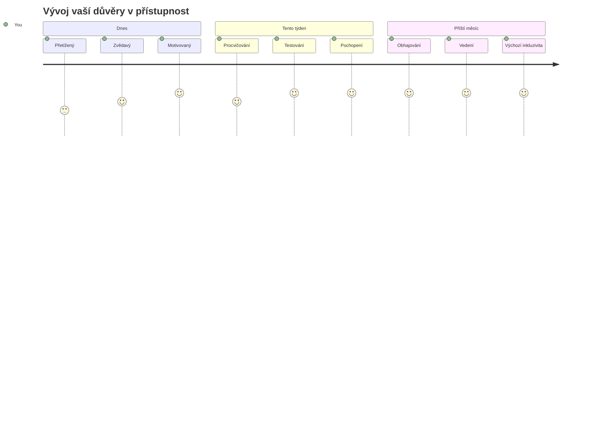
> 🌍 **Jste nyní šampionem přístupnosti!** Chápete, že skvělé webové zážitky fungují pro všechny, bez ohledu na to, jak k webu přistupují. Každá přístupná funkce, kterou vytvoříte, činí internet inkluzivnějším. Web potřebuje vývojáře jako vy, kteří vnímají přístupnost nikoli jako omezení, ale jako příležitost vytvářet lepší zážitky pro všechny uživatele. Vítejte v hnutí! 🎉

---

<!-- CO-OP TRANSLATOR DISCLAIMER START -->
**Prohlášení**:
Tento dokument byl přeložen pomocí AI překladatelské služby [Co-op Translator](https://github.com/Azure/co-op-translator). I když usilujeme o přesnost, mějte prosím na paměti, že automatizované překlady mohou obsahovat chyby nebo nepřesnosti. Původní dokument v jeho mateřském jazyce by měl být považován za závazný zdroj. U kritických informací se doporučuje využít profesionální lidský překlad. Nepřebíráme odpovědnost za jakékoli nedorozumění nebo chybné výklady vyplývající z použití tohoto překladu.
<!-- CO-OP TRANSLATOR DISCLAIMER END -->