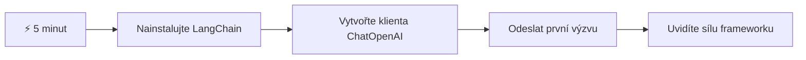
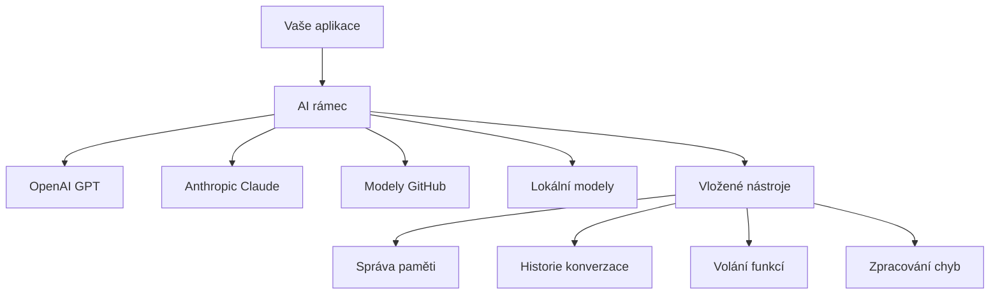
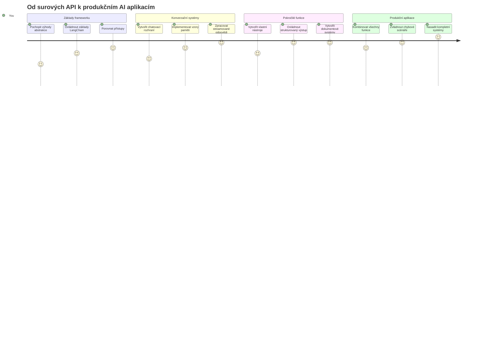
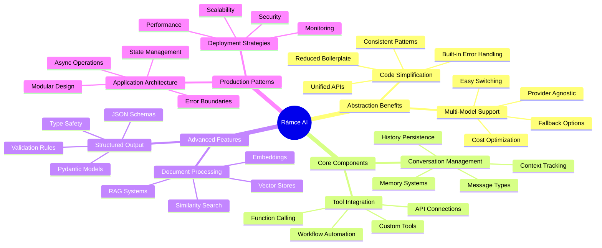
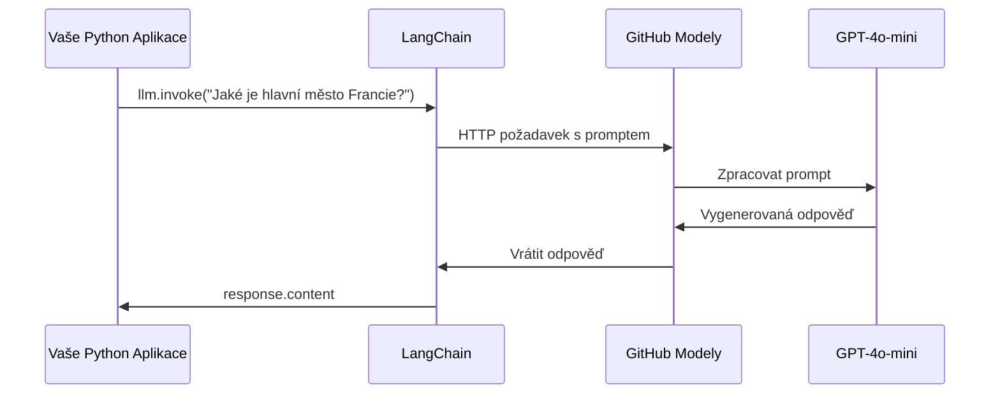
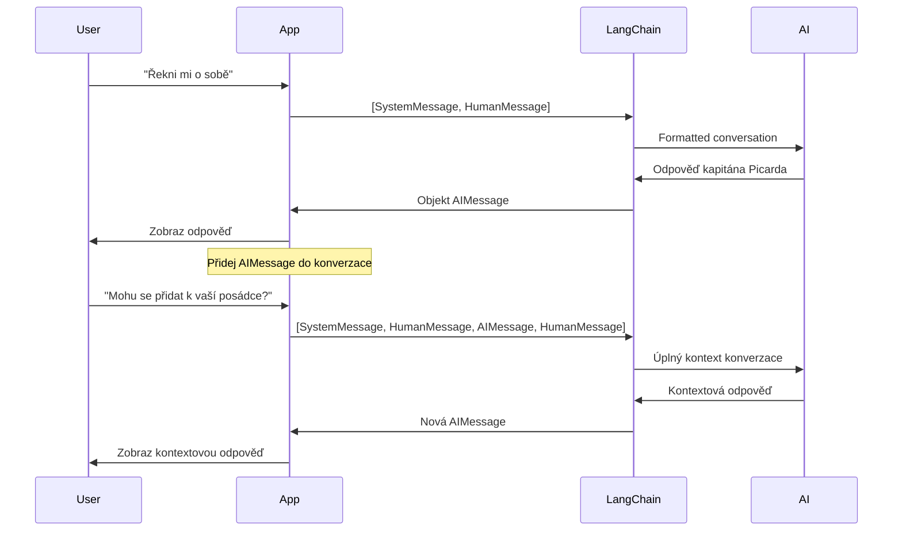
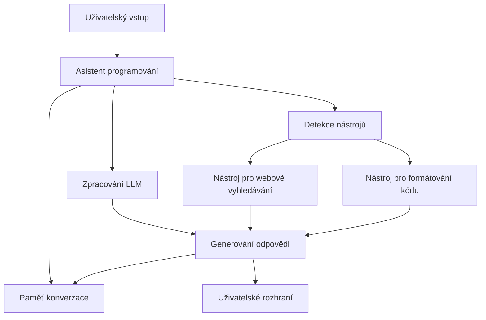
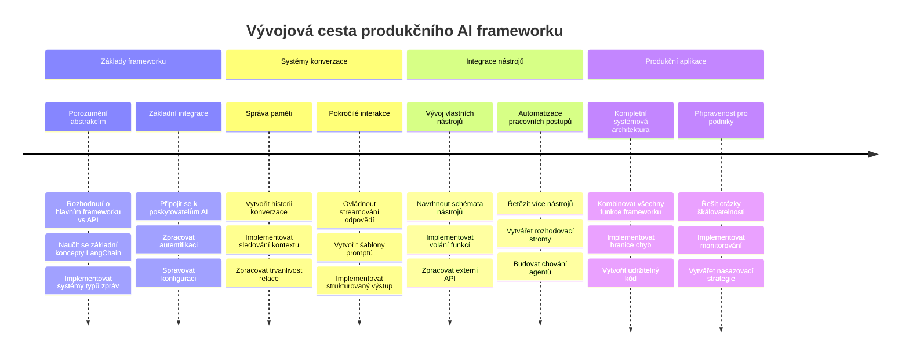
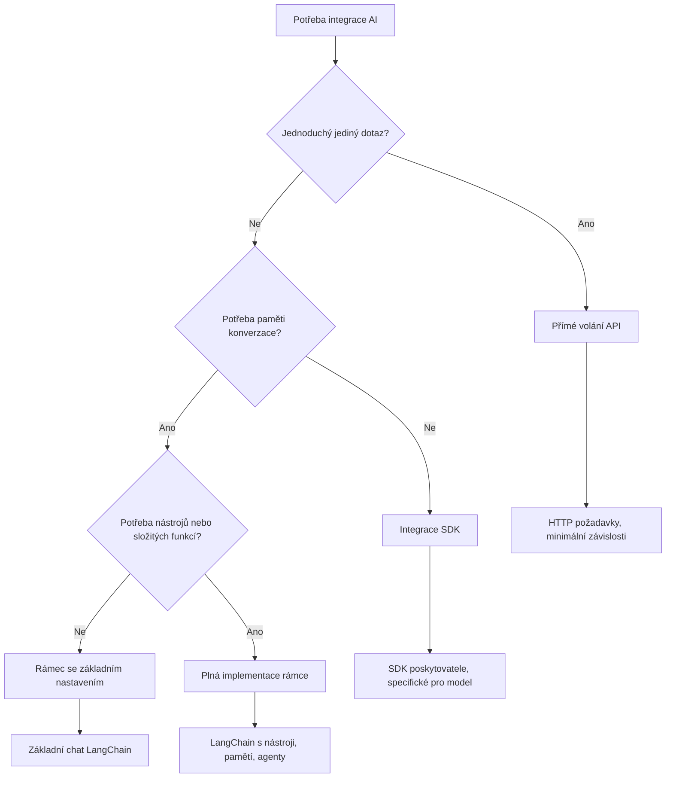

# AI Framework

Už jste někdy měli pocit, že je příliš složité vytvářet AI aplikace od začátku? Nejste sami! AI frameworky jsou jako švýcarský armádní nůž pro vývoj AI – jsou to silné nástroje, které vám mohou ušetřit čas a bolesti hlavy při vytváření inteligentních aplikací. Představte si AI framework jako dobře uspořádanou knihovnu: poskytuje předpřipravené komponenty, standardizovaná API a chytré abstrakce, abyste se mohli soustředit na řešení problémů místo boje s detaily implementace.

V této lekci prozkoumáme, jak frameworky jako LangChain dokážou změnit dříve složité úkoly integrace AI na čistý, čitelný kód. Objevíte, jak řešit reálné výzvy jako sledování konverzací, implementace volání nástrojů a ovládání různých AI modelů přes jedno sjednocené rozhraní.

Až skončíme, budete vědět, kdy sáhnout po frameworku místo přímých API volání, jak efektivně využívat jejich abstrakce a jak vytvářet AI aplikace připravené pro reálné použití. Pojďme prozkoumat, co AI frameworky mohou udělat pro vaše projekty.

## ⚡ Co zvládnete za dalších 5 minut

**Rychlá cesta pro zaneprázdněné vývojáře**


- **Minuta 1**: Nainstalujte LangChain: `pip install langchain langchain-openai`
- **Minuta 2**: Nastavte svůj GitHub token a importujte klienta ChatOpenAI
- **Minuta 3**: Vytvořte jednoduchou konverzaci se systémovými a lidskými zprávami
- **Minuta 4**: Přidejte základní nástroj (například funkci add) a vyzkoušejte volání nástroje z AI
- **Minuta 5**: Zažijte rozdíl mezi přímými API voláními a abstrakcí frameworku

**Rychlý testovací kód**:
```python
from langchain_openai import ChatOpenAI
from langchain_core.messages import SystemMessage, HumanMessage

llm = ChatOpenAI(
    api_key=os.environ["GITHUB_TOKEN"],
    base_url="https://models.github.ai/inference",
    model="openai/gpt-4o-mini"
)

response = llm.invoke([
    SystemMessage(content="You are a helpful coding assistant"),
    HumanMessage(content="Explain Python functions briefly")
])
print(response.content)
```

**Proč je to důležité**: Za 5 minut zažijete, jak AI frameworky mění složitou integraci AI na jednoduchá volání metod. To je základ, který pohání produkční AI aplikace.

## Proč zvolit framework?

Takže jste připraveni vytvořit AI aplikaci – skvělé! Ale je tu věc: máte několik různých cest, kterými se můžete vydat, a každá má svá pro a proti. Je to jako vybírat mezi chůzí, jízdou na kole nebo autem, jak se někam dostat – všechny vás dovedou do cíle, ale zážitek (a úsilí) bude zcela odlišné.

Pojďme si rozebrat tři hlavní způsoby, jak můžete AI integrovat do svých projektů:

| Přístup | Výhody | Nejvhodnější pro | Úvahy |
|----------|------------|----------|--------------|
| **Přímé HTTP požadavky** | Plná kontrola, žádné závislosti | Jednoduché dotazy, učení základů | Verbózní kód, ruční zpracování chyb |
| **Integrace přes SDK** | Méně boilerplate, optimalizace pro modely | Aplikace s jedním modelem | Omezeno na konkrétní poskytovatele |
| **AI Frameworky** | Sjednocené API, vestavěné abstrakce | Multi-modelové aplikace, složité workflow | Křivka učení, možná nadměrná abstrakce |

### Výhody frameworků v praxi


**Proč jsou frameworky důležité:**
- **Sjednocují** různé AI poskytovatele pod jedno rozhraní
- **Automaticky** spravují paměť konverzací
- **Poskytují** hotové nástroje pro běžné úkoly jako embeddingy a volání funkcí
- **Řeší** zpracování chyb a logiku opakování
- **Přeměňují** složité workflow na čitelná volání metod

> 💡 **Profesionální tip**: Frameworky používejte při přepínání mezi různými AI modely nebo při budování složitých funkcí jako agenti, paměť či volání nástrojů. Přímá API jsou vhodná při učení základů nebo tvorbě jednoduchých, zaměřených aplikací.

**Shrnutí**: Jako když vybíráte mezi specializovanými řemeslnickými nástroji a kompletní dílnou – jde o volbu správného nástroje pro úkol. Frameworky excelují u komplexních, bohatých aplikací, zatímco přímé API jsou ideální pro přímá použití.

## 🗺️ Vaše cesta k mistrovství v AI frameworkech


**Cíl vaší cesty**: Na konci této lekce zvládnete vývoj v AI frameworku a budete schopni vytvořit sofistikované, produkčně připravené AI aplikace, které se vyrovnají komerčním AI asistentům.

## Úvod

V této lekci se naučíme:

- Používat běžný AI framework.
- Řešit běžné problémy jako chatové konverzace, používání nástrojů, paměť a kontext.
- Využít to k vytváření AI aplikací.

## 🧠 Ekosystém vývoje AI frameworků


**Základní princip**: AI frameworky abstraktují složitost a zároveň poskytují silné abstrakce pro správu konverzací, integraci nástrojů a zpracování dokumentů, což umožňuje vývojářům vytvářet sofistikované AI aplikace s čistým, udržitelným kódem.

## Váš první AI prompt

Začněme s temelními věcmi vytvořením první AI aplikace, která pošle otázku a dostane odpověď zpět. Stejně jako Archimedes objevil princip vztlačnosti ve své koupeli, i ty nejjednodušší pozorování často vedou k těm nejsilnějším postřehům – a frameworky tyto postřehy zpřístupňují.

### Nastavení LangChain s GitHub modely

Použijeme LangChain k připojení na GitHub modely, což je super, protože to poskytuje zdarma přístup k různým AI modelům. Nejlepší část? Potřebujete jen pár jednoduchých konfiguračních parametrů, abyste začali:

```python
from langchain_openai import ChatOpenAI
import os

llm = ChatOpenAI(
    api_key=os.environ["GITHUB_TOKEN"],
    base_url="https://models.github.ai/inference",
    model="openai/gpt-4o-mini",
)

# Odeslat jednoduchý výzvu
response = llm.invoke("What's the capital of France?")
print(response.content)
```

**Rozbor toho, co se zde děje:**
- **Vytváří** LangChain klienta pomocí třídy `ChatOpenAI` – to je vaše brána k AI!
- **Konfiguruje** připojení k GitHub modelům s vaším autentizačním tokenem
- **Určuje**, který AI model použít (`gpt-4o-mini`) – představte si to jako výběr vašeho AI asistenta
- **Odesílá** vaši otázku pomocí metody `invoke()` – zde se děje magie
- **Extrahuje** a zobrazí odpověď – voilà, komunikujete s AI!

> 🔧 **Poznámka k nastavení**: Pokud používáte GitHub Codespaces, máte štěstí – `GITHUB_TOKEN` je již nastaven! Pracujete lokálně? Žádný problém, stačí vytvořit osobní přístupový token s potřebnými oprávněními.

**Očekávaný výstup:**
```text
The capital of France is Paris.
```


## Vytváření konverzační AI

Ten první příklad ukazuje základy, ale je to jen jedno výměnné kolo – položíte otázku, dostanete odpověď a je to. V reálných aplikacích chcete, aby si AI pamatovala, o čem jste mluvili, jako Watson a Holmes, kteří budovali své vyšetřovací rozhovory postupně.

Tady přichází LangChain opravdu vhod. Poskytuje různé typy zpráv, které pomáhají strukturovat konverzace a umožňují dát vaší AI osobnost. Budete vytvářet chatové zážitky, které udržují kontext a charakter.

### Pochopení typů zpráv

Představte si tyto typy zpráv jako různé „čepice“, které účastníci konverzace nosí. LangChain používá různé třídy zpráv, aby sledoval, kdo co říká:

| Typ zprávy | Účel | Příklad použití |
|--------------|---------|------------------|
| `SystemMessage` | Definuje osobnost a chování AI | „Jsi užitečný asistent pro kódování“ |
| `HumanMessage` | Reprezentuje vstup uživatele | „Vysvětli, jak fungují funkce“ |
| `AIMessage` | Uchovává odpovědi AI | Předchozí AI odpovědi v konverzaci |

### Vytvoření první konverzace

Vytvoříme konverzaci, ve které AI předstírá konkrétní roli. Půjde o kapitána Picarda – postavu známou svou diplomatickou moudrostí a vedením:

```python
messages = [
    SystemMessage(content="You are Captain Picard of the Starship Enterprise"),
    HumanMessage(content="Tell me about you"),
]
```

**Rozbor nastavení této konverzace:**
- **Stanoví** roli a osobnost AI přes `SystemMessage`
- **Dává** počáteční uživatelský dotaz přes `HumanMessage`
- **Vytváří** základ pro vícekolovou konverzaci

Celý kód tohoto příkladu vypadá takto:

```python
from langchain_core.messages import HumanMessage, SystemMessage
from langchain_openai import ChatOpenAI
import os

llm = ChatOpenAI(
    api_key=os.environ["GITHUB_TOKEN"],
    base_url="https://models.github.ai/inference",
    model="openai/gpt-4o-mini",
)

messages = [
    SystemMessage(content="You are Captain Picard of the Starship Enterprise"),
    HumanMessage(content="Tell me about you"),
]


# funguje
response  = llm.invoke(messages)
print(response.content)
```

Měli byste vidět výsledek podobný:

```text
I am Captain Jean-Luc Picard, the commanding officer of the USS Enterprise (NCC-1701-D), a starship in the United Federation of Planets. My primary mission is to explore new worlds, seek out new life and new civilizations, and boldly go where no one has gone before. 

I believe in the importance of diplomacy, reason, and the pursuit of knowledge. My crew is diverse and skilled, and we often face challenges that test our resolve, ethics, and ingenuity. Throughout my career, I have encountered numerous species, grappled with complex moral dilemmas, and have consistently sought peaceful solutions to conflicts.

I hold the ideals of the Federation close to my heart, believing in the importance of cooperation, understanding, and respect for all sentient beings. My experiences have shaped my leadership style, and I strive to be a thoughtful and just captain. How may I assist you further?
```

Pro zachování kontinuity konverzace (místo resetování kontextu pokaždé) je potřeba přidávat odpovědi do seznamu zpráv. Podobně jako ústní tradice, které uchovávaly příběhy mezi generacemi, tento přístup vytváří trvalou paměť:

```python
from langchain_core.messages import HumanMessage, SystemMessage
from langchain_openai import ChatOpenAI
import os

llm = ChatOpenAI(
    api_key=os.environ["GITHUB_TOKEN"],
    base_url="https://models.github.ai/inference",
    model="openai/gpt-4o-mini",
)

messages = [
    SystemMessage(content="You are Captain Picard of the Starship Enterprise"),
    HumanMessage(content="Tell me about you"),
]


# funguje
response  = llm.invoke(messages)

print(response.content)

print("---- Next ----")

messages.append(response)
messages.append(HumanMessage(content="Now that I know about you, I'm Chris, can I be in your crew?"))

response  = llm.invoke(messages)

print(response.content)

```

Docela šikovné, že? Děje se tu to, že voláme LLM dvakrát – nejprve jen s našimi dvěma počátečními zprávami, pak znovu s celou historií konverzace. Je to, jako by AI opravdu sledovala náš chat!

Když tento kód spustíte, dostanete druhou odpověď, která zní přibližně takto:

```text
Welcome aboard, Chris! It's always a pleasure to meet those who share a passion for exploration and discovery. While I cannot formally offer you a position on the Enterprise right now, I encourage you to pursue your aspirations. We are always in need of talented individuals with diverse skills and backgrounds. 

If you are interested in space exploration, consider education and training in the sciences, engineering, or diplomacy. The values of curiosity, resilience, and teamwork are crucial in Starfleet. Should you ever find yourself on a starship, remember to uphold the principles of the Federation: peace, understanding, and respect for all beings. Your journey can lead you to remarkable adventures, whether in the stars or on the ground. Engage!
```


Beru to jako možná ;)

## Streamování odpovědí

Zaznamenali jste někdy, že ChatGPT „píše“ své odpovědi v reálném čase? To je právě streamování. Jako když sledujete mistra kaligrafie, který postupně vykresluje tahy místo toho, aby text náhle zmizel nebo se objevil – streamování dělá interakci přirozenější a poskytuje okamžitou zpětnou vazbu.

### Implementace streamování s LangChain

```python
from langchain_openai import ChatOpenAI
import os

llm = ChatOpenAI(
    api_key=os.environ["GITHUB_TOKEN"],
    base_url="https://models.github.ai/inference",
    model="openai/gpt-4o-mini",
    streaming=True
)

# Proudové odesílání odpovědi
for chunk in llm.stream("Write a short story about a robot learning to code"):
    print(chunk.content, end="", flush=True)
```

**Proč je streamování skvělé:**
- **Zobrazuje** obsah, jak je tvořen – žádné trapné čekání!
- **Dává** uživatelům pocit, že se něco skutečně děje
- **Působí** rychleji, i když technicky nemusí být
- **Umožňuje** začít číst, zatímco AI ještě „přemýšlí“

> 💡 **Tip pro uživatelský dojem**: Streamování skutečně exceluje u delších odpovědí jako jsou vysvětlení kódu, kreativní psaní nebo podrobné návody. Vaši uživatelé ocení sledování postupu místo dívat se na prázdnou obrazovku!

### 🎯 Pedagogická zastávka: Výhody abstrakce frameworku

**Zastavte se a zamyslete**: Právě jste zažili sílu abstrakcí AI frameworku. Porovnejte to, co jste se naučili, s přímými API voláními z předchozích lekcí.

**Rychlé sebehodnocení**:
- Dokážete vysvětlit, jak LangChain zjednodušuje správu konverzace oproti ručnímu sledování zpráv?
- Jaký je rozdíl mezi metodami `invoke()` a `stream()`, a kdy byste je použili?
- Jak systém typů zpráv frameworku zlepšuje organizaci kódu?

**Spojení s reálným světem**: Abstrakční vzory, které jste poznali (typy zpráv, streamovací rozhraní, paměť konverzace), se používají v každé hlavní AI aplikaci – od rozhraní ChatGPT po asistenci psaní v GitHub Copilot. Ovládáte stejné architektonické vzory, které používají profesionální vývojové týmy AI.

**Výzva**: Jak byste navrhli abstrakci frameworku pro integraci různých AI modelů (OpenAI, Anthropic, Google) do jediného rozhraní? Zvažte výhody a kompromisy.

## Šablony promptů

Šablony promptů fungují jako rétorické struktury používané v klasické oratorii – jako když Cicero přizpůsoboval své řeční vzory různým publikům, ale zachoval stejný přesvědčivý rámec. Umožňují vytvářet znovupoužitelné prompty, kde můžete měnit jednotlivé části informací, aniž byste všechno přepisovali. Jakmile nastavíte šablonu, jen doplňujete proměnné s hodnotami podle potřeby.

### Vytváření znovupoužitelných promptů

```python
from langchain_core.prompts import ChatPromptTemplate

# Definujte šablonu pro vysvětlení kódu
template = ChatPromptTemplate.from_messages([
    ("system", "You are an expert programming instructor. Explain concepts clearly with examples."),
    ("human", "Explain {concept} in {language} with a practical example for {skill_level} developers")
])

# Použijte šablonu s různými hodnotami
questions = [
    {"concept": "functions", "language": "JavaScript", "skill_level": "beginner"},
    {"concept": "classes", "language": "Python", "skill_level": "intermediate"},
    {"concept": "async/await", "language": "JavaScript", "skill_level": "advanced"}
]

for question in questions:
    prompt = template.format_messages(**question)
    response = llm.invoke(prompt)
    print(f"Topic: {question['concept']}\n{response.content}\n---\n")
```

**Proč si šablony zamilujete:**
- **Udržují** vaše prompty konzistentní v celé aplikaci
- **Žádné** nepřehledné skládání řetězců – jen čisté, jednoduché proměnné
- **Vaše AI** se chová předvídatelně, protože struktura zůstává stejná
- **Aktualizace** jsou hračka – změníte šablonu jednou a je to opravené všude

## Strukturovaný výstup

Někdy vás může rozčilovat snaha parsovat AI odpovědi, které přicházejí jako nestrukturovaný text? Strukturovaný výstup je jako naučit AI postupovat systematicky jako Linnaeus při biologické klasifikaci – organizovaný, předvídatelný a snadno zpracovatelný. Můžete požadovat JSON, specifické datové struktury nebo jakýkoliv formát, který potřebujete.

### Definování výstupních schémat

```python
from langchain_core.prompts import ChatPromptTemplate
from langchain_core.output_parsers import JsonOutputParser
from pydantic import BaseModel, Field

class CodeReview(BaseModel):
    score: int = Field(description="Code quality score from 1-10")
    strengths: list[str] = Field(description="List of code strengths")
    improvements: list[str] = Field(description="List of suggested improvements")
    overall_feedback: str = Field(description="Summary feedback")

# Nastavit parser
parser = JsonOutputParser(pydantic_object=CodeReview)

# Vytvořit prompt s instrukcemi formátu
prompt = ChatPromptTemplate.from_messages([
    ("system", "You are a code reviewer. {format_instructions}"),
    ("human", "Review this code: {code}")
])

# Naformátovat prompt s instrukcemi
chain = prompt | llm | parser

# Získat strukturovanou odpověď
code_sample = """
def calculate_average(numbers):
    return sum(numbers) / len(numbers)
"""

result = chain.invoke({
    "code": code_sample,
    "format_instructions": parser.get_format_instructions()
})

print(f"Score: {result['score']}")
print(f"Strengths: {', '.join(result['strengths'])}")
```

**Proč je strukturovaný výstup zásadní:**
- **Už žádné** hádání, jaký formát dostanete – je vždy stejný
- **Přímo se** propojuje s vaší databází a API bez další práce
- **Zachytí** podivné AI odpovědi dřív, než vaši aplikaci rozbijí
- **Zpřehledňuje** váš kód, protože přesně víte, s čím pracujete

## Volání nástrojů

Teď přicházíme k jedné z nejsilnějších funkcí: nástroje. Takto dáte své AI praktické schopnosti nad rámec samotné konverzace. Jako středověká cechová řemesla, která vyvíjela specializované nástroje pro konkrétní řemesla, můžete i AI vybavit cílenými přístroji. Popíšete, jaké nástroje jsou k dispozici, a když někdo požádá o něco, co odpovídá, AI může akci provést.

### Použití Pythonu

Přidáme nějaké nástroje takto:

```python
from typing_extensions import Annotated, TypedDict

class add(TypedDict):
    """Add two integers."""

    # Anotace musí mít typ a mohou volitelně obsahovat výchozí hodnotu a popis (v tomto pořadí).
    a: Annotated[int, ..., "First integer"]
    b: Annotated[int, ..., "Second integer"]

tools = [add]

functions = {
    "add": lambda a, b: a + b
}
```

Co se tady děje? Vytváříme plán nástroje zvaného `add`. Děděním od `TypedDict` a použitím těch propracovaných `Annotated` typů pro `a` a `b` dáváme LLM jasný obraz o tom, co tento nástroj dělá a co potřebuje. Slovník `functions` je jako naše sada nástrojů – říká našemu kódu přesně, co má dělat, když AI rozhodne nástroj použít.

Podívejme se, jak LLM voláme s tímto nástrojem:

```python
llm = ChatOpenAI(
    api_key=os.environ["GITHUB_TOKEN"],
    base_url="https://models.github.ai/inference",
    model="openai/gpt-4o-mini",
)

llm_with_tools = llm.bind_tools(tools)
```

Zde voláme `bind_tools` s naším polem `tools` a tím získá LLM `llm_with_tools` znalosti o tomto nástroji.

Pro použití tohoto nového LLM můžeme napsat následující kód:

```python
query = "What is 3 + 12?"

res = llm_with_tools.invoke(query)
if(res.tool_calls):
    for tool in res.tool_calls:
        print("TOOL CALL: ", functions[tool["name"]](../../../10-ai-framework-project/**tool["args"]))
print("CONTENT: ",res.content)
```

Nyní, když voláme `invoke` na tomto novém llm, který má nástroje, může být vlastnost `tool_calls` vyplněná. Pokud ano, každý identifikovaný nástroj má vlastnosti `name` a `args`, které určují, jaký nástroj má být zavolán a s jakými argumenty. Kompletní kód vypadá takto:

```python
from langchain_core.messages import HumanMessage, SystemMessage
from langchain_openai import ChatOpenAI
import os
from typing_extensions import Annotated, TypedDict

class add(TypedDict):
    """Add two integers."""

    # Anotace musí mít typ a mohou volitelně obsahovat výchozí hodnotu a popis (v tomto pořadí).
    a: Annotated[int, ..., "First integer"]
    b: Annotated[int, ..., "Second integer"]

tools = [add]

functions = {
    "add": lambda a, b: a + b
}

llm = ChatOpenAI(
    api_key=os.environ["GITHUB_TOKEN"],
    base_url="https://models.github.ai/inference",
    model="openai/gpt-4o-mini",
)

llm_with_tools = llm.bind_tools(tools)

query = "What is 3 + 12?"

res = llm_with_tools.invoke(query)
if(res.tool_calls):
    for tool in res.tool_calls:
        print("TOOL CALL: ", functions[tool["name"]](../../../10-ai-framework-project/**tool["args"]))
print("CONTENT: ",res.content)
```

Po spuštění tohoto kódu byste měli vidět výstup podobný:

```text
TOOL CALL:  15
CONTENT: 
```

AI analyzovalo „Co je 3 + 12“ a rozpoznalo to jako úkol pro nástroj `add`. Stejně jako zkušený knihovník ví, jaký zdroj použít podle typu otázky, rozhodlo na základě jména nástroje, popisu a specifikace polí. Výsledek 15 pochází z našeho slovníku `functions`, který nástroj vykonal:

```python
print("TOOL CALL: ", functions[tool["name"]](../../../10-ai-framework-project/**tool["args"]))
```

### Zajímavější nástroj, který volá webové API
Přidávání čísel demonstruje koncept, ale skutečné nástroje obvykle provádějí složitější operace, jako je volání webových API. Rozšíříme náš příklad tak, aby AI načítala obsah z internetu – podobně jako kdysi telegrafisté spojovali vzdálená místa:

```python
class joke(TypedDict):
    """Tell a joke."""

    # Anotace musí mít typ a mohou volitelně obsahovat výchozí hodnotu a popis (v tomto pořadí).
    category: Annotated[str, ..., "The joke category"]

def get_joke(category: str) -> str:
    response = requests.get(f"https://api.chucknorris.io/jokes/random?category={category}", headers={"Accept": "application/json"})
    if response.status_code == 200:
        return response.json().get("value", f"Here's a {category} joke!")
    return f"Here's a {category} joke!"

functions = {
    "add": lambda a, b: a + b,
    "joke": lambda category: get_joke(category)
}

query = "Tell me a joke about animals"

# zbytek kódu je stejný
```

Pokud nyní tento kód spustíte, dostanete odpověď s něčím jako:

```text
TOOL CALL:  Chuck Norris once rode a nine foot grizzly bear through an automatic car wash, instead of taking a shower.
CONTENT:  
```

```mermaid
flowchart TD
    A[Uživatelský dotaz: "Řekni mi vtip o zvířatech"] --> B[Analýza LangChain]
    B --> C{Nástroj dostupný?}
    C -->|Ano| D[Vybrat nástroj pro vtipy]
    C -->|Ne| E[Vygenerovat přímou odpověď]
    
    D --> F[Získat parametry]
    F --> G[Zavolat vtip(kategorie="zvířata")]
    G --> H[API požadavek na chucknorris.io]
    H --> I[Vratit obsah vtipu]
    I --> J[Zobrazit uživateli]
    
    E --> K[Odpověď generovaná AI]
    K --> J
    
    subgraph "Vrstva definice nástroje"
        L[TypedDict Schéma]
        M[Implementace funkce]
        N[Validace parametrů]
    end
    
    D --> L
    F --> N
    G --> M
```
Zde je celý kód:

```python
from langchain_openai import ChatOpenAI
import requests
import os
from typing_extensions import Annotated, TypedDict

class add(TypedDict):
    """Add two integers."""

    # Anotace musí mít typ a mohou volitelně obsahovat výchozí hodnotu a popis (v tomto pořadí).
    a: Annotated[int, ..., "First integer"]
    b: Annotated[int, ..., "Second integer"]

class joke(TypedDict):
    """Tell a joke."""

    # Anotace musí mít typ a mohou volitelně obsahovat výchozí hodnotu a popis (v tomto pořadí).
    category: Annotated[str, ..., "The joke category"]

tools = [add, joke]

def get_joke(category: str) -> str:
    response = requests.get(f"https://api.chucknorris.io/jokes/random?category={category}", headers={"Accept": "application/json"})
    if response.status_code == 200:
        return response.json().get("value", f"Here's a {category} joke!")
    return f"Here's a {category} joke!"

functions = {
    "add": lambda a, b: a + b,
    "joke": lambda category: get_joke(category)
}

llm = ChatOpenAI(
    api_key=os.environ["GITHUB_TOKEN"],
    base_url="https://models.github.ai/inference",
    model="openai/gpt-4o-mini",
)

llm_with_tools = llm.bind_tools(tools)

query = "Tell me a joke about animals"

res = llm_with_tools.invoke(query)
if(res.tool_calls):
    for tool in res.tool_calls:
        # print("VOLÁNÍ NÁSTROJE: ", tool)
        print("TOOL CALL: ", functions[tool["name"]](../../../10-ai-framework-project/**tool["args"]))
print("CONTENT: ",res.content)
```

## Vkládání (embeddings) a zpracování dokumentů

Vkládání představují jedno z nejpůvabnějších řešení v moderní AI. Představte si, že byste mohli vzít jakýkoli text a převést ho na číselné souřadnice, které zachycují jeho význam. Přesně to vkládání dělají – přeměňují text na body v mnohorozměrném prostoru, kde se podobné koncepty shlukují dohromady. Je to jako mít souřadnicový systém pro myšlenky, připomínající, jak Mendelejev uspořádal periodickou tabulku podle atomových vlastností.

### Vytváření a použití vkládání

```python
from langchain_openai import OpenAIEmbeddings
from langchain_community.vectorstores import FAISS
from langchain_community.document_loaders import TextLoader
from langchain.text_splitter import CharacterTextSplitter

# Inicializovat vložené vektory
embeddings = OpenAIEmbeddings(
    api_key=os.environ["GITHUB_TOKEN"],
    base_url="https://models.github.ai/inference",
    model="text-embedding-3-small"
)

# Načíst a rozdělit dokumenty
loader = TextLoader("documentation.txt")
documents = loader.load()

text_splitter = CharacterTextSplitter(chunk_size=1000, chunk_overlap=0)
texts = text_splitter.split_documents(documents)

# Vytvořit úložiště vektorů
vectorstore = FAISS.from_documents(texts, embeddings)

# Proveďte vyhledávání podobnosti
query = "How do I handle user authentication?"
similar_docs = vectorstore.similarity_search(query, k=3)

for doc in similar_docs:
    print(f"Relevant content: {doc.page_content[:200]}...")
```

### Načítání dokumentů pro různé formáty

```python
from langchain_community.document_loaders import (
    PyPDFLoader,
    CSVLoader,
    JSONLoader,
    WebBaseLoader
)

# Načíst různé typy dokumentů
pdf_loader = PyPDFLoader("manual.pdf")
csv_loader = CSVLoader("data.csv")
json_loader = JSONLoader("config.json")
web_loader = WebBaseLoader("https://example.com/docs")

# Zpracovat všechny dokumenty
all_documents = []
for loader in [pdf_loader, csv_loader, json_loader, web_loader]:
    docs = loader.load()
    all_documents.extend(docs)
```

**Co můžete s vkládáním dělat:**
- **Vytvořit** vyhledávání, které skutečně chápe, co myslíte, ne jen porovnávání klíčových slov
- **Vytvořit** AI, která dokáže odpovídat na otázky o vašich dokumentech
- **Vytvořit** doporučovací systémy, které navrhují skutečně relevantní obsah
- **Automaticky** organizovat a kategorizovat váš obsah

```mermaid
flowchart LR
    A[Dokumenty] --> B[Rozdělovač textu]
    B --> C[Vytvořit vektory]
    C --> D[Uložení vektorů]
    
    E[Uživatelský dotaz] --> F[Vektor dotazu]
    F --> G[Vyhledávání podobnosti]
    G --> D
    D --> H[Relevantní dokumenty]
    H --> I[Odpověď AI]
    
    subgraph "Vektorový prostor"
        J[Dokument A: [0.1, 0.8, 0.3...]]
        K[Dokument B: [0.2, 0.7, 0.4...]]
        L[Dotaz: [0.15, 0.75, 0.35...]]
    end
    
    C --> J
    C --> K
    F --> L
    G --> J
    G --> K
```
## Tvorba kompletní AI aplikace

Nyní vše, co jste se naučili, integrujeme do komplexní aplikace – asistenta pro kódování, který dokáže odpovídat na otázky, používat nástroje a udržovat paměť konverzace. Stejně jako tiskový lis spojil existující technologie (pohyblivý tisk, inkoust, papír a tlak) do něčeho převratného, spojíme naše AI komponenty do něčeho praktického a užitečného.

### Ukázka kompletní aplikace

```python
from langchain_openai import ChatOpenAI, OpenAIEmbeddings
from langchain_core.prompts import ChatPromptTemplate
from langchain_core.messages import HumanMessage, SystemMessage, AIMessage
from langchain_community.vectorstores import FAISS
from typing_extensions import Annotated, TypedDict
import os
import requests

class CodingAssistant:
    def __init__(self):
        self.llm = ChatOpenAI(
            api_key=os.environ["GITHUB_TOKEN"],
            base_url="https://models.github.ai/inference",
            model="openai/gpt-4o-mini"
        )
        
        self.conversation_history = [
            SystemMessage(content="""You are an expert coding assistant. 
            Help users learn programming concepts, debug code, and write better software.
            Use tools when needed and maintain a helpful, encouraging tone.""")
        ]
        
        # Definujte nástroje
        self.setup_tools()
    
    def setup_tools(self):
        class web_search(TypedDict):
            """Search for programming documentation or examples."""
            query: Annotated[str, "Search query for programming help"]
        
        class code_formatter(TypedDict):
            """Format and validate code snippets."""
            code: Annotated[str, "Code to format"]
            language: Annotated[str, "Programming language"]
        
        self.tools = [web_search, code_formatter]
        self.llm_with_tools = self.llm.bind_tools(self.tools)
    
    def chat(self, user_input: str):
        # Přidejte uživatelskou zprávu do konverzace
        self.conversation_history.append(HumanMessage(content=user_input))
        
        # Získejte odpověď AI
        response = self.llm_with_tools.invoke(self.conversation_history)
        
        # Zpracujte volání nástrojů, pokud nějaká jsou
        if response.tool_calls:
            for tool_call in response.tool_calls:
                tool_result = self.execute_tool(tool_call)
                print(f"🔧 Tool used: {tool_call['name']}")
                print(f"📊 Result: {tool_result}")
        
        # Přidejte odpověď AI do konverzace
        self.conversation_history.append(response)
        
        return response.content
    
    def execute_tool(self, tool_call):
        tool_name = tool_call['name']
        args = tool_call['args']
        
        if tool_name == 'web_search':
            return f"Found documentation for: {args['query']}"
        elif tool_name == 'code_formatter':
            return f"Formatted {args['language']} code: {args['code'][:50]}..."
        
        return "Tool execution completed"

# Příklad použití
assistant = CodingAssistant()

print("🤖 Coding Assistant Ready! Type 'quit' to exit.\n")

while True:
    user_input = input("You: ")
    if user_input.lower() == 'quit':
        break
    
    response = assistant.chat(user_input)
    print(f"🤖 Assistant: {response}\n")
```

**Architektura aplikace:**


**Hlavní funkce, které jsme implementovali:**
- **Pamatuje si** celou vaši konverzaci pro kontinuitu kontextu
- **Provádí akce** voláním nástrojů, nejen konverzací
- **Dodržuje** předvídatelné vzory interakcí
- **Automaticky** spravuje chyby a složité pracovní postupy

### 🎯 Pedagogická kontrola: Architektura produkční AI

**Porozumění architektuře**: Vybudovali jste kompletní AI aplikaci, která kombinuje správu konverzace, volání nástrojů a strukturované pracovní postupy. To představuje vývoj AI aplikací na produkční úrovni.

**Klíčové zvládnuté koncepty**:
- **Architektura založená na třídách**: Organizovaná, udržitelná struktura AI aplikace
- **Integrace nástrojů**: Vlastní funkčnost nad rámec konverzace
- **Správa paměti**: Perzistentní kontext konverzace
- **Řešení chyb**: Robustní chování aplikace

**Spojení s průmyslem**: Vzorce architektury, které jste implementovali (třídy konverzace, systémy nástrojů, správa paměti), jsou stejné vzorce používané v podnikových AI aplikacích jako Slackův AI asistent, GitHub Copilot a Microsoft Copilot. Stavíte s profesionálním architektonickým myšlením.

**Reflexní otázka**: Jak byste rozšířili tuto aplikaci, aby zvládla více uživatelů, trvalé ukládání nebo integraci s externími databázemi? Zvažte výzvy škálovatelnosti a správu stavu.

## Zadání: Vytvořte si vlastního AI studijního asistenta

**Cíl**: Vytvořit AI aplikaci, která pomáhá studentům učit se programovací koncepty pomocí vysvětlení, ukázkových kódů a interaktivních kvízů.

### Požadavky

**Základní funkce (povinné):**
1. **Rozhraní pro konverzaci**: Implementujte chatový systém, který udržuje kontext přes více otázek
2. **Vzdělávací nástroje**: Vytvořte alespoň dva nástroje, které pomáhají s učením:
   - Nástroj na vysvětlování kódu
   - Generátor kvízových otázek k programovacím konceptům
3. **Personalizované učení**: Použijte systémové zprávy pro přizpůsobení odpovědí různým úrovním dovedností
4. **Formátování odpovědí**: Implementujte strukturovaný výstup pro otázky do kvízů

### Kroky implementace

**Krok 1: Nastavte své prostředí**
```bash
pip install langchain langchain-openai
```

**Krok 2: Základní chatovací funkčnost**
- Vytvořte třídu `StudyAssistant`
- Implementujte paměť konverzace
- Přidejte konfiguraci osobnosti pro vzdělávací podporu

**Krok 3: Přidejte vzdělávací nástroje**
- **Vysvětlovač kódu**: Rozkládá kód na pochopitelné části
- **Generátor kvízů**: Vytváří otázky k programovacím konceptům
- **Sledovač pokroku**: Sleduje probíraná témata

**Krok 4: Pokročilé funkce (volitelné)**
- Implementujte streamované odpovědi pro lepší uživatelský zážitek
- Přidejte načítání dokumentů pro začlenění materiálů ke kurzu
- Vytvořte embeddings pro podobnostní vyhledávání obsahu

### Kritéria hodnocení

| Funkce | Výborně (4) | Dobře (3) | Uspokojivě (2) | Potřebuje zlepšení (1) |
|---------|-------------|-----------|----------------|------------------------|
| **Průběh konverzace** | Přirozené, s uvědoměním kontextu | Dobrá retence kontextu | Základní konverzace | Žádná paměť mezi výměnami |
| **Integrace nástrojů** | Více užitečných nástrojů funguje hladce | 2 a více nástrojů správně implementováno | 1-2 základní nástroje | Nástroje nefunkční |
| **Kvalita kódu** | Čistý, dobře dokumentovaný kód s obsluhou chyb | Dobrá struktura, částečná dokumentace | Základní funkčnost funguje | Špatná struktura, bez obsluhy chyb |
| **Vzdělávací hodnota** | Opravdu pomáhá s učením, adaptivní | Dobrá podpora učení | Základní vysvětlení | Omezený vzdělávací přínos |

### Příklad struktury kódu

```python
class StudyAssistant:
    def __init__(self, skill_level="beginner"):
        # Inicializace LLM, nástrojů a paměti konverzace
        pass
    
    def explain_code(self, code, language):
        # Nástroj: Vysvětlete, jak kód funguje
        pass
    
    def generate_quiz(self, topic, difficulty):
        # Nástroj: Vytvořte cvičné otázky
        pass
    
    def chat(self, user_input):
        # Hlavní rozhraní konverzace
        pass

# Příklad použití
assistant = StudyAssistant(skill_level="intermediate")
response = assistant.chat("Explain how Python functions work")
```

**Bonusové výzvy:**
- Přidat hlasové vstupy/výstupy
- Implementovat webové rozhraní pomocí Streamlit nebo Flask
- Vytvořit znalostní bázi z materiálů kurzu pomocí embeddings
- Přidat sledování pokroku a personalizované učební cesty

## 📈 Časová osa osvojení vývoje AI rámce


**🎓 Dokončení základů**: Úspěšně jste zvládli vývoj AI rámce pomocí stejných nástrojů a vzorců, které pohánějí moderní AI aplikace. Tyto dovednosti představují špičku vývoje AI aplikací a připravují vás na tvorbu inteligentních systémů na úrovni podniku.

**🔄 Pokročilé schopnosti**:
- Připravení pro pokročilé AI architektury (agenti, multi-agentní systémy)
- Schopni budovat RAG systémy s vektorovými databázemi
- Vybaveni pro tvorbu multimodálních AI aplikací
- Základy pro škálování a optimalizaci AI aplikací

## Shrnutí

🎉 Nyní jste zvládli základy vývoje AI rámce a naučili se, jak stavět sofistikované AI aplikace pomocí LangChain. Stejně jako u kompletního odborného učně jste tak získali rozsáhlý nástrojový arzenál dovedností. Pojďme si shrnout, čeho jste dosáhli.

### Co jste se naučili

**Základní koncepty rámce:**
- **Výhody rámců**: Kdy volit rámce místo přímých API volání
- **Základy LangChain**: Nastavení a konfigurace připojení AI modelů
- **Typy zpráv**: Používání `SystemMessage`, `HumanMessage` a `AIMessage` pro strukturované konverzace

**Pokročilé funkce:**
- **Volání nástrojů**: Tvorba a integrace vlastních nástrojů pro rozšíření AI schopností
- **Paměť konverzace**: Udržování kontextu přes více tahů konverzace
- **Streamované odpovědi**: Implementace doručování odpovědí v reálném čase
- **Šablony promptů**: Stavba znovupoužitelných, dynamických promptů
- **Strukturovaný výstup**: Zajištění konzistentních, strojově zpracovatelných odpovědí AI
- **Embeddings**: Vytváření sémantického vyhledávání a zpracování dokumentů

**Praktické aplikace:**
- **Tvorba kompletních aplikací**: Kombinování více funkcí do produkčně připravených aplikací
- **Řešení chyb**: Implementace robustního řízení chyb a validace
- **Integrace nástrojů**: Vytváření vlastních nástrojů rozšiřujících AI schopnosti

### Klíčové poznatky

> 🎯 **Pamatujte**: AI rámce jako LangChain jsou v podstatě vaši nejlepší přátelé, kteří skrývají složitost a jsou nabití funkcemi. Jsou perfektní, když potřebujete paměť konverzace, volání nástrojů nebo chcete pracovat s více AI modely bez ztráty rozumu.

**Rozhodovací rámec pro AI integraci:**


### Kam dál?

**Začněte stavět hned teď:**
- Vezměte tyto koncepty a vytvořte něco, co vás NADCHNE!
- Experimentujte s různými AI modely přes LangChain – je to jako mít hřiště pro AI modely
- Vytvářejte nástroje, které řeší skutečné problémy, jež potkáváte při práci nebo projektech

**Připravení na další úroveň?**
- **AI agenti**: Stavějte AI systémy, které dokážou samostatně plánovat a vykonávat složité úkoly
- **RAG (Retrieval-Augmented Generation)**: Kombinujte AI s vlastními znalostními bázemi pro supervýkonné aplikace
- **Multimodální AI**: Pracujte s textem, obrázky a zvukem dohromady – možnosti jsou nekonečné!
- **Nasazení do produkce**: Naučte se škálovat své AI aplikace a sledovat je v reálném světě

**Připojte se ke komunitě:**
- Komunita LangChain je skvělá pro zůstat v obraze a učit se osvědčené postupy
- GitHub Models vám poskytuje přístup k nejmodernějším AI schopnostem – ideální pro experimentování
- Pokračujte v procvičování s různými případy použití – každý projekt vás něco naučí

Nyní máte znalosti k tvorbě inteligentních, konverzačních aplikací, které pomáhají lidem řešit skutečné problémy. Stejně jako renesanční řemeslníci spojili uměleckou vizi s technickými dovednostmi, nyní můžete spojit AI schopnosti s praktickou aplikací. Otázka zní: co vytvoříte? 🚀

## GitHub Copilot Agent Výzva 🚀

Použijte režim Agenta k dokončení následující výzvy:

**Popis:** Vytvořte pokročilého AI asistenta pro revizi kódu, který kombinuje více LangChain funkcí včetně volání nástrojů, strukturovaného výstupu a paměti konverzace pro poskytování komplexní zpětné vazby k odevzdanému kódu.

**Prompt:** Vytvořte třídu CodeReviewAssistant, která implementuje:
1. Nástroj pro analýzu složitosti kódu a navrhování vylepšení
2. Nástroj pro kontrolu kódu podle nejlepších postupů
3. Strukturovaný výstup pomocí Pydantic modelů pro konzistentní formát recenzí
4. Paměť konverzace pro sledování revizních sezení
5. Hlavní chatovací rozhraní, které umí zpracovat odevzdání kódu a poskytovat podrobnou, realizovatelnou zpětnou vazbu

Asistent by měl být schopný revidovat kód v různých programovacích jazycích, uchovávat kontext přes více odevzdání v rámci sezení a poskytovat jak souhrnné skóre, tak detailní návrhy na zlepšení.

Více se dozvíte o [režimu agenta](https://code.visualstudio.com/blogs/2025/02/24/introducing-copilot-agent-mode) zde.

---

<!-- CO-OP TRANSLATOR DISCLAIMER START -->
**Prohlášení o omezení odpovědnosti**:  
Tento dokument byl přeložen pomocí automatické překladatelské služby [Co-op Translator](https://github.com/Azure/co-op-translator). Ačkoliv usilujeme o přesnost, mějte prosím na paměti, že automatické překlady mohou obsahovat chyby či nepřesnosti. Originální dokument v jeho mateřském jazyce by měl být považován za autoritativní zdroj. Pro klíčové informace se doporučuje profesionální lidský překlad. Nejsme odpovědní za jakékoli nedorozumění nebo mylné výklady vzniklé použitím tohoto překladu.
<!-- CO-OP TRANSLATOR DISCLAIMER END -->