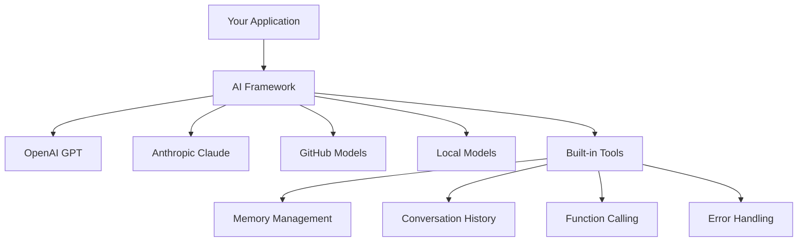
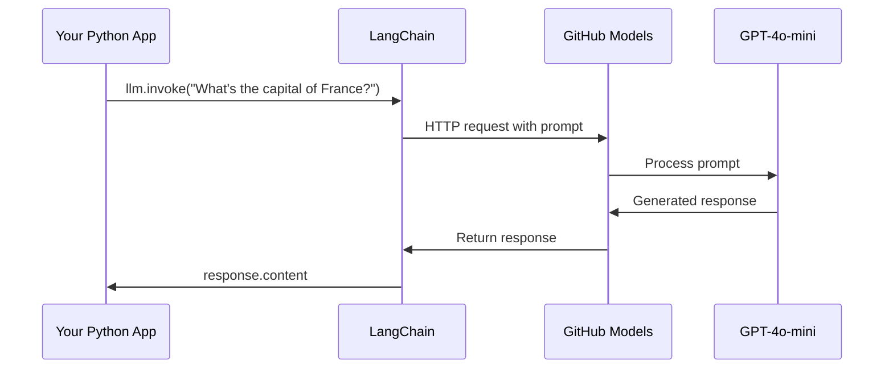
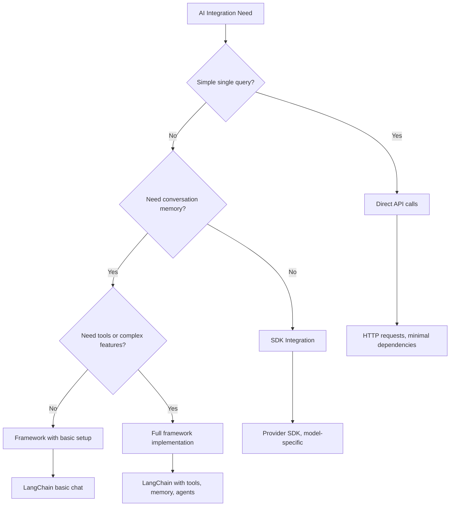

<!--
CO_OP_TRANSLATOR_METADATA:
{
  "original_hash": "e2c4ae5688e34b4b8b09d52aec56c79e",
  "translation_date": "2025-10-24T20:53:13+00:00",
  "source_file": "10-ai-framework-project/README.md",
  "language_code": "cs"
}
-->
# AI Framework

Cítili jste se někdy zahlceni při pokusu o vytvoření AI aplikací od nuly? Nejste sami! AI frameworky jsou jako švýcarský armádní nůž pro vývoj AI - jsou to mocné nástroje, které vám ušetří čas a starosti při budování inteligentních aplikací. Představte si AI framework jako dobře organizovanou knihovnu: poskytuje předem vytvořené komponenty, standardizované API a chytré abstrakce, takže se můžete soustředit na řešení problémů místo boje s detaily implementace.

V této lekci prozkoumáme, jak frameworky jako LangChain mohou proměnit dříve složité úkoly integrace AI na čistý, čitelný kód. Zjistíte, jak se vypořádat s reálnými výzvami, jako je sledování konverzací, implementace volání nástrojů a práce s různými AI modely prostřednictvím jednoho sjednoceného rozhraní.

Na konci této lekce budete vědět, kdy sáhnout po frameworku místo přímých API volání, jak efektivně využívat jejich abstrakce a jak vytvářet AI aplikace připravené pro reálné použití. Pojďme prozkoumat, co AI frameworky mohou udělat pro vaše projekty.

## Proč zvolit framework?

Takže jste připraveni vytvořit AI aplikaci - skvělé! Ale tady je věc: máte několik různých cest, kterými se můžete vydat, a každá má své vlastní výhody a nevýhody. Je to jako vybírat mezi chůzí, jízdou na kole nebo autem, abyste se někam dostali - všechny vás tam dostanou, ale zážitek (a úsilí) bude úplně jiný.

Pojďme si rozdělit tři hlavní způsoby, jak můžete integrovat AI do svých projektů:

| Přístup | Výhody | Nejlepší pro | Zvažte |
|---------|--------|-------------|--------|
| **Přímé HTTP požadavky** | Plná kontrola, žádné závislosti | Jednoduché dotazy, učení základů | Více kódu, manuální zpracování chyb |
| **Integrace SDK** | Méně boilerplate, optimalizace pro konkrétní modely | Aplikace s jedním modelem | Omezeno na konkrétní poskytovatele |
| **AI Frameworky** | Sjednocené API, vestavěné abstrakce | Aplikace s více modely, složité pracovní postupy | Křivka učení, potenciální nadměrná abstrakce |

### Výhody frameworků v praxi



**Proč jsou frameworky důležité:**
- **Sjednocují** více AI poskytovatelů pod jedno rozhraní
- **Automaticky spravují** paměť konverzací
- **Poskytují** hotové nástroje pro běžné úkoly, jako jsou embeddings a volání funkcí
- **Řeší** zpracování chyb a logiku opakování
- **Proměňují** složité pracovní postupy na čitelné volání metod

> 💡 **Tip**: Používejte frameworky při přepínání mezi různými AI modely nebo při budování složitých funkcí, jako jsou agenti, paměť nebo volání nástrojů. Držte se přímých API při učení základů nebo při vytváření jednoduchých, zaměřených aplikací.

**Shrnutí**: Jako volba mezi specializovanými nástroji řemeslníka a kompletní dílnou jde o to, přizpůsobit nástroj úkolu. Frameworky vynikají u složitých, funkcemi nabitých aplikací, zatímco přímé API dobře fungují pro jednoduché případy použití.

## Úvod

V této lekci se naučíme:

- Používat běžný AI framework.
- Řešit běžné problémy, jako jsou chatové konverzace, používání nástrojů, paměť a kontext.
- Využít tyto znalosti k vytvoření AI aplikací.

## Váš první AI prompt

Začněme základy vytvořením vaší první AI aplikace, která odešle otázku a vrátí odpověď. Jako Archimedes, který objevil princip vztlaku ve své vaně, někdy nejjednodušší pozorování vedou k nejmocnějším poznatkům - a frameworky tyto poznatky zpřístupňují.

### Nastavení LangChain s GitHub Models

Použijeme LangChain k připojení k GitHub Models, což je skvělé, protože vám poskytuje bezplatný přístup k různým AI modelům. Nejlepší na tom je, že k tomu potřebujete jen několik jednoduchých konfiguračních parametrů:

```python
from langchain_openai import ChatOpenAI
import os

llm = ChatOpenAI(
    api_key=os.environ["GITHUB_TOKEN"],
    base_url="https://models.github.ai/inference",
    model="openai/gpt-4o-mini",
)

# Send a simple prompt
response = llm.invoke("What's the capital of France?")
print(response.content)
```

**Co se zde děje:**
- **Vytváří** klienta LangChain pomocí třídy `ChatOpenAI` - to je vaše brána k AI!
- **Konfiguruje** připojení k GitHub Models pomocí vašeho autentizačního tokenu
- **Určuje**, který AI model použít (`gpt-4o-mini`) - představte si to jako výběr vašeho AI asistenta
- **Odesílá** vaši otázku pomocí metody `invoke()` - tady se děje kouzlo
- **Extrahuje** a zobrazuje odpověď - a voilà, komunikujete s AI!

> 🔧 **Poznámka k nastavení**: Pokud používáte GitHub Codespaces, máte štěstí - `GITHUB_TOKEN` je již nastaven! Pracujete lokálně? Žádný problém, stačí vytvořit osobní přístupový token s odpovídajícími oprávněními.

**Očekávaný výstup:**
```text
The capital of France is Paris.
```



## Vytváření konverzační AI

Tento první příklad ukazuje základy, ale je to jen jednorázová výměna - položíte otázku, dostanete odpověď a tím to končí. V reálných aplikacích chcete, aby si AI pamatovala, o čem jste mluvili, podobně jako Watson a Holmes budovali své vyšetřovací rozhovory v průběhu času.

Tady se LangChain stává obzvláště užitečným. Poskytuje různé typy zpráv, které pomáhají strukturovat konverzace a umožňují vám dát vaší AI osobnost. Budete vytvářet chatové zážitky, které udržují kontext a charakter.

### Porozumění typům zpráv

Představte si tyto typy zpráv jako různé "klobouky", které účastníci nosí v konverzaci. LangChain používá různé třídy zpráv, aby sledoval, kdo co říká:

| Typ zprávy | Účel | Příklad použití |
|------------|------|----------------|
| `SystemMessage` | Definuje osobnost a chování AI | "Jste užitečný asistent pro programování" |
| `HumanMessage` | Reprezentuje vstup uživatele | "Vysvětlete, jak fungují funkce" |
| `AIMessage` | Uchovává odpovědi AI | Předchozí odpovědi AI v konverzaci |

### Vytvoření první konverzace

Vytvořme konverzaci, kde naše AI převezme konkrétní roli. Necháme ji ztělesnit kapitána Picarda - postavu známou svou diplomatickou moudrostí a vůdčími schopnostmi:

```python
messages = [
    SystemMessage(content="You are Captain Picard of the Starship Enterprise"),
    HumanMessage(content="Tell me about you"),
]
```

**Rozbor nastavení této konverzace:**
- **Stanovuje** roli a osobnost AI prostřednictvím `SystemMessage`
- **Poskytuje** počáteční dotaz uživatele prostřednictvím `HumanMessage`
- **Vytváří** základ pro konverzaci s více tahy

Celý kód pro tento příklad vypadá takto:

```python
from langchain_core.messages import HumanMessage, SystemMessage
from langchain_openai import ChatOpenAI
import os

llm = ChatOpenAI(
    api_key=os.environ["GITHUB_TOKEN"],
    base_url="https://models.github.ai/inference",
    model="openai/gpt-4o-mini",
)

messages = [
    SystemMessage(content="You are Captain Picard of the Starship Enterprise"),
    HumanMessage(content="Tell me about you"),
]


# works
response  = llm.invoke(messages)
print(response.content)
```

Měli byste vidět výsledek podobný:

```text
I am Captain Jean-Luc Picard, the commanding officer of the USS Enterprise (NCC-1701-D), a starship in the United Federation of Planets. My primary mission is to explore new worlds, seek out new life and new civilizations, and boldly go where no one has gone before. 

I believe in the importance of diplomacy, reason, and the pursuit of knowledge. My crew is diverse and skilled, and we often face challenges that test our resolve, ethics, and ingenuity. Throughout my career, I have encountered numerous species, grappled with complex moral dilemmas, and have consistently sought peaceful solutions to conflicts.

I hold the ideals of the Federation close to my heart, believing in the importance of cooperation, understanding, and respect for all sentient beings. My experiences have shaped my leadership style, and I strive to be a thoughtful and just captain. How may I assist you further?
```

Pro udržení kontinuity konverzace (místo resetování kontextu při každém kroku) je potřeba neustále přidávat odpovědi do seznamu zpráv. Podobně jako ústní tradice, které uchovávaly příběhy po generace, tento přístup buduje trvalou paměť:

```python
from langchain_core.messages import HumanMessage, SystemMessage
from langchain_openai import ChatOpenAI
import os

llm = ChatOpenAI(
    api_key=os.environ["GITHUB_TOKEN"],
    base_url="https://models.github.ai/inference",
    model="openai/gpt-4o-mini",
)

messages = [
    SystemMessage(content="You are Captain Picard of the Starship Enterprise"),
    HumanMessage(content="Tell me about you"),
]


# works
response  = llm.invoke(messages)

print(response.content)

print("---- Next ----")

messages.append(response)
messages.append(HumanMessage(content="Now that I know about you, I'm Chris, can I be in your crew?"))

response  = llm.invoke(messages)

print(response.content)

```

Docela šikovné, že? Co se zde děje, je to, že voláme LLM dvakrát - nejprve pouze s našimi počátečními dvěma zprávami, ale poté znovu s celou historií konverzace. Je to, jako by AI skutečně sledovala náš chat!

Když spustíte tento kód, dostanete druhou odpověď, která bude znít nějak takto:

```text
Welcome aboard, Chris! It's always a pleasure to meet those who share a passion for exploration and discovery. While I cannot formally offer you a position on the Enterprise right now, I encourage you to pursue your aspirations. We are always in need of talented individuals with diverse skills and backgrounds. 

If you are interested in space exploration, consider education and training in the sciences, engineering, or diplomacy. The values of curiosity, resilience, and teamwork are crucial in Starfleet. Should you ever find yourself on a starship, remember to uphold the principles of the Federation: peace, understanding, and respect for all beings. Your journey can lead you to remarkable adventures, whether in the stars or on the ground. Engage!
```

To beru jako možná ;)

## Streamování odpovědí

Všimli jste si někdy, jak ChatGPT "píše" své odpovědi v reálném čase? To je streamování v akci. Jako sledování zkušeného kaligrafa při práci - vidět, jak se znaky objevují tah za tahem, místo aby se objevily okamžitě - streamování činí interakci přirozenější a poskytuje okamžitou zpětnou vazbu.

### Implementace streamování s LangChain

```python
from langchain_openai import ChatOpenAI
import os

llm = ChatOpenAI(
    api_key=os.environ["GITHUB_TOKEN"],
    base_url="https://models.github.ai/inference",
    model="openai/gpt-4o-mini",
    streaming=True
)

# Stream the response
for chunk in llm.stream("Write a short story about a robot learning to code"):
    print(chunk.content, end="", flush=True)
```

**Proč je streamování skvělé:**
- **Zobrazuje** obsah, jak je vytvářen - už žádné nepříjemné čekání!
- **Dává** uživatelům pocit, že se něco skutečně děje
- **Působí** rychleji, i když technicky není
- **Umožňuje** uživatelům začít číst, zatímco AI stále "přemýšlí"

> 💡 **Tip pro uživatelskou zkušenost**: Streamování opravdu vyniká, když pracujete s delšími odpověďmi, jako jsou vysvětlení kódu, kreativní psaní nebo podrobné návody. Vaši uživatelé budou milovat vidět pokrok místo zírání na prázdnou obrazovku!

## Šablony promptů

Šablony promptů fungují jako rétorické struktury používané v klasické řečnictví - představte si, jak by Cicero přizpůsobil své vzorce řeči různým posluchačům, přičemž zachoval stejný přesvědčivý rámec. Umožňují vám vytvářet znovu použitelné prompty, kde můžete vyměňovat různé informace, aniž byste museli vše přepisovat od začátku. Jakmile nastavíte šablonu, stačí jen vyplnit proměnné požadovanými hodnotami.

### Vytváření znovu použitelných promptů

```python
from langchain_core.prompts import ChatPromptTemplate

# Define a template for code explanations
template = ChatPromptTemplate.from_messages([
    ("system", "You are an expert programming instructor. Explain concepts clearly with examples."),
    ("human", "Explain {concept} in {language} with a practical example for {skill_level} developers")
])

# Use the template with different values
questions = [
    {"concept": "functions", "language": "JavaScript", "skill_level": "beginner"},
    {"concept": "classes", "language": "Python", "skill_level": "intermediate"},
    {"concept": "async/await", "language": "JavaScript", "skill_level": "advanced"}
]

for question in questions:
    prompt = template.format_messages(**question)
    response = llm.invoke(prompt)
    print(f"Topic: {question['concept']}\n{response.content}\n---\n")
```

**Proč si zamilujete používání šablon:**
- **Udržují** vaše prompty konzistentní v celé aplikaci
- **Žádné další** chaotické spojování řetězců - jen čisté, jednoduché proměnné
- **Vaše AI** se chová předvídatelně, protože struktura zůstává stejná
- **Aktualizace** jsou hračka - změňte šablonu jednou a je to opraveno všude

## Strukturovaný výstup

Už vás někdy frustrovalo, když jste se snažili zpracovat odpovědi AI, které se vracely jako nestrukturovaný text? Strukturovaný výstup je jako naučit vaši AI sledovat systematický přístup, který Linnaeus použil pro biologickou klasifikaci - organizovaný, předvídatelný a snadno použitelný. Můžete požadovat JSON, specifické datové struktury nebo jakýkoli formát, který potřebujete.

### Definování schémat výstupu

```python
from langchain_core.prompts import ChatPromptTemplate
from langchain_core.output_parsers import JsonOutputParser
from pydantic import BaseModel, Field

class CodeReview(BaseModel):
    score: int = Field(description="Code quality score from 1-10")
    strengths: list[str] = Field(description="List of code strengths")
    improvements: list[str] = Field(description="List of suggested improvements")
    overall_feedback: str = Field(description="Summary feedback")

# Set up the parser
parser = JsonOutputParser(pydantic_object=CodeReview)

# Create prompt with format instructions
prompt = ChatPromptTemplate.from_messages([
    ("system", "You are a code reviewer. {format_instructions}"),
    ("human", "Review this code: {code}")
])

# Format the prompt with instructions
chain = prompt | llm | parser

# Get structured response
code_sample = """
def calculate_average(numbers):
    return sum(numbers) / len(numbers)
"""

result = chain.invoke({
    "code": code_sample,
    "format_instructions": parser.get_format_instructions()
})

print(f"Score: {result['score']}")
print(f"Strengths: {', '.join(result['strengths'])}")
```

**Proč je strukturovaný výstup revoluční:**
- **Už žádné** hádání, jaký formát dostanete zpět - je to pokaždé konzistentní
- **Přímo se integruje** do vašich databází a API bez další práce
- **Zachytí** divné odpovědi AI dříve, než rozbijí vaši aplikaci
- **Zjednodušuje** váš kód, protože přesně víte, s čím pracujete

## Volání nástrojů

Nyní se dostáváme k jedné z nejmocnějších funkcí: nástroje. Tímto způsobem dáváte své AI praktické schopnosti nad rámec konverzace. Podobně jako středověké cechy vyvíjely specializované nástroje pro konkrétní řemesla, můžete vybavit svou AI zaměřenými nástroji. Popíšete, jaké nástroje jsou k dispozici, a když někdo požádá o něco, co odpovídá, vaše AI může jednat.

### Použití Pythonu

Přidejme nějaké nástroje takto:

```python
from typing_extensions import Annotated, TypedDict

class add(TypedDict):
    """Add two integers."""

    # Annotations must have the type and can optionally include a default value and description (in that order).
    a: Annotated[int, ..., "First integer"]
    b: Annotated[int, ..., "Second integer"]

tools = [add]

functions = {
    "add": lambda a, b: a + b
}
```

Co se zde děje? Vytváříme plán pro nástroj nazvaný `add`. Děděním z `TypedDict` a použitím těchto elegantních typů `Annotated` pro `a` a `b` dáváme LLM jasný obraz o tom, co tento nástroj dělá a co potřebuje. Slovník `functions` je jako naše sada nástrojů - říká našemu kódu přesně, co dělat, když AI rozhodne použít konkrétní nástroj.

Podívejme se, jak dále voláme LLM s tímto nástrojem:

```python
llm = ChatOpenAI(
    api_key=os.environ["GITHUB_TOKEN"],
    base_url="https://models.github.ai/inference",
    model="openai/gpt-4o-mini",
)

llm_with_tools = llm.bind_tools(tools)
```

Zde voláme `bind_tools` s naším polem `tools`, a tím pádem má LLM `llm_with_tools` znalost tohoto nástroje.

Pro použití tohoto nového LLM můžeme napsat následující kód:

```python
query = "What is 3 + 12?"

res = llm_with_tools.invoke(query)
if(res.tool_calls):
    for tool in res.tool_calls:
        print("TOOL CALL: ", functions[tool["name"]](../../../10-ai-framework-project/**tool["args"]))
print("CONTENT: ",res.content)
```

Nyní, když voláme `invoke` na tomto novém LLM, které má nástroje, může být vlastnost `tool_calls` naplněna. Pokud ano, jakýkoli identifikovaný nástroj má vlastnosti `name` a `args`, které identifikují, jaký nástroj by měl být použit a s jakými argumenty. Celý kód vypadá takto:

```python
from langchain_core.messages import HumanMessage, SystemMessage
from langchain_openai import ChatOpenAI
import os
from typing_extensions import Annotated, TypedDict

class add(TypedDict):
    """Add two integers."""

    # Annotations must have the type and can optionally include a default value and description (in that order).
    a: Annotated[int, ..., "First integer"]
    b: Annotated[int, ..., "Second integer"]

tools = [add]

functions = {
    "add": lambda a, b: a + b
}

llm = ChatOpenAI(
    api_key=os.environ["GITHUB_TOKEN"],
    base_url="https://models.github.ai/inference",
    model="openai/gpt-4o-mini",
)

llm_with_tools = llm.bind_tools(tools)

query = "What is 3 + 12?"

res = llm_with_tools.invoke(query)
if(res.tool_calls):
    for tool in res.tool_calls:
        print("TOOL CALL: ", functions[tool["name"]](../../../10-ai-framework-project/**tool["args"]))
print("CONTENT: ",res.content)
```

Při spuštění tohoto kódu byste měli vidět výstup podobný:

```text
TOOL CALL:  15
CONTENT: 
```

AI analyzovala "Co je 3 + 12" a rozpoznala to jako úkol pro nástroj `add`. Podobně jako zkušený knihovník ví, na jaký odkaz se obrátit na základě typu položené otázky, učinila toto rozhodnutí na základě názvu nástroje, popisu a specifikací polí. Výsledek 15 pochází z našeho slovníku `functions`, který provedl nástroj:

```python
print("TOOL CALL: ", functions[tool["name"]](../../../10-ai-framework-project/**tool["args"]))
```

### Zajímavější nástroj, který volá webové API

Sčítání čísel demonstruje koncept, ale skutečné nástroje obvykle provádějí složitější operace, jako je volání webových API. Rozšíříme náš příklad, aby AI mohla získávat obsah z internetu - podobně jako telegrafní operátoři kdysi spojovali vzdálené lokality:

```python
class joke(TypedDict):
    """Tell a joke."""

    # Annotations must have the type and can optionally include a default value and description (in that order).
    category: Annotated[str, ..., "The joke category"]

def get_joke(category: str) -> str:
    response = requests.get(f"https://api.chucknorris.io/jokes/random?category={category}", headers={"Accept": "application/json"})
    if response.status_code == 200:
        return response.json().get("value", f"Here's a {category} joke!")
    return f"Here's a {category} joke!"

functions = {
    "add": lambda a, b: a + b,
    "joke": lambda category: get_joke(category)
}

query = "Tell me a joke about animals"

# the rest of the code is the same
```

Nyní, pokud spustíte tento kód, dostanete odpověď, která bude znít nějak takto:

```text
TOOL CALL:  Chuck Norris once rode a nine foot grizzly bear through an automatic car wash, instead of taking a shower.
CONTENT:  
```

Zde je celý kód:

```python
from langchain_openai import ChatOpenAI
import requests
import os
from typing_extensions import Annotated, TypedDict

class add(TypedDict):
    """Add two integers."""

    # Annotations must have the type and can optionally include a default value and description (in that order).
    a: Annotated[int, ..., "First integer"]
    b: Annotated[int, ..., "Second integer"]

class joke(TypedDict):
    """Tell a joke."""

    # Annotations must have the type and can optionally include a default value and description (in that order).
    category: Annotated[str, ..., "The joke category"]

tools = [add, joke]

def get_joke(category: str) -> str:
    response = requests.get(f"https://api.chucknorris.io/jokes/random?category={category}", headers={"Accept": "application/json"})
    if response.status_code == 200:
        return response.json().get("value", f"Here's a {category} joke!")
    return f"Here's a {category} joke!"

functions = {
    "add": lambda a, b: a + b,
    "joke": lambda category: get_joke(category)
}

llm = ChatOpenAI(
    api_key=os.environ["GITHUB_TOKEN"],
    base_url="https://models.github.ai/inference",
    model="openai/gpt-4o-mini",
)

llm_with_tools = llm.bind_tools(tools)

query = "Tell me a joke about animals"

res = llm_with_tools.invoke(query)
if(res.tool_calls):
    for tool in res.tool_calls:
        # print("TOOL CALL: ", tool)
        print("TOOL CALL: ", functions[tool["name"]](../../../10-ai-framework-project/**tool["args"]))
print("CONTENT: ",res.content)
```

## Embeddings a zpracování dokumentů

Embeddings představují jedno z nejelegantnějších řešení moderní AI. Představte si, že byste mohli vzít jakýkoli text a převést ho na číselné souřadnice, které zachycují jeho význam. Přesně to embeddings dělají - transformují text na body v vícerozměrném prostoru, kde se podobné koncepty shlukují. Je to jako mít souřadnicový systém pro myšlenky, připomínající, jak Mendelejev organizoval periodickou tabulku podle atomových vlastností.

### Vytváření a používání embeddings

```python
from langchain_openai import OpenAIEmbeddings
from langchain_community.vectorstores import FAISS
from langchain_community.document_loaders import TextLoader
from langchain.text_splitter import CharacterTextSplitter

# Initialize embeddings
embeddings = OpenAIEmbeddings(
    api_key=os.environ["GITHUB_TOKEN"],
    base_url="https://models.github.ai/inference",
    model="text-embedding-3-small"
)

# Load and split documents
loader = TextLoader("documentation.txt")
documents = loader.load()

text_splitter = CharacterTextSplitter(chunk_size=1000, chunk_overlap=0)
texts = text_splitter.split_documents(documents)

# Create vector store
vectorstore = FAISS.from_documents(texts, embeddings)

# Perform similarity search
query = "How do I handle user authentication?"
similar_docs = vectorstore.similarity_search(query, k=3)

for doc in similar_docs:
    print(f"Relevant content: {doc.page_content[:200]}...")
```

### Načítání dokumentů v různých formátech

```python
from langchain_community.document_loaders import (
    PyPDFLoader,
    CSVLoader,
    JSONLoader,
    WebBaseLoader
)

# Load different document types
pdf_loader = PyPDFLoader("manual.pdf")
csv_loader = CSVLoader("data.csv")
json_loader = JSONLoader("config.json")
web_loader = WebBaseLoader("https://example.com/docs")

# Process all documents
all_documents = []
for loader in [pdf_loader, csv_loader, json_loader, web_loader]:
    docs = loader.load()
    all_documents.extend(docs)
```

**Co můžete dělat s embeddings:**
- **Vytvářet** vyhledávání, které skutečně rozumí tomu, co myslíte, nejen shodě klíčových slov
- **Vytvářet** AI, která dokáže odpovídat na otázky o vašich dokumentech
- **Vytvářet** doporučovací systémy, které navrhují skutečně relevantní obsah
- **Automaticky** organizovat a kategorizovat váš obsah

## Vytvoření kompletní AI aplikace

Nyní integrujeme vše, co jste se naučili, do komplexní aplikace - asistenta pro programování, který dokáže odpovídat na otázky, používat nástroje a udržovat paměť konverzace. Podobně jako tiskový lis kombinoval existující technologie (pohyblivý typ, inkoust, papír a tlak) do něčeho transforma
3. **Personalizované učení**: Používejte systémové zprávy k přizpůsobení odpovědí různým úrovním dovedností  
4. **Formátování odpovědí**: Implementujte strukturovaný výstup pro otázky kvízu  

### Kroky implementace  

**Krok 1: Nastavení prostředí**  
```bash
pip install langchain langchain-openai
```
  
**Krok 2: Základní funkce chatu**  
- Vytvořte třídu `StudyAssistant`  
- Implementujte paměť konverzace  
- Přidejte konfiguraci osobnosti pro vzdělávací podporu  

**Krok 3: Přidání vzdělávacích nástrojů**  
- **Vysvětlovač kódu**: Rozkládá kód na srozumitelné části  
- **Generátor kvízů**: Vytváří otázky o programovacích konceptech  
- **Sledování pokroku**: Sleduje pokryté témata  

**Krok 4: Rozšířené funkce (volitelné)**  
- Implementujte streamování odpovědí pro lepší uživatelský zážitek  
- Přidejte načítání dokumentů pro začlenění studijních materiálů  
- Vytvořte embeddings pro vyhledávání obsahu na základě podobnosti  

### Kritéria hodnocení  

| Funkce | Výborné (4) | Dobré (3) | Uspokojivé (2) | Potřebuje zlepšení (1) |  
|--------|-------------|-----------|----------------|-------------------------|  
| **Tok konverzace** | Přirozené, kontextově uvědomělé odpovědi | Dobré udržení kontextu | Základní konverzace | Žádná paměť mezi výměnami |  
| **Integrace nástrojů** | Více užitečných nástrojů funguje bez problémů | 2+ nástroje správně implementovány | 1-2 základní nástroje | Nástroje nefunkční |  
| **Kvalita kódu** | Čistý, dobře dokumentovaný, ošetření chyb | Dobrá struktura, nějaká dokumentace | Základní funkčnost | Špatná struktura, žádné ošetření chyb |  
| **Vzdělávací hodnota** | Skutečně užitečné pro učení, adaptivní | Dobrá podpora učení | Základní vysvětlení | Omezený vzdělávací přínos |  

### Ukázková struktura kódu  

```python
class StudyAssistant:
    def __init__(self, skill_level="beginner"):
        # Initialize LLM, tools, and conversation memory
        pass
    
    def explain_code(self, code, language):
        # Tool: Explain how code works
        pass
    
    def generate_quiz(self, topic, difficulty):
        # Tool: Create practice questions
        pass
    
    def chat(self, user_input):
        # Main conversation interface
        pass

# Example usage
assistant = StudyAssistant(skill_level="intermediate")
response = assistant.chat("Explain how Python functions work")
```
  
**Bonusové výzvy:**  
- Přidejte schopnosti hlasového vstupu/výstupu  
- Implementujte webové rozhraní pomocí Streamlit nebo Flask  
- Vytvořte znalostní bázi ze studijních materiálů pomocí embeddings  
- Přidejte sledování pokroku a personalizované vzdělávací cesty  

## Shrnutí  

🎉 Nyní jste zvládli základy vývoje AI frameworků a naučili se, jak vytvořit sofistikované AI aplikace pomocí LangChain. Jako byste dokončili komplexní učňovský program, získali jste rozsáhlou sadu dovedností. Pojďme si shrnout, čeho jste dosáhli.  

### Co jste se naučili  

**Základní koncepty frameworku:**  
- **Výhody frameworku**: Porozumění tomu, kdy zvolit frameworky místo přímých API volání  
- **Základy LangChain**: Nastavení a konfigurace připojení AI modelů  
- **Typy zpráv**: Používání `SystemMessage`, `HumanMessage` a `AIMessage` pro strukturované konverzace  

**Pokročilé funkce:**  
- **Volání nástrojů**: Vytváření a integrace vlastních nástrojů pro rozšířené schopnosti AI  
- **Paměť konverzace**: Udržování kontextu napříč více výměnami v konverzaci  
- **Streamování odpovědí**: Implementace doručování odpovědí v reálném čase  
- **Šablony promptů**: Vytváření opakovaně použitelných, dynamických promptů  
- **Strukturovaný výstup**: Zajištění konzistentních, parsovatelných odpovědí AI  
- **Embeddings**: Vytváření semantického vyhledávání a zpracování dokumentů  

**Praktické aplikace:**  
- **Vytváření kompletních aplikací**: Kombinace více funkcí do aplikací připravených pro produkci  
- **Ošetření chyb**: Implementace robustního řízení chyb a validace  
- **Integrace nástrojů**: Vytváření vlastních nástrojů, které rozšiřují schopnosti AI  

### Klíčové poznatky  

> 🎯 **Pamatujte**: AI frameworky jako LangChain jsou v podstatě vaši přátelé, kteří skrývají složitost a nabízejí spoustu funkcí. Jsou ideální, když potřebujete paměť konverzace, volání nástrojů nebo chcete pracovat s více AI modely bez ztráty rozumu.  

**Rozhodovací framework pro integraci AI:**  


  
### Kam dál?  

**Začněte stavět hned teď:**  
- Vezměte tyto koncepty a vytvořte něco, co vás nadchne!  
- Experimentujte s různými AI modely prostřednictvím LangChain - je to jako hřiště plné AI modelů  
- Vytvářejte nástroje, které řeší skutečné problémy, se kterými se setkáváte ve své práci nebo projektech  

**Připraveni na další úroveň?**  
- **AI agenti**: Vytvářejte AI systémy, které dokážou plánovat a provádět složité úkoly samostatně  
- **RAG (Retrieval-Augmented Generation)**: Kombinujte AI s vlastními znalostními bázemi pro aplikace s rozšířenými schopnostmi  
- **Multimodální AI**: Pracujte s textem, obrázky a zvukem dohromady - možnosti jsou nekonečné!  
- **Nasazení do produkce**: Naučte se, jak škálovat své AI aplikace a monitorovat je v reálném světě  

**Připojte se ke komunitě:**  
- Komunita LangChain je skvělá pro udržení aktuálnosti a učení se nejlepším postupům  
- GitHub Models vám poskytuje přístup k nejmodernějším AI schopnostem - ideální pro experimentování  
- Pokračujte v praxi s různými případy použití - každý projekt vás naučí něco nového  

Nyní máte znalosti k vytvoření inteligentních, konverzačních aplikací, které mohou lidem pomoci řešit skutečné problémy. Jako renesanční řemeslníci, kteří spojovali uměleckou vizi s technickými dovednostmi, můžete nyní spojit schopnosti AI s praktickým využitím. Otázka zní: co vytvoříte? 🚀  

## Výzva GitHub Copilot Agent 🚀  

Použijte režim Agent k dokončení následující výzvy:  

**Popis:** Vytvořte pokročilého AI asistenta pro kontrolu kódu, který kombinuje více funkcí LangChain, včetně volání nástrojů, strukturovaného výstupu a paměti konverzace, aby poskytoval komplexní zpětnou vazbu na odevzdaný kód.  

**Prompt:** Vytvořte třídu CodeReviewAssistant, která implementuje:  
1. Nástroj pro analýzu složitosti kódu a navrhování zlepšení  
2. Nástroj pro kontrolu kódu podle nejlepších postupů  
3. Strukturovaný výstup pomocí Pydantic modelů pro konzistentní formát recenze  
4. Paměť konverzace pro sledování průběhu recenzí  
5. Hlavní rozhraní chatu, které dokáže zpracovat odevzdaný kód a poskytovat podrobné, akční zpětné vazby  

Asistent by měl být schopen kontrolovat kód v několika programovacích jazycích, udržovat kontext napříč více odevzdanými kódy v jedné relaci a poskytovat jak souhrnné hodnocení, tak podrobné návrhy na zlepšení.  

Více o [režimu agent](https://code.visualstudio.com/blogs/2025/02/24/introducing-copilot-agent-mode) se dozvíte zde.  

---

**Prohlášení**:  
Tento dokument byl přeložen pomocí služby AI pro překlady [Co-op Translator](https://github.com/Azure/co-op-translator). Ačkoli se snažíme o přesnost, mějte prosím na paměti, že automatizované překlady mohou obsahovat chyby nebo nepřesnosti. Původní dokument v jeho rodném jazyce by měl být považován za autoritativní zdroj. Pro důležité informace se doporučuje profesionální lidský překlad. Neodpovídáme za žádná nedorozumění nebo nesprávné interpretace vyplývající z použití tohoto překladu.