<!--
CO_OP_TRANSLATOR_METADATA:
{
  "original_hash": "672b0bb6e8b431075f3bdb7130590d2d",
  "translation_date": "2026-01-07T03:30:34+00:00",
  "source_file": "2-js-basics/1-data-types/README.md",
  "language_code": "cs"
}
-->
# Základy JavaScriptu: Datové typy


> Sketchnote od [Tomomi Imura](https://twitter.com/girlie_mac)

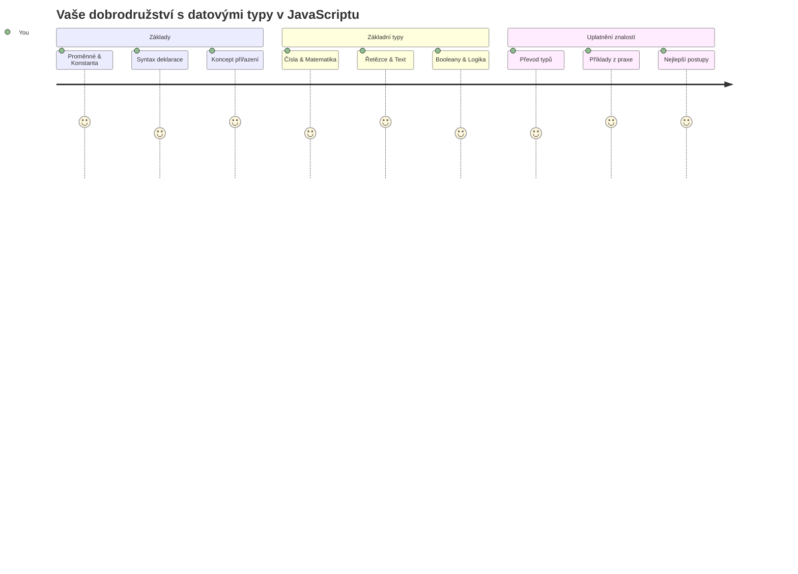
Datové typy jsou jedním ze základních konceptů v JavaScriptu, se kterými se setkáte v každém programu, který napíšete. Představte si datové typy jako systém třídění používaný starověkými knihovníky v Alexandrii – měli specifická místa pro svitky s poezií, matematikou a historickými záznamy. JavaScript organizuje informace podobným způsobem do různých kategorií pro různé druhy dat.

V této lekci prozkoumáme základní datové typy, které umožňují fungování JavaScriptu. Naučíte se, jak pracovat s čísly, textem, hodnotami pravda/nepravda a pochopíte, proč je výběr správného typu zásadní pro vaše programy. Tyto koncepty mohou zpočátku působit abstraktně, ale s praxí se stanou druhou přirozeností.

Porozumění datovým typům zpřehlední vše ostatní v JavaScriptu. Stejně jako architekti potřebují znát různé stavební materiály před postavením katedrály, tyto základy budou podporou všeho, co budete dále tvořit.

## Přednáškový kvíz
[Přednáškový kvíz](https://ff-quizzes.netlify.app/web/)

Tato lekce pokrývá základy JavaScriptu, jazyka, který umožňuje interaktivitu na webu.

> Tuto lekci můžete absolvovat na [Microsoft Learn](https://docs.microsoft.com/learn/modules/web-development-101-variables/?WT.mc_id=academic-77807-sagibbon)!

[](https://youtube.com/watch?v=JNIXfGiDWM8 "Variables in JavaScript")

[](https://youtube.com/watch?v=AWfA95eLdq8 "Data Types in JavaScript")

> 🎥 Klikněte na obrázky výše pro videa o proměnných a datových typech

Začněme s proměnnými a datovými typy, které je vyplňují!

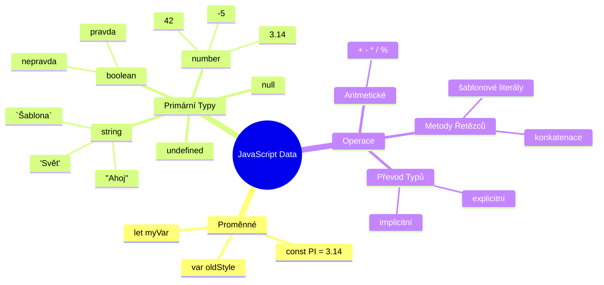
## Proměnné

Proměnné jsou základní stavební kameny programování. Jako označené nádoby, které používali středověcí alchymisté ke skladování různých látek, proměnné vám umožňují uchovávat informace a přiřadit jim popisný název, abyste na ně mohli později odkazovat. Potřebujete si zapamatovat něčí věk? Uložte jej do proměnné s názvem `age`. Chcete sledovat uživatelské jméno? Uchovávejte jej v proměnné s názvem `userName`.

Zaměříme se na moderní přístup k vytváření proměnných v JavaScriptu. Techniky, které se zde naučíte, představují léta vývoje jazyka a osvědčené postupy vyvinuté programátorskou komunitou.

Vytvoření a **deklarace** proměnné má následující syntax: **[keyword] [name]**. Skládá se ze dvou částí:

- **Klíčové slovo**. Použijte `let` pro proměnné, které se mohou měnit, nebo `const` pro hodnoty, které zůstávají stejné.
- **Název proměnné**, tedy popisný název, který si sami zvolíte.

✅ Klíčové slovo `let` bylo představeno v ES6 a poskytuje vaší proměnné tzv. _blokový rozsah_. Doporučuje se používat `let` nebo `const` místo staršího klíčového slova `var`. O blokových rozsazích budeme mluvit podrobněji v budoucích částech.

### Úkol - práce s proměnnými

1. **Deklarujte proměnnou**. Začněme vytvořením naší první proměnné:

    ```javascript
    let myVariable;
    ```

   **Co se tím dosahuje:**
   - Říkáme JavaScriptu, aby vytvořil úložné místo s názvem `myVariable`
   - JavaScript vyhradí v paměti prostor pro tuto proměnnou
   - Proměnná momentálně nemá žádnou hodnotu (undefined)

2. **Přiřaďte hodnotu**. Nyní vložme něco do naší proměnné:

    ```javascript
    myVariable = 123;
    ```

   **Jak funguje přiřazení:**
   - Operátor `=` přiřadí hodnotu 123 naší proměnné
   - Proměnná nyní obsahuje tuto hodnotu místo undefined
   - Na tuto hodnotu můžete ve svém kódu odkazovat pomocí `myVariable`

   > Poznámka: použití `=` v této lekci znamená, že používáme "přiřazovací operátor", který slouží k nastavení hodnoty proměnné. Nevyjadřuje rovnítko v matematickém smyslu.

3. **Udělejte to chytře**. Spojme tyto dva kroky dohromady:

    ```javascript
    let myVariable = 123;
    ```

    **Toto řešení je efektivnější:**
    - Prohlašujete proměnnou a zároveň ji přiřazujete hodnotu v jednom příkazu
    - Je to standardní postup mezi vývojáři
    - Zkracuje kód, přičemž zůstává jasný

4. **Změňte názor**. Co když chceme uložit jiné číslo?

   ```javascript
   myVariable = 321;
   ```

   **Pochopení přepisování:**
   - Proměnná nyní obsahuje 321 místo 123
   - Původní hodnota je nahrazena – proměnné uchovávají vždy jen jednu hodnotu
   - Tato proměnlivost je klíčovou charakteristikou proměnných deklarovaných pomocí `let`

   ✅ Vyzkoušejte si to! Můžete psát JavaScript přímo ve svém prohlížeči. Otevřete okno prohlížeče a přejděte do Nástrojů pro vývojáře. V konzoli najdete výzvu; napište `let myVariable = 123`, stiskněte Enter, pak napište `myVariable`. Co se stalo? O těchto konceptech se dozvíte více v dalších lekcích.

### 🧠 **Kontrola ovládání proměnných: Cítíte se pohodlně?**

**Podívejme se, jak rozumíte proměnným:**
- Dokážete vysvětlit rozdíl mezi deklarací a přiřazením proměnné?
- Co se stane, když použijete proměnnou dříve, než ji deklarujete?
- Kdy byste zvolili `let` místo `const` pro proměnnou?

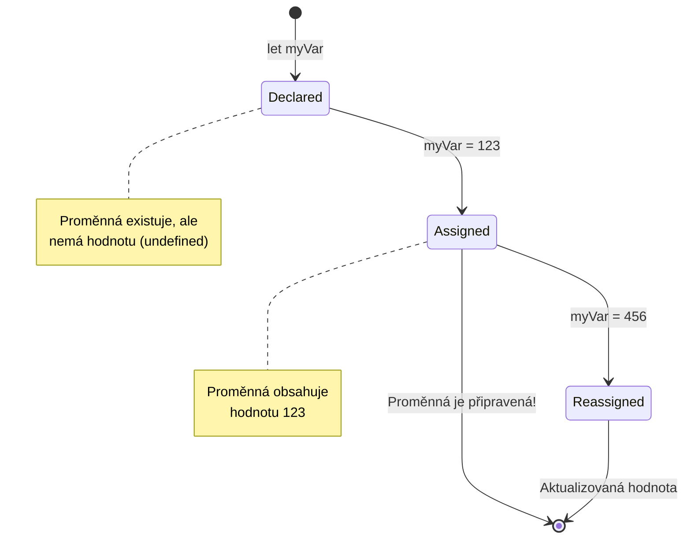
> **Rychlý tip**: Myslete na proměnné jako na označené úložné krabice. Vytvoříte krabici (`let`), vložíte do ní něco (`=`) a později můžete obsah vyměnit, pokud je to potřeba!

## Konstanty

Někdy je potřeba ukládat informace, které by se během běhu programu neměly měnit. Přemýšlejte o konstantách jako o matematických principech, které Euclid stanovil ve starověkém Řecku – jakmile byly dokázány a zapsány, zůstaly neměnné pro veškeré budoucí použití.

Konstanty fungují podobně jako proměnné, ale s důležitým omezením: jakmile jim přiřadíte hodnotu, ta se už nemůže změnit. Tato neměnnost pomáhá zabránit náhodným změnám kritických hodnot ve vašem programu.

Deklarace a inicializace konstanty následuje stejné principy jako u proměnné, s výjimkou klíčového slova `const`. Konstanty se obvykle deklarují velkými písmeny.

```javascript
const MY_VARIABLE = 123;
```

**Co tento kód dělá:**
- **Vytvoří** konstantu s názvem `MY_VARIABLE` s hodnotou 123
- **Používá** velká písmena pro pojmenování konstant
- **Zabraňuje** jakýmkoli budoucím změnám této hodnoty

Konstanty mají dvě hlavní pravidla:

- **Musíte jim hned přiřadit hodnotu** – prázdné konstanty nejsou povolené!
- **Hodnotu nikdy nemůžete změnit** – JavaScript vyhodí chybu, pokud to zkusíte. Podívejme se na příklad:

   **Jednoduchá hodnota** - Následující není povoleno:
   
      ```javascript
      const PI = 3;
      PI = 4; // není povoleno
      ```

   **Co si zapamatovat:**
   - **Pokusy** o přepsání konstanty vyvolají chybu
   - **Chrání** důležité hodnoty před náhodnými změnami
   - **Zajišťuje**, že hodnota zůstane konzistentní v průběhu celého programu
 
   **Reference na objekt je chráněna** - Následující není povoleno:
   
      ```javascript
      const obj = { a: 3 };
      obj = { b: 5 } // není povoleno
      ```

   **Porozumění těmto konceptům:**
   - **Zabraňuje** nahrazení celého objektu novým objektem
   - **Chrání** referenci na původní objekt
   - **Udržuje** identitu objektu v paměti

    **Hodnota objektu není chráněna** - Následující je povoleno:
    
      ```javascript
      const obj = { a: 3 };
      obj.a = 5;  // povoleno
      ```

      **Co se zde děje:**
      - **Mění** hodnotu vlastnosti uvnitř objektu
      - **Udržuje** stejnou referenci na objekt
      - **Ukazuje**, že obsah objektu se může změnit, zatímco reference zůstává konstantní

   > Poznámka: `const` znamená, že reference je chráněna před přepsáním. Hodnota ale není _neměnná_ a může se změnit, zejména pokud jde o složitější konstrukty jako objekty.

## Datové typy

JavaScript organizuje informace do různých kategorií nazývaných datové typy. Tento koncept připomíná, jak starověcí učenci kategorizovali znalosti – Aristotelés rozlišoval různé typy uvažování, protože věděl, že logické principy nelze jednotně použít na poezii, matematiku a přírodní filosofii.

Datové typy jsou důležité, protože různé operace pracují s různými druhy informací. Stejně jako nemůžete provádět aritmetiku s názvem osoby nebo seřadit matematickou rovnici podle abecedy, JavaScript vyžaduje pro každou operaci odpovídající datový typ. Porozumění tomu zabraňuje chybám a činí váš kód spolehlivějším.

Proměnné mohou ukládat různé typy hodnot, jako jsou čísla a text. Tyto různé druhy hodnot jsou známy jako **datový typ**. Datové typy jsou důležitou součástí vývoje softwaru, protože pomáhají vývojářům rozhodovat, jak by měl být kód napsán a jak by měl software běžet. Navíc některé datové typy mají jedinečné vlastnosti, které pomáhají transformovat nebo získat další informace z hodnoty.

✅ Datové typy jsou také označovány jako primitivní datové typy JavaScriptu, protože jsou nejzákladnějšími typy dat poskytovanými jazykem. Existuje 7 primitivních datových typů: string, number, bigint, boolean, undefined, null a symbol. Věnujte chvíli vizualizaci, co by každý z těchto primitiv mohl představovat. Co je to `zebra`? Co třeba `0`? `true`?

### Čísla

Čísla jsou nejpřímějším datovým typem v JavaScriptu. Ať už pracujete s celými čísly jako 42, desetinnými jako 3.14 nebo zápornými čísly jako -5, JavaScript s nimi zachází jednotně.

Vzpomněli jste si na naši předchozí proměnnou? Ta hodnota 123, kterou jsme uložili, byla ve skutečnosti datového typu číslo:

```javascript
let myVariable = 123;
```

**Klíčové vlastnosti:**
- JavaScript automaticky rozpoznává číselné hodnoty
- S těmito proměnnými můžete provádět matematické operace
- Není potřeba explicitní deklarace typu

Proměnné mohou uchovávat všechny typy čísel, včetně desetinných nebo záporných. Čísla lze také používat s aritmetickými operátory, které jsou probrány v [následující části](../../../../2-js-basics/1-data-types).

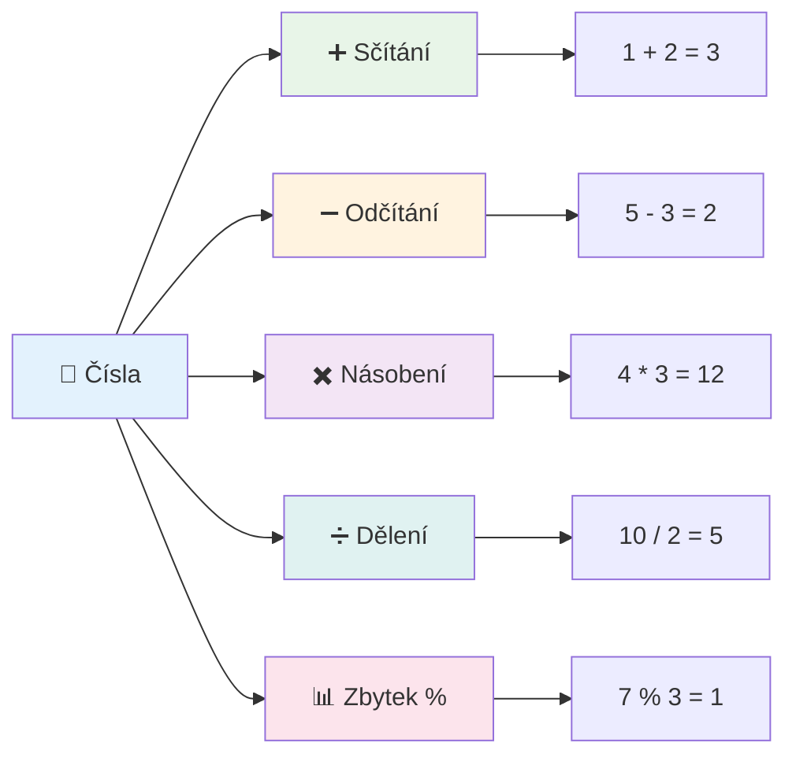
### Aritmetické operátory

Aritmetické operátory vám umožňují provádět matematické výpočty v JavaScriptu. Tyto operátory se řídí stejnými principy, jaké používali matematici po staletí – stejné symboly, které se objevily v pracích učenců jako Al-Chvárizmí, který vyvinul algebraickou notaci.

Operátory fungují, jak byste očekávali z tradiční matematiky: plus pro sčítání, minus pro odčítání a tak dále.

Existuje několik typů operátorů, které můžete použít při aritmetických funkcích, některé jsou uvedeny zde:

| Symbol | Popis                                                                 | Příklad                         |
| ------ | -------------------------------------------------------------------- | ------------------------------ |
| `+`    | **Sčítání**: Vypočítá součet dvou čísel                             | `1 + 2 //očekávaná odpověď je 3`  |
| `-`    | **Odčítání**: Vypočítá rozdíl dvou čísel                           | `1 - 2 //očekávaná odpověď je -1` |
| `*`    | **Násobení**: Vypočítá součin dvou čísel                            | `1 * 2 //očekávaná odpověď je 2`  |
| `/`    | **Dělení**: Vypočítá podíl dvou čísel                              | `1 / 2 //očekávaná odpověď je 0.5`|
| `%`    | **Zbytek po dělení**: Vypočítá zbytek po dělení dvou čísel        | `1 % 2 //očekávaná odpověď je 1`  |

✅ Vyzkoušejte si to! Vyzkoušejte aritmetickou operaci v konzoli vašeho prohlížeče. Překvapily vás výsledky?

### 🧮 **Kontrola matematických dovedností: Vypočítáváme s jistotou**

**Otestujte své matematické znalosti:**
- Jaký je rozdíl mezi `/` (dělení) a `%` (zbytek)?
- Dokážete odhadnout, co je `10 % 3`? (Nápověda: není to 3.33...)
- Proč by mohl být operátor zbytku užitečný v programování?

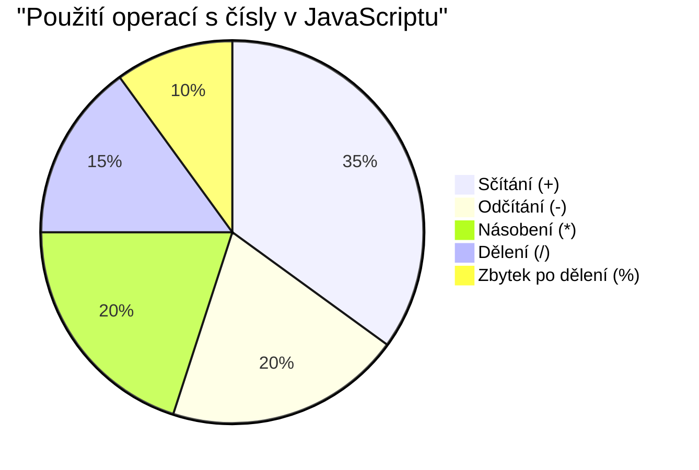
> **Pohled z praxe**: Operátor zbytku (%) je skvělý na kontrolu, zda jsou čísla sudá/lichá, tvorbu vzorů nebo cyklování přes pole!

### Řetězce (Strings)

V JavaScriptu jsou textová data reprezentována jako řetězce. Termín „string“ pochází z konceptu znaků navázaných za sebe do sekvence, stejně jako písaři v středověkých klášterech spojovali písmena do slov a vět ve svých rukopisech.

Řetězce jsou základní pro webový vývoj. Každý text, který se zobrazí na webu – uživatelská jména, popisky tlačítek, chybové zprávy, obsah – je zpracováván jako řetězec. Porozumění řetězcům je nezbytné pro tvorbu funkčních uživatelských rozhraní.

Řetězce jsou sady znaků, které jsou uzavřeny v jednoduchých nebo dvojitých uvozovkách.

```javascript
'This is a string'
"This is also a string"
let myString = 'This is a string value stored in a variable';
```

**Porozumění těmto konceptům:**
- **Používá** jednoduché `'` nebo dvojité `"` uvozovky pro definici řetězců
- **Uchovává** textová data, která mohou obsahovat písmena, číslice i symboly
- **Přiřazuje** řetězcové hodnoty proměnným pro pozdější použití
- **Vyžaduje** uvozovky k odlišení textu od názvů proměnných

Nezapomeňte použít uvozovky při psaní řetězce, jinak JavaScript bude předpokládat, že jde o název proměnné.

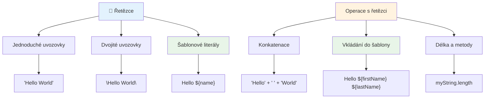
### Formátování řetězců

Manipulace s řetězci vám umožňuje kombinovat textové prvky, začleňovat proměnné a vytvářet dynamický obsah reagující na stav programu. Tato technika vám umožňuje text tvořit programově.

Často je potřeba spojit více řetězců dohromady – tento proces se nazývá konkatenace.
Pro **spojení** dvou nebo více řetězců, tedy jejich spojení dohromady, použijte operátor `+`.

```javascript
let myString1 = "Hello";
let myString2 = "World";

myString1 + myString2 + "!"; //Ahoj světe!
myString1 + " " + myString2 + "!"; //Ahoj světe!
myString1 + ", " + myString2 + "!"; //Ahoj, světe!
```

**Krok za krokem, co se děje:**
- **Spojuje** více řetězců pomocí operátoru `+`
- **Spojuje** řetězce přímo bez mezer v prvním příkladu
- **Přidává** mezery `" "` mezi řetězce pro lepší čitelnost
- **Vkládá** interpunkci jako čárky pro správné formátování

✅ Proč v JavaScriptu platí `1 + 1 = 2`, ale `'1' + '1' = 11`? Zamyslete se. A co `'1' + 1`?

**Šablonové literály** jsou další způsob formátování řetězců, místo uvozovek se používají zpětné apostrofy. Všechno, co není obyčejný text, musí být vloženo do zástupných znaků `${ }`. To zahrnuje i proměnné, které mohou být řetězci.

```javascript
let myString1 = "Hello";
let myString2 = "World";

`${myString1} ${myString2}!` //Ahoj světe!
`${myString1}, ${myString2}!` //Ahoj, světe!
```

**Pojďme si to vysvětlit:**
- **Používá** zpětné apostrofy `` ` `` místo obyčejných uvozovek pro šablonové literály
- **Vkládá** proměnné přímo pomocí `${}` syntaxe zástupných znaků
- **Zachovává** přesně mezery a formátování, jak je napsáno
- **Nabízí** čistší způsob vytváření složitých řetězců s proměnnými

Formátování můžete dosáhnout oběma způsoby, ale šablonové literály respektují všechny mezery a přerušení řádků.

✅ Kdy byste použili šablonový literál místo obyčejného řetězce?

### 🔤 **Ověření mistrovství v práci s řetězci: Sebevědomí v manipulaci s textem**

**Zhodnoťte své dovednosti s řetězci:**
- Dokážete vysvětlit, proč `'1' + '1'` je `'11'` místo `2`?
- Který způsob spojování řetězců vám přijde čitelnější: konkatenace nebo šablonové literály?
- Co se stane, když zapomenete uvozovky kolem řetězce?

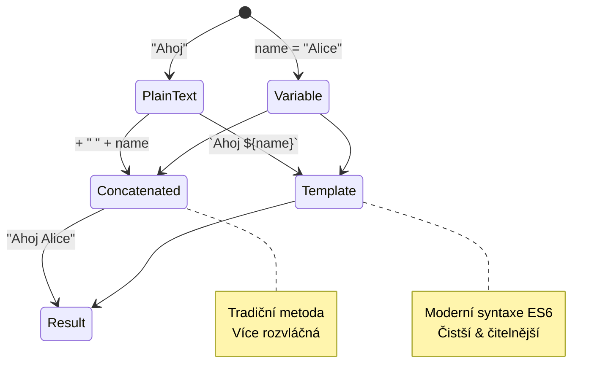
> **Profesionální tip**: Šablonové literály jsou obvykle preferovány pro složitější vytváření řetězců, protože jsou přehlednější a krásně zvládají víceřádkové řetězce!

### Boolean (logické hodnoty)

Booleany představují nejjednodušší formu dat: mohou mít pouze jednu ze dvou hodnot – `true` nebo `false`. Tento binární logický systém má původ v práci George Boola, matematika z 19. století, který vyvinul Booleovu algebru.

I přes svou jednoduchost jsou booleany nezbytné pro logiku programu. Umožňují kódu rozhodovat se na základě podmínek – jestli je uživatel přihlášen, jestli bylo stisknuto tlačítko, nebo zda jsou splněna určitá kritéria.

Booleany mohou mít pouze dvě hodnoty: `true` nebo `false`. Pomáhají rozhodnout, které části kódu se mají vykonat, když jsou splněny určité podmínky. V mnoha případech pomáhají [operátory](../../../../2-js-basics/1-data-types) nastavit hodnotu booleanu a často si všimnete a píšete proměnné, které jsou inicializovány nebo jejichž hodnoty jsou aktualizovány s pomocí operátoru.

```javascript
let myTrueBool = true;
let myFalseBool = false;
```

**Výše jsme:**
- **Vytvořili** proměnnou, která uchovává boolean `true`
- **Ukázali**, jak uložit boolean `false`
- **Použili** přesná klíčová slova `true` a `false` (bez uvozovek)
- **Připravili** tyto proměnné pro použití v podmínkách

✅ Proměnná může být považována za „truthy“, pokud se vyhodnotí jako boolean `true`. Zajímavé je, že v JavaScriptu [jsou všechny hodnoty truthy, pokud nejsou definovány jako falsy](https://developer.mozilla.org/docs/Glossary/Truthy).

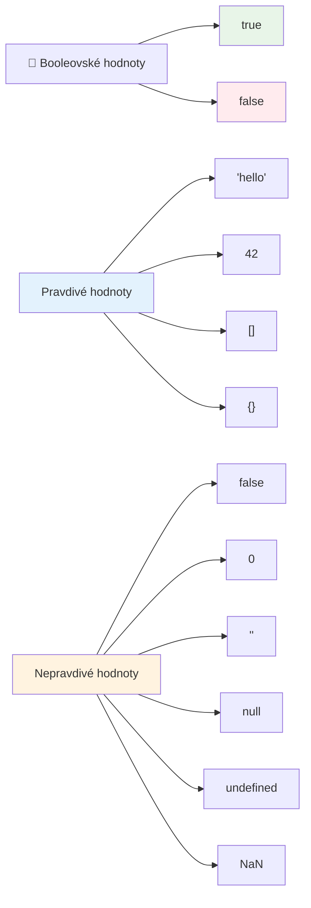
### 🎯 **Ověření logiky Boolean: Dovednosti rozhodování**

**Otestujte své pochopení booleanů:**
- Proč si myslíte, že JavaScript má kromě `true` a `false` i hodnoty "truthy" a "falsy"?
- Dokážete předpovědět, která z těchto hodnot je falsy: `0`, `"0"`, `[]`, `"false"`?
- Jak by mohly být booleany užitečné při řízení toku programu?

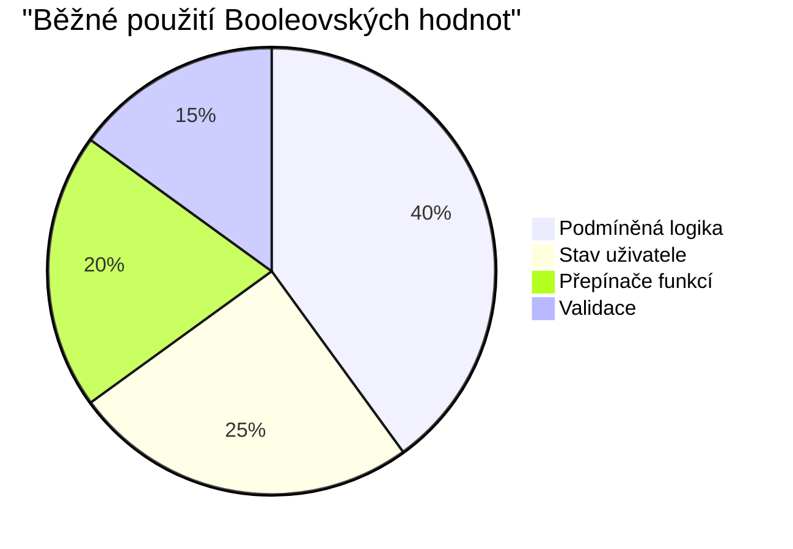
> **Pamatujte**: V JavaScriptu je pouze 6 hodnot, které jsou falsy: `false`, `0`, `""`, `null`, `undefined` a `NaN`. Vše ostatní je truthy!

---

## 📊 **Shrnutí vašeho nástroje pro datové typy**

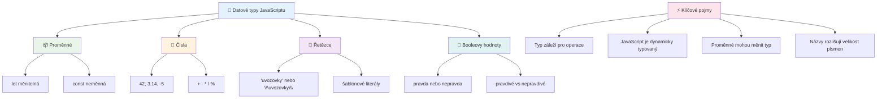
## Výzva GitHub Copilot Agenta 🚀

Použijte režim Agent k dokončení následující výzvy:

**Popis:** Vytvořte správce osobních informací, který demonstruje všechny datové typy JavaScriptu, které jste se v této lekci naučili, a přitom zpracovává reálné scénáře dat.

**Zadání:** Napište program v JavaScriptu, který vytvoří objekt profilu uživatele obsahující: jméno osoby (řetězec), věk (číslo), stav studenta (boolean), oblíbené barvy jako pole a objekt adresy se ulicí, městem a PSČ. Zahrňte funkce pro zobrazení informací profilu a aktualizaci jednotlivých polí. Ukažte konkatenaci řetězců, šablonové literály, aritmetické operace s věkem a logiku boolean pro stav studenta.

Více o [režimu agenta](https://code.visualstudio.com/blogs/2025/02/24/introducing-copilot-agent-mode) se dozvíte zde.

## 🚀 Výzva

JavaScript má některé vlastnosti, které mohou vývojáře překvapit. Zde je klasický příklad k prozkoumání: zkuste zadat do konzole prohlížeče: `let age = 1; let Age = 2; age == Age` a sledujte výsledek. Vrátí `false` – dokážete přijít na důvod?

To je jeden z mnoha fenomenů JavaScriptu, které stojí za to znát. Dobrá znalost těchto zvláštností vám pomůže psát spolehlivější kód a efektivněji odstraňovat chyby.

## Kvíz po přednášce
[Kvíz po přednášce](https://ff-quizzes.netlify.app)

## Přehled & Samostudium

Podívejte se na [tento seznam JavaScript cvičení](https://css-tricks.com/snippets/javascript/) a vyzkoušejte si jedno. Co jste se naučili?

## Zadání

[Procvičování datových typů](assignment.md)

## 🚀 Váš časový plán zvládnutí datových typů v JavaScriptu

### ⚡ **Co zvládnete během příštích 5 minut**
- [ ] Otevřete konzoli v prohlížeči a vytvořte 3 proměnné s různými datovými typy
- [ ] Vyzkoušejte výzvu: `let age = 1; let Age = 2; age == Age` a zjistěte, proč je výsledek false
- [ ] Procvičte si spojování řetězců s vaším jménem a oblíbeným číslem
- [ ] Otestujte, co se stane, když přidáte číslo k řetězci

### 🎯 **Co zvládnete během této hodiny**
- [ ] Dokončit kvíz po lekci a zopakovat případně nejasné pojmy
- [ ] Vytvořit mini kalkulačku pro sčítání, odčítání, násobení a dělení dvou čísel
- [ ] Vytvořit jednoduchý formátovač jmen pomocí šablonových literálů
- [ ] Prozkoumat rozdíly mezi operátory porovnání `==` a `===`
- [ ] Procvičit převody mezi různými datovými typy

### 📅 **Váš týdenní plán pro základy JavaScriptu**
- [ ] Dokončit zadání s jistotou a kreativitou
- [ ] Vytvořit osobní profilový objekt využívající všechny naučené datové typy
- [ ] Procvičit si [JavaScript cvičení z CSS-Tricks](https://css-tricks.com/snippets/javascript/)
- [ ] Vytvořit jednoduchý validátor formuláře využívající boolean logiku
- [ ] Experimentovat s datovými typy pole a objekt (náhled na další lekce)
- [ ] Připojit se k JavaScript komunitě a ptát se na datové typy

### 🌟 **Měsíční transformace**
- [ ] Začlenit znalosti datových typů do větších programátorských projektů
- [ ] Pochopit, kdy a proč použít který datový typ v reálných aplikacích
- [ ] Pomáhat ostatním začátečníkům porozumět základům JavaScriptu
- [ ] Vytvořit malou aplikaci pro správu různých typů uživatelských dat
- [ ] Prozkoumat pokročilé koncepce datových typů jako přetypování a přísné rovnosti
- [ ] Přispívat do open source JavaScript projektů vylepšením dokumentace

### 🧠 **Závěrečné ověření zvládnutí datových typů**

**Oslavte své základy JavaScriptu:**
- Který datový typ vás nejvíce překvapil svým chováním?
- Jak pohodlně se cítíte vysvětlovat proměnné vs. konstanty příteli?
- Co nejzajímavějšího jste objevili o typovém systému JavaScriptu?
- Jakou reálnou aplikaci si dokážete představit, že vytvoříte s těmito základy?

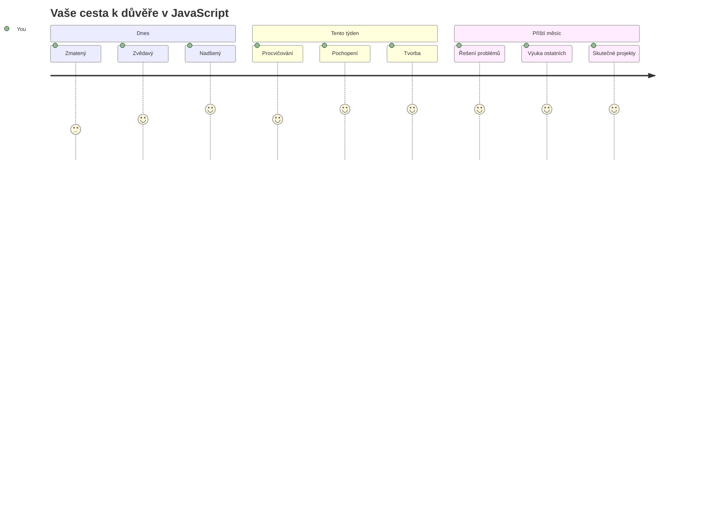
> 💡 **Postavili jste základy!** Pochopení datových typů je jako naučit se abecedu před psaním příběhů. Každý JavaScriptový program, který kdy napíšete, bude používat tyto základní koncepty. Nyní máte stavební kameny k vytváření interaktivních webů, dynamických aplikací a řešení skutečných problémů pomocí kódu. Vítejte ve skvělém světě JavaScriptu! 🎉

---

<!-- CO-OP TRANSLATOR DISCLAIMER START -->
**Prohlášení o vyloučení odpovědnosti**:  
Tento dokument byl přeložen pomocí AI překladatelské služby [Co-op Translator](https://github.com/Azure/co-op-translator). Přestože usilujeme o přesnost, mějte prosím na paměti, že automatické překlady mohou obsahovat chyby nebo nepřesnosti. Původní dokument v jeho rodném jazyce by měl být považován za autoritativní zdroj. Pro kritické informace je doporučeno využít profesionální lidský překlad. Nejsme odpovědní za jakékoliv nedorozumění nebo mylné interpretace vzniklé použitím tohoto překladu.
<!-- CO-OP TRANSLATOR DISCLAIMER END -->