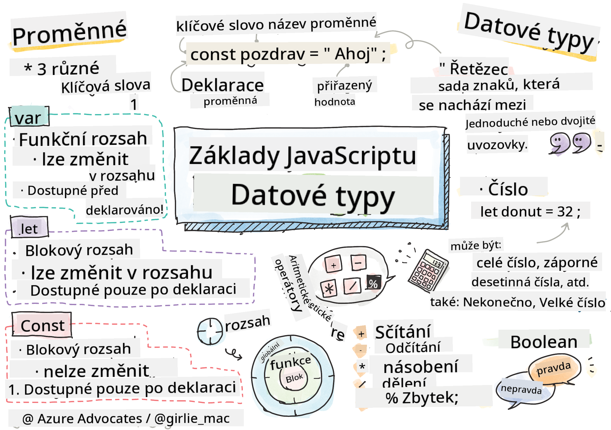

<!--
CO_OP_TRANSLATOR_METADATA:
{
  "original_hash": "d0092f6533ae3ec3adad5b5ece68efaf",
  "translation_date": "2025-10-24T20:40:52+00:00",
  "source_file": "2-js-basics/1-data-types/README.md",
  "language_code": "cs"
}
-->
# Základy JavaScriptu: Datové typy


> Sketchnote od [Tomomi Imura](https://twitter.com/girlie_mac)

Datové typy jsou jedním ze základních konceptů v JavaScriptu, se kterými se setkáte v každém programu, který napíšete. Představte si datové typy jako systém třídění, který používali starověcí knihovníci v Alexandrii – měli specifická místa pro svitky obsahující poezii, matematiku a historické záznamy. JavaScript organizuje informace podobným způsobem s různými kategoriemi pro různé druhy dat.

V této lekci prozkoumáme základní datové typy, díky kterým JavaScript funguje. Naučíte se pracovat s čísly, textem, hodnotami pravda/nepravda a pochopíte, proč je výběr správného typu zásadní pro vaše programy. Tyto koncepty se mohou zpočátku zdát abstraktní, ale s praxí se stanou samozřejmostí.

Porozumění datovým typům vám vše ostatní v JavaScriptu značně objasní. Stejně jako architekti potřebují rozumět různým stavebním materiálům před stavbou katedrály, tyto základy podpoří vše, co budete v budoucnu vytvářet.

## Kvíz před lekcí
[Kvíz před lekcí](https://ff-quizzes.netlify.app/web/)

Tato lekce pokrývá základy JavaScriptu, jazyka, který poskytuje interaktivitu na webu.

> Tuto lekci si můžete projít na [Microsoft Learn](https://docs.microsoft.com/learn/modules/web-development-101-variables/?WT.mc_id=academic-77807-sagibbon)!

[](https://youtube.com/watch?v=JNIXfGiDWM8 "Proměnné v JavaScriptu")

[](https://youtube.com/watch?v=AWfA95eLdq8 "Datové typy v JavaScriptu")

> 🎥 Klikněte na obrázky výše pro videa o proměnných a datových typech

Začněme s proměnnými a datovými typy, které je naplňují!

## Proměnné

Proměnné jsou základní stavební kameny v programování. Stejně jako označené nádoby, které středověcí alchymisté používali k uchovávání různých látek, vám proměnné umožňují ukládat informace a dát jim popisný název, abyste se na ně mohli později odkazovat. Potřebujete si zapamatovat něčí věk? Uložte ho do proměnné nazvané `age`. Chcete sledovat jméno uživatele? Uchovejte ho v proměnné nazvané `userName`.

Zaměříme se na moderní přístup k vytváření proměnných v JavaScriptu. Techniky, které se zde naučíte, představují roky vývoje jazyka a osvědčené postupy vyvinuté programátorskou komunitou.

Vytvoření a **deklarace** proměnné má následující syntaxi **[klíčové slovo] [název]**. Skládá se ze dvou částí:

- **Klíčové slovo**. Použijte `let` pro proměnné, které se mohou měnit, nebo `const` pro hodnoty, které zůstávají stejné.
- **Název proměnné**, což je popisný název, který si sami zvolíte.

✅ Klíčové slovo `let` bylo zavedeno v ES6 a poskytuje vaší proměnné tzv. _blokový rozsah_. Doporučuje se používat `let` nebo `const` místo staršího klíčového slova `var`. Blokové rozsahy probereme podrobněji v dalších částech.

### Úkol - práce s proměnnými

1. **Deklarujte proměnnou**. Začněme vytvořením naší první proměnné:

    ```javascript
    let myVariable;
    ```

   **Co to provádí:**
   - Říká JavaScriptu, aby vytvořil úložné místo nazvané `myVariable`
   - JavaScript přidělí paměťový prostor pro tuto proměnnou
   - Proměnná zatím nemá žádnou hodnotu (undefined)

2. **Přiřaďte jí hodnotu**. Nyní vložme něco do naší proměnné:

    ```javascript
    myVariable = 123;
    ```

   **Jak funguje přiřazení:**
   - Operátor `=` přiřazuje hodnotu 123 naší proměnné
   - Proměnná nyní obsahuje tuto hodnotu místo toho, aby byla undefined
   - Tuto hodnotu můžete odkazovat v celém svém kódu pomocí `myVariable`

   > Poznámka: použití `=` v této lekci znamená, že používáme "přiřazovací operátor", který slouží k nastavení hodnoty proměnné. Neoznačuje rovnost.

3. **Uděláme to chytře**. Vlastně, pojďme tyto dva kroky spojit:

    ```javascript
    let myVariable = 123;
    ```

    **Tento přístup je efektivnější:**
    - Deklarujete proměnnou a přiřazujete hodnotu v jednom příkazu
    - Toto je standardní praxe mezi vývojáři
    - Zkracuje délku kódu při zachování přehlednosti

4. **Změňte názor**. Co když chceme uložit jiné číslo?

   ```javascript
   myVariable = 321;
   ```

   **Porozumění přepisování:**
   - Proměnná nyní obsahuje 321 místo 123
   - Předchozí hodnota je nahrazena – proměnné uchovávají pouze jednu hodnotu najednou
   - Tato mutabilita je klíčovou vlastností proměnných deklarovaných pomocí `let`

   ✅ Vyzkoušejte to! Můžete psát JavaScript přímo ve svém prohlížeči. Otevřete okno prohlížeče a přejděte do Nástrojů pro vývojáře. V konzoli najdete výzvu; napište `let myVariable = 123`, stiskněte Enter, poté napište `myVariable`. Co se stane? Poznámka: o těchto konceptech se dozvíte více v následujících lekcích.

## Konstanty

Někdy potřebujete uložit informace, které by se během provádění programu nikdy neměly změnit. Představte si konstanty jako matematické principy, které Euclid stanovil ve starověkém Řecku – jakmile byly prokázány a zdokumentovány, zůstaly pevné pro všechny budoucí odkazy.

Konstanty fungují podobně jako proměnné, ale s důležitým omezením: jakmile jim přiřadíte hodnotu, nemůže být změněna. Tato neměnnost pomáhá zabránit náhodným úpravám kritických hodnot ve vašem programu.

Deklarace a inicializace konstanty se řídí stejnými principy jako proměnná, s výjimkou klíčového slova `const`. Konstanty jsou obvykle deklarovány velkými písmeny.

```javascript
const MY_VARIABLE = 123;
```

**Co tento kód provádí:**
- **Vytváří** konstantu nazvanou `MY_VARIABLE` s hodnotou 123
- **Používá** konvenci pojmenování velkými písmeny pro konstanty
- **Zabraňuje** jakýmkoli budoucím změnám této hodnoty

Konstanty mají dvě hlavní pravidla:

- **Musíte jim ihned přiřadit hodnotu** – prázdné konstanty nejsou povoleny!
- **Nikdy nemůžete tuto hodnotu změnit** – JavaScript vyvolá chybu, pokud se o to pokusíte. Podívejme se, co tím myslím:

   **Jednoduchá hodnota** - Následující NENÍ povoleno:
   
      ```javascript
      const PI = 3;
      PI = 4; // není povoleno
      ```

   **Co si zapamatovat:**
   - **Pokusy** o přepsání konstanty způsobí chybu
   - **Chrání** důležité hodnoty před náhodnými změnami
   - **Zajišťuje**, že hodnota zůstane konzistentní v celém programu
 
   **Odkaz na objekt je chráněn** - Následující NENÍ povoleno:
   
      ```javascript
      const obj = { a: 3 };
      obj = { b: 5 } // není povoleno
      ```

   **Porozumění těmto konceptům:**
   - **Zabraňuje** nahrazení celého objektu novým
   - **Chrání** odkaz na původní objekt
   - **Udržuje** identitu objektu v paměti

    **Hodnota objektu není chráněna** - Následující JE povoleno:
    
      ```javascript
      const obj = { a: 3 };
      obj.a = 5;  // povoleno
      ```

      **Rozbor toho, co se zde děje:**
      - **Upravuje** hodnotu vlastnosti uvnitř objektu
      - **Zachovává** stejný odkaz na objekt
      - **Ukazuje**, že obsah objektu se může změnit, zatímco odkaz zůstává konstantní

   > Poznámka, `const` znamená, že odkaz je chráněn před přepsáním. Hodnota však není _neměnná_ a může se změnit, zejména pokud jde o složitou strukturu, jako je objekt.

## Datové typy

JavaScript organizuje informace do různých kategorií nazývaných datové typy. Tento koncept odráží, jak starověcí učenci kategorizovali znalosti – Aristoteles rozlišoval mezi různými typy uvažování, věděl, že logické principy nelze jednotně aplikovat na poezii, matematiku a přírodní filozofii.

Datové typy jsou důležité, protože různé operace fungují s různými druhy informací. Stejně jako nemůžete provádět aritmetiku na jménu osoby nebo abecedně seřadit matematickou rovnici, JavaScript vyžaduje vhodný datový typ pro každou operaci. Porozumění tomu zabraňuje chybám a činí váš kód spolehlivějším.

Proměnné mohou uchovávat mnoho různých typů hodnot, jako jsou čísla a text. Tyto různé typy hodnot jsou známé jako **datové typy**. Datové typy jsou důležitou součástí vývoje softwaru, protože pomáhají vývojářům rozhodovat o tom, jak by měl být kód napsán a jak by měl software fungovat. Navíc některé datové typy mají jedinečné vlastnosti, které pomáhají transformovat nebo extrahovat další informace z hodnoty.

✅ Datové typy jsou také označovány jako primitivní datové typy JavaScriptu, protože jsou nejnižší úrovní datových typů poskytovaných jazykem. Existuje 7 primitivních datových typů: string, number, bigint, boolean, undefined, null a symbol. Udělejte si chvíli na vizualizaci, co každý z těchto primitivů může představovat. Co je `zebra`? A co `0`? `true`?

### Čísla

Čísla jsou nejjednodušším datovým typem v JavaScriptu. Ať už pracujete s celými čísly jako 42, desetinnými čísly jako 3.14 nebo zápornými čísly jako -5, JavaScript s nimi zachází jednotně.

Pamatujete si naši proměnnou z dřívějška? Těch 123, které jsme uložili, bylo vlastně datový typ číslo:

```javascript
let myVariable = 123;
```

**Klíčové vlastnosti:**
- JavaScript automaticky rozpoznává číselné hodnoty
- S těmito proměnnými můžete provádět matematické operace
- Není nutné explicitně deklarovat typ

Proměnné mohou uchovávat všechny typy čísel, včetně desetinných nebo záporných čísel. Čísla lze také použít s aritmetickými operátory, které jsou pokryty v [další části](../../../../2-js-basics/1-data-types).

### Aritmetické operátory

Aritmetické operátory vám umožňují provádět matematické výpočty v JavaScriptu. Tyto operátory se řídí stejnými principy, které matematici používali po staletí – stejnými symboly, které se objevily v dílech učenců jako Al-Chvárizmí, který vyvinul algebraickou notaci.

Operátory fungují tak, jak byste očekávali od tradiční matematiky: plus pro sčítání, mínus pro odčítání a tak dále.

Existuje několik typů operátorů, které lze použít při provádění aritmetických funkcí, a některé z nich jsou uvedeny zde:

| Symbol | Popis                                                                  | Příklad                          |
| ------ | ---------------------------------------------------------------------- | -------------------------------- |
| `+`    | **Sčítání**: Vypočítá součet dvou čísel                                | `1 + 2 //očekávaný výsledek je 3`   |
| `-`    | **Odčítání**: Vypočítá rozdíl dvou čísel                               | `1 - 2 //očekávaný výsledek je -1`  |
| `*`    | **Násobení**: Vypočítá součin dvou čísel                               | `1 * 2 //očekávaný výsledek je 2`   |
| `/`    | **Dělení**: Vypočítá podíl dvou čísel                                  | `1 / 2 //očekávaný výsledek je 0.5` |
| `%`    | **Zbytek**: Vypočítá zbytek z dělení dvou čísel                        | `1 % 2 //očekávaný výsledek je 1`   |

✅ Vyzkoušejte to! Vyzkoušejte aritmetickou operaci v konzoli vašeho prohlížeče. Překvapily vás výsledky?

### Řetězce

V JavaScriptu jsou textová data reprezentována jako řetězce. Termín "řetězec" pochází z konceptu znaků spojených dohromady v sekvenci, podobně jako písaři ve středověkých klášterech spojovali písmena, aby vytvořili slova a věty ve svých rukopisech.

Řetězce jsou základní pro vývoj webu. Každý text zobrazený na webové stránce – uživatelská jména, popisky tlačítek, chybové zprávy, obsah – je zpracován jako textová data. Porozumění řetězcům je nezbytné pro vytváření funkčních uživatelských rozhraní.

Řetězce jsou sady znaků, které se nacházejí mezi jednoduchými nebo dvojitými uvozovkami.

```javascript
'This is a string'
"This is also a string"
let myString = 'This is a string value stored in a variable';
```

**Porozumění těmto konceptům:**
- **Používá** buď jednoduché `'` nebo dvojité `"` uvozovky k definování řetězců
- **Ukládá** textová data, která mohou obsahovat písmena, čísla a symboly
- **Přiřazuje** hodnoty řetězců proměnným pro pozdější použití
- **Vyžaduje** uvozovky k odlišení textu od názvů proměnných

Pamatujte, že při psaní řetězce musíte použít uvozovky, jinak JavaScript předpokládá, že se jedná o název proměnné.

### Formátování řetězců

Manipulace s řetězci vám umožňuje kombinovat textové prvky, začlenit proměnné a vytvářet dynamický obsah, který reaguje na stav programu. Tato technika vám umožňuje programově vytvářet text.

Často potřebujete spojit více řetězců dohromady – tento proces se nazývá konkatenace.

Pro **konkatenaci** dvou nebo více řetězců, nebo jejich spojení, použijte operátor `+`.

```javascript
let myString1 = "Hello";
let myString2 = "World";

myString1 + myString2 + "!"; //HelloWorld!
myString1 + " " + myString2 + "!"; //Hello World!
myString1 + ", " + myString2 + "!"; //Hello, World!
```

**Krok za krokem, co se děje:**
- **Spojuje** více řetězců pomocí operátoru `+`
- **Přímo** spojuje řetězce bez mezer v prvním příkladu
- **Přidává** mezery `" "` mezi řetězce pro čitelnost
- **Vkládá** interpunkci, jako jsou čárky, pro správné formátování

✅ Proč v JavaScriptu `1 + 1 = 2`, ale
Můžete dosáhnout svých cílů formátování pomocí obou metod, ale šablonové literály respektují mezery a zalomení řádků.

✅ Kdy byste použili šablonový literál místo obyčejného řetězce?

### Booleany

Booleany představují nejjednodušší formu dat: mohou obsahovat pouze jednu ze dvou hodnot – `true` nebo `false`. Tento binární logický systém má kořeny v práci George Boolea, matematika z 19. století, který vyvinul Booleovu algebru.

Navzdory své jednoduchosti jsou booleany zásadní pro logiku programů. Umožňují vašemu kódu rozhodovat na základě podmínek – zda je uživatel přihlášen, zda bylo kliknuto na tlačítko nebo zda byly splněny určité kritéria.

Booleany mohou mít pouze dvě hodnoty: `true` nebo `false`. Booleany pomáhají rozhodovat, které řádky kódu by měly být spuštěny, když jsou splněny určité podmínky. V mnoha případech [operátory](../../../../2-js-basics/1-data-types) pomáhají nastavit hodnotu booleanu a často si všimnete, že proměnné jsou inicializovány nebo jejich hodnoty aktualizovány pomocí operátoru.

```javascript
let myTrueBool = true;
let myFalseBool = false;
```

**V uvedeném příkladu jsme:**
- **Vytvořili** proměnnou, která ukládá hodnotu booleanu `true`
- **Ukázali**, jak uložit hodnotu booleanu `false`
- **Použili** přesná klíčová slova `true` a `false` (není potřeba uvozovek)
- **Připravili** tyto proměnné pro použití v podmínkových výrazech

✅ Proměnná může být považována za 'pravdivou', pokud se vyhodnotí jako boolean `true`. Zajímavé je, že v JavaScriptu jsou [všechny hodnoty pravdivé, pokud nejsou definovány jako nepravdivé](https://developer.mozilla.org/docs/Glossary/Truthy).

---

## Výzva GitHub Copilot Agent 🚀

Použijte režim Agent k dokončení následující výzvy:

**Popis:** Vytvořte správce osobních informací, který demonstruje všechny datové typy JavaScriptu, které jste se v této lekci naučili, a zároveň zpracovává scénáře z reálného světa.

**Zadání:** Vytvořte program v JavaScriptu, který vytvoří objekt uživatelského profilu obsahující: jméno osoby (řetězec), věk (číslo), status studenta (boolean), oblíbené barvy jako pole a objekt adresy s vlastnostmi ulice, město a PSČ. Zahrňte funkce pro zobrazení informací o profilu a aktualizaci jednotlivých polí. Ujistěte se, že demonstrujete spojování řetězců, šablonové literály, aritmetické operace s věkem a logiku booleanu pro status studenta.

Zjistěte více o [režimu agent](https://code.visualstudio.com/blogs/2025/02/24/introducing-copilot-agent-mode) zde.

## 🚀 Výzva

JavaScript má některé chování, které může vývojáře překvapit. Zde je klasický příklad k prozkoumání: zkuste zadat toto do konzole vašeho prohlížeče: `let age = 1; let Age = 2; age == Age` a pozorujte výsledek. Vrátí `false` – dokážete zjistit proč?

Toto je jeden z mnoha JavaScriptových jevů, které stojí za to pochopit. Znalost těchto zvláštností vám pomůže psát spolehlivější kód a efektivněji ladit problémy.

## Kvíz po přednášce
[Kvíz po přednášce](https://ff-quizzes.netlify.app)

## Přehled & Samostudium

Podívejte se na [tento seznam JavaScriptových cvičení](https://css-tricks.com/snippets/javascript/) a zkuste jedno. Co jste se naučili?

## Úkol

[Procvičování datových typů](assignment.md)

---

**Prohlášení**:  
Tento dokument byl přeložen pomocí služby AI pro překlad [Co-op Translator](https://github.com/Azure/co-op-translator). I když se snažíme o přesnost, mějte prosím na paměti, že automatizované překlady mohou obsahovat chyby nebo nepřesnosti. Původní dokument v jeho původním jazyce by měl být považován za autoritativní zdroj. Pro důležité informace se doporučuje profesionální lidský překlad. Neodpovídáme za žádná nedorozumění nebo nesprávné interpretace vyplývající z použití tohoto překladu.